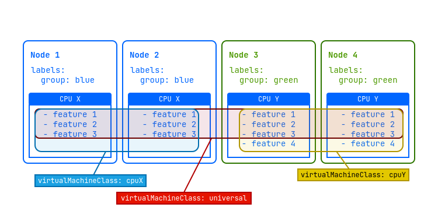
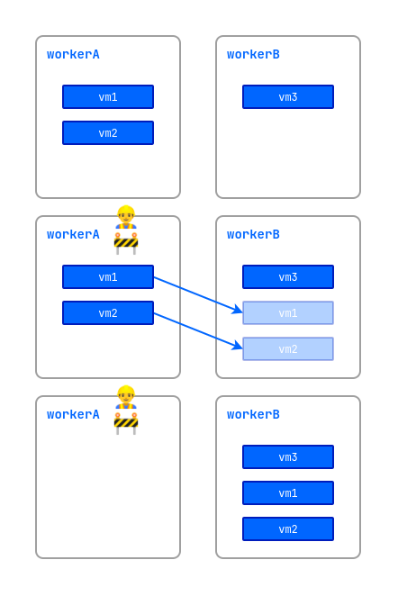
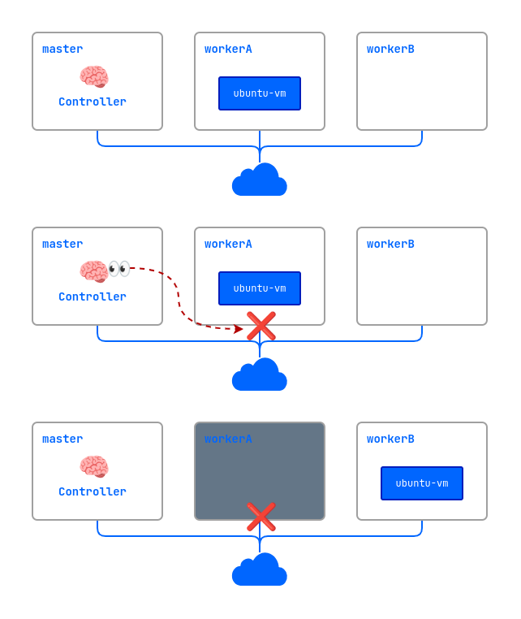

## Introduction

This guide is intended for administrators of Deckhouse Virtualization Platform (DVP) and describes how to create and modify cluster resources.

The administrator also has rights to manage project resources, which are described in the [User guide](./user_guide.html).

## Module Parameters

The configuration of the virtualization module is specified via the ModuleConfig resource in YAML format. The following is an example of a basic configuration:


```yaml
apiVersion: deckhouse.io/v1alpha1
kind: ModuleConfig
metadata:
  name: virtualization
spec:
  enabled: true
  version: 1
  settings:
    dvcr:
      storage:
        persistentVolumeClaim:
          size: 50G
          storageClassName: sds-replicated-thin-r1
        type: PersistentVolumeClaim
    virtualMachineCIDRs:
      - 10.66.10.0/24

```

Parameter description

1. **Module enable/disable**

    The module state is controlled through the `.spec.enabled` field. Specify:
    - `true` - activate the module
    - `false` - deactivate the module.

2. **Configuration version**

    The `.spec.version` parameter defines the version of the configuration schema. The parameter structure may - change between versions. The current values are given in the settings section .

3. **Deckhouse Virtualization Container Registry (DVCR)**

   The `.spec.settings.dvcr.storage` block configures a persistent volume for storing images:
  - The size of the volume is `.spec.settings.dvcr.storage.persistentVolumeClaim.size` (for example - 50G). To expand the storage, increase the value of the parameter.
  - Storage class - `.spec.settings.dvcr.storage.persistentVolumeClaim.storageClassName` - (for example, sds-replicated-thin-r1).

4. **Network Settings**.

    The `.spec.settings.virtualMachineCIDRs` block specifies subnets in CIDR format (for example, 10.66.10.0/24). IP addresses for virtual machines are allocated from these - ranges automatically or on request.

    Example:

    ```yaml
    spec:
      settings:
        virtualMachineCIDRs:
          - 10.66.10.0/24
          - 10.66.20.0/24
          - 10.77.20.0/16
    ```

    The first and last subnet address is reserved and not available for use.

    
    The `.spec.settings.virtualMachineCIDRs` block subnets must not overlap with:
    - cluster node subnets;
    - services subnet;
    - pods subnet (podCIDRs).

    It is forbidden to delete subnets if addresses from them have already been issued to virtual machines!
    

5. **Storage class settings for images**

    The storage class settings for images are defined in the `.spec.settings.virtualImages` parameter of the module settings.

    Example:

    ```yaml
    spec:
      ...
      settings:
        virtualImages:
          allowedStorageClassNames:
          - sc-1
          - sc-2
          defaultStorageClassName: sc-1
    ```

    - `allowedStorageClassNames` (optional): A list of the allowed StorageClass for creating a `VirtualImage` that can be explicitly specified in the resource specification.
    - `defaultStorageClassName`(optional): The StorageClass used by default when creating a `VirtualImage` if the `.spec.persistentVolumeClaim.storageClassName` parameter is not set.

6. **Storage Class Settings for Disks**

    The storage class settings for disks are defined in the `.spec.settings.virtualDisks` parameter of the module settings.

    Example:

    ```yaml
    spec:
      ...
      settings:
        virtualDisks:
          allowedStorageClassNames:
          - sc-1
          - sc-2
          defaultStorageClassName: sc-1
    ```

    - `allowedStorageClassNames` (optional): A list of the allowed StorageClass for creating a `VirtualDisk` that can be explicitly specified in the resource specification.
    - `defaultStorageClassName` (optional): The StorageClass used by default when creating a `VirtualDisk` if the `.spec.persistentVolumeClaim.storageClassName` parameter is not specified.

## Images

The ClusterVirtualImage resource is used to load virtual machine images into the intra-cluster storage. After that it can be used to create virtual machine disks. It is available in all cluster namespaces and projects.

The image creation process includes the following steps:

- The user creates a ClusterVirtualImage resource.
- Once created, the image is automatically uploaded from the source specified in the specification to the storage (DVCR).
- Once the upload is complete, the resource becomes available for disk creation.

There are different types of images:

- **ISO image**: An installation image used for the initial installation of an operating system. Such images are released by OS vendors and are used for installation on physical and virtual servers.
- **Preinstalled disk image**: contains an already installed and configured operating system ready for use after the virtual machine is created. Ready images can be obtained from the distribution developers' resources or created by yourself.

Examples of resources for obtaining virtual machine images:

- Ubuntu
  - [24.04 LTS (Noble Numbat)](https://cloud-images.ubuntu.com/noble/current/)
  - [22.04 LTS (Jammy Jellyfish)](https://cloud-images.ubuntu.com/jammy/current/)
  - [20.04 LTS (Focal Fossa)](https://cloud-images.ubuntu.com/focal/current/)
  - [Minimal images](https://cloud-images.ubuntu.com/minimal/releases/)
- Debian
  - [12 bookworm](https://cdimage.debian.org/images/cloud/bookworm/latest/)
  - [11 bullseye](https://cdimage.debian.org/images/cloud/bullseye/latest/)
- RockyLinux
  - [9.5](https://download.rockylinux.org/pub/rocky/9.5/images/x86_64/)
  - [8.10](https://download.rockylinux.org/pub/rocky/8.10/images/x86_64/)
- CentOS
  - [10 Stream](https://cloud.centos.org/centos/10-stream/x86_64/images/)
  - [9 Stream](https://cloud.centos.org/centos/9-stream/x86_64/images/)
  - [8 Stream](https://cloud.centos.org/centos/8-stream/x86_64/)
  - [8](https://cloud.centos.org/centos/8/x86_64/images/)

The following preinstalled image formats are supported:

- qcow2
- raw
- vmdk
- vdi

Image files can also be compressed with one of the following compression algorithms: gz, xz.

Once a resource is created, the image type and size are automatically determined, and this information is reflected in the resource status.

Images can be downloaded from various sources, such as HTTP servers where image files are located or container registries. It is also possible to download images directly from the command line using the `curl` utility.

Images can be created from other images and virtual machine disks.

For a full description of the ClusterVirtualImage resource configuration parameters, refer to [Custom Resources](cr.html#clustervirtualimage).

### Creating an image from an HTTP server

In this example, let's create a cluster image.

Run the following command to create a ClusterVirtualImage resource:

```yaml
d8 k apply -f - <<EOF
apiVersion: virtualization.deckhouse.io/v1alpha2
kind: ClusterVirtualImage
metadata:
  name: ubuntu-22-04
spec:
  # Source for creating an image.
  dataSource:
    type: HTTP
    http:
      url: "https://cloud-images.ubuntu.com/minimal/releases/jammy/release/ubuntu-22.04-minimal-cloudimg-amd64.img"
EOF
```

To verify that the ClusterVirtualImage has been created, run the following command:

```bash
d8 k get clustervirtualimage ubuntu-22-04
# Or use a shorter version of this command.
d8 k get cvi ubuntu-22-04
```

In the output, you should see information about the resource:

```console
NAME           PHASE   CDROM   PROGRESS   AGE
ubuntu-22-04   Ready   false   100%       23h
```

Once created, the ClusterVirtualImage resource can be in one of the following states (phases):

- `Pending`: Waiting for all dependent resources required for image creation to be ready.
- `WaitForUserUpload`: Waiting for the user to upload the image (this phase is present only for `type=Upload`).
- `Provisioning`: The image is being created.
- `Ready`: The image has been created and is ready for use.
- `Failed`: An error occurred when creating the image.
- `Terminating`: The image is being deleted. It may "get stuck" in this state if it is still connected to the virtual machine.

As long as the image has not entered the `Ready` phase, the contents of the `.spec` block can be changed. If you change it, the disk creation process will start again. Once it is in the `Ready` phase, the `.spec` block contents **cannot be changed**.

Diagnosing problems with a resource is done by analyzing the information in the `.status.conditions` block.

You can trace the image creation process by adding the `-w` key to the previous command:

```bash
d8 k get cvi ubuntu-22-04 -w
```

Example output:

```console
NAME           PHASE          CDROM   PROGRESS   AGE
ubuntu-22-04   Provisioning   false              4s
ubuntu-22-04   Provisioning   false   0.0%       4s
ubuntu-22-04   Provisioning   false   28.2%      6s
ubuntu-22-04   Provisioning   false   66.5%      8s
ubuntu-22-04   Provisioning   false   100.0%     10s
ubuntu-22-04   Provisioning   false   100.0%     16s
ubuntu-22-04   Ready          false   100%       18s
```

You can get additional information about the downloaded image from the description of the ClusterVirtualImage resource.
To check on the description, run the following command:

```bash
d8 k describe cvi ubuntu-22-04
```

### Creating an image from a container registry

An image stored in a container registry has a certain format. Let's look at an example:

1. First, download the image locally:

   ```bash
   curl -L https://cloud-images.ubuntu.com/minimal/releases/jammy/release/ubuntu-22.04-minimal-cloudimg-amd64.img -o ubuntu2204.img
   ```

1. Next, create a `Dockerfile` with the following contents:

   ```Dockerfile
   FROM scratch
   COPY ubuntu2204.img /disk/ubuntu2204.img
   ```

1. Build the image and upload it to the container registry. The example below uses `docker.io` as the container registry. You would need to have a service account and a configured environment to run it.

   ```bash
   docker build -t docker.io/<username>/ubuntu2204:latest
   ```

   Where `username` is the username specified when registering at `docker.io`.

1. Upload the created image to the container registry:

   ```bash
   docker push docker.io/<username>/ubuntu2204:latest
   ```

1. To use this image, create a resource as an example:

   ```yaml
   d8 k apply -f - <<EOF
   apiVersion: virtualization.deckhouse.io/v1alpha2
   kind: ClusterVirtualImage
   metadata:
     name: ubuntu-2204
   spec:
     dataSource:
       type: ContainerImage
       containerImage:
         image: docker.io/<username>/ubuntu2204:latest
   EOF
   ```

### Uploading an image via CLI

1. To upload an image using CLI, first create the following resource as shown below with the ClusterVirtualImage example:

   ```yaml
   d8 k apply -f - <<EOF
   apiVersion: virtualization.deckhouse.io/v1alpha2
   kind: ClusterVirtualImage
   metadata:
     name: some-image
   spec:
     dataSource:
       type: Upload
   EOF
   ```

   Once created, the resource will enter the `WaitForUserUpload` phase, which means it is ready for uploading the image.

1. There are two options available for uploading — from a cluster node and from an arbitrary node outside the cluster:

   ```bash
   d8 k get cvi some-image -o jsonpath="{.status.imageUploadURLs}"  | jq
   ```

   Example output:

   ```console
   {
     "external":"https://virtualization.example.com/upload/g2OuLgRhdAWqlJsCMyNvcdt4o5ERIwmm",
     "inCluster":"http://10.222.165.239/upload"
   }
   ```

   - inCluster - this URL is used if you want to download the image directly from one of the cluster nodes
   - external - used in all other cases

1. As an example, download the Cirros image:

   ```bash
   curl -L http://download.cirros-cloud.net/0.5.1/cirros-0.5.1-x86_64-disk.img -o cirros.img
   ```

1. Upload the image using the following command:

   ```bash
   curl https://virtualization.example.com/upload/g2OuLgRhdAWqlJsCMyNvcdt4o5ERIwmm --progress-bar -T cirros.img | cat
   ```

1. After the upload is complete, the image should have been created and entered the `Ready` phase:
   To verify this, run the following command:

   ```bash
   d8 k get cvi some-image
   ```

   Example output:

   ```console
   NAME         PHASE   CDROM   PROGRESS   AGE
   some-image   Ready   false   100%       1m
   ```

## Virtual machine classes

The VirtualMachineClass resource is designed for centralized configuration of preferred virtual machine settings. It allows you to define CPU instructions, configuration policies for CPU and memory resources for virtual machines, as well as define ratios of these resources. In addition, VirtualMachineClass provides management of virtual machine placement across platform nodes. This allows administrators to effectively manage virtualization platform resources and optimally place virtual machines on platform nodes.

The VirtualMachineClass resource structure is as follows:

```yaml
apiVersion: virtualization.deckhouse.io/v1alpha2
kind: VirtualMachineClass
metadata:
  name: <vmclass-name>
spec:
  # The section describes virtual processor parameters for virtual machines.
  # This block cannot be changed after the resource has been created.
  cpu: ...

  # (optional) Describes the rules for allocating virtual machines between nodes.
  # When changed, it is automatically applied to all virtual machines using this VirtualMachineClass.
  nodeSelector: ...

  # (optional) Describes the sizing policy for configuring virtual machine resources.
  # When changed, it is automatically applied to all virtual machines using this VirtualMachineClass.
  sizingPolicies: ...
```


Since changing the `.spec.nodeSelector` parameter affects all virtual machines using this `VirtualMachineClass`, consider the following:

- For the Enterprise edition, this may cause virtual machines to be migrated to new destination nodes if the current nodes do not meet placement requirements.
- For the Community edition, this may cause virtual machines to restart according to the automatic change application policy set in the `.spec.disruptions.restartApprovalMode` parameter.


DVP provides three predefined VirtualMachineClass resources.
To get information on these resources, run the following command:

```bash
d8 k get virtualmachineclass
```

Example output:

```console
NAME               PHASE   AGE
host               Ready   6d1h
host-passthrough   Ready   6d1h
generic            Ready   6d1h
```

- `host`: This class uses a virtual CPU with an instruction set that is closely matching the platform node's CPU. This provides high performance and functionality, as well as compatibility with "live" migration for nodes with similar processor types. For example, you can't migrate a VM from an Intel-based node to an AMD-based node. This is also true for different generations of processors, as their instruction set is different.
- `host-passthrough`: Uses a physical CPU of the platform node directly, without any modifications. When using this class, a guest VM can only be migrated to a target node that has a CPU exactly matching the CPU of the source node.
- `generic`: A universal CPU model that uses the Nehalem microarchitecture, which is fairly old but still supported by the most modern CPUs. This allows running VMs on any node within a cluster with the "live" migration capability.

Make sure to specify the VirtualMachineClass resource in the virtual machine configuration.
The following is an example of specifying a class in the VM specification:

```yaml
apiVersion: virtualization.deckhouse.io/v1alpha2
kind: VirtualMachine
metadata:
  name: linux-vm
spec:
  virtualMachineClassName: generic # VirtualMachineClass resource name.
  ...
```


It is recommended that you create at least one VirtualMachineClass resource in the cluster with the `Discovery` type immediately after all nodes are configured and added to the cluster. This allows virtual machines to utilize a generic CPU with the highest possible CPU performance considering the CPUs on the cluster nodes. This allows the virtual machines to utilize the maximum CPU capabilities and migrate seamlessly between cluster nodes if necessary.


DVP administrators can create the required classes of virtual machines according to their needs, but a general recommendation is to at least create the required minimum. Consider examples from the following sections.

### VirtualMachineClass configuration example



Let's imagine that we have a cluster of four nodes. Two of these nodes labeled `group=blue` have a "CPU X" processor with three instruction sets, and the other two nodes labeled `group=green` have a newer "CPU Y" processor with four instruction sets.

To optimally utilize the resources of this cluster, it is recommended that you create three additional virtual machine classes (VirtualMachineClass):

- `universal`: This class will allow virtual machines to run on all nodes in the platform and migrate between them. It will use the instruction set for the lowest CPU model to ensure the greatest compatibility.
- `cpuX`: This class will be for virtual machines that should only run on nodes with a "CPU X" processor. VMs will be able to migrate between these nodes using the available "CPU X" instruction sets.
- `cpuY`: This class is for VMs that should only run on nodes with a "CPU Y" processor. VMs will be able to migrate between these nodes using the available "CPU Y" instruction sets.


A CPU instruction set is a list of all the instructions that a processor can execute, such as addition, subtraction, or memory operations. They determine what operations are possible, affect program compatibility and performance, and can vary from one generation of processors to the next.


Sample resource configurations for a given cluster:

```yaml
---
apiVersion: virtualization.deckhouse.io/v1alpha2
kind: VirtualMachineClass
metadata:
  name: universal
spec:
  cpu:
    discovery: {}
    type: Discovery
  sizingPolicies: { ... }
---
apiVersion: virtualization.deckhouse.io/v1alpha2
kind: VirtualMachineClass
metadata:
  name: cpuX
spec:
  cpu:
    discovery: {}
    type: Discovery
  nodeSelector:
    matchExpressions:
      - key: group
        operator: In
        values: ["blue"]
  sizingPolicies: { ... }
---
apiVersion: virtualization.deckhouse.io/v1alpha2
kind: VirtualMachineClass
metadata:
  name: cpuY
spec:
  cpu:
    discovery:
      nodeSelector:
        matchExpressions:
          - key: group
            operator: In
            values: ["green"]
    type: Discovery
  sizingPolicies: { ... }
```

### Other configuration options

Example of the VirtualMachineClass resource configuration:

```yaml
apiVersion: virtualization.deckhouse.io/v1alpha2
kind: VirtualMachineClass
metadata:
  name: discovery
spec:
  cpu:
    # Configure a generic vCPU for a given set of nodes.
    discovery:
      nodeSelector:
        matchExpressions:
          - key: node-role.kubernetes.io/control-plane
            operator: DoesNotExist
    type: Discovery
  # Allow VMs with this class to run only on nodes in the `worker` group.
  nodeSelector:
    matchExpressions:
      - key: node.deckhouse.io/group
        operator: In
        values:
          - worker
  # Resource configuration policy.
  sizingPolicies:
    # For a range of 1–4 cores, it is possible to use 1–8 GB of RAM in 512Mi increments,
    # i.e., 1 GB, 1.5 GB, 2 GB, 2.5 GB, etc.
    # No dedicated cores are allowed.
    # All `corefraction` options are available.
    - cores:
        min: 1
        max: 4
      memory:
        min: 1Gi
        max: 8Gi
        step: 512Mi
      dedicatedCores: [false]
      coreFractions: [5, 10, 20, 50, 100]
    # For a range of 5–8 cores, it is possible to use 5–16 GB of RAM in 1 GB increments,
    # i.e., 5 GB, 6 GB, 7 GB, etc.
    # No dedicated cores are allowed.
    # Some `corefraction` options are available.
    - cores:
        min: 5
        max: 8
      memory:
        min: 5Gi
        max: 16Gi
        step: 1Gi
      dedicatedCores: [false]
      coreFractions: [20, 50, 100]
    # For a range of 9–16 cores, it is possible to use 9–32 GB of RAM in 1 GB increments.
    # You can use dedicated cores if needed.
    # Some `corefraction` options are available.
    - cores:
        min: 9
        max: 16
      memory:
        min: 9Gi
        max: 32Gi
        step: 1Gi
      dedicatedCores: [true, false]
      coreFractions: [50, 100]
    # For the range of 17–1024 cores, it is possible to use 1–2 GB of RAM per core.
    # Only the dedicated cores are available for use.
    # The only available `corefraction` parameter is 100%.
    - cores:
        min: 17
        max: 1024
      memory:
        perCore:
          min: 1Gi
          max: 2Gi
      dedicatedCores: [true]
      coreFractions: [100]
```

The following are fragments of the VirtualMachineClass configurations for different tasks:

- A class with a vCPU with the required set of processor instructions. In this case, we use `type: Features` to specify the required set of supported instructions for the processor:

  ```yaml
  spec:
    cpu:
      features:
        - vmx
      type: Features
  ```

- A class with a universal vCPU for a given set of nodes. In this case, we use `type: Discovery`:

  ```yaml
  spec:
    cpu:
      discovery:
        nodeSelector:
          matchExpressions:
            - key: node-role.kubernetes.io/control-plane
              operator: DoesNotExist
      type: Discovery
  ```

- To create a vCPU of a specific CPU with a predefined instruction set, we use `type: Model`. To get a list of supported CPU names for the cluster node, run the command in advance:

  ```bash
  d8 k get nodes <node-name> -o json | jq '.metadata.labels | to_entries[] | select(.key | test("cpu-model")) | .key | split("/")[1]'' -r
  ```

  Example output:

  ```console
  IvyBridge
  Nehalem
  Opteron_G1
  Penryn
  SandyBridge
  Westmere
  ```

  After that specify the following in the VirtualMachineClass resource specification:

  ```yaml
  spec:
    cpu:
      model: IvyBridge
      type: Model
  ```

## Reliability mechanisms

### Migration and maintenance mode

Virtual machine migration is an important feature in virtualized infrastructure management. It allows you to move running virtual machines from one physical node to another without shutting them down. Virtual machine migration is required for a number of tasks and scenarios:

- Load balancing. Moving virtual machines between nodes allows you to evenly distribute the load on servers, ensuring that resources are utilized in the best possible way.
- Node maintenance. Virtual machines can be moved from nodes that need to be taken out of service to perform routine maintenance or software upgrade.
- Upgrading a virtual machine firmware. The migration allows you to upgrade the firmware of virtual machines without interrupting their operation.

#### Start migration of an arbitrary machine

The following is an example of migrating a selected virtual machine.

1. Before starting the migration, check the current status of the virtual machine:

   ```bash
   d8 k get vm
   ```

   Example output:

   ```console
   NAME                                   PHASE     NODE           IPADDRESS     AGE
   linux-vm                              Running   virtlab-pt-1   10.66.10.14   79m
   ```

   We can see that it is currently running on the `virtlab-pt-1` node.

1. To migrate a virtual machine from one node to another taking into account the virtual machine placement requirements, the VirtualMachineOperation (`vmop`) resource with the `Evict` type is used. Create this resource following the example:

   ```yaml
   d8 k create -f - <<EOF
   apiVersion: virtualization.deckhouse.io/v1alpha2
   kind: VirtualMachineOperation
   metadata:
     generateName: evict-linux-vm-
   spec:
     # Virtual machine name.
     virtualMachineName: linux-vm
     # An operation for the migration.
     type: Evict
   EOF
   ```

1. Immediately after creating the `vmop` resource, run the following command:

   ```bash
   d8 k get vm -w
   ```

   Example output:

   ```console
   NAME                                   PHASE       NODE           IPADDRESS     AGE
   linux-vm                              Running     virtlab-pt-1   10.66.10.14   79m
   linux-vm                              Migrating   virtlab-pt-1   10.66.10.14   79m
   linux-vm                              Migrating   virtlab-pt-1   10.66.10.14   79m
   linux-vm                              Running     virtlab-pt-2   10.66.10.14   79m
   ```

#### Maintenance mode

When working on nodes with virtual machines running, there is a risk of disrupting their performance. To avoid this, you can put a node into the maintenance mode and migrate the virtual machines to other free nodes.

To do this, run the following command:

```bash
d8 k drain <nodename> --ignore-daemonsets --delete-emptydir-dat
```

Where `<nodename>` is a node scheduled for maintenance, which needs to be freed from all resources (including system resources).

If you need to evict only virtual machines off the node, run the following command:

```bash
d8 k drain <nodename> --pod-selector vm.kubevirt.internal.virtualization.deckhouse.io/name --delete-emptydir-data
```

After running the `d8 k drain` command, the node will go into the maintenance mode and no virtual machines will be able to start on it. To take it out of the maintenance mode, run the following command:

```bash
d8 k uncordon <nodename>
```



### ColdStandby

ColdStandby provides a mechanism to recover a virtual machine from a failure on a node it was running on.

The following requirements must be met for this mechanism to work:

- The virtual machine startup policy (`.spec.runPolicy`) must be set to one of the following values: `AlwaysOnUnlessStoppedManually`, `AlwaysOn`.
- The [fencing mechanism](https://deckhouse.io/products/kubernetes-platform/documentation/v1/modules/040-node-manager/cr.html#nodegroup-v1-spec-fencing-mode) must be enabled on nodes running the virtual machines.

Let's see how it works on the example:

- A cluster consists of three nodes: master, workerA, and workerB. The worker nodes have the fencing mechanism enabled.
- The `linux-vm` virtual machine is running on the workerA node.
- A problem occurs on the workerA node (power outage, no network connection, etc.)
- The controller checks the node availability and finds that workerA is unavailable.
- The controller removes the workerA node from the cluster.
- The `linux-vm` virtual machine is started on another suitable node (workerB).



## Disk and image storage settings

For storing disks (VirtualDisk) and images (VirtualImage) with the `PersistentVolumeClaim` type, the storage provided by the platform is used.

To check the list of storage supported by the platform, use the command for viewing storage classes (StorageClass):

```bash
d8 k get storageclass
```

Example of the executed command:

```console
NAME                                       PROVISIONER                           RECLAIMPOLICY   VOLUMEBINDINGMODE      ALLOWVOLUMEEXPANSION   AGE
ceph-pool-r2-csi-rbd                       rbd.csi.ceph.com                      Delete          WaitForFirstConsumer   true                   49d
ceph-pool-r2-csi-rbd-immediate (default)   rbd.csi.ceph.com                      Delete          Immediate              true                   49d
sds-replicated-thin-r1                     replicated.csi.storage.deckhouse.io   Delete          WaitForFirstConsumer   true                   28d
sds-replicated-thin-r2                     replicated.csi.storage.deckhouse.io   Delete          WaitForFirstConsumer   true                   78d
nfs-4-1-wffc                               nfs.csi.k8s.io                        Delete          WaitForFirstConsumer   true                   49d
```

The `(default)` marker next to the class name indicates that this StorageClass will be used by default in case the user has not specified the class name explicitly in the created resource.

If the default StorageClass is not present in the cluster, the user must specify the required StorageClass explicitly in the resource specification.

In addition, the virtualization module allows you to specify individual settings for disk and image storage.

### Disk properties based on storage class

When you create a disk, the controller will automatically select the most optimal parameters supported by the storage based on the known data.

The following are the priorities of the `PersistentVolumeClaim` parameter settings when creating a disk by automatically defining the storage features:

- `RWX + Block`
- `RWX + FileSystem`
- `RWO + Block`
- `RWO + FileSystem`

If the storage is unknown and it is impossible to automatically define its parameters, then `RWO + FileSystem` is used.
