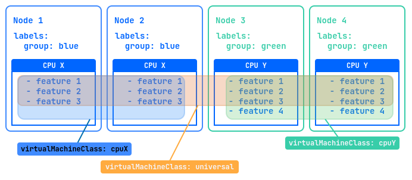
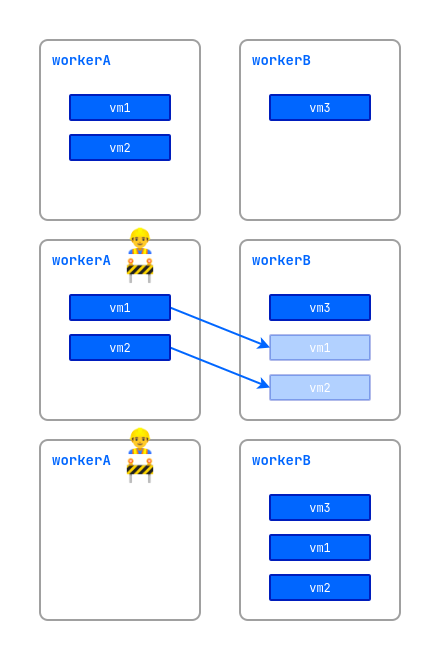
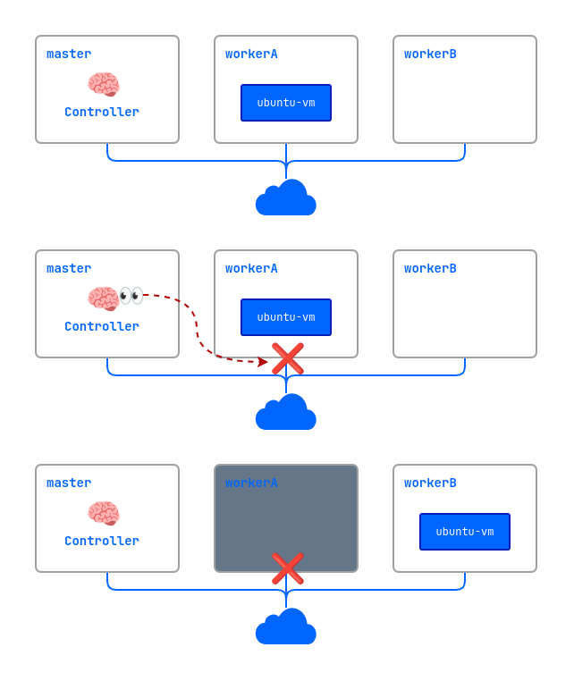

This guide describes how to configure the `virtualization` module and manage its cluster-wide resources.

Administrator permissions also cover project resources, which are described in the [user guide](./user_guide.html).

## Module parameters

You configure the `virtualization` module in the [ModuleConfig](/products/kubernetes-platform/documentation/v1/reference/api/cr.html#moduleconfig) resource. The following example sets the Ingress controller class, the image storage, and the subnet for virtual machines:



{}

```yaml
apiVersion: deckhouse.io/v1alpha1
kind: ModuleConfig
metadata:
  name: virtualization
spec:
  enabled: true
  version: 1
  settings:
    ingressClass: nginx # Optional parameter.
    dvcr:
      storage:
        persistentVolumeClaim:
          size: 50G
          storageClassName: rv-thin-r1
        type: PersistentVolumeClaim
    virtualMachineCIDRs:
      - 10.66.10.0/24
```

{}

{}

1. Go to the **System** tab, then to **Deckhouse** → **Modules**.
1. Select the `virtualization` module from the list.
1. In the window that opens, select the **Configuration** tab.
1. To show the settings, click the **Advanced settings** toggle.
1. Set the parameters. The form field names match the parameter names in YAML.
1. Click **Save**.

{}



### Enabling and disabling the module

The [`.spec.enabled`](/products/kubernetes-platform/documentation/v1/reference/api/cr.html#moduleconfig-v1alpha1-spec-enabled) parameter controls the module state. Set it to `true` to enable the module, or to `false` to disable it.

Disabling the module stops every system component that creates and runs virtual machines (VMs), so the module can't be disabled by default.
To make it possible, add the `modules.deckhouse.io/allow-disabling` annotation set to `true` to the `virtualization` [ModuleConfig](/products/kubernetes-platform/documentation/v1/reference/api/cr.html#moduleconfig).

Before disabling the module, prepare the cluster:

1. Delete all module resources, including virtual machines, disks, and images.
1. Verify that no active resources are left in the cluster:

   ```shell
   d8 k get virtualization -A
   d8 k get virtualization-cluster
   ```

Then edit the `virtualization` [ModuleConfig](/products/kubernetes-platform/documentation/v1/reference/api/cr.html#moduleconfig):

```yaml
apiVersion: deckhouse.io/v1alpha1
kind: ModuleConfig
metadata:
  name: virtualization
  annotations:
    modules.deckhouse.io/allow-disabling: "true"
spec:
  enabled: false
  version: 1
  settings:
    # Specify the existing settings.
```


If the module resources aren't deleted, disabling the module can lead to data loss.


### Configuration version

The [`.spec.version`](/products/kubernetes-platform/documentation/v1/reference/api/cr.html#moduleconfig-v1alpha1-spec-version) parameter defines the settings schema version. The parameter structure can change between versions; for the current values, see the [module settings](./configuration.html).

### Ingress settings

Virtual machine images are uploaded to the cluster through an [Ingress controller](/modules/ingress-nginx/), whose class is defined by the [`.spec.settings.ingressClass`](configuration.html#parameters-ingressclass) parameter.
The parameter is optional: if you leave it unset, the module uses the global value from the Deckhouse Platform configuration.
Set it only when image upload requires a separate Ingress controller.

Example:

```yaml
spec:
  settings:
    ingressClass: nginx
```


Large virtual machine images take a long time to upload over a slow connection, and restarting or updating the Ingress controller interrupts the upload.
To avoid this, increase the worker shutdown timeout in the [IngressNginxController](/modules/ingress-nginx/cr.html#ingressnginxcontroller) resource.

Example:

```yaml
apiVersion: deckhouse.io/v1
kind: IngressNginxController
metadata:
  name: nginx
spec:
  config:
    worker-shutdown-timeout: 1800s  # 30 minutes or more, if required.
```



### Network settings

The [`.spec.settings.virtualMachineCIDRs`](configuration.html#parameters-virtualmachinecidrs) block lists the subnets in CIDR notation from which the module assigns IP addresses to virtual machines, either automatically or on request.
Specify the subnet start address aligned to the mask, for example `192.168.1.192/27`, not an arbitrary address from the range.

Example:

```yaml
spec:
  settings:
    virtualMachineCIDRs:
      - 10.66.10.0/24
      - 10.66.20.0/24
      - 10.77.20.0/16
```

The first and the last address of each subnet are reserved and never assigned to virtual machines. For example, in the `10.66.10.0/24` subnet, the `10.66.10.0` and `10.66.10.255` addresses are unavailable.

You can leave the block unset. The module still starts, but you can no longer work with virtual machine addresses:

- You can't create or use the [VirtualMachineIPAddress](cr.html#virtualmachineipaddress) resource.
- A virtual machine can't request the `Main` network in the [`.spec.networks`](cr.html#virtualmachine-v1alpha2-spec-networks) parameter.
- The [`.spec.networks`](cr.html#virtualmachine-v1alpha2-spec-networks) parameter of a virtual machine can't be empty.


The subnets in the [`.spec.settings.virtualMachineCIDRs`](configuration.html#parameters-virtualmachinecidrs) block must not overlap with the cluster node subnets, the service subnet, or the pod subnet (`podCIDR`).

You can't delete a subnet if addresses from it are already assigned to virtual machines. You also can't clear the block once it's set.


## Virtual machine image storage

The module stores virtual machine images in an internal container image storage (DVCR) that resides on a persistent volume of the cluster. Images travel from there to virtual machine disks, so the size of the volume determines how many images fit into the cluster.

### Size and storage class

Set the volume size and the storage class in the [`.spec.settings.dvcr.storage`](configuration.html#parameters-dvcr-storage) block. To expand the storage, increase the volume size.


After the volume is created, you can't reduce its size or change its storage class.


### Storage classes for images and disks

The project owner chooses the storage class for an image or a disk. You can limit that choice and set a default class. The [`.spec.settings.virtualImages`](configuration.html#parameters-virtualimages) block covers images, and the [`.spec.settings.virtualDisks`](configuration.html#parameters-virtualdisks) block covers disks.

Example:

```yaml
spec:
  settings:
    virtualImages:
      allowedStorageClassSelector:
        matchNames:
          - sc-1
          - sc-2
      defaultStorageClassName: sc-1
    virtualDisks:
      allowedStorageClassSelector:
        matchNames:
          - sc-3
      defaultStorageClassName: sc-3
```

Both blocks work the same way and both are optional. The `allowedStorageClassSelector.matchNames` parameter lists the classes allowed in the [VirtualImage](cr.html#virtualimage) and [VirtualDisk](cr.html#virtualdisk) specification, and `defaultStorageClassName` sets the class for resources where the [`.spec.persistentVolumeClaim.storageClassName`](cr.html#virtualdisk-v1alpha2-spec-persistentvolumeclaim-storageclassname) parameter isn't set.

### Cleaning up image storage

When images and disks are deleted from the cluster, their data remains in DVCR for some time. To keep the storage from filling up with stale data, the module runs garbage collection on a schedule.
By default, it runs daily at 02:00. To set your own schedule, use the [`.spec.settings.dvcr.gc.schedule`](configuration.html#parameters-dvcr-gc-schedule) parameter in the `virtualization` [ModuleConfig](/products/kubernetes-platform/documentation/v1/reference/api/cr.html#moduleconfig):



{}

```yaml
apiVersion: deckhouse.io/v1alpha1
kind: ModuleConfig
metadata:
  name: virtualization
spec:
  # ...
  settings:
    dvcr:
      gc:
        schedule: "0 20 * * *"
  # ...
```

While garbage collection is running, the storage works in read-only mode, so creating images and disks is postponed until it completes.

To see how much space is occupied and which data will be removed during the next collection, run:

```bash
d8 k -n d8-virtualization exec deploy/dvcr -- dvcr-cleaner gc check
```

Example output:

```console {.nowrap-default}
Found 2 cvi, 5 vi, 1 vd manifests in registry
Found 1 cvi, 5 vi, 11 vd resources in cluster
  Total     Used    Avail     Use%
36.3GiB  13.1GiB  22.4GiB      39%
Images eligible for cleanup:
KIND                   NAMESPACE            NAME
ClusterVirtualImage                         debian-12
VirtualDisk            default              debian-10-root
VirtualImage           default              ubuntu-2404
```

{}

{}

1. Go to the **System** tab, then to **Deckhouse** → **Modules**.
1. Select the `virtualization` module from the list.
1. In the window that opens, on the **Configuration** tab, enable the **Advanced settings** toggle.
1. In the **Disk and ISO image storage** block, set the schedule in the **Cleanup schedule in Cron format** field.
1. Click **Save**.

{}



## Images

An image holds the contents of a disk that project owners use to create virtual machine disks. A cluster image, [ClusterVirtualImage](cr.html#clustervirtualimage), is available in every namespace and project of the cluster, so an image uploaded once serves all projects at once.

An image appears in the cluster in three steps:

1. The administrator creates a [ClusterVirtualImage](cr.html#clustervirtualimage) resource and specifies a data source in it.
1. The module downloads the image from that source to the internal storage (DVCR).
1. The downloaded image becomes available for creating disks.

The image source can be an HTTP server hosting the image file, a container image registry, or a file on your computer that you upload from the command line. You can also create an image from another image, from a virtual machine disk, or from a disk snapshot.

The `PHASE` column in the `d8 k get cvi` output shows the progress of image creation; for its values, see the [`.status.phase`](cr.html#clustervirtualimage-v1alpha2-status-phase) field. To follow the creation in real time, add the `-w` flag. If an image stays not ready for a long time, check the [`.status.conditions`](cr.html#clustervirtualimage-v1alpha2-status-conditions) block and the `d8 k describe cvi` output for the reason.

Until an image reaches the `Ready` phase, you can change its `.spec` block, and the download restarts after each change. For a ready image, the `.spec` block can no longer be changed. For all image parameters, see [ClusterVirtualImage](cr.html#clustervirtualimage).

### Image types and formats

There are two types of images:

- **ISO image**: An installation image used for the initial installation of an operating system (OS). OS vendors publish such images and use them to install the OS on physical and virtual servers.
- **Disk image with a preinstalled system**: Contains an OS that is already installed and configured, and is ready to work as soon as the virtual machine (VM) is created. Distribution vendors publish such images, or you can build them yourself.

Distribution vendors publish ready-made images with a preinstalled system. The following table lists their download pages and the users configured in those images by default:

<a id="image-resources-table"></a>

| Distribution                                                                      | Default user |
| --------------------------------------------------------------------------------- | ------------ |
| [AlmaLinux](https://almalinux.org/get-almalinux/#Cloud_Images)                    | `almalinux`  |
| [AlpineLinux](https://alpinelinux.org/cloud/)                                     | `alpine`     |
| [AltLinux](https://ftp.altlinux.ru/pub/distributions/ALTLinux/)                   | `altlinux`   |
| [AstraLinux](https://download.astralinux.ru/ui/native/mg-generic/alse/cloudinit/) | `astra`      |
| [CentOS](https://cloud.centos.org/centos/)                                        | `cloud-user` |
| [Debian](https://cdimage.debian.org/images/cloud/)                                | `debian`     |
| [Rocky](https://rockylinux.org/download/)                                         | `rocky`      |
| [Ubuntu](https://cloud-images.ubuntu.com/)                                        | `ubuntu`     |

The module accepts image files in the following formats:

- `qcow2`
- `raw`
- `vmdk`
- `vdi`
- `vhd`
- `vhdx`

You can provide an image compressed with `gz`, `xz`, or `zst`. The module unpacks it during the upload.

The module detects the image type and size on its own and records them in the resource status. There are two sizes, and both appear in the `d8 k get cvi -o wide` output:

- `STOREDSIZE`: The space the image occupies in the storage. For an image uploaded in a compressed form, it's smaller than the unpacked size. Use this column to estimate how much space the images take in DVCR.
- `UNPACKEDSIZE`: The size of the image after unpacking. It defines the minimum size of a disk that can be created from this image.


When creating a disk from an image, specify a size no smaller than the `UNPACKEDSIZE` value.
If you don't specify a size, the disk is created with exactly the unpacked size of the image.


### Creating a cluster image from an HTTP server

The simplest way to create an image is to provide a link to a file hosted on an HTTP server.



{}

1. Create a [ClusterVirtualImage](cr.html#clustervirtualimage) resource:

   ```bash
   d8 k apply -f - <<EOF
   apiVersion: virtualization.deckhouse.io/v1alpha2
   kind: ClusterVirtualImage
   metadata:
     name: ubuntu-24-04
   spec:
     # Source for the image.
     dataSource:
       type: HTTP
       http:
         url: https://cloud-images.ubuntu.com/noble/current/noble-server-cloudimg-amd64.img
   EOF
   ```

1. Verify that the image is created:

   ```bash
   d8 k get clustervirtualimage ubuntu-24-04

   # Short form of the command.
   d8 k get cvi ubuntu-24-04
   ```

   Example output:

   ```console
   NAME           PHASE   CDROM   PROGRESS   AGE
   ubuntu-24-04   Ready   false   100%       23h
   ```

To make the module verify the downloaded file against a checksum, add the [`checksum`](cr.html#clustervirtualimage-v1alpha2-spec-datasource-http-checksum) block to the source. If the file doesn't match any of the specified checksums, the image moves to the `Failed` phase.

{}

{}

1. Go to the **System** tab, then to **Virtualization** → **Cluster images**.
1. Click **Create**, then select **By link** in the **Source** block.
1. In the **Image name** field, enter the image name.
1. In the **URL** field, specify the link to the image.
1. Click **Create**.
1. Wait until the image reaches the **Ready** state.

{}



### Creating a cluster image from a container image registry

The module can pull an image from an external container image registry, but the disk file must be located in the container image under the `/disk` path. The following steps show how to prepare such a container image and create a cluster image from it.



{}

1. Download the image file to your local machine:

   ```bash
   curl -L https://cloud-images.ubuntu.com/minimal/releases/noble/release/ubuntu-24.04-minimal-cloudimg-amd64.img -o ubuntu2404.img
   ```

1. Create a `Dockerfile` with the following contents:

   ```Dockerfile
   FROM scratch
   COPY ubuntu2404.img /disk/ubuntu2404.img
   ```

1. Build the container image. The example uses the [docker.com](https://www.docker.com/) registry, which requires an account and a configured environment:

   ```bash
   docker build -t docker.io/<USERNAME>/ubuntu2404:latest
   ```

   Where `<USERNAME>` is the username you specified when registering in the registry.

1. Push the built container image to the registry:

   ```bash
   docker push docker.io/<USERNAME>/ubuntu2404:latest
   ```

1. Create a [ClusterVirtualImage](cr.html#clustervirtualimage) resource that points to the container image:

   ```bash
   d8 k apply -f - <<EOF
   apiVersion: virtualization.deckhouse.io/v1alpha2
   kind: ClusterVirtualImage
   metadata:
     name: ubuntu-2404
   spec:
     dataSource:
       type: ContainerImage
       containerImage:
         image: docker.io/<USERNAME>/ubuntu2404:latest
   EOF
   ```

The module works only with registries that have TLS enabled. If the registry uses its own certificate authority, provide the certificate chain in the [`caBundle`](cr.html#clustervirtualimage-v1alpha2-spec-datasource-containerimage-cabundle) parameter, and take the credentials for a private registry from the secret specified in the `imagePullSecret` parameter.

{}

{}

1. Go to the **System** tab, then to **Virtualization** → **Cluster images**.
1. Click **Create**, then select **From registry** in the **Source** block.
1. In the **Image name** field, enter the image name.
1. In the **Image in container registry** field, specify the link to the image.
1. Click **Create**.
1. Wait until the image reaches the **Ready** state.

{}



### Uploading a cluster image from the command line

If the image file is on your computer, upload it directly. The module creates a temporary upload endpoint for this and waits for the data.



{}

1. Create a [ClusterVirtualImage](cr.html#clustervirtualimage) resource with the `Upload` source:

   ```bash
   d8 k apply -f - <<EOF
   apiVersion: virtualization.deckhouse.io/v1alpha2
   kind: ClusterVirtualImage
   metadata:
     name: some-image
   spec:
     # Image source settings.
     dataSource:
       type: Upload
   EOF
   ```

   The resource moves to the `WaitForUserUpload` phase and is ready to accept the file. Start the upload within 10 minutes, otherwise the resource moves to the `Failed` phase and you have to create it again.

1. Get the addresses that accept the file:

   ```bash
   d8 k get cvi some-image -o jsonpath="{.status.imageUploadURLs}" | jq
   ```

   Example output:

   ```console {.nowrap-default}
   {
     "external":"https://virtualization.example.com/upload/<SECRET_URL>",
     "inCluster":"http://10.222.165.239/upload"
   }
   ```

   Use the `inCluster` address if you upload the file from one of the cluster nodes, and `external` in all other cases.

1. Upload the file to the selected address. The example first downloads the Cirros image and then sends it to the cluster:

   ```bash
   curl -L http://download.cirros-cloud.net/0.5.1/cirros-0.5.1-x86_64-disk.img -o cirros.img
   curl https://virtualization.example.com/upload/<SECRET_URL> --progress-bar -T cirros.img | cat
   ```

   Where `<SECRET_URL>` is the last part of the address from the previous step.

1. Verify that the image has reached the `Ready` phase:

   ```bash
   d8 k get cvi some-image
   ```

   Example output:

   ```console
   NAME         PHASE   CDROM   PROGRESS   AGE
   some-image   Ready   false   100%       1m
   ```

You can also verify the uploaded file against a checksum. To do this, specify the [`checksum`](cr.html#clustervirtualimage-v1alpha2-spec-datasource-upload-checksum) block in the data source.

{}

{}

1. Go to the **System** tab, then to **Virtualization** → **Cluster images**.
1. Click **Create**, then select **Upload** in the **Source** block.
1. In the **Image name** field, enter the image name.
1. In the **Upload file** block, drag the file to the highlighted area or click **select on your computer**.
1. Select the file in the file manager that opens.
1. Click **Create**.
1. Wait until the image reaches the **Ready** state.

{}



## Virtual machine classes

A virtual machine (VM) class defines what the project owner doesn't configure: the virtual CPU model, the allowed combinations of cores and memory, and the nodes where a VM can run. These rules are described by the [VirtualMachineClass](cr.html#virtualmachineclass) resource, which you use to control how project workloads are distributed across cluster nodes.

On the initial installation, the module creates the `generic` class with the Nehalem CPU model. This model is old but supported by any modern CPU, so VMs of this class start on any cluster node and migrate between nodes without restrictions.


The `generic` class matches a CPU with the smallest instruction set, so it isn't suitable for production workloads.

Once all nodes are added to the cluster and configured, create at least one class with the `Discovery` CPU type. The module selects an instruction set available on all nodes at once, so virtual machines can make fuller use of the CPUs while still being able to migrate between nodes. The instruction set is fixed when the resource is created and doesn't change as nodes are added or removed.

For an example of such a class, see [vCPU Discovery configuration example](#vcpu-discovery-configuration-example).


Classes exist at the cluster level. To list them, run the following command:

```bash
d8 k get virtualmachineclass
```

Example output:

```console
NAME      PHASE   ISDEFAULT   AGE
generic   Ready               6d1h
```

In any class, you can change everything except the [`.spec.cpu`](cr.html#virtualmachineclass-v1alpha3-spec-cpu) block, because the CPU model is fixed when the resource is created. You can both modify and delete the `generic` class, but it won't be created again, because the module adds it only on the initial installation.

The project owner specifies the class in the [`.spec.virtualMachineClassName`](cr.html#virtualmachine-v1alpha2-spec-virtualmachineclassname) parameter of a virtual machine:

```yaml
apiVersion: virtualization.deckhouse.io/v1alpha2
kind: VirtualMachine
metadata:
  name: linux-vm
spec:
  virtualMachineClassName: generic # Name of the VirtualMachineClass resource.
  # ...
```

### Default VirtualMachineClass

You can designate one of the classes as the default. The module inserts its name into the [`.spec.virtualMachineClassName`](cr.html#virtualmachine-v1alpha2-spec-virtualmachineclassname) parameter if the project owner doesn't specify a class.

The default class is marked with the `virtualmachineclass.virtualization.deckhouse.io/is-default-class` annotation set to `true`. A cluster can have only one such class, so to designate a new one, first remove the annotation from the current one.

Don't add the annotation to the `generic` class, because a module update can remove it. Create your own class and designate it as the default instead.

1. Check which classes exist in the cluster:

   ```bash
   d8 k get vmclass
   ```

   Example output with no default class:

   ```console {.nowrap-default}
   NAME                      PHASE   ISDEFAULT   AGE
   generic                   Ready               1d
   host-passthrough-custom   Ready               1d
   ```

1. Designate the default class:

   ```bash
   d8 k annotate vmclass host-passthrough-custom virtualmachineclass.virtualization.deckhouse.io/is-default-class=true
   ```

1. Verify that the annotation is set:

   ```bash
   d8 k get vmclass
   ```

   Example output:

   ```console {.nowrap-default}
   NAME                      PHASE   ISDEFAULT   AGE
   generic                   Ready               1d
   host-passthrough-custom   Ready   true        1d
   ```

From now on, virtual machines created without a class get the `host-passthrough-custom` class.

### VirtualMachineClass settings

A class consists of three blocks, each responsible for its own group of settings:



{}

```yaml
apiVersion: virtualization.deckhouse.io/v1alpha2
kind: VirtualMachineClass
metadata:
  name: <VMCLASS_NAME>
  # The annotation designates the class as the default one. It's optional.
  # annotations:
  #   virtualmachineclass.virtualization.deckhouse.io/is-default-class: "true"
spec:
  # Virtual CPU parameters. The block is required and can't be changed after the resource is created.
  cpu: ...

  # Rules for placing virtual machines on nodes. The block is optional.
  # Changes apply to all VMs of this class.
  nodeSelector: ...

  # Resource allocation policy for virtual machines. The block is optional.
  # Changes apply to all VMs of this class.
  sizingPolicies: ...
```

Where `<VMCLASS_NAME>` is the name of the class you're creating.

{}

{}

1. Go to the **System** tab, then to **Virtualization** → **VM classes**.
1. Click **Create**.
1. In the form that opens, enter the VM class name in the **Name** field.

{}



The blocks are described separately in the following sections.

#### Virtual processor

The [`.spec.cpu`](cr.html#virtualmachineclass-v1alpha3-spec-cpu) block defines the CPU that the guest OS sees. It also determines which nodes a VM can migrate between.


The [`.spec.cpu`](cr.html#virtualmachineclass-v1alpha3-spec-cpu) block can't be changed after the resource is created. To use a different CPU, create a new class.


The following examples cover each CPU type.

- A set of CPU instructions required for a VM. Set with the `Features` type:

  ```yaml
  spec:
    cpu:
      features:
        - vmx
      type: Features
  ```

  To configure the vCPU in the web interface, in the [VM class creation form](#virtualmachineclass-settings):

  1. In the **CPU settings** block, select `Features` in the **Type** field.
  1. In the **Required set of supported instructions** field, select the instructions you need.
  1. Click **Create**.

- A universal CPU for a given set of nodes. Set with the `Discovery` type:

  ```yaml
  spec:
    cpu:
      discovery:
        nodeSelector:
          matchExpressions:
            - key: node-role.kubernetes.io/control-plane
              operator: DoesNotExist
      type: Discovery
  ```

  To do the same in the web interface, in the [VM class creation form](#virtualmachineclass-settings):

  1. In the **CPU settings** block, select `Discovery` in the **Type** field.
  1. Click **Add** in the **Conditions for creating a universal CPU** → **Labels and expressions** block.
  1. Set **Key**, **Operator**, and **Value**. They correspond to the [`.spec.cpu.discovery.nodeSelector`](cr.html#virtualmachineclass-v1alpha3-spec-cpu-discovery-nodeselector) parameter.
  1. Press **Enter** to confirm the key parameters.
  1. Click **Create**.

- A CPU close to the node CPU. Set with the `Host` type. The guest OS gets almost the full instruction set of the node, so performance is higher than with a fixed model.
  A VM of this class migrates only between nodes with similar CPUs. For example, migration between nodes with Intel and AMD CPUs isn't possible, and neither is migration between CPU generations with different instruction sets.

  ```yaml
  spec:
    cpu:
      type: Host
  ```

  To do the same in the web interface, in the [VM class creation form](#virtualmachineclass-settings):

  1. In the **CPU settings** block, select `Host` in the **Type** field.
  1. Click **Create**.

- The node CPU without changes. Set with the `HostPassthrough` type. A VM of this class migrates only to a node whose CPU exactly matches the CPU of the source node.

  ```yaml
  spec:
    cpu:
      type: HostPassthrough
  ```

  To do the same in the web interface, in the [VM class creation form](#virtualmachineclass-settings):

  1. In the **CPU settings** block, select `HostPassthrough` in the **Type** field.
  1. Click **Create**.

- A specific CPU model with a known instruction set. Set with the `Model` type.
  First, check which models the target node supports:

  ```bash
  d8 k get nodes <NODE_NAME> -o json | jq '.metadata.labels | to_entries[] | select(.key | test("cpu-model.node.virtualization.deckhouse.io")) | .key | split("/")[1]' -r
  ```

  Where `<NODE_NAME>` is the name of a cluster node.

  Example output:

  ```console
  Broadwell-noTSX
  Broadwell-noTSX-IBRS
  Haswell-noTSX
  Haswell-noTSX-IBRS
  IvyBridge
  IvyBridge-IBRS
  Nehalem
  Nehalem-IBRS
  Penryn
  SandyBridge
  SandyBridge-IBRS
  Skylake-Client-noTSX-IBRS
  Westmere
  Westmere-IBRS
  ```

  Then specify the selected model in the class specification:

  ```yaml
  spec:
    cpu:
      model: IvyBridge
      type: Model
  ```

  To do the same in the web interface, in the [VM class creation form](#virtualmachineclass-settings):

  1. In the **CPU settings** block, select `Model` in the **Type** field.
  1. In the **Model** field, select the CPU model.
  1. Click **Create**.

#### vCPU Discovery configuration example

The following example shows how to choose the processor types in a cluster with heterogeneous nodes.



The example below uses a cluster of four nodes. Two nodes labeled `group=blue` are equipped with the "CPU X" processor with three instruction sets, and the other two labeled `group=green` have the newer "CPU Y" processor with four sets.


A CPU instruction set is every command the processor can execute, from addition to memory operations. The set determines which programs run and how fast, and it differs between CPU generations.


Three classes suit such a cluster:

- `universal`: VMs start on any node and migrate between all four. The module takes the instruction set common to both processors, so compatibility is maximal, while some capabilities of "CPU Y" stay unused.
- `cpuX`: VMs start only on nodes with "CPU X" and migrate between them, using all instructions of that processor.
- `cpuY`: The same for nodes with "CPU Y".

The classes for such a cluster look as follows:

```yaml
---
apiVersion: virtualization.deckhouse.io/v1alpha2
kind: VirtualMachineClass
metadata:
  name: universal
spec:
  cpu:
    # An empty discovery means that all cluster nodes are taken into account.
    discovery: {}
    type: Discovery
---
apiVersion: virtualization.deckhouse.io/v1alpha2
kind: VirtualMachineClass
metadata:
  name: cpuX
spec:
  cpu:
    discovery:
      nodeSelector:
        matchExpressions:
          - key: group
            operator: In
            values: ["blue"]
    type: Discovery
---
apiVersion: virtualization.deckhouse.io/v1alpha2
kind: VirtualMachineClass
metadata:
  name: cpuY
spec:
  cpu:
    discovery:
      nodeSelector:
        matchExpressions:
          - key: group
            operator: In
            values: ["green"]
    type: Discovery
```

#### Placement across nodes

The optional [`.spec.nodeSelector`](cr.html#virtualmachineclass-v1alpha3-spec-nodeselector) block limits the set of nodes where virtual machines of this class run. Nodes are selected by labels:

```yaml
spec:
  nodeSelector:
    matchExpressions:
      - key: node.deckhouse.io/group
        operator: In
        values:
          - green
```


A change to the [`.spec.nodeSelector`](cr.html#virtualmachineclass-v1alpha3-spec-nodeselector) block affects all virtual machines of the class at once. Those running on nodes that no longer match the new conditions have to be moved:

- In the Enterprise Edition, the module migrates such VMs to suitable nodes.
- In the Community Edition, the VMs are restarted, and the restart time depends on the [`.spec.disruptions.restartApprovalMode`](cr.html#virtualmachine-v1alpha2-spec-disruptions-restartapprovalmode) parameter of the virtual machine, which defaults to `Manual` and requires the project owner's approval.


To do the same in the web interface, in the [VM class creation form](#virtualmachineclass-settings):

1. Click **Add** in the **Conditions for scheduling VMs on nodes** → **Labels and expressions** block.
1. Set **Key**, **Operator**, and **Value**. They correspond to the [`.spec.nodeSelector`](cr.html#virtualmachineclass-v1alpha3-spec-nodeselector) parameter.
1. Press **Enter** to confirm the key parameters.
1. Click **Create**.

#### Sizing policy

The [`.spec.sizingPolicies`](cr.html#virtualmachineclass-v1alpha3-spec-sizingpolicies) block defines which combinations of cores, core fraction, and memory are allowed for virtual machines of this class.


Changes to the [`.spec.sizingPolicies`](cr.html#virtualmachineclass-v1alpha3-spec-sizingpolicies) block affect existing virtual machines.
For virtual machines that no longer meet the new requirements, the `SizingPolicyMatched` condition in the [`.status.conditions`](cr.html#virtualmachineclass-v1alpha2-status-conditions) block gets the `False` status.

When defining policies, take the [CPU topology](./user_guide.html#cpu-topologies) of virtual machines into account.


A policy consists of a list of rules, each applying to its own range of cores. The range is set in the required `cores` block, and ranges of different rules must not overlap, otherwise the module rejects the class.

A valid structure, where the ranges follow one another without overlapping:

```yaml
- cores:
    min: 1
    max: 4
  # ...
- cores:
    min: 5 # The next range starts one above the previous max.
    max: 8
```

An invalid structure, where the value `4` falls into two ranges at once:

```yaml
- cores:
    min: 1
    max: 4
  # ...
- cores:
    min: 4
    max: 8
```

The module doesn't forbid gaps between ranges, but a virtual machine whose number of cores falls outside every range is left without a policy. For this reason, start each range with the value that follows the `max` of the previous one.

Within a range, you set the requirements for memory and for the core fraction:

- `memory`: The minimum and maximum amount of memory. Set either for the whole range or per core, in the nested `memory.perCore` block.
- `coreFractions`: The list of allowed core fractions, for example `[25, 50, 100]` for 25%, 50%, and 100%. If the project owner sets the `coreFraction` parameter of a virtual machine explicitly, the value must come from this list.
- `defaultCoreFraction`: The core fraction that a virtual machine gets if `coreFraction` isn't set in it. The value must be in the `coreFractions` list. If the parameter isn't specified, 100% applies.

A rule with neither `memory` nor `coreFractions` doesn't limit anything, so set at least one of them.

In the Enterprise Edition, you can set the `defaultCoreFraction` parameter to `Auto`. In that case, the core fraction for VMs without an explicit `coreFraction` is chosen by [vertical autoscaling](./user_guide.html#automatic-corefraction-auto). `Auto` is a mode, not a share of a core, so it must not appear in the `coreFractions` list.

```yaml
spec:
  sizingPolicies:
    - cores:
        min: 1
        max: 8
      coreFractions: [10, 25, 50, 100]
      defaultCoreFraction: Auto
```

The `Auto` value is accepted only when both capabilities are available:

- Vertical autoscaling of virtual machines, which is enabled automatically in the Enterprise Edition when the [`vertical-pod-autoscaler`](/modules/vertical-pod-autoscaler/) module is enabled.
- Changing the number of cores and the amount of memory without a restart, which is enabled by the `HotplugCPUAndMemoryWithInPlaceResize` feature in the [`.spec.settings.featureGates`](configuration.html#parameters-featuregates) parameter of the module.

If at least one of them is unavailable, the module rejects the creation of such a class.

The following examples show how the amount of memory depends on the number of cores:

- The `memory` parameter sets the same limits for the whole range of cores:

  ```yaml
  - cores:
      min: 1
      max: 4
    memory:
      min: 2Gi
      max: 8Gi
  ```

  A virtual machine with any number of cores from 1 to 4 gets from 2 to 8 GiB of memory, and the number of cores doesn't affect these limits.

- The `memory.perCore` parameter sets the limits per core, and the resulting limits are the product of that value and the number of cores:

  ```yaml
  - cores:
      min: 1
      max: 4
    memory:
      perCore:
        min: 1Gi
        max: 2Gi
  ```

  With such a policy, the allowed amount of memory grows with the number of cores:

  - 1 core: From 1 to 2 GiB.
  - 2 cores: From 2 to 4 GiB.
  - 3 cores: From 3 to 6 GiB.
  - 4 cores: From 4 to 8 GiB.

- The `memory.step` parameter limits the allowed memory values to a grid, so that the project owner can't choose arbitrary amounts.

  Together with `memory.min` and `memory.max`, the step is counted from the minimum:

  ```yaml
  - cores:
      min: 1
      max: 4
    memory:
      min: 2Gi
      max: 8Gi
      step: 1Gi
  ```

  Only the values 2, 3, 4, 5, 6, 7, and 8 GiB are allowed; 2.5 or 7.5 GiB can't be set.

  Together with `memory.perCore`, the step is counted from the memory per core, and the resulting value is then multiplied by the number of cores:

  ```yaml
  - cores:
      min: 1
      max: 4
    memory:
      perCore:
        min: 1Gi
        max: 2Gi
      step: 512Mi
  ```

  Per core, 1, 1.5, and 2 GiB are allowed, so the resulting amount depends on the number of cores:

  - 1 core: 1, 1.5, or 2 GiB.
  - 2 cores: 2, 3, or 4 GiB.
  - 3 cores: 3, 4.5, or 6 GiB.
  - 4 cores: 4, 6, or 8 GiB.

An example of a policy that covers ranges from 1 to 248 cores:

```yaml
spec:
  sizingPolicies:
    # For 1-4 cores, from 1 to 8 GiB of memory is available with a 512 MiB step,
    # that is, 1 GiB, 1.5 GiB, 2 GiB, 2.5 GiB, and so on.
    # All core fractions are available.
    - cores:
        min: 1
        max: 4
      memory:
        min: 1Gi
        max: 8Gi
        step: 512Mi
      coreFractions: [5, 10, 20, 50, 100]
      defaultCoreFraction: 50 # Default core fraction for the 1-4 core range.
    # For 5-8 cores, from 5 to 16 GiB of memory is available with a 1 GiB step,
    # that is, 5 GiB, 6 GiB, 7 GiB, and so on.
    # Core fractions are limited to three values.
    - cores:
        min: 5
        max: 8
      memory:
        min: 5Gi
        max: 16Gi
        step: 1Gi
      coreFractions: [20, 50, 100]
      defaultCoreFraction: 100 # Default core fraction for the 5-8 core range.
    # For 9-16 cores, from 9 to 32 GiB of memory is available with a 1 GiB step.
    # Core fractions are limited to two values.
    - cores:
        min: 9
        max: 16
      memory:
        min: 9Gi
        max: 32Gi
        step: 1Gi
      coreFractions: [50, 100]
    # For 17-248 cores, from 1 to 2 GiB of memory is available per core.
    # The core fraction is 100% only.
    - cores:
        min: 17
        max: 248
      memory:
        perCore:
          min: 1Gi
          max: 2Gi
      coreFractions: [100]
```

To configure sizing policies in the web interface, in the [VM class creation form](#virtualmachineclass-settings):

1. Click **Add** in the **Resource allocation rules for virtual machines** block.
1. In the **CPU** block, enter `1` in the **Min** field and `4` in the **Max** field.
1. In the **CPU** block, in the **Allow setting core fractions** field, select the values `5%`, `10%`, `20%`, `50%`, `100%` in order.
1. In the **Memory** block, set the toggle to **Amount per 1 core**.
1. In the **Memory** block, enter `1` in the **Min** field and `8` in the **Max** field.
1. In the **Memory** block, enter `1` in the **Discretization step** field.
1. Add other ranges with the **Add** button, if required.
1. Click **Create**.

### CPU oversubscription

Oversubscription lets you give the virtual machines on a node more virtual cores than the node physically has. This makes sense because VMs rarely load the CPU at the same time and at full capacity.

The degree of oversubscription is controlled by the `coreFraction` parameter of a virtual machine, and you define its allowed values in the sizing policy of the class. The parameter defines the share of a core's capacity guaranteed to a VM. For example, with `coreFraction: 20%`, a VM always gets a fifth of a core, and it can take a whole core when the node has spare resources.


If the `coreFractions` list isn't set in the class or contains several values, the project owner chooses the degree of oversubscription by specifying `coreFraction` when creating a VM.


When placing a VM on a node, the module sums the guaranteed shares of all VMs on that node using the `Σ(cores × coreFraction / 100)` formula. If the sum exceeds the number of physical cores, the VM doesn't start on that node.

Consider a node with 4 physical cores and 5 VMs, each with 2 cores and `coreFraction: 20%`. The guaranteed load is `5 × 2 × 0.2 = 2` cores, with 10 virtual cores on 4 physical ones, which is an oversubscription of 2.5 to 1. All five VMs fit on the node, because 2 cores is less than the available 4.

#### Fixed oversubscription

A list with a single value leaves the project owner no choice, and you define the degree of oversubscription for all VMs of the class:

```yaml
apiVersion: virtualization.deckhouse.io/v1alpha2
kind: VirtualMachineClass
metadata:
  name: oversubscribed
spec:
  sizingPolicies:
    - cores:
        min: 1
        max: 8
      memory:
        perCore:
          min: 1Gi
          max: 8Gi
      coreFractions: [20] # The only allowed value.
      defaultCoreFraction: 20
```

All VMs of this class get 20% of a core each, which gives an oversubscription of 5 to 1.

#### Oversubscription chosen by the project owner

A list with several values leaves the choice to the project owner:

```yaml
apiVersion: virtualization.deckhouse.io/v1alpha2
kind: VirtualMachineClass
metadata:
  name: standard
spec:
  sizingPolicies:
    - cores:
        min: 1
        max: 4
      memory:
        perCore:
          min: 1Gi
          max: 8Gi
      coreFractions: [5, 10, 20, 50, 100]
      defaultCoreFraction: 20
```

The project owner selects `coreFraction` from the list, and if they don't, the VM gets 20%.

## Node maintenance and VM fault tolerance

This section covers the tools that help virtual machines (VMs) survive node maintenance and node failure. Some of them work on their own, others require your action.

### VM migration and node maintenance

Live migration moves a running virtual machine from one node to another without shutting it down. It's needed in three situations:

- Load balancing, to distribute VMs evenly across nodes.
- Node maintenance or update, to free the node from VMs.
- Virtual machine firmware update, which would otherwise require a restart.


Live migration is limited in speed and in the number of concurrent moves:

- A node prepares and sends the memory of only one VM at a time, and accepts only one incoming migration at a time.
- This also sets the cluster limit: no more concurrent migrations than there are nodes allowed to run virtual machines.
- The transfer rate of a single migration is limited to 640 MiB/s, which is about 5 Gbit/s.


#### Moving a selected VM to another node

The following steps show how to move a selected VM to another node.



{}

1. Check which node the VM currently runs on:

   ```bash
   d8 k get vm
   ```

   Example output:

   ```console {.nowrap-default}
   NAME       PHASE     UPTIME   NODE           IPADDRESS     AGE
   linux-vm   Running   79m      virtlab-pt-1   10.66.10.14   79m
   ```

   The VM runs on the `virtlab-pt-1` node.

1. Create a [VirtualMachineOperation](cr.html#virtualmachineoperation) resource with the `Evict` type. The module selects a new node for the VM, respecting its placement requirements:

   ```bash
   d8 k create -f - <<EOF
   apiVersion: virtualization.deckhouse.io/v1alpha2
   kind: VirtualMachineOperation
   metadata:
     generateName: evict-linux-vm-
   spec:
     # Virtual machine name.
     virtualMachineName: linux-vm
     # Operation for the migration.
     type: Evict
   EOF
   ```

1. Right after creating the resource, follow the migration progress:

   ```bash
   d8 k get vm -w
   ```

   Example output:

   ```console {.nowrap-default}
   NAME       PHASE       UPTIME   NODE           IPADDRESS     AGE
   linux-vm   Running     79m      virtlab-pt-1   10.66.10.14   79m
   linux-vm   Migrating   79m      virtlab-pt-1   10.66.10.14   79m
   linux-vm   Migrating   79m      virtlab-pt-1   10.66.10.14   79m
   linux-vm   Running     79m      virtlab-pt-2   10.66.10.14   79m
   ```

   The VM keeps its IP address during the move; only the node in the `NODE` column changes.

1. To interrupt the migration, delete the created resource while it's in the `Pending` or `InProgress` phase.

{}

{}

1. Go to the **Projects** tab and select the project you need.
1. Go to **Virtualization** → **Virtual machines**.
1. Select the virtual machine from the list and click the ellipsis button.
1. In the menu that opens, select **Migrate**.
1. In the **Virtual machine migration** window, select **Migrate to an arbitrary node** or **Migrate to a selected node** and specify the node in the **Nodes available for migration** field.
1. If required, enable **Migrate disks** to move the VM disks along with the VM, and **Force (slow down guest CPU)** to make sure the migration completes for an actively running VM.
1. Click **Migrate**, or cancel the operation with **Cancel**.

{}



#### Dedicated migration network

By default, live migration traffic goes over the main node network and competes for bandwidth with workloads. You can route it through a dedicated VLAN provided by the [`sdn`](/modules/sdn/) module.

This requires the [`sdn`](/modules/sdn/) module to be enabled and a [SystemNetwork](/modules/sdn/cr.html#systemnetwork) resource to be created and in the `Ready` state.

To route the traffic to the dedicated network, set the [`.spec.settings.liveMigration.network`](configuration.html#parameters-livemigration-network) block in the `virtualization` ModuleConfig. Specify `type: SystemNetwork` in it and the name of the prepared network in the `systemNetwork.name` field. After that, all migrations in the cluster go over the VLAN of that network.

```yaml
spec:
  settings:
    liveMigration:
      network:
        type: SystemNetwork
        systemNetwork:
          name: migration-net
```

To return migration traffic to the main node network, delete the `network` block. When it isn't set, the node network is used by default.

To create a system network in the web interface:

1. Go to the **System** tab, then to **Network** → **SDN** → **System networks**.
1. Click **Create**.
1. In the **Create resource** window that opens, enter the network name in the **Name** field.
1. On the **Configuration** tab, select the type (`VLAN`, `Access`, or `SRIOVVirtualFunction`) in the **Type** field, the underlay network in the **Underlay network** field, and the VLAN identifier in the **VLAN** block. Set the **IPAM** block parameters, if required.
1. Click **Apply**.
1. Review the created networks in the list, which shows the **Status**, **Type**, **Underlay network**, **VLAN ID**, and **IP pool** columns.

Beforehand, create a network class (VLAN ID ranges and parent network interfaces of nodes) and an underlay network (participating network interfaces of nodes and the **Dedicated** or **Shared** mode) in the **Network** → **SDN** → **Network classes** and **Underlay networks** sections.

#### Checking VMs before node maintenance

It's better to find the VMs that won't be able to migrate off a node before maintenance starts, before the node is made unschedulable:

```bash
d8 k get vm -o wide | grep <NODE_NAME>
```

VMs with the `False` value in the `MIGRATABLE` column have to be stopped when the node is drained. Live migration isn't possible for them, and the evacuation fails.

The column value alone isn't enough. A VM with the `True` value and the `VirtualMachineWaitingForMigrationTarget` reason won't move anywhere either, until a suitable node returns to scheduling, so before maintenance, look at the reasons for all VMs on the node:

```bash
d8 k get vm -o json | jq -r '.items[] | [.metadata.name, (.status.conditions[] | select(.type=="Migratable") | .reason)] | @tsv'
```

#### Maintenance mode

Work on a node that runs virtual machines can disrupt them. To prevent this, switch the node to maintenance mode, and the module moves the VMs to other nodes.



{}

To free the node from all resources, including system ones, run:

```bash
d8 k drain <NODE_NAME> --ignore-daemonsets --delete-emptydir-data
```

To evict only virtual machines from the node, add a label selector:

```bash
d8 k drain <NODE_NAME> --pod-selector vm.kubevirt.internal.virtualization.deckhouse.io/name --delete-emptydir-data
```

Where `<NODE_NAME>` is the name of the node scheduled for maintenance.

After the command runs, the node switches to maintenance mode, and virtual machines can't be started on it.

To return the node to service, stop the `drain` command with `Ctrl+C`, and then run:

```bash
d8 k uncordon <NODE_NAME>
```



{}

{}

1. Go to the **System** tab, then to **Nodes**.
1. Select the node from the list, click the ellipsis button, and select **Cordon + Drain** in the menu that opens.
1. To take the node out of maintenance mode, select **Uncordon** in the same menu.

{}



#### Restarting virtual machines during node maintenance

A virtual machine can't always be moved to another node by live migration. It can be pinned to the node by placement rules or use a device passed through from the node. The `Migratable` condition in the VM status shows the reason. Such a VM keeps running and holds the node, so maintenance can't complete until the VM is restarted.

When the module finds such a VM while switching the node to maintenance mode, it adds the `virtualization.deckhouse.io/virtualmachines-restart-required` annotation to the node. To allow the restart, add the matching annotation to the node:

```bash
d8 k annotate node <NODE_NAME> virtualization.deckhouse.io/virtualmachines-restart-approved=""
```

Where `<NODE_NAME>` is the name of the node being switched to maintenance mode.

Only the VMs that can't be moved by live migration are restarted. The guest OS shuts down gracefully, after which the VM starts according to the [`.spec.runPolicy`](cr.html#virtualmachine-v1alpha2-spec-runpolicy) run policy. For each restart, a [VirtualMachineOperation](cr.html#virtualmachineoperation) resource named `node-maintenance-restart-*` is created. A restart interrupts the applications inside the VM, so coordinate it with the project owners.

The approval doesn't apply to VMs that can be moved by live migration, including those with no suitable node at the moment. Such VMs are moved by live migration as soon as a suitable node appears.

You can grant the approval in advance, while planning the work. Until the node is switched to maintenance mode, the annotation has no effect. The module removes both annotations once the node is free, so one approval covers one maintenance of one node.

The module reacts to VM eviction from a node. If eviction stopped on timeout (the [`.spec.nodeDrainTimeoutSecond`](/modules/node-manager/cr.html#nodegroup-v1-spec-nodedraintimeoutsecond) parameter of the [NodeGroup](/modules/node-manager/cr.html#nodegroup) resource, 10 minutes by default), eviction isn't retried. An approval granted after that doesn't trigger a restart, and you have to free the node manually.

A restart frees the node but doesn't guarantee that the VM starts on another one right away. The limitation that prevents live migration usually prevents the start on another node as well. In that case, the VM stays in the `Pending` phase, and the `Running` condition reports the reason received from the scheduler. Maintenance can continue meanwhile. The VM starts as soon as a suitable node appears, including after the node returns to service with `d8 k uncordon`.

The VM owner sees the same information in the `EvictionRequired` condition of the VM status. While the node is only being prepared for maintenance, the condition is a warning. Once eviction starts, the condition shows what happens to the VM: a move by live migration, a restart by the module, or a wait if the restart isn't approved.

#### Shutting down and rebooting a node with virtual machines

Running virtual machines postpone the shutdown and reboot of their node. The module labels their workloads with `pod.deckhouse.io/inhibit-node-shutdown`, and Deckhouse Platform uses this label to delay the node shutdown. The mechanism is available in the Enterprise Edition, is described in the [`node-manager` module documentation](/modules/node-manager/), and doesn't need to be enabled.

If a shutdown or reboot is requested on a node that still runs virtual machines:

- The node shutdown is postponed for up to three days.
- A message about the workloads holding the shutdown is periodically printed to the node console.

On nodes where the delay mechanism works, the `GracefulShutdownPostpone` condition is always present and always has the `True` status, even when there are no virtual machines on the node and nobody requested a shutdown. What actually happens to the node is shown by the reason in the `reason` field of this condition:

- `WaitingForShutdownSignal`: The mechanism is active and waiting for a node shutdown request.
- `PodsWithLabelAreRunningOnNode`: A node shutdown is requested and postponed, because virtual machines are still running on the node.
- `NoRunningPodsWithLabel`: No virtual machines are left on the node and the shutdown continues; the condition status changes to `False`.

To check the reason, run the following command:

```bash
d8 k get node <NODE_NAME> -o jsonpath='{range .status.conditions[?(@.type=="GracefulShutdownPostpone")]}{.reason}{"\n"}{end}'
```

The shutdown delay doesn't move virtual machines to other nodes, it only keeps the node from shutting down. For this reason, free the node from virtual machines before any work that requires a shutdown or a reboot:

- If the VMs can be migrated, that is, the `Migratable` condition has the `True` status, switch the node to maintenance mode with `d8 k drain`.
- If a VM can't be migrated, that is, the `Migratable` condition has the `False` status because of local disks or devices passed through from the node, stop it with `d8 v stop <VM_NAME>`, and start it with `d8 v start <VM_NAME>` once the work is done.

  Stopping is available only for the `Manual` and `AlwaysOnUnlessStoppedManually` run policies. Check the VM policy:

  ```bash
  d8 k -n <NAMESPACE> get vm <VM_NAME> -o jsonpath='{.spec.runPolicy}'
  ```

  With the `AlwaysOn` policy, the stop command is rejected with the `NotApplicableForVirtualMachineRunPolicy` reason. In that case, change the policy first, and restore the previous value once the work is done:

  ```bash
  d8 k -n <NAMESPACE> patch vm <VM_NAME> --type merge -p '{"spec":{"runPolicy":"AlwaysOnUnlessStoppedManually"}}'
  ```

  Where `<NAMESPACE>` is the project namespace, and `<VM_NAME>` is the virtual machine name.

Instead of stopping VMs manually, you can [let the module restart such VMs](#restarting-virtual-machines-during-node-maintenance) for the duration of the node maintenance. The run policy doesn't have to be changed in that case.

If you do none of this, the node doesn't shut down. Two alerts report this situation. The `D8VirtualizationVirtualMachineHoldsNodeMaintenance` alert lists the VMs that hold the node and wait for an administrator's decision. The `D8VirtualizationNodeEvacuationStuck` alert fires if a VM was evicted from a node but neither migrated nor restarted within 15 minutes.

### VM rebalancing

Over time, the distribution of virtual machines across nodes stops being even. The [`descheduler`](/modules/descheduler/) module restores the balance by moving VMs with live migration, without interrupting them. Enable this module, and the distribution is maintained without your involvement.



{}

Rebalancing solves two tasks:

- It evens out the load. The module tracks how much CPU is reserved on each node and, when a node reserves more than 80%, moves some VMs to less loaded nodes.
- It restores correct placement. The module checks whether the current node meets the VM requirements and the rules of mutual VM placement. For example, if the rules forbid keeping certain VMs on the same node, the extra ones are moved.

{}

{}

1. Go to the **System** tab, then to **Configuration** → **Deschedulers**.
1. Click **Create**.
1. In the **Create resource** window that opens, enter the resource name in the **Name** field.
1. On the **Configuration** tab, in the **Strategies** block, enable the strategies you need. The **Low node utilization (balancing)** strategy moves VMs from overloaded nodes, while **Inter-Pod Anti-Affinity violations** and **Node Affinity violations** restore correct placement.
1. Click **Apply**.

{}



The created resources and the strategies enabled in them appear in the list of the section.

Rebalancing covers only the VMs that can leave their node by live migration. A VM that can't be live migrated, for example one with a passed-through device, is never moved by rebalancing, because the only other way off the node is a restart. Such a VM is restarted only during [node maintenance](#restarting-virtual-machines-during-node-maintenance) and only with the permission of an administrator.

### ColdStandby

The ColdStandby mechanism returns a virtual machine to service after the failure of the node it was running on.

For the mechanism to work, meet two requirements:

- The [`.spec.runPolicy`](cr.html#virtualmachine-v1alpha2-spec-runpolicy) run policy of the virtual machine must be set to `AlwaysOnUnlessStoppedManually` or `AlwaysOn`.
- The [Fencing](/modules/node-manager/cr.html#nodegroup-v1-spec-fencing-mode) mechanism must be enabled on the nodes that run virtual machines.

Without Fencing, the mechanism doesn't work. An unavailable VM doesn't move in that case, but stays on the failed node and resumes together with it.

Here's the recovery sequence, using a cluster of three nodes, `master`, `workerA`, and `workerB`, where Fencing is enabled on both worker nodes and the `linux-vm` VM runs on `workerA`:

1. The `workerA` node fails, for example because of a power or network loss.
1. The controller checks node availability and finds that `workerA` doesn't respond.
1. The controller removes `workerA` from the cluster.
1. The `linux-vm` VM starts on another suitable node, `workerB` in this example.



## USB devices


USB device passthrough is available only in Deckhouse Platform **Enterprise Edition (EE)**.


USB device passthrough to virtual machines (VMs) is handled by the `virtualization-dra` system component, which needs three kernel modules on the node:

- `usbip_core`
- `usbip_host`
- `vhci_hcd`

The module loads them on the nodes itself. A node where all three modules are available gets the `virtualization.deckhouse.io/usbip=true` label, and the `virtualization-dra` component runs only on such nodes. If the kernel modules stop being available, the label is removed and the component is deleted from the node.

To see which nodes are ready for USB device passthrough, run the following command:

```bash
d8 k get nodes -l virtualization.deckhouse.io/usbip=true
```

Example output:

```console
NAME     STATUS   ROLES    AGE   VERSION
node-1   Ready    worker   10d   v1.34.1
```

To verify that the component is actually running on these nodes, run the following command:

```bash
d8 k -n d8-virtualization get pods -l app=virtualization-dra -o wide
```

A node missing from the output failed to load the kernel modules, and USB devices on that node aren't detected. Install the kernel modules yourself from your operating system package, or build them for the kernel in use. The module detects them on its own and assigns the label to the node within a few minutes.

### Path of a USB device from a node to a VM

A USB device travels from the node to a virtual machine in four steps:

1. The DRA driver detects USB devices on the nodes and publishes information about them to the Kubernetes API as a [ResourceSlice](https://kubernetes.io/docs/concepts/scheduling-eviction/dynamic-resource-allocation/). The module controller creates [NodeUSBDevice](cr.html#nodeusbdevice) resources from this data.

1. The administrator assigns a namespace to the [NodeUSBDevice](cr.html#nodeusbdevice) resource by setting the [`.spec.assignedNamespace`](cr.html#nodeusbdevice-v1alpha2-spec-assignednamespace) parameter. This makes the device available in that namespace.

1. Once the namespace is assigned, the module controller creates a [USBDevice](cr.html#usbdevice) resource in it.

1. The project owner attaches the [USBDevice](cr.html#usbdevice) device to a virtual machine by adding it to the [`.spec.usbDevices`](cr.html#virtualmachine-v1alpha2-spec-usbdevices) parameter of the [VirtualMachine](cr.html#virtualmachine) resource.

### Discovered devices (NodeUSBDevice)

The [NodeUSBDevice](cr.html#nodeusbdevice) resource describes a physical USB device detected on a node. The resource exists at the cluster level, so you see all detected devices in a single list:

```bash
d8 k get nodeusbdevice
```

Example output:

```console {.nowrap-default}
NAME              NODE     READY   ASSIGNED   ATTACHED   NAMESPACE    AGE
usb-flash-drive   node-1   True    False      False                   10m
logitech-webcam   node-2   True    True       True       my-project   15m
```

The conditions in the [`.status.conditions`](cr.html#nodeusbdevice-v1alpha2-status-conditions) block reflect the readiness of the device and its state. The `Ready` and `Attached` conditions match the [USBDevice conditions](./user_guide.html#usbdevice-conditions), and the `Assigned` condition shows whether a namespace is assigned to the device:

- `Available`: No namespace is assigned.
- `InProgress`: A namespace is assigned and the [USBDevice](cr.html#usbdevice) resource is being created.
- `Assigned`: The [USBDevice](cr.html#usbdevice) resource is created and the device is available in the namespace.

#### Assigning a namespace to a USB device

Until a namespace is assigned to a device, the project owner doesn't see it. To make the device available in a project, follow these steps.

1. Connect the USB device to a node that is ready for passthrough and wait for a [NodeUSBDevice](cr.html#nodeusbdevice) resource to appear.

1. Assign the namespace with the [`.spec.assignedNamespace`](cr.html#nodeusbdevice-v1alpha2-spec-assignednamespace) parameter:

   ```bash
   d8 k apply -f - <<EOF
   apiVersion: virtualization.deckhouse.io/v1alpha2
   kind: NodeUSBDevice
   metadata:
     name: logitech-webcam
   spec:
     assignedNamespace: my-project
   EOF
   ```

1. Verify that a [USBDevice](cr.html#usbdevice) resource appears in the namespace:

   ```bash
   d8 k get usbdevice -n my-project
   ```

After that, the project owner attaches the device to a virtual machine.

### Viewing USB device details

Full details about a device and its current state are available in the resource status.



{}

The device identifiers, its location, and the current conditions are stored in the resource status:

```bash
d8 k get nodeusbdevice <DEVICE_NAME> -o yaml
```

Where `<DEVICE_NAME>` is the name of the [NodeUSBDevice](cr.html#nodeusbdevice) resource.

To get only the device attributes, query the fields you need directly:

```bash
d8 k get nodeusbdevice <DEVICE_NAME> \
  -o jsonpath='{.status.attributes.manufacturer}{" "}{.status.attributes.product}{" ("}{.status.attributes.vendorID}{":"}{.status.attributes.productID}{")\n"}'
```

Example output:

```console
Logitech Webcam C920 (046d:082d)
```

> When a device is physically disconnected from the node, the `Attached` condition gets the `False` value, and the `Ready` condition gets the `NotFound` reason. The same is reflected in the status of the [USBDevice](cr.html#usbdevice) resource in the project namespace.

{}

{}

1. Go to the **System** tab, then to **Virtualization** → **Node USB devices**.
1. Review the list, which shows the device status, manufacturer, product, serial number, node, bus, device number, and assigned namespace.

{}



The project owner sees the devices assigned to their project in the **Virtualization** → **USB devices** section of that project.

### Requirements and limitations

When planning USB device passthrough, consider the following requirements and limitations:

- A node where USB devices must be detected has to carry the `virtualization.deckhouse.io/usbip=true` label and run containerd version 2, otherwise the `virtualization-dra` component doesn't start there.
- A device is passed to a virtual machine over the network using USBIP, so the VM can run on a node other than the one the device is physically connected to.
- Only a device that reports the USB 2.0 speed (480 Mbps) or a USB 3.x speed (5 Gbps and higher) can be passed through. The module doesn't let you attach a slower device to a VM, for example a mouse or a keyboard at 1.5 or 12 Mbps.
- A node connects no more than 16 devices, 8 per USB 2.0 hub and 8 per USB 3.0 hub.
- The hub is selected by the device speed and can't be changed manually. A USB 2.0 device doesn't connect to a USB 3.0 hub, and vice versa.
- A device can be attached to a running VM and detached from it without stopping the VM.

## GPU devices


GPU device passthrough is an experimental feature available only in the Enterprise Edition.


The module attaches physical GPU devices to virtual machines using DRA (Dynamic Resource Allocation). A project owner requests a device by a reference to a `GPUClass` in the [`.spec.gpus`](cr.html#virtualmachine-v1alpha2-spec-gpus) block of their machine, and you prepare the cluster for this.

To make passthrough work, provide the following:

- [Kubernetes](/products/kubernetes-platform/documentation/v1/reference/supported_versions.html#kubernetes) 1.34 or later with the DRA feature gates required by your cluster configuration.
- The `GPU` feature gate in the `virtualization` module settings.
- A GPU DRA provider installed in the cluster that publishes devices with the `gpu.deckhouse.io` attributes.
- A `GPUClass` resource that selects devices of the model you need. The GPU module creates a DeviceClass resource with the same name from it, and the device is allocated to a machine through that class.

To enable the feature gate, add it to the module settings:

```yaml
apiVersion: deckhouse.io/v1alpha1
kind: ModuleConfig
metadata:
  name: virtualization
spec:
  settings:
    featureGates:
      - GPU
```

After that, tell the project owners the names of the available `GPUClass` resources. A single machine takes no more than 16 devices, and a change to the [`.spec.gpus`](cr.html#virtualmachine-v1alpha2-spec-gpus) block applies only after the machine restarts.
## Security event audit

The audit records actions on virtual machines (VMs) and on the module itself, so that you can investigate an incident and reconstruct the sequence of events.


Not available in the CE edition.


### Enabling the audit

To enable the security event audit, follow these steps:

1. Enable the [`log-shipper`](/modules/log-shipper/) and [`runtime-audit-engine`](/modules/runtime-audit-engine/) modules.
1. Enable the Kubernetes API audit by setting [`.spec.settings.apiserver.auditPolicyEnabled`](/modules/control-plane-manager/configuration.html#parameters-apiserver-auditpolicyenabled) to `true` in the [`control-plane-manager`](/modules/control-plane-manager/) module.
1. Set [`.spec.settings.audit.enabled`](configuration.html#parameters-audit-enabled) to `true` in the `virtualization` module:

   ```yaml
   spec:
     settings:
       audit:
         enabled: true
   ```

Until all three conditions are met, the audit component doesn't start in the cluster. For the other parameters, see the [module settings](./configuration.html).

### Event types

The event type is recorded in the `type` field. The audit distinguishes the following types:

- `Access to VM`: A connection to a VM over the console, VNC, or port forwarding. Both the start and the end of the session are recorded.
- `Manage VM`: Creating, updating, or deleting a [VirtualMachine](cr.html#virtualmachine) resource.
- `Control VM`: A change of the VM state, including start, stop, restart, migration, and eviction through the [VirtualMachineOperation](cr.html#virtualmachineoperation) resource, as well as a shutdown or restart from the guest OS and an abnormal termination.
- `Module control`: Creating, updating, disabling, or deleting a [ModuleConfig](/products/kubernetes-platform/documentation/v1/reference/api/cr.html#moduleconfig).
- `Virtualization control`: Creating or deleting a system component of the module in the `d8-virtualization` namespace.
- `Integrity check`: A mismatch between the VM configuration checksum and the reference one.
- `Forbidden operation`: An attempt to perform a forbidden operation.

Regardless of the type, every event contains the same fields:

- `name`: A description of what happened.
- `datetime`: The time of the event.
- `request_subject`: The user or ServiceAccount that performed the action.
- `operation_result`: The result of the operation.
- `uid`: The identifier of the record in the Kubernetes audit.

Additional fields depend on the event type. For example, VM events contain the `virtual_machine_name` and `virtual_machine_namespace` fields, while forbidden operations report the request source in the `source_ip` field and the denial reason in the `forbid_reason` field.

### Viewing events

Events are collected by the `virtualization-audit` system component in the `d8-virtualization` namespace. To forward them to the cluster logging system, for example to [Loki](/modules/loki/), create a [ClusterLoggingConfig](/modules/log-shipper/cr.html#clusterloggingconfig):

```yaml
apiVersion: deckhouse.io/v1alpha1
kind: ClusterLoggingConfig
metadata:
  name: virtualization-audit-logs
spec:
  destinationRefs:
    - d8-loki
  kubernetesPods:
    namespaceSelector:
      matchNames:
        - d8-virtualization
    labelSelector:
      matchLabels:
        app: virtualization-audit
  type: KubernetesPods
```

To view the events in [Grafana](/modules/prometheus/), use a [Loki](/modules/loki/) query:

```logql
{namespace="d8-virtualization", pod=~"virtualization-audit-.*"}
```
