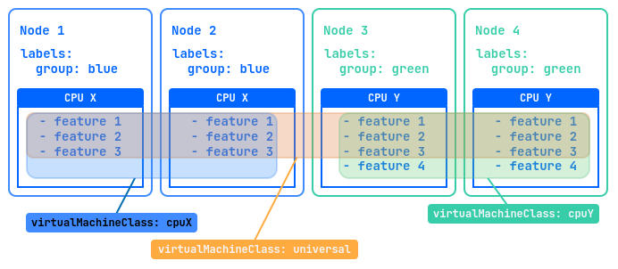
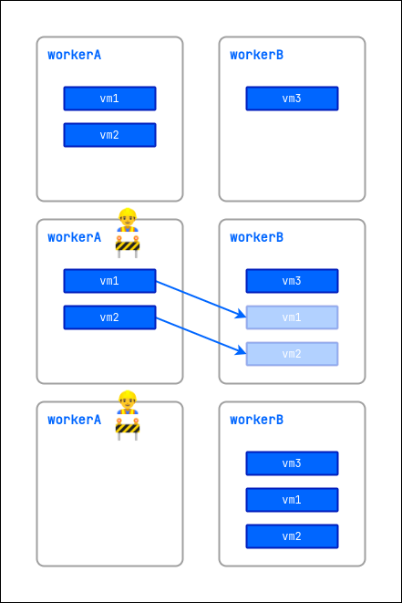
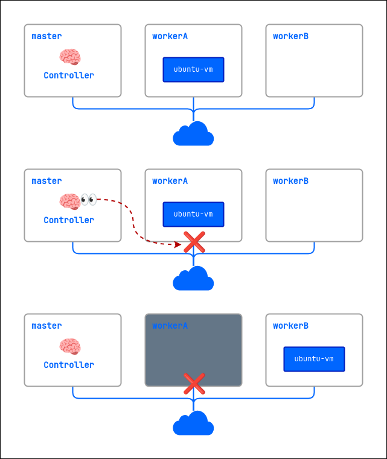

## Введение

Данное руководство предназначено для администраторов Deckhouse Virtualization Platform и описывает порядок создания и изменения кластерных ресурсов.

Также администратор обладает правами на управление проектными ресурсами, описание которых содержится [в Руководстве пользователя](./user_guide.html).

## Параметры модуля

Конфигурация модуля `virtualization` задаётся через ресурс ModuleConfig в формате YAML. Ниже приведен пример базовой настройки:

```yaml
apiVersion: deckhouse.io/v1alpha1
kind: ModuleConfig
metadata:
  name: virtualization
spec:
  enabled: true
  version: 1
  settings:
    ingressClass: nginx # опциональный параметр
    dvcr:
      storage:
        persistentVolumeClaim:
          size: 50G
          storageClassName: sds-replicated-thin-r1
        type: PersistentVolumeClaim
    virtualMachineCIDRs:
      - 10.66.10.0/24
```

Как задать конфигурацию модуля `virtualization` в веб-интерфейсе:

- Перейдите на вкладку «Система», далее в раздел «Deckhouse» -> «Модули».
- Из списка выберите модуль `virtualization`.
- Во всплывающем окне выберите вкладку «Конфигурация».
- Для отображения настроек нажмите переключатель «Дополнительные настройки».
- Выполните настройки. Название полей на форме соотносится с названием параметров в YAML.
- Для применения настроек нажмите кнопку «Сохранить».

### Описание параметров

**Включение модуля**

Управление состоянием модуля осуществляется через поле `.spec.enabled`. Укажите:

- `true` — чтобы включить модуль;
- `false` — чтобы выключить модуль.

**Версия конфигурации**

Параметр `.spec.version` определяет версию схемы настроек. Структура параметров может меняться между версиями. Актуальные значения приведены в разделе настроек.

**Хранилище образов виртуальных машин (DVCR)**

Блок `.spec.settings.dvcr.storage` настраивает постоянный том для хранения образов:

- `.spec.settings.dvcr.storage.persistentVolumeClaim.size` — размер тома (например, `50G`). Для расширения хранилища увеличьте значение параметра;
- `.spec.settings.dvcr.storage.persistentVolumeClaim.storageClassName` — класс хранения (например, `sds-replicated-thin-r1`).


Перенос образов при изменении значения параметра `.spec.settings.dvcr.storage.persistentVolumeClaim.storageClassName` не поддерживается.

При смене StorageClass DVCR все образы, хранящиеся в DVCR, будут утеряны.


Для изменения StorageClass DVCR выполните следующие действия:

1. Измените значение [параметра `.spec.settings.dvcr.storage.persistentVolumeClaim.storageClassName`](/modules/virtualization/configuration.html#parameters-dvcr-storage-persistentvolumeclaim-storageclassname).

1. Удалите старый PVC для DVCR с помощью следующей команды:

   ```shell
   d8 k -n d8-virtualization delete pvc -l app=dvcr
   ```

1. Перезапустите DVCR, выполнив следующую команду:

   ```shell
   d8 k -n d8-virtualization rollout restart deployment dvcr
   ```


Хранилище, обслуживающее данный класс хранения `.spec.settings.dvcr.storage.persistentVolumeClaim.storageClassName`, должно быть доступно на узлах, где запускается DVCR (system-узлы, либо worker-узлы, при отсутствии system-узлов).


**Настройки Ingress**

Параметр `.spec.settings.ingressClass` определяет класс Ingress-контроллера, который будет использоваться для загрузки образов виртуальных машин через веб-интерфейс или CLI.

- Если параметр не указан, используется глобальное значение из конфигурации Deckhouse.
- Параметр является опциональным и указывается только при необходимости использовать Ingress-контроллер, отличный от глобального.

Пример:

```yaml
spec:
  settings:
    ingressClass: nginx
```



При загрузке больших образов виртуальных машин (особенно при слабых каналах связи) рекомендуется увеличить таймаут завершения работы воркеров Ingress-контроллера. Это предотвратит прерывание загрузки при перезапуске или обновлении Ingress-контроллера.

Пример:

```yaml
apiVersion: deckhouse.io/v1
kind: IngressNginxController
metadata:
  name: nginx
spec:
  config:
    worker-shutdown-timeout: 1800s  # 30 минут или более при необходимости
```



**Сетевые настройки**

В блоке `.spec.settings.virtualMachineCIDRs` указываются подсети в формате CIDR (например, `10.66.10.0/24`). IP-адреса для виртуальных машин распределяются из этих - диапазонов автоматически или по запросу.

Пример:

```yaml
spec:
  settings:
    virtualMachineCIDRs:
      - 10.66.10.0/24
      - 10.66.20.0/24
      - 10.77.20.0/16
```

Для каждой подсети первый и последний IP-адреса зарезервированы системой и не выдаются виртуальным машинам. Например, для подсети `10.66.10.0/24` адреса `10.66.10.0` и `10.66.10.255` недоступны для использования ВМ.


Подсети блока `.spec.settings.virtualMachineCIDRs` не должны пересекаться с подсетями узлов кластера, подсетью сервисов или подсетью подов (`podCIDR`).

Запрещено удалять подсети, если адреса из них уже выданы виртуальным машинам.


**Настройки классов хранения для образов**

Настройки классов хранения для образов определяются в параметре `.spec.settings.virtualImages` настроек модуля.

Пример:

```yaml
spec:
  ...
  settings:
    virtualImages:
      allowedStorageClassNames:
      - sc-1
      - sc-2
      defaultStorageClassName: sc-1
```

Здесь:

- `allowedStorageClassNames` (опционально) — это список допустимых StorageClass для создания VirtualImage, которые можно явно указать в спецификации ресурса;
- `defaultStorageClassName` (опционально) — это StorageClass, используемый по умолчанию при создании VirtualImage, если параметр `.spec.persistentVolumeClaim.storageClassName` не задан.

**Настройки классов хранения для дисков**

Настройки классов хранения для дисков определяются в параметре `.spec.settings.virtualDisks` настроек модуля.

Пример:

```yaml
spec:
  ...
  settings:
    virtualDisks:
      allowedStorageClassNames:
      - sc-1
      - sc-2
      defaultStorageClassName: sc-1
```

Здесь:

- `allowedStorageClassNames` (опционально) — это список допустимых StorageClass для создания VirtualDisk, которые можно явно указать в спецификации ресурса;
- `defaultStorageClassName` (опционально) — это StorageClass, используемый по умолчанию при создании VirtualDisk, если параметр `.spec.persistentVolumeClaim.storageClassName` не задан.

**Аудит событий безопасности**


Недоступно в CE-редакции.



Для активации аудита требуется, чтобы были включены следующие модули:

- `log-shipper`,
- `runtime-audit-engine`.


Чтобы включить аудит событий безопасности, установите параметр `.spec.settings.audit.enabled` настроек модуля  в `true`:

```yaml
spec:
  enabled: true
  settings:
    audit:
      enabled: true
```


Полный перечень параметров конфигурации приведен в разделе [Настройки](./configuration.html).


## Образы

Ресурс ClusterVirtualImage служит для загрузки образов виртуальных машин во внутрикластерное хранилище, после чего с его помощью можно создавать диски виртуальных машин. Он доступен во всех пространствах имен и проектах кластера.

Процесс создания образа включает следующие шаги:

1. Пользователь создаёт ресурс ClusterVirtualImage.
1. После создания образ автоматически загружается из указанного в спецификации источника в хранилище (DVCR).
1. После завершения загрузки ресурс становится доступным для создания дисков.

Существуют различные типы образов:

- **ISO-образ** — установочный образ, используемый для начальной установки операционной системы (ОС). Такие образы выпускаются производителями ОС и используются для установки на физические и виртуальные серверы.
- **Образ диска с предустановленной системой** — содержит уже установленную и настроенную операционную систему, готовую к использованию после создания виртуальной машины. Готовые образы можно получить на ресурсах разработчиков дистрибутива, либо создать самостоятельно.

Примеры ресурсов для получения образов виртуальной машины:

| Дистрибутив                                                                       | Пользователь по умолчанию |
| --------------------------------------------------------------------------------- | ------------------------- |
| [AlmaLinux](https://almalinux.org/get-almalinux/#Cloud_Images)                    | `almalinux`               |
| [AlpineLinux](https://alpinelinux.org/cloud/)                                     | `alpine`                  |
| [AltLinux](https://ftp.altlinux.ru/pub/distributions/ALTLinux/)                   | `altlinux`                |
| [AstraLinux](https://download.astralinux.ru/ui/native/mg-generic/alse/cloudinit/) | `astra`                   |
| [CentOS](https://cloud.centos.org/centos/)                                        | `cloud-user`              |
| [Debian](https://cdimage.debian.org/images/cloud/)                                | `debian`                  |
| [Rocky](https://rockylinux.org/download/)                                         | `rocky`                   |
| [Ubuntu](https://cloud-images.ubuntu.com/)                                        | `ubuntu`                  |

Поддерживаются следующие форматы образов с предустановленной системой:

- `qcow2`;
- `raw`;
- `vmdk`;
- `vdi`.

Образы могут быть сжаты одним из следующих алгоритмов сжатия: `gz`, `xz`.

После создания ресурса ClusterVirtualImage тип и размер образа определяются автоматически, и эта информация отражается в статусе ресурса.

Образы могут быть загружены из различных источников, таких как HTTP-серверы, где расположены файлы образов, или контейнерные реестры. Также доступна возможность загрузки образов напрямую из командной строки с использованием утилиты `curl`.

Образы могут быть созданы из других образов и дисков виртуальных машин.

С полным описанием параметров конфигурации ресурса ClusterVirtualImage можно ознакомиться [в разделе Custom Resources](cr.html#clustervirtualimage).

### Создание образа с HTTP-сервера

Рассмотрим вариант создания кластерного образа.

1. Чтобы создать ресурс ClusterVirtualImage, выполните следующую команду:

   ```yaml
   d8 k apply -f - <<EOF
   apiVersion: virtualization.deckhouse.io/v1alpha2
   kind: ClusterVirtualImage
   metadata:
     name: ubuntu-22-04
   spec:
     # Источник для создания образа.
     dataSource:
       type: HTTP
       http:
         url: https://cloud-images.ubuntu.com/noble/current/noble-server-cloudimg-amd64.img
   EOF
   ```

1. Проверьте результат создания ресурса ClusterVirtualImage, выполнив следующую команду:

   ```bash
   d8 k get clustervirtualimage ubuntu-22-04

   # Короткий вариант команды.
   d8 k get cvi ubuntu-22-04
   ```

   В результате будет выведена информация о ресурсе:

   ```console
   NAME           PHASE   CDROM   PROGRESS   AGE
   ubuntu-22-04   Ready   false   100%       23h
   ```

После создания ресурс ClusterVirtualImage может находиться в одном из следующих состояний (фаз):

- `Pending` — ожидание готовности всех зависимых ресурсов, требующихся для создания образа;
- `WaitForUserUpload` — ожидание загрузки образа пользователем (фаза присутствует только для `type=Upload`);
- `Provisioning` — идёт процесс создания образа;
- `Ready` — образ создан и готов для использования;
- `Failed` — произошла ошибка в процессе создания образа;
- `Terminating` — идёт процесс удаления образа. Образ может «зависнуть» в данном состоянии, если он ещё подключен к виртуальной машине.

До тех пор, пока образ не перешёл в фазу `Ready`, содержимое всего блока `.spec` допускается изменять. При изменении процесс создании диска запустится заново. После перехода в фазу `Ready` содержимое блока `.spec` **менять нельзя**.

Диагностика проблем с ресурсом осуществляется путем анализа информации в блоке `.status.conditions`.

Чтобы отследить процесс создания образа, добавьте ключ `-w` к команде проверки результата создания ресурса:

```bash
d8 k get cvi ubuntu-22-04 -w
```

Пример вывода:

```console
NAME           PHASE          CDROM   PROGRESS   AGE
ubuntu-22-04   Provisioning   false              4s
ubuntu-22-04   Provisioning   false   0.0%       4s
ubuntu-22-04   Provisioning   false   28.2%      6s
ubuntu-22-04   Provisioning   false   66.5%      8s
ubuntu-22-04   Provisioning   false   100.0%     10s
ubuntu-22-04   Provisioning   false   100.0%     16s
ubuntu-22-04   Ready          false   100%       18s
```

В описании ресурса ClusterVirtualImage можно получить дополнительную информацию о скачанном образе.
Для этого выполните следующую команду:

```bash
d8 k describe cvi ubuntu-22-04
```

Как создать образ с HTTP-сервера в веб-интерфейсе:

- Перейдите на вкладку «Система», далее в раздел «Виртуализация» -> «Кластерные образы».
- Нажмите «Создать образ», далее в выпадающем меню выберите «Загрузить данные по ссылке (HTTP)».
- В поле «Имя образа» введите имя образа.
- В поле «URL» укажите ссылку на образ.
- Нажмите «Создать».
- Дождитесь пока образ перейдет в состояние `Готов`.

### Создание образа из реестра контейнеров

Образ, хранящийся в реестре контейнеров, имеет определённый формат. Рассмотрим на примере:

1. Для начала загрузите образ локально:

   ```bash
   curl -L https://cloud-images.ubuntu.com/minimal/releases/jammy/release/ubuntu-22.04-minimal-cloudimg-amd64.img -o ubuntu2204.img
   ```

1. Далее создайте `Dockerfile` со следующим содержимым:

   ```Dockerfile
   FROM scratch
   COPY ubuntu2204.img /disk/ubuntu2204.img
   ```

1. Соберите образ и загрузите его в реестр контейнеров. В качестве реестра контейнеров в примере ниже использован `docker.io`. Для выполнения вам необходимо иметь учётную запись сервиса и настроенное окружение.

   ```bash
   docker build -t docker.io/<username>/ubuntu2204:latest
   ```

   где `<username>` — имя пользователя, указанное при регистрации в `docker.io`.

1. Загрузите созданный образ в реестр контейнеров:

   ```bash
   docker push docker.io/<username>/ubuntu2204:latest
   ```

1. Чтобы использовать этот образ, создайте в качестве примера ресурс:

   ```yaml
   d8 k apply -f - <<EOF
   apiVersion: virtualization.deckhouse.io/v1alpha2
   kind: ClusterVirtualImage
   metadata:
     name: ubuntu-2204
   spec:
     dataSource:
       type: ContainerImage
       containerImage:
         image: docker.io/<username>/ubuntu2204:latest
   EOF
   ```

Как создать образ из реестра контейнеров в веб-интерфейсе:

- Перейдите на вкладку «Система», далее в раздел «Виртуализация» -> «Кластерные образы».
- Нажмите «Создать образ», далее в выпадающем списке выберите «Загрузить данные из образа контейнера».
- В поле «Имя образа» введите имя образа.
- В поле «Образ в реестре контейнеров» укажите ссылку на образ.
- Нажмите «Создать».
- Дождитесь пока образ перейдет в состояние `Готов`.

### Загрузка образа из командной строки

1. Чтобы загрузить образ из командной строки, предварительно создайте следующий ресурс, как представлено ниже на примере ClusterVirtualImage:

   ```yaml
   d8 k apply -f - <<EOF
   apiVersion: virtualization.deckhouse.io/v1alpha2
   kind: ClusterVirtualImage
   metadata:
     name: some-image
   spec:
     # Настройки источника образа.
     dataSource:
       type: Upload
   EOF
   ```

   После создания ресурс перейдёт в фазу `WaitForUserUpload`, что говорит о готовности к загрузке образа.

1. Доступно два варианта загрузки — с узла кластера и с произвольного узла за пределами кластера:

   ```bash
   d8 k get cvi some-image -o jsonpath="{.status.imageUploadURLs}"  | jq
   ```

   Пример вывода:

   ```console
   {
     "external":"https://virtualization.example.com/upload/g2OuLgRhdAWqlJsCMyNvcdt4o5ERIwmm",
     "inCluster":"http://10.222.165.239/upload"
   }
   ```

   Здесь:

   - `inCluster` — URL-адрес, который используется, если необходимо выполнить загрузку образа с одного из узлов кластера;
   - `external` — URL-адрес, который используется во всех остальных случаях.

1. В качестве примера загрузите образ Cirros:

   ```bash
   curl -L http://download.cirros-cloud.net/0.5.1/cirros-0.5.1-x86_64-disk.img -o cirros.img
   ```

1. Выполните загрузку образа с использованием следующей команды:

   ```bash
   curl https://virtualization.example.com/upload/g2OuLgRhdAWqlJsCMyNvcdt4o5ERIwmm --progress-bar -T cirros.img | cat
   ```

1. После завершения загрузки образ должен быть создан и переведён в фазу `Ready`.
   Чтобы проверить это, выполните следующую команду:

   ```bash
   d8 k get cvi some-image
   ```

   Пример вывода:

   ```console
   NAME         PHASE   CDROM   PROGRESS   AGE
   some-image   Ready   false   100%       1m
   ```

Как выполнить операцию в веб-интерфейсе:

- Перейдите на вкладку «Система», далее в раздел «Виртуализация» -> «Кластерные образы».
- Нажмите «Создать образ», далее в выпадающем меню выберите «Загрузить с компьютера».
- В поле «Имя образа» введите имя образа.
- В поле «Загрузить файл» нажмите ссылку «Выберите файл на вашем компьютере».
- Выберите файл в открывшемся файловом менеджере.
- Нажмите кнопку «Создать».
- Дождитесь пока образ перейдет в состояние `Готов`.

### Очистка хранилища образов

Со временем создание и удаление ресурсов ClusterVirtualImage, VirtualImage, VirtualDisk приводит к накоплению
неактуальных образов во внутрикластерном хранилище. Для поддержания хранилища в актуальном состоянии предусмотрена сборка мусора по расписанию.
По умолчанию эта функция отключена. Для включения очистки нужно задать расписание в настройках модуля в ресурсе ModuleConfig/virtualization:

```yaml
apiVersion: deckhouse.io/v1alpha1
kind: ModuleConfig
metadata:
  name: virtualization
spec:
  # ...
  settings:
    dvcr:
      gc:
        schedule: "0 20 * * *"
  # ...
```

На время работы сборки мусора хранилище переводится в режим «только чтение». Все создаваемые в это время ресурсы будут ожидать окончания очистки.

Для проверки наличия неактуальных образов в хранилище можно выполнить такую команду:

```bash
d8 k -n d8-virtualization exec deploy/dvcr -- dvcr-cleaner gc check
```

На экран будут выведены сведения о состоянии хранилища и список неактуальных образов, которые могут быть удалены.

```console
Found 2 cvi, 5 vi, 1 vd manifests in registry
Found 1 cvi, 5 vi, 11 vd resources in cluster
  Total     Used    Avail     Use%
36.3GiB  13.1GiB  22.4GiB      39%
Images eligible for cleanup:
KIND                   NAMESPACE            NAME
ClusterVirtualImage                         debian-12
VirtualDisk            default              debian-10-root
VirtualImage           default              ubuntu-2204
```

## Классы виртуальных машин

Ресурс VirtualMachineClass предназначен для централизованной конфигурации предпочтительных параметров виртуальных машин.
Он позволяет определять инструкции CPU, политики конфигурации ресурсов CPU и памяти для виртуальных машин, а также определять соотношения этих ресурсов.
Помимо этого, VirtualMachineClass обеспечивает управление размещением виртуальных машин по узлам платформы.
Это позволяет администраторам эффективно управлять ресурсами платформы виртуализации и оптимально размещать виртуальные машины на узлах платформы.

Во время установки автоматически создаётся ресурс VirtualMachineClass с именем `generic`. Он представляет собой универсальный тип процессора на основе более старой, но широко поддерживаемой архитектуры Nehalem. Это позволяет запускать виртуальные машины на любых узлах кластера и поддерживает их живую миграцию.

Администратор может изменять параметры ресурса VirtualMachineClass `generic` (за исключением секции `.spec.cpu`), либо удалить данный ресурс.



Не рекомендуется использовать VirtualMachineClass `generic` для запуска рабочих нагрузок в production-средах, поскольку данный класс соответствует процессору с наименьшей функциональностью.

Рекомендуется после добавления и настройки всех узлов в кластере создать хотя бы один ресурс VirtualMachineClass с типом `Discovery`. Это обеспечит выбор наилучшей доступной конфигурации процессора с учётом всех CPU в вашем кластере, позволит виртуальным машинам максимально эффективно использовать возможности процессоров и обеспечит беспрепятственную миграцию между узлами.

Пример настройки смотрите в разделе [Пример конфигурации vCPU Discovery](#пример-конфигурации-vcpu-discovery).


Чтобы вывести список ресурсов VirtualMachineClass, выполните следующую команду:

```bash
d8 k get virtualmachineclass
```

Пример вывода:

```console
NAME               PHASE   AGE
generic            Ready   6d1h
```

Обязательно указывайте ресурс VirtualMachineClass в конфигурации виртуальной машины.
Пример указания класса в спецификации ВМ:

```yaml
apiVersion: virtualization.deckhouse.io/v1alpha2
kind: VirtualMachine
metadata:
  name: linux-vm
spec:
  virtualMachineClassName: generic # Название ресурса VirtualMachineClass.
  ...
```

### VirtualMachineClass по умолчанию

Для удобства можно назначить VirtualMachineClass по умолчанию. Этот класс будет использоваться в поле `spec.virtualMachineClassName`, если оно не указано в манифесте виртуальной машины.

VirtualMachineClass по умолчанию задаётся с помощью аннотации `virtualmachineclass.virtualization.deckhouse.io/is-default-class`. В кластере может быть только один класс по умолчанию. Класс по умолчанию изменяется снятием аннотации с одного класса и добавлением её к другому.

Не рекомендуется ставить аннотацию на класс `generic`, так как при обновлении она может пропасть. Рекомендуется создать собственный класс и назначить его классом по умолчанию.

Пример вывода списка классов без класса по умолчанию:

```console
$ d8 k get vmclass

NAME                                    PHASE   ISDEFAULT   AGE
generic                                 Ready               1d
host-passthrough-custom                 Ready               1d
```

Пример назначения класса по умолчанию:

```shell
d8 k annotate vmclass host-passthrough-custom virtualmachineclass.virtualization.deckhouse.io/is-default-class=true
virtualmachineclass.virtualization.deckhouse.io/host-passthrough-custom annotated
```

После назначения класса по умолчанию вывод будет таким:

```console
$ d8 k get vmclass

NAME                                    PHASE   ISDEFAULT   AGE
generic                                 Ready               1d
host-passthrough-custom                 Ready   true        1d
```

При создании ВМ без указания значения для поля `spec.virtualMachineClassName` в него будет подставлено имя `host-passthrough-custom`.

### Настройки VirtualMachineClass

Структура ресурса VirtualMachineClass выглядит следующим образом:

```yaml
apiVersion: virtualization.deckhouse.io/v1alpha2
kind: VirtualMachineClass
metadata:
  name: <vmclass-name>
  # (опционально) Класс по умолчанию.
  # annotations:
  #   virtualmachineclass.virtualization.deckhouse.io/is-default-class: "true"
spec:
  # Блок описывает параметры виртуального процессора для виртуальных машин.
  # Изменять данный блок нельзя после создания ресурса.
  cpu: ...

  # (опциональный блок) Описывает правила размещения виртуальных машины по узлам.
  # При изменении автоматически применяется ко всем виртуальных машинам, использующим данный VirtualMachineClass.
  nodeSelector: ...

  # (опциональный блок) Описывает политику настройки ресурсов виртуальных машин.
  # При изменении автоматически применяется ко всем виртуальных машинам, использующим данный VirtualMachineClass.
  sizingPolicies: ...
```

Как настроить VirtualMachineClass в веб-интерфейсе:

- Перейдите на вкладку «Система», далее в раздел «Виртуализация» -> «Классы ВМ».
- Нажмите кнопку «Создать».
- В открывшемся окне введите имя для класса вм в поле «Имя».

Далее рассмотрим настройки блоков более детально.

#### Настройки vCPU

Блок `.spec.cpu` позволяет задать или настроить vCPU для ВМ.

Настройки блока `.spec.cpu` после создания ресурса VirtualMachineClass изменять нельзя.


Примеры настройки блока `.spec.cpu`:

- Класс с vCPU с требуемым набором процессорных инструкций. Для этого используйте `type: Features`, чтобы задать необходимый набор поддерживаемых инструкций для процессора:

  ```yaml
  spec:
    cpu:
      features:
        - vmx
      type: Features
  ```

  Как настроить vCPU в веб-интерфейсе в [форме создания классов ВМ](#настройки-virtualmachineclass):

  - В блоке «Настройки ЦП» в поле «Тип» выберите `Features`.
  - В поле «Обязательный набор поддерживаемых инструкций» выберите необходимые вам инструкции для процессора.
  - Для создания класса ВМ нажмите кнопку «Создать».

- Класс c универсальным vCPU для заданного набора узлов. Для этого используйте `type: Discovery`:

  ```yaml
  spec:
    cpu:
      discovery:
        nodeSelector:
          matchExpressions:
            - key: node-role.kubernetes.io/control-plane
              operator: DoesNotExist
      type: Discovery
  ```

  Как выполнить операцию в веб-интерфейсе в [форме создания классов ВМ](#настройки-virtualmachineclass):

  - В блоке «Настройки ЦП» в поле «Тип» выберите `Discovery`.
  - Нажмите «Добавить» в блоке «Условия для создания универсального процессора» -> «Лейблы и выражения».
  - Во всплывающем окне можете задать «Ключ», «Оператор» и «Значение» ключа, что соответствует настройкам `spec.cpu.discovery.nodeSelector`.
  - Для подтверждения параметров ключа нажмите кнопку «Enter».
  - Для создания класса ВМ нажмите кнопку «Создать».

- Класс c `type: Host` использует виртуальный vCPU, максимально соответствующий набору инструкций vCPU узла платформы, что обеспечивает высокую производительность и функциональность.
  Он также гарантирует совместимость с живой миграцией для узлов с похожими типами процессоров.
  Например, миграция виртуальной машины между узлами с процессорами Intel и AMD невозможна. Это также относится к процессорам разных поколений, так как их наборы инструкций могут отличаться.

  ```yaml
  spec:
    cpu:
      type: Host
  ```

  Как выполнить операцию в веб-интерфейсе в [форме создания классов ВМ](#настройки-virtualmachineclass):

  - В блоке «Настройки ЦП» в поле «Тип» выберите `Host`.
  - Для создания класса ВМ нажмите кнопку «Создать».

- Класс с `type: HostPassthrough` использует физический CPU узла платформы без изменений.
  Виртуальная машина, использующая этот класс, может быть мигрирована только на узел, у которого CPU точно совпадает с CPU исходного узла.

  ```yaml
  spec:
    cpu:
      type: HostPassthrough
  ```

  Как выполнить операцию в веб-интерфейсе в [форме создания классов ВМ](#настройки-virtualmachineclass):

  - В блоке «Настройки ЦП» в поле «Тип» выберите `HostPassthrough`.
  - Для создания класса ВМ нажмите кнопку «Создать».

- Чтобы создать vCPU конкретного процессора с предварительно определённым набором инструкций, используйте тип `type: Model`.
  Предварительно, чтобы получить перечень названий поддерживаемых CPU для узла кластера, выполните команду:

  ```bash
  d8 k get nodes <node-name> -o json | jq '.metadata.labels | to_entries[] | select(.key | test("cpu-model.node.virtualization.deckhouse.io")) | .key | split("/")[1]' -r
  ```

  Пример вывода:

  ```console
  Broadwell-noTSX
  Broadwell-noTSX-IBRS
  Haswell-noTSX
  Haswell-noTSX-IBRS
  IvyBridge
  IvyBridge-IBRS
  Nehalem
  Nehalem-IBRS
  Penryn
  SandyBridge
  SandyBridge-IBRS
  Skylake-Client-noTSX-IBRS
  Westmere
  Westmere-IBRS
  ```

  Далее укажите в спецификации ресурса VirtualMachineClass следующее:

  ```yaml
  spec:
    cpu:
      model: IvyBridge
      type: Model
  ```

  Как выполнить операцию в веб-интерфейсе в [форме создания классов ВМ](#настройки-virtualmachineclass):

  - В блоке «Настройки ЦП» в поле «Тип» выберите `Model`.
  - В поле «Модель» выберите необходимую модель процессора.
  - Для создания класса ВМ нажмите кнопку «Создать».

#### Настройки размещения

Блок `.spec.nodeSelector` опционален. Он позволяет задать узлы, на которых будут размещаться ВМ, использующие данный vmclass:

```yaml
  spec:
    nodeSelector:
      matchExpressions:
        - key: node.deckhouse.io/group
          operator: In
          values:
          - green
```


Поскольку изменение параметра `.spec.nodeSelector` влияет на все виртуальные машины, использующие данный ресурс VirtualMachineClass, следует учитывать следующее:

- в Enterprise-редакции это может привести к миграции виртуальных машин на новые узлы назначения, если текущие узлы не соответствуют требованиям размещения;
- в Community-редакции это может вызвать перезапуск виртуальных машин в соответствии с автоматической политикой применения изменений, установленной в параметре `.spec.disruptions.restartApprovalMode`.


Как выполнить операцию в веб-интерфейсе в [форме создания классов ВМ](#настройки-virtualmachineclass):

- Нажмите «Добавить» в блоке «Условия планирования ВМ на узлах» -> «Лейблы и выражения».
- Во всплывающем окне можете задать «Ключ», «Оператор» и «Значение» ключа, что соответствует настройкам `spec.nodeSelector`.
- Для подтверждения параметров ключа нажмите кнопку «Enter».
- Для создания класса ВМ нажмите кнопку «Создать».

#### Настройки политики сайзинга

Блок `.spec.sizingPolicy` позволяет задать политики сайзинга ресурсов виртуальных машин, которые используют vmclass.


Изменения в блоке `.spec.sizingPolicy` также могут повлиять на виртуальные машины.
Для виртуальных машин, чья политика сайзинга не будет соответствовать новым требованиям политики, условие `SizingPolicyMatched` в блоке `.status.conditions` будет ложным (`status: False`).

При настройке `sizingPolicy` будьте внимательны и учитывайте [топологию CPU](./user_guide.html#автоматическая-конфигурация-топологии-cpu) для виртуальных машин.


Блок `cores` обязательный и задает диапазоны ядер, на которые распространяется правило, описанное в этом же блоке.

Диапазоны [min; max] для параметра `cores` должны быть строго последовательными и непересекающимися.

Правильная структура (диапазоны идут друг за другом без пересечений):

```yaml
- cores:
    min: 1
    max: 4
    ...
- cores:
    min: 5   # Начало следующего диапазона = (предыдущий max + 1)
    max: 8
```

Недопустимый вариант (пересечение значений):

```yaml
- cores:
    min: 1
    max: 4
    ...
- cores:
    min: 4   # Ошибка: Значение 4 уже входит в предыдущий диапазон
    max: 8
```


Правило : Каждый новый диапазон должен начинаться со значения, непосредственно следующего за max предыдущего диапазона.


Для каждого диапазона ядер `cores` можно задать дополнительные требования:

1. Память (`memory`) — указывается:

    - Либо минимум и максимум памяти для всех ядер в диапазоне,
    - Либо минимум и максимум памяти на одно ядро (`memory.perCore`).

2. Допустимые доли ядер (`coreFractions`) — список разрешенных значений (например, [25, 50, 100] для 25%, 50% или 100% использования ядра). Если в спецификации виртуальной машины явно указан параметр `coreFraction`, его значение должно быть из этого списка.

3. Значение по умолчанию для доли ядер (`defaultCoreFraction`) — указывает, какая доля ядра будет использоваться по умолчанию для данного диапазона ядер, если в спецификации виртуальной машины явно не указан параметр `coreFraction`. Это значение должно присутствовать в списке `coreFractions`. Если `defaultCoreFraction` не задан, по умолчанию применяется значение `100%`.


Важно : Для каждого диапазона cores обязательно укажите:

- Либо memory (или `memory.perCore`),
- Либо coreFractions,
- Либо оба параметра одновременно.


Примеры зависимости объема памяти от числа ядер:

- При использовании параметра `memory` объем разрешенной памяти фиксирован для всего диапазона ядер и не зависит от их количества:

  ```yaml
  - cores:
      min: 1
      max: 4
    memory:
      min: 2Gi
      max: 8Gi
  ```

  В этом примере для любой виртуальной машины с количеством ядер от 1 до 4 можно выбрать любой объём памяти от 2 до 8 ГБ — независимо от числа ядер. Память не зависит от количества ядер в диапазоне.

- При использовании параметра `memory.perCore` объем разрешенной памяти рассчитывается как произведение числа ядер на указанный диапазон памяти на одно ядро:

  ```yaml
  - cores:
      min: 1
      max: 4
    memory:
      perCore:
        min: 1Gi
        max: 2Gi
  ```

  В этом случае:
  - Для виртуальной машины с 1 ядром: от 1×1 ГиБ = 1 ГиБ до 1×2 ГиБ = 2 ГиБ памяти
  - Для виртуальной машины с 2 ядрами: от 2×1 ГиБ = 2 ГиБ до 2×2 ГиБ = 4 ГиБ памяти
  - Для виртуальной машины с 3 ядрами: от 3×1 ГиБ = 3 ГиБ до 3×2 ГиБ = 6 ГиБ памяти
  - Для виртуальной машины с 4 ядрами: от 4×1 ГиБ = 4 ГиБ до 4×2 ГиБ = 8 ГиБ памяти

  Таким образом, при использовании `memory.perCore` объем разрешенной памяти автоматически масштабируется пропорционально числу ядер, что обеспечивает более гибкое и справедливое распределение ресурсов.

- Примеры использования параметра `memory.step` для дискретизации памяти:

  Параметр `step` определяет шаг дискретизации размера памяти. Он позволяет ограничить доступные значения памяти определенными шагами, что упрощает управление ресурсами и предотвращает установку произвольных значений.

  - Пример с `memory.min` и `memory.max` шагом 1 ГБ:

    ```yaml
    - cores:
        min: 1
        max: 4
      memory:
        min: 2Gi
        max: 8Gi
        step: 1Gi
    ```

    В этом случае доступны только следующие значения памяти: **2 ГБ, 3 ГБ, 4 ГБ, 5 ГБ, 6 ГБ, 7 ГБ, 8 ГБ. Нельзя установить, например, 2.5 ГБ или 7.5 ГБ.

  - Пример с `memory.perCore` и шагом:

    ```yaml
    - cores:
        min: 1
        max: 4
      memory:
        perCore:
          min: 1Gi
          max: 2Gi
        step: 512Mi
    ```

    В этом случае для каждой виртуальной машины доступные значения памяти рассчитываются с учетом шага:
    - Для 1 ядра: 1 ГБ, 1.5 ГБ, 2 ГБ
    - Для 2 ядер: 2 ГБ, 3 ГБ, 4 ГБ
    - Для 3 ядер: 3 ГБ, 4.5 ГБ, 6 ГБ
    - Для 4 ядер: 4 ГБ, 6 ГБ, 8 ГБ

    Обратите внимание, что шаг применяется к итоговому объему памяти, а не к памяти на ядро.

Пример политики с подобными настройками:

```yaml
spec:
  sizingPolicies:
    # Для диапазона от 1 до 4 ядер возможно использовать от 1 до 8 ГБ оперативной памяти с шагом 512Mi,
    # т.е 1 ГБ, 1,5 ГБ, 2 ГБ, 2,5 ГБ и т. д.
    # Запрещено использовать выделенные ядра.
    # Доступны все варианты параметра `corefraction`.
    - cores:
        min: 1
        max: 4
      memory:
        min: 1Gi
        max: 8Gi
        step: 512Mi
      coreFractions: [5, 10, 20, 50, 100]
      defaultCoreFraction: 50  # Значение по умолчанию для диапазона 1-4 ядра
    # Для диапазона от 5 до 8 ядер возможно использовать от 5 до 16 ГБ оперативной памяти с шагом 1 ГБ,
    # т.е. 5 ГБ, 6 ГБ, 7 ГБ и т. д.
    # Запрещено использовать выделенные ядра.
    # Доступны некоторые варианты параметра `corefraction`.
    - cores:
        min: 5
        max: 8
      memory:
        min: 5Gi
        max: 16Gi
        step: 1Gi
      coreFractions: [20, 50, 100]
      defaultCoreFraction: 100  # Значение по умолчанию для диапазона 5-8 ядер
    # Для диапазона от 9 до 16 ядер возможно использовать от 9 до 32 ГБ оперативной памяти с шагом 1 ГБ.
    # При необходимости можно использовать выделенные ядра.
    # Доступны некоторые варианты параметра `corefraction`.
    - cores:
        min: 9
        max: 16
      memory:
        min: 9Gi
        max: 32Gi
        step: 1Gi
      coreFractions: [50, 100]
    # Для диапазона от 17 до 248 ядер возможно использовать от 1 до 2 ГБ оперативной памяти из расчёта на одно ядро.
    # Доступны для использования только выделенные ядра.
    # Единственный доступный параметр `corefraction` = 100%.
    - cores:
        min: 17
        max: 248
      memory:
        perCore:
          min: 1Gi
          max: 2Gi
      coreFractions: [100]
```

Как настроить политики сайзинга в веб-интерфейсе в [форме создания классов ВМ](#настройки-virtualmachineclass):

- Нажмите «Добавить» в блоке «Правила выделения ресурсов для виртуальных машин».
- В блоке «ЦП» в поле «Мин» укажите `1`.
- В блоке «ЦП» в поле «Макс» укажите `4`.
- В блоке «ЦП» в поле «Разрешить задать доли ядра» выберите по порядку значения `5%`, `10%`, `20%`, `50%`, `100%`.
- В блоке «Память» установите переключатель в положение «Объем на 1 ядро».
- В блоке «Память» в поле «Мин» укажите `1`.
- В блоке «Память» в поле «Макс» укажите `8`.
- В блоке «Память» в поле «Шаг дискретизации» укажите `1`.
- Вы можете добавить больше диапазонов с помощью кнопки «Добавить».
- Для создания класса ВМ нажмите кнопку «Создать».

### Управление переподпиской на CPU

Переподписка на CPU — это практика выделения виртуальным машинам большего количества виртуальных ядер, чем доступно физических ядер на узле гипервизора. Это позволяет более эффективно использовать вычислительные ресурсы кластера, так как не все ВМ одновременно работают на полную мощность.

Для управления переподпиской используется параметр `coreFraction`, который задаётся в VirtualMachineClass через политику сайзинга (`sizingPolicies`). Параметр определяет гарантированную минимальную долю вычислительной мощности на каждое ядро ВМ (например, `coreFraction: 20%` означает, что ВМ гарантированно получит 20% мощности ядра, но может использовать до 100% при наличии свободных ресурсов). Администратор задаёт разрешённые значения `coreFractions` и `defaultCoreFraction` (значение по умолчанию, если пользователь не указал `coreFraction`).


Если в VirtualMachineClass не задан параметр `coreFractions` (или задано множество значений), пользователь может самостоятельно управлять переподпиской, указывая `coreFraction` при создании ВМ.


При планировании размещения ВМ учитывается сумма гарантированных ресурсов: `Σ(cores × coreFraction / 100)` для всех ВМ на узле. Если эта сумма превышает количество физических ядер, ВМ не будет запущена на этом узле.

Пример: Узел с 4 физическими ядрами, 5 ВМ с `cores: 2` и `coreFraction: 20%`:

- Гарантированные ресурсы: 5 × 2 × 0.2 = 2 CPU
- Виртуальных ядер: 10 на 4 физических (коэффициент переподписки 2.5:1)
- Все ВМ могут быть размещены, так как 2 CPU < 4 CPU

Пример 1: Жёстко заданная переподписка

Администратор жёстко задаёт уровень переподписки — пользователь не может его изменить:

```yaml
apiVersion: virtualization.deckhouse.io/v1alpha2
kind: VirtualMachineClass
metadata:
  name: oversubscribed
spec:
  sizingPolicies:
    - cores:
        min: 1
        max: 8
      memory:
        perCore:
          min: 1Gi
          max: 8Gi
      coreFractions: [20]  # Только одно значение
      defaultCoreFraction: 20
```

Для всех ВМ этого класса жёстко задан `coreFraction: 20%`, что обеспечивает фиксированный коэффициент переподписки 5:1.

Пример 2: Гибкая настройка

Пользователь может выбирать из нескольких значений:

```yaml
apiVersion: virtualization.deckhouse.io/v1alpha2
kind: VirtualMachineClass
metadata:
  name: standard
spec:
  sizingPolicies:
    - cores:
        min: 1
        max: 4
      memory:
        perCore:
          min: 1Gi
          max: 8Gi
      coreFractions: [5, 10, 20, 50, 100]
      defaultCoreFraction: 20
```

Пользователь может выбрать `coreFraction` из списка, при отсутствии указания применяется значение 20%.

### Пример конфигурации vCPU Discovery



Представим, что у нас есть кластер из четырех узлов. Два из этих узлов с лейблом `group=blue` оснащены процессором «CPU X» с тремя наборами инструкций, а остальные два узла с лейблом `group=green` имеют более новый процессор «CPU Y» с четырьмя наборами инструкций.

Для оптимального использования ресурсов данного кластера рекомендуется создать три дополнительных класса виртуальных машин (VirtualMachineClass):

- `universal` — этот класс позволит виртуальным машинам запускаться на всех узлах платформы и мигрировать между ними. При этом будет использоваться набор инструкций для самой младшей модели CPU, что обеспечит наибольшую совместимость;
- `cpuX` — этот класс будет предназначен для виртуальных машин, которые должны запускаться только на узлах с процессором «CPU X». ВМ смогут мигрировать между этими узлами, используя доступные наборы инструкций «CPU X»;
- `cpuY` — этот класс предназначен для виртуальных машин, которые должны запускаться только на узлах с процессором «CPU Y». ВМ смогут мигрировать между этими узлами, используя доступные наборы инструкций «CPU Y».


Набор инструкций для процессора — это набор всех команд, которые процессор может выполнять, таких как сложение, вычитание или работа с памятью. Они определяют, какие операции возможны, влияют на совместимость программ и производительность, а также могут меняться от одного поколения процессоров к другому.


Примерные конфигурации ресурсов для данного кластера:

```yaml
---
apiVersion: virtualization.deckhouse.io/v1alpha2
kind: VirtualMachineClass
metadata:
  name: universal
spec:
  cpu:
    discovery: {}
    type: Discovery
  sizingPolicies: { ... }
---
apiVersion: virtualization.deckhouse.io/v1alpha2
kind: VirtualMachineClass
metadata:
  name: cpuX
spec:
  cpu:
    discovery:
      nodeSelector:
        matchExpressions:
          - key: group
            operator: In
            values: ["blue"]
    type: Discovery
  sizingPolicies: { ... }
---
apiVersion: virtualization.deckhouse.io/v1alpha2
kind: VirtualMachineClass
metadata:
  name: cpuY
spec:
  cpu:
    discovery:
      nodeSelector:
        matchExpressions:
          - key: group
            operator: In
            values: ["green"]
    type: Discovery
  sizingPolicies: { ... }
```

## Механизмы обеспечения надежности

### Миграция и режим обслуживания

Миграция виртуальных машин является важной функцией в управлении виртуализированной инфраструктурой. Она позволяет перемещать работающие виртуальные машины с одного физического узла на другой без их отключения. Миграция виртуальных машин необходима для ряда задач и сценариев:

- Балансировка нагрузки — перемещение виртуальных машин между узлами позволяет равномерно распределять нагрузку на серверы, обеспечивая использование ресурсов наилучшим образом.
- Перевод узла в режим обслуживания — виртуальные машины могут быть перемещены с узлов, которые нужно вывести из эксплуатации для выполнения планового обслуживания или обновления программного обеспечения.
- Обновление «прошивки» виртуальных машин — миграция позволяет обновить «прошивку» виртуальных машин, не прерывая их работу.


При живой миграции действуют следующие ограничения:

- С каждого узла одновременно может мигрировать только одна виртуальная машина.
- Одновременно в кластере может выполняться количество миграций, не превышающее число узлов, на которых разрешён запуск виртуальных машин.
- Пропускная способность для одной миграции ограничена 5 Гбит/с.


#### Запуск миграции произвольной машины

Далее будет рассмотрен пример миграции выбранной виртуальной машины.

1. Перед запуском миграции проверьте текущий статус виртуальной машины:

   ```bash
   d8 k get vm
   ```

   Пример вывода:

   ```console
   NAME                                   PHASE     NODE           IPADDRESS     AGE
   linux-vm                              Running   virtlab-pt-1   10.66.10.14   79m
   ```

   Мы видим, что на данный момент ВМ запущена на узле `virtlab-pt-1`.

1. Для осуществления миграции виртуальной машины с одного узла на другой, с учетом требований к размещению виртуальной машины используется ресурс VirtualMachineOperations (`vmop`) с типом `Evict`. Создайте данный ресурс, следуя примеру:

   ```yaml
   d8 k create -f - <<EOF
   apiVersion: virtualization.deckhouse.io/v1alpha2
   kind: VirtualMachineOperation
   metadata:
     generateName: evict-linux-vm-
   spec:
     # Имя виртуальной машины.
     virtualMachineName: linux-vm
     # Операция для миграции.
     type: Evict
   EOF
   ```

1. Сразу после создания ресурса `vmop` выполните следующую команду:

   ```bash
   d8 k get vm -w
   ```

   Пример вывода:

   ```console
   NAME                                   PHASE       NODE           IPADDRESS     AGE
   linux-vm                              Running     virtlab-pt-1   10.66.10.14   79m
   linux-vm                              Migrating   virtlab-pt-1   10.66.10.14   79m
   linux-vm                              Migrating   virtlab-pt-1   10.66.10.14   79m
   linux-vm                              Running     virtlab-pt-2   10.66.10.14   79m
   ```

1. Если необходимо прервать миграцию, удалите соответствующий ресурс `vmop`, пока он находится в фазе `Pending` или `InProgress`.

Как запустить миграцию ВМ в веб-интерфейсе:

- Перейдите на вкладку «Проекты» и выберите нужный проект.
- Перейдите в раздел «Виртуализация» -> «Виртуальные машины».
- Из списка выберите нужную виртуальную машину и нажмите кнопку с многоточием.
- Во всплывающем меню выберите `Мигрировать`.
- Во всплывающем окне подтвердите или отмените миграцию.

#### Режим обслуживания

При выполнении работ на узлах с запущенными виртуальными машинами существует риск нарушения их работоспособности. Чтобы этого избежать, узел можно перевести в режим обслуживания и мигрировать виртуальные машины на другие свободные узлы.

Для этого выполните следующую команду:

```bash
d8 k drain <nodename> --ignore-daemonsets --delete-emptydir-data
```

где `<nodename>` — узел, на котором предполагается выполнить работы и который должен быть освобождён от всех ресурсов (в том числе от системных).

Если необходимо вытеснить с узла только виртуальные машины, выполните следующую команду:

```bash
d8 k drain <nodename> --pod-selector vm.kubevirt.internal.virtualization.deckhouse.io/name --delete-emptydir-data
```

После выполнения команды `d8 k drain` узел перейдёт в режим обслуживания, и виртуальные машины на нём запускаться не смогут.

Чтобы вывести его из режима обслуживания, остановите выполнение команды `drain` (Ctrl+C), затем выполните:

```bash
d8 k uncordon <nodename>
```



Как выполнить операцию в веб-интерфейсе:

- Перейдите на вкладку «Система», далее в раздел «Узлы» -> «Узлы всех групп».
- Из списка выберите нужный узел и нажмите кнопку «Сделать Cordon + Drain».
- Чтобы вывести его из режима обслуживания, нажмите кнопку «Uncordon».

### Перебалансировка ВМ

Платформа позволяет автоматически управлять размещением работающих виртуальных машин в кластере. Чтобы включить эту функцию, активируйте модуль `descheduler`.

Для перебалансировки используется механизм живой миграции виртуальных машин между узлами кластера.

После активации модуля система самостоятельно следит за распределением виртуальных машин и поддерживает оптимальную загрузку узлов. Основные возможности модуля:

- Балансировка нагрузки — система отслеживает, сколько процессора зарезервировано на каждом узле. Если на каком-либо узле резервируется более 80% процессорных ресурсов, часть виртуальных машин будет автоматически перенесена на менее загруженные узлы. Это помогает избежать перегрузки и обеспечивает стабильную работу ВМ.
- Корректное размещение — система контролирует, соответствует ли текущий узел обязательным требованиям запросов виртуальной машины, а также правилам по их относительному расположению. Например, если правила не допускают размещения определённых ВМ на одном узле, модуль автоматически перенесёт их на подходящий сервер.

### ColdStandby

ColdStandby обеспечивает механизм восстановления работы виртуальной машины после сбоя на узле, на котором она была запущена.

Для работы данного механизма необходимо выполнить следующие требования:

- для политики запуска виртуальной машины (`.spec.runPolicy`) должно быть установлено одно из следующих значений: `AlwaysOnUnlessStoppedManually`, `AlwaysOn`;
- на узлах, где запущены виртуальные машины, должен быть включён механизм [Fencing](https://deckhouse.ru/products/kubernetes-platform/documentation/v1/modules/040-node-manager/cr.html#nodegroup-v1-spec-fencing-mode).

Рассмотрим как это работает на примере:

1. Кластер состоит из трех узлов: `master`, `workerA` и `workerB`.
   На worker-узлах включён механизм Fencing.
   Виртуальная машина `linux-vm` запущена на узле `workerA`.
1. На узле `workerA` возникает проблема (выключилось питание, пропала сеть, и т. д.).
1. Контроллер проверяет доступность узлов и обнаруживает, что `workerA` недоступен.
1. Контроллер удаляет узел `workerA` из кластера.
1. Виртуальная машина `linux-vm` запускается на другом подходящем узле (`workerB`).


