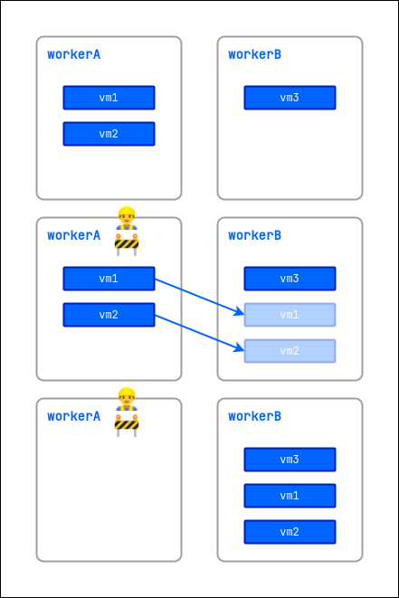
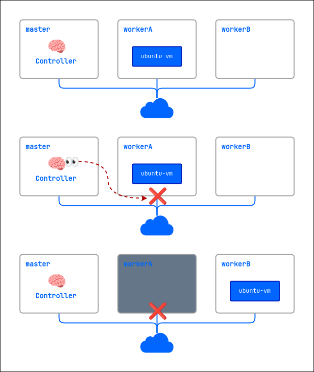

Руководство описывает, как настроить модуль `virtualization` и управлять его кластерными ресурсами.

Права администратора включают и управление проектными ресурсами, которые описаны в [руководстве пользователя](./user_guide.html).

## Параметры модуля

Конфигурация модуля `virtualization` задаётся в ресурсе [ModuleConfig](/products/kubernetes-platform/documentation/v1/reference/api/cr.html#moduleconfig). Ниже приведён пример базовой настройки, в которой указаны класс Ingress-контроллера, хранилище образов и подсеть для виртуальных машин:



{}

```yaml
apiVersion: deckhouse.io/v1alpha1
kind: ModuleConfig
metadata:
  name: virtualization
spec:
  enabled: true
  version: 1
  settings:
    ingressClass: nginx # опциональный параметр
    dvcr:
      storage:
        persistentVolumeClaim:
          size: 50G
          storageClassName: rv-thin-r1
        type: PersistentVolumeClaim
    virtualMachineCIDRs:
      - 10.66.10.0/24
```

{}

{}

1. Перейдите на вкладку «Система», далее в раздел «Deckhouse» → «Модули».
1. Из списка выберите модуль `virtualization`.
1. В открывшемся окне выберите вкладку «Конфигурация».
1. Чтобы отобразить настройки, нажмите переключатель «Дополнительные настройки».
1. Задайте параметры. Названия полей формы соответствуют названиям параметров в YAML.
1. Нажмите кнопку «Сохранить».

{}



### Включение и выключение модуля

За состояние модуля отвечает параметр [`.spec.enabled`](/products/kubernetes-platform/documentation/v1/reference/api/cr.html#moduleconfig-v1alpha1-spec-enabled). Значение `true` включает модуль, значение `false` выключает его.

Выключение модуля останавливает все системные компоненты, которые создают и запускают виртуальные машины (ВМ), поэтому по умолчанию модуль выключить нельзя.
Чтобы это стало возможным, добавьте на [ModuleConfig](/products/kubernetes-platform/documentation/v1/reference/api/cr.html#moduleconfig) `virtualization` аннотацию `modules.deckhouse.io/allow-disabling` со значением `true`.

Перед выключением подготовьте кластер:

1. Удалите все ресурсы модуля, включая виртуальные машины, диски и образы.
1. Убедитесь, что в кластере не осталось активных ресурсов:

   ```shell
   d8 k get virtualization -A
   d8 k get virtualization-cluster
   ```

После этого отредактируйте [ModuleConfig](/products/kubernetes-platform/documentation/v1/reference/api/cr.html#moduleconfig) `virtualization`:

```yaml
apiVersion: deckhouse.io/v1alpha1
kind: ModuleConfig
metadata:
  name: virtualization
  annotations:
    modules.deckhouse.io/allow-disabling: "true"
spec:
  enabled: false
  version: 1
  settings:
    # Укажите существующие настройки.
```


Если ресурсы модуля не удалены, выключение может привести к потере данных.


### Версия конфигурации

Параметр [`.spec.version`](/products/kubernetes-platform/documentation/v1/reference/api/cr.html#moduleconfig-v1alpha1-spec-version) определяет версию схемы настроек. Структура параметров может меняться между версиями, актуальные значения приведены в [настройках модуля](./configuration.html).

### Настройки Ingress

Образы виртуальных машин загружаются в кластер через [Ingress-контроллер](/modules/ingress-nginx/), класс которого определяет параметр [`.spec.settings.ingressClass`](configuration.html#parameters-ingressclass).
Указывать его необязательно, и если параметр не задан, модуль использует глобальное значение из конфигурации Deckhouse Platform.
Задавайте его только тогда, когда для загрузки образов нужен отдельный Ingress-контроллер.

Пример:

```yaml
spec:
  settings:
    ingressClass: nginx
```


Большие образы виртуальных машин по медленному каналу связи загружаются долго, и перезапуск или обновление Ingress-контроллера прерывает такую загрузку.
Чтобы этого избежать, увеличьте тайм-аут завершения рабочих процессов в ресурсе [IngressNginxController](/modules/ingress-nginx/cr.html#ingressnginxcontroller).

Пример:

```yaml
apiVersion: deckhouse.io/v1
kind: IngressNginxController
metadata:
  name: nginx
spec:
  config:
    worker-shutdown-timeout: 1800s  # 30 минут или более при необходимости
```



### Сетевые настройки

В блоке [`.spec.settings.virtualMachineCIDRs`](configuration.html#parameters-virtualmachinecidrs) перечисляются подсети в формате CIDR, из которых модуль выдаёт IP-адреса виртуальным машинам автоматически или по запросу.
Указывайте начальный адрес подсети, выровненный по маске, например `192.168.1.192/27`, а не произвольный адрес из диапазона.

Пример:

```yaml
spec:
  settings:
    virtualMachineCIDRs:
      - 10.66.10.0/24
      - 10.66.20.0/24
      - 10.77.20.0/16
```

Первый и последний адреса каждой подсети зарезервированы и виртуальным машинам не выдаются. Например, в подсети `10.66.10.0/24` недоступны адреса `10.66.10.0` и `10.66.10.255`.

Блок можно не задавать. Модуль в этом случае включится, но работать с адресами виртуальных машин уже нельзя, а именно:

- создать или использовать ресурс [VirtualMachineIPAddress](cr.html#virtualmachineipaddress) нельзя;
- виртуальная машина не может запросить сеть `Main` в параметре [`.spec.networks`](cr.html#virtualmachine-v1alpha2-spec-networks);
- параметр [`.spec.networks`](cr.html#virtualmachine-v1alpha2-spec-networks) виртуальной машины не может быть пустым.


Подсети блока [`.spec.settings.virtualMachineCIDRs`](configuration.html#parameters-virtualmachinecidrs) не должны пересекаться с подсетями узлов кластера, подсетью сервисов или подсетью подов (`podCIDR`).

Удалить подсеть, из которой уже выданы адреса виртуальным машинам, нельзя. Заданный блок также нельзя очистить полностью.


## Хранилище образов виртуальных машин

Образы виртуальных машин модуль хранит во внутреннем хранилище образов контейнеров (DVCR), которое размещается на постоянном томе кластера. Оттуда образы попадают на диски виртуальных машин, поэтому от размера тома зависит, сколько образов поместится в кластер.

### Размер и класс хранения

Размер тома и класс хранения задаются в блоке [`.spec.settings.dvcr.storage`](configuration.html#parameters-dvcr-storage). Чтобы расширить хранилище, увеличьте размер тома.


После того как том создан, уменьшить его размер и сменить класс хранения нельзя.


### Классы хранения для образов и дисков

Класс хранения для образа или диска выбирает владелец проекта. Вы можете ограничить этот выбор и задать класс, который применяется по умолчанию. За образы отвечает блок [`.spec.settings.virtualImages`](configuration.html#parameters-virtualimages), за диски — блок [`.spec.settings.virtualDisks`](configuration.html#parameters-virtualdisks).

Пример:

```yaml
spec:
  settings:
    virtualImages:
      allowedStorageClassSelector:
        matchNames:
          - sc-1
          - sc-2
      defaultStorageClassName: sc-1
    virtualDisks:
      allowedStorageClassSelector:
        matchNames:
          - sc-3
      defaultStorageClassName: sc-3
```

Оба блока устроены одинаково и оба необязательны. Параметр `allowedStorageClassSelector.matchNames` перечисляет классы, которые разрешено выбирать в спецификации [VirtualImage](cr.html#virtualimage) и [VirtualDisk](cr.html#virtualdisk), а `defaultStorageClassName` задаёт класс для тех ресурсов, где параметр [`.spec.persistentVolumeClaim.storageClassName`](cr.html#virtualdisk-v1alpha2-spec-persistentvolumeclaim-storageclassname) не задан.

### Очистка хранилища образов

Когда образы и диски удаляются из кластера, их данные какое-то время остаются в DVCR. Чтобы хранилище не заполнялось неактуальными данными, модуль запускает сборку мусора по расписанию.
По умолчанию она выполняется ежедневно в 02:00. Задать своё расписание можно параметром [`.spec.settings.dvcr.gc.schedule`](configuration.html#parameters-dvcr-gc-schedule) в [ModuleConfig](/products/kubernetes-platform/documentation/v1/reference/api/cr.html#moduleconfig) `virtualization`:



{}

```yaml
apiVersion: deckhouse.io/v1alpha1
kind: ModuleConfig
metadata:
  name: virtualization
spec:
  # ...
  settings:
    dvcr:
      gc:
        schedule: "0 20 * * *"
  # ...
```

Пока идёт сборка мусора, хранилище работает в режиме «только чтение», поэтому создание образов и дисков в это время откладывается до её завершения.

Посмотреть, сколько места занято и какие данные будут удалены при следующей сборке, можно командой:

```bash
d8 k -n d8-virtualization exec deploy/dvcr -- dvcr-cleaner gc check
```

Пример вывода:

```console {.nowrap-default}
Found 2 cvi, 5 vi, 1 vd manifests in registry
Found 1 cvi, 5 vi, 11 vd resources in cluster
  Total     Used    Avail     Use%
36.3GiB  13.1GiB  22.4GiB      39%
Images eligible for cleanup:
KIND                   NAMESPACE            NAME
ClusterVirtualImage                         debian-12
VirtualDisk            default              debian-10-root
VirtualImage           default              ubuntu-2404
```

{}

{}

1. Перейдите на вкладку «Система», далее в раздел «Deckhouse» → «Модули».
1. Из списка выберите модуль `virtualization`.
1. В открывшемся окне на вкладке «Конфигурация» включите переключатель «Дополнительные настройки».
1. В блоке «Хранилище образов дисков и ISO» в поле «Расписание очистки в формате Cron» задайте расписание.
1. Нажмите кнопку «Сохранить».

{}



## Образы

Образ хранит содержимое диска, из которого владельцы проектов создают диски виртуальных машин. Кластерный образ [ClusterVirtualImage](cr.html#clustervirtualimage) доступен во всех неймспейсах и проектах кластера, поэтому загруженный однажды образ используют сразу все проекты.

Образ появляется в кластере в три шага:

1. Администратор создаёт ресурс [ClusterVirtualImage](cr.html#clustervirtualimage) и указывает в нём источник данных.
1. Модуль загружает образ из этого источника во внутреннее хранилище (DVCR).
1. Загруженный образ становится доступен для создания дисков.

Источником образа может быть HTTP-сервер с файлом образа, хранилище образов контейнеров или файл на вашем компьютере, который вы загружаете из командной строки. Кроме того, образ можно создать из другого образа, из диска виртуальной машины или из снимка диска.

Ход создания образа показывает колонка `PHASE` в выводе `d8 k get cvi`, её значения описаны в поле [`.status.phase`](cr.html#clustervirtualimage-v1alpha2-status-phase). Следить за созданием в реальном времени помогает ключ `-w`, а если образ надолго остаётся не готов, причину подскажет блок [`.status.conditions`](cr.html#clustervirtualimage-v1alpha2-status-conditions) и команда `d8 k describe cvi`.

Пока образ не перешёл в фазу `Ready`, блок `.spec` можно менять, и после изменения загрузка начнётся заново. У готового образа блок `.spec` изменить уже нельзя. Все параметры образа описаны в [ClusterVirtualImage](cr.html#clustervirtualimage).

### Типы и форматы образов

Образы бывают двух видов:

- **ISO-образ** — установочный образ для первоначальной установки операционной системы (ОС). Такие образы выпускают производители ОС и применяют их для установки на физические и виртуальные серверы.
- **Образ диска с предустановленной системой** — содержит уже установленную и настроенную ОС, готовую к работе сразу после создания виртуальной машины (ВМ). Такие образы публикуют разработчики дистрибутивов, либо вы готовите их самостоятельно.

Готовые образы с предустановленной системой публикуют разработчики дистрибутивов. В таблице приведены страницы загрузки и имена пользователей, которые заданы в этих образах по умолчанию:

<a id="image-resources-table"></a>

| Дистрибутив                                                                       | Пользователь по умолчанию |
| --------------------------------------------------------------------------------- | ------------------------- |
| [AlmaLinux](https://almalinux.org/get-almalinux/#Cloud_Images)                    | `almalinux`               |
| [AlpineLinux](https://alpinelinux.org/cloud/)                                     | `alpine`                  |
| [AltLinux](https://ftp.altlinux.ru/pub/distributions/ALTLinux/)                   | `altlinux`                |
| [AstraLinux](https://download.astralinux.ru/ui/native/mg-generic/alse/cloudinit/) | `astra`                   |
| [CentOS](https://cloud.centos.org/centos/)                                        | `cloud-user`              |
| [Debian](https://cdimage.debian.org/images/cloud/)                                | `debian`                  |
| [Rocky](https://rockylinux.org/download/)                                         | `rocky`                   |
| [Ubuntu](https://cloud-images.ubuntu.com/)                                        | `ubuntu`                  |

Модуль принимает файл образа в следующих форматах:

- `qcow2`;
- `raw`;
- `vmdk`;
- `vdi`;
- `vhd`;
- `vhdx`.

Образ можно передать сжатым алгоритмом `gz`, `xz` или `zst`, модуль распакует его при загрузке.

Тип и размер образа модуль определяет сам и записывает их в статус ресурса. Размеров два, и оба видны в выводе команды `d8 k get cvi -o wide`:

- `STOREDSIZE` — объём, который образ занимает в хранилище. Для образа, загруженного в сжатом виде, он меньше распакованного размера. По этой колонке удобно оценивать, сколько места образы занимают в DVCR.
- `UNPACKEDSIZE` — размер образа после распаковки. Он задаёт минимальный размер диска, который получится создать из этого образа.


Создавая диск из образа, указывайте размер не меньше значения `UNPACKEDSIZE`.
Если размер не задан, диск создаётся ровно по распакованному размеру образа.


### Создание кластерного образа с HTTP-сервера

Проще всего создать образ, указав ссылку на файл, который лежит на HTTP-сервере.



{}

1. Создайте ресурс [ClusterVirtualImage](cr.html#clustervirtualimage):

   ```bash
   d8 k apply -f - <<EOF
   apiVersion: virtualization.deckhouse.io/v1alpha2
   kind: ClusterVirtualImage
   metadata:
     name: ubuntu-24-04
   spec:
     # Источник для создания образа.
     dataSource:
       type: HTTP
       http:
         url: https://cloud-images.ubuntu.com/noble/current/noble-server-cloudimg-amd64.img
   EOF
   ```

1. Проверьте, что образ создан:

   ```bash
   d8 k get clustervirtualimage ubuntu-24-04

   # Короткий вариант команды.
   d8 k get cvi ubuntu-24-04
   ```

   Пример вывода:

   ```console
   NAME           PHASE   CDROM   PROGRESS   AGE
   ubuntu-24-04   Ready   false   100%       23h
   ```

Чтобы модуль сверил скачанный файл с контрольной суммой, добавьте в источник блок [`checksum`](cr.html#clustervirtualimage-v1alpha2-spec-datasource-http-checksum). Если файл не совпал ни с одной из указанных сумм, образ перейдёт в фазу `Failed`.

{}

{}

1. Перейдите на вкладку «Система», далее в раздел «Виртуализация» → «Кластерные образы».
1. Нажмите кнопку «Создать», затем в блоке «Источник» выберите «По ссылке».
1. В поле «Имя образа» введите имя образа.
1. В поле «URL» укажите ссылку на образ.
1. Нажмите кнопку «Создать».
1. Дождитесь, когда образ перейдёт в состояние «Готов».

{}



### Создание кластерного образа из хранилища образов контейнеров

Модуль умеет забирать образ из внешнего хранилища образов контейнеров, но файл диска должен лежать в образе контейнера по пути `/disk`. Ниже показано, как подготовить такой образ контейнера и создать из него кластерный образ.



{}

1. Скачайте файл образа на локальную машину:

   ```bash
   curl -L https://cloud-images.ubuntu.com/minimal/releases/noble/release/ubuntu-24.04-minimal-cloudimg-amd64.img -o ubuntu2404.img
   ```

1. Создайте `Dockerfile` со следующим содержимым:

   ```Dockerfile
   FROM scratch
   COPY ubuntu2404.img /disk/ubuntu2404.img
   ```

1. Соберите образ контейнера. В примере используется хранилище [docker.com](https://www.docker.com/), для работы с которым нужны учётная запись и настроенное окружение:

   ```bash
   docker build -t docker.io/<USERNAME>/ubuntu2404:latest
   ```

   Здесь `<USERNAME>` — имя пользователя, указанное при регистрации в хранилище.

1. Загрузите собранный образ контейнера в хранилище:

   ```bash
   docker push docker.io/<USERNAME>/ubuntu2404:latest
   ```

1. Создайте ресурс [ClusterVirtualImage](cr.html#clustervirtualimage), указав путь к образу контейнера:

   ```bash
   d8 k apply -f - <<EOF
   apiVersion: virtualization.deckhouse.io/v1alpha2
   kind: ClusterVirtualImage
   metadata:
     name: ubuntu-2404
   spec:
     dataSource:
       type: ContainerImage
       containerImage:
         image: docker.io/<USERNAME>/ubuntu2404:latest
   EOF
   ```

Модуль работает только с теми хранилищами, где включён TLS. Если хранилище использует собственный центр сертификации, передайте цепочку сертификатов в параметре [`caBundle`](cr.html#clustervirtualimage-v1alpha2-spec-datasource-containerimage-cabundle), а учётные данные для доступа к закрытому хранилищу возьмите из секрета, указанного в параметре `imagePullSecret`.

{}

{}

1. Перейдите на вкладку «Система», далее в раздел «Виртуализация» → «Кластерные образы».
1. Нажмите кнопку «Создать», затем в блоке «Источник» выберите «Из реестра».
1. В поле «Имя образа» введите имя образа.
1. В поле «Образ в реестре контейнеров» укажите ссылку на образ.
1. Нажмите кнопку «Создать».
1. Дождитесь, когда образ перейдёт в состояние «Готов».

{}



### Загрузка кластерного образа из командной строки

Если файл образа лежит на вашем компьютере, загрузите его напрямую. Модуль создаёт для этого временную точку приёма данных и ждёт загрузки.



{}

1. Создайте ресурс [ClusterVirtualImage](cr.html#clustervirtualimage) с источником `Upload`:

   ```bash
   d8 k apply -f - <<EOF
   apiVersion: virtualization.deckhouse.io/v1alpha2
   kind: ClusterVirtualImage
   metadata:
     name: some-image
   spec:
     # Настройки источника образа.
     dataSource:
       type: Upload
   EOF
   ```

   Ресурс перейдёт в фазу `WaitForUserUpload` и будет готов принять файл. Начните загрузку в течение 10 минут, иначе ресурс перейдёт в фазу `Failed` и его придётся создать заново.

1. Получите адреса, по которым принимается файл:

   ```bash
   d8 k get cvi some-image -o jsonpath="{.status.imageUploadURLs}" | jq
   ```

   Пример вывода:

   ```console {.nowrap-default}
   {
     "external":"https://virtualization.example.com/upload/<SECRET_URL>",
     "inCluster":"http://10.222.165.239/upload"
   }
   ```

   Адрес `inCluster` используйте, если загружаете файл с одного из узлов кластера, а `external` — во всех остальных случаях.

1. Загрузите файл по выбранному адресу. В примере сначала скачивается образ Cirros, а затем отправляется в кластер:

   ```bash
   curl -L http://download.cirros-cloud.net/0.5.1/cirros-0.5.1-x86_64-disk.img -o cirros.img
   curl https://virtualization.example.com/upload/<SECRET_URL> --progress-bar -T cirros.img | cat
   ```

   Здесь `<SECRET_URL>` — последняя часть адреса из предыдущего шага.

1. Убедитесь, что образ перешёл в фазу `Ready`:

   ```bash
   d8 k get cvi some-image
   ```

   Пример вывода:

   ```console
   NAME         PHASE   CDROM   PROGRESS   AGE
   some-image   Ready   false   100%       1m
   ```

Загруженный файл тоже можно сверить с контрольной суммой, для этого задайте блок [`checksum`](cr.html#clustervirtualimage-v1alpha2-spec-datasource-upload-checksum) в источнике данных.

{}

{}

1. Перейдите на вкладку «Система», далее в раздел «Виртуализация» → «Кластерные образы».
1. Нажмите кнопку «Создать», затем в блоке «Источник» выберите «Загрузить».
1. В поле «Имя образа» введите имя образа.
1. В блоке «Загрузить файл» перетащите файл в выделенную область или нажмите «выберите на вашем компьютере».
1. Выберите файл в открывшемся файловом менеджере.
1. Нажмите кнопку «Создать».
1. Дождитесь, когда образ перейдёт в состояние «Готов».

{}



## Классы виртуальных машин

Класс виртуальной машины (ВМ) задаёт то, что владелец проекта не настраивает сам, а именно модель виртуального процессора, допустимые сочетания ядер и памяти, а также узлы, на которых ВМ может работать. Описывает эти правила ресурс [VirtualMachineClass](cr.html#virtualmachineclass), и через него вы управляете тем, как рабочие нагрузки проектов распределяются по узлам кластера.

При первичной установке модуль создаёт класс `generic` с моделью процессора Nehalem. Эта модель старая, но поддерживается любым современным процессором, поэтому ВМ такого класса запускаются на любом узле кластера и мигрируют между узлами без ограничений.


Класс `generic` соответствует процессору с наименьшим набором инструкций, поэтому для рабочих нагрузок в production он не подходит.

Когда все узлы добавлены в кластер и настроены, создайте хотя бы один класс с типом процессора `Discovery`. Модуль подберёт для него набор инструкций, доступный на всех узлах сразу, и виртуальные машины смогут использовать возможности процессоров полнее, сохранив способность мигрировать между узлами. Набор инструкций фиксируется в момент создания ресурса и не меняется, когда узлы добавляются или удаляются.

Как настроить такой класс, показано в разделе [«Пример конфигурации vCPU Discovery»](#пример-конфигурации-vcpu-discovery).


Классы существуют на уровне кластера. Чтобы вывести их список, выполните команду:

```bash
d8 k get virtualmachineclass
```

Пример вывода:

```console
NAME      PHASE   ISDEFAULT   AGE
generic   Ready               6d1h
```

Изменить у любого класса можно всё, кроме блока [`.spec.cpu`](cr.html#virtualmachineclass-v1alpha3-spec-cpu), потому что модель процессора фиксируется при создании ресурса. Класс `generic` разрешено и менять, и удалять, но заново он не создастся, потому что модуль добавляет его только при первичной установке.

Владелец проекта указывает класс в параметре [`.spec.virtualMachineClassName`](cr.html#virtualmachine-v1alpha2-spec-virtualmachineclassname) виртуальной машины:

```yaml
apiVersion: virtualization.deckhouse.io/v1alpha2
kind: VirtualMachine
metadata:
  name: linux-vm
spec:
  virtualMachineClassName: generic # Название ресурса VirtualMachineClass.
  # ...
```

### VirtualMachineClass по умолчанию

Один из классов можно назначить классом по умолчанию. Модуль подставит его имя в параметр [`.spec.virtualMachineClassName`](cr.html#virtualmachine-v1alpha2-spec-virtualmachineclassname), если владелец проекта не указал класс сам.

Класс по умолчанию помечается аннотацией `virtualmachineclass.virtualization.deckhouse.io/is-default-class` со значением `true`. Такой класс в кластере может быть только один, поэтому, чтобы назначить новый, сначала снимите аннотацию с текущего.

Не ставьте аннотацию на класс `generic`, потому что при обновлении модуля она может пропасть. Создайте собственный класс и назначьте по умолчанию его.

1. Посмотрите, какие классы есть в кластере:

   ```bash
   d8 k get vmclass
   ```

   Пример вывода, в котором класса по умолчанию нет:

   ```console {.nowrap-default}
   NAME                      PHASE   ISDEFAULT   AGE
   generic                   Ready               1d
   host-passthrough-custom   Ready               1d
   ```

1. Назначьте класс по умолчанию:

   ```bash
   d8 k annotate vmclass host-passthrough-custom virtualmachineclass.virtualization.deckhouse.io/is-default-class=true
   ```

1. Убедитесь, что аннотация проставлена:

   ```bash
   d8 k get vmclass
   ```

   Пример вывода:

   ```console {.nowrap-default}
   NAME                      PHASE   ISDEFAULT   AGE
   generic                   Ready               1d
   host-passthrough-custom   Ready   true        1d
   ```

Теперь виртуальные машины, созданные без указания класса, получат класс `host-passthrough-custom`.

### Настройки VirtualMachineClass

Класс состоит из трёх блоков, каждый из которых отвечает за свою группу настроек:



{}

```yaml
apiVersion: virtualization.deckhouse.io/v1alpha2
kind: VirtualMachineClass
metadata:
  name: <VMCLASS_NAME>
  # Аннотация назначает класс классом по умолчанию, её можно не указывать.
  # annotations:
  #   virtualmachineclass.virtualization.deckhouse.io/is-default-class: "true"
spec:
  # Параметры виртуального процессора. Блок обязателен и после создания ресурса не меняется.
  cpu: ...

  # Правила размещения виртуальных машин по узлам. Блок необязателен.
  # Изменения применяются ко всем машинам этого класса.
  nodeSelector: ...

  # Политика подбора ресурсов для виртуальных машин. Блок необязателен.
  # Изменения применяются ко всем машинам этого класса.
  sizingPolicies: ...
```

Здесь `<VMCLASS_NAME>` — имя создаваемого класса.

{}

{}

1. Перейдите на вкладку «Система», далее в раздел «Виртуализация» → «Классы ВМ».
1. Нажмите кнопку «Создать».
1. В открывшейся форме в поле «Имя» введите имя класса ВМ.

{}



Дальше блоки разобраны по отдельности.

#### Виртуальный процессор

Блок [`.spec.cpu`](cr.html#virtualmachineclass-v1alpha3-spec-cpu) определяет, какой процессор увидит гостевая ОС. От него зависит и то, между какими узлами ВМ сможет мигрировать.


Блок [`.spec.cpu`](cr.html#virtualmachineclass-v1alpha3-spec-cpu) после создания ресурса изменить нельзя. Чтобы задать другой процессор, создайте новый класс.


Ниже приведены примеры для каждого типа процессора.

- Набор процессорных инструкций, обязательных для ВМ. Задаётся типом `Features`:

  ```yaml
  spec:
    cpu:
      features:
        - vmx
      type: Features
  ```

  Как настроить vCPU в веб-интерфейсе в [форме создания классов ВМ](#настройки-virtualmachineclass):

  1. В блоке «Настройки ЦП» в поле «Тип» выберите `Features`.
  1. В поле «Обязательный набор поддерживаемых инструкций» выберите нужные инструкции.
  1. Нажмите кнопку «Создать».

- Универсальный процессор для заданного набора узлов. Задаётся типом `Discovery`:

  ```yaml
  spec:
    cpu:
      discovery:
        nodeSelector:
          matchExpressions:
            - key: node-role.kubernetes.io/control-plane
              operator: DoesNotExist
      type: Discovery
  ```

  Как выполнить операцию в веб-интерфейсе в [форме создания классов ВМ](#настройки-virtualmachineclass):

  1. В блоке «Настройки ЦП» в поле «Тип» выберите `Discovery`.
  1. Нажмите кнопку «Добавить» в блоке «Условия для создания универсального процессора» → «Лейблы и выражения».
  1. Задайте «Ключ», «Оператор» и «Значение», они соответствуют параметру [`.spec.cpu.discovery.nodeSelector`](cr.html#virtualmachineclass-v1alpha3-spec-cpu-discovery-nodeselector).
  1. Нажмите клавишу «Enter», чтобы подтвердить параметры ключа.
  1. Нажмите кнопку «Создать».

- Процессор, близкий к процессору узла. Задаётся типом `Host`. Гостевая ОС получает почти полный набор инструкций узла, поэтому производительность выше, чем у фиксированной модели.
  ВМ такого класса мигрирует только между узлами со схожими процессорами. Например, между узлами с процессорами Intel и AMD миграция невозможна, как и между процессорами разных поколений, если их наборы инструкций различаются.

  ```yaml
  spec:
    cpu:
      type: Host
  ```

  Как выполнить операцию в веб-интерфейсе в [форме создания классов ВМ](#настройки-virtualmachineclass):

  1. В блоке «Настройки ЦП» в поле «Тип» выберите `Host`.
  1. Нажмите кнопку «Создать».

- Процессор узла без изменений. Задаётся типом `HostPassthrough`. ВМ такого класса мигрирует только на узел, процессор которого в точности совпадает с процессором исходного узла.

  ```yaml
  spec:
    cpu:
      type: HostPassthrough
  ```

  Как выполнить операцию в веб-интерфейсе в [форме создания классов ВМ](#настройки-virtualmachineclass):

  1. В блоке «Настройки ЦП» в поле «Тип» выберите `HostPassthrough`.
  1. Нажмите кнопку «Создать».

- Конкретная модель процессора с заранее известным набором инструкций. Задаётся типом `Model`.
  Сначала посмотрите, какие модели поддерживает нужный узел:

  ```bash
  d8 k get nodes <NODE_NAME> -o json | jq '.metadata.labels | to_entries[] | select(.key | test("cpu-model.node.virtualization.deckhouse.io")) | .key | split("/")[1]' -r
  ```

  Здесь `<NODE_NAME>` — имя узла кластера.

  Пример вывода:

  ```console
  Broadwell-noTSX
  Broadwell-noTSX-IBRS
  Haswell-noTSX
  Haswell-noTSX-IBRS
  IvyBridge
  IvyBridge-IBRS
  Nehalem
  Nehalem-IBRS
  Penryn
  SandyBridge
  SandyBridge-IBRS
  Skylake-Client-noTSX-IBRS
  Westmere
  Westmere-IBRS
  ```

  Затем укажите выбранную модель в спецификации класса:

  ```yaml
  spec:
    cpu:
      model: IvyBridge
      type: Model
  ```

  Как выполнить операцию в веб-интерфейсе в [форме создания классов ВМ](#настройки-virtualmachineclass):

  1. В блоке «Настройки ЦП» в поле «Тип» выберите `Model`.
  1. В поле «Модель» выберите модель процессора.
  1. Нажмите кнопку «Создать».

#### Пример конфигурации vCPU Discovery

Ниже показано, как подобрать типы процессора в кластере с разнородными узлами.


Ниже разобран кластер из четырёх узлов. Два узла с лейблом `group=blue` оснащены процессором «CPU X» с тремя наборами инструкций, два других с лейблом `group=green` — более новым процессором «CPU Y» с четырьмя наборами.


Набор инструкций процессора — это все команды, которые он умеет выполнять, от сложения до работы с памятью. От набора зависит, какие программы запустятся и насколько быстро, а у разных поколений процессоров наборы различаются.


Такому кластеру подойдут три класса:

- `universal` — ВМ запускаются на любом узле и мигрируют между всеми четырьмя. Модуль возьмёт набор инструкций, общий для обоих процессоров, поэтому совместимость максимальная, а часть возможностей «CPU Y» останется неиспользованной;
- `cpuX` — ВМ запускаются только на узлах с «CPU X» и мигрируют между ними, используя все инструкции этого процессора;
- `cpuY` — то же самое для узлов с «CPU Y».

Классы для такого кластера выглядят так:

```yaml
---
apiVersion: virtualization.deckhouse.io/v1alpha2
kind: VirtualMachineClass
metadata:
  name: universal
spec:
  cpu:
    # Пустой discovery означает, что учитываются все узлы кластера.
    discovery: {}
    type: Discovery
---
apiVersion: virtualization.deckhouse.io/v1alpha2
kind: VirtualMachineClass
metadata:
  name: cpuX
spec:
  cpu:
    discovery:
      nodeSelector:
        matchExpressions:
          - key: group
            operator: In
            values: ["blue"]
    type: Discovery
---
apiVersion: virtualization.deckhouse.io/v1alpha2
kind: VirtualMachineClass
metadata:
  name: cpuY
spec:
  cpu:
    discovery:
      nodeSelector:
        matchExpressions:
          - key: group
            operator: In
            values: ["green"]
    type: Discovery
```

#### Размещение по узлам

Необязательный блок [`.spec.nodeSelector`](cr.html#virtualmachineclass-v1alpha3-spec-nodeselector) ограничивает набор узлов, на которых работают виртуальные машины этого класса. Узлы отбираются по лейблам:

```yaml
spec:
  nodeSelector:
    matchExpressions:
      - key: node.deckhouse.io/group
        operator: In
        values:
          - green
```


Изменение блока [`.spec.nodeSelector`](cr.html#virtualmachineclass-v1alpha3-spec-nodeselector) затрагивает все виртуальные машины класса сразу. Те из них, что работают на узлах, переставших подходить под новые условия, придётся переместить:

- в редакции Enterprise Edition модуль мигрирует такие ВМ на подходящие узлы;
- в редакции Community Edition ВМ перезапускаются, а момент перезапуска зависит от параметра [`.spec.disruptions.restartApprovalMode`](cr.html#virtualmachine-v1alpha2-spec-disruptions-restartapprovalmode) виртуальной машины, который по умолчанию равен `Manual` и требует подтверждения владельца проекта.


Как выполнить операцию в веб-интерфейсе в [форме создания классов ВМ](#настройки-virtualmachineclass):

1. Нажмите кнопку «Добавить» в блоке «Условия планирования ВМ на узлах» → «Лейблы и выражения».
1. Задайте «Ключ», «Оператор» и «Значение», они соответствуют параметру [`.spec.nodeSelector`](cr.html#virtualmachineclass-v1alpha3-spec-nodeselector).
1. Нажмите клавишу «Enter», чтобы подтвердить параметры ключа.
1. Нажмите кнопку «Создать».

#### Политика сайзинга

Блок [`.spec.sizingPolicies`](cr.html#virtualmachineclass-v1alpha3-spec-sizingpolicies) задаёт, какие сочетания ядер, доли ядра и памяти разрешены виртуальным машинам этого класса.


Изменения в блоке [`.spec.sizingPolicies`](cr.html#virtualmachineclass-v1alpha3-spec-sizingpolicies) затрагивают уже существующие виртуальные машины.
У виртуальных машин, которые перестали соответствовать новым требованиям, условие `SizingPolicyMatched` в блоке [`.status.conditions`](cr.html#virtualmachineclass-v1alpha2-status-conditions) принимает статус `False`.

Задавая политики, учитывайте [топологию CPU](./user_guide.html#топологии-cpu) виртуальных машин.


Политика состоит из списка правил, каждое из которых действует на свой диапазон ядер. Диапазон задаётся обязательным блоком `cores`, и диапазоны разных правил пересекаться не могут, иначе модуль отклонит такой класс.

Правильная структура, где диапазоны идут друг за другом без пересечений:

```yaml
- cores:
    min: 1
    max: 4
  # ...
- cores:
    min: 5 # Начало следующего диапазона на единицу больше предыдущего max.
    max: 8
```

Недопустимая структура, где значение `4` попадает сразу в два диапазона:

```yaml
- cores:
    min: 1
    max: 4
  # ...
- cores:
    min: 4
    max: 8
```

Оставлять разрывы между диапазонами модуль не запрещает, но виртуальная машина, число ядер которой не попало ни в один диапазон, останется без политики. Поэтому начинайте очередной диапазон со значения, следующего за `max` предыдущего.

Внутри диапазона задаются требования к памяти и к доле ядра:

- `memory` — минимум и максимум памяти. Указывается либо на весь диапазон, либо на одно ядро через вложенный блок `memory.perCore`.
- `coreFractions` — список разрешённых долей ядра, например `[25, 50, 100]` для 25%, 50% и 100%. Если владелец проекта задал параметр `coreFraction` виртуальной машины явно, значение должно быть из этого списка.
- `defaultCoreFraction` — доля ядра, которую получит виртуальная машина, если `coreFraction` в ней не задан. Значение должно входить в список `coreFractions`. Когда параметр не указан, применяется 100%.

Правило, в котором нет ни `memory`, ни `coreFractions`, ничего не ограничивает, поэтому задавайте хотя бы одно из них.

В редакции Enterprise Edition параметру `defaultCoreFraction` можно задать значение `Auto`. Тогда долю ядра для ВМ без явного `coreFraction` подбирает [вертикальное автомасштабирование](./user_guide.html#автоматический-corefraction-auto). `Auto` — это режим, а не доля ядра, поэтому в списке `coreFractions` его быть не должно.

```yaml
spec:
  sizingPolicies:
    - cores:
        min: 1
        max: 8
      coreFractions: [10, 25, 50, 100]
      defaultCoreFraction: Auto
```

Значение `Auto` принимается, только когда доступны обе возможности:

- вертикальное автомасштабирование виртуальных машин, которое включается само в редакции Enterprise Edition при включённом модуле [`vertical-pod-autoscaler`](/modules/vertical-pod-autoscaler/);
- изменение числа ядер и объёма памяти без перезапуска, которое включается функцией `HotplugCPUAndMemoryWithInPlaceResize` в параметре [`.spec.settings.featureGates`](configuration.html#parameters-featuregates) модуля.

Если хотя бы одна из них недоступна, модуль отклонит создание такого класса.

Примеры зависимости объёма памяти от числа ядер:

- Параметр `memory` задаёт границы, одинаковые для всего диапазона ядер:

  ```yaml
  - cores:
      min: 1
      max: 4
    memory:
      min: 2Gi
      max: 8Gi
  ```

  Виртуальная машина с любым числом ядер от 1 до 4 получает от 2 до 8 ГиБ памяти, и число ядер на эти границы не влияет.

- Параметр `memory.perCore` задаёт границы в расчёте на одно ядро, а итоговые границы получаются умножением на число ядер:

  ```yaml
  - cores:
      min: 1
      max: 4
    memory:
      perCore:
        min: 1Gi
        max: 2Gi
  ```

  Для такой политики допустимый объём памяти растёт вместе с числом ядер:

  - 1 ядро — от 1 до 2 ГиБ;
  - 2 ядра — от 2 до 4 ГиБ;
  - 3 ядра — от 3 до 6 ГиБ;
  - 4 ядра — от 4 до 8 ГиБ.

- Параметр `memory.step` ограничивает набор допустимых значений памяти шагом сетки, чтобы владелец проекта не выбирал произвольные объёмы.

  Вместе с `memory.min` и `memory.max` шаг отсчитывается от минимума:

  ```yaml
  - cores:
      min: 1
      max: 4
    memory:
      min: 2Gi
      max: 8Gi
      step: 1Gi
  ```

  Допустимы только значения 2, 3, 4, 5, 6, 7 и 8 ГиБ, а 2,5 или 7,5 ГиБ задать нельзя.

  Вместе с `memory.perCore` шаг отсчитывается от памяти на одно ядро, и уже полученное значение умножается на число ядер:

  ```yaml
  - cores:
      min: 1
      max: 4
    memory:
      perCore:
        min: 1Gi
        max: 2Gi
      step: 512Mi
  ```

  На одно ядро допустимы 1, 1,5 и 2 ГиБ, поэтому итоговый объём зависит от числа ядер:

  - 1 ядро — 1, 1,5 или 2 ГиБ;
  - 2 ядра — 2, 3 или 4 ГиБ;
  - 3 ядра — 3, 4,5 или 6 ГиБ;
  - 4 ядра — 4, 6 или 8 ГиБ.

Пример политики, которая покрывает диапазоны от 1 до 248 ядер:

```yaml
spec:
  sizingPolicies:
    # Для 1-4 ядер доступно от 1 до 8 ГиБ памяти с шагом 512 МиБ,
    # то есть 1 ГиБ, 1,5 ГиБ, 2 ГиБ, 2,5 ГиБ и так далее.
    # Доступны все доли ядра.
    - cores:
        min: 1
        max: 4
      memory:
        min: 1Gi
        max: 8Gi
        step: 512Mi
      coreFractions: [5, 10, 20, 50, 100]
      defaultCoreFraction: 50 # Доля ядра по умолчанию для диапазона 1-4 ядра.
    # Для 5-8 ядер доступно от 5 до 16 ГиБ памяти с шагом 1 ГиБ,
    # то есть 5 ГиБ, 6 ГиБ, 7 ГиБ и так далее.
    # Доли ядра ограничены тремя значениями.
    - cores:
        min: 5
        max: 8
      memory:
        min: 5Gi
        max: 16Gi
        step: 1Gi
      coreFractions: [20, 50, 100]
      defaultCoreFraction: 100 # Доля ядра по умолчанию для диапазона 5-8 ядер.
    # Для 9-16 ядер доступно от 9 до 32 ГиБ памяти с шагом 1 ГиБ.
    # Доли ядра ограничены двумя значениями.
    - cores:
        min: 9
        max: 16
      memory:
        min: 9Gi
        max: 32Gi
        step: 1Gi
      coreFractions: [50, 100]
    # Для 17-248 ядер доступно от 1 до 2 ГиБ памяти на каждое ядро.
    # Доля ядра только 100%.
    - cores:
        min: 17
        max: 248
      memory:
        perCore:
          min: 1Gi
          max: 2Gi
      coreFractions: [100]
```

Как настроить политики сайзинга в веб-интерфейсе в [форме создания классов ВМ](#настройки-virtualmachineclass):

1. Нажмите кнопку «Добавить» в блоке «Правила выделения ресурсов для виртуальных машин».
1. В блоке «ЦП» в поле «Мин» укажите `1`, а в поле «Макс» — `4`.
1. В блоке «ЦП» в поле «Разрешить задать доли ядра» выберите по порядку значения `5%`, `10%`, `20%`, `50%`, `100%`.
1. В блоке «Память» установите переключатель в положение «Объём на 1 ядро».
1. В блоке «Память» в поле «Мин» укажите `1`, а в поле «Макс» — `8`.
1. В блоке «Память» в поле «Шаг дискретизации» укажите `1`.
1. При необходимости добавьте другие диапазоны кнопкой «Добавить».
1. Нажмите кнопку «Создать».

### Управление переподпиской на CPU

Переподписка позволяет выдать виртуальным машинам узла больше виртуальных ядер, чем на нём есть физических. Это оправданно, потому что ВМ редко нагружают процессор одновременно и на полную мощность.

Степенью переподписки управляет параметр `coreFraction` виртуальной машины, а допустимые его значения вы задаёте в политике сайзинга класса. Параметр определяет долю мощности ядра, которая ВМ гарантирована. Например, при `coreFraction: 20%` ВМ всегда получит пятую часть ядра, а при наличии свободных ресурсов на узле сможет занять и всё ядро целиком.


Если в классе список `coreFractions` не задан или содержит несколько значений, степень переподписки выбирает владелец проекта, указывая `coreFraction` при создании ВМ.


Размещая ВМ на узле, модуль складывает гарантированные доли всех ВМ узла по формуле `Σ(cores × coreFraction / 100)`. Если сумма превысит число физических ядер, на этом узле ВМ не запустится.

Ниже разобран узел с 4 физическими ядрами и 5 ВМ, у каждой по 2 ядра и `coreFraction: 20%`. Гарантированная нагрузка составит `5 × 2 × 0,2 = 2` ядра при 10 виртуальных ядрах на 4 физических, то есть переподписка 2,5 к 1. Все пять ВМ разместятся на узле, потому что 2 ядра меньше доступных 4.

#### Переподписка, заданная жёстко

Список из одного значения не оставляет владельцу проекта выбора, и степень переподписки для всех ВМ класса определяете вы:

```yaml
apiVersion: virtualization.deckhouse.io/v1alpha2
kind: VirtualMachineClass
metadata:
  name: oversubscribed
spec:
  sizingPolicies:
    - cores:
        min: 1
        max: 8
      memory:
        perCore:
          min: 1Gi
          max: 8Gi
      coreFractions: [20] # Единственное разрешённое значение.
      defaultCoreFraction: 20
```

Все ВМ этого класса получают по 20% ядра, что даёт переподписку 5 к 1.

#### Переподписка на выбор владельца проекта

Список из нескольких значений оставляет выбор за владельцем проекта:

```yaml
apiVersion: virtualization.deckhouse.io/v1alpha2
kind: VirtualMachineClass
metadata:
  name: standard
spec:
  sizingPolicies:
    - cores:
        min: 1
        max: 4
      memory:
        perCore:
          min: 1Gi
          max: 8Gi
      coreFractions: [5, 10, 20, 50, 100]
      defaultCoreFraction: 20
```

Владелец проекта выбирает `coreFraction` из списка, а если не выбрал, ВМ получает 20%.

## Обслуживание узлов и отказоустойчивость ВМ

В этом разделе собраны средства, которые помогают виртуальным машинам (ВМ) пережить обслуживание и отказ узла. Часть из них работает сама, часть требует вашего вмешательства.

### Миграция ВМ и обслуживание узлов

Живая миграция перемещает работающую виртуальную машину с одного узла на другой, не выключая её. Она нужна в трёх ситуациях:

- при балансировке нагрузки, чтобы равномерно распределить ВМ по узлам;
- при выводе узла на обслуживание или обновление, чтобы освободить его от ВМ;
- при обновлении прошивки виртуальных машин, которое иначе потребовало бы их перезапуска.


Живая миграция ограничена по скорости и по числу одновременных перемещений:

- узел готовит и передаёт память только одной ВМ за раз, и одновременно принимает только одну входящую миграцию;
- отсюда и предел для кластера, где одновременных миграций не больше, чем узлов, на которых разрешён запуск виртуальных машин;
- скорость передачи одной миграции ограничена 640 МиБ/с, это примерно 5 Гбит/с.


#### Перемещение выбранной машины на другой узел

Ниже показано, как переместить выбранную ВМ на другой узел.



{}

1. Посмотрите, на каком узле ВМ работает сейчас:

   ```bash
   d8 k get vm
   ```

   Пример вывода:

   ```console {.nowrap-default}
   NAME       PHASE     UPTIME   NODE           IPADDRESS     AGE
   linux-vm   Running   79m      virtlab-pt-1   10.66.10.14   79m
   ```

   ВМ запущена на узле `virtlab-pt-1`.

1. Создайте ресурс [VirtualMachineOperation](cr.html#virtualmachineoperation) с типом `Evict`. Модуль подберёт для ВМ новый узел, соблюдая требования к её размещению:

   ```bash
   d8 k create -f - <<EOF
   apiVersion: virtualization.deckhouse.io/v1alpha2
   kind: VirtualMachineOperation
   metadata:
     generateName: evict-linux-vm-
   spec:
     # Имя виртуальной машины.
     virtualMachineName: linux-vm
     # Операция для миграции.
     type: Evict
   EOF
   ```

1. Сразу после создания ресурса проследите за ходом миграции:

   ```bash
   d8 k get vm -w
   ```

   Пример вывода:

   ```console {.nowrap-default}
   NAME       PHASE       UPTIME   NODE           IPADDRESS     AGE
   linux-vm   Running     79m      virtlab-pt-1   10.66.10.14   79m
   linux-vm   Migrating   79m      virtlab-pt-1   10.66.10.14   79m
   linux-vm   Migrating   79m      virtlab-pt-1   10.66.10.14   79m
   linux-vm   Running     79m      virtlab-pt-2   10.66.10.14   79m
   ```

   IP-адрес ВМ при переезде сохраняется, меняется только узел в колонке `NODE`.

1. Чтобы прервать миграцию, удалите созданный ресурс, пока он находится в фазе `Pending` или `InProgress`.

{}

{}

1. Перейдите на вкладку «Проекты» и выберите нужный проект.
1. Перейдите в раздел «Виртуализация» → «Виртуальные машины».
1. Из списка выберите нужную виртуальную машину и нажмите кнопку с многоточием.
1. В открывшемся меню выберите «Мигрировать».
1. В окне «Миграция виртуальной машины» выберите «Мигрировать на произвольный узел» либо «Мигрировать на выбранный узел» и укажите узел в поле «Доступные для миграции узлы».
1. При необходимости включите «Мигрировать диски», чтобы перенести вместе с ВМ её диски, и «Принудительно (замедлить CPU гостя)», чтобы миграция гарантированно завершилась на активно работающей ВМ.
1. Нажмите кнопку «Мигрировать» либо откажитесь от операции кнопкой «Отмена».

{}



#### Выделенная сеть для миграции

По умолчанию трафик живой миграции идёт по основной сети узла и конкурирует за полосу пропускания с рабочими нагрузками. Его можно направить через выделенный VLAN, предоставляемый модулем [`sdn`](/modules/sdn/).

Для этого нужно, чтобы модуль [`sdn`](/modules/sdn/) был включён, а ресурс [SystemNetwork](/modules/sdn/cr.html#systemnetwork) создан и находился в состоянии `Ready`.

Чтобы направить трафик в выделенную сеть, задайте блок [`.spec.settings.liveMigration.network`](configuration.html#parameters-livemigration-network) в ModuleConfig `virtualization`. Укажите в нём `type: SystemNetwork` и имя подготовленной сети в поле `systemNetwork.name`. После этого все миграции в кластере пойдут по VLAN указанной сети.

```yaml
spec:
  settings:
    liveMigration:
      network:
        type: SystemNetwork
        systemNetwork:
          name: migration-net
```

Чтобы вернуть трафик миграции на основную сеть узла, удалите блок `network` (по умолчанию, если он не задан, используется сеть узла).

Как создать системную сеть в веб-интерфейсе:

1. Перейдите на вкладку «Система», далее в раздел «Сеть» → «SDN» → «Системные сети».
1. Нажмите кнопку «Создать».
1. В открывшемся окне «Создать ресурс» в поле «Имя» введите имя сети.
1. На вкладке «Конфигурация» в поле «Type» выберите тип (`VLAN`, `Access` или `SRIOVVirtualFunction`), в поле «Underlay-сеть» — underlay-сеть, в блоке «VLAN» — идентификатор VLAN. При необходимости задайте параметры блока «IPAM».
1. Нажмите кнопку «Применить».
1. Созданные сети отображаются в списке с колонками «Статус», «Тип», «Underlay-сеть», «VLAN ID» и «IP-пул».

Предварительно в разделах «Сеть» → «SDN» → «Network-классы» и «Underlay-сети» создаются Network-класс (диапазоны VLAN ID и родительские сетевые интерфейсы узлов) и underlay-сеть (участвующие сетевые интерфейсы узлов и режим «Dedicated» или «Shared»).

#### Проверка ВМ перед обслуживанием узла

ВМ, которые не смогут мигрировать с узла, лучше найти перед началом обслуживания, до того, как узел будет выведен из планирования:

```bash
d8 k get vm -o wide | grep <NODE_NAME>
```

ВМ со значением `False` в колонке `MIGRATABLE` при выводе узла придётся остановить. Живая миграция для них невозможна, и эвакуация завершится ошибкой.

Одного значения в колонке недостаточно. ВМ со значением `True` и причиной `VirtualMachineWaitingForMigrationTarget` тоже никуда не поедет, пока подходящий узел не вернётся в планирование, поэтому перед обслуживанием посмотрите причины всех ВМ на узле:

```bash
d8 k get vm -o json | jq -r '.items[] | [.metadata.name, (.status.conditions[] | select(.type=="Migratable") | .reason)] | @tsv'
```

#### Режим обслуживания

Работы на узле, где запущены виртуальные машины, могут нарушить их работу. Чтобы этого не произошло, переведите узел в режим обслуживания, и модуль перенесёт ВМ на другие узлы.



{}

Освободить узел от всех ресурсов, включая системные, можно командой:

```bash
d8 k drain <NODE_NAME> --ignore-daemonsets --delete-emptydir-data
```

Чтобы вытеснить с узла только виртуальные машины, добавьте отбор по лейблу:

```bash
d8 k drain <NODE_NAME> --pod-selector vm.kubevirt.internal.virtualization.deckhouse.io/name --delete-emptydir-data
```

Здесь `<NODE_NAME>` — имя узла, на котором предстоят работы.

После выполнения команды узел переходит в режим обслуживания, и запускать на нём виртуальные машины нельзя.

Чтобы вернуть узел в работу, остановите команду `drain` сочетанием клавиш `Ctrl+C`, а затем выполните:

```bash
d8 k uncordon <NODE_NAME>
```



{}

{}

1. Перейдите на вкладку «Система», далее в раздел «Узлы».
1. Из списка выберите нужный узел, нажмите кнопку с многоточием и в открывшемся меню выберите «Cordon + Drain».
1. Чтобы вывести узел из режима обслуживания, в том же меню выберите «Uncordon».

{}



#### Перезапуск виртуальных машин при обслуживании узла

Виртуальную машину не всегда можно перенести на другой узел живой миграцией. Она может быть закреплена за узлом правилами размещения или использовать проброшенное с узла устройство. Причину показывает условие `Migratable` в статусе ВМ. Такая ВМ продолжает работать и удерживает узел, поэтому обслуживание не завершится, пока её не перезапустят.

Обнаружив такую ВМ при переводе узла в режим обслуживания, модуль добавляет на узел аннотацию `virtualization.deckhouse.io/virtualmachines-restart-required`. Чтобы разрешить перезапуск, добавьте на узел ответную аннотацию:

```bash
d8 k annotate node <NODE_NAME> virtualization.deckhouse.io/virtualmachines-restart-approved=""
```

Здесь `<NODE_NAME>` — имя узла, который переводится в режим обслуживания.

Перезапускаются только те ВМ, которые нельзя перенести живой миграцией. Гостевая ОС завершает работу штатно, после чего ВМ запускается в соответствии с политикой запуска [`.spec.runPolicy`](cr.html#virtualmachine-v1alpha2-spec-runpolicy). Для каждого перезапуска создаётся ресурс [VirtualMachineOperation](cr.html#virtualmachineoperation) с именем вида `node-maintenance-restart-*`. Перезапуск прерывает работу приложений внутри ВМ, поэтому согласуйте его с владельцами проектов.

Разрешение не распространяется на ВМ, которые можно перенести живой миграцией (в том числе на те, для которых сейчас нет подходящего узла). Такие ВМ будут перенесены живой миграцией, как только подходящий узел появится.

Разрешение можно дать заранее, при планировании работ. Пока узел не переводят в режим обслуживания, аннотация ни на что не влияет. Обе аннотации модуль снимает после освобождения узла, поэтому одно разрешение действует только на одно обслуживание одного узла.

Модуль реагирует на вытеснение ВМ с узла. Если вытеснение прекратилось по тайм-ауту (параметр [`.spec.nodeDrainTimeoutSecond`](/modules/node-manager/cr.html#nodegroup-v1-spec-nodedraintimeoutsecond) ресурса [NodeGroup](/modules/node-manager/cr.html#nodegroup), по умолчанию 10 минут), повторное вытеснение не выполняется. Разрешение, данное после этого, перезапуска не вызовет, и узел придётся освобождать вручную.

Перезапуск освобождает узел, но не гарантирует, что ВМ сразу запустится на другом. Ограничение, из-за которого её нельзя перенести живой миграцией, чаще всего мешает и запуску на другом узле. В этом случае ВМ остаётся в фазе `Pending`, а в условии `Running` указывается причина, полученная от планировщика. Обслуживание при этом можно продолжать. ВМ запустится, как только появится подходящий узел, в том числе после возвращения узла в работу командой `d8 k uncordon`.

Владелец ВМ видит то же самое в условии `EvictionRequired` в статусе ВМ. Пока узел только готовят к обслуживанию, условие носит предупреждающий характер. После начала вытеснения условие показывает, что произойдёт с ВМ, а именно перенос живой миграцией, перезапуск модулем или ожидание, если перезапуск не разрешён.

#### Выключение и перезагрузка узла с виртуальными машинами

Работающие виртуальные машины откладывают выключение и перезагрузку своего узла. Модуль сам помечает их рабочие нагрузки лейблом `pod.deckhouse.io/inhibit-node-shutdown`, по которому Deckhouse Platform задерживает выключение узла. Механизм доступен в редакции Enterprise Edition, описан в [документации модуля `node-manager`](/modules/node-manager/) и включения не требует.

Если на узле запрошено выключение или перезагрузка, а на нём ещё работают виртуальные машины:

- выключение узла откладывается на срок до трёх суток;
- в консоль узла периодически выводится сообщение о том, какие рабочие нагрузки удерживают выключение.

На узлах, где работает механизм задержки, условие `GracefulShutdownPostpone` присутствует постоянно и всегда имеет статус `True`, даже когда виртуальных машин на узле нет и выключение никто не запрашивал. Что именно происходит с узлом, показывает причина в поле `reason` этого условия:

- `WaitingForShutdownSignal` — механизм активен и ожидает запроса на выключение узла;
- `PodsWithLabelAreRunningOnNode` — выключение узла запрошено и отложено, поскольку на узле ещё работают виртуальные машины;
- `NoRunningPodsWithLabel` — виртуальных машин на узле не осталось и выключение продолжается, статус условия при этом меняется на `False`.

Чтобы узнать причину, выполните следующую команду:

```bash
d8 k get node <NODE_NAME> -o jsonpath='{range .status.conditions[?(@.type=="GracefulShutdownPostpone")]}{.reason}{"\n"}{end}'
```

Задержка выключения не переносит виртуальные машины на другие узлы, она лишь не даёт узлу выключиться. Поэтому перед работами, требующими выключения или перезагрузки узла, освободите его от виртуальных машин:

- если ВМ можно мигрировать, то есть условие `Migratable` имеет статус `True`, переведите узел в режим обслуживания командой `d8 k drain`;
- если ВМ мигрировать нельзя, то есть условие `Migratable` имеет статус `False` из-за локальных дисков или проброшенных с узла устройств, остановите её командой `d8 v stop <VM_NAME>`, а после завершения работ запустите командой `d8 v start <VM_NAME>`.

  Остановка доступна только для политик запуска `Manual` и `AlwaysOnUnlessStoppedManually`. Проверьте политику ВМ:

  ```bash
  d8 k -n <NAMESPACE> get vm <VM_NAME> -o jsonpath='{.spec.runPolicy}'
  ```

  При политике `AlwaysOn` команда остановки будет отклонена с причиной `NotApplicableForVirtualMachineRunPolicy`. В этом случае сначала измените политику, а после завершения работ верните прежнее значение:

  ```bash
  d8 k -n <NAMESPACE> patch vm <VM_NAME> --type merge -p '{"spec":{"runPolicy":"AlwaysOnUnlessStoppedManually"}}'
  ```

  Здесь `<NAMESPACE>` — неймспейс проекта, а `<VM_NAME>` — имя виртуальной машины.

Вместо ручной остановки можно [разрешить модулю перезапустить такие ВМ](#перезапуск-виртуальных-машин-при-обслуживании-узла) на время обслуживания узла. Менять политику запуска при этом не требуется.

Если ничего из этого не сделать, узел не выключится. О такой ситуации сообщают два алерта. Алерт `D8VirtualizationVirtualMachineHoldsNodeMaintenance` перечисляет ВМ, которые удерживают узел и ждут решения администратора. Алерт `D8VirtualizationNodeEvacuationStuck` срабатывает, если ВМ вытеснили с узла, но в течение 15 минут она не мигрировала и не перезапустилась.

### Перебалансировка ВМ

Со временем распределение виртуальных машин по узлам перестаёт быть равномерным. Вернуть баланс умеет модуль [`descheduler`](/modules/descheduler/), который переносит ВМ живой миграцией, не прерывая их работу. Включите этот модуль, и распределение будет поддерживаться без вашего участия.



{}

Перебалансировка решает две задачи:

- выравнивает нагрузку. Модуль следит за тем, сколько процессорных ресурсов зарезервировано на каждом узле, и, когда узел резервирует больше 80%, переносит часть ВМ на менее загруженные узлы;
- восстанавливает корректное размещение. Модуль проверяет, отвечает ли текущий узел требованиям ВМ и правилам взаимного расположения ВМ. Например, если правила запрещают держать определённые ВМ на одном узле, лишние будут перенесены.

{}

{}

1. Перейдите на вкладку «Система», далее в раздел «Конфигурация» → «Deschedulers».
1. Нажмите кнопку «Создать».
1. В открывшемся окне «Создать ресурс» в поле «Имя» введите имя ресурса.
1. На вкладке «Конфигурация» в блоке «Стратегии» включите нужные. Стратегия «Низкая загрузка узлов (балансировка)» переносит ВМ с перегруженных узлов, а «Нарушения Inter-Pod Anti-Affinity» и «Нарушения Node Affinity» восстанавливают корректное размещение.
1. Нажмите кнопку «Применить».

{}



Созданные ресурсы и включённые в них стратегии отображаются в списке раздела.

Перебалансировка касается только тех ВМ, которые могут уехать с узла живой миграцией. ВМ, которую мигрировать нельзя, например с проброшенным устройством, перебалансировка не трогает, потому что увезти её с узла можно только перезапуском. Такая ВМ перезапускается лишь при [обслуживании узла](#перезапуск-виртуальных-машин-при-обслуживании-узла) и только с разрешения администратора.

### ColdStandby

Механизм ColdStandby возвращает виртуальную машину в работу после отказа узла, на котором она была запущена.

Чтобы механизм работал, выполните два требования:

- политика запуска виртуальной машины [`.spec.runPolicy`](cr.html#virtualmachine-v1alpha2-spec-runpolicy) должна иметь значение `AlwaysOnUnlessStoppedManually` или `AlwaysOn`;
- на узлах, где запущены виртуальные машины, должен быть включён механизм [Fencing](/modules/node-manager/cr.html#nodegroup-v1-spec-fencing-mode).

Без Fencing механизм не работает. Недоступная ВМ в этом случае не переезжает, а остаётся на отказавшем узле и возобновляет работу вместе с ним.

Порядок восстановления на примере кластера из трёх узлов `master`, `workerA` и `workerB`, где Fencing включён на обоих worker-узлах, а ВМ `linux-vm` запущена на `workerA`:

1. Узел `workerA` отказывает, например из-за потери питания или сети.
1. Контроллер проверяет доступность узлов и обнаруживает, что `workerA` не отвечает.
1. Контроллер удаляет `workerA` из кластера.
1. ВМ `linux-vm` запускается на другом подходящем узле, в примере это `workerB`.



## USB-устройства


Проброс USB-устройств доступен только в Deckhouse Platform **Enterprise Edition (EE)**.


За проброс USB-устройств к виртуальным машинам (ВМ) отвечает системный компонент `virtualization-dra`, которому на узле нужны три модуля ядра:

- `usbip_core`;
- `usbip_host`;
- `vhci_hcd`.

Модуль загружает их на узлах сам. Узел, где доступны все три модуля, получает лейбл `virtualization.deckhouse.io/usbip=true`, и только на таких узлах запускается компонент `virtualization-dra`. Если модули ядра перестают быть доступны, лейбл снимается, а компонент с узла удаляется.

Чтобы посмотреть, какие узлы готовы к пробросу USB-устройств, выполните команду:

```bash
d8 k get nodes -l virtualization.deckhouse.io/usbip=true
```

Пример вывода:

```console
NAME     STATUS   ROLES    AGE   VERSION
node-1   Ready    worker   10d   v1.34.1
```

Чтобы убедиться, что компонент действительно работает на этих узлах, выполните команду:

```bash
d8 k -n d8-virtualization get pods -l app=virtualization-dra -o wide
```

Узел, которого нет в выводе, загрузить модули ядра не смог, и USB-устройства этого узла не обнаруживаются. Установите модули ядра самостоятельно из пакета вашей операционной системы или соберите их для используемого ядра. Модуль обнаружит их сам и в течение нескольких минут назначит узлу лейбл.

### Путь USB-устройства от узла до машины

Путь USB-устройства от узла до виртуальной машины состоит из четырёх шагов:

1. DRA-драйвер обнаруживает USB-устройства на узлах и публикует сведения о них в API Kubernetes как [ResourceSlice](https://kubernetes.io/docs/concepts/scheduling-eviction/dynamic-resource-allocation/). Контроллер модуля создаёт ресурсы [NodeUSBDevice](cr.html#nodeusbdevice) по этим данным.

1. Администратор назначает неймспейс ресурсу [NodeUSBDevice](cr.html#nodeusbdevice), задав параметр [`.spec.assignedNamespace`](cr.html#nodeusbdevice-v1alpha2-spec-assignednamespace). Это делает устройство доступным в этом неймспейсе.

1. После назначения неймспейса контроллер модуля создаёт в нём ресурс [USBDevice](cr.html#usbdevice).

1. Владелец проекта подключает устройство [USBDevice](cr.html#usbdevice) к виртуальной машине, добавив его в параметр [`.spec.usbDevices`](cr.html#virtualmachine-v1alpha2-spec-usbdevices) ресурса [VirtualMachine](cr.html#virtualmachine).

### Обнаруженные устройства (NodeUSBDevice)

Ресурс [NodeUSBDevice](cr.html#nodeusbdevice) описывает физическое USB-устройство, обнаруженное на узле. Ресурс существует на уровне кластера, поэтому все обнаруженные устройства видны вам в одном списке:

```bash
d8 k get nodeusbdevice
```

Пример вывода:

```console {.nowrap-default}
NAME              NODE     READY   ASSIGNED   ATTACHED   NAMESPACE    AGE
usb-flash-drive   node-1   True    False      False                   10m
logitech-webcam   node-2   True    True       True       my-project   15m
```

Готовность устройства и его состояние отражают условия в блоке [`.status.conditions`](cr.html#nodeusbdevice-v1alpha2-status-conditions). Условия `Ready` и `Attached` совпадают с [условиями USBDevice](./user_guide.html#условия-usbdevice), а условие `Assigned` показывает, назначен ли устройству неймспейс:

- `Available` — неймспейс не назначен;
- `InProgress` — неймспейс назначен, и ресурс [USBDevice](cr.html#usbdevice) создаётся;
- `Assigned` — ресурс [USBDevice](cr.html#usbdevice) создан, устройство доступно в неймспейсе.

#### Назначение неймспейса USB-устройству

Пока устройству не назначен неймспейс, владелец проекта его не видит. Чтобы сделать устройство доступным в проекте, выполните следующие шаги.

1. Подключите USB-устройство к узлу, готовому к пробросу, и дождитесь появления ресурса [NodeUSBDevice](cr.html#nodeusbdevice).

1. Назначьте неймспейс параметром [`.spec.assignedNamespace`](cr.html#nodeusbdevice-v1alpha2-spec-assignednamespace):

   ```bash
   d8 k apply -f - <<EOF
   apiVersion: virtualization.deckhouse.io/v1alpha2
   kind: NodeUSBDevice
   metadata:
     name: logitech-webcam
   spec:
     assignedNamespace: my-project
   EOF
   ```

1. Убедитесь, что в неймспейсе появился ресурс [USBDevice](cr.html#usbdevice):

   ```bash
   d8 k get usbdevice -n my-project
   ```

После этого владелец проекта подключает устройство к виртуальной машине.

### Просмотр информации об USB-устройстве

Полные сведения об устройстве и его текущее состояние доступны в статусе ресурса.



{}

Идентификаторы устройства, его расположение и текущие условия хранятся в статусе ресурса:

```bash
d8 k get nodeusbdevice <DEVICE_NAME> -o yaml
```

Здесь `<DEVICE_NAME>` — имя ресурса [NodeUSBDevice](cr.html#nodeusbdevice).

Чтобы получить только атрибуты устройства, обратитесь к нужным полям напрямую:

```bash
d8 k get nodeusbdevice <DEVICE_NAME> \
  -o jsonpath='{.status.attributes.manufacturer}{" "}{.status.attributes.product}{" ("}{.status.attributes.vendorID}{":"}{.status.attributes.productID}{")\n"}'
```

Пример вывода:

```console
Logitech Webcam C920 (046d:082d)
```

> Когда устройство физически отключают от узла, условие `Attached` принимает значение `False`, а условие `Ready` получает причину `NotFound`. То же самое отражается в статусе ресурса [USBDevice](cr.html#usbdevice) в проектном неймспейсе.

{}

{}

1. Перейдите на вкладку «Система», далее в раздел «Виртуализация» → «USB-устройства узлов».
1. Посмотрите список, в котором показаны статус устройства, производитель, продукт, серийный номер, узел, шина, номер устройства и назначенный неймспейс.

{}



Устройства, назначенные проекту, его владелец видит в разделе «Виртуализация» → «USB-устройства» своего проекта.

### Требования и ограничения

Планируя проброс USB-устройств, учитывайте следующие требования и ограничения:

- узел, на котором нужно обнаруживать USB-устройства, должен нести лейбл `virtualization.deckhouse.io/usbip=true` и работать на containerd версии 2, иначе компонент `virtualization-dra` там не запустится;
- устройство передаётся виртуальной машине по сети средствами USBIP, поэтому ВМ может работать на другом узле, а не на том, куда устройство подключено физически;
- пробросить можно только устройство, которое сообщает о себе скорость USB 2.0 (480 Мбит/с) или USB 3.x (от 5 Гбит/с). Устройство с меньшей скоростью, например мышь или клавиатуру на 1,5 или 12 Мбит/с, модуль подключить к ВМ не даст;
- узел подключает не более 16 устройств, по 8 на концентратор USB 2.0 и USB 3.0;
- концентратор выбирается по скорости устройства, и вручную его не изменить. Устройство со скоростью USB 2.0 к концентратору USB 3.0 не подключится, как и наоборот;
- устройство можно подключать к работающей ВМ и отключать от неё, не останавливая ВМ.

## GPU-устройства


Проброс GPU-устройств — экспериментальная возможность, доступная только в редакции Enterprise Edition.


Модуль подключает физические GPU-устройства к виртуальным машинам через DRA (Dynamic Resource Allocation). Владелец проекта запрашивает устройство по ссылке на `GPUClass` в блоке [`.spec.gpus`](cr.html#virtualmachine-v1alpha2-spec-gpus) своей машины, а кластер к этому готовите вы.

Чтобы проброс заработал, обеспечьте следующее:

- [Kubernetes](/products/kubernetes-platform/documentation/v1/reference/supported_versions.html#kubernetes) версии не ниже 1.34 с feature gates DRA, которые нужны конфигурации вашего кластера.
- Feature gate `GPU` в настройках модуля `virtualization`.
- Установленный в кластере DRA-провайдер GPU, который публикует устройства с атрибутами `gpu.deckhouse.io`.
- Ресурс `GPUClass`, отбирающий устройства нужной модели. Модуль GPU создаёт по нему ресурс DeviceClass с таким же именем, через который устройство и выделяется машине.

Чтобы включить feature gate, добавьте его в настройки модуля:

```yaml
apiVersion: deckhouse.io/v1alpha1
kind: ModuleConfig
metadata:
  name: virtualization
spec:
  settings:
    featureGates:
      - GPU
```

После этого сообщите владельцам проектов имена доступных ресурсов `GPUClass`. К одной машине подключается не более 16 устройств, а изменение блока [`.spec.gpus`](cr.html#virtualmachine-v1alpha2-spec-gpus) применяется только после её перезапуска.
## Аудит событий безопасности

Аудит фиксирует действия с виртуальными машинами (ВМ) и с самим модулем, чтобы вы могли разобрать инцидент и восстановить последовательность событий.


Недоступно в редакции CE.


### Включение аудита

Чтобы включить аудит событий безопасности, выполните следующие шаги:

1. Включите модули [`log-shipper`](/modules/log-shipper/) и [`runtime-audit-engine`](/modules/runtime-audit-engine/).
1. Включите аудит API Kubernetes, задав [`.spec.settings.apiserver.auditPolicyEnabled`](/modules/control-plane-manager/configuration.html#parameters-apiserver-auditpolicyenabled) в значение `true` в модуле [`control-plane-manager`](/modules/control-plane-manager/).
1. Задайте [`.spec.settings.audit.enabled`](configuration.html#parameters-audit-enabled) в значение `true` в модуле `virtualization`:

   ```yaml
   spec:
     settings:
       audit:
         enabled: true
   ```

Пока все три условия не выполнены, компонент аудита в кластере не запускается. Остальные параметры описаны в [настройках модуля](./configuration.html).

### Состав событий

Тип события записан в поле `type`. Аудит различает следующие типы:

- `Access to VM` — подключение к ВМ по консоли, VNC или через проброс портов, фиксируются начало и завершение сеанса.
- `Manage VM` — создание, изменение или удаление ресурса [VirtualMachine](cr.html#virtualmachine).
- `Control VM` — изменение состояния ВМ, в том числе запуск, остановка, перезапуск, миграция и вытеснение через ресурс [VirtualMachineOperation](cr.html#virtualmachineoperation), а также остановка или перезапуск из гостевой ОС и аварийное завершение работы.
- `Module control` — создание, изменение, выключение или удаление [ModuleConfig](/products/kubernetes-platform/documentation/v1/reference/api/cr.html#moduleconfig).
- `Virtualization control` — создание или удаление системного компонента модуля в неймспейсе `d8-virtualization`.
- `Integrity check` — несовпадение контрольной суммы конфигурации ВМ с эталонной.
- `Forbidden operation` — попытка выполнить запрещённую операцию.

Независимо от типа каждое событие содержит одни и те же поля:

- `name` — описание произошедшего;
- `datetime` — время события;
- `request_subject` — имя пользователя или ServiceAccount, от имени которого выполнено действие;
- `operation_result` — результат операции;
- `uid` — идентификатор записи в аудите Kubernetes.

К ним добавляются уточняющие поля, состав которых зависит от типа события. Например, события с ВМ содержат поля `virtual_machine_name` и `virtual_machine_namespace`, а запрещённые операции описывают источник запроса в поле `source_ip` и причину отказа в поле `forbid_reason`.

### Просмотр событий

События собирает системный компонент `virtualization-audit` в неймспейсе `d8-virtualization`. Чтобы перенаправить их в систему логирования кластера, например в [Loki](/modules/loki/), создайте [ClusterLoggingConfig](/modules/log-shipper/cr.html#clusterloggingconfig):

```yaml
apiVersion: deckhouse.io/v1alpha1
kind: ClusterLoggingConfig
metadata:
  name: virtualization-audit-logs
spec:
  destinationRefs:
    - d8-loki
  kubernetesPods:
    namespaceSelector:
      matchNames:
        - d8-virtualization
    labelSelector:
      matchLabels:
        app: virtualization-audit
  type: KubernetesPods
```

Чтобы посмотреть события в [Grafana](/modules/prometheus/), используйте запрос к [Loki](/modules/loki/):

```logql
{namespace="d8-virtualization", pod=~"virtualization-audit-.*"}
```
