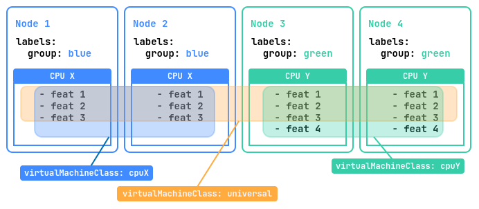
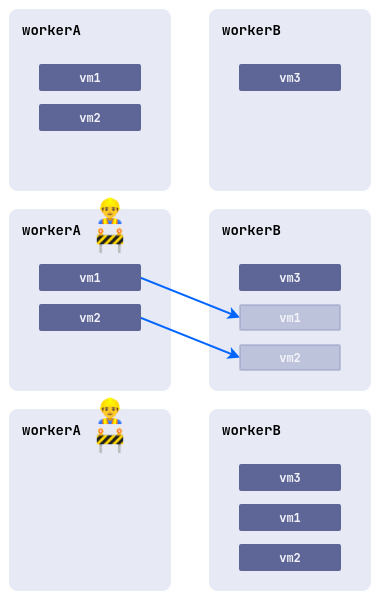
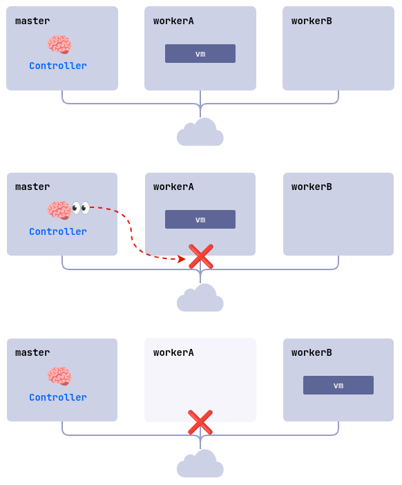

## Введение

Данное руководство предназначено для администраторов Deckhouse Virtualization Platform и описывает порядок создания и изменения кластерных ресурсов.

Также администратор обладает правами на управление проектными ресурсами, описание которых содержится [в Руководстве пользователя](./user_guide.html).

## Параметры модуля

Конфигурация модуля virtualization задается через ресурс ModuleConfig в формате YAML. Ниже приведен пример базовой настройки:


```yaml
apiVersion: deckhouse.io/v1alpha1
kind: ModuleConfig
metadata:
  name: virtualization
spec:
  enabled: true
  version: 1
  settings:
    dvcr:
      storage:
        persistentVolumeClaim:
          size: 50G
          storageClassName: sds-replicated-thin-r1
        type: PersistentVolumeClaim
    virtualMachineCIDRs:
      - 10.66.10.0/24

```

Описание параметров

1. **Включение/отключение модуля.**

    Управление состоянием модуля осуществляется через поле `.spec.enabled`. Укажите:
    - `true` — активировать модуль
    - `false` — деактивировать модуль.

2. **Версия конфигурации**

    Параметр `.spec.version` определяет версию схемы настроек. Структура параметров может - меняться между версиями. Актуальные значения приведены в разделе настроек .

3. **Хранилище образов виртуальных машин (DVCR)**

   Блок `.spec.settings.dvcr.storage` настраивает постоянный том для хранения образов:
  - Размер тома — `.spec.settings.dvcr.storage.persistentVolumeClaim.size` (например, `50G`). Для расширения хранилища увеличьте значение параметра.
  - Класс хранения — `.spec.settings.dvcr.storage.persistentVolumeClaim.storageClassName` - (например, `sds-replicated-thin-r1`).

4. **Сетевые настройки**

    В блоке `.spec.settings.virtualMachineCIDRs` указываются подсети в формате CIDR (например, 10.66.10.0/24). IP-адреса для виртуальных машин распределяются из этих - диапазонов автоматически или по запросу.

    Пример:

    ```yaml
    spec:
      settings:
        virtualMachineCIDRs:
          - 10.66.10.0/24
          - 10.66.20.0/24
          - 10.77.20.0/16
    ```

    Первый и последний адрес подсети - зарезервирован и не доступен для использования.

    
    Подсети блока `.spec.settings.virtualMachineCIDRs` не должны пересекаться с: подсетями узлов кластера, подсетью сервисов, подсетью подов (podCIDR).
    

    
    Удалять подсети, в случае если адреса из них уже выданы виртуальным машинам - запрещено!
    

5. **Настройки классов хранения для образов**

    Настройки классов хранения для образов определяется в параметре `.spec.settings.virtualImages` настроек модуля.

    Пример:

    ```yaml
    spec:
      ...
      settings:
        virtualImages:
          allowedStorageClassNames:
          - sc-1
          - sc-2
          defaultStorageClassName: sc-1
    ```

    - `allowedStorageClassNames` (опционально) — это список допустимых StorageClass для создания `VirtualImage`, которые можно явно указать в спецификации ресурса.
    - `defaultStorageClassName` (опционально) — это StorageClass, используемый по умолчанию при создании `VirtualImage`, если параметр `.spec.persistentVolumeClaim.storageClassName` не задан.

6. **Настройки классов хранения для дисков**

    Настройки классов хранения для дисков определяются в параметре `.spec.settings.virtualDisks` настроек модуля.

    Пример:

    ```yaml
    spec:
      ...
      settings:
        virtualDisks:
          allowedStorageClassNames:
          - sc-1
          - sc-2
          defaultStorageClassName: sc-1
    ```

    - `allowedStorageClassNames` (опционально) — это список допустимых StorageClass для создания `VirtualDisk`, которые можно явно указать в спецификации ресурса.
    - `defaultStorageClassName` (опционально) — это StorageClass, используемый по умолчанию при создании `VirtualDisk`, если параметр `.spec.persistentVolumeClaim.storageClassName` не задан.

7. **Параметры миграции**

    Параметры миграции виртуальных машин можно задать в блоке `.spec.settings.liveMigration`:

    Пример параметров:

    ```yaml
    spec:
      enabled: true
      settings:
        liveMigration:
          # Пропускная способность канала связи, которая будет использоваться для миграции на узел
          # 64 Mi -> (64 * 2^20 * 8) / 10^6 = 536 Mbps
          bandwidthPerNode: 64Mi
          # Максимальное количество миграций на узел (входящих и исходящих)
          maxMigrationsPerNode: 2
    ```



Полный перечень параметров конфигурации приведен в разделе [Настройки](./configuration.html) и


## Образы

Ресурс ClusterVirtualImage служит для загрузки образов виртуальных машин во внутрикластерное хранилище, после чего с его помощью можно создавать диски виртуальных машин. Он доступен во всех пространствах имен и проектах кластера.

Процесс создания образа включает следующие шаги:

- Пользователь создаёт ресурс ClusterVirtualImage.
- После создания образ автоматически загружается из указанного в спецификации источника в хранилище (DVCR).
- После завершения загрузки ресурс становится доступным для создания дисков.

Существуют различные типы образов:

- **ISO-образ** — установочный образ, используемый для начальной установки операционной системы. Такие образы выпускаются производителями ОС и используются для установки на физические и виртуальные серверы.
- **Образ диска с предустановленной системой** — содержит уже установленную и настроенную операционную систему, готовую к использованию после создания виртуальной машины. Готовые образы можно получить на ресурсах разработчиков дистрибутива, либо создать самостоятельно.

Примеры ресурсов для получения образов виртуальной машины:

- Ubuntu
  - [24.04 LTS (Noble Numbat)](https://cloud-images.ubuntu.com/noble/current/)
  - [22.04 LTS (Jammy Jellyfish)](https://cloud-images.ubuntu.com/jammy/current/)
  - [20.04 LTS (Focal Fossa)](https://cloud-images.ubuntu.com/focal/current/)
  - [Minimal images](https://cloud-images.ubuntu.com/minimal/releases/)
- Debian
  - [12 bookworm](https://cdimage.debian.org/images/cloud/bookworm/latest/)
  - [11 bullseye](https://cdimage.debian.org/images/cloud/bullseye/latest/)
- AlmaLinux
  - [9](https://repo.almalinux.org/almalinux/9/cloud/x86_64/images/)
  - [8](https://repo.almalinux.org/almalinux/8/cloud/x86_64/images/)
- RockyLinux
  - [9.5](https://download.rockylinux.org/pub/rocky/9.5/images/x86_64/)
  - [8.10](https://download.rockylinux.org/pub/rocky/8.10/images/x86_64/)
- CentOS
  - [10 Stream](https://cloud.centos.org/centos/10-stream/x86_64/images/)
  - [9 Stream](https://cloud.centos.org/centos/9-stream/x86_64/images/)
  - [8 Stream](https://cloud.centos.org/centos/8-stream/x86_64/)
  - [8](https://cloud.centos.org/centos/8/x86_64/images/)
- Alt Linux
  - [p10](https://ftp.altlinux.ru/pub/distributions/ALTLinux/p10/images/cloud/x86_64/)
  - [p9](https://ftp.altlinux.ru/pub/distributions/ALTLinux/p9/images/cloud/x86_64/)
- [Astra Linux](https://download.astralinux.ru/ui/native/mg-generic/alse/cloudinit)

Поддерживаются следующие форматы образов с предустановленной системой:

- qcow2
- raw
- vmdk
- vdi

Образы могут быть сжаты одним из следующих алгоритмов сжатия: gz, xz.

После создания ресурса ClusterVirtualImage тип и размер образа определяются автоматически, и эта информация отражается в статусе ресурса.

Образы могут быть загружены из различных источников, таких как HTTP-серверы, где расположены файлы образов, или контейнерные реестры. Также доступна возможность загрузки образов напрямую из командной строки с использованием утилиты `curl`.

Образы могут быть созданы из других образов и дисков виртуальных машин.

С полным описанием параметров конфигурации ресурса ClusterVirtualImage можно ознакомиться [в разделе Custom Resources](cr.html#clustervirtualimage).

### Создание образа с HTTP-сервера

Рассмотрим вариант создания кластерного образа.

Выполните следующую команду для создания ресурса ClusterVirtualImage:

```yaml
d8 k apply -f - <<EOF
apiVersion: virtualization.deckhouse.io/v1alpha2
kind: ClusterVirtualImage
metadata:
  name: ubuntu-22-04
spec:
  # Источник для создания образа.
  dataSource:
    type: HTTP
    http:
      url: "https://cloud-images.ubuntu.com/minimal/releases/jammy/release/ubuntu-22.04-minimal-cloudimg-amd64.img"
EOF
```

Проверьте результат создания ресурса ClusterVirtualImage, выполнив следующую команду:

```bash
d8 k get clustervirtualimage ubuntu-22-04
# Или более короткий вариант
d8 k get cvi ubuntu-22-04
```

В результате будет выведена информация о ресурсе:

```console
NAME           PHASE   CDROM   PROGRESS   AGE
ubuntu-22-04   Ready   false   100%       23h
```

После создания ресурс ClusterVirtualImage может находиться в одном из следующих состояний (фаз):

- `Pending` — ожидание готовности всех зависимых ресурсов, требующихся для создания образа.
- `WaitForUserUpload` — ожидание загрузки образа пользователем (фаза присутствует только для `type=Upload`).
- `Provisioning` — идет процесс создания образа.
- `Ready` — образ создан и готов для использования.
- `Failed` — произошла ошибка в процессе создания образа.
- `Terminating` — идет процесс удаления образа. Образ может «зависнуть» в данном состоянии, если он ещё подключен к виртуальной машине.

До тех пор, пока образ не перешёл в фазу `Ready`, содержимое всего блока `.spec` допускается изменять. При изменении процесс создании диска запустится заново. После перехода в фазу `Ready` содержимое блока `.spec` **менять нельзя**.

Диагностика проблем с ресурсом осуществляется путем анализа информации в блоке `.status.conditions`.

Отследить процесс создания образа можно путем добавления ключа `-w` к предыдущей команде:

```bash
d8 k get cvi ubuntu-22-04 -w
```

Пример вывода:

```console
NAME           PHASE          CDROM   PROGRESS   AGE
ubuntu-22-04   Provisioning   false              4s
ubuntu-22-04   Provisioning   false   0.0%       4s
ubuntu-22-04   Provisioning   false   28.2%      6s
ubuntu-22-04   Provisioning   false   66.5%      8s
ubuntu-22-04   Provisioning   false   100.0%     10s
ubuntu-22-04   Provisioning   false   100.0%     16s
ubuntu-22-04   Ready          false   100%       18s
```

В описании ресурса ClusterVirtualImage можно получить дополнительную информацию о скачанном образе.
Для этого выполните следующую команду:

```bash
d8 k describe cvi ubuntu-22-04
```

### Создание образа из реестра контейнеров

Образ, хранящийся в реестре контейнеров, имеет определенный формат. Рассмотрим на примере:

1. Для начала загрузите образ локально:

   ```bash
   curl -L https://cloud-images.ubuntu.com/minimal/releases/jammy/release/ubuntu-22.04-minimal-cloudimg-amd64.img -o ubuntu2204.img
   ```

1. Далее создайте `Dockerfile` со следующим содержимым:

   ```Dockerfile
   FROM scratch
   COPY ubuntu2204.img /disk/ubuntu2204.img
   ```

1. Соберите образ и загрузите его в реестр контейнеров. В качестве реестра контейнеров в примере ниже использован `docker.io`. Для выполнения вам необходимо иметь учетную запись сервиса и настроенное окружение.

   ```bash
   docker build -t docker.io/<username>/ubuntu2204:latest
   ```

   где `<username>` — имя пользователя, указанное при регистрации в `docker.io`.

1. Загрузите созданный образ в реестр контейнеров:

   ```bash
   docker push docker.io/<username>/ubuntu2204:latest
   ```

1. Чтобы использовать этот образ, создайте в качестве примера ресурс:

   ```yaml
   d8 k apply -f - <<EOF
   apiVersion: virtualization.deckhouse.io/v1alpha2
   kind: ClusterVirtualImage
   metadata:
     name: ubuntu-2204
   spec:
     dataSource:
       type: ContainerImage
       containerImage:
         image: docker.io/<username>/ubuntu2204:latest
   EOF
   ```

### Загрузка образа из командной строки

1. Чтобы загрузить образ из командной строки, предварительно создайте следующий ресурс, как представлено ниже на примере ClusterVirtualImage:

   ```yaml
   d8 k apply -f - <<EOF
   apiVersion: virtualization.deckhouse.io/v1alpha2
   kind: ClusterVirtualImage
   metadata:
     name: some-image
   spec:
     # Настройки источника образа.
     dataSource:
       type: Upload
   EOF
   ```

   После создания ресурс перейдет в фазу `WaitForUserUpload`, а это значит, что он готов для загрузки образа.

1. Доступно два варианта загрузки — с узла кластера и с произвольного узла за пределами кластера:

   ```bash
   d8 k get cvi some-image -o jsonpath="{.status.imageUploadURLs}"  | jq
   ```

   Пример вывода:

   ```console
   {
     "external":"https://virtualization.example.com/upload/g2OuLgRhdAWqlJsCMyNvcdt4o5ERIwmm",
     "inCluster":"http://10.222.165.239/upload"
   }
   ```

   - inCluster - данный URL используется, если необходимо выполнить загрузку образа непосредственно с одного из узлов кластера
   - external - используется во всех остальных случаях

1. В качестве примера загрузите образ Cirros:

   ```bash
   curl -L http://download.cirros-cloud.net/0.5.1/cirros-0.5.1-x86_64-disk.img -o cirros.img
   ```

1. Выполните загрузку образа с использование следующей команды:

   ```bash
   curl https://virtualization.example.com/upload/g2OuLgRhdAWqlJsCMyNvcdt4o5ERIwmm --progress-bar -T cirros.img | cat
   ```

1. После завершения загрузки образ должен быть создан и перейти в фазу `Ready`.
   Чтобы проверить это, выполните следующую команду:

   ```bash
   d8 k get cvi some-image
   ```

   Пример вывода:

   ```console
   NAME         PHASE   CDROM   PROGRESS   AGE
   some-image   Ready   false   100%       1m
   ```

## Классы виртуальных машин

Ресурс VirtualMachineClass предназначен для централизованной конфигурации предпочтительных параметров виртуальных машин. Он позволяет определять инструкции CPU, политики конфигурации ресурсов CPU и памяти для виртуальных машин, а также определять соотношения этих ресурсов. Помимо этого, VirtualMachineClass обеспечивает управление размещением виртуальных машин по узлам платформы. Это позволяет администраторам эффективно управлять ресурсами платформы виртуализации и оптимально размещать виртуальные машины на узлах платформы.

Структура ресурса VirtualMachineClass выглядит следующим образом:

```yaml
apiVersion: virtualization.deckhouse.io/v1alpha2
kind: VirtualMachineClass
metadata:
  name: <vmclass-name>
spec:
  # Блок описывает параметры виртуального процессора для виртуальных машин.
  # Изменять данный блок нельзя после создания ресурса.
  cpu: ...

  # (опциональный блок) Описывает правила размещения виртуальных машины по узлам.
  # При изменении автоматически применяется ко всем виртуальных машинам, использующим данный VirtualMachineClass.
  nodeSelector: ...

  # (опциональный блок) Описывает политику настройки ресурсов виртуальных машин.
  # При изменении автоматически применяется ко всем виртуальных машинам, использующим данный VirtualMachineClass.
  sizingPolicies: ...
```


Поскольку изменение параметра `.spec.nodeSelector` влияет на все виртуальные машины, использующие данный ресурс VirtualMachineClass, следует учитывать следующее:

- Для Enterprise-редакции: это может привести к миграции виртуальных машин на новые узлы назначения, если текущие узлы не соответствуют требованиям размещения.
- Для Community-редакции: это может вызвать перезапуск виртуальных машин в соответствии с автоматической политикой применения изменений, установленной в параметре `.spec.disruptions.restartApprovalMode`.


Платформа виртуализации предоставляет три предустановленных ресурса VirtualMachineClass.
Чтобы получить информацию об этих ресурсах, выполните следующую команду:

```bash
d8 k get virtualmachineclass
```

Пример вывода:

```console
NAME               PHASE   AGE
host               Ready   6d1h
host-passthrough   Ready   6d1h
generic            Ready   6d1h
```

- `host` — данный класс использует виртуальный CPU, максимально близкий к CPU узла платформы по набору инструкций. Это обеспечивает высокую производительность и функциональность, а также совместимость с «живой» миграцией для узлов с похожими типами процессоров. Например, миграция ВМ между узлами с процессорами Intel и AMD не будет работать. Это также справедливо для процессоров разных поколений, так как набор инструкций у них отличается.
- `host-passthrough` - используется физический CPU узла платформы напрямую без каких-либо изменений. При использовании данного класса, гостевая ВМ может быть мигрирована только на целевой узел, у которого CPU точно соответствует CPU исходного узла.
- `generic` — универсальная модель CPU, использующая достаточно старую, но поддерживаемую большинством современных процессоров модель Nehalem. Это позволяет запускать ВМ на любых узлах кластера с возможностью «живой» миграции.

Обязательно указывайте ресурс VirtualMachineClass в конфигурации виртуальной машины.
Пример указания класса в спецификации ВМ:

```yaml
apiVersion: virtualization.deckhouse.io/v1alpha2
kind: VirtualMachine
metadata:
  name: linux-vm
spec:
  virtualMachineClassName: generic # Название ресурса VirtualMachineClass.
  ...
```


Рекомендуется создать как минимум один ресурс VirtualMachineClass в кластере с типом `Discovery` сразу после того как все узлы будут настроены и добавлены в кластер. Это позволит использовать в виртуальных машинах универсальный процессор с максимально возможными характеристиками с учетом CPU на узлах кластера, что позволит виртуальным машинам использовать максимум возможностей CPU и при необходимости беспрепятственно осуществлять миграцию между узлами кластера.


Администраторы платформы могут создавать требуемые классы виртуальных машин по своим потребностям, но рекомендуется создавать необходимый минимум. Рассмотрим на примере в следующем разделе.

### Пример конфигурации VirtualMachineClass



Представим, что у нас есть кластер из четырех узлов. Два из этих узлов с лейблом `group=blue` оснащены процессором «CPU X» с тремя наборами инструкций, а остальные два узла с лейблом `group=green` имеют более новый процессор «CPU Y» с четырьмя наборами инструкций.

Для оптимального использования ресурсов данного кластера рекомендуется создать три дополнительных класса виртуальных машин (VirtualMachineClass):

- `universal` — этот класс позволит виртуальным машинам запускаться на всех узлах платформы и мигрировать между ними. При этом будет использоваться набор инструкций для самой младшей модели CPU, что обеспечит наибольшую совместимость.
- `cpuX` — этот класс будет предназначен для виртуальных машин, которые должны запускаться только на узлах с процессором «CPU X». ВМ смогут мигрировать между этими узлами, используя доступные наборы инструкций «CPU X».
- `cpuY` — этот класс предназначен для виртуальных машин, которые должны запускаться только на узлах с процессором «CPU Y». ВМ смогут мигрировать между этими узлами, используя доступные наборы инструкций «CPU Y».


Набор инструкций для процессора — это список всех команд, которые процессор может выполнять, таких как сложение, вычитание или работа с памятью. Они определяют, какие операции возможны, влияют на совместимость программ и производительность, а также могут меняться от одного поколения процессоров к другому.


Примерные конфигурации ресурсов для данного кластера:

```yaml
---
apiVersion: virtualization.deckhouse.io/v1alpha2
kind: VirtualMachineClass
metadata:
  name: universal
spec:
  cpu:
    discovery: {}
    type: Discovery
  sizingPolicies: { ... }
---
apiVersion: virtualization.deckhouse.io/v1alpha2
kind: VirtualMachineClass
metadata:
  name: cpuX
spec:
  cpu:
    discovery: {}
    type: Discovery
  nodeSelector:
    matchExpressions:
      - key: group
        operator: In
        values: ["blue"]
  sizingPolicies: { ... }
---
apiVersion: virtualization.deckhouse.io/v1alpha2
kind: VirtualMachineClass
metadata:
  name: cpuY
spec:
  cpu:
    discovery:
      nodeSelector:
        matchExpressions:
          - key: group
            operator: In
            values: ["green"]
    type: Discovery
  sizingPolicies: { ... }
```

### Прочие варианты конфигурации

Пример конфигурации ресурса VirtualMachineClass:

```yaml
apiVersion: virtualization.deckhouse.io/v1alpha2
kind: VirtualMachineClass
metadata:
  name: discovery
spec:
  cpu:
    # Сконфигурировать универсальный vCPU для заданного набора узлов.
    discovery:
      nodeSelector:
        matchExpressions:
          - key: node-role.kubernetes.io/control-plane
            operator: DoesNotExist
    type: Discovery
  # Разрешать запуск ВМ с данным классом только на узлах группы `worker`.
  nodeSelector:
    matchExpressions:
      - key: node.deckhouse.io/group
        operator: In
        values:
          - worker
  # Политика конфигурации ресурсов.
  sizingPolicies:
    # Для диапазона от 1 до 4 ядер возможно использовать от 1 до 8 ГБ оперативной памяти с шагом 512Mi,
    # т.е 1 ГБ, 1,5 ГБ, 2 ГБ, 2,5 ГБ и т. д.
    # Запрещено использовать выделенные ядра.
    # Доступны все варианты параметра `corefraction`.
    - cores:
        min: 1
        max: 4
      memory:
        min: 1Gi
        max: 8Gi
        step: 512Mi
      dedicatedCores: [false]
      coreFractions: [5, 10, 20, 50, 100]
    # Для диапазона от 5 до 8 ядер возможно использовать от 5 до 16 ГБ оперативной памяти с шагом 1 ГБ,
    # т.е. 5 ГБ, 6 ГБ, 7 ГБ и т. д.
    # Запрещено использовать выделенные ядра.
    # Доступны некоторые варианты параметра `corefraction`.
    - cores:
        min: 5
        max: 8
      memory:
        min: 5Gi
        max: 16Gi
        step: 1Gi
      dedicatedCores: [false]
      coreFractions: [20, 50, 100]
    # Для диапазона от 9 до 16 ядер возможно использовать от 9 до 32 ГБ оперативной памяти с шагом 1 ГБ.
    # При необходимости можно использовать выделенные ядра.
    # Доступны некоторые варианты параметра `corefraction`.
    - cores:
        min: 9
        max: 16
      memory:
        min: 9Gi
        max: 32Gi
        step: 1Gi
      dedicatedCores: [true, false]
      coreFractions: [50, 100]
    # Для диапазона от 17 до 1024 ядер возможно использовать от 1 до 2 ГБ оперативной памяти из расчета на одно ядро.
    # Доступны для использования только выделенные ядра.
    # Единственный доступный параметр `corefraction` = 100%.
    - cores:
        min: 17
        max: 1024
      memory:
        perCore:
          min: 1Gi
          max: 2Gi
      dedicatedCores: [true]
      coreFractions: [100]
```

Далее приведены фрагменты конфигураций VirtualMachineClass для решения различных задач:

- Класс с vCPU с требуемым набором процессорных инструкций. Для этого используем `type: Features`, чтобы задать необходимый набор поддерживаемых инструкций для процессора:

  ```yaml
  spec:
    cpu:
      features:
        - vmx
      type: Features
  ```

- Класс c универсальным vCPU для заданного набора узлов. Для этого используем `type: Discovery`:

  ```yaml
  spec:
    cpu:
      discovery:
        nodeSelector:
          matchExpressions:
            - key: node-role.kubernetes.io/control-plane
              operator: DoesNotExist
      type: Discovery
  ```

- Чтобы создать vCPU конкретного процессора с предварительно определённым набором инструкций, используем тип `type: Model`. Предварительно, чтобы получить перечень названий поддерживаемых CPU для узла кластера, выполните команду:

  ```bash
  d8 k get nodes <node-name> -o json | jq '.metadata.labels | to_entries[] | select(.key | test("cpu-model")) | .key | split("/")[1]' -r

  Пример вывода:

  ```console
  IvyBridge
  Nehalem
  Opteron_G1
  Penryn
  SandyBridge
  Westmere
  ```

  Далее укажите в спецификации ресурса VirtualMachineClass следующее:

  ```yaml
  spec:
    cpu:
      model: IvyBridge
      type: Model
  ```

## Механизмы обеспечения надежности

### Миграция и режим обслуживания

Миграция виртуальных машин является важной функцией в управлении виртуализированной инфраструктурой. Она позволяет перемещать работающие виртуальные машины с одного физического узла на другой без их отключения. Миграция виртуальных машин необходима для ряда задач и сценариев:

- Балансировка нагрузки. Перемещение виртуальных машин между узлами позволяет равномерно распределять нагрузку на серверы, обеспечивая использование ресурсов наилучшим образом.
- Перевод узла в режим обслуживания. Виртуальные машины могут быть перемещены с узлов, которые нужно вывести из эксплуатации для выполнения планового обслуживания или обновления программного обеспечения.
- Обновление «прошивки» виртуальных машин. Миграция позволяет обновить «прошивку» виртуальных машины, не прерывая их работу.

#### Запуск миграции произвольной машины

Далее будет рассмотрен пример миграции выбранной виртуальной машины.

1. Перед запуском миграции проверьте текущий статус виртуальной машины:

   ```bash
   d8 k get vm
   ```

   Пример вывода:

   ```console
   NAME                                   PHASE     NODE           IPADDRESS     AGE
   linux-vm                              Running   virtlab-pt-1   10.66.10.14   79m
   ```

   Мы видим, что на данный момент ВМ запущена на узле `virtlab-pt-1`.

1. Для осуществления миграции виртуальной машины с одного узла на другой, с учетом требований к размещению виртуальной машины используется ресурс VirtualMachineOperations (`vmop`) с типом `Evict`. Создайте данный ресурс, следуя примеру:

   ```yaml
   d8 k create -f - <<EOF
   apiVersion: virtualization.deckhouse.io/v1alpha2
   kind: VirtualMachineOperation
   metadata:
     generateName: evict-linux-vm-
   spec:
     # Имя виртуальной машины.
     virtualMachineName: linux-vm
     # Операция для миграции.
     type: Evict
   EOF
   ```

1. Сразу после создания ресурса `vmop` выполните следующую команду:

   ```bash
   d8 k get vm -w
   ```

   Пример вывода:

   ```console
   NAME                                   PHASE       NODE           IPADDRESS     AGE
   linux-vm                              Running     virtlab-pt-1   10.66.10.14   79m
   linux-vm                              Migrating   virtlab-pt-1   10.66.10.14   79m
   linux-vm                              Migrating   virtlab-pt-1   10.66.10.14   79m
   linux-vm                              Running     virtlab-pt-2   10.66.10.14   79m
   ```

#### Режим обслуживания

При выполнении работ на узлах с запущенными виртуальными машинами существует риск нарушения их работоспособности. Чтобы этого избежать, узел можно перевести в режим обслуживания и мигрировать виртуальные машины на другие свободные узлы.

Для этого необходимо выполнить следующую команду:

```bash
d8 k drain <nodename> --ignore-daemonsets --delete-emptydir-dat
```

где `<nodename>` - узел, на котором предполагается выполнить работы и который должен быть освобожден от всех ресурсов (в том числе и от системных).

Если есть необходимость вытеснить с узла только виртуальные машины, выполните следующую команду:

```bash
d8 k drain <nodename> --pod-selector vm.kubevirt.internal.virtualization.deckhouse.io/name --delete-emptydir-data
```

После выполнения команды `d8 k drain` узел перейдёт в режим обслуживания, и виртуальные машины на нём запускаться не смогут. Чтобы вывести его из режима обслуживания, выполните следующую команду:

```bash
d8 k uncordon <nodename>
```



### ColdStandby

ColdStandby обеспечивает механизм восстановления работы виртуальной машины после сбоя на узле, на котором она была запущена.

Для работы данного механизма необходимо выполнить следующие требования:

- Для политики запуска виртуальной машины (`.spec.runPolicy`) должно быть установлено одно из следующих значений: `AlwaysOnUnlessStoppedManually`, `AlwaysOn`.
- На узлах, где запущены виртуальные машины, должен быть включён механизм [fencing](https://deckhouse.ru/products/kubernetes-platform/documentation/v1/modules/040-node-manager/cr.html#nodegroup-v1-spec-fencing-mode).

Рассмотрим как это работает на примере:

- Кластер состоит из трех узлов: master, workerA и workerB. На worker-узлах включён механизм Fencing.
- Виртуальная машина `linux-vm` запущена на узле workerA.
- На узле workerA возникает проблема (выключилось питание, пропала сеть, и т. д.)
- Контроллер проверяет доступность узлов и обнаруживает, что workerA недоступен.
- Контроллер удаляет узел workerA из кластера.
- Виртуальная машина `linux-vm` запускается на другом подходящем узле (workerB).



### Свойства диска на основе класса хранения

При создании диска контроллер автоматически выберет наиболее оптимальные параметры, поддерживаемые хранилищем, на основании известных ему данных.

Приоритеты настройки параметров `PersistentVolumeClaim` при создании диска посредством автоматического определения характеристик хранилища:

- `RWX + Block`;
- `RWX + FileSystem`;
- `RWO + Block`;
- `RWO + FileSystem`.

Если хранилище неизвестно и определить его параметры автоматически невозможно, используется режим `RWO + FileSystem`.
