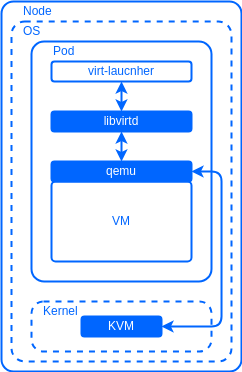

## Description

This module is designed to run and manage virtual machines and their resources on the Deckhouse platform.

It offers the following features:

- A simple and intuitive interface for declarative creation and management of virtual machines and their resources.
- The ability to run legacy applications that for some reason cannot or are difficult to run in a container.
- Ability to run virtual machines and containerized applications in the same environment.
- Integration with the existing Deckhouse ecosystem to leverage its capabilities for virtual machines.

## Requirements

The following conditions are required to run the module:

- A processor with x86_64 architecture and support for Intel-VT or AMD-V instructions.
- The Linux kernel on the cluster nodes must be version 5.7 or newer.
- The [CNI Cilium](/documentation/v1/modules/021-cni-cilium/) module to provide network connectivity for virtual machines.
- Modules SDS-DRBD or [CEPH-CSI](/documentation/v1/modules/031-ceph-csi/) for storing virtual machine data. It is also possible to use other storage options that support the creation of block devices with `RWX` (`ReadWriteMany`) access mode.

## Architecture

The module includes the following components:

- The module core, based on the KubeVirt project and uses QEMU/KVM + libvirtd to run virtual machines.
- Deckhouse Virtualization Container Registry (DVCR) - repository for storing and caching virtual machine images.
- Virtualization-controller - API for creating and managing virtual machine resources.

The API provides capabilities for creating and managing the following resources:

- Images
- Virtual machine disks
- Virtual machines

### Virtual Machine Images

Images are immutable resources that allow you to create new virtual machines based on preconfigured and configured images. Depending on the type, images can be in `raw`, `qcow2`, `vmdk` and other formats for virtual machine disk images, and in `iso` format for installation images that can be attached as `cdrom devices`.

You can use external sources such as `http server`, `container registry`, and locally via the command line (`cli`) to download images. It is also possible to create images from virtual machine disks, for example when you need to create a base image for replication (`golden-image`).

It is important to note that images can be attached to a virtual machine in read-only mode.

Images are of two types: clustered `ClusterVirtualMachineImage`, which are available to all users of the platform, and namespaced `VirtualMachineImage`, which are available only to users within a specific `namespace`.

For `ClusterVirtualMachineImage`, images are stored only in `DVCR`, while for `VirtualMachineImage` you can use both `DVCR` and platform-provided storage (`PVC`).

### Virtual Machine Disks

Creating disks for virtual machines is provided by the `VirtualMachineDisk` resource. Disks are used in the virtual machine as the primary storage medium. Disks can be created from external sources, previously created images (`VirtualMachineImage` or `ClusterVirtualMachineImage`) or can be created `empty`.

One of the key features of disks is the ability to resize them without having to stop the virtual machine. It is important to note that only the ability to increase disk size is supported, while decreasing is not available.

Furthermore, disks can be attached to virtual machines while they are running, providing flexibility in storage management. The `VirtualMachineBlockDeviceAttachment` resource is used for this task.

Platform-provided storage (`PVC`) is used to store disks.

### Virtual Machines

The `VirtualMachine` resource is responsible for creating and managing the lifecycle of virtual machines. Through the `VirtualMachine` configuration you can define virtual machine parameters such as number of processors, amount of RAM, attached images and disks, as well as placement rules on platform nodes, similar to the way it is done for Pods.

A virtual machine's startup policy defines its state. It can be enabled, disabled, or the state can be managed manually. When a node on which a virtual machine is running is rebooted, it will be temporarily evicted from that node using a "live migration" mechanism to another free node that satisfies the placement rules.

The virtual machine runs inside the Pod, which allows you to manage virtual machines as normal Kubernetes resources and use all the features of the platform, including load balancers, network policies, automation tools, etc.

