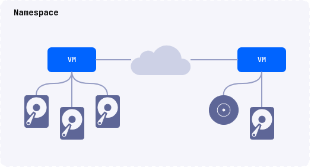

## Description

Deckhouse Virtualization Platform (DVP) allows you to declaratively create, run, and manage virtual machines and their resources.
DVP is powered by [Deckhouse Kubernetes Platform](https://deckhouse.io/products/kubernetes-platform/). The [d8](https://deckhouse.io/documentation/v1/deckhouse-cli/) command line utility is used to manage DKP/DVP resources.

Scenarios of using the module:

- Running virtual machines with x86_64 compatible OS.
- Running virtual machines and containerized applications in the same environment.


If you plan to use Deckhouse Virtualization Platform in a production environment, it is recommended to deploy it on physical servers. Deploying Deckhouse Virtualization Platform on virtual machines is also possible, but in this case you must enable nested virtualization.


## Architecture

The platform includes the following components:

- The platform core (CORE) is based on the KubeVirt project and uses QEMU/KVM + libvirtd to run virtual machines.
- Deckhouse Virtualization Container Registry (DVCR) - repository for storing and caching virtual machine images.
- Virtualization API (API) - A controller that implements a user API for creating and managing virtual machine resources.

List of controllers and operators deployed in the `d8-virtualization` namespace after the module is enabled:

| Name                          | Component | Comment                                                                                                                              |
| ----------------------------- | --------- | ------------------------------------------------------------------------------------------------------------------------------------ |
| `cdi-operator-*`              | CORE      | Virtualization core component for disk and image management.                                                                         |
| `cdi-apiserver-*`             | CORE      | Virtualization core component for disk and image management.                                                                         |
| `cdi-deployment-*`            | CORE      | Virtualization core component for disk and image management.                                                                         |
| `dvcr-*`                      | DVCR      | A registry to store images.                                                                                                          |
| `virt-api-*`                  | CORE      | Virtualization core component for disk and image management.                                                                         |
| `virt-controller-*`           | CORE      | Virtualization core component for disk and image management.                                                                         |
| `virt-exportproxy-*`          | CORE      | Virtualization core component for disk and image management.                                                                         |
| `virt-handler-*`              | CORE      | Virtualization core component for disk and image management. Должен присутствовать на всех узлах кластера, где будут запускаться ВМ. |
| `virt-operator-*`             | CORE      | Virtualization core component for disk and image management.                                                                         |
| `virtualization-api-*`        | API       | API for creating and managing module resources (images, disks, VMs, ...)                                                             |
| `virtualization-controller-*` | API       | API for creating and managing module resources (images, disks, VMs, ...)                                                             |
| `vm-route-forge-*`            | CORE      | Router for configuring routes to VMs. Must be present on all cluster nodes where VMs will be started.                                |

The API provides the ability to declaratively create, modify, and delete the following underlying resources:

- virtual machine images and boot images;
- virtual machine disks;
- virtual machines;

## Role model

The following user roles are provided for resource management:

- User
- PrivilegedUser
- Editor
- Admin
- ClusterEditor
- ClusterAdmin

The table below shows the access matrix for these roles:

| Resource                             | User | PrivilegedUser | Editor | Admin | ClusterEditor | ClusterAdmin |
| ------------------------------------ | ---- | -------------- | ------ | ----- | ------------- | ------------ |
| virtualmachines                      | R    | R              | CRUD   | CRUD  | CRUD          | CRUD         |
| virtualdisks                         | R    | R              | CRUD   | CRUD  | CRUD          | CRUD         |
| virtualimages                        | R    | R              | R      | CRUD  | CRUD          | CRUD         |
| clustervirtualimages                 | R    | R              | R      | R     | CRUD          | CRUD         |
| virtualmachineblockdeviceattachments | R    | R              | CRUD   | CRUD  | CRUD          | CRUD         |
| virtualmachineoperations             | R    | CR             | CRUD   | CRUD  | CRUD          | CRUD         |
| virtualmachineipaddresses            | R    | R              | CRUD   | CRUD  | CRUD          | CRUD         |
| virtualmachineipaddressleases        | -    | -              | -      | R     | R             | CRUD         |
| virtualmachineclasses                | R    | R              | R      | R     | CRUD          | CRUD         |

Commands available for operations with the d8 command line utility:

| d8 cli                        | User | PrivilegedUser | Editor | Admin | ClusterEditor | ClusterAdmin |
| ----------------------------- | ---- | -------------- | ------ | ----- | ------------- | ------------ |
| d8 v console                  | N    | Y              | Y      | Y     | Y             | Y            |
| d8 v ssh / scp / port-forward | N    | Y              | Y      | Y     | Y             | Y            |
| d8 v vnc                      | N    | Y              | Y      | Y     | Y             | Y            |
| d8 v start                    | N    | Y              | Y      | Y     | Y             | Y            |
| d8 v stop                     | N    | Y              | Y      | Y     | Y             | Y            |
| d8 v restart                  | N    | Y              | Y      | Y     | Y             | Y            |
| d8 v migrate                  | N    | Y              | Y      | Y     | Y             | Y            |

Перечень сокращений:

| Abbreviation | Operation | Corresponding Kubernetes operation |
| ------------ | --------- | ---------------------------------- |
| C            | create    | create                             |
| R            | read      | get,list,watch                     |
| U            | update    | patch, update                      |
| D            | delete    | delete, deletecollection           |
