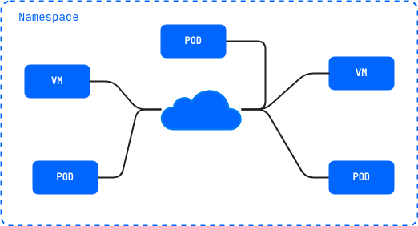
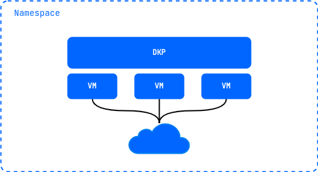
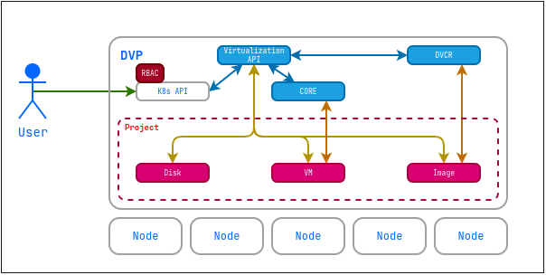
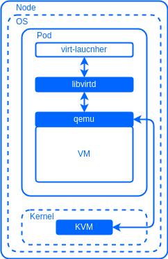

The `virtualization` module allows you to declaratively create, start, and manage virtual machines and their resources.

The [`d8`](/products/kubernetes-platform/documentation/v1/cli/d8/) command line utility is used to manage cluster resources.

## Usage scenarios

- Running virtual machines with an x86-64-compatible OS.

  

- Running virtual machines and containerized applications in the same environment.

  

- Creating DKP clusters.

  


For production use, deploy the module in a cluster running on physical servers. A cluster on virtual machines is suitable for testing only, and nested virtualization has to be enabled on them.


## Architecture

The module consists of the following parts:

- The core (CORE), based on the KubeVirt project, runs virtual machines through QEMU/KVM and libvirtd.
- Virtualization API (API) serves the user API of the module and brings images, disks, and machines to the state described in them.
- Deckhouse Virtualization Container Registry (DVCR) stores and caches virtual machine images.
- Auxiliary components record security events, pass USB devices through, and configure network routes to the machines.

Once the module is enabled, the following components appear in the `d8-virtualization` namespace:

| Name                          | Module part | Purpose                                                                                          |
| ----------------------------- | ----------- | -------------------------------------------------------------------------------------------------- |
| `virt-operator-*`             | CORE        | Deploys and updates the other core components.                                                   |
| `virt-api-*`                  | CORE        | Handles requests to the subresources of virtual machines.                                        |
| `virt-controller-*`           | CORE        | Runs the life cycle of virtual machines.                                                         |
| `virt-handler-*`              | CORE        | Prepares a node to run virtual machines and passes commands to their pods. Runs on every node.    |
| `virtualization-api-*`        | API         | Serves the module API and its subresources, including the console, VNC, and SPICE.               |
| `virtualization-controller-*` | API         | Creates and modifies images, disks, and virtual machines from their resources.                   |
| `dvcr-*`                      | DVCR        | Stores and caches virtual machine images.                                                        |
| `virtualization-audit-*`      | Auxiliary   | Records security events for the module resources. Available in the EE edition.                   |
| `virtualization-dra-*`        | Auxiliary   | Detects USB devices on nodes and passes them through to machines. Available in the EE edition.   |
| `vm-route-forge-*`            | Auxiliary   | Configures routes to virtual machines. Runs on every node where VMs are started.                 |

A virtual machine runs inside a pod, so you can manage it as a regular Kubernetes resource and use all the platform features for it, including load balancers, network policies, and automation tools.

The API lets you declaratively create, modify, and delete the following resources:

- Virtual machine images and boot images.
- Virtual machine disks.
- Virtual machines.
