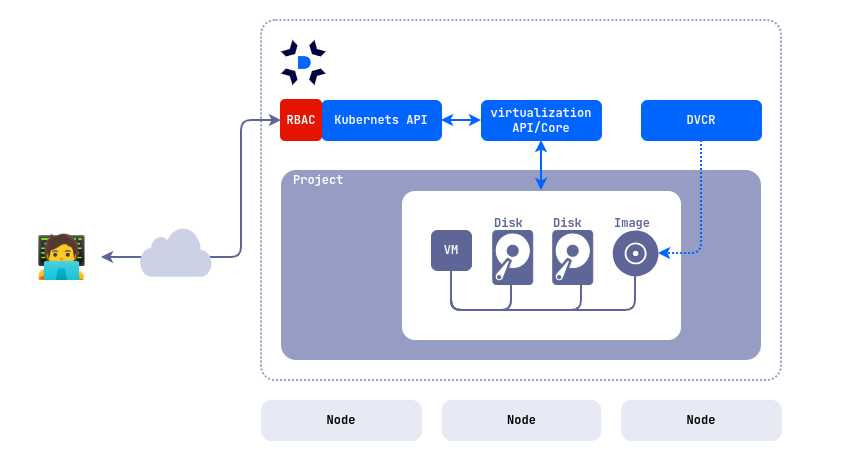

## Description

Deckhouse Virtualization Platform (DVP) allows you to declaratively create, run, and manage virtual machines and their resources.
DVP is powered by [Deckhouse Kubernetes Platform](https://deckhouse.io/products/kubernetes-platform/). The [d8](https://deckhouse.io/documentation/v1/deckhouse-cli/) command line utility is used to manage DKP/DVP resources.

Scenarios of using the module:

- Running virtual machines with x86_64 compatible OS.
- Running virtual machines and containerized applications in the same environment.


If you plan to use Deckhouse Virtualization Platform in a production environment, it is recommended to deploy it on physical servers. Deploying Deckhouse Virtualization Platform on virtual machines is also possible, but in this case you must enable nested virtualization.


## Architecture

The platform includes the following components:

- The platform core (CORE) is based on the KubeVirt project and uses QEMU/KVM + libvirtd to run virtual machines.
- Deckhouse Virtualization Container Registry (DVCR) - repository for storing and caching virtual machine images.
- Virtualization API (API) - A controller that implements a user API for creating and managing virtual machine resources.

List of controllers and operators deployed in the `d8-virtualization` namespace after the module is enabled:

| Name                          | Component | Comment                                                                                                                      |
| ----------------------------- | --------- | ---------------------------------------------------------------------------------------------------------------------------- |
| `cdi-operator-*`              | CORE      | Virtualization core component for disk and image management.                                                                 |
| `cdi-apiserver-*`             | CORE      | Virtualization core component for disk and image management.                                                                 |
| `cdi-deployment-*`            | CORE      | Virtualization core component for disk and image management.                                                                 |
| `dvcr-*`                      | DVCR      | A registry to store images.                                                                                                  |
| `virt-api-*`                  | CORE      | Virtualization core component for disk and image management.                                                                 |
| `virt-controller-*`           | CORE      | Virtualization core component for disk and image management.                                                                 |
| `virt-exportproxy-*`          | CORE      | Virtualization core component for disk and image management.                                                                 |
| `virt-handler-*`              | CORE      | Virtualization core component for disk and image management. Must be present on all cluster nodes where VMs will be started. |
| `virt-operator-*`             | CORE      | Virtualization core component for disk and image management.                                                                 |
| `virtualization-api-*`        | API       | API for creating and managing module resources (images, disks, VMs, ...)                                                     |
| `virtualization-controller-*` | API       | API for creating and managing module resources (images, disks, VMs, ...)                                                     |
| `vm-route-forge-*`            | CORE      | Router for configuring routes to VMs. Must be present on all cluster nodes where VMs will be started.                        |

The virtual machine runs inside the pod, which allows you to manage virtual machines as regular Kubernetes resources and utilize all the platform features, including load balancers, network policies, automation tools, etc.

The API provides the ability to declaratively create, modify, and delete the following underlying resources:

- virtual machine images and boot images;
- virtual machine disks;
- virtual machines;
