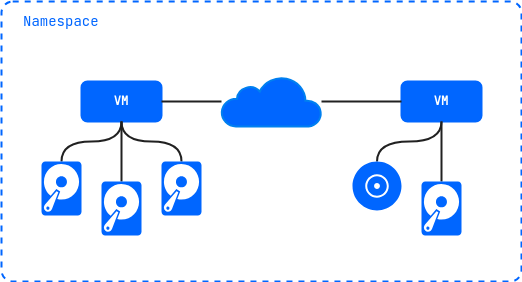
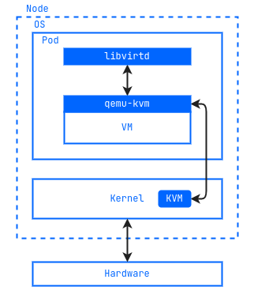

Модуль `virtualization` позволяет декларативно создавать, запускать и управлять виртуальными машинами и их ресурсами.

Для управления ресурсами кластера используется утилита командной строки [`d8`](/products/kubernetes-platform/documentation/v1/cli/d8/).

## Сценарии использования

- Запуск виртуальных машин с x86-64-совместимой ОС.

  

- Запуск виртуальных машин и контейнеризованных приложений в одном окружении.

  

- Создание кластеров DKP.

  


Для промышленной эксплуатации разворачивайте модуль в кластере на физических серверах. Кластер на виртуальных машинах подходит только для тестирования, и на них должна быть включена вложенная виртуализация (nested virtualization).


## Архитектура

Модуль состоит из следующих частей:

- ядро (CORE) — основано на проекте KubeVirt и запускает виртуальные машины через QEMU/KVM и libvirtd;
- Virtualization API (API) — обслуживает пользовательский API модуля и приводит образы, диски и машины к описанному в них состоянию;
- Deckhouse Virtualization Container Registry (DVCR) — хранит и кеширует образы виртуальных машин;
- вспомогательные компоненты — записывают события безопасности, пробрасывают USB-устройства и настраивают сетевые маршруты до машин.

После включения модуля в пространстве имён `d8-virtualization` появляются следующие компоненты:

| Название                      | Часть модуля | Назначение                                                                                        |
| ----------------------------- | ------------ | --------------------------------------------------------------------------------------------------- |
| `virt-operator-*`             | CORE         | Разворачивает и обновляет остальные компоненты ядра.                                              |
| `virt-api-*`                  | CORE         | Обрабатывает запросы к субресурсам виртуальных машин.                                             |
| `virt-controller-*`           | CORE         | Ведёт жизненный цикл виртуальных машин.                                                           |
| `virt-handler-*`              | CORE         | Готовит узел к запуску виртуальных машин и передаёт команды в их поды. Работает на всех узлах.    |
| `virtualization-api-*`        | API          | Обслуживает API модуля и его субресурсы, включая консоль, VNC и SPICE.                            |
| `virtualization-controller-*` | API          | Создаёт и изменяет образы, диски и виртуальные машины по их ресурсам.                             |
| `dvcr-*`                      | DVCR         | Хранит и кеширует образы виртуальных машин.                                                       |
| `virtualization-audit-*`      | Вспомогательный | Записывает события безопасности по ресурсам модуля. Доступен в редакции EE.                       |
| `virtualization-dra-*`        | Вспомогательный | Обнаруживает USB-устройства на узлах и пробрасывает их в машины. Доступен в редакции EE.          |
| `vm-route-forge-*`            | Вспомогательный | Настраивает маршруты до виртуальных машин. Работает на всех узлах, где запускаются ВМ.            |

Виртуальная машина запускается внутри пода, поэтому управлять ей можно как обычным ресурсом Kubernetes и использовать для неё все возможности платформы, включая балансировщики нагрузки, сетевые политики и средства автоматизации.

API позволяет декларативно создавать, изменять и удалять следующие ресурсы:

- образы виртуальных машин и загрузочные образы;
- диски виртуальных машин;
- виртуальные машины.
