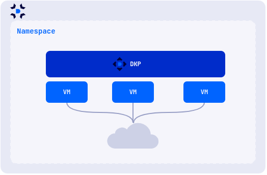

Модуль Virtualization позволяет декларативно создавать, запускать и управлять виртуальными машинами и их ресурсами.

Для управления ресурсами кластера используется утилита командной строки [d8](https://deckhouse.ru/documentation/v1/deckhouse-cli/).

## Сценарии использования

Запуск виртуальных машин с x86_64 совместимой ОС.

Запуск виртуальных машин и контейнеризованных приложений в одном окружении.

Создание кластеров DKP


Если вы планируете использовать Virtualization в production-среде, рекомендуется использовать кластер, развернутый на физических (bare-metal) серверах. Допускается в целях тестирования использовать модуль в кластере, развернутом на виртуальных машинах, при этом на виртуальных машинах должна быть включена вложенная виртуализация (nested virtualization).


## Архитектура

Платформа включает в себя следующие компоненты:

- Ядро платформы (CORE) — основано на проекте KubeVirt и использует QEMU/KVM + libvirtd для запуска виртуальных машин.
- Deckhouse Virtualization Container Registry (DVCR) — репозиторий для хранения и кэширования образов виртуальных машин.
- Virtualization API (API) — контроллер, реализующий API пользователя для создания и управления ресурсами виртуальных машин.

Перечень контроллеров и операторов, разворачивающихся в пространстве имен `d8-virtualization` после включения модуля:

| Название                      | Компонент | Комментарий                                                                                                                             |
| ----------------------------- | --------- |-----------------------------------------------------------------------------------------------------------------------------------------|
| `cdi-operator-*`              | CORE      | Компонент ядра виртуализации для управления дисками и образами.                                                                         |
| `cdi-apiserver-*`             | CORE      | Компонент ядра виртуализации для управления дисками и образами.                                                                         |
| `cdi-deployment-*`            | CORE      | Компонент ядра виртуализации для управления дисками и образами.                                                                         |
| `dvcr-*`                      | DVCR      | Реестр для хранения образов.                                                                                                            |
| `virt-api-*`                  | CORE      | Компонент ядра виртуализации для управления дисками и образами.                                                                         |
| `virt-controller-*`           | CORE      | Компонент ядра виртуализации для управления дисками и образами.                                                                         |
| `virt-exportproxy-*`          | CORE      | Компонент ядра виртуализации для управления дисками и образами.                                                                         |
| `virt-handler-*`              | CORE      | Компонент ядра виртуализации для управления дисками и образами. Должен присутствовать на всех узлах кластера, где будут запускаться ВМ. |
| `virt-operator-*`             | CORE      | Компонент ядра виртуализации для управления дисками и образами.                                                                         |
| `virtualization-api-*`        | API       | API для создания и управления ресурсами модуля (образы, диски, ВМ и т.д.)                                                               |
| `virtualization-controller-*` | API       | API для создания и управления ресурсами модуля (образы, диски, ВМ и т.д.)                                                               |
| `vm-route-forge-*`            | CORE      | Маршрутизатор для настройки маршрутов до ВМ. Должен присутствовать на всех узлах кластера, где будут запускаться ВМ.                    |

Виртуальная машина запускается внутри пода, что позволяет управлять виртуальными машинами как обычными ресурсами Kubernetes и использовать все возможности платформы, включая балансировщики нагрузки, сетевые политики, средства автоматизации и т. д.

API предоставляет возможность для декларативного создания, модификации и удаления следующих базовых ресурсов:

- образы виртуальных машин и загрузочные образы;
- диски виртуальных машин;
- виртуальные машины.
