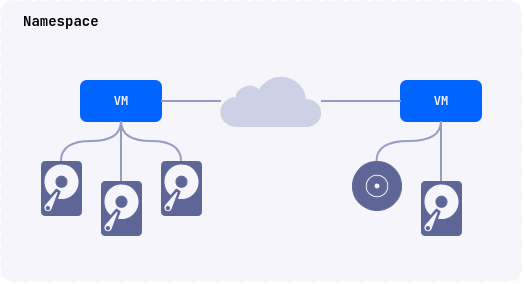
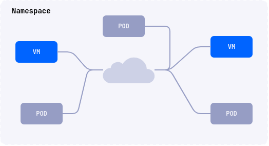

Deckhouse Virtualization Platform (DVP) позволяет декларативно создавать, запускать и управлять виртуальными машинами и их ресурсами.
DVP функционирует на базе [Deckhouse Kubernetes Platform](https://deckhouse.ru/products/kubernetes-platform/). Для управления ресурсами DKP/DVP используется утилита командной строки [d8](https://deckhouse.ru/documentation/v1/deckhouse-cli/).

## Сценарии использования

- Запуск виртуальных машин с x86_64 совместимой ОС.
- Запуска виртуальных машин и контейнеризованных приложений в одном окружении.
- Запуск кластера DKP на виртуальных машинах.

  

  

  


Если вы планируете использовать Deckhouse Virtualization Platform в production-среде, рекомендуется разворачивать его на физических серверах. Развертывание Deckhouse Virtualization Platform на виртуальных машинах также возможно, но в этом случае необходимо включить nested-виртуализацию.


## Архитектура

Платформа включает в себя следующие компоненты:

- Ядро платформы (CORE), основано на проекте KubeVirt и использующее QEMU/KVM + libvirtd для запуска виртуальных машин.
- Deckhouse Virtualization Container Registry (DVCR) — репозиторий для хранения и кэширования образов виртуальных машин.
- Virtualization API (API) — контроллер, реализующий API пользователя для создания и управления ресурсами виртуальных машин.

Перечень контроллеров и операторов, разворачивающихся в неймспейсе `d8-virtualization` после включения модуля

| Название                      | Компонент | Комментарий                                                                                                                             |
| ----------------------------- | --------- | --------------------------------------------------------------------------------------------------------------------------------------- |
| `cdi-operator-*`              | CORE      | Компонент ядра виртуализации для управления дисками и образами.                                                                         |
| `cdi-apiserver-*`             | CORE      | Компонент ядра виртуализации для управления дисками и образами.                                                                         |
| `cdi-deployment-*`            | CORE      | Компонент ядра виртуализации для управления дисками и образами.                                                                         |
| `dvcr-*`                      | DVCR      | Реестр для хранения образов.                                                                                                            |
| `virt-api-*`                  | CORE      | Компонент ядра виртуализации для управления дисками и образами.                                                                         |
| `virt-controller-*`           | CORE      | Компонент ядра виртуализации для управления дисками и образами.                                                                         |
| `virt-exportproxy-*`          | CORE      | Компонент ядра виртуализации для управления дисками и образами.                                                                         |
| `virt-handler-*`              | CORE      | Компонент ядра виртуализации для управления дисками и образами. Должен присутствовать на всех узлах кластера, где будут запускается ВМ. |
| `virt-operator-*`             | CORE      | Компонент ядра виртуализации для управления дисками и образами.                                                                         |
| `virtualization-api-*`        | API       | API для создания и управления ресурсами модуля (образы, диски, ВМ, ..)                                                                  |
| `virtualization-controller-*` | API       | API для создания и управления ресурсами модуля (образы, диски, ВМ, ..)                                                                  |
| `vm-route-forge-*`            | CORE      | Маршрутизатор, для настройки маршрутов до ВМ. Должен присутствовать на всех узлах кластера, где буду запускается ВМ.                    |

API предоставляет возможность для декларативного создания, модификации и удаления следующих базовых ресурсов:

- образы виртуальных машин и загрузочные образы;
- диски виртуальных машин;
- виртуальные машины;

## Ролевая модель

Для управления ресурсами предусмотрены следующие роли пользователей:

- Пользователь (User)
- Привилегированный пользователь (PrivilegedUser)
- Редактор (Editor)
- Администратор (Admin)
- Редактор кластера (ClusterEditor)
- Администратор кластера (ClusterAdmin)

Далее таблице представлены матрица доступа для данных ролей

| Resource                             | User | PrivilegedUser | Editor | Admin | ClusterEditor | ClusterAdmin |
| ------------------------------------ | ---- | -------------- | ------ | ----- | ------------- | ------------ |
| virtualmachines                      | R    | R              | CRUD   | CRUD  | CRUD          | CRUD         |
| virtualdisks                         | R    | R              | CRUD   | CRUD  | CRUD          | CRUD         |
| virtualimages                        | R    | R              | R      | CRUD  | CRUD          | CRUD         |
| clustervirtualimages                 | R    | R              | R      | R     | CRUD          | CRUD         |
| virtualmachineblockdeviceattachments | R    | R              | CRUD   | CRUD  | CRUD          | CRUD         |
| virtualmachineoperations             | R    | CR             | CRUD   | CRUD  | CRUD          | CRUD         |
| virtualmachineipaddresses            | R    | R              | CRUD   | CRUD  | CRUD          | CRUD         |
| virtualmachineipaddressleases        | -    | -              | -      | R     | R             | CRUD         |
| virtualmachineclasses                | R    | R              | R      | R     | CRUD          | CRUD         |

Команды доступные для операций с утилитой командной строки d8

| d8 cli                        | User | PrivilegedUser | Editor | Admin | ClusterEditor | ClusterAdmin |
| ----------------------------- | ---- | -------------- | ------ | ----- | ------------- | ------------ |
| d8 v console                  | N    | Y              | Y      | Y     | Y             | Y            |
| d8 v ssh / scp / port-forward | N    | Y              | Y      | Y     | Y             | Y            |
| d8 v vnc                      | N    | Y              | Y      | Y     | Y             | Y            |
| d8 v start                    | N    | Y              | Y      | Y     | Y             | Y            |
| d8 v stop                     | N    | Y              | Y      | Y     | Y             | Y            |
| d8 v restart                  | N    | Y              | Y      | Y     | Y             | Y            |
| d8 v migrate                  | N    | Y              | Y      | Y     | Y             | Y            |

Перечень сокращений

| Сокращение | Операция | Соответствующая операция Kubernetes |
| ---------- | -------- | ----------------------------------- |
| C          | создать  | create                              |
| R          | читать   | get,list,watch                      |
| U          | изменить | patch, update                       |
| D          | удалить  | delete, deletecollection            |
