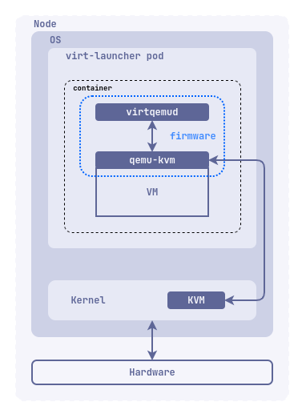

## Описание

Этот модуль предназначен для запуска и управления виртуальными машинами и их ресурсами на платформе Deckhouse.

Он предлагает следующие возможности:

- Простой и интуитивно понятный интерфейс для декларативного создания и управления виртуальными машинами и их ресурсами.
- Возможность запуска приложений, которые по каким-то причинам нельзя или сложно запустить в контейнере.
- Возможность запуска виртуальных машин и контейнеризованных приложений в одном окружении.
- Интеграция с имеющейся экосистемой Deckhouse, позволяющая использовать ее возможности для виртуальных машин.

## Требования

Для запуска модуля требуются следующие условия:

- Процессор с архитектурой x86_64 и поддержкой инструкций Intel-VT или AMD-V.
- Ядро Linux на узлах кластера должно быть версии 5.7 или более новой.
- Модуль [CNI Cilium](/documentation/v1/modules/021-cni-cilium/) для обеспечения сетевой связности виртуальных машин.
- Модули [SDS-DRBD](https://deckhouse.ru/modules/sds-drbd/stable/) или [CEPH-CSI](/documentation/v1/modules/031-ceph-csi/) для хранения данных виртуальных машин. Также возможно использовать другие варианты хранилищ, поддерживающие создание блочных устройств с режимом доступа `RWX` (`ReadWriteMany`).

## Что необходимо для включить модуль?

Порядок действий для включения модуля

1. Настроить кластер deckhouse
2. Включить модуль CNI Cilium
3. Установить и настроить хранилище SDS-DRBD/CEPH/etc
4. Включить модуль virtualization

## Архитектура

Модуль включает в себя следующие компоненты:

- Ядро модуля, основанное на проекте KubeVirt и использующее QEMU/KVM + libvirtd для запуска виртуальных машин.
- Deckhouse Virtualization Container Registry (DVCR) — репозиторий для хранения и кэширования образов виртуальных машин.
- Virtualization-controller — API для создания и управления ресурсами виртуальных машин.

API предоставляет возможности для создания и управления следующими ресурсами:

- образы виртуальных машин и загрузочные образы;
- диски виртуальных машин;
- виртуальные машины;
- операции над виртуальными машинами.

### Образы виртуальных машин и загрузочные образы

Образы представляют собой неизменяемые ресурсы, которые позволяют создавать новые виртуальные машины на основе предварительно настроенных и сконфигурированных образов. В зависимости от типа, образы могут быть в форматах `raw`, `qcow2`, `vmdk` и других для образов дисков виртуальных машин, а также в формате `iso` для установочных образов, которые могут быть подключены как `cdrom-устройства`.

Для загрузки образов вы можете использовать внешние источники, такие как `HTTP-сервер`, `container registry`, а также локально через командную строку (`cli`). Также существует возможность создавать образы из дисков виртуальных машин, например при необходимости создания базового образа для тиражирования (`golden-image`).

Важно отметить, что образы могут быть подключены к виртуальной машине только в режиме для чтения.

Образы бывают двух типов: кластерные `ClusterVirtualMachineImage`, которые доступны для всех пользователей платформы, и ограниченные по пространству имен `VirtualMachineImage`, которые доступны только для пользователей в рамках определенного `namespace`.

Для `ClusterVirtualMachineImage` образы хранятся только в `DVCR`, а для `VirtualMachineImage` вы можете использовать как `DVCR`, так и хранилище, предоставляемое платформой (`PVC`).

### Диски виртуальных машин

Cоздание дисков для виртуальных машины обеспечивает ресурс `VirtualMachineDisk`. Диски используются в виртуальной машине в качестве основного носителя для хранения данных. Диски могут быть созданы из внешних источников, ранее созданных образов (`VirtualMachineImage` или `ClusterVirtualMachineImage`) или могут быть созданы `пустыми`.

Одной из ключевых особенностей дисков является возможность изменения их размера без необходимости остановки виртуальной машины. Важно отметить, что поддерживается только возможность увеличения размера диска, в то время как уменьшение недоступно.

Более того, диски могут быть подключены к виртуальным машинам во время их работы, что обеспечивает гибкость в управлении хранилищем данных. Для этой задачи используется ресурс `VirtualMachineBlockDeviceAttachment`.

Для хранения дисков используется хранилище, предоставляемое платформой (`PVC`).

### Виртуальные машины

Ресурс `VirtualMachine` отвечает за создание виртуальной машины и управления её жизненным циклом. Через конфигурацию `VirtualMachine` можно определить параметры виртуальной машины, такие как количество процессоров, объем оперативной памяти, подключаемые образы и диски, а также правила размещения на узлах платформы, аналогично тому, как это делается для подов.

Политика запуска виртуальной машины определяет ее состояние. Она может быть включена, выключена, либо управление состоянием может осуществляться вручную. При перезагрузке узла, на котором запущена виртуальная машина, она будет временно выселена с этого узла с использованием механизма «живой миграции» на другой свободный узел, который удовлетворяет правилам размещения.

Виртуальная машина запускается внутри пода, что позволяет управлять виртуальными машинами как обычными ресурсами Kubernetes и использовать все возможности платформы, включая балансировщики нагрузки, сетевые политики, средства автоматизации и т. д.

### Операции над виртуальными машинами

Ресурс `VirtualMachineOperations` предназначен для декларативного управления изменением состоянием виртуальной машины. Ресурс позволяет выполнять следующие действия над виртуальными машинами: Запуск (Start), Остановка(Stop), Рестарт(Restart).
