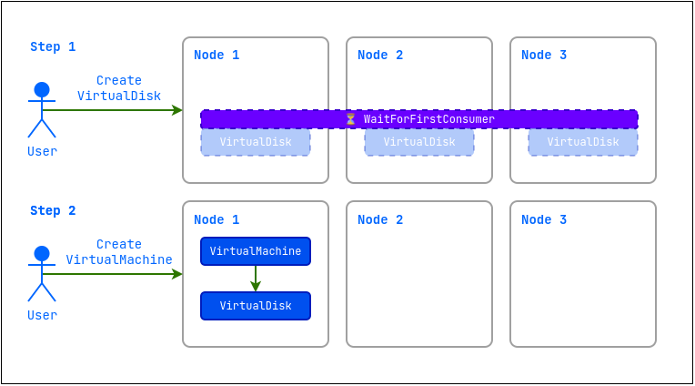
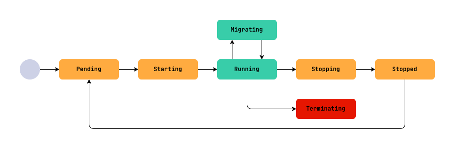
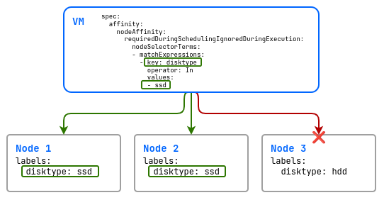
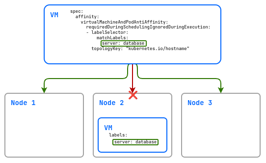
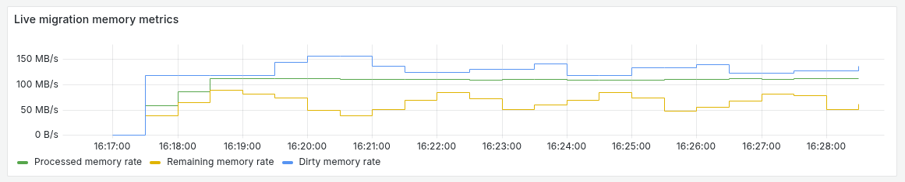
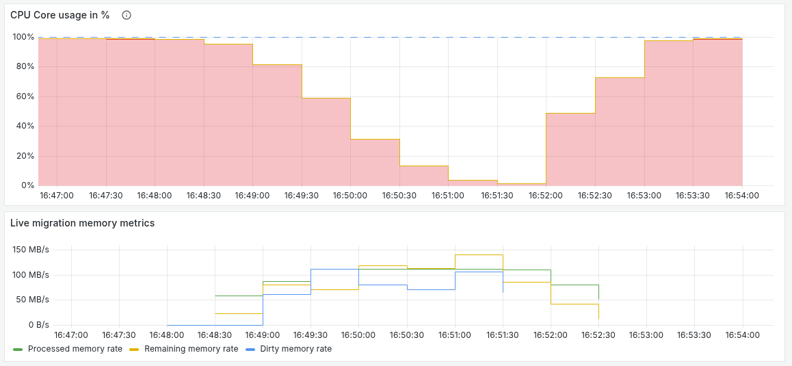
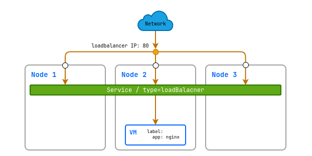

This guide describes how to create and modify `virtualization` module resources in a project or cluster namespace.

## Quick start on creating a virtual machine

This section walks through a minimal scenario: you create an Ubuntu 24.04 image, a disk from that image, and a virtual machine (VM), connect to it over the console, and then delete the created resources.



{}

1. Create a [VirtualImage](cr.html#virtualimage) from an external source:

   ```bash
   d8 k apply -f - <<EOF
   apiVersion: virtualization.deckhouse.io/v1alpha2
   kind: VirtualImage
   metadata:
     name: ubuntu
   spec:
     storage: ContainerRegistry
     dataSource:
       type: HTTP
       http:
         url: https://cloud-images.ubuntu.com/noble/current/noble-server-cloudimg-amd64.img
   EOF
   ```

1. Create a [VirtualDisk](cr.html#virtualdisk) from that image. Make sure the cluster has a default StorageClass, then apply the manifest:

   ```bash
   d8 k apply -f - <<EOF
   apiVersion: virtualization.deckhouse.io/v1alpha2
   kind: VirtualDisk
   metadata:
     name: linux-disk
   spec:
     dataSource:
       type: ObjectRef
       objectRef:
         kind: VirtualImage
         name: ubuntu
   EOF
   ```

1. Create a [VirtualMachine](cr.html#virtualmachine). The example uses a cloud-init script that creates the `cloud` user:

   ```bash
   d8 k apply -f - <<EOF
   apiVersion: virtualization.deckhouse.io/v1alpha2
   kind: VirtualMachine
   metadata:
     name: linux-vm
   spec:
     virtualMachineClassName: generic
     cpu:
       cores: 1
     memory:
       size: 1Gi
     provisioning:
       type: UserData
       userData: |
         #cloud-config
         ssh_pwauth: True
         users:
           - name: cloud
             passwd: <PASSWORD_HASH>
             shell: /bin/bash
             sudo: ALL=(ALL) NOPASSWD:ALL
             lock_passwd: False
     blockDeviceRefs:
       - kind: VirtualDisk
         name: linux-disk
   EOF
   ```

   Where `<PASSWORD_HASH>` is the hash of the user password, in quotes. Generate it with `mkpasswd --method=SHA-512 --rounds=4096`: the command prompts for the password and prints the ready value. The script format is described in the [cloud-init documentation](https://cloudinit.readthedocs.io/).

1. Verify that the image and the disk are created and the VM is running. Resources don't become ready instantly, so wait for the expected values in the `PHASE` column:

   ```bash
   d8 k get vi,vd,vm
   ```

   Example output:

   ```console {.nowrap-default}
   NAME                                                 PHASE   CDROM   PROGRESS   AGE
   virtualimage.virtualization.deckhouse.io/ubuntu      Ready   false   100%       7h50m

   NAME                                                 PHASE   CAPACITY   VIRTUALMACHINE   AGE
   virtualdisk.virtualization.deckhouse.io/linux-disk   Ready   4Gi        linux-vm         7h40m

   NAME                                                 PHASE     UPTIME   NODE           IPADDRESS    AGE
   virtualmachine.virtualization.deckhouse.io/linux-vm  Running   7h30m    virtlab-pt-2   10.66.10.2   7h46m
   ```

1. Connect to the VM over the console:

   ```bash
   d8 v console linux-vm
   ```

   Example output:

   ```console {.nowrap-default}
   Successfully connected to linux-vm console. The escape sequence is ^]

   linux-vm login: cloud
   Password:
   ...
   cloud@linux-vm:~$
   ```

   To exit the console, press `Ctrl+]`.

1. Delete the created resources:

   ```bash
   d8 k delete vm linux-vm
   d8 k delete vd linux-disk
   d8 k delete vi ubuntu
   ```

{}

{}

1. Create an image from an external source:

   1. Go to the **Projects** tab and select the project you need.
   1. Go to **Virtualization** → **Images**.
   1. Click **Create**.
   1. In the **Source** block, select **By link**.
   1. In the form that opens, enter `ubuntu` in the **Image name** field.
   1. In the **Storage** block, select `ContainerRegistry` in the **Storage type** field.
   1. In the **URL** field, paste `https://cloud-images.ubuntu.com/noble/current/noble-server-cloudimg-amd64.img`.
   1. Click **Create**.
   1. Check the image status on its page.

1. Create a disk from that image. You can skip this step and create the disk while creating the VM.

   1. Go to **Virtualization** → **Disks**.
   1. Click **Create**.
   1. In the form that opens, enter `linux-disk` in the **Disk name** field.
   1. In the **Source** field, select the `ubuntu` image from the drop-down list.
   1. If required, specify a larger size in the **Size** field, for example `5Gi`.
   1. In the **Storage class** field, select a StorageClass or keep the default one.
   1. Click **Create**.
   1. Check the disk status on its page.

   > If the selected StorageClass uses the `WaitForFirstConsumer` mode, the disk waits for the VM that uses it.
   > Until then, the disk shows the "CREATING 0%" status, but you can already select it when creating a VM.

1. Create a virtual machine:

   1. Go to **Virtualization** → **Virtual machines**.
   1. Click **Create**.
   1. In the form that opens, enter `linux-vm` in the **Name** field.
   1. In the **Platform** and **Resources** sections, keep the default settings.
   1. In the **Disks** section, click **Add**.

      If the disk is already created, select **Existing** in the **Disks / Images** window that opens and pick `linux-disk` from the list.

      If the disk isn't created, select **Create from** in the same window and set the parameters:

      - In the **Name** field, enter `linux-disk`.
      - In the **Source** field, select the `ubuntu` image from the drop-down list. The list shows the resource type.
      - If required, specify a larger size in the **Size** field, for example `5Gi`.
      - In the **Storage** field, select a StorageClass or keep the default one.

      Click **Add**.

   1. Scroll down to the **Cloud-init** toggle and enable it.
   1. Paste the script into the field that appears, replacing `<PASSWORD_HASH>` with the password hash in quotes, generated with `mkpasswd --method=SHA-512 --rounds=4096`:

      ```yaml
      #cloud-config
      ssh_pwauth: True
      users:
        - name: cloud
          passwd: <PASSWORD_HASH>
          shell: /bin/bash
          sudo: ALL=(ALL) NOPASSWD:ALL
          lock_passwd: False
      ```

   1. Click **Create**.
   1. Check the VM status on its page.

1. Connect to the VM over the console:

   1. Go to **Virtualization** → **Virtual machines**.
   1. Select the VM from the list and click its name.
   1. In the form that opens, go to the **TTY** tab and log in to the console window.

1. Delete the created resources:

   1. Go to **Virtualization** and select the section you need, for example **Virtual machines**, **Disks**, or **Images**.
   1. In the resource row, click the ellipsis button and select **Delete**. In some lists, for example in the list of VM snapshots, deletion is a separate button.
   1. In the confirmation window, click **Delete** or cancel the action with **Don't delete**.

   > **Important:** Deleting a resource is irreversible. A disk attached to a running virtual machine can't be deleted, and the **Delete** item is inactive for it.

{}



## Images

An image holds the contents of a disk that you use to create virtual machine disks. A [VirtualImage](cr.html#virtualimage) is created in a project and available only in the project or namespace where it was created.


To make the same image available to every project in the cluster, you need a cluster image, [ClusterVirtualImage](cr.html#clustervirtualimage). Only an administrator can create it; the procedure is described in the [admin guide](admin_guide.html#images).


A virtual machine accesses an attached image in read-only mode.

An image appears in a project in three steps:

1. You create a [VirtualImage](cr.html#virtualimage) resource and specify a data source in it.
1. The module downloads the image from that source to the storage, which is either DVCR or a PVC, depending on the selected type.
1. The downloaded image becomes available for creating disks.

### Sources and storage options

The image source can be an HTTP server hosting the image file, a container image registry, or a file on your computer that you upload from the command line. You can also create an image from another image, from a virtual machine disk, or from a disk snapshot.

Image types, supported file formats, and compression algorithms are described in [Image types and formats](admin_guide.html#image-types-and-formats) in the admin guide.

The downloaded image is stored in one of two ways, set by the [`.spec.storage`](cr.html#virtualimage-v1alpha2-spec-storage) parameter:

- `ContainerRegistry`: The default option, the image is stored in DVCR.
- `PersistentVolumeClaim`: The image is stored in a PVC. This option is preferable if the storage can clone PVCs quickly, because disks are created from such an image faster.


An image stored with `storage: PersistentVolumeClaim` can only be used to create disks in the same storage class.


The `PHASE` column in the `d8 k get vi` output shows the progress of image creation; for its values, see the [`.status.phase`](cr.html#virtualimage-v1alpha2-status-phase) field. To follow the creation in real time, add the `-w` flag. If an image stays not ready for a long time, check the [`.status.conditions`](cr.html#virtualimage-v1alpha2-status-conditions) block and the `d8 k describe vi` output for the reason.

Until an image reaches the `Ready` phase, you can change its `.spec` block, and the download restarts after each change. For a ready image, the `.spec` block can no longer be changed. For all image parameters, see [VirtualImage](cr.html#virtualimage).

### Creating an image from an HTTP server

The simplest way to create an image is to provide a link to a file hosted on an HTTP server.



{}

1. Create a [VirtualImage](cr.html#virtualimage) resource. In the example, the image is stored in DVCR:

   ```bash
   d8 k apply -f - <<EOF
   apiVersion: virtualization.deckhouse.io/v1alpha2
   kind: VirtualImage
   metadata:
     name: ubuntu-24-04
   spec:
     # Store the image in DVCR.
     storage: ContainerRegistry
     # Source for the image.
     dataSource:
       type: HTTP
       http:
         url: https://cloud-images.ubuntu.com/noble/current/noble-server-cloudimg-amd64.img
   EOF
   ```

1. Verify that the image is created:

   ```bash
   d8 k get virtualimage ubuntu-24-04

   # Short form of the command.
   d8 k get vi ubuntu-24-04
   ```

   Example output:

   ```console
   NAME           PHASE   CDROM   PROGRESS   AGE
   ubuntu-24-04   Ready   false   100%       23h
   ```

{}

{}

1. Go to the **Projects** tab and select the project you need.
1. Go to **Virtualization** → **Images**.
1. Click **Create**.
1. In the **Source** block, select **By link**.
1. In the form that opens, enter the image name in the **Image name** field.
1. In the **Storage** block, select `ContainerRegistry` in the **Storage type** field.
1. In the **URL** field, specify the link to the image.
1. Click **Create**.
1. Check the image status on its page.

{}



#### Verifying the integrity of a downloaded image

The [`checksum`](cr.html#virtualimage-v1alpha2-spec-datasource-http-checksum) block makes the module verify what it downloaded from the HTTP server. The image reaches the `Ready` phase only if the downloaded file matches every specified checksum, otherwise the resource ends up in the `Failed` phase:

```bash
d8 k apply -f - <<EOF
apiVersion: virtualization.deckhouse.io/v1alpha2
kind: VirtualImage
metadata:
  name: ubuntu-24-04
spec:
  storage: ContainerRegistry
  dataSource:
    type: HTTP
    http:
      url: https://cloud-images.ubuntu.com/noble/current/noble-server-cloudimg-amd64.img
      checksum:
        sha256: 78be890d71dde316c412da2ce8332ba47b9ce7a29d573801d2777e01aa20b9b5
EOF
```

Take the checksum from the mirror that publishes the image and put it in the field of the matching algorithm:

| Field         | Algorithm                             | Verification speed |
| ------------- | ------------------------------------- | ------------------ |
| `sha1`        | SHA-1                                 | ~1.6 GB/s          |
| `sha256`      | SHA-256                               | ~1.5 GB/s          |
| `md5`         | MD5                                   | ~700 MB/s          |
| `sha512`      | SHA-512                               | ~570 MB/s          |
| `streebog256` | GOST R 34.11-2012 (Streebog), 256-bit | ~17 MB/s           |
| `streebog512` | GOST R 34.11-2012 (Streebog), 512-bit | ~17 MB/s           |

The speeds are an order of magnitude, not a promise. They were measured on an x86-64 CPU with the SHA instruction set, and a CPU without it computes SHA-1 and SHA-256 several times slower. What holds on any CPU is the distance between the rows. SHA-1 and SHA-256 are computed by dedicated instructions, MD5 and SHA-512 by hand-written assembly, and all four hash data faster than it arrives over the network, so their cost stays invisible against the download itself.

The Streebog algorithms have no hardware support anywhere and are about two orders of magnitude slower. For a 10 GiB image, that's around ten minutes of hashing alone, and image creation becomes CPU-bound rather than network-bound. Use them only when a GOST checksum is actually required. Both lengths cost the same, because GOST R 34.11-2012 uses one compression function for 256 and 512 bits, and the shorter variant differs only in the initial value.

Checksums are computed in a single pass over the downloaded data, so specifying several checksums at once costs the sum of their times. Empty fields cost nothing.

The same block is available for the `Upload` source in the [`dataSource.upload.checksum`](cr.html#virtualimage-v1alpha2-spec-datasource-upload-checksum) parameter and works the same way. The uploaded data is verified against every specified checksum, and on a mismatch the resource stays in the `Failed` phase.

#### Storing an image in a PVC

To create disks from an image faster, store it in a PVC. The module can then clone the volume instead of unpacking the image again.



{}

1. Create a [VirtualImage](cr.html#virtualimage) resource with the `PersistentVolumeClaim` storage type:

   ```bash
   d8 k apply -f - <<EOF
   apiVersion: virtualization.deckhouse.io/v1alpha2
   kind: VirtualImage
   metadata:
     name: ubuntu-24-04-pvc
   spec:
     # Storage settings for the project image.
     storage: PersistentVolumeClaim
     persistentVolumeClaim:
       # Specify the name of your StorageClass.
       storageClassName: rv-thin-r2
     # Source for the image.
     dataSource:
       type: HTTP
       http:
         url: https://cloud-images.ubuntu.com/noble/current/noble-server-cloudimg-amd64.img
   EOF
   ```

   If the [`.spec.persistentVolumeClaim.storageClassName`](cr.html#virtualimage-v1alpha2-spec-persistentvolumeclaim-storageclassname) parameter isn't set, the module uses the cluster-wide default StorageClass or the class set for images in the [module settings](./admin_guide.html#storage-classes-for-images-and-disks).

1. Verify that the image is created:

   ```bash
   d8 k get vi ubuntu-24-04-pvc
   ```

   Example output:

   ```console {.nowrap-default}
   NAME               PHASE   CDROM   PROGRESS   AGE
   ubuntu-24-04-pvc   Ready   false   100%       23h
   ```

{}

{}

1. Go to the **Projects** tab and select the project you need.
1. Go to **Virtualization** → **Images**.
1. Click **Create**.
1. In the **Source** block, select **By link**.
1. In the form that opens, enter the image name in the **Image name** field.
1. In the **Storage** block, select `PersistentVolumeClaim` in the **Storage type** field.
1. In the **Storage class** field, select a StorageClass or keep the default one.
1. In the **URL** field, specify the link to the image.
1. Click **Create**.
1. Check the image status on its page.

{}



### Creating an image from a container image registry

The module can pull an image from an external container image registry, but the disk file must be located in the container image under the `/disk` path. The following steps show how to prepare such a container image and create a project image from it.



{}

1. Download the image file to your local machine:

   ```bash
   curl -L https://cloud-images.ubuntu.com/minimal/releases/noble/release/ubuntu-24.04-minimal-cloudimg-amd64.img -o ubuntu2404.img
   ```

1. Create a `Dockerfile` with the following contents:

   ```Dockerfile
   FROM scratch
   COPY ubuntu2404.img /disk/ubuntu2404.img
   ```

1. Build the container image. The example uses the [docker.com](https://www.docker.com/) registry, which requires an account and a configured environment:

   ```bash
   docker build -t docker.io/<USERNAME>/ubuntu2404:latest
   ```

   Where `<USERNAME>` is the username you specified when registering in the registry.

1. Push the built container image to the registry:

   ```bash
   docker push docker.io/<USERNAME>/ubuntu2404:latest
   ```

1. Create a [VirtualImage](cr.html#virtualimage) resource that points to the container image:

   ```bash
   d8 k apply -f - <<EOF
   apiVersion: virtualization.deckhouse.io/v1alpha2
   kind: VirtualImage
   metadata:
     name: ubuntu-2404
   spec:
     storage: ContainerRegistry
     dataSource:
       type: ContainerImage
       containerImage:
         image: docker.io/<USERNAME>/ubuntu2404:latest
   EOF
   ```

The module works only with registries that have TLS enabled. If the registry uses its own certificate authority, provide the certificate chain in the [`caBundle`](cr.html#virtualimage-v1alpha2-spec-datasource-containerimage-cabundle) parameter, and take the credentials for a private registry from the secret specified in the `imagePullSecret` parameter.

{}

{}

1. Go to the **Projects** tab and select the project you need.
1. Go to **Virtualization** → **Images**.
1. Click **Create**.
1. In the **Source** block, select **From registry**.
1. In the form that opens, enter the image name in the **Image name** field.
1. In the **Storage** block, select `ContainerRegistry` in the **Storage type** field.
1. In the **Image in container registry** field, specify the path to the container image.
1. Click **Create**.
1. Check the image status on its page.

{}



### Uploading an image from the command line

If the image file is on your computer, upload it directly. The module creates a temporary upload endpoint for this and waits for the data.



{}

1. Create a [VirtualImage](cr.html#virtualimage) resource with the `Upload` source:

   ```bash
   d8 k apply -f - <<EOF
   apiVersion: virtualization.deckhouse.io/v1alpha2
   kind: VirtualImage
   metadata:
     name: some-image
   spec:
     # Storage settings for the project image.
     storage: ContainerRegistry
     # Image source settings.
     dataSource:
       type: Upload
   EOF
   ```

   The resource moves to the `WaitForUserUpload` phase and is ready to accept the file. Start the upload within 10 minutes, otherwise the resource moves to the `Failed` phase and you have to create it again.

1. Get the addresses that accept the file:

   ```bash
   d8 k get vi some-image -o jsonpath="{.status.imageUploadURLs}" | jq
   ```

   Example output:

   ```console {.nowrap-default}
   {
     "external": "https://virtualization.example.com/upload/<SECRET_URL>",
     "inCluster": "http://10.222.165.239/upload"
   }
   ```

   Use the `inCluster` address if you upload the file from one of the cluster nodes, and `external` in all other cases.

1. Upload the file to the selected address. The example first downloads the Cirros image and then sends it to the cluster:

   ```bash
   curl -L http://download.cirros-cloud.net/0.5.1/cirros-0.5.1-x86_64-disk.img -o cirros.img
   curl https://virtualization.example.com/upload/<SECRET_URL> --progress-bar -T cirros.img | cat
   ```

   Where `<SECRET_URL>` is the last part of the address from the previous step.

1. Verify that the image has reached the `Ready` phase:

   ```bash
   d8 k get vi some-image
   ```

   Example output:

   ```console
   NAME         PHASE   CDROM   PROGRESS   AGE
   some-image   Ready   false   100%       1m
   ```

You can also verify the uploaded file against a checksum. To do this, specify the [`checksum`](cr.html#virtualimage-v1alpha2-spec-datasource-upload-checksum) block in the data source. The checksums are computed over the bytes the client sends, and on a mismatch the resource stays in the `Failed` phase, so the upload has to be repeated on a recreated resource.

{}

{}

1. Go to the **Projects** tab and select the project you need.
1. Go to **Virtualization** → **Images**.
1. Click **Create**, then select **Upload** in the **Source** block.
1. In the **Image name** field, enter the image name.
1. In the **Upload file** block, drag the file to the highlighted area or click **select on your computer**.
1. Select the file in the file manager that opens.
1. Click **Create**.
1. Wait until the image reaches the **Ready** state.

{}



### Creating an image from a disk

You can create an image from a [disk](#disks) if the disk isn't attached to any virtual machine, or if the machine it's attached to is powered off.



{}

```bash
d8 k apply -f - <<EOF
apiVersion: virtualization.deckhouse.io/v1alpha2
kind: VirtualImage
metadata:
  name: linux-vm-root
spec:
  storage: ContainerRegistry
  dataSource:
    type: ObjectRef
    objectRef:
      kind: VirtualDisk
      name: linux-vm-root
EOF
```

{}

{}

1. Go to the **Projects** tab and select the project you need.
1. Go to **Virtualization** → **Images**.
1. Click **Create**.
1. In the **Source** block, select **Create from**.
1. In the form that opens, enter `linux-vm-root` in the **Image name** field.
1. In the **Storage** block, select `ContainerRegistry` in the **Storage type** field.
1. In the **Source** field, select the disk you need from the drop-down list.
1. Click **Create**.
1. Check the image status on its page.

{}



### Creating an image from a disk snapshot

You can create an image from a [disk snapshot](#creating-disk-snapshots) if the snapshot is in the `Ready` phase.



{}

```bash
d8 k apply -f - <<EOF
apiVersion: virtualization.deckhouse.io/v1alpha2
kind: VirtualImage
metadata:
  name: linux-vm-root
spec:
  storage: ContainerRegistry
  dataSource:
    type: ObjectRef
    objectRef:
      kind: VirtualDiskSnapshot
      name: linux-vm-root-snapshot
EOF
```

{}

{}

1. Go to the **Projects** tab and select the project you need.
1. Go to **Virtualization** → **Images**.
1. Click **Create**.
1. In the form that opens, enter the image name in the **Image name** field.
1. In the **Storage** block, select the image storage type in the **Storage type** field.
1. In the **Source** block, select **Create from**.
1. In the **Source** field, expand the list and select the snapshot you need in the **Disk snapshots** group.
1. Click **Create**.
1. Check the image status on its page.

{}



Image properties are convenient to review in the web interface, in **Virtualization** → **Images**:

- The list shows the image name, status, size, format in the **Type** column, and visibility scope in the **Availability** column, and the filters narrow it down by status, image, and type.
- On the image page, the **Information** tab collects the creation parameters in the **Storage** and **Source** blocks, and the **State** block shows the average download speed, format, unpacked size, size in storage, creation time, the **CD-ROM** flag, and the image path in DVCR.
- The **Meta** and **YAML** tabs show labels with annotations and the full resource specification.

## Disks

A disk stores virtual machine data, including the operating system and application files. A disk is described by the [VirtualDisk](cr.html#virtualdisk) resource, and its specification consists of two blocks:

- [`persistentVolumeClaim`](cr.html#virtualdisk-v1alpha2-spec-persistentvolumeclaim): Storage parameters, that is, the StorageClass and the size.
- [`dataSource`](cr.html#virtualdisk-v1alpha2-spec-datasource): The data source, which can be an image, another disk, or a snapshot.

Without the `dataSource` block, an empty disk is created, and then you have to specify at least the size in `persistentVolumeClaim`. If a source is set, you can omit the `persistentVolumeClaim` block, and the module takes the size from the source and picks the storage class based on it too. When no class can be picked, the module uses the cluster-wide default StorageClass or the class set for disks in the [module settings](./admin_guide.html#storage-classes-for-images-and-disks).

The `PHASE` column in the `d8 k get vd` output shows the progress of disk creation; for its values, see the [`.status.phase`](cr.html#virtualdisk-v1alpha2-status-phase) field. If a disk stays not ready for a long time, the [`.status.conditions`](cr.html#virtualdisk-v1alpha2-status-conditions) block tells you the reason.

Until a disk reaches the `Ready` phase, you can change any field of the `.spec` block, and the creation restarts after the change. For a ready disk, only the size and the storage class remain editable, in the [`.spec.persistentVolumeClaim.size`](cr.html#virtualdisk-v1alpha2-spec-persistentvolumeclaim-size) and [`.spec.persistentVolumeClaim.storageClassName`](cr.html#virtualdisk-v1alpha2-spec-persistentvolumeclaim-storageclassname) parameters.


You can't create a disk from an ISO image.


### How storage affects a disk

Disk behavior depends on the storage behind the selected StorageClass. The differences show up in two properties.

The volume type determines the format in which the module creates the disk. On file system volumes (`FileSystem`, for example NFS), the disk is created in the `qcow2` format, and on block devices (`Block`, for example iSCSI or Ceph RBD), data is written directly. Some storage types support both.

The volume binding mode determines when the disk is created:

- `Immediate`: The disk is created right away, independently of virtual machines, and you can attach it to a machine on any cluster node.

  

- `WaitForFirstConsumer`: The disk is created only after it's attached to a virtual machine, and it's placed on the node where that machine starts.

  

The module determines the remaining parameters, including the disk format, on its own from the capabilities of the selected StorageClass.

To view the available storage types, run the following command:

```bash
d8 k get storageclass
```

Example output:

```console {.nowrap-default}
NAME                   PROVISIONER                           RECLAIMPOLICY   VOLUMEBINDINGMODE      ALLOWVOLUMEEXPANSION   AGE
rv-thin-r1 (default)   replicated.csi.storage.deckhouse.io   Delete          Immediate              true                   48d
rv-thin-r2             replicated.csi.storage.deckhouse.io   Delete          Immediate              true                   48d
nfs-4-1-wffc           nfs.csi.k8s.io                        Delete          WaitForFirstConsumer   true                   30d
```

In the web interface, the same list is available on the **System** tab, in **Storage** → **Storage classes**.

### Creating an empty disk

An empty disk is what you need to install an operating system on it or to store data separately from the system disk.



{}

1. Create a [VirtualDisk](cr.html#virtualdisk) resource with the size and the storage class:

   ```bash
   d8 k apply -f - <<EOF
   apiVersion: virtualization.deckhouse.io/v1alpha2
   kind: VirtualDisk
   metadata:
     name: blank-disk
   spec:
     # Disk storage parameters.
     persistentVolumeClaim:
       # Specify the name of your StorageClass.
       storageClassName: rv-thin-r2
       size: 100Mi
   EOF
   ```

1. Verify that the disk is created:

   ```bash
   d8 k get vd blank-disk
   ```

   Example output:

   ```console {.nowrap-default}
   NAME         PHASE   CAPACITY   VIRTUALMACHINE   AGE
   blank-disk   Ready   100Mi                       1m2s
   ```

{}

{}

You can skip this step and create the disk while creating the VM.

1. Go to the **Projects** tab and select the project you need.
1. Go to **Virtualization** → **Disks**.
1. Click **Create**.
1. In the form that opens, enter `blank-disk` in the **Disk name** field.
1. In the **Size** field, specify the size with units, for example `100Mi`.
1. In the **Storage class** field, select a StorageClass or keep the default one.
1. Click **Create**.
1. Check the disk status on its page.

{}



### Creating a disk from an image

You can fill a disk with data from an image created earlier, either a project [VirtualImage](cr.html#virtualimage) or a cluster [ClusterVirtualImage](cr.html#clustervirtualimage).

Specifying the disk size is optional. If you don't set it, the module creates the disk exactly at the unpacked size of the image, and if you do set it, the size must be no smaller than the unpacked one.



{}

1. Check the unpacked image size in the `UNPACKEDSIZE` column:

   ```bash
   d8 k get vi ubuntu-24-04 -o wide
   ```

   Example output:

   ```console {.nowrap-default}
   NAME           PHASE   CDROM   PROGRESS   STOREDSIZE   UNPACKEDSIZE   REGISTRY URL                                                                              TARGETPVC   AGE
   ubuntu-24-04   Ready   false   100%       285.9Mi      2.5Gi          dvcr.d8-virtualization.svc/vi/default/ubuntu-24-04:eac95605-7e0b-4a32-bb50-cc7284fd89d0               122m
   ```

1. Create a disk with a size larger than the unpacked one:

   ```bash
   d8 k apply -f - <<EOF
   apiVersion: virtualization.deckhouse.io/v1alpha2
   kind: VirtualDisk
   metadata:
     name: linux-vm-root
   spec:
     # Disk storage parameters.
     persistentVolumeClaim:
       # The size is larger than the unpacked image size.
       size: 10Gi
       # Specify the name of your StorageClass.
       storageClassName: rv-thin-r2
     # The source the disk is created from.
     dataSource:
       type: ObjectRef
       objectRef:
         kind: VirtualImage
         name: ubuntu-24-04
   EOF
   ```

1. Create a second disk without specifying the size:

   ```bash
   d8 k apply -f - <<EOF
   apiVersion: virtualization.deckhouse.io/v1alpha2
   kind: VirtualDisk
   metadata:
     name: linux-vm-root-2
   spec:
     # Disk storage parameters.
     persistentVolumeClaim:
       # Specify the name of your StorageClass.
       storageClassName: rv-thin-r2
     # The source the disk is created from.
     dataSource:
       type: ObjectRef
       objectRef:
         kind: VirtualImage
         name: ubuntu-24-04
   EOF
   ```

1. Compare the sizes of the created disks:

   ```bash
   d8 k get vd
   ```

   Example output:

   ```console {.nowrap-default}
   NAME              PHASE   CAPACITY   VIRTUALMACHINE   AGE
   linux-vm-root     Ready   10Gi                        7m52s
   linux-vm-root-2   Ready   2590Mi                      7m15s
   ```

   The first disk got the specified 10 GiB, and the second one got the unpacked image size.

{}

{}

You can skip this step and create the disk while creating the VM.

1. Go to the **Projects** tab and select the project you need.
1. Go to **Virtualization** → **Disks**.
1. Click **Create**.
1. In the form that opens, enter `linux-vm-root` in the **Disk name** field.
1. In the **Source** field, select the image you need from the drop-down list.
1. If required, specify a larger size in the **Size** field or keep the default value.
1. In the **Storage class** field, select a StorageClass or keep the default one.
1. Click **Create**.
1. Check the disk status on its page.

{}



### Uploading a disk from the command line

If the image file is on your computer, upload it straight into a disk. The module creates a temporary upload endpoint for this and waits for the data.



{}

1. Create a [VirtualDisk](cr.html#virtualdisk) resource with the `Upload` source:

   ```bash
   d8 k apply -f - <<EOF
   apiVersion: virtualization.deckhouse.io/v1alpha2
   kind: VirtualDisk
   metadata:
     name: uploaded-disk
   spec:
     dataSource:
       type: Upload
   EOF
   ```

   The resource moves to the `WaitForUserUpload` phase and is ready to accept the file. Start the upload within 10 minutes, otherwise the resource moves to the `Failed` phase and you have to create it again.

1. Get the addresses that accept the file:

   ```bash
   d8 k get vd uploaded-disk -o jsonpath="{.status.imageUploadURLs}" | jq
   ```

   Example output:

   ```console {.nowrap-default}
   {
     "external": "https://virtualization.example.com/upload/<SECRET_URL>",
     "inCluster": "http://10.222.165.239/upload"
   }
   ```

   Use the `inCluster` address if you upload the file from one of the cluster nodes, and `external` in all other cases.

1. Upload the file to the selected address:

   ```bash
   curl https://virtualization.example.com/upload/<SECRET_URL> --progress-bar -T <IMAGE_FILE> | cat
   ```

   Where `<SECRET_URL>` is the address from the previous step, and `<IMAGE_FILE>` is the path to the image file on your computer.

1. Verify that the disk has reached the `Ready` phase:

   ```bash
   d8 k get vd uploaded-disk
   ```

   Example output:

   ```console {.nowrap-default}
   NAME            PHASE   CAPACITY   VIRTUALMACHINE   AGE
   uploaded-disk   Ready   3Gi                         7d23h
   ```

{}

{}

1. Go to the **Projects** tab and select the project you need.
1. Go to **Virtualization** → **Disks**.
1. Click **Create**.
1. In the form that opens, enter the disk name in the **Disk name** field.
1. In the **Disk** block, select **Upload** in the **Data source** field.
1. Drag the file to the highlighted area, or click it and select the file on your computer.
1. In the **Size** field, specify the disk size, and in the **Storage class** field, select a StorageClass.
1. Click **Create**.

> If the selected storage class uses the `WaitForFirstConsumer` volume binding mode, the **Upload** option isn't available. Without a consumer, the disk isn't created and there's nowhere to upload the file, so select a storage class with the `Immediate` mode or upload the data as an image.
>
> For the same reason, an empty disk created in advance with such a storage class stays in the "WAITING FOR VM" status and isn't offered in the **Disks / Images** window when attaching to a virtual machine, because only a ready disk can be selected. Create such disks right from the virtual machine form with the **Blank** or **Create from** options.

{}



Disk properties are convenient to review in the web interface, in **Virtualization** → **Disks**:

- The list shows the disk name, status, size, storage class in the **Class** column, the virtual machine that uses the disk in the **Used by** column, and the resource age.
- On the disk page, the **Configuration** tab shows the data source, size, storage class, and the list of VMs in the **Used in** row.
- The **Diagnostics** tab shows the PVC name, its phase, size, storage class, PV name, and age, as well as the duration of the disk creation stages in the **Diagnostics summary** block.

### Changing the disk size

You can grow a disk even while it's attached to a running virtual machine. You can't shrink a disk.



{}

1. Check the current disk size:

   ```bash
   d8 k get vd linux-vm-root
   ```

   Example output:

   ```console {.nowrap-default}
   NAME            PHASE   CAPACITY   VIRTUALMACHINE   AGE
   linux-vm-root   Ready   10Gi       linux-vm         10m
   ```

1. Set the new size in the [`.spec.persistentVolumeClaim.size`](cr.html#virtualdisk-v1alpha2-spec-persistentvolumeclaim-size) parameter:

   ```bash
   d8 k patch vd linux-vm-root --type merge -p '{"spec":{"persistentVolumeClaim":{"size":"11Gi"}}}'

   # You can achieve the same result by editing the resource.
   d8 k edit vd linux-vm-root
   ```

1. Verify that the size has changed:

   ```bash
   d8 k get vd linux-vm-root
   ```

   Example output:

   ```console {.nowrap-default}
   NAME            PHASE   CAPACITY   VIRTUALMACHINE   AGE
   linux-vm-root   Ready   11Gi       linux-vm         12m
   ```

{}

{}

You can change the size from the virtual machine page:

1. Go to the **Projects** tab and select the project you need.
1. Go to **Virtualization** → **Virtual machines**.
1. Select the VM the disk is attached to from the list and click its name.
1. On the **Configuration** tab, in the **Disks** section, click the pencil icon next to the disk size.
1. In the window that opens, specify a larger size.
1. Click **Apply**.

Or from the disk page itself:

1. Go to **Virtualization** → **Disks**.
1. Select the disk you need and click its name.
1. On the **Configuration** tab, specify a larger size in the **Size** field.
1. Click the **Save** button that appears.
1. Check the disk status on its page.

{}



### Migrating disks to other storage

In paid editions, you can move a disk to another storage by changing its storage class. The move works both for disks defined in the VM specification and for disks attached as a separate resource.


The virtual machine must be in the `Running` phase, and the source and target storage must be of the same type. You can't move a disk from a file system volume to a block device or the other way around.


To move a disk, specify the new storage class in the [`.spec.persistentVolumeClaim.storageClassName`](cr.html#virtualdisk-v1alpha2-spec-persistentvolumeclaim-storageclassname) parameter:

```bash
d8 k patch vd disk --type=merge --patch '{"spec":{"persistentVolumeClaim":{"storageClassName":"new-storage-class-name"}}}'

# You can achieve the same result by editing the resource.
d8 k edit vd disk
```

After that, a live migration of the VM starts, during which the disk moves to the new storage.

If you need to move several disks of the same machine, change the storage class one disk at a time:

```bash
d8 k patch vd disk1 --type=merge --patch '{"spec":{"persistentVolumeClaim":{"storageClassName":"new-storage-class-name"}}}'
d8 k patch vd disk2 --type=merge --patch '{"spec":{"persistentVolumeClaim":{"storageClassName":"new-storage-class-name"}}}'
```

The module retries a failed migration with a growing delay. The first attempt runs immediately, the next ones after 5 and 10 seconds, then the delay doubles and from the seventh attempt stays at 300 seconds. To cancel the migration, restore the previous storage class in the specification.

### Exporting a disk or a snapshot

Export writes the contents of a disk or its snapshot to a file so that you can move the data outside the cluster.



{}

You can export virtual machine disks and disk snapshots with the `d8` utility (version 0.20.7 and later). For this feature to work, the [`storage-volume-data-manager`](/modules/storage-volume-data-manager/) module has to be enabled.

> **Important:** The disk must not be in use at the moment of export. If the disk is attached to a virtual machine, stop the VM first.

An example of exporting a disk, with the command run on a cluster node:

```bash
d8 data export download -n <NAMESPACE> vd/<VD_NAME> -o file.img
```

An example of exporting a disk snapshot, with the command run on a cluster node:

```bash
d8 data export download -n <NAMESPACE> vds/<VD_SNAPSHOT_NAME> -o file.img
```

If you export data from somewhere other than a cluster node (for example, from your local machine), use the `--publish` flag.

> To import a downloaded disk back into the cluster, upload it as an [image](#uploading-an-image-from-the-command-line) or as a [disk](#uploading-a-disk-from-the-command-line).

{}

{}

1. Go to the **Projects** tab and select the project you need.
1. Stop the virtual machine the disk is attached to. While the disk is in use, the **Download** item isn't available.
1. Go to **Virtualization** → **Disks**.
1. In the row of the disk you need, click the ellipsis button and select **Download**.
1. Wait until the **Preparing...** step in the **Download** window changes to **Ready**: the file downloads automatically as soon as it's created. If that doesn't happen, click **Download** in the window.

{}




While an export is active, the disk is in the `Exporting` phase and a virtual machine with this disk won't start. The export ends when its lifetime expires or when the DataExport resource created for it is deleted.

## Virtual machines

To create a virtual machine, use the [VirtualMachine](cr.html#virtualmachine) resource. Its parameters let you configure:

- the [virtual machine class](admin_guide.html#virtual-machine-classes);
- the resources required for the virtual machine to run (CPU, memory, disks, and images);
- the placement rules for the virtual machine on cluster nodes;
- the bootloader settings and optimal parameters for the guest OS;
- the virtual machine startup policy and the policy for applying changes;
- the initial configuration scripts (cloud-init);
- the list of block devices.

For a full description of virtual machine configuration parameters, see the [configuration reference](cr.html#virtualmachine).

### Creating a virtual machine

The following steps show how to start an Ubuntu 24.04 virtual machine on the disk you [created earlier](#creating-a-disk-from-an-image). The cloud-init script installs the `qemu-guest-agent` agent and the `nginx` service, and creates the `cloud` user with the `cloud` password.



{}

1. Create a [VirtualMachine](cr.html#virtualmachine) resource:

   ```bash
   d8 k apply -f - <<"EOF"
   apiVersion: virtualization.deckhouse.io/v1alpha2
   kind: VirtualMachine
   metadata:
     name: linux-vm
   spec:
     # VM class name.
     virtualMachineClassName: generic
     # OS type: Generic for Linux and Windows for Windows. Generic by default.
     # osType: Generic
     # Bootloader type: BIOS, EFI, or EFIWithSecureBoot. BIOS by default.
     # bootloader: BIOS
     # VM initialization script.
     provisioning:
       type: UserData
       userData: |
         #cloud-config
         package_update: true
         packages:
           - nginx
           - qemu-guest-agent
         runcmd:
           - systemctl daemon-reload
           - systemctl enable --now nginx.service
           - systemctl enable --now qemu-guest-agent.service
         ssh_pwauth: True
         users:
           - name: cloud
             passwd: <PASSWORD_HASH>
             shell: /bin/bash
             sudo: ALL=(ALL) NOPASSWD:ALL
             lock_passwd: False
         final_message: "The system is finally up, after $UPTIME seconds"
     # VM resource settings.
     cpu:
       # Number of CPU cores.
       cores: 1
       # Guaranteed share of the CPU time of one core.
       coreFraction: 10%
     memory:
       # Amount of RAM.
       size: 1Gi
     # List of disks and images attached to the VM.
     blockDeviceRefs:
       # The order in this block sets the boot priority.
       - kind: VirtualDisk
         name: linux-vm-root
   EOF
   ```

   Where `<PASSWORD_HASH>` is the hash of the `cloud` user password, in quotes, generated with `mkpasswd --method=SHA-512 --rounds=4096`.

1. Verify that the machine has started:

   ```bash
   d8 k get vm linux-vm
   ```

   Example output:

   ```console {.nowrap-default}
   NAME       PHASE     UPTIME   NODE           IPADDRESS     AGE
   linux-vm   Running   11m      virtlab-pt-2   10.66.10.12   11m
   ```

   The machine gets an IP address automatically from the range that the administrator sets in the [module settings](admin_guide.html#network-settings).

{}

{}

1. Go to the **Projects** tab and select the project you need.
1. Go to **Virtualization** → **Virtual machines**.
1. Click **Create**.
1. In the form that opens, enter `linux-vm` in the **Name** field.
1. In the **Resources** section, set `1` in the **CPU cores** field, `10%` in the **Core fraction** field, and `1Gi` in the **Memory size** field.
1. In the **Disks** section, click **Add**.
1. In the **Disks / Images** window that opens, select **Existing** and pick the `linux-vm-root` disk from the list.
1. Scroll down to the **Cloud-init** toggle and enable it.
1. Paste the script into the field that appears, replacing `<PASSWORD_HASH>` with the password hash in quotes:

   ```yaml
   #cloud-config
   package_update: true
   packages:
     - nginx
     - qemu-guest-agent
   runcmd:
     - systemctl daemon-reload
     - systemctl enable --now nginx.service
     - systemctl enable --now qemu-guest-agent.service
   ssh_pwauth: True
   users:
     - name: cloud
       passwd: <PASSWORD_HASH>
       shell: /bin/bash
       sudo: ALL=(ALL) NOPASSWD:ALL
       lock_passwd: False
   final_message: "The system is finally up, after $UPTIME seconds"
   ```

1. Click **Create**.
1. Check the VM status on its page.

{}



### Virtual machine life cycle

From creation to deletion, a virtual machine goes through several phases. The current one is shown by the [`.status.phase`](cr.html#virtualmachine-v1alpha2-status-phase) field, and the details of what's happening to the machine are in the [`.status.conditions`](cr.html#virtualmachine-v1alpha2-status-conditions) block.



The conditions in the [`.status.conditions`](cr.html#virtualmachine-v1alpha2-status-conditions) block answer the question of why the machine is in its current phase. To view the ones that have a message, run the following command:

```bash
d8 k get vm <VM_NAME> -o json | jq '.status.conditions[] | select(.message != "")'
```

Where `<VM_NAME>` is the virtual machine name.

#### Diagnostics by phase

While a VM is in the `Pending` phase, it waits for its dependent resources to become ready, that is, disks, images, the VM class, and the secret with the initial configuration script. A delay in this phase means that one of the resources isn't ready or that the namespace or project quotas are exhausted. The conditions ending in `Ready` show what exactly blocks the startup:

```bash
d8 k get vm <VM_NAME> -o json | jq '.status.conditions[] | select(.type | test(".*Ready"))'
```

In the `Starting` phase, the dependent resources are ready and the module starts the VM on one of the nodes. If the startup drags on, there's no suitable node, or the suitable nodes lack CPU or memory. The `Running` condition reports the reason:

```bash
d8 k get vm <VM_NAME> -o json | jq '.status.conditions[] | select(.type=="Running")'
```

In the `Migrating` phase, the machine moves to another node by live migration. The migration doesn't start or gets interrupted if the CPU instruction sets on the nodes are incompatible, the kernel versions differ, no node matches the placement rules, or the suitable nodes lack resources. The `Migrating` condition together with the [`.status.migrationState`](cr.html#virtualmachine-v1alpha2-status-migrationstate) block shows the migration progress:

```bash
d8 k get vm <VM_NAME> -o json | jq '.status | {condition: .conditions[] | select(.type=="Migrating"), migrationState}'
```

The `Terminating` phase is irreversible, all resources associated with the VM are released, but the resources themselves aren't deleted.

#### Conditions of a running VM

For a running machine, a few conditions are worth watching:

- `AgentReady` with the `True` status means that `qemu-guest-agent` is running in the guest system, and then the [`.status.guestOSInfo`](cr.html#virtualmachine-v1alpha2-status-guestosinfo) block contains information about the guest OS.
- `FirmwareUpToDate` with the `False` status means that it's time to update the VM firmware.
- `ConfigurationApplied` with the `False` status means that the specified configuration hasn't been applied to the running machine yet.
- `AwaitingRestartToApplyConfiguration` with the `True` status means that some of the changes apply only after a restart, and you have to perform it manually.
- `SizingPolicyMatched` with the `False` status means that the machine resources don't match the sizing policy of its class. Until you bring the parameters in line with the policy, you can't save configuration changes.
- `Migratable` shows whether the machine can be moved by live migration. The condition is computed only for a running VM, and a powered-off one doesn't have it. The `False` status with the `VirtualMachineNoMigrationTarget` reason means that the machine itself is suitable for migration, but there's no suitable node in the cluster. The `True` status with the `VirtualMachineWaitingForMigrationTarget` reason means that suitable nodes exist, but none of them can accept the machine right now, and this state resolves on its own.

#### Eviction from a node

The `EvictionRequired` condition appears when the node with your VM is put into maintenance mode. If the node was only made unschedulable with the `d8 k cordon` command but maintenance hasn't started, the condition doesn't appear.

The condition message tells you what will happen to the machine, namely a live migration without stopping the guest OS, a restart by the module with the cluster administrator's permission, or waiting until the machine is restarted. A machine that can be moved by live migration isn't restarted just to free the node. Until the eviction starts, the condition is only a warning, because maintenance can be canceled.

After a restart, the machine starts on another suitable node. If there's no such node, it stays in the `Pending` phase, and the `Running` condition shows the reason from the scheduler. A node in maintenance mode doesn't accept new machines, so a VM pinned to it by placement rules or using a device passed through from it starts only after the node returns to service.

#### Viewing the state in the web interface

The web interface shows the phase of a machine, its resources, and current problems on the machine page.

1. Go to the **Projects** tab and select the project you need.
1. Go to **Virtualization** → **Virtual machines**.
1. Select the VM you need from the list and click its name.

The page header shows the current VM phase, its IP address, class, resource configuration, the number of attached disks and images, the node it's placed on, whether the guest OS agent is running, and the time since startup. The page itself is split into the **Configuration**, **Monitoring**, **Operations**, **Events**, **VNC**, **TTY**, **Network policies**, **Snapshots**, **Diagnostics**, **Meta**, and **YAML** tabs.

On the **Configuration** tab of a running VM, usage charts appear next to the **CPU cores** and **Memory size** fields. In the **Disks** block, each device shows its boot order number, name, size, status, attachment method, storage class, and current disk load. In the **Networks** block, the network name, its status, and the IP and MAC addresses are shown, and the main cluster network is labeled **Main**.

### Configuring CPU and coreFraction

Two parameters set the CPU resources of a machine. The [`.spec.cpu.cores`](cr.html#virtualmachine-v1alpha2-spec-cpu-cores) parameter sets the number of virtual cores, and [`.spec.cpu.coreFraction`](cr.html#virtualmachine-v1alpha2-spec-cpu-corefraction) sets the guaranteed share of the power of each of them.

```yaml
spec:
  cpu:
    cores: 2
    coreFraction: 20%
```

In this example, the machine gets two virtual cores and a guaranteed 20% of the power of each, that is, 0.4 cores in total, regardless of the node load. When the node has free resources, the machine can take both cores in full. Such a reserve lets you keep more machines on a node than it has physical cores, without losing stability under load.

If `coreFraction` isn't set, each virtual core gets 100% of a physical one.


An administrator can restrict the set of allowed `coreFraction` values in the sizing policy of the VM class, and then you have to choose from them.


The guaranteed share is taken into account when selecting a node, so a machine doesn't start where the node can't provide the guarantees to all machines placed on it. The figure shows two machines with one core each, the first with `coreFraction: 20%` and the second with `coreFraction: 80%`.


#### Automatic coreFraction (Auto)

The module can pick the CPU time share on its own, following how much the machine consumes.


The feature is available only in the Enterprise Edition and is in the Alpha stage. It requires the enabled [`vertical-pod-autoscaler`](/modules/vertical-pod-autoscaler/) module, which picks the core fraction, and the `HotplugCPUAndMemoryWithInPlaceResize` feature in the module settings.


Instead of a fixed percentage, you can set `coreFraction: Auto`. Then the module picks the fraction, raising it when the machine lacks CPU and lowering it when the machine is idle. The number of cores and the amount of memory stay unchanged, and the new fraction applies without a restart.

```yaml
spec:
  cpu:
    cores: 4
    coreFraction: Auto
```

The selection works as follows:

- A new machine starts at 10% or the nearest value allowed by the sizing policy, because a machine with no consumption history counts as idle.
- The fraction changes in steps. If the class sizing policy defines a `coreFractions` list, its values become the steps, otherwise 5%, 10%, 15%, 20%, 30%, 40%, 50%, 60%, 70%, 80%, 90%, and 99% are used.
- The 100% value is never selected automatically, because at that value the CPU requests equal the limits, and such a machine can't be changed without a restart. If 100% is listed in `coreFractions`, it simply isn't used, and the ceiling becomes the next value down, while without a sizing policy the ceiling is 99%.
- For the same reason, the sizing policy has to leave at least two values to choose from. A policy that allows only 50%, or 50% and 100%, would pin the machine at 50% forever, so such a combination is rejected and you have to set the fraction explicitly.
- The recommended value is published in the [`.status.recommendedResources.cpu.coreFraction`](cr.html#virtualmachine-v1alpha2-status-recommendedresources-cpu-corefraction) field, and the applied one in [`.status.resources.cpu.coreFraction`](cr.html#virtualmachine-v1alpha2-status-resources-cpu-corefraction). Every change is reported by the `CoreFractionScaling` event.
- If the node doesn't have room for the new requests, the machine moves to another node and keeps running.

The `CoreFractionAutoscaling` condition shows whether the selection is running. While it works, the condition has the `True` status, and for the first few minutes, until statistics accumulate, the reason is `WaitingForRecommendation`, and then `CoreFractionAutoscalingEnabled`.

If the selection becomes unavailable, the condition switches to `False`, and the reason explains why:

- `CoreFractionAutoscalingDisabled`: Vertical autoscaling is disabled.
- `InPlaceResizeDisabled`: In-place resource changes are disabled.
- `SizingPolicyHasNoSteps`: The sizing policy is narrowed down to a single value.

The machine keeps running with its current fraction, but stops following the load.

To opt out of automatic selection, set an explicit percentage. Switching between `100%` and `Auto` in either direction requires a machine restart, because it changes the QoS class, and the other transitions apply on the fly.

### Sizing policy

An administrator can restrict the resource combinations available to machines of a certain class by setting a sizing policy in the [`.spec.sizingPolicies`](cr.html#virtualmachineclass-v1alpha3-spec-sizingpolicies) parameter of the [VirtualMachineClass](cr.html#virtualmachineclass) resource. If there's no policy, resources are set freely.

The policy splits the number of cores into ranges and sets the allowed amount of memory and the allowed `coreFraction` values for each of them:

```yaml
spec:
  sizingPolicies:
    - cores:
        min: 1
        max: 4
      memory:
        min: 1Gi
        max: 8Gi
      coreFractions: [5, 10, 20, 50, 100]
    - cores:
        min: 5
        max: 8
      memory:
        min: 5Gi
        max: 16Gi
      coreFractions: [20, 50, 100]
```

With such a policy, a machine with two cores falls into the first range, gets from 1 to 8 GiB of memory and one of the values 5%, 10%, 20%, 50%, or 100%. A machine with six cores falls into the second range, where 5 to 16 GiB of memory is available and the core fraction is 20%, 50%, or 100%.

The policy also limits oversubscription. For example, the minimum value `coreFraction: 20%` guarantees each machine one fifth of a core, which means oversubscription doesn't exceed 5 to 1.

If the machine configuration doesn't match the policy, the `SizingPolicyMatched` condition with the `False` status appears in the status. Such a machine keeps running, but you can't save changes to its configuration until the resources are brought in line with the policy. The same happens when an administrator changes the policy of a class whose machines are already running.

Besides the bounds, a range can set a grid step in the `cores.step` and `memory.step` parameters, and memory bounds per single core in the `memory.perCore` block.

A request that violates the policy is rejected with a message that names the parameter and the allowed values. Every message ends with the hint `check the sizing policy of the VirtualMachineClass or contact the administrator for more information`, which is omitted below.

For the `supercpu` class with the policy above, the messages look like this:

- the number of cores is outside all ranges, `cores: 10`: `does not match any sizing policy of VirtualMachineClass "supercpu": its 10 CPU core(s) fall outside the allowed ranges (1-4, 5-8); set the number of cores (spec.cpu.cores) accordingly`;
- an unsupported core fraction, `cores: 2` and `coreFraction: 30%`: `the CPU core fraction "30%" is not allowed; set the core fraction (spec.cpu.coreFraction) to one of: 5%, 10%, 20%, 50%, 100%`;
- memory outside the range, `cores: 2` and `size: 16Gi`: `the memory size (16Gi) is out of the range allowed by the sizing policy; set the memory size (spec.memory.size) between 1Gi and 8Gi`.

If a range defines a step or per-core memory bounds, four more messages become possible:

- cores off the step grid: `the number of CPU cores (7) does not match the sizing policy step; set the number of cores (spec.cpu.cores) to 6 or 8`;
- memory off the step grid: `the memory size (1536Mi) does not match the sizing policy step; set the memory size (spec.memory.size) to 1Gi or 2Gi`;
- memory per core outside the range: `the memory size (18Gi) is not allowed for 6 CPU core(s); set the memory size (spec.memory.size) between 6Gi and 12Gi, or change the number of cores (spec.cpu.cores) (the sizing policy allows between 1Gi and 2Gi of memory per core)`;
- memory per core off the step grid: `the memory size (2560Mi) does not match the per-core sizing policy step for 2 CPU core(s); set the memory size (spec.memory.size) to 2Gi or 4Gi, or change the number of cores (spec.cpu.cores)`.

When there are several violations, all the reasons are listed in one message under the `does not match the sizing policy of VirtualMachineClass "supercpu" for several reasons:` heading.

### CPU topologies

The topology determines how the CPU cores of a machine are distributed across sockets, and compatibility with applications sensitive to the CPU configuration depends on it. You set only the total number of cores in the [`.spec.cpu.cores`](cr.html#virtualmachine-v1alpha2-spec-cpu-cores) parameter, and the module calculates the number of sockets itself:

```yaml
spec:
  cpu:
    cores: 20
```

The more cores there are, the more sockets they're split across, and the larger the step with which you can change their number. The total number of cores has to be a multiple of the number of sockets, otherwise the request is rejected.

| Number of cores    | Sockets | Multiple of | Cores per socket |
| ------------------ | ------- | ----------- | ---------------- |
| `1 ≤ cores ≤ 16`   | 1       | 1           | 1 to 16          |
| `16 < cores ≤ 32`  | 2       | 2           | 9 to 16          |
| `32 < cores ≤ 64`  | 4       | 4           | 9 to 16          |
| `64 < cores ≤ 248` | 8       | 8           | 9 to 31          |

For example, 20 cores give two sockets of 10 cores, and 80 cores give eight sockets of 10. The maximum for one machine is 248 cores.

The module publishes the calculated topology in the status:

```yaml
status:
  resources:
    cpu:
      topology:
        coresPerSocket: 10
        sockets: 2
```

The memory overhead depends on the actually active cores and amounts to 8 MiB per logical core, that is, per the product of the number of sockets, cores per socket, and threads per core.

### Configuring the OS type and bootloader

The `osType` parameter defines the operating system type and applies the optimal set of virtual devices and parameters for the VM to work correctly.

Supported values:

- `Generic` (default): For Linux and other operating systems. The standard virtual device configuration is used.
- `Windows`: For Microsoft Windows operating systems. Automatically enables Hyper-V features, a TPM device, and other settings optimized for Windows.
- `Legacy`: For operating systems without built-in AHCI and virtio drivers: Windows XP, Windows 2000, Windows Server 2003, DOS-era systems, and Linux with a kernel older than 2.6.19. Such a VM gets the i440fx chipset, and with `enableParavirtualization: false` it also gets the IDE bus for disks and CD-ROM and the RTL8139 network adapter, whose drivers these operating systems have.


A virtual machine gets an emulated TPM whose state is kept in memory and isn't persisted. When the VM restarts or migrates, the TPM state is reset. Keep this limitation in mind when using Windows security features that depend on TPM.


The set of virtual devices the guest OS sees:

| Device                         | `Generic`                                                   | `Windows`                                                   | `Legacy`                     |
| ------------------------------ | ----------------------------------------------------------- | ----------------------------------------------------------- | ---------------------------- |
| Chipset                        | q35                                                         | q35                                                         | i440fx                       |
| Bootloader                     | `BIOS`, `EFI`, `EFIWithSecureBoot`                          | `BIOS`, `EFI`, `EFIWithSecureBoot`                          | `BIOS` only                  |
| Disk bus                       | virtio-scsi, SATA with `enableParavirtualization: false`    | virtio-scsi, SATA with `enableParavirtualization: false`    | virtio-blk, IDE with `enableParavirtualization: false` |
| CD-ROM bus                     | virtio-scsi, SATA with `enableParavirtualization: false`    | virtio-scsi, SATA with `enableParavirtualization: false`    | IDE |
| Block devices in [`.spec.blockDeviceRefs`](cr.html#virtualmachine-v1alpha2-spec-blockdevicerefs) | up to 16                                          | up to 16                                                    | up to 16, up to 4 with `enableParavirtualization: false` |
| Network adapter                | virtio-net, e1000 with `enableParavirtualization: false`    | virtio-net, e1000 with `enableParavirtualization: false`    | virtio-net, RTL8139 with `enableParavirtualization: false` |
| USB controller                 | xHCI (USB 3.0)                                              | xHCI (USB 3.0)                                              | UHCI (USB 1.1)               |
| TPM                            | no                                                          | TPM 2.0                                                     | no                           |
| Random number generator        | virtio-rng                                                  | no                                                          | no                           |
| Hyper-V features               | no                                                          | yes                                                         | no                           |
| Attaching disks on the fly     | yes                                                         | yes                                                         | only with `enableParavirtualization: true` and only if the guest OS has the virtio-scsi driver |
| Changing CPU and memory on the fly | yes                                                     | yes                                                         | no                           |

USB device passthrough works for `Legacy`, but the UHCI controller is limited to the USB 1.1 speed of 12 Mbps, so fast storage in such a VM hits the bus limit.

Choose `Legacy` when the guest operating system can't work with an AHCI controller, not just because it's old. For Linux with kernel 2.6.19 and newer, `osType: Generic` with `enableParavirtualization: false` is a fit, because there's no four-device limit there and attaching disks on the fly through [VirtualMachineBlockDeviceAttachment](cr.html#virtualmachineblockdeviceattachment) remains available.


For `Legacy`, the following isn't available:

- Changing the number of CPU cores and the amount of memory on a running VM, because these guest operating systems don't bring them into service. The change is accepted, the VM shows it in [`.status.restartAwaitingChanges`](cr.html#virtualmachine-v1alpha2-status-restartawaitingchanges) along with the `AwaitingRestartToApplyConfiguration` condition, and it applies after a restart.
- Changing the contents of [`.spec.blockDeviceRefs`](cr.html#virtualmachine-v1alpha2-spec-blockdevicerefs) on a running VM, because these disks stay static in both paravirtualization modes, so add a block device before the VM starts.
- The `EFI` and `EFIWithSecureBoot` bootloaders, as well as initialization (`cloud-init` and Sysprep), because these guest operating systems don't support them.
- Guest OS information in the VM status and file system information.

You can install the QEMU guest agent in such an OS from an archived virtio-win release, and the VM does show `AgentReady`, but its version is too old for the module. The VM gets the `AgentVersionNotSupported` condition, guest OS information isn't collected, and there's nothing to update the agent to.

A snapshot with `requiredConsistency: true` also doesn't complete successfully, but for a different reason. The module requests a file system freeze, and the agent replies that the command is disabled in its build with the `guest-fsfreeze-status has been disabled for this instance` message. On Windows, the freeze goes through the VSS provider, which isn't in this build. The snapshot waits in the `InProgress` phase for about ten minutes and moves to `Failed`, so set `requiredConsistency: false` for such VMs.

With `enableParavirtualization: false`, one more limitation applies. There can be no more than four block devices in total, because the IDE bus provides two channels with two devices each.


Example configuration for a Windows XP virtual machine:

```yaml
spec:
  osType: Legacy
  bootloader: BIOS
  enableParavirtualization: false
  # other parameters...
```

The `bootloader` parameter defines the bootloader type of the virtual machine:

- `BIOS` (default): Uses the legacy BIOS.
- `EFI`: Uses the Unified Extensible Firmware Interface (UEFI/EFI).
  - `EFIWithSecureBoot`: Uses UEFI/EFI with Secure Boot support.

Example configuration for a Windows virtual machine:

```yaml
spec:
  osType: Windows
  bootloader: EFI
  # other parameters...
```

Example configuration for a Linux virtual machine (you can omit the default values):

```yaml
spec:
  osType: Generic
  bootloader: BIOS
  # other parameters...
```


For modern Linux distributions, choose `bootloader: EFI`, and for Windows, choose `bootloader: EFI` or `bootloader: EFIWithSecureBoot`.



`EFIWithSecureBoot` needs a persistent volume for the Secure Boot state, and creating it needs a default StorageClass in the cluster. If there's none, the virtual machine doesn't start and stays in the `Pending` state, and its status says that the default StorageClass isn't found. As soon as a default StorageClass appears, the machine starts automatically.


The `enableParavirtualization` parameter controls the use of the `virtio` bus for attaching the virtual devices of the VM. A change to this parameter takes effect only after the VM restarts.

- `true` (default): The `virtio` bus is used for disks, network interfaces, and other devices, which gives better performance. You can change the contents of [`.spec.blockDeviceRefs`](cr.html#virtualmachine-v1alpha2-spec-blockdevicerefs) on a running VM without a restart, adding and removing devices, if the disk is available on the node where the VM runs.
- `false`: Standard device emulation is used (SATA for disks, e1000 for network interfaces; IDE and RTL8139 for the `Legacy` OS type), which may be required for compatibility with older operating systems that lack `VirtIO` drivers. Changes to [`.spec.blockDeviceRefs`](cr.html#virtualmachine-v1alpha2-spec-blockdevicerefs) on a running VM (adding and removing disks and images, including ISO) take effect after the VM restarts. To attach and detach disks without a restart, use the [VirtualMachineBlockDeviceAttachment](cr.html#virtualmachineblockdeviceattachment) (`vmbda`) resource, without changing the list in the VM specification.


To use the paravirtualization mode (`virtio`), some operating systems require the matching drivers to be installed. If the drivers aren't installed, the VM may fail to boot or the devices may work incorrectly.


For the `Legacy` OS type, the default value `true` isn't a fit, because these operating systems have no built-in virtio drivers, so for a VM you're going to install from the original media, set `enableParavirtualization: false`, otherwise the installer reports that it found no hard drives. A warning is issued when creating and modifying such a VM.

Keep `enableParavirtualization: true` for a VM with the `Legacy` OS type only when the virtio drivers are already installed in the guest OS. Then the VM keeps the i440fx chipset and the `BIOS` bootloader, but gets disks on virtio-blk, the virtio-net adapter, and loses the four-device limit. The CD-ROM stays on the IDE bus, because virtio-blk has no drive.

To switch a system that's already installed:

1. Install the virtio drivers in the guest OS. For Windows XP, 2000, and Server 2003, take an archived virtio-win release, because the current releases no longer contain drivers for these systems, and install `viostor`, the virtio-blk driver. The package has no virtio-scsi driver for these operating systems.
1. Power off the VM.
1. Set `enableParavirtualization: true`.
1. Start the VM.

The order of the steps matters. The disk controller driver has to appear in the guest OS before the switch, not after, because the VM boots from that very controller. If the VM doesn't boot after the switch, set `enableParavirtualization: false` back and restart it. The disks return to the IDE bus and the guest OS boots as before.

Example configuration with paravirtualization disabled:

```yaml
spec:
  enableParavirtualization: false
  # other parameters...
```

### VM initialization scripts

Initialization scripts are designed for the initial configuration of a virtual machine when it starts.

The following initialization scripts are supported:

- [Cloud-Init](https://cloudinit.readthedocs.io).
- [Sysprep](https://learn.microsoft.com/en-us/windows-hardware/manufacture/desktop/sysprep--system-preparation--overview).

#### Cloud-Init

Cloud-Init is a tool for automatically configuring virtual machines at first boot. It performs a wide range of configuration tasks without manual intervention.


The Cloud-Init configuration is written in YAML and has to start with the `#cloud-config` header at the beginning of the configuration block. For other possible headers and their purpose, see the [official cloud-init documentation](https://cloudinit.readthedocs.io/en/latest/explanation/format.html#headers-and-content-types).


Key Cloud-Init capabilities:

- creating users, setting passwords, adding SSH keys for access;
- automatically installing the required software at first boot;
- running arbitrary commands and scripts to configure the system;
- automatically starting and enabling system services (for example, [`qemu-guest-agent`](#guest-os-agent)).

Here are the typical scenarios.

1. Adding an SSH key for a [preinstalled user](admin_guide.html#image-resources-table) that may already be present in a cloud image (for example, the `ubuntu` user in official Ubuntu images). The name of such a user depends on the image. Check it in the documentation for your distribution.

   ```yaml
   #cloud-config
   ssh_authorized_keys:
     - ssh-rsa AAAAB3NzaC1yc2EAAAADAQABAAABAQD... your-public-key ...
   ```

1. Creating a user with a password and an SSH key:

   ```yaml
   #cloud-config
   users:
     - name: cloud
       passwd: <PASSWORD_HASH>
       lock_passwd: false
       sudo: ALL=(ALL) NOPASSWD:ALL
       shell: /bin/bash
       ssh-authorized-keys:
         - ssh-rsa AAAAB3NzaC1yc2EAAAADAQABAAABAQD... your-public-key ...
   ssh_pwauth: True
   ```

   Where `<PASSWORD_HASH>` is the password hash in quotes, generated with the `mkpasswd --method=SHA-512 --rounds=4096` command.

1. Installing packages and services:

   ```yaml
   #cloud-config
   package_update: true
   packages:
     - nginx
     - qemu-guest-agent
   runcmd:
     - systemctl daemon-reload
     - systemctl enable --now nginx.service
     - systemctl enable --now qemu-guest-agent.service
   ```



{}

You can embed a Cloud-Init script directly into the virtual machine specification, but such a script is limited to 2048 bytes:

```yaml
spec:
  provisioning:
    type: UserData
    userData: |
      #cloud-config
      package_update: true
      ...
```

For longer scripts or scripts with private data, create the virtual machine initialization script in a Secret resource. Here is an example of a Secret resource with a Cloud-Init script:

```yaml
apiVersion: v1
kind: Secret
metadata:
  name: cloud-init-example
data:
  userData: <base64 data>
type: provisioning.virtualization.deckhouse.io/cloud-init
```

A fragment of the virtual machine configuration that uses a Cloud-Init initialization script stored in a Secret resource:

```yaml
spec:
  provisioning:
    type: UserDataRef
    userDataRef:
      kind: Secret
      name: cloud-init-example
```

> The value of the `.data.userData` field has to be Base64-encoded. To encode it, use the `base64 -w 0` or `echo -n "content" | base64` command.

{}

{}

1. Go to the **Projects** tab and select the project you need.
1. Go to **Virtualization** → **Virtual machines**.
1. Create a virtual machine or select an existing one and click its name.
1. On the **Configuration** tab, scroll down to the **Cloud-init** toggle and enable it.
1. Select the input mode:
   - **Basic setup**: Fill in the **Username**, **Password**, and **Public SSH key** fields, and enable the **Unrestricted sudo access** toggle if required. The platform builds the cloud-init configuration itself.
   - **Editing**: Enter the cloud-init configuration manually in the **Parameters** field. The used volume is shown below the field (no more than 2048 bytes). In the **Linked secret** field, you can select an existing initialization script, and its contents load into the field. If no secret is linked, the configuration is stored in the VM specification.
1. Click the **Save** button that appears (or **Create** when creating the VM).

You can store a script as a separate resource and reuse it for several VMs. To create such a resource:

1. Go to the **Projects** tab and select the project you need.
1. Go to **Virtualization** → **Initialization scripts**.
1. Click **Create**.
1. In the **Name** field, enter the script name, and in the **Type** field, select `cloud-init` or `sysprep`.
1. In the **Files** block, set the key in the **File name** field (`userData` by default), and enter the contents manually, drag a file to the field, or click it to upload a file.
1. Click **Create**.

The **Initialization scripts** section shows secrets of the `provisioning.virtualization.deckhouse.io/*` type, each with its name, type (`cloud-init` or `sysprep`), the list of keys, and the resource age. To make a virtual machine use such a script, reference it in the [`.spec.provisioning.userDataRef`](cr.html#virtualmachine-v1alpha2-spec-provisioning-userdataref) parameter.

{}



#### Sysprep

To configure virtual machines running Windows with Sysprep, only the Secret resource option is supported.

Here is an example of a Secret resource with a Sysprep script:

```yaml
apiVersion: v1
kind: Secret
metadata:
  name: sysprep-example
data:
  unattend.xml: <base64 data>
type: provisioning.virtualization.deckhouse.io/sysprep
```


The value of the `.data.unattend.xml` field has to be Base64-encoded. To encode it, use the `base64 -w 0` or `echo -n "content" | base64` command.


A fragment of the virtual machine configuration that uses a Sysprep initialization script in a Secret resource:

```yaml
spec:
  provisioning:
    type: SysprepRef
    sysprepRef:
      kind: Secret
      name: sysprep-example
```

### Guest OS agent

Install QEMU Guest Agent in the guest system so that the module can interact with the operating system inside the VM. The agent is needed for three things:

- it makes consistent disk and VM snapshots possible;
- it reports information about the running system, and that information lands in the [`.status.guestOSInfo`](cr.html#virtualmachine-v1alpha2-status-guestosinfo) block;
- it shows that the operating system has actually booted, rather than just the virtual machine having started.

The module works with `qemu-guest-agent` version 5.2.0 and later. To check the installed version, run the following command:

```bash
qemu-guest-agent --version
```

Guest system information looks like this:

```yaml
status:
  guestOSInfo:
    id: fedora
    kernelRelease: 6.11.4-301.fc41.x86_64
    kernelVersion: "#1 SMP PREEMPT_DYNAMIC Sun Oct 20 15:02:33 UTC 2024"
    machine: x86_64
    name: Fedora Linux
    prettyName: Fedora Linux 41 (Cloud Edition)
    version: 41 (Cloud Edition)
    versionId: "41"
```

The `AGENT` column shows whether the agent is running:

```bash
d8 k get vm -o wide
```

Example output:

```console {.nowrap-default}
NAME     PHASE     UPTIME   CORES   COREFRACTION   MEMORY   NEED RESTART   AGENT   MIGRATABLE   NODE           IPADDRESS    AGE
fedora   Running   5d21h    6       5%             8000Mi   False          True    True         virtlab-pt-1   10.66.10.1   5d21h
```

Install the agent with the command for your distribution and start the service:

```bash
# Debian and derivatives.
sudo apt install qemu-guest-agent

# CentOS and derivatives.
sudo yum install qemu-guest-agent

sudo systemctl enable --now qemu-guest-agent
```

For Linux, it's convenient to automate the installation with an initialization script:

```yaml
#cloud-config
package_update: true
packages:
  - qemu-guest-agent
runcmd:
  - systemctl enable --now qemu-guest-agent.service
```

The agent doesn't need any configuration after installation. If your snapshots need application data consistency, put the preparation scripts in the `/etc/qemu-ga/hooks.d/` directory on Debian and Ubuntu, or `/etc/qemu/fsfreeze-hook.d/` on RHEL, CentOS, and Fedora. The scripts have to be executable, and the agent runs them before the file system freeze and after the thaw, so you don't have to stop the application services.

### Connecting to a virtual machine

You can connect to a virtual machine in four ways. The first is a remote management protocol such as SSH, which you configure in the guest OS yourself. The second is the serial console. The third is VNC. The fourth is SPICE, if it is enabled for the machine.



{}

Serial console:

```bash
d8 v console linux-vm
```

Example output:

```console {.nowrap-default}
Successfully connected to linux-vm console. The escape sequence is ^]
linux-vm login: cloud
Password: cloud
```

To exit the console, press `Ctrl+]`.

Connecting over VNC:

```bash
d8 v vnc linux-vm
```

Connecting over SPICE:

```bash
d8 v spice linux-vm
```

Connecting over SSH:

```bash
d8 v ssh cloud@linux-vm
```

{}

{}

1. Go to the **Projects** tab and select the project you need.
1. Go to **Virtualization** → **Virtual machines**.
1. Select the VM you need from the list and click its name.
1. Go to the **TTY** tab to work with the serial console, or to the **VNC** tab to connect over VNC.

{}




The serial console and VNC are exclusive, only one user works in them, and a new connection disconnects whoever is already working with the machine.

Before connecting, `d8 v console` and `d8 v vnc` report who took the stream and since when, and offer a choice:

```console {.nowrap-default}
The serial console of linux-vm is in use:
  user       serviceaccount default/alice
  connected  12 minutes ago (14:32), from the d8 v command line

Connect and disconnect them? [y] yes  [N] no  [w] wait until free:
```

The `w` answer means waiting until the other user disconnects and connecting automatically. Pressing Enter cancels the connection, because the safe option is selected by default. The `--force` flag connects without asking, and it's also what you need for a non-interactive run in a script.



The serial console doesn't resize the terminal automatically. If the command output wraps incorrectly, set the size manually with the `stty rows <ROWS> cols <COLUMNS>` command, for example `stty rows 50 cols 200`. When the `xterm` package is installed in the system, the `resize` command does the same job.


#### SPICE

SPICE is a second remote display protocol that, unlike VNC, brings the sound of the guest system, redirects USB devices from your computer into it, and shares a clipboard with it. It works alongside VNC, so open VNC sessions and the web interface keep working.

SPICE is disabled by default. To turn it on, set the [`.spec.spice.enabled`](cr.html#virtualmachine-v1alpha2-spec-spice-enabled) parameter and restart the machine:

```yaml
spec:
  spice:
    enabled: true
```

Together with SPICE, the machine gets a virtio-gpu video adapter. If the guest system has no driver for it, as in Windows 7 and Windows XP, set another adapter model with the `virtualization.deckhouse.io/video` annotation, using the `vga`, `bochs`, or `ramfb` value.

A shared clipboard, a resize to the client window, and a local cursor are added by the SPICE guest agent. Install it in the guest system, on Linux it's the `spice-vdagent` package, on Windows it's `spice-guest-tools`.

Connecting requires the `remote-viewer` client from the `virt-viewer` package, and the `d8 v spice` command opens it for you. If you don't have such a client, run the proxy alone and connect with your own client to the port the command prints:

```bash
d8 v spice linux-vm --proxy-only
```


The SPICE display is exclusive the same way the serial console and VNC are, and `d8 v spice` warns you before disconnecting whoever is already connected.

SPICE reserves memory whether a client is connected or not. This memory is part of the machine overhead, so on the node the machine takes more memory than its specification asks for.


### Startup policy and VM state management

The startup policy determines how the module maintains the machine state. It's set by the [`.spec.runPolicy`](cr.html#virtualmachine-v1alpha2-spec-runpolicy) parameter:

- `AlwaysOnUnlessStoppedManually`: The default option. The machine always runs, and you can stop it only manually.
- `AlwaysOn`: The machine always runs, and even after a shutdown from the guest OS the module starts it again.
- `Manual`: You manage the machine state yourself.
- `AlwaysOff`: The machine is always off, and you can't start it.

You can manage the machine state in two ways, by creating a [VirtualMachineOperation](cr.html#virtualmachineoperation) resource or by using the `d8` utility. The resource describes the action declaratively, and the utility creates the same resource for you.

| `d8` command   | Operation type | Action                       |
| -------------- | -------------- | ---------------------------- |
| `d8 v stop`    | `Stop`         | Stop the VM                  |
| `d8 v start`   | `Start`        | Start the VM                 |
| `d8 v restart` | `Restart`      | Restart the VM               |
| `d8 v evict`   | `Evict`        | Evict the VM to another node |
| `d8 v migrate` | `Migrate`      | Migrate the VM to another node |



{}

The easiest way to restart a machine is with the `d8` utility:

```bash
d8 v restart linux-vm
```

The same operation with a resource:

```bash
d8 k create -f - <<EOF
apiVersion: virtualization.deckhouse.io/v1alpha2
kind: VirtualMachineOperation
metadata:
  generateName: restart-linux-vm-
spec:
  virtualMachineName: linux-vm
  # Type of the operation to perform.
  type: Restart
EOF
```

The list of operations shows the result:

```bash
d8 k get virtualmachineoperation

# Short form of the command.
d8 k get vmop
```

{}

{}

The startup policy is set on the machine page:

1. Go to the **Projects** tab and select the project you need.
1. Go to **Virtualization** → **Virtual machines**.
1. Select the VM you need from the list and click its name.
1. On the **Configuration** tab, scroll down to the **Life cycle** section.
1. Select the policy you need from the **Startup policy** list.

Operations are available from the machine list:

1. Go to **Virtualization** → **Virtual machines**.
1. Select the virtual machine you need from the list and click the ellipsis button.
1. In the menu that opens, select the operation.

{}



Only one operation runs at a time for a single machine. A new operation either supersedes the active one or fails, and which of the two happens depends on the pair of types:

| Active operation                        | What can supersede it                     |
| --------------------------------------- | ----------------------------------------- |
| `Start`                                 | `Stop`                                    |
| `Stop` or `Restart` without `force`     | `Stop` or `Restart` with `force: true`    |
| `Migrate`, `Evict`                      | `Stop`, `Restart`                         |
| `Stop` or `Restart` with `force: true`  | nothing                                   |

A superseded operation moves to the `Superseded` phase. An operation that can't supersede the active one moves to the `Failed` phase, so you have to create it again after the active one finishes. Restore and clone operations don't supersede other operations.

### Changing the VM configuration

You can change the machine configuration at any time after creation. On a powered-off machine, the changes apply right away, and on a running one it depends on what exactly you changed.

| Configuration block                     | How it applies on a running VM                                                                                                             |
| --------------------------------------- | ------------------------------------------------------------------------------------------------------------------------------------------ |
| `.metadata.labels`                      | Right away, and it propagates to the VM pod                                                                                                  |
| `.metadata.annotations`                 | Right away, and it propagates to the VM pod                                                                                                  |
| [`.spec.liveMigrationPolicy`](cr.html#virtualmachine-v1alpha2-spec-livemigrationpolicy)             | Right away                                                                                                                                   |
| [`.spec.runPolicy`](cr.html#virtualmachine-v1alpha2-spec-runpolicy)                       | Right away                                                                                                                                   |
| [`.spec.disruptions.restartApprovalMode`](cr.html#virtualmachine-v1alpha2-spec-disruptions-restartapprovalmode) | Right away                                                                                                                                   |
| [`.spec.affinity`](cr.html#virtualmachine-v1alpha2-spec-affinity)                        | Right away in the EE and SE+ editions, a restart is required in CE                                                                           |
| [`.spec.nodeSelector`](cr.html#virtualmachine-v1alpha2-spec-nodeselector)                    | Right away in the EE and SE+ editions, a restart is required in CE                                                                           |
| [`.spec.cpu.cores`](cr.html#virtualmachine-v1alpha2-spec-cpu-cores)                       | Without a restart if [changing the number of cores without a restart](#changing-the-number-of-cores-without-a-restart) is enabled in the EE and SE+ editions, otherwise a restart is required |
| [`.spec.networks`](cr.html#virtualmachine-v1alpha2-spec-networks)                        | Adding and removing networks applies on a running VM if the guest OS supports attaching interfaces on the fly                                |
| Other `.spec` fields                    | A restart is required                                                                                                                        |



{}

The following example changes the number of cores.

1. Check how many cores the guest OS sees now:

   ```bash
   d8 v ssh cloud@linux-vm --command "nproc"
   ```

   Example output:

   ```console
   1
   ```

1. Set the new number of cores:

   ```bash
   d8 k patch vm linux-vm --type merge -p '{"spec":{"cpu":{"cores":2}}}'

   # You can achieve the same result by editing the resource.
   d8 k edit vm linux-vm
   ```

1. Verify that the change is accepted but not applied yet. The guest OS still sees one core, and the list of pending changes isn't empty:

   ```bash
   d8 k get vm linux-vm -o jsonpath="{.status.restartAwaitingChanges}" | jq .
   ```

   Example output:

   ```json
   [
     {
       "currentValue": 1,
       "desiredValue": 2,
       "operation": "replace",
       "path": "cpu.cores"
     }
   ]
   ```

   The `NEED RESTART` column shows the same:

   ```bash
   d8 k get vm linux-vm -o wide
   ```

   Example output:

   ```console {.nowrap-default}
   NAME       PHASE     UPTIME   CORES   COREFRACTION   MEMORY   NEED RESTART   AGENT   MIGRATABLE   NODE           IPADDRESS     AGE
   linux-vm   Running   5m16s    2       100%           1Gi      True           True    True         virtlab-pt-1   10.66.10.13   5m16s
   ```

1. Restart the machine:

   ```bash
   d8 v restart linux-vm
   ```

1. Check the result. After the restart, the [`.status.restartAwaitingChanges`](cr.html#virtualmachine-v1alpha2-status-restartawaitingchanges) block is empty and the guest OS sees two cores:

   ```bash
   d8 v ssh cloud@linux-vm --command "nproc"
   ```

   Example output:

   ```console
   2
   ```

By default, you confirm the restart. To make the module apply the changes itself, set the [`.spec.disruptions.restartApprovalMode`](cr.html#virtualmachine-v1alpha2-spec-disruptions-restartapprovalmode) parameter to `Automatic`:

```yaml
spec:
  disruptions:
    restartApprovalMode: Automatic
```

{}

{}

1. Go to the **Projects** tab and select the project you need.
1. Go to **Virtualization** → **Virtual machines**.
1. Select the VM you need from the list and click its name.
1. Make the changes on the **Configuration** tab. If the machine has to be restarted, the module shows a warning and the list of pending changes.
1. To make the changes apply without your confirmation, scroll down to the **Life cycle** section, enable the **Auto-apply changes** toggle, and click **Save**.

{}



#### Changing the number of cores without a restart

You can change the number of cores of a running machine without rebooting it, if the change is applicable through live migration. Within the current CPU topology, you can both add and remove cores.

The feature is disabled by default. To enable it, an administrator adds `HotplugCPUWithLiveMigration` to the [`.spec.settings.featureGates`](admin_guide.html#module-parameters) parameter of the module:

```yaml
kind: ModuleConfig
metadata:
  name: virtualization
spec:
  settings:
    featureGates:
      - HotplugCPUWithLiveMigration
```

In the web interface, the same toggle is called **Change CPU without reboot** and is located in the **Experimental features** block on the **System** tab, in **Deckhouse** → **Modules** → `virtualization` → **Configuration**. Only a platform administrator has the rights for this.

When the feature is enabled and the new [`.spec.cpu.cores`](cr.html#virtualmachine-v1alpha2-spec-cpu-cores) value stays within the current topology, the module applies the change by live migration. If the change requires a different topology, the machine has to be rebooted. The topology calculation rules are described in [CPU topologies](#cpu-topologies).



{}

```bash
d8 k patch vm linux-vm --type merge -p '{"spec":{"cpu":{"cores":4}}}'
```

{}

{}

1. Go to the **Projects** tab and select the project you need.
1. Go to **Virtualization** → **Virtual machines**.
1. Select the VM you need from the list and click its name.
1. On the **Configuration** tab, in the **Resources** section, set the new value in the **CPU cores** field.
1. Click the **Save** button that appears.

{}



The guest OS doesn't always bring new cores into service on its own, especially after a live migration. In Linux, a core is brought online through sysfs:

```bash
echo 1 > /sys/devices/system/cpu/cpu1/online
```

To make this happen automatically, add a `udev` rule:

```bash {.nowrap-default}
cat <<'EOF' > /etc/udev/rules.d/99-hotplug-cpu.rules
SUBSYSTEM=="cpu",ACTION=="add",RUN+="/bin/sh -c '[ ! -e /sys$devpath/online ] || echo 1 > /sys$devpath/online'"
EOF
```

The cores brought into service appear in the output of `nproc`, `cat /proc/cpuinfo`, and `top`.

When you reduce the number of cores within the current topology, the distribution of cores across sockets is preserved.

#### Changing the amount of memory without a restart

You can increase the amount of memory of a running machine without rebooting it. Reducing it requires a restart.

The feature is disabled by default. To enable it, an administrator adds `HotplugMemoryWithLiveMigration` to the [`.spec.settings.featureGates`](admin_guide.html#module-parameters) parameter of the module:

```yaml
kind: ModuleConfig
metadata:
  name: virtualization
spec:
  settings:
    featureGates:
      - HotplugMemoryWithLiveMigration
```

In the web interface, the toggle is called **Change memory without reboot** and is located in the same place, in the **Experimental features** block of the module settings.

When the feature is enabled, the new [`.spec.memory.size`](cr.html#virtualmachine-v1alpha2-spec-memory-size) value is greater than the current one, and the machine allows migration, the module applies the change by live migration. A restart is required if the memory is reduced, if the original size is less than 1 GiB, or if the machine can't be migrated. Without a restart, memory grows up to 256 GiB, the ceiling built into the machine configuration at first start.



{}

```bash
d8 k patch vm linux-vm --type merge -p '{"spec":{"memory":{"size":"4Gi"}}}'
```

{}

{}

1. Go to the **Projects** tab and select the project you need.
1. Go to **Virtualization** → **Virtual machines**.
1. Select the VM you need from the list and click its name.
1. On the **Configuration** tab, in the **Resources** section, set the new value in the **Memory size** field.
1. Click the **Save** button that appears.

{}



As with cores, the guest OS may not bring new memory blocks into service on its own. In Linux, a block is brought online through sysfs, and the device name is visible in the `lsmem` output or in the `/sys/bus/memory/devices/` directory:

```bash
echo 1 > /sys/bus/memory/devices/memoryXXX/online
```

To make this happen automatically, add a `udev` rule:

```bash {.nowrap-default}
cat <<'EOF' > /etc/udev/rules.d/99-hotplug-memory.rules
SUBSYSTEM=="memory",ACTION=="add",DEVPATH=="/devices/system/memory/memory[0-9]*", TEST=="state", ATTR{state}!="online", ATTR{state}="online"
EOF
```

### Placing VMs on nodes

Four mechanisms control where exactly a virtual machine starts:

- [`.spec.nodeSelector`](cr.html#virtualmachine-v1alpha2-spec-nodeselector): The simplest way, it selects nodes with the required labels.
- [`.spec.affinity.nodeAffinity`](cr.html#virtualmachine-v1alpha2-spec-affinity-nodeaffinity): Sets the preferred nodes for placement.
- [`.spec.affinity.virtualMachineAndPodAffinity`](cr.html#virtualmachine-v1alpha2-spec-affinity-virtualmachineandpodaffinity): Places the machine next to other machines and workloads.
- [`.spec.affinity.virtualMachineAndPodAntiAffinity`](cr.html#virtualmachine-v1alpha2-spec-affinity-virtualmachineandpodantiaffinity): On the contrary, spreads them across different nodes.

Conditions can be hard or soft. A hard `requiredDuringSchedulingIgnoredDuringExecution` condition is mandatory, and the machine doesn't start if there's no suitable node. A soft `preferredDuringSchedulingIgnoredDuringExecution` condition is taken into account by the scheduler where possible.

All rules, including [`.spec.nodeSelector`](cr.html#virtualmachine-v1alpha2-spec-nodeselector) from the VM class, apply together. If at least one hard condition can't be met, the machine stays in the `Pending` phase. So set consistent rules, prefer combinations of labels over single hard restrictions, and keep spare nodes for critical workloads. Also consider the startup order: if one machine has to end up next to another, the second one has to start first. If the nodes you need have `taints`, add the matching `tolerations` to the machine.


When you change the placement rules of a running machine and its current node no longer meets the new requirements, in paid editions the module moves the machine by live migration, and in the CE edition the changes apply only after a reboot. A machine that already meets the new requirements stays where it is.


To set the placement rules in the web interface:

1. Go to the **Projects** tab and select the project you need.
1. Go to **Virtualization** → **Virtual machines**.
1. Select the VM you need from the list and click its name.
1. On the **Configuration** tab, scroll down to the **VM placement** toggle.
1. Select the input mode. In the **Basic setup** mode, the rules are set with the **Co-location** and **Separate placement** toggles, and in the **Editing** mode, the placement block is set manually as YAML.
1. Enable the toggle you need and fill in the fields. The **Select rule mode** field offers **Required** (`requiredDuringSchedulingIgnoredDuringExecution`) and **Preferred** (`preferredDuringSchedulingIgnoredDuringExecution`), and the **Placement rule** field offers placement relative to other VMs or relative to node labels.
1. Click the **Save** button that appears.

#### Tolerance to node restrictions

`Tolerations` let a VM start on nodes with restrictions (`taints`) that otherwise block scheduling. This is useful when you need to run VMs on special nodes (for example, test nodes) or nodes with certain characteristics.

Here is an example of using `tolerations` to allow a start on nodes with the `node.deckhouse.io/group=:NoSchedule` taint:

```yaml
spec:
  tolerations:
    - key: "node.deckhouse.io/group"
      operator: "Exists"
      effect: "NoSchedule"
```

Each element of the `tolerations` list has to match a `taint` on the node for the VM to be placed on that node.


To view information about cluster nodes (including `taints`), you need a user role with access to cluster-level resources.


To view the `taints` on cluster nodes, run the following command:

```bash
d8 k get nodes -o custom-columns=NAME:.metadata.name,TAINTS:.spec.taints
```

For more details:

```bash
d8 k describe node <NODE_NAME>
```

#### Simple label binding (nodeSelector)

`nodeSelector` is the simplest way to control the placement of virtual machines using a set of labels. It lets you specify which nodes virtual machines can start on by selecting nodes with the required labels.

```yaml
spec:
  nodeSelector:
    disktype: ssd
```


In this example, the cluster has three nodes, two of them with fast disks (`disktype=ssd`) and one with slow ones (`disktype=hdd`). The virtual machine is placed only on nodes that have the `disktype` label with the `ssd` value.

To perform the operation in the web interface in the [placement section](#placing-vms-on-nodes):

1. Enable the **Co-location** toggle.
1. In the **Select rule mode** field, select **Required**.
1. In the **Placement rule** field, select **On selected nodes**.
1. In the **How to identify the node group** field, select **By labels** and specify the node labels (for example, `disktype: ssd`); the **By name** option lets you select specific nodes.
1. Click the **Save** button that appears.

#### Preferred binding (Affinity)

`Affinity` provides more flexible and powerful tools compared to `nodeSelector`. It lets you set "preferences" and "requirements" for the placement of virtual machines. `Affinity` supports two kinds: `nodeAffinity` and `virtualMachineAndPodAffinity`.

`nodeAffinity` defines the nodes to run a VM on using label selector expressions.

Here is an example of using `nodeAffinity` with a hard rule:

```yaml
spec:
  affinity:
    nodeAffinity:
      requiredDuringSchedulingIgnoredDuringExecution:
        nodeSelectorTerms:
          - matchExpressions:
              - key: disktype
                operator: In
                values:
                  - ssd
```



In this example, the cluster has three nodes, two of them with fast disks (`disktype=ssd`) and one with slow ones (`disktype=hdd`). The virtual machine is placed only on nodes that have the `disktype` label with the `ssd` value.

If you use a soft requirement (`preferredDuringSchedulingIgnoredDuringExecution`), then when there are no resources to run the VM on nodes with `disktype=ssd` disks, it's scheduled on a node with `disktype=hdd` disks.

`virtualMachineAndPodAffinity` controls the placement of virtual machines relative to other virtual machines. It lets you set a preference for placing virtual machines on the same nodes where certain virtual machines are already running.

Here is an example of a soft rule:

```yaml
spec:
  affinity:
    virtualMachineAndPodAffinity:
      preferredDuringSchedulingIgnoredDuringExecution:
        - weight: 1
          podAffinityTerm:
            labelSelector:
              matchLabels:
                server: database
            topologyKey: "kubernetes.io/hostname"
```


In this example, the virtual machine is placed only on nodes that already run a virtual machine with the `server: database` label. The rule is soft (`preferred`), so if there are no such nodes, the machine starts on any suitable one.

To place VMs across availability zones (instead of pinning them to specific nodes), set `topologyKey: topology.kubernetes.io/zone` ([Placing VMs across availability zones](#placing-vms-across-availability-zones)).

To set "preferences" and "requirements" for the placement of virtual machines in the web interface, in the [placement section](#placing-vms-on-nodes):

1. Enable the **Co-location** toggle, which corresponds to the `spec.affinity.virtualMachineAndPodAffinity` settings.
1. In the **Select rule mode** field, select **Required** or **Preferred**.
1. In the **Placement rule** field, select **On nodes with selected VMs**.
1. In the **Select labels** field, select the labels of the VMs you need from the list or enter your own in the `key: value` format.
1. Click the **Save** button that appears.

#### Avoiding co-location (AntiAffinity)

`AntiAffinity` is used to prevent VMs from being placed together on nodes. It's useful for fault tolerance or load balancing.


Be careful with hard requirements in small clusters that have few nodes to run virtual machines (VMs) on. If the `virtualMachineAndPodAntiAffinity` parameter with the `requiredDuringSchedulingIgnoredDuringExecution` type is used for virtual machines, it means that each VM copy has to be placed on a separate node. With a limited number of nodes in the cluster, this can lead to a situation where some VMs can't start because of a lack of available nodes.


The terms `Affinity` and `AntiAffinity` describe the relationships between virtual machines. There's no such antonym for nodes, but you can achieve the same result through `nodeAffinity` with the `NotIn` operator, excluding the nodes you need.

Here is an example of using `virtualMachineAndPodAntiAffinity`:

```yaml
spec:
  affinity:
    virtualMachineAndPodAntiAffinity:
      requiredDuringSchedulingIgnoredDuringExecution:
        - labelSelector:
            matchLabels:
              server: database
          topologyKey: "kubernetes.io/hostname"
```



In this example, the virtual machine being created isn't placed on the same node as a virtual machine with the `server: database` label.

To place VMs across availability zones (instead of pinning them to specific nodes), set `topologyKey: topology.kubernetes.io/zone` ([Placing VMs across availability zones](#placing-vms-across-availability-zones)).

To configure the prevention of co-locating VMs on nodes in the web interface, in the [placement section](#placing-vms-on-nodes):

1. Enable the **Separate placement** toggle, which corresponds to the `spec.affinity.virtualMachineAndPodAntiAffinity` settings.
1. In the **Select rule mode** field, select **Required** or **Preferred**.
1. In the **Placement rule** field, select **On nodes with selected VMs**.
1. In the **Select labels** field, select the labels of the VMs you don't want the machine placed next to, or enter your own label in the `key: value` format.
1. Click the **Save** button that appears.

#### Placing VMs across availability zones

Placement rules work not only at the node level, but also at the availability zone level.


Availability zones have to be configured on the cluster nodes in advance. To do this, the nodes have to have the `topology.kubernetes.io/zone` label with the availability zone specified.


The examples above use `topologyKey: "kubernetes.io/hostname"`, which places VMs on the same node. To place VMs across availability zones instead of nodes, use `topologyKey: "topology.kubernetes.io/zone"`.

With `Affinity` and `topologyKey: "topology.kubernetes.io/zone"`, VMs are placed in the same availability zone where a virtual machine with the specified labels is present.

With `AntiAffinity` and `topologyKey: "topology.kubernetes.io/zone"`, VMs aren't placed in the same availability zone as a virtual machine with the specified labels. This is useful for fault tolerance when distributing VMs across different availability zones.

To view the availability zones on cluster nodes (if those zones are set), run the following command:

```bash
d8 k get nodes -o custom-columns=NAME:.metadata.name,ZONE:.metadata.labels.topology\.kubernetes\.io/zone
```

### Attaching block devices (disks and images)

You can attach disks and images to a virtual machine. They're described as block devices (BlockDevices).

Block device types and access modes:

| Block device type                                                          | Comment                                                           |
|----------------------------------------------------------------------------|-------------------------------------------------------------------|
| [VirtualImage](cr.html#virtualimage)               | Attached in read-only mode, or as a CD-ROM for ISO images.        |
| [ClusterVirtualImage](cr.html#clustervirtualimage) | Attached in read-only mode, or as a CD-ROM for ISO images.        |
| [VirtualDisk](cr.html#virtualdisk)                 | Attached in read-write mode.                                      |

There are two ways to attach devices:

- Through the VM specification ([`.spec.blockDeviceRefs`](cr.html#virtualmachine-v1alpha2-spec-blockdevicerefs)): The disks are listed in the [VirtualMachine](cr.html#virtualmachine) configuration, and the boot order is set for them (by position in the list or through the `bootOrder` field). Recommended when configuring a VM manually, and when you need control over the boot order (for example, an ISO for OS installation).
- Through [VirtualMachineBlockDeviceAttachment](cr.html#virtualmachineblockdeviceattachment) (`vmbda`): The disk is attached as a separate resource and doesn't take part in the boot order. Disks are attached through the `virtio-scsi` bus, regardless of the `enableParavirtualization` value. Recommended for automation and when you don't have the rights to edit the VM.

With `enableParavirtualization: true`, both ways let you attach and detach disks on a running VM without a reboot, if the disk is available on the node where it runs. With `enableParavirtualization: false`, the contents of [`.spec.blockDeviceRefs`](cr.html#virtualmachine-v1alpha2-spec-blockdevicerefs) on a running VM change only after a reboot; to attach and detach disks without a reboot, use [VirtualMachineBlockDeviceAttachment](cr.html#virtualmachineblockdeviceattachment) (`vmbda`).


When paravirtualization is disabled (`enableParavirtualization: false`), the devices from [`.spec.blockDeviceRefs`](cr.html#virtualmachine-v1alpha2-spec-blockdevicerefs) work on the SATA bus, and on the IDE bus for the `Legacy` OS type. On a running VM, changes to this list, including attaching and detaching an ISO image, take effect only after a reboot.

Disks attached through [VirtualMachineBlockDeviceAttachment](cr.html#virtualmachineblockdeviceattachment) use the `virtio-scsi` bus and are attached without a reboot, if the guest OS has the driver for this bus. For the `Legacy` OS type with paravirtualization disabled, such an attachment is rejected, because the IDE bus doesn't support attaching on the fly: add the device to [`.spec.blockDeviceRefs`](cr.html#virtualmachine-v1alpha2-spec-blockdevicerefs) and restart the VM.


You can attach a disk to a running VM only when the storage is available on the cluster node where the virtual machine runs. When creating and updating a VM, and when creating a [VirtualMachineBlockDeviceAttachment](cr.html#virtualmachineblockdeviceattachment), the placement rules (`nodeSelector`, `affinity`, `tolerations`) of the volume, the virtual machine, and the VM class are taken into account, and they have to share at least one valid placement. If the VM is already running on a specific node, the new disk has to be available on that node.

While a live migration of the machine is preparing the target node, a disk can be neither attached nor detached. A new [VirtualMachineBlockDeviceAttachment](cr.html#virtualmachineblockdeviceattachment) resource stays in the `Pending` phase with the `BlockedByMigration` reason in the `Attached` condition, and a deleted one stays in the `Terminating` phase, and both finish once the migration completes. While the migration is still queued and the target node isn't being prepared yet, attaching and detaching work as usual.

#### Attaching through the VM specification

The devices listed in the machine specification are attached at startup and stay in place for the whole run.



{}

The list of block devices is set in the [`.spec.blockDeviceRefs`](cr.html#virtualmachine-v1alpha2-spec-blockdevicerefs) field of the [VirtualMachine](cr.html#virtualmachine) resource.

By default, the boot order matches the order of the devices in the list, and the optional `bootOrder` field lets you set it explicitly (a lower value means a higher priority). If `bootOrder` is specified for at least one device, only the devices with a set `bootOrder` get into the boot chain. Integers from 1 and up are allowed, unique within the list. When a device is removed from the list, the boot order is recalculated for the remaining devices.

A change to the order of devices in the list or to the `bootOrder` values takes effect after the VM reboots. For example, you can attach an ISO image for OS installation with the boot priority you need, and remove it from the list after the installation. If the VM has paravirtualization disabled (`enableParavirtualization: false`), edits to [`.spec.blockDeviceRefs`](cr.html#virtualmachine-v1alpha2-spec-blockdevicerefs) on a running VM, including ones with an ISO image, apply after the VM reboots.

A fragment of the virtual machine configuration with block devices and an explicit boot order:

```yaml
spec:
  blockDeviceRefs:
    - kind: VirtualDisk
      name: <VD_NAME>
      bootOrder: 1
    - kind: VirtualImage
      name: <VI_NAME>
      bootOrder: 2
```

To attach a disk to a running virtual machine, add it to the [`.spec.blockDeviceRefs`](cr.html#virtualmachine-v1alpha2-spec-blockdevicerefs) list:

```yaml
spec:
  blockDeviceRefs:
    - kind: VirtualDisk
      name: <VD_NAME>
    - kind: VirtualImage
      name: <VI_NAME>
    - kind: VirtualDisk
      name: <ADDITIONAL_DISK_NAME>
```

To detach a disk, remove it from the list. With `enableParavirtualization: false`, a change to the list on a running VM takes effect after the VM reboots.

{}

{}

1. Go to the **Projects** tab and select the project you need.
1. Go to **Virtualization** → **Virtual machines**.
1. Select the VM you need from the list and click its name.
1. On the **Configuration** tab, scroll down to the **Disks** section.
1. The following actions are available in the disk list:
   - **Add**: Attach a new disk or image to the VM.
   - **Eject**: Detach the device from the VM (the image or disk stays in the project, and you can attach it again to this or another VM).
   - **Delete**: Delete the image or disk resource itself from the cluster (after deletion, you can't reuse it).
   - Change the disk size, with the pencil icon next to the current size.
   - Change the boot order, by changing the position of the disk in the list.

{}



#### Attaching through VirtualMachineBlockDeviceAttachment

A separate resource attaches a device to a machine without touching its specification.



{}

The [VirtualMachineBlockDeviceAttachment](cr.html#virtualmachineblockdeviceattachment) resource attaches and detaches a block device on a VM without changing its specification. It suits automation and scenarios where the user doesn't have the rights to edit the VM.

Create a resource that attaches the empty `blank-disk` disk to the `linux-vm` virtual machine:

```shell
d8 k apply -f - <<EOF
apiVersion: virtualization.deckhouse.io/v1alpha2
kind: VirtualMachineBlockDeviceAttachment
metadata:
  name: attach-blank-disk
spec:
  blockDeviceRef:
    kind: VirtualDisk
    name: blank-disk
  virtualMachineName: linux-vm
EOF
```

The device is attached when the resource moves to the `Attached` phase. The other phases are described in the [`.status.phase`](cr.html#virtualmachineblockdeviceattachment-v1alpha2-status-phase) field, and the [`.status.conditions`](cr.html#virtualmachineblockdeviceattachment-v1alpha2-status-conditions) block shows the reason for a delay.

Check the state of your resource:

```bash
d8 k get vmbda attach-blank-disk
```

Example output:

```console {.nowrap-default}
NAME                PHASE      VIRTUALMACHINE   AGE
attach-blank-disk   Attached   linux-vm         3m7s
```

Connect to the virtual machine and make sure the disk is attached:

```bash
d8 v ssh cloud@linux-vm --command "lsblk"
```

Example output:

```console {.nowrap-default}
NAME    MAJ:MIN RM  SIZE RO TYPE MOUNTPOINTS
sda       8:0    0   10G  0 disk <--- statically attached linux-vm-root disk
|-sda1    8:1    0  9.9G  0 part /
|-sda14   8:14   0    4M  0 part
`-sda15   8:15   0  106M  0 part /boot/efi
sdb       8:16   0    1M  0 disk <--- cloudinit
sdc       8:32   0 95.9M  0 disk <--- dynamically attached blank-disk disk
```

To detach the disk from the virtual machine, delete the resource you created earlier:

```bash
d8 k delete vmbda attach-blank-disk
```

Images are attached the same way, only the `kind` field takes the [VirtualImage](cr.html#virtualimage) or [ClusterVirtualImage](cr.html#clustervirtualimage) value.

```bash
d8 k apply -f - <<EOF
apiVersion: virtualization.deckhouse.io/v1alpha2
kind: VirtualMachineBlockDeviceAttachment
metadata:
  name: attach-ubuntu-iso
spec:
  blockDeviceRef:
    kind: VirtualImage # or ClusterVirtualImage
    name: ubuntu-iso
  virtualMachineName: linux-vm
EOF
```

{}

{}

1. Go to the **Projects** tab and select the project you need.
1. Go to **Virtualization** → **Virtual machines**.
1. Select the VM you need from the list and click its name.
1. On the **Configuration** tab, scroll down to the **Disks** section.
1. The following actions are available in the disk list:
   - **Add**: Attach a new disk or image to the VM; to attach the device as an additional one (through [VirtualMachineBlockDeviceAttachment](cr.html#virtualmachineblockdeviceattachment), without rebooting the VM), select the **Additional** checkbox in the **Disks / Images** window.
   - **Eject**: Detach the device from the VM (the image or disk stays in the project, and you can attach it again to this or another VM).
   - **Delete**: Delete the image or disk resource itself from the cluster (after deletion, you can't reuse it).
   - Change the disk size, with the pencil icon next to the current size.

{}



#### Disk naming in the guest OS

Disk names in the guest system aren't stable, so relying on them in configuration is risky.


Block device names (`/dev/sda`, `/dev/sdb`, `/dev/sdc`, and so on) are assigned by the Linux kernel in the order the devices are discovered at boot. This order can change between reboots, so device names can change even when the SCSI addresses stay the same.

If you use `/dev/sdX` in configuration files (for example, `/etc/fstab`) or in scripts, after a VM reboot you can mount the wrong disk or end up with a malfunctioning system.


**Example:**

After the first VM boot:

```console {.nowrap-default}
$ lsscsi
[0:0:0:1]  disk    QEMU     QEMU HARDDISK   /dev/sda
[0:0:0:2]  disk    QEMU     QEMU HARDDISK   /dev/sdb
```

After a VM reboot:

```console {.nowrap-default}
$ lsscsi
[0:0:0:1]  disk    QEMU     QEMU HARDDISK   /dev/sdb
[0:0:0:2]  disk    QEMU     QEMU HARDDISK   /dev/sda
```

The SCSI addresses (`0:0:0:1`, `0:0:0:2`) stay the same, but the device names (`/dev/sda`, `/dev/sdb`) swap places.

Use stable identifiers instead of `/dev/sdX`:

- `/dev/disk/by-uuid/`: By partition UUID (preferable for `/etc/fstab`).
- `/dev/disk/by-path/`: By the SCSI connection path.
- `/dev/disk/by-id/`: By the SCSI device ID.

In configuration files and scripts, use partition UUIDs or symbolic links from `/dev/disk/by-*` instead of `/dev/sdX` names.

#### Network interface naming in the guest OS

In systems without predictable network interface naming, network interface names (`eth0`, `eth1`, `eth2`, and so on) are assigned by the Linux kernel in the order the devices are discovered at boot. When you add new network interfaces or change the order of networks in [`.spec.networks`](cr.html#virtualmachine-v1alpha2-spec-networks), the interface order can change, and IP addresses can end up assigned to the wrong interfaces.

Using `ethX` in configuration files (for example, `/etc/network/interfaces`, `netplan`, `systemd-networkd`) or in scripts when adding new interfaces or changing the order of networks can lead to network failures or a connection to the wrong network.

Modern distributions with systemd (Ubuntu 16.04+, Debian 9+, CentOS 7+, RHEL 7+) use predictable interface names by default (`enpXsY`, `ensX`, `enoX`), which are based on the physical characteristics of the device (PCI coordinates) and stay stable between reboots and when new interfaces are added.

But even with predictable names, bind the network configuration to the MAC addresses of the interfaces, especially if the order of networks in [`.spec.networks`](cr.html#virtualmachine-v1alpha2-spec-networks) changes or new interfaces are added.

An example for systems without predictable naming:

Initially, the VM has two interfaces:

```console {.nowrap-default}
$ ip link show
1: lo: <LOOPBACK,UP,LOWER_UP> mtu 65536
2: eth0: <BROADCAST,MULTICAST,UP,LOWER_UP> mtu 1500
3: eth1: <BROADCAST,MULTICAST,UP,LOWER_UP> mtu 1500
```

After adding a new interface at the beginning of the [`.spec.networks`](cr.html#virtualmachine-v1alpha2-spec-networks) list and rebooting the VM:

```console {.nowrap-default}
$ ip link show
1: lo: <LOOPBACK,UP,LOWER_UP> mtu 65536
2: eth0: <BROADCAST,MULTICAST,UP,LOWER_UP> mtu 1500  # New interface
3: eth1: <BROADCAST,MULTICAST,UP,LOWER_UP> mtu 1500  # Former eth0
4: eth2: <BROADCAST,MULTICAST,UP,LOWER_UP> mtu 1500  # Former eth1
```

The MAC addresses stay the same, but the interface names (`eth0`, `eth1`) shift, which can lead to IP addresses being assigned to the wrong interfaces.

Use stable identifiers instead of `ethX`:

- `enpXsY`: Predictable names based on the physical location (systemd networkd naming scheme, enabled by default in modern systems).
- Binding by MAC address: In the `netplan`, `systemd-networkd`, or `/etc/network/interfaces` configuration (preferable for guaranteed stability).

In configuration files and scripts, use stable interface names (`enpXsY`) or binding by MAC address instead of `ethX` names.


The predictable interface order holds only in guest operating systems with systemd (for example, Ubuntu, Debian). In Alpine and other distributions without systemd, the order may differ.


To open a machine application to other machines or to users outside the cluster, configure a service or Ingress as described in [Accessing applications on a virtual machine](#accessing-applications-on-a-virtual-machine).

### Live VM migration

Live migration of virtual machines is the process of moving a running VM from one physical node to another without shutting it down. This feature plays a key role in managing virtualized infrastructure, keeping applications running during maintenance, load balancing, or updates.

#### How live migration works

The live migration process consists of several stages:

1. A new VM is created on the target node in a paused state. Its configuration (CPU, disks, network) is copied from the source node.

1. All the RAM of the VM is copied to the target node over the network. This is called the initial transfer.

1. While the memory is being transferred, the VM keeps running on the source node and can modify some memory pages. Such pages are called dirty pages, and the hypervisor marks them.

1. After the initial transfer, only the modified pages are sent again. This process repeats in several cycles:

   - The higher the load on the VM, the more dirty pages appear, and the longer the migration takes.
   - With good network bandwidth, the amount of unsynchronized data gradually decreases.

1. When the number of dirty pages becomes minimal, the VM on the source node is paused (usually for 100 milliseconds):

   - The remaining memory changes are transferred to the target node.
   - The state of the CPU, devices, and open connections is synchronized.
   - The VM starts on the new node, and the original copy is deleted.

Until the VM switches to the new node (step 5), the VM on the source node keeps running as usual and serving users.


#### Requirements and limitations

A live migration doesn't always succeed. The following is what has to match on the source and target nodes.

**Disk availability.** All disks attached to the VM have to be available on the target node. With network storage such as NFS or Ceph, this requirement is met on its own, because the disks are visible from all cluster nodes. Local storage needs to be able to create a new local volume on the target node, and if such storage exists only on the source node, the migration doesn't run.

**Attaching and detaching disks.** While a migration is preparing the target node, disks can be neither attached to the machine with a [VirtualMachineBlockDeviceAttachment](cr.html#virtualmachineblockdeviceattachment) resource nor detached by deleting one. An attachment stays in the `Pending` phase with the `BlockedByMigration` reason in the `Attached` condition, and a deleted one stays in the `Terminating` phase, until the migration completes. While the migration is still queued and the target node isn't being prepared yet, for example when it waits for the project quota to free up, attaching and detaching work as usual. The reverse is also true, a migration waits for an attach or detach request that has already been sent, and all that time the [VirtualMachineOperation](cr.html#virtualmachineoperation) resource stays in the `Pending` phase with the `WaitingForBlockDeviceAttachment` reason. If the request doesn't complete within 5 minutes, the operation fails.

**Network bandwidth.** The slower the network, the more memory synchronization iterations the migration goes through and the longer the VM downtime at the final stage, and in the worst case the migration doesn't fit into the timeout. The [`.spec.liveMigrationPolicy`](#configuring-the-migration-policy) policy controls how the migration runs, and the [AutoConverge](#migrations-with-insufficient-network-bandwidth) mechanism helps with a slow network.

**Kernel versions.** All cluster nodes have to run the same Linux kernel version. Differences in versions lead to incompatible interfaces, system calls, and resource handling, which breaks the migration.

**CPU compatibility.** The CPU type in the virtual machine class sets the CPU requirements. The `Host` type allows migration only between nodes with similar CPUs, so it works neither between Intel and AMD nor between different CPU generations with different instruction sets. The `HostPassthrough` type requires exactly the same CPU on the target node as on the source one. To let a machine migrate between nodes with different CPUs, set the `Discovery`, `Model`, or `Features` type in the class.

**Duration.** A migration has a completion timeout of 800 seconds per gibibyte of VM memory, plus 800 seconds per gibibyte of disk when the disks move along with it. For example, a machine with 4 GiB of memory and a 20 GiB disk gets `800 × (4 + 20) = 19200` seconds, or about 5.3 hours. A migration that doesn't fit into this time is considered failed and is canceled, which happens with a slow network or a high load on the VM.

#### Checking whether a VM is ready for migration

The `type: Migratable` condition in the VM status shows whether the VM can be moved by live migration. It takes into account both the VM itself (disks, passed-through devices, CPU type) and the state of the cluster (whether there's a node to move it to). The `True` value answers the question of whether the move is possible, not whether the VM will move at this very moment, so look at the reason along with the value.

The overall picture for all VMs:

```bash
d8 k get vm -o wide
```

The value in the `MIGRATABLE` column shows the result, and the condition describes the reason:

```bash
d8 k get vm <VM_NAME> -o json | jq '.status.conditions[] | select(.type=="Migratable")'
```

The most common reasons:

| Reason | What it means | What to do |
| --- | --- | --- |
| `VirtualMachineMigratable` | The VM can be moved by live migration | — |
| `VirtualMachineNoMigrationTarget` | The VM is capable of migrating, but no other cluster node can host it | Check the `spec.nodeSelector`, `spec.affinity`, and `spec.tolerations` of the VM and the same parameters of its [VirtualMachineClass](cr.html#virtualmachineclass) |
| `VirtualMachineWaitingForMigrationTarget` | The VM is capable of migrating and suitable nodes exist in the cluster, but none of them can accept it right now, because the nodes are unschedulable, not ready, or don't run virtualization | If maintenance is in progress, migration becomes possible as soon as such a node returns. In other cases, check why the nodes are unschedulable and whether virtualization runs on them |
| `VirtualMachineDisksNotMigratable` | The VM disks are in storage available from only one node | Move the disks to storage with the `ReadWriteMany` access mode |
| `VirtualMachineHostDevicesNotMigratable` | The VM has a device attached that can't be moved to another node | Detach the device and restart the VM |
| `VirtualMachineNonMigratable` | The VM can't be moved by live migration, and the reason is in the `message` field of the condition. | Read the `message` of the condition. If it's about the CPU, use the `Discovery`, `Model`, or `Features` types in the VM class |
| `VirtualMachineDisksShouldBeMigrating` | The VM can be moved, and its local disks are moved along with it | — |

Moving disks along with a VM is available only in the EE edition, so the `VirtualMachineDisksShouldBeMigrating` reason appears only there. In the CE edition, a VM with disks in storage available from one node gets the `VirtualMachineDisksNotMigratable` reason.

#### Specifics of the Migratable condition

A few specifics of the condition that matter when planning maintenance and reading the status:

- The `Migratable` condition describes not only the VM but the cluster itself. If you remove the required label from the only suitable node without changing the VM parameters, the condition still becomes `False`. When a suitable node appears, the condition returns to `True`.

- When a node is made unschedulable, the VM stays capable of migrating. Cordoning, rebooting, and node maintenance happen on their own, so the condition stays `True` and only the reason changes to `VirtualMachineWaitingForMigrationTarget`. Otherwise, planned maintenance of a neighboring node would turn a CPU or memory change into a VM restart. In the CE edition, such changes require a reboot in any case.

- The `True` value means that the VM is capable of migrating, not that it's ready to migrate right now. Before a migration, look at the reason. The `VirtualMachineMigratable` reason means there's a node to migrate to, and `VirtualMachineWaitingForMigrationTarget` means there's no suitable node at this moment. The `d8_virtualization_virtualmachine_migratable` metric carries the same answer in the `reason` label, so a dashboard that filters VMs only by value counts waiting VMs together with those ready to migrate.

- A migration started with the `VirtualMachineWaitingForMigrationTarget` reason doesn't wait for a node indefinitely. If the target pod can't be scheduled within five minutes, the operation fails, and the `Completed` condition of the [VirtualMachineOperation](cr.html#virtualmachineoperation) resource gets the `TargetUnschedulable` reason. If maintenance drags on, restart the migration.

- A stopped VM has no such condition, because the capability to migrate is computed only for a running VM. During the downtime, the disks could have moved to different storage and a device could have been detached.

- In the CE edition, placement changes are taken into account after the VM restarts. While the VM runs, it uses the parameters it was started with, and the condition describes exactly those. New `nodeSelector`, `affinity`, or VM class values get into the calculation only after a restart. In the EE edition, such changes apply without a restart and get into the condition calculation right away.

- Local disks don't prevent migration, but a node is still needed. In the EE edition, a VM with local disks moves along with them, so the condition stays `True` with the `VirtualMachineDisksShouldBeMigrating` reason. But if no cluster node matches its placement rules, the condition is `False`, because there's nowhere to move the disks along with the VM.

#### Starting a live migration

A migration is started by the `Evict` operation, which you create manually or with a `d8` command.



{}

Before starting the migration, check the current status of the virtual machine:

```bash
d8 k get vm
```

Example output:

```console {.nowrap-default}
NAME       PHASE     UPTIME   NODE           IPADDRESS     AGE
linux-vm   Running   79m      virtlab-pt-1   10.66.10.14   79m
```

At this moment it runs on the `virtlab-pt-1` node.

To migrate a virtual machine from one node to another, taking its placement requirements into account, use the following command:

```bash
d8 v migrate -n <NAMESPACE> <VM_NAME> [--force] [--target-node-name string]
```

Running this command creates a VirtualMachineOperations resource.

The `--force` flag activates the [AutoConverge](#migrations-with-insufficient-network-bandwidth) mechanism when migrating a virtual machine. This mechanism automatically reduces the load on the virtual machine CPU (throttles it) if the migration has to be sped up to complete successfully, even when the VM memory transfer is too slow. Use this flag if a standard migration can't complete because of high VM activity.

To place the virtual machine on a specific target node, specify the name of that node in the `--target-node-name` option. For example, if the virtual machine has to be placed on the `production-1` node:

```bash
d8 v migrate -n project-1 linux-vm --target-node-name production-1
```

Under the hood, a virtual machine operation is created with the specific node selector `kubernetes.io/hostname: production-1`, where `production-1` is the node name.

You can also start a migration by manually creating a [VirtualMachineOperation](cr.html#virtualmachineoperation) (`vmop`) resource of the `Migrate` type:

```yaml
d8 k create -f - <<EOF
apiVersion: virtualization.deckhouse.io/v1alpha2
kind: VirtualMachineOperation
metadata:
  generateName: migrate-linux-vm-
  namespace: project-1
spec:
  # Virtual machine name.
  virtualMachineName: linux-vm
  # Operation for migration.
  type: Migrate
  # Defines the virtual machine migration operation.
  migrate:
    nodeSelector:
      # You can also set any suitable node selector.
      kubernetes.io/hostname: production-1
  # Allow CPU throttling by the AutoConverge mechanism to guarantee that the migration completes.
  force: true
EOF
```

> To prevent the virtual machine from becoming unschedulable, the node selector must not conflict with other placement rules, such as the virtual machine affinity, node selectors, and the node selector rules of the virtual machine class.

> Targeted migration to a specific node isn't available in the Community Edition.
>
> If you don't need to specify target node parameters, you can omit the `migrate` field or evict the virtual machine to another suitable node using the `d8 v evict` command or by creating a [VirtualMachineOperation](cr.html#virtualmachineoperation) resource of the `Evict` type.

To track the virtual machine migration right after the [VirtualMachineOperation](cr.html#virtualmachineoperation) resource is created, run the following command:

```bash
d8 k get vm -w
```

Example output:

```console {.nowrap-default}
NAME       PHASE       UPTIME   NODE           IPADDRESS     AGE
linux-vm   Running     79m      virtlab-pt-1   10.66.10.14   79m
linux-vm   Migrating   79m      virtlab-pt-1   10.66.10.14   79m
linux-vm   Migrating   79m      virtlab-pt-1   10.66.10.14   79m
linux-vm   Running     79m      virtlab-pt-2   10.66.10.14   79m
```

You can interrupt any live migration while it's in the `Pending` or `InProgress` phase by deleting the corresponding VirtualMachineOperations resource.

{}

{}

1. Go to the **Projects** tab and select the project you need.
1. Go to **Virtualization** → **Virtual machines**.
1. Select the virtual machine you need from the list and click the ellipsis button.
1. In the menu that opens, select **Migrate**.
1. In the **Virtual machine migration** window that opens, select the mode:
   - **Migrate to an arbitrary node**: The scheduler picks the target node.
   - **Migrate to a selected node**: You pick the node manually in the **Nodes available for migration** field (the list contains only nodes that match the placement parameters of the VM and its class).
1. Enable additional options if required:
   - **Migrate disks**: Move the disks along with the VM (used when changing storage).
   - **Force (throttle guest CPU)**: Apply AutoConverge so that the migration completes even when network bandwidth is insufficient.
1. The window shows the current migration policy of the VM, for example "VM migration policy: PreferSafe".
1. Click **Migrate** or cancel the operation with **Cancel**.

{}



#### Configuring the migration policy

The migration policy determines when to use the AutoConverge mechanism (CPU throttling) to guarantee that a migration completes.

The AutoConverge mechanism helps a migration complete even with low network bandwidth, which makes a successful operation highly likely. However, it throttles the virtual machine CPU, which can affect the performance of applications running on the virtual machine.

The AutoConverge mechanism works in two stages:

1. **Throttling the virtual machine CPU**

   The hypervisor gradually lowers the CPU frequency of the source virtual machine. This reduces the rate at which new dirty pages appear. The higher the load on the virtual machine, the stronger the throttling.

1. **Automatic migration completion**

   As soon as the data transfer rate exceeds the memory change rate, the final synchronization starts and the virtual machine switches to the new node.

To configure the migration policy, use the [`.spec.liveMigrationPolicy` parameter](cr.html#virtualmachine-v1alpha2-spec-livemigrationpolicy) in the virtual machine configuration. Allowed values:

- `AlwaysSafe`: The migration always runs without CPU throttling (AutoConverge isn't used). Suitable when maximum virtual machine performance matters, but it requires high network bandwidth.
- `PreferSafe` (used as the default policy): The migration runs without CPU throttling (AutoConverge isn't used). However, you can start a migration with CPU throttling using a [VirtualMachineOperation](cr.html#virtualmachineoperation) resource with the `type=Migrate` and `force=true` parameters.
- `AlwaysForced`: The migration always uses AutoConverge, that is, the CPU is throttled when required. This guarantees that the migration completes even on a poor network, but it can reduce virtual machine performance.
- `PreferForced`: The migration uses AutoConverge, that is, the CPU is throttled when required. However, you can start a migration without CPU throttling using a [VirtualMachineOperation](cr.html#virtualmachineoperation) resource with the `type=Migrate` and `force=false` parameters.

#### Migrations with insufficient network bandwidth

During a live migration of a virtual machine, the network bandwidth may not be enough to transfer data faster than it changes in the virtual machine memory. In that case, the number of dirty pages keeps growing and the migration may not complete within the timeout.

The AutoConverge mechanism, configured through the [migration policy](#configuring-the-migration-policy), solves this problem.

To tell that the network bandwidth isn't enough for a live migration of a virtual machine, check the charts in **Namespace / Virtual Machine** → **VM Status details** → **Live migration memory metrics**:

- **Processed memory rate** is lower than **Dirty memory rate**;
- **Remaining memory rate** doesn't decrease for a long time.

This means the network has become the bottleneck for the migration.

Here is an example of a situation where the migration can't complete because of insufficient network bandwidth. Inside the virtual machine, memory changes continuously with stress-ng.



Here is an example of migrating the same virtual machine with the `--force` flag of the `d8 v migrate` command (which enables the AutoConverge mechanism). You can clearly see that the CPU frequency is lowered in stages to reduce the rate of memory content changes.



If the network limits the migration speed, you can do the following:

1. Wait until the operation fails because of a timeout.

1. Cancel the current migration operation by deleting the [VirtualMachineOperation](cr.html#virtualmachineoperation) resource, where `<VMOP_NAME>` is the name of that resource:

   ```bash
   d8 k delete vmop <VMOP_NAME>
   ```

1. Restart the migration with the `--force` flag to enable the AutoConverge mechanism. Using the `--force` flag has to match the current [virtual machine migration policy](#configuring-the-migration-policy).

#### Migrations started by the system

The module starts some migrations itself, by creating a [VirtualMachineOperation](cr.html#virtualmachineoperation) resource of the `Evict` type. The prefix of the resource name shows what caused such a migration:

| What caused the migration                                                       | Resource name prefix    |
|---------------------------------------------------------------------------------|-------------------------|
| A virtual machine firmware update                                                 | `firmware-update-`      |
| Load redistribution in the cluster                                                | `evacuation-`           |
| Putting a node into maintenance mode (node drain)                                 | `evacuation-`           |
| A change in the [VM placement parameters](#placing-vms-on-nodes), not available in CE | `nodeplacement-update-` |
| A change of the core count or memory size without a restart                       | `hotplug-resources-`    |
| Moving disks to another storage                                                   | `volume-migration-`     |



{}

The migration has completed successfully when the resource moves to the `Completed` phase. The other phases are described in the [`.status.phase`](cr.html#virtualmachineoperation-v1alpha2-status-phase) field.

To view the active operations, run the following command:

```bash
d8 k get vmop
```

Example output:

```console {.nowrap-default}
NAME                    PHASE       PROGRESS   TYPE    VIRTUALMACHINE   AGE
firmware-update-fnbk2   Completed   100%       Evict   linux-vm         1m
```

To cancel a migration, delete the corresponding resource.

{}

{}

1. Go to the **Projects** tab and select the project you need.
1. Go to **Virtualization** → **Virtual machines**.
1. Select the VM you need from the list and click its name.
1. Go to the **Operations** tab.

{}



#### Live VM migration on a placement parameter change

When the placement rules of a running machine change, the module moves it to a suitable node with a live migration.


The feature isn't available in the CE edition.


The following example shows the migration mechanism in a cluster with two node groups, `green` and `blue`. Suppose a virtual machine (VM) initially runs on a node of the `green` group, and its configuration has no placement restrictions.

First, add a requirement to be placed in the `green` group to the VM specification:

```yaml
spec:
  nodeSelector:
    node.deckhouse.io/group: green
```

After you save the changes, the VM keeps running on the current node, because the `nodeSelector` condition is already met.

Now change the requirement to the `blue` group:

```yaml
spec:
  nodeSelector:
    node.deckhouse.io/group: blue
```

The current node from the `green` group no longer meets the new conditions. The module creates a [VirtualMachineOperation](cr.html#virtualmachineoperation) resource of the `Evict` type and starts a live migration of the VM to an available node of the `blue` group.

Example output:

```console {.nowrap-default}
NAME                         PHASE       PROGRESS   TYPE    VIRTUALMACHINE   AGE
nodeplacement-update-dabk4   Completed   100%       Evict   linux-vm         1m
```

### Collecting debug information

If a machine doesn't behave as expected, collect its state and the state of the related resources into a single archive.


The `collect-debug-info` command requires `d8` v0.27.0 or later.




{}

The `collect-debug-info` command collects diagnostic data about a VM and all related resources into a single compressed archive.

The command collects the following information:

- the virtual machine configuration;
- operations on the virtual machine;
- migration information;
- block devices;
- related PVCs and PVs;
- pods related to the VM, including their logs (the last 10000 lines);
- events for all related resources;
- the XML configuration of the VM domain.

The command result is written to a compressed archive (tar.gz) that goes to stdout. To save the archive, redirect the output to a file.

Usage example:

```bash
# Collect debug information for the 'linux-vm' virtual machine
d8 v collect-debug-info linux-vm > debug-info.tar.gz

# Collect debug information for a VM with the namespace specified
d8 v collect-debug-info linux-vm -n mynamespace > debug-info.tar.gz

# Collect debug information for a VM with the full name specified (name.namespace)
d8 v collect-debug-info linux-vm.mynamespace > debug-info.tar.gz
```

> **Important:** The command can't print data directly to the terminal. Be sure to redirect the output to a file, otherwise the command fails.

After the command runs, you get the `debug-info.tar.gz` archive, which contains all the collected data in YAML format (for resources) and text files (for logs). You can send this archive to technical support to analyze problems.

{}

{}

1. Go to the **Projects** tab and select the project you need.
1. Go to **Virtualization** → **Virtual machines**.
1. Select the VM you need from the list and click its name.
1. Go to the **Diagnostics** tab.
1. The **VM pods** block shows the pods of the virtual machine, their phase, and the node they're placed on.
1. In the **VM pod logs** block, you can view the pod logs, filter the lines with a regular expression, and set the number of last lines.
1. To download the archive with diagnostic data, click **Download diagnostic data**.

Current and completed operations on the VM are shown on the **Operations** tab: for each operation, the date, the [VirtualMachineOperation](cr.html#virtualmachineoperation) resource name, the type (**Start**, **Stop**, and others), the status, the progress, and the message are shown; you can limit the list to the **Day**, **Week**, or **Month** period. Events are shown on the **Events** tab, and resource consumption charts on the **Monitoring** tab.

{}



## Virtual machine networking

Every virtual machine gets an address in the main cluster network and, if needed, connects to additional networks. This section describes how to manage the addresses of a machine, open access to its applications, and attach additional interfaces.

### IP addresses of VMs

Two resources describe the address of a machine in the main cluster network, the cluster-wide address lease and the address reserved for the project.



{}

The [`.spec.settings.virtualMachineCIDRs`](admin_guide.html#network-settings) block in the module settings defines the subnets that machines get IP addresses from. All addresses of a subnet are available except the first and the last one.

The [VirtualMachineIPAddressLease](cr.html#virtualmachineipaddresslease) (`vmipl`) resource is a cluster-wide resource that manages leases of IP addresses from the shared pool specified in `virtualMachineCIDRs`.

To view the list of IP address leases (`vmipl`), run the following command:

```bash
d8 k get vmipl
```

Example output:

```console {.nowrap-default}
NAME             VIRTUALMACHINEIPADDRESS                             STATUS   AGE
ip-10-66-10-14   {"name":"linux-vm-7prpx","namespace":"default"}     Bound    12h
```

The [VirtualMachineIPAddress](cr.html#virtualmachineipaddress) (`vmip`) resource is a project resource responsible for reserving leased IP addresses and binding them to virtual machines. IP addresses can be allocated automatically or on explicit request.

An address is assigned to a machine when the resource moves to the `Attached` phase. The other phases are described in the [`.status.phase`](cr.html#virtualmachineipaddress-v1alpha2-status-phase) field.

By default, the module assigns an address to the machine itself and keeps it assigned until the machine is deleted. To view the assigned address, run the following command:

```bash
d8 k get vmip
```

Example output:

```console {.nowrap-default}
NAME             ADDRESS       STATUS     VM         AGE
linux-vm-7prpx   10.66.10.14   Attached   linux-vm   12h
```

The algorithm for automatically assigning an IP address to a virtual machine looks like this:

- The user creates a virtual machine named `<VM_NAME>`.
- The module controller automatically creates a [VirtualMachineIPAddress](cr.html#virtualmachineipaddress) resource named `<VM_NAME>-<HASH>` to request an IP address and bind it to the virtual machine.
- For this [VirtualMachineIPAddress](cr.html#virtualmachineipaddress), a [VirtualMachineIPAddressLease](cr.html#virtualmachineipaddresslease) lease resource is created, which picks a random IP address from the shared pool.
- As soon as the [VirtualMachineIPAddress](cr.html#virtualmachineipaddress) resource is created, the virtual machine gets the assigned IP address.

After the machine is deleted, the [VirtualMachineIPAddress](cr.html#virtualmachineipaddress) resource is deleted too, but the address itself stays assigned to the project for a while, and you can request it again.

All parameters of these resources are described in [VirtualMachineIPAddress](cr.html#virtualmachineipaddress) and [VirtualMachineIPAddressLease](cr.html#virtualmachineipaddresslease).

{}

{}

1. Go to the **Projects** tab and select the project you need.
1. Go to **Virtualization** → **IP addresses**.
1. The list shows the resource name, status, address, type (`Auto` or `Static`), the virtual machine that uses the address, and the resource age.

{}



#### Assigning a specific IP address

Instead of a random address from the pool, you can give a machine an address you choose in advance.



{}

1. Create a [VirtualMachineIPAddress](cr.html#virtualmachineipaddress) resource:

   ```yaml
   d8 k apply -f - <<EOF
   apiVersion: virtualization.deckhouse.io/v1alpha2
   kind: VirtualMachineIPAddress
   metadata:
     name: linux-vm-custom-ip
   spec:
     staticIP: 10.66.20.77
     type: Static
   EOF
   ```

1. Create a new virtual machine or modify an existing one, and specify the [VirtualMachineIPAddress](cr.html#virtualmachineipaddress) resource you need explicitly in the specification:

   ```yaml
   spec:
     virtualMachineIPAddressName: linux-vm-custom-ip
   ```

{}

{}

1. Go to the **Projects** tab and select the project you need.
1. Go to **Virtualization** → **IP addresses**.
1. Click **Create**.
1. In the **Create resource** window that opens, enter the resource name in the **Name** field.
1. On the **Configuration** tab, select `Static` in the **Type** field, and specify the address you need in the **Static IP address** field.
1. Click **Apply**.
1. Specify the name of the created resource in the [`.spec.virtualMachineIPAddressName`](cr.html#virtualmachine-v1alpha2-spec-virtualmachineipaddressname) parameter of the virtual machine.

{}



#### Keeping an IP address in the project

To keep the automatically allocated IP address of a virtual machine from being deleted along with the virtual machine itself, do the following.

Get the name of the [VirtualMachineIPAddress](cr.html#virtualmachineipaddress) resource for the given virtual machine:

```bash
d8 k get vm linux-vm -o jsonpath="{.status.virtualMachineIPAddressName}"
```

Example output:

```console
linux-vm-7prpx
```

Remove the `.metadata.ownerReferences` block from the resource you found:

```bash
d8 k patch vmip linux-vm-7prpx --type=merge --patch '{"metadata":{"ownerReferences":null}}'

# Or make the same changes by editing the resource.

d8 k edit vmip linux-vm-7prpx
```

After the virtual machine is deleted, the [VirtualMachineIPAddress](cr.html#virtualmachineipaddress) resource is preserved and you can reuse it in a newly created virtual machine:

```yaml
spec:
  virtualMachineIPAddressName: linux-vm-7prpx
```

Even if the [VirtualMachineIPAddress](cr.html#virtualmachineipaddress) resource is deleted, the IP address stays leased to the current project or namespace for another 10 minutes. So you can claim it again on request:

```yaml
d8 k apply -f - <<EOF
apiVersion: virtualization.deckhouse.io/v1alpha2
kind: VirtualMachineIPAddress
metadata:
  name: linux-vm-custom-ip
spec:
  staticIP: 10.66.20.77
  type: Static
EOF
```

### Accessing applications on a virtual machine

You can reach a virtual machine directly by its IP address, but this approach has limitations. You have to know the address in advance, it can change when the machine is recreated, and you can't reach a group of machines at once. Kubernetes services solve all of these tasks.

A service gives a machine or a group of machines a permanent name that hides their addresses, and distributes requests evenly among them. The name is formed as `<SERVICE_NAME>.<NAMESPACE>.svc.<CLUSTER_NAME>`, and within the same namespace the short form `<SERVICE_NAME>` is enough.

Which service type to choose depends on the task:

- `Headless`: Direct access to specific machines inside the cluster without a single entry point.
- `ClusterIP`: A single internal address with balancing between machines.
- `NodePort`: External access through a port on the cluster nodes.
- `LoadBalancer`: External access through an external load balancer.


If a connection to the VM from a cluster node doesn't go through, check the `NetworkPolicy` in the project. The policy may deny traffic to the machine.


A machine gets into a service by labels. Assign the machine the label that the service looks for:



{}

```bash
d8 k label vm linux-vm app=nginx
```

Example output:

```console
virtualmachine.virtualization.deckhouse.io/linux-vm labeled
```

{}

{}

1. Go to the **Projects** tab and select the project you need.
1. Go to **Virtualization** → **Virtual machines**.
1. Select the VM you need from the list and click its name.
1. Go to the **Meta** tab.
1. Click **Add** in the **Labels** or **Annotations** section.
1. In the window that opens, set the key and the value, then press **Enter**.
1. Click the **Save** button that appears.

{}



#### Headless service

A headless service doesn't allocate an IP address of its own, but returns the addresses of the machines themselves. This way you reach a specific machine by its DNS name without setting up a separate entry point for it. Even for a single machine, this is more convenient than a fixed address, because the name doesn't change when the machine is recreated.



{}

```bash
d8 k apply -f - <<EOF
apiVersion: v1
kind: Service
metadata:
  name: http
  namespace: default
spec:
  clusterIP: None
  selector:
    # The label the service uses to select virtual machines.
    app: nginx
EOF
```

After creation, you can reach the machine by the `http.default.svc` name.

{}

{}

1. Go to the **Projects** tab and select the project you need.
1. Go to **Network** → **Services**.
1. Click **Create**.
1. In the form that opens, enter the service name in the **Name** field.
1. In the **Type** field, select `Headless`.
1. In the **Workload selector** block, mark the virtual machines you need, and their labels go into the service selector.
1. In the **Ports** block, set the **Port** and **Target port** values.
1. Click **Create**.

{}



#### Service of the ClusterIP type

A service of this type gives the machine application a stable address inside the cluster.



{}

`ClusterIP` is the standard service type that provides an internal IP address for accessing the service inside the cluster. This IP address is used to route traffic between different system components. `ClusterIP` lets virtual machines interact with each other through a predictable and stable IP address, which simplifies internal communication in the cluster.

Here is an example of a `ClusterIP` configuration:

```yaml
d8 k apply -f - <<EOF
apiVersion: v1
kind: Service
metadata:
  name: http
spec:
  selector:
    # The label the service uses to decide which virtual machine to route traffic to.
    app: nginx
EOF
```

{}

{}

1. Go to the **Projects** tab and select the project you need.
1. Go to **Network** → **Services**.
1. In the window that opens, configure the service.
1. Click **Create**.

{}



#### Service of the NodePort type

A service of this type opens the machine application on a port of every cluster node.



{}

`NodePort` is an extension of the `ClusterIP` service that provides access to the service through a specified port on all cluster nodes. This makes the service reachable from outside the cluster through the combination of a node IP address and a port.

`NodePort` suits scenarios where you need direct access to the service from outside the cluster without an external load balancer.

Create the following service:

```yaml
d8 k apply -f - <<EOF
apiVersion: v1
kind: Service
metadata:
  name: linux-vm-nginx-nodeport
spec:
  type: NodePort
  selector:
    # The label the service uses to decide which virtual machine to route traffic to.
    app: nginx
  ports:
    - protocol: TCP
      port: 80
      targetPort: 80
      nodePort: 31880
EOF
```


In this example, a service of the `NodePort` type is created, which opens external port 31880 on all nodes of your cluster. This port routes incoming traffic to internal port 80 of the virtual machine where the Nginx application runs.

If you don't specify the `nodePort` value explicitly, an arbitrary port is assigned to the service, and you can see it in the service status right after creation.

{}

{}

1. Go to the **Projects** tab and select the project you need.
1. Go to **Network** → **Services**.
1. Click **Create**.
1. In the form that opens, enter the service name in the **Name** field.
1. In the **Type** field, select `NodePort`.
1. In the **Workload selector** block, mark the virtual machines you need.
1. In the **Ports** block, set the **Port**, **Target port**, and, if required, **Node port** values.
1. Click **Create**.

{}



#### Service of the LoadBalancer type

A service of this type gives the application an external address through a load balancer.



{}

`LoadBalancer` is a service type that automatically creates an external load balancer with a permanent IP address. This balancer distributes incoming traffic among virtual machines, making the service available from the internet.

```yaml
d8 k apply -f - <<EOF
apiVersion: v1
kind: Service
metadata:
  name: linux-vm-nginx-lb
spec:
  type: LoadBalancer
  selector:
    # The label the service uses to decide which virtual machine to route traffic to
    app: nginx
  ports:
    - protocol: TCP
      port: 80
      targetPort: 80
EOF
```



{}

{}

1. Go to the **Projects** tab and select the project you need.
1. Go to **Network** → **Services**.
1. Click **Create**.
1. In the form that opens, enter the service name in the **Name** field.
1. In the **Type** field, select `LoadBalancer`.
1. In the **Workload selector** block, mark the virtual machines you need.
1. In the **Ports** block, set the **Port** and **Target port** values.
1. Click **Create**.
1. The external address of the service is shown in the service list, in the **External IP** column.

{}



#### Publishing VM services with Ingress

Ingress opens the machine application by a domain name and handles TLS termination.



{}

`Ingress` lets you manage incoming HTTP/HTTPS requests and route them to different servers within your cluster. This is the most suitable method if you want to use domain names and SSL termination to access your virtual machines.

To publish a virtual machine service through `Ingress`, create the following resources:

An internal service to bind with `Ingress`. Example:

```yaml
d8 k apply -f - <<EOF
apiVersion: v1
kind: Service
metadata:
  name: linux-vm-nginx
spec:
  selector:
    # the label the service uses to decide which virtual machine to route traffic to
    app: nginx
  ports:
    - protocol: TCP
      port: 80
      targetPort: 80
EOF
```

And an `Ingress` resource for publishing. Example:

```yaml
d8 k apply -f - <<EOF
apiVersion: networking.k8s.io/v1
kind: Ingress
metadata:
  name: linux-vm
spec:
  rules:
    - host: linux-vm.example.com
      http:
        paths:
          - path: /
            pathType: Prefix
            backend:
              service:
                name: linux-vm-nginx
                port:
                  number: 80
EOF
```


{}

{}

1. Go to the **Projects** tab and select the project you need.
1. Go to **Network** → **Ingresses**.
1. Click **Create**.
1. In the **Create Ingress** form that opens, enter the resource name in the **Name** field, and select the controller class (`spec.ingressClassName`) in the **Ingress Class** field.
1. In the **Rules** block, click **Add rule (host)** and describe the host and the routing paths to the service you need.
1. If HTTPS is required, click **Add certificate** in the **TLS certificates** block and specify the secret with the certificate; set the **Default backend** if required.
1. Click **Create**.

{}



### Additional network interfaces

Besides the main cluster network, a machine can connect to additional networks, both project and cluster ones.


To work with additional networks, the `sdn` module has to be enabled.




{}

Virtual machines can be connected to additional networks, either project ones (Network) or cluster ones (ClusterNetwork).

To do this, list the networks you need in the [`.spec.networks`](cr.html#virtualmachine-v1alpha2-spec-networks) block. If this block isn't set (which is the default), the VM uses only the main cluster network.

> You don't have to specify the main cluster network (`type: Main`) in [`.spec.networks`](cr.html#virtualmachine-v1alpha2-spec-networks). If you don't need a connection to the main cluster network, you can use only additional networks (`Network` or `ClusterNetwork`).
>
> However, if the main network is specified, it has to be first in the [`.spec.networks`](cr.html#virtualmachine-v1alpha2-spec-networks) list.

Specifics and important points of working with additional network interfaces:

- the order of networks in [`.spec.networks`](cr.html#virtualmachine-v1alpha2-spec-networks) determines the order in which interfaces are attached inside the virtual machine;
- adding or removing an additional network (`Network` or `ClusterNetwork`) on a running VM applies without a reboot. The ACPI indexes of existing interfaces are preserved when adding or removing, so interface names in the guest OS stay stable;
- adding or removing the main network (`type: Main`) still requires a VM reboot, because it's bound to the main network interface of the pod and can't be changed on a running pod;
- to preserve the order of network interfaces inside the guest operating system, add new networks to the end of the [`.spec.networks`](cr.html#virtualmachine-v1alpha2-spec-networks) list and don't change the order of existing ones;
- network security policies (NetworkPolicy) don't apply to additional network interfaces;
- the network parameters (IP addresses, gateways, DNS, and so on) for additional networks are configured manually from inside the guest OS (for example, with Cloud-Init), unless IPAM is configured for the network (for details, see [IPAM for additional network interfaces](#ipam-for-additional-network-interfaces)).

> When configuring network interfaces in the guest OS, use stable identifiers (predictable `enpXsY` names or binding by MAC address) instead of `ethX` names, as described in [Network interface naming in the guest OS](#network-interface-naming-in-the-guest-os).

> On a Linux guest system with several interfaces in the same subnet, the ARP flux problem can occur, where the kernel answers ARP requests through an arbitrary interface rather than the one the request arrived on, which leads to an unstable connection and packet loss because of an incorrect MAC address in the router caches.
>
> To fix this, set the parameters that make the system answer requests strictly through the interface with the target IP and use the correct source address:
>
> ```bash
> sysctl -w net.ipv4.conf.all.arp_ignore=1
> sysctl -w net.ipv4.conf.all.arp_announce=2
> ```
>
> Example for cloud-init:
>
> ```yaml
> write_files:
> - path: /etc/sysctl.d/90-arp-strict.conf
> content: |
> net.ipv4.conf.all.arp_ignore=1
> net.ipv4.conf.all.arp_announce=2
> ```
>
> The parameter values are described in the [IP sysctl documentation](https://docs.kernel.org/networking/ip-sysctl.html).

Here is an example of connecting a VM to the main cluster network and the `user-net` project network:

```yaml
spec:
  networks:
    - type: Main # If specified, it has to be first
    - type: Network # Network type (Network \ ClusterNetwork)
      name: user-net # Network name
```

Here is an example of connecting to several networks, including the `corp-net` cluster network:

```yaml
spec:
  networks:
    - type: Main # If specified, it has to be first
    - type: Network
      name: user-net
    - type: ClusterNetwork
      name: corp-net # Network name
```

Here is an example of connecting a VM only to additional networks (without the main cluster network):

```yaml
spec:
  networks:
    - type: Network
      name: isolated-net
    - type: ClusterNetwork
      name: corp-net
```

You can see the information about the connected networks and their MAC addresses in the VM status:

```yaml
status:
  networks:
    - type: Main
    - type: Network
      name: user-net
      macAddress: aa:bb:cc:dd:ee:01
    - type: ClusterNetwork
      name: corp-net
      macAddress: aa:bb:cc:dd:ee:02
```

For each additional network interface, a unique MAC address is created and reserved automatically, which prevents MAC address collisions. The [VirtualMachineMACAddress](cr.html#virtualmachinemacaddress) (`vmmac`) and [VirtualMachineMACAddressLease](cr.html#virtualmachinemacaddresslease) (`vmmacl`) resources are used for this.

A MAC address is generated at random from a pool of allowed ranges.

- Ranges: `x2-xx-xx-xx-xx-xx`, `x6-xx-xx-xx-xx-xx`, `xA-xx-xx-xx-xx-xx`, `xE-xx-xx-xx-xx-xx`.
- The first three octets (OUI) are formed from the cluster UUID, and the last three (NIC) are picked at random from 16 million possible combinations.

The [VirtualMachineMACAddressLease](cr.html#virtualmachinemacaddresslease) (`vmmacl`) resource is a cluster-wide resource that manages leases of MAC addresses from the shared MAC address pool.

To view the list of MAC address leases (`vmmacl`), run the following command:

```bash
d8 k get vmmacl
```

Example output:

```console {.nowrap-default}
NAME                    VIRTUALMACHINEMACADDRESS                      STATUS   AGE
mac-5e-e6-19-22-0f-d8   {"name":"vm-01-fz9cr","namespace":"pr-sdn"}   Bound    45s
mac-5e-e6-19-29-89-cf   {"name":"vm-01-99qj6","namespace":"pr-sdn"}   Bound    45s
mac-5e-e6-19-54-f9-be   {"name":"vm-01-5jqxg","namespace":"pr-sdn"}   Bound    45s
```

The [VirtualMachineMACAddress](cr.html#virtualmachinemacaddress) (`vmmac`) resource is a project resource responsible for reserving leased MAC addresses and binding them to virtual machines.

A MAC address is assigned automatically to each additional interface from the shared address pool and stays assigned to the machine until it's deleted.

To check the assigned MAC addresses, run the following command:

```bash
d8 k get vmmac
```

Example output:

```console {.nowrap-default}
NAME          ADDRESS             STATUS     VM      AGE
vm-01-5jqxg   5e:e6:19:54:f9:be   Attached   vm-01   5m42s
vm-01-99qj6   5e:e6:19:29:89:cf   Attached   vm-01   5m42s
vm-01-fz9cr   5e:e6:19:22:0f:d8   Attached   vm-01   5m42s
```

When a network is removed from the VM configuration:

- The MAC address of the interface is released.
- The related [VirtualMachineMACAddress](cr.html#virtualmachinemacaddress) and [VirtualMachineMACAddressLease](cr.html#virtualmachinemacaddresslease) resources are deleted automatically.
- The allocated `IPAddress` resource is deleted automatically (if IPAM was used).

{}

{}

1. Go to the **Projects** tab and select the project you need.
1. Go to **Virtualization** → **Virtual machines**.
1. Select the VM you need from the list and click its name.
1. On the **Configuration** tab, scroll down to the **Networks** section and click **Add**.
1. In the **Add network** window that opens, specify the network you need in the **Select network** field.
1. Click **Add**, then click the **Save** button that appears.

To create a project network:

1. Go to the **Projects** tab and select the project you need.
1. Go to **Network** → **SDN** → **Networks**.
1. Click **Create**.
1. In the **Create resource** window that opens, enter the network name in the **Name** field.
1. On the **Configuration** tab, select the Network class in the **Network class** field, the network type in the **Type** field, and the VLAN ID in the **VLAN** field. Set **Mtu** and the parameters of the **IPAM** block if required.
1. Click **Apply**.
1. The created networks are shown in the list with the **Status**, **Type**, **VLAN**, and **Network class** columns.

{}



### IPAM for additional network interfaces

The module can hand out addresses in an additional network itself, if an administrator has configured an address pool for that network.



{}

If IPAM is configured for an additional network [in the `sdn` module](/modules/sdn/) (an IP address pool bound to the network through [`spec.ipam.ipAddressPoolRef`](/modules/sdn/cr.html#clusternetwork-v1alpha1-spec-ipam-ipaddresspoolref)), the `virtualization` module can automatically allocate IP addresses for the additional VM interfaces and deliver them to the guest OS over DHCP.

Two modes are supported:

- **Automatic (DHCP)**: If the [`ipAddressName` field](cr.html#virtualmachine-v1alpha2-spec-networks-ipaddressname) isn't specified in [`.spec.networks[]`](cr.html#virtualmachine-v1alpha2-spec-networks), the controller automatically creates an IPAddress resource (of the `Auto` type) bound to the VM through `ownerReferences`, and passes it to the `sdn` module. The `sdn` module allocates an address from the pool and delivers it to the guest OS over DHCP. The address is preserved across VM reboots and migrations, because it's bound to the VM rather than to the pod. For this mode to work, the DHCP client has to be enabled on the corresponding interface in the guest OS.

- **Static**: If the [`ipAddressName` field](cr.html#virtualmachine-v1alpha2-spec-networks-ipaddressname) is specified in [`.spec.networks[]`](cr.html#virtualmachine-v1alpha2-spec-networks), the controller uses the IPAddress resource provided by the user (of the `Static` type, `network.deckhouse.io/v1alpha1`). The address is defined by the user and doesn't change automatically.

If an additional network has no IPAM pool configured, the IPAM feature isn't enabled, the interface works in L2-only mode, and IP addressing has to be configured manually in the guest OS.

Here is an example VM configuration with automatic IP address allocation for an additional network:

```yaml
spec:
  networks:
    - type: Main
    - type: ClusterNetwork
      name: corp-net
      # ipAddressName isn't specified → automatic mode (DHCP) is used
```

Here is an example VM configuration with a static IP address for an additional network:

```yaml
spec:
  networks:
    - type: Main
    - type: ClusterNetwork
      name: corp-net
      ipAddressName: my-static-ip # Name of the IPAddress resource (SDN)
```

Here is an example of a static IPAddress resource configuration:

```yaml
apiVersion: network.deckhouse.io/v1alpha1
kind: IPAddress
metadata:
  name: my-static-ip
  namespace: my-namespace
spec:
  networkRef:
    kind: ClusterNetwork
    name: corp-net
  type: Static
  static:
    ip: 192.168.200.42
```

The allocated IP address is shown in the VM status:

```yaml
status:
  ipAddress: 10.66.10.2                     # IP address of the main network.
  virtualMachineIPAddressName: vm-01-main-ip # IPAddress name of the main network.
  networks:
    - type: Main
    - type: ClusterNetwork
      name: corp-net
      macAddress: 32:a6:a1:0a:92:48
      virtualMachineMACAddressName: vm-01-rxzd6
      ipAddress: 192.168.200.4               # IP address of the additional network (from IPAM).
```

> **Important:** If an IPAM pool is configured for an additional network, don't configure a static IP address on the additional interface in the guest OS manually (through Cloud-Init). Use the automatic (DHCP) or static (`ipAddressName`) mode to avoid address conflicts.

> If an additional network has an IPAM pool but the IPAddress resource isn't allocated yet or is in the `Pending` state (for example, because the address pool is exhausted), the interface is temporarily skipped, the VM starts without it, and the `NetworkReady` condition reports the error. Once an IP address becomes available, the interface is attached automatically on the fly.

{}

{}

1. Go to the **Projects** tab and select the project you need.
1. Go to **Network** → **SDN** → **IP pools**.
1. Click **Create**.
1. In the **Create resource** window that opens, enter the pool name in the **Name** field.
1. On the **Configuration** tab, set the lease lifetime in the **Lease TTL** field, and in the **Pools** block, set the network (**Network**), the address ranges (**Ranges**), and the routes (**Routes**).
1. Click **Apply**.

{}



#### Configuring the guest OS for interfaces added on the fly

When an additional network interface is attached to an already running VM, the guest OS has to be configured to bring new network interfaces up automatically and request a DHCP lease. By default, Linux doesn't start a DHCP client on interfaces added on the fly.

To make such interfaces configure themselves, use one of the following approaches in the guest OS:

- **NetworkManager** (Ubuntu, RHEL, CentOS): Configures new interfaces with DHCP automatically, if the `network-manager` service is running.
- **A udev rule** (Alpine and other systems without `network-manager`): Add a udev rule to bring new interfaces up:

  ```yaml
  write_files:
    - path: /etc/udev/rules.d/90-hotplug-network.rules
      content: |
        SUBSYSTEM=="net", ACTION=="add", RUN+="/sbin/ifup %k"
  ```

Interfaces present at VM boot (included in the initial network configuration) don't need any extra setup, because the guest OS configures them at startup through Cloud-Init.

## Snapshots, recovery, and cloning

Snapshots let you capture the current state of a resource for later recovery or cloning. A disk snapshot saves only the data of the selected disk, while a virtual machine snapshot includes the VM parameters and the state of all its disks.

### Consistent snapshots

Snapshots can be consistent or inconsistent. The `requiredConsistency` parameter is responsible for this, and its default value is `true`, which means that a consistent snapshot is required.

A consistent snapshot captures a coherent and integral state of the disk data. You can create such a snapshot when one of the following conditions is met:

- the disk isn't attached to any virtual machine, and then the snapshot is always consistent;
- the virtual machine is powered off;
- [`qemu-guest-agent`](#guest-os-agent) is installed and running in the guest OS. When the snapshot is created, it temporarily pauses ("freezes") the file system to keep the data coherent.

An inconsistent snapshot may not reflect a coherent state of the virtual machine disks and its components. Such a snapshot is created if the VM is running and `qemu-guest-agent` isn't installed or isn't running in the guest OS.
If the snapshot manifest explicitly specifies `requiredConsistency: false` but `qemu-guest-agent` is running, an attempt to freeze the file system is still made so that the snapshot comes out consistent.

QEMU Guest Agent supports hook scripts that prepare applications for a snapshot without stopping services, keeping the state coherent at the application level. Configuring hook scripts is described in [Guest OS agent](#guest-os-agent).


When recovering from such a snapshot, file system integrity problems are possible, because the data state may be incoherent.


### Creating disk snapshots

A disk snapshot saves the disk data at the moment of creation and serves as a source for new disks.



{}

To create snapshots of virtual disks, use the [VirtualDiskSnapshot](cr.html#virtualdisksnapshot) resource. These snapshots can serve as a data source when creating new disks, for example to clone or recover information.

To guarantee data integrity, you can create a disk snapshot in the following cases:

- The disk isn't attached to any virtual machine.
- The VM is powered off.
- The VM is running, but qemu-guest-agent is installed in the guest OS.
  The file system was successfully frozen (the fsfreeze operation).

If data consistency isn't required (for example, for test scenarios), you can create a snapshot:

- On a running VM without freezing the file system.
- Even if the disk is attached to an active VM.

To do this, specify the following in the [VirtualDiskSnapshot](cr.html#virtualdisksnapshot) manifest:

```yaml
spec:
  requiredConsistency: false
```

Here is an example manifest for creating a disk snapshot:

```yaml
d8 k apply -f - <<EOF
apiVersion: virtualization.deckhouse.io/v1alpha2
kind: VirtualDiskSnapshot
metadata:
  name: linux-vm-root-snapshot
spec:
  requiredConsistency: true
  virtualDiskName: linux-vm-root
EOF
```

To view the list of disk snapshots, run the following command:

```bash
d8 k get vdsnapshot
```

Example output:

```console {.nowrap-default}
NAME                   PHASE     CONSISTENT   AGE
linux-vm-root-snapshot Ready     true         3m2s
```

The `CONSISTENT` field with the `true` value means that the snapshot is consistent (`false`). The value is determined automatically from the snapshot creation conditions and can't be changed.

After creation, a [VirtualDiskSnapshot](cr.html#virtualdisksnapshot) can be in the following states (phases):

- `Pending`: Waiting for all dependent resources required to create the snapshot to become ready.
- `InProgress`: The virtual disk snapshot is being created.
- `Ready`: The snapshot was created successfully and the virtual disk snapshot is available for use.
- `Failed`: An error occurred while creating the virtual disk snapshot.
- `Terminating`: The resource is being deleted.

The [`.status.conditions`](cr.html#virtualdisksnapshot-v1alpha2-status-conditions) block shows the reason for a problem with the resource.

For a full description of the [VirtualDiskSnapshot](cr.html#virtualdisksnapshot) resource configuration parameters, see [the resource documentation](cr.html#virtualdisksnapshot).

{}

{}

1. Go to the **Projects** tab and select the project you need.
1. Go to **Virtualization** → **Disk snapshots**.
1. Click **Create**.
1. In the **Create resource** window that opens, enter the snapshot name in the **Name** field.
1. On the **Configuration** tab, select the disk to take the snapshot from in the **Virtual disk name** field.
1. Enable the **Required consistency** toggle.
1. Click **Apply**.
1. The snapshot status is shown in the **Status** column.

{}



### Recovering disks from snapshots

A new disk is created from a snapshot, and the original disk stays untouched.



{}

To recover a disk from a previously created disk snapshot, specify the corresponding object as the `dataSource`:

```yaml
d8 k apply -f - <<EOF
apiVersion: virtualization.deckhouse.io/v1alpha2
kind: VirtualDisk
metadata:
  name: linux-vm-root
spec:
  # Disk storage parameters.
  persistentVolumeClaim:
    # Specify a size larger than the value.
    size: 10Gi
    # Specify the name of your StorageClass.
    storageClassName: rv-thin-r2
  # The source the disk is created from.
  dataSource:
    type: ObjectRef
    objectRef:
      kind: VirtualDiskSnapshot
      name: linux-vm-root-snapshot
EOF
```

{}

{}

1. Go to the **Projects** tab and select the project you need.
1. Go to **Virtualization** → **Disks**.
1. Click **Create**.
1. In the form that opens, enter the disk name in the **Disk name** field.
1. In the **Source** field, select the disk snapshot you want to recover from in the drop-down list.
1. In the **Size** field, set a size equal to or larger than the size of the original disk.
1. In the **Storage class** field, select the StorageClass of the original disk.
1. Click **Create**.
1. The disk status is shown on its page.

{}



### Creating VM snapshots

A virtual machine snapshot is the saved state of a virtual machine at a certain point in time. To create virtual machine snapshots, use the [VirtualMachineSnapshot](cr.html#virtualmachinesnapshot) resource.


Detach all images ([VirtualImage](cr.html#virtualimage)/ClusterVirtualImage) from a virtual machine before taking its snapshot. Disk images aren't saved along with the VM snapshot, and their absence in the cluster during recovery can leave the virtual machine unable to start, in the Pending state, waiting for the image to become available.




{}

Creating a virtual machine snapshot fails if at least one of the following conditions is met:

- not all dependent devices of the virtual machine are ready;
- one of the dependent devices is a disk that is being resized.

> **Important:** If the virtual machine has changes pending a restart at the moment the snapshot is taken, the updated configuration goes into the snapshot.

When a snapshot is created, the dynamic IP address of the VM is automatically converted to a static one and saved for recovery.

If you don't need the conversion and the reuse of the old virtual machine IP address, you can set the corresponding policy to `Never`. In that case, the address type is used without conversion (`Auto` or `Static`).

```yaml
spec:
  keepIPAddress: Never
```

Here is an example manifest for creating a virtual machine snapshot:

```yaml
d8 k apply -f - <<EOF
apiVersion: virtualization.deckhouse.io/v1alpha2
kind: VirtualMachineSnapshot
metadata:
  name: linux-vm-snapshot
spec:
  virtualMachineName: linux-vm
  requiredConsistency: true
  keepIPAddress: Never
EOF
```

After the snapshot is created successfully, its status reflects the list of resources saved in the snapshot.

Example output:

```yaml
status:
  ...
  resources:
  - apiVersion: virtualization.deckhouse.io/v1alpha2
    kind: VirtualMachine
    name: linux-vm
  - apiVersion: v1
    kind: Secret
    name: cloud-init
  - apiVersion: virtualization.deckhouse.io/v1alpha2
    kind: VirtualDisk
    name: linux-vm-root
```

{}

{}

1. Go to the **Projects** tab and select the project you need.
1. Go to **Virtualization** → **Virtual machines**.
1. Select the VM you need from the list and click its name.
1. Go to the **Snapshots** tab.
1. Click **Add**.
1. In the form that opens, enter `linux-vm-snapshot` in the **Snapshot name** field.
1. Enable the **Integrity guarantee** toggle.
1. Click **Create**.
1. The snapshot status is shown on its page.
1. The created snapshots are listed on the **Snapshots** tab of the virtual machine, with the **Name**, **Status**, **Creation date**, and **Consistent** columns.

{}



### Recovering a VM

Recovery returns a machine and its disks to the state saved in a snapshot.



{}

Recovery is started by a [VirtualMachineOperation](cr.html#virtualmachineoperation) resource of the `restore` type:

```yaml
apiVersion: virtualization.deckhouse.io/v1alpha2
kind: VirtualMachineOperation
metadata:
  name: <VMOP_NAME>
spec:
  type: Restore
  virtualMachineName: <VM_NAME>
  restore:
    mode: DryRun | Strict | BestEffort
    virtualMachineSnapshotName: <VM_SNAPSHOT_NAME>
```

You can use one of three modes for this operation:

- `DryRun`: A dry run of the recovery operation, needed to check for possible conflicts, which are shown in the resource status (`status.resources`).
- `Strict`: The strict recovery mode, when the VM has to be recovered exactly as in the snapshot; missing external dependencies can leave the VM in `Pending` after recovery.
- `BestEffort`: Missing external dependencies ([ClusterVirtualImage](cr.html#clustervirtualimage), [VirtualImage](cr.html#virtualimage)) are ignored and removed from the VM configuration.

Recovering a virtual machine from a snapshot is possible only when all of the following conditions are met:

- The VM being recovered is present in the cluster (the [VirtualMachine](cr.html#virtualmachine) resource exists and its `.metadata.uid` matches the identifier used when the snapshot was created).
- The disks being recovered (identified by name) either aren't attached to other VMs or are absent from the cluster.
- The IP address being recovered either isn't taken by another VM or is absent from the cluster.
- The MAC addresses being recovered either aren't used by other VMs or are absent from the cluster.

> **Important:** If some resources the VM depends on (for example, [VirtualMachineClass](cr.html#virtualmachineclass), [VirtualImage](cr.html#virtualimage), [ClusterVirtualImage](cr.html#clustervirtualimage)) are absent from the cluster but existed at the moment the snapshot was created, the VM stays in the `Pending` state after recovery.
> In that case, edit the VM configuration manually and update or remove the missing dependencies.

To view information about conflicts when recovering a VM from a snapshot, check the resource status:

```bash
d8 k get vmop <VMOP_NAME> -o json | jq '.status.resources'
```

> **Important:** Don't cancel a recovery operation from a snapshot, that is, don't delete the [VirtualMachineOperation](cr.html#virtualmachineoperation) resource in the `InProgress` phase, because this can leave the virtual machine being recovered in an inconsistent state.

> When a VM is recovered from a snapshot, the disks related to it are also recovered from the corresponding snapshots, so the disk specification contains the `dataSource` parameter with a reference to the disk snapshot needed.

{}

{}

1. Go to the **Projects** tab and select the project you need.
1. Go to **Virtualization** → **Virtual machines**.
1. Select the virtual machine you need from the list and click the ellipsis button.
1. In the menu that opens, select **Restore**.
1. In the **Machine recovery** window that opens, select the snapshot in the **Virtual machine snapshot name** field.
1. In the **Recovery mode** field, select `Strict` or `BestEffort`.
1. Click **Restore**.

{}



### Cloning a VM

A virtual machine clone is created either from an existing VM or from a previously created snapshot of that machine.


The cloned VM gets a new IP address for the cluster network and new MAC addresses for the additional network interfaces (if there are any), so after cloning you have to reconfigure the network parameters of the guest OS.



Labels aren't copied from the source VM to the clone. This prevents Service traffic (Services select VMs by labels) from being routed to the clone. If the clone has to be part of a Service, add the labels you need after cloning. For example:

```bash
d8 k label vm <VM_NAME> label-name=label-value
```


Cloning creates a copy of a VM, so the resources of the new VM have to have unique names. The `nameReplacements` and `customization` parameters are used for this:

- `nameReplacements`: Lets you replace the names of existing resources with new ones to avoid conflicts.
- `customization`: Sets a prefix or a suffix for the names of all cloned VM resources (disks, IP addresses, and so on).

Here is an example of renaming specific resources:

```yaml
nameReplacements:
  - from:
      kind: VirtualMachine
      name: <OLD_VM_NAME>
    to:
      name: <NEW_VM_NAME>
  - from:
      kind: VirtualDisk
      name: <OLD_DISK_NAME>
    to:
      name: <NEW_DISK_NAME>
  ...
```

As a result, a VM named `<NEW_VM_NAME>` is created, and the specified resources are renamed according to the replacement rules.

Here is an example of adding a prefix or a suffix to all resources:

```yaml
customization:
  namePrefix: <PREFIX>
  nameSuffix: <SUFFIX>
```

As a result, a VM named `<PREFIX><ORIGINAL_VM_NAME><SUFFIX>` is created, and all resources (disks, IP addresses, and so on) get the prefix and the suffix.

You can use one of three modes for the cloning operation:

- `DryRun`: A test run to check for possible conflicts. The results are shown in the `status.resources` field of the corresponding operation resource.
- `Strict`: The strict mode, which requires all resources with new names and their dependencies (for example, images) to be present in the VM being cloned.
- `BestEffort`: The mode in which missing external dependencies (for example, [ClusterVirtualImage](cr.html#clustervirtualimage), [VirtualImage](cr.html#virtualimage)) are automatically removed from the configuration of the VM being cloned.

To view information about the conflicts that arose during cloning, check the status of the operation resource:

```bash
# For cloning from an existing VM.
d8 k get vmop <VMOP_NAME> -o json | jq '.status.resources'

# For cloning from a VM snapshot.
d8 k get vmsop <VMSOP_NAME> -o json | jq '.status.resources'
```

#### Creating a clone of an existing VM

A clone is assembled from temporary snapshots of a machine, so you don't have to stop it.



{}

A VM is cloned using the [VirtualMachineOperation](cr.html#virtualmachineoperation) resource with the `Clone` operation type.

Cloning is supported both for powered-off and for running virtual machines. When a running VM is cloned, a consistent snapshot is created automatically, and the clone is then built from it.

> Set the `.spec.runPolicy: AlwaysOff` parameter in the configuration of the VM being cloned to prevent the clone from starting automatically. This is because the clone inherits the behavior of the parent VM.

Before cloning, prepare the guest OS to avoid conflicts of unique identifiers and network settings.

Linux:

- clear `machine-id` with the `sudo truncate -s 0 /etc/machine-id` command (for systemd) or delete the `/var/lib/dbus/machine-id` file;
- delete the SSH host keys: `sudo rm -f /etc/ssh/ssh_host_*`;
- clear the network interface configurations (if static settings are used);
- clear the Cloud-Init cache (if it's used): `sudo cloud-init clean`.

Windows:

- run generalization with `sysprep` using the `/generalize` parameter, or use tools to clear unique identifiers (SID, hostname, and so on).

To create a VM clone, use the following resource:

```yaml
apiVersion: virtualization.deckhouse.io/v1alpha2
kind: VirtualMachineOperation
metadata:
  name: <VMOP_NAME>
spec:
  type: Clone
  virtualMachineName: <name of the VM to be cloned>
  clone:
    mode: DryRun | Strict | BestEffort
    nameReplacements: []
    customization: {}
```

The `nameReplacements` and `customization` parameters are configured in the [`.spec.clone`](cr.html#virtualmachineoperation-v1alpha2-spec-clone) block ([general description](#cloning-a-vm) above).

> During cloning, temporary snapshots are created automatically for the virtual machine and all its disks. The new VM is then assembled from these snapshots. After the cloning process finishes, the temporary snapshots are deleted automatically and you won't see them in the resource list. However, the specification of the cloned disks keeps a reference (`dataSource`) to the corresponding snapshot, even though the snapshot itself no longer exists. This is expected behavior and doesn't indicate a problem, because such references are valid: by the time the clone starts, all the necessary data has already been transferred to the new disks.

The following example shows cloning a VM named `database` and the `database-root` disk attached to it.

An example with renaming specific resources:

```yaml
apiVersion: virtualization.deckhouse.io/v1alpha2
kind: VirtualMachineOperation
metadata:
  name: clone-database
spec:
  type: Clone
  virtualMachineName: database
  clone:
    mode: Strict
    nameReplacements:
      - from:
          kind: VirtualMachine
          name: database
        to:
          name: database-clone
      - from:
          kind: VirtualDisk
          name: database-root
        to:
          name: database-clone-root
```

As a result, a VM named `database-clone` and a disk named `database-clone-root` are created.

An example with a prefix for all resources:

```yaml
apiVersion: virtualization.deckhouse.io/v1alpha2
kind: VirtualMachineOperation
metadata:
  name: clone-database
spec:
  type: Clone
  virtualMachineName: database
  clone:
    mode: Strict
    customization:
      namePrefix: clone-
      nameSuffix: -prod
```

As a result, a VM named `clone-database-prod` and a disk named `clone-database-root-prod` are created.

{}

{}

1. Go to the **Projects** tab and select the project you need.
1. Go to **Virtualization** → **Virtual machines**.
1. Select the virtual machine you need from the list and click the ellipsis button.
1. In the menu that opens, select **Clone**.
1. In the **Machine cloning** window that opens, select the snapshot to create the clone from in the **Virtual machine snapshot name** field. The clone is created from a snapshot, so prepare the snapshot in advance.
1. In the **Cloning mode** field, select `Strict` or `BestEffort`.
1. If required, set new names for the clone resources in the **Customization** → **Resource renaming** block, specifying the resource type, the original name, and the new name.
1. Click **Clone**.

{}



#### Creating a clone from a VM snapshot

A VM is cloned from a snapshot using the [VirtualMachineSnapshotOperation](cr.html#virtualmachinesnapshotoperation) resource with the `CreateVirtualMachine` operation type.

To create a VM clone from a snapshot, use the following resource:

```yaml
apiVersion: virtualization.deckhouse.io/v1alpha2
kind: VirtualMachineSnapshotOperation
metadata:
  name: <VMSOP_NAME>
spec:
  type: CreateVirtualMachine
  virtualMachineSnapshotName: <name of the VM snapshot from which to clone>
  createVirtualMachine:
    mode: DryRun | Strict | BestEffort
    nameReplacements: []
    customization: {}
```

The `nameReplacements` and `customization` parameters are configured in the [`.spec.createVirtualMachine`](cr.html#virtualmachinesnapshotoperation-v1alpha2-spec-createvirtualmachine) block ([general description](#cloning-a-vm) above).

To view the list of resources saved in a snapshot, run the following command:

```bash
d8 k get vmsnapshot <SNAPSHOT_NAME> -o jsonpath='{.status.resources}' | jq
```


When a VM is cloned from a snapshot, the disks related to it are also created from the corresponding snapshots, so the disk specification contains the `dataSource` parameter with a reference to the disk snapshot needed.


The following example shows cloning from a VM snapshot named `database-snapshot`, which contains the `database` VM and the `database-root` disk.

An example with renaming specific resources:

```yaml
apiVersion: virtualization.deckhouse.io/v1alpha2
kind: VirtualMachineSnapshotOperation
metadata:
  name: clone-database-from-snapshot
spec:
  type: CreateVirtualMachine
  virtualMachineSnapshotName: database-snapshot
  createVirtualMachine:
    mode: Strict
    nameReplacements:
      - from:
          kind: VirtualMachine
          name: database
        to:
          name: database-clone
      - from:
          kind: VirtualDisk
          name: database-root
        to:
          name: database-clone-root
```

As a result, a VM named `database-clone` and a disk named `database-clone-root` are created.

An example with a prefix for all resources:

```yaml
apiVersion: virtualization.deckhouse.io/v1alpha2
kind: VirtualMachineSnapshotOperation
metadata:
  name: clone-database-from-snapshot
spec:
  type: CreateVirtualMachine
  virtualMachineSnapshotName: database-snapshot
  createVirtualMachine:
    mode: Strict
    customization:
      namePrefix: clone-
      nameSuffix: -prod
```

As a result, a VM named `clone-database-prod` and a disk named `clone-database-root-prod` are created.

## Virtual machine pools


Available in the EE and SE+ editions.


The [VirtualMachinePool](cr.html#virtualmachinepool) resource maintains a given number of identical virtual machines and lets you scale them through the `scale` subresource, HorizontalPodAutoscaler (HPA), or KEDA. The `virtualMachineTemplate.spec` field matches the regular `VirtualMachineSpec`, so a replica is no different from a manually created virtual machine.


The `Legacy` OS type isn't supported in a pool, because replicas are differentiated by initialization, which these operating systems don't have, so every replica would be a byte-for-byte copy of one disk, and for Windows guest operating systems that also means the same SID on the network. A pool template with `osType: Legacy` is rejected. Create such virtual machines individually.




{}

Create a pool with the number of replicas you need and a virtual machine template. Pool disks are described in two blocks:

- `virtualDiskTemplates` describes each replica disk once, setting the `reclaim` policy, the size, and the data source.
- The `blockDeviceRefs` of the template references these disks by name with `kind: VirtualDisk` and sets the device order, that is, the boot order, exactly as in a regular [VirtualMachine](cr.html#virtualmachine).

Every `virtualDiskTemplates` entry has to appear in `blockDeviceRefs` exactly once, otherwise the module rejects the pool. Disk template names are unique.

Besides replica disks, `blockDeviceRefs` can list shared [VirtualImage](cr.html#virtualimage) and [ClusterVirtualImage](cr.html#clustervirtualimage) images, for example a single ISO or CD-ROM for all replicas. Such images are attached read-only, there's one of them for the whole pool, and they don't need an entry in `virtualDiskTemplates`.

```bash
d8 k apply -f - <<EOF
apiVersion: virtualization.deckhouse.io/v1alpha2
kind: VirtualMachinePool
metadata:
  name: runners
  namespace: ci
spec:
  replicas: 3
  scaleDownPolicy: NewestFirst
  virtualMachineTemplate:
    spec:
      runPolicy: AlwaysOn
      virtualMachineClassName: generic
      cpu:
        cores: 2
      memory:
        size: 4Gi
      # Cloud-init: each replica configures itself at first boot (identically for all).
      provisioning:
        type: UserData
        userData: |
          #cloud-config
          users:
            - name: cloud
              sudo: ALL=(ALL) NOPASSWD:ALL
              ssh_authorized_keys:
                - <SSH_PUBLIC_KEY>
      # Devices and boot order (the first one is bootable). VirtualDisk entries
      # reference virtualDiskTemplates by name (per-replica, resolved by the controller);
      # VirtualImage/ClusterVirtualImage is a shared read-only image for all replicas.
      blockDeviceRefs:
        - kind: VirtualDisk
          name: root          # boot disk
        - kind: VirtualDisk
          name: cache
        - kind: ClusterVirtualImage
          name: tools-iso      # shared CD-ROM, attached to every replica
  # Per-replica disk parameters (reclaim/size/source). Each of them has to be listed above.
  virtualDiskTemplates:
    # Writable root disk: one per replica, cloned from an image, deleted along with the replica.
    - name: root
      reclaim:
        onScaleDown: Delete
      spec:
        persistentVolumeClaim:
          size: 30Gi
        dataSource:
          type: ObjectRef
          objectRef:
            kind: VirtualImage
            name: ubuntu
    # Reusable cache: survives a scale-down and is reattached on a scale-up.
    - name: cache
      reclaim:
        onScaleDown: Retain
        keep: 5
        ttl: 30m
      spec:
        persistentVolumeClaim:
          size: 50Gi
EOF
```

Replicas are named `<POOL>-<RANDOM>`. Disks follow the same scheme, and a per-replica disk (`Delete`) is named `<REPLICA>-<TEMPLATE>` (for example, `runners-1b2e84-root`), while a reusable one (`Retain`) gets the `<POOL>-<TEMPLATE>-<RANDOM>` name. To view the replicas, run `d8 k get vm -l vmpool.virtualization.deckhouse.io/pool=runners`.

{}

{}

1. Go to the **Projects** tab and select the project you need.
1. Go to **Virtualization** → **VM pools**.
1. Click **Create**.
1. In the **Create resource** window that opens, enter the pool name in the **Name** field.
1. On the **Configuration** tab, set the number of replicas in the **Replicas** field and the replica deletion policy in the **Scale Down Policy** field.
1. In the **Virtual Disk Templates** block, describe the replica disks, and in the **Virtual Machine Template** block, describe the virtual machine template.
1. Click **Apply**.

> The pool form is built from the [VirtualMachinePool](cr.html#virtualmachinepool) resource specification, so the field names match the resource parameters. You can paste a ready specification on the **YAML** tab.

{}



### Attaching a shared CD-ROM (or any shared image) to all replicas

Besides per-replica disks, `blockDeviceRefs` can reference read-only images, [ClusterVirtualImage](cr.html#clustervirtualimage) or [VirtualImage](cr.html#virtualimage). Such an image is shared, and all replicas attach the same file, for example an ISO with tools or drivers. Images aren't listed in `virtualDiskTemplates` (they have no per-replica state) and aren't part of the bijection.

Add the image to `blockDeviceRefs` at the position you need in the boot order. For an installation ISO, put it before the disk, and for a CD-ROM with tools, after it:

```yaml
spec:
  virtualMachineTemplate:
    spec:
      blockDeviceRefs:
        - kind: VirtualDisk           # Writable per-replica root disk, boots first.
          name: root
        - kind: ClusterVirtualImage   # Shared read-only CD-ROM, attached to every replica.
          name: tools-iso
  virtualDiskTemplates:
    - name: root
      spec:
        persistentVolumeClaim:
          size: 30Gi
        dataSource:
          type: ObjectRef
          objectRef:
            kind: ClusterVirtualImage
            name: ubuntu
```

An image is attached to existing replicas the same way as any other device, and a change to `blockDeviceRefs` applies to a live replica the next time it's recreated (rotation or scale-up).

### Scaling the pool

The number of replicas in a pool changes either manually or automatically, by an autoscaler.



{}

A pool supports the standard `scale` subresource, compatible with manual replica count changes and with autoscalers.

To change the number of replicas manually, run the following command:

```bash
d8 k scale virtualmachinepool/runners -n ci --replicas=8
```

The pool publishes `status.selector`, so HPA reads CPU and memory metrics straight from the replicas without extra plumbing:

```yaml
apiVersion: autoscaling/v2
kind: HorizontalPodAutoscaler
metadata:
  name: runners
  namespace: ci
spec:
  scaleTargetRef:
    apiVersion: virtualization.deckhouse.io/v1alpha2
    kind: VirtualMachinePool
    name: runners
  minReplicas: 3
  maxReplicas: 20
  metrics:
    - type: Resource
      resource:
        name: cpu
        target:
          type: Utilization
          averageUtilization: 70
```

Besides CPU and memory, the pool works with custom metrics (`Pods`/`External` through `custom.metrics.k8s.io`/`external.metrics.k8s.io`) and with KEDA, for example to scale by the length of an external queue. With `scaleDownPolicy: Explicit`, an autoscaler can only increase the number of replicas, an unaddressed scale-down through the `scale` subresource is rejected, and replicas are removed by name.

The `spec.scaleDownPolicy` field determines which replica is deleted on an unaddressed scale-down:

- `NewestFirst`: The youngest replicas are deleted first.
- `OldestFirst`: The oldest replicas are deleted first.
- `Explicit`: An unaddressed scale-down is forbidden; replicas can be removed only by name. Use it when only the caller knows which replica can be safely removed (for example, an idle one).

{}

{}

1. Go to the **Projects** tab and select the project you need.
1. Go to **Virtualization** → **VM pools**.
1. Select the pool you need from the list and click its name.
1. On the **Configuration** tab, set the new value in the **Replicas** field.
1. Click **Apply**.
1. The scaling progress is shown in the pool list, in the **Status** and **Ready** columns.

{}



### Deleting specific replicas

By default, when a pool scales down, the controller picks which replica to delete itself.

To remove exactly the replicas you specify (and scale the pool down by that number), use the `scaleDownWith` subresource:

```bash
d8 k create --raw \
  /apis/subresources.virtualization.deckhouse.io/v1alpha2/namespaces/ci/virtualmachinepools/runners/scaledownwith \
  -f - <<'EOF'
{"targets": ["runners-1b2e84", "runners-9c0d11"]}
EOF
```

A plain `d8 k delete vm` doesn't scale the pool down, because the controller treats it as a lost replica and creates a replacement.

### Reusable disks (reclaim)

The `reclaim` policy sets what happens to a replica disk when the replica is removed from the pool.

The `reclaim.onScaleDown` parameter of a `virtualDiskTemplates` element defines this behavior. `reclaim` is optional; if it isn't set, the disk is treated as `Delete`.

- `Delete` (default): The disk belongs to the virtual machine and is deleted along with it; nothing is left after the replica.
- `Retain`: The disk belongs to the pool, survives the replica, and is reattached to the next one on a scale-up. It suits state that's expensive to recreate and has to survive VM recreation, so that scaling back up is warm rather than cold.

`keep` and `ttl` configure the pool of free `Retain` disks (they apply only to `Retain`):

- `keep`: How many recently freed disks to always keep warm for an instant scale-up. `ttl` doesn't apply to them.
- `ttl`: How long a free disk lives beyond the warm buffer before garbage collection.

Examples:

```yaml
# Ephemeral disk: deleted along with the replica (Delete by default).
- name: root
  spec:
    persistentVolumeClaim: { size: 30Gi }
    dataSource: { type: ObjectRef, objectRef: { kind: VirtualImage, name: ubuntu } }

# Reusable disk: keep 3 warm for a fast scale-up, collect the rest after 1h of idling.
- name: cache
  reclaim:
    onScaleDown: Retain
    keep: 3
    ttl: 1h
  spec:
    persistentVolumeClaim: { size: 100Gi }

# Reusable disk without a limit: always reused, never deleted automatically (no ttl).
- name: data
  reclaim:
    onScaleDown: Retain
  spec:
    persistentVolumeClaim: { size: 20Gi }
```

Invalid combinations are rejected on creation and modification. The `keep` and `ttl` parameters are allowed only with `Retain`, and `keep > 0` requires `ttl`, because without `ttl` nothing is collected and `keep` has no effect. A `Retain` disk without `ttl` keeps all freed disks indefinitely; limit it with `ttl` if that isn't what you need.

### Pool limitations and specifics

Here are the limitations and non-obvious pool behaviors worth remembering during operation.

- Removing an entry from `virtualDiskTemplates` deletes its disks. For `Retain` disks, this destroys reusable data, so remove a template only when it's no longer needed.
- The pool maintains the number of replicas, not their health. An existing but unhealthy VM isn't recreated, a restart at the VM level brings it back. A `Stopped` replica is preserved rather than replaced, and only a fully deleted replica is recreated.
- `Retain` disks are shared between replicas. On a scale-up, a new replica can get a freed disk of another replica along with its data; there's no hard binding between a replica and a disk.
- A change to `virtualDiskTemplates[].spec` affects only new disks, except for `size`, which grows existing ones (shrinking isn't allowed). `dataSource`, `storageClassName`, and the rest don't apply to disks that already exist.
- Each replica has its own copy of every disk from `virtualDiskTemplates`. A shared read-only image, [VirtualImage](cr.html#virtualimage) or [ClusterVirtualImage](cr.html#clustervirtualimage), for example a single ISO, can be attached to all replicas by listing it in the `blockDeviceRefs` of the template, while a writable disk isn't shared between replicas.
- An edit to the `blockDeviceRefs` of the template (reordering, adding, or removing a shared image) applies to new replicas; live replicas keep their current devices until they're recreated (rotation or scale-up), as with other template changes that require a restart.
- Template changes that require a restart apply only after the replica restarts, according to [`.spec.disruptions.restartApprovalMode`](cr.html#virtualmachine-v1alpha2-spec-disruptions-restartapprovalmode) in the template.

## GPU devices


GPU device passthrough is an experimental feature available only in the Enterprise Edition.


The virtualization module attaches physical GPU devices to virtual machines using DRA (Dynamic Resource Allocation). A device is requested by a reference to a `GPUClass` in the [`.spec.gpus`](cr.html#virtualmachine-v1alpha2-spec-gpus) block of the [VirtualMachine](cr.html#virtualmachine) resource.

An administrator prepares the `GPUClass` resources, so ask them which classes are available in the cluster.

To request a GPU device, add the [`.spec.gpus`](cr.html#virtualmachine-v1alpha2-spec-gpus) block to the machine specification:

```yaml
apiVersion: virtualization.deckhouse.io/v1alpha2
kind: VirtualMachine
metadata:
  name: linux-vm
spec:
  # ... other VM settings ...
  gpus:
    - gpuClassName: nvidia-h100
```

In the `gpuClassName` parameter, specify the name of an existing `GPUClass` resource. To attach several devices, add more elements to the list, their order doesn't matter. A single machine takes no more than 16 devices.

A change to the [`.spec.gpus`](cr.html#virtualmachine-v1alpha2-spec-gpus) block applies only after the virtual machine restarts.

## USB devices


USB device passthrough is available only in the Deckhouse Platform **Enterprise Edition (EE)**.


The virtualization module supports USB device passthrough to virtual machines using DRA (Dynamic Resource Allocation). The physical device is connected to a cluster node, and the virtual machine works with it as if the device were plugged into the machine itself.

An administrator connects the device to a node and makes it available to your namespace. After that, a [USBDevice](cr.html#usbdevice) resource appears in the namespace, and you attach it to a virtual machine. If the device you need isn't in the list, contact the administrator.

The administrator takes care of the node and cluster version requirements, so they don't depend on you.

### Project devices (USBDevice)

[USBDevice](cr.html#usbdevice) is a namespaced resource that represents a USB device available for attaching to virtual machines in a given namespace. It appears automatically after an administrator assigns the device to the namespace.

An example of viewing the USB devices in a namespace:

```bash
d8 k get usbdevice -n my-project
```

Example output:

```console {.nowrap-default}
NAME              NODE     MANUFACTURER   PRODUCT       ATTACHED   AGE
logitech-webcam   node-2   Logitech       Webcam C920   False      10m
```

The resource keeps the vendor and product identifiers, the bus, the device number, the serial number, the speed, and the rest of the device details in the [`.status.attributes`](cr.html#usbdevice-v1alpha2-status-attributes) block.

#### USBDevice conditions

Two conditions in the [`.status.conditions`](cr.html#usbdevice-v1alpha2-status-conditions) block describe the device state.

The `Ready` condition shows whether the device is ready for use, and takes one of the following reasons:

- `Ready`: The device is ready for use.
- `NotReady`: The device exists but isn't ready.
- `NotFound`: The device is absent from the node.

The `Attached` condition shows whether the device is attached to a virtual machine:

- `AttachedToVirtualMachine`: The device is attached to a VM.
- `Available`: The device is free and can be attached.
- `DetachedForMigration`: The device is detached for the duration of a VM migration and is attached again on the target node.
- `NoFreeUSBIPPort`: The device is requested by a virtual machine, but the target node has no free USBIP ports left, so the condition has the `False` status.

### Attaching a USB device to a VM

A device is attached to and detached from a machine without stopping it.



{}

Once a [USBDevice](cr.html#usbdevice) resource appears in the namespace, you can attach it to a virtual machine. To do this, add the device to the [`.spec.usbDevices`](cr.html#virtualmachine-v1alpha2-spec-usbdevices) parameter of the [VirtualMachine](cr.html#virtualmachine) resource:

```bash
d8 k apply -f - <<EOF
apiVersion: virtualization.deckhouse.io/v1alpha2
kind: VirtualMachine
metadata:
  name: linux-vm
spec:
  # ... other VM settings ...
  usbDevices:
    - name: logitech-webcam
EOF
```

After the VM is created or updated, the USB device is attached to the specified virtual machine.

> The USB device is automatically passed through over the network (USBIP) to the node where the virtual machine runs. You don't have to place the VM manually on the same node as the device.

> **Important:** During a VM migration, the USB device briefly disconnects and reconnects on the new node at the moment the VM switches over. If the migration fails, the device stays on the old node.

You can attach a USB device to a running VM and detach it without stopping the machine.

Infrastructure requirements, USBIP port limits, and device discovery on nodes are described in the [admin guide](./admin_guide.html#usb-devices).

{}

{}

1. Go to the **Projects** tab and select the project you need.
1. Go to **Virtualization** → **Virtual machines**.
1. Select the VM you need from the list and click its name.
1. On the **Configuration** tab, scroll down to the **USB devices** section and click **Add**.
1. In the **Attach USB device** window that opens, select the device in the **Select USB device** field and click **Add**.
1. Click the **Save** button that appears.

The USB devices available in the project are shown in **Virtualization** → **USB devices**: the resource name, status, manufacturer, product, serial number, node, bus, and device number.

{}


