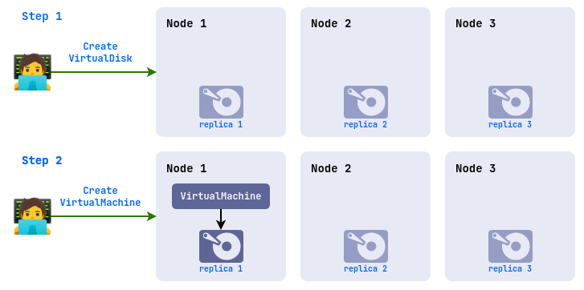
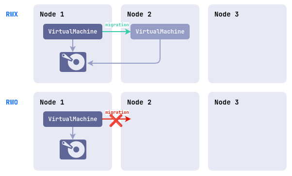
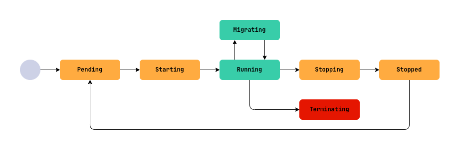
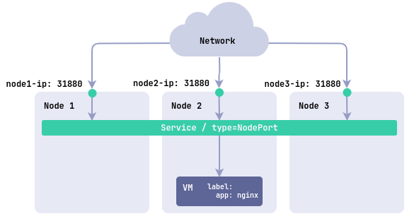
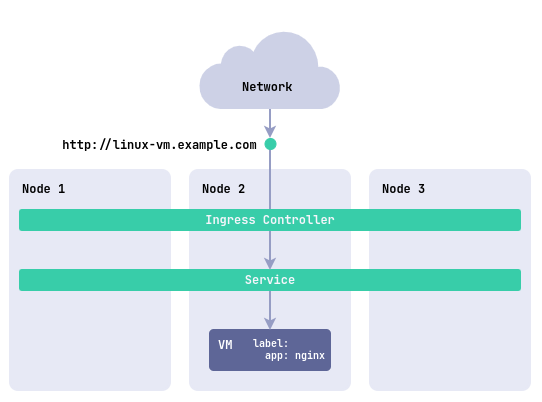
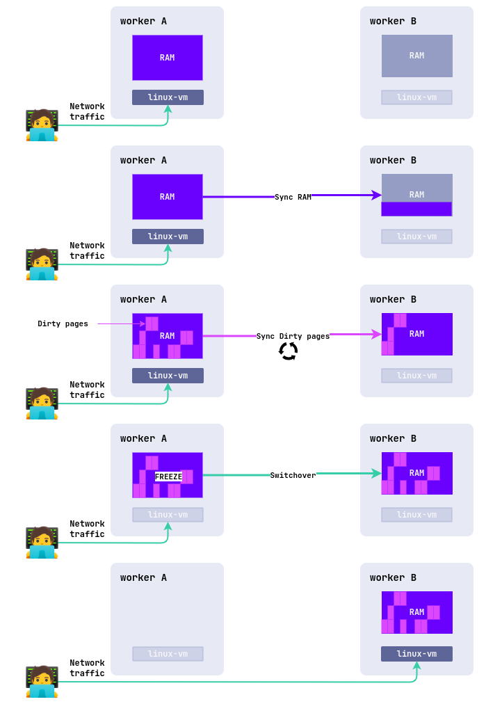

## Introduction

This guide is intended for users of Deckhouse Virtualization Platform and describes how to create and modify resources that are available for creation in projects and cluster namespaces.

## Quick start on creating a VM

Example of creating a virtual machine with Ubuntu 22.04.

1. Create a virtual machine image from an external source:

   ```yaml
   d8 k apply -f - <<EOF
   apiVersion: virtualization.deckhouse.io/v1alpha2
   kind: VirtualImage
   metadata:
     name: ubuntu
   spec:
     storage: ContainerRegistry
     dataSource:
       type: HTTP
       http:
         url: "https://cloud-images.ubuntu.com/minimal/releases/jammy/release/ubuntu-22.04-minimal-cloudimg-amd64.img"
   EOF
   ```

1. Create a virtual machine disk from the image created in the previous step (Caution: Make sure that the default StorageClass is present on the system before creating it):

   ```yaml
   d8 k apply -f - <<EOF
   apiVersion: virtualization.deckhouse.io/v1alpha2
   kind: VirtualDisk
   metadata:
     name: linux-disk
   spec:
     dataSource:
       type: ObjectRef
       objectRef:
         kind: VirtualImage
         name: ubuntu
   EOF
   ```

1. Creating a virtual machine:

   The example uses the cloud-init script to create a cloud user with the cloud password generated as follows:

   ```bash
   mkpasswd --method=SHA-512 --rounds=4096
   ```

   You can change the user name and password in this section:

   ```yaml
   users:
     - name: cloud
       passwd: $6$rounds=4096$G5VKZ1CVH5Ltj4wo$g.O5RgxYz64ScD5Ach5jeHS.Nm/SRys1JayngA269wjs/LrEJJAZXCIkc1010PZqhuOaQlANDVpIoeabvKK4j1
   ```

   Create a virtual machine from the following specification:

   ```yaml
   d8 k apply -f - <<"EOF"
   apiVersion: virtualization.deckhouse.io/v1alpha2
   kind: VirtualMachine
   metadata:
     name: linux-vm
   spec:
     virtualMachineClassName: host
     cpu:
       cores: 1
     memory:
       size: 1Gi
     provisioning:
       type: UserData
       userData: |
         #cloud-config
         ssh_pwauth: True
         users:
         - name: cloud
           passwd: '$6$rounds=4096$saltsalt$fPmUsbjAuA7mnQNTajQM6ClhesyG0.yyQhvahas02ejfMAq1ykBo1RquzS0R6GgdIDlvS.kbUwDablGZKZcTP/'
           shell: /bin/bash
           sudo: ALL=(ALL) NOPASSWD:ALL
           lock_passwd: False
     blockDeviceRefs:
       - kind: VirtualDisk
         name: linux-disk
   EOF
   ```

   Useful links:

   - [cloud-init documentation](https://cloudinit.readthedocs.io/)
   - [Resource Parameters](cr.html)

1. Verify with the command that the image and disk have been created and the virtual machine is running. Resources are not created instantly, so you will need to wait a while before they are ready.

   ```bash
   d8 k get vi,vd,vm
   ```

   Example output:

   ```txt
   # NAME                                                 PHASE   CDROM   PROGRESS   AGE
   # virtualimage.virtualization.deckhouse.io/ubuntu      Ready   false   100%
   #
   # NAME                                                 PHASE   CAPACITY   AGE
   # virtualdisk.virtualization.deckhouse.io/linux-disk   Ready   300Mi      7h40m
   #
   # NAME                                                 PHASE     NODE           IPADDRESS     AGE
   # virtualmachine.virtualization.deckhouse.io/linux-vm  Running   virtlab-pt-2   10.66.10.2    7h46m
   ```

1. Connect to the virtual machine using the console (press `Ctrl+]` to exit the console):

   ```bash
   d8 v console linux-vm
   ```

   Example output:

   ```txt
   # Successfully connected to linux-vm console. The escape sequence is ^]
   #
   # linux-vm login: cloud
   # Password: cloud
   # ...
   # cloud@linux-vm:~$
   ```

1. Use the following commands to delete previously created resources:

   ```bash
   d8 k delete vm linux-vm
   d8 k delete vd linux-disk
   d8 k delete vi ubuntu
   ```

## Images

The `VirtualImage` resource is designed to load virtual machine images and then use them to create virtual machine disks. This resource is available only in the nymspace or project in which it was created.

When connected to a virtual machine, the image is accessed in read-only mode.

The image creation process includes the following steps:

- The user creates a `VirtualImage` resource.
- After creation, the image is automatically loaded from the specified source into the storage (DVCR).
- Once the download is complete, the resource becomes available for disk creation.

There are different types of images:

- **ISO image**: an installation image used for the initial installation of an operating system. Such images are released by OS vendors and are used for installation on physical and virtual servers.
- **Preinstalled disk image**: contains an already installed and configured operating system ready for use after the virtual machine is created. Ready images can be obtained from the distribution developers' resources or created by yourself.

Examples of resources for obtaining virtual machine images:

- Ubuntu
  - [24.04 LTS (Noble Numbat)](https://cloud-images.ubuntu.com/noble/current/)
  - [22.04 LTS (Jammy Jellyfish)](https://cloud-images.ubuntu.com/jammy/current/)
  - [20.04 LTS (Focal Fossa)](https://cloud-images.ubuntu.com/focal/current/)
  - [Minimal images](https://cloud-images.ubuntu.com/minimal/releases/)
- Debian
  - [12 bookworm](https://cdimage.debian.org/images/cloud/bookworm/latest/)
  - [11 bullseye](https://cdimage.debian.org/images/cloud/bullseye/latest/)
- AlmaLinux
  - [9](https://repo.almalinux.org/almalinux/9/cloud/x86_64/images/)
  - [8](https://repo.almalinux.org/almalinux/8/cloud/x86_64/images/)
- RockyLinux
  - [9.5](https://download.rockylinux.org/pub/rocky/9.5/images/x86_64/)
  - [8.10](https://download.rockylinux.org/pub/rocky/8.10/images/x86_64/)
- CentOS
  - [10 Stream](https://cloud.centos.org/centos/10-stream/x86_64/images/)
  - [9 Stream](https://cloud.centos.org/centos/9-stream/x86_64/images/)
  - [8 Stream](https://cloud.centos.org/centos/8-stream/x86_64/)
  - [8](https://cloud.centos.org/centos/8/x86_64/images/)

The following preinstalled image formats are supported:

- qcow2
- raw
- vmdk
- vdi

Image files can also be compressed with one of the following compression algorithms: gz, xz.

Once a share is created, the image type and size are automatically determined, and this information is reflected in the share status.

Images can be downloaded from various sources, such as HTTP servers where image files are located or container registries. It is also possible to download images directly from the command line using the curl utility.

Images can be created from other images and virtual machine disks.

Project image two storage options are supported:

- `ContainerRegistry` - the default type in which the image is stored in `DVCR`.
- `PersistentVolumeClaim` - the type that uses `PVC` as the storage for the image. This option is preferred if you are using storage that supports `PVC` fast cloning, which allows you to create disks from images faster.

A full description of the `VirtualImage` resource configuration settings can be found at [link](cr.html#virtualimage).

### Creating image from HTTP server

Consider creating an image with the option of storing it in DVCR. Execute the following command to create a `VirtualImage`:

```yaml
d8 k apply -f - <<EOF
apiVersion: virtualization.deckhouse.io/v1alpha2
kind: VirtualImage
metadata:
  name: ubuntu-22-04
spec:
  # Save the image to DVCR
  storage: ContainerRegistry
  # The source for the image.
  dataSource:
    type: HTTP
    http:
      url: "https://cloud-images.ubuntu.com/minimal/releases/jammy/release/ubuntu-22.04-minimal-cloudimg-amd64.img"
EOF
```

Check the result of the `VirtualImage` creation:

```bash
d8 k get virtualimage ubuntu-22-04
# or a shorter version
d8 k get vi ubuntu-22-04
```

Example output:

```txt
# NAME           PHASE   CDROM   PROGRESS   AGE
# ubuntu-22-04   Ready   false   100%       23h
```

After creation the `VirtualImage` resource can be in the following states (phases):

- `Pending` - waiting for all dependent resources required for image creation to be ready.
- `WaitForUserUpload` - waiting for the user to upload the image (the phase is present only for `type=Upload`).
- `Provisioning` - the image creation process is in progress.
- `Ready` - the image is created and ready for use.
- `Failed` - an error occurred during the image creation process.
- `Terminating` - the image is being deleted. The image may "hang" in this state if it is still connected to the virtual machine.

As long as the image has not entered the `Ready` phase, the contents of the `.spec` block can be changed. If you change it, the disk creation process will start again. After entering the `Ready` phase, the contents of the `.spec` block cannot be changed!

Diagnosing problems with a resource is done by analyzing the information in the `.status.conditions` block

You can trace the image creation process by adding the `-w` key to the previous command:

```bash
d8 k get vi ubuntu-22-04 -w
```

Example output:

```txt
# NAME           PHASE          CDROM   PROGRESS   AGE
# ubuntu-22-04   Provisioning   false              4s
# ubuntu-22-04   Provisioning   false   0.0%       4s
# ubuntu-22-04   Provisioning   false   28.2%      6s
# ubuntu-22-04   Provisioning   false   66.5%      8s
# ubuntu-22-04   Provisioning   false   100.0%     10s
# ubuntu-22-04   Provisioning   false   100.0%     16s
# ubuntu-22-04   Ready          false   100%       18s
```

The `VirtualImage` resource description provides additional information about the downloaded image:

```bash
d8 k describe vi ubuntu-22-04
```

Now let's look at an example of creating an image and storing it in PVC:

```yaml
d8 k apply -f - <<EOF
apiVersion: virtualization.deckhouse.io/v1alpha2
kind: VirtualImage
metadata:
  name: ubuntu-22-04-pvc
spec:
  storage: PersistentVolumeClaim
  persistentVolumeClaim:
    # Substitute your StorageClass name.
    storageClassName: i-sds-replicated-thin-r2
  # Source for image creation.
  dataSource:
    type: HTTP
    http:
      url: "https://cloud-images.ubuntu.com/minimal/releases/jammy/release/ubuntu-22.04-minimal-cloudimg-amd64.img"
EOF
```

Check the result of the `VirtualImage` creation:

```bash
d8 k get vi ubuntu-22-04-pvc
```

Example output:

```txt
# NAME              PHASE   CDROM   PROGRESS   AGE
# ubuntu-22-04-pvc  Ready   false   100%       23h
```

If the `.spec.persistentVolumeClaim.storageClassName` parameter is not specified, the default `StorageClass` at the cluster level will be used, or for images if specified in [module settings](./ADMIN_GUIDE.md#storage-class-settings-for-images).

### Creating an image from Container Registry

An image stored in Container Registry has a certain format. Let's look at an example:

First, download the image locally:

```bash
curl -L https://cloud-images.ubuntu.com/minimal/releases/jammy/release/ubuntu-22.04-minimal-cloudimg-amd64.img -o ubuntu2204.img
```

Next, create a `Dockerfile` with the following contents:

```Dockerfile
FROM scratch
COPY ubuntu2204.img /disk/ubuntu2204.img
```

Build the image and load it into the container registry. The example below uses docker.io as the container registry. you need to have a service account and a customized environment to run it.

```bash
docker build -t docker.io/<username>/ubuntu2204:latest
```

where `username` is the username specified when registering with docker.io.

Load the created image into the container registry:

```bash
docker push docker.io/<username>/ubuntu2204:latest
```

To use this image, create a resource as an example:

```yaml
d8 k apply -f - <<EOF
apiVersion: virtualization.deckhouse.io/v1alpha2
kind: VirtualImage
metadata:
  name: ubuntu-2204
spec:
  storage: ContainerRegistry
  dataSource:
    type: ContainerImage
    containerImage:
      image: docker.io/<username>/ubuntu2204:latest
EOF
```

### Load an image from the command line

To load an image from the command line, first create the following resource as shown below with the `VirtualImage` example:

```yaml
d8 k apply -f - <<EOF
apiVersion: virtualization.deckhouse.io/v1alpha2
kind: VirtualImage
metadata:
  name: some-image
spec:
  storage: ContainerRegistry
  dataSource:
    type: Upload
EOF
```

Once created, the resource will enter the `WaitForUserUpload` phase, which means it is ready for image upload.

There are two options available for uploading from a cluster node and from an arbitrary node outside the cluster:

```bash
d8 k get vi some-image -o jsonpath="{.status.imageUploadURLs}"  | jq
```

Example output:

```txt
# {
#   "external":"https://virtualization.example.com/upload/g2OuLgRhdAWqlJsCMyNvcdt4o5ERIwmm",
#   "inCluster":"http://10.222.165.239/upload"
# }
```

As an example, download the Cirros image:

```bash
curl -L http://download.cirros-cloud.net/0.5.1/cirros-0.5.1-x86_64-disk.img -o cirros.img
```

Upload the image using the following command:

```bash
curl https://virtualization.example.com/upload/g2OuLgRhdAWqlJsCMyNvcdt4o5ERIwmm --progress-bar -T cirros.img | cat
```

After the upload is complete, the image should be created and enter the `Ready` phase

```bash
d8 k get vi some-image
```

Example output:

```txt
# NAME         PHASE   CDROM   PROGRESS   AGE
# some-image   Ready   false   100%       1m
```

### Creating an image from a disk

It is possible to create an image from [disk](#disks). To do so, one of the following conditions must be met:

- The disk is not attached to any virtual machine.
- The virtual machine to which the disk is attached is in a powered off state.

Example of creating an image from a disk:

```yaml
d8 k apply -f - <<EOF
apiVersion: virtualization.deckhouse.io/v1alpha2
kind: VirtualImage
metadata:
  name: linux-vm-root
spec:
  storage: ContainerRegistry
  dataSource:
    type: ObjectRef
    objectRef:
      kind: VirtualDisk
      name: linux-vm-root
EOF
```

### Creating an image from a disk snapshot

It is possible to create an image from [snapshot](#snapshots). This requires that the disk snapshot is in the ready phase.

Example of creating an image from a disk snapshot:

```yaml
d8 k apply -f - <<EOF
apiVersion: virtualization.deckhouse.io/v1alpha2
kind: VirtualImage
metadata:
  name: linux-vm-root
spec:
  storage: ContainerRegistry
  dataSource:
    type: ObjectRef
    objectRef:
      kind: VirtualDiskSnapshot
      name: linux-vm-root-snapshot
EOF
```

## Disks

Disks in virtual machines are necessary for writing and storing data, ensuring that applications and operating systems can fully function. Under the hood of these disks is the storage provided by the platform (PVC).

Depending on the storage properties, the behavior of disks during creation and virtual machines during operation may differ:

VolumeBindingMode property:

`Immediate` - The disk is created immediately after the resource is created (the disk is assumed to be available for connection to a virtual machine on any node in the cluster).



`WaitForFirstConsumer` - The disk is created only after it is connected to the virtual machine and is created on the node on which the virtual machine will be running.


AccessMode:

- `ReadWriteOnce (RWO)` - only one instance of the virtual machine is granted access to the disk. Live migration of virtual machines with these disks is not possible.
- `ReadWriteMany (RWX)` - multiple disk access. Live migration of virtual machines with such disks is possible.



When creating a disk, the controller will independently determine the most optimal parameters supported by the storage.

Attention: It is impossible to create disks from iso-images!

To find out the available storage options on the platform, run the following command:

```bash
d8 k get storageclass
```

Example output:

```txt
# NAME                                 PROVISIONER                           RECLAIMPOLICY   VOLUMEBINDINGMODE      ALLOWVOLUMEEXPANSION   AGE
# i-sds-replicated-thin-r1 (default)   replicated.csi.storage.deckhouse.io   Delete          Immediate              true                   48d
# i-sds-replicated-thin-r2             replicated.csi.storage.deckhouse.io   Delete          Immediate              true                   48d
# i-sds-replicated-thin-r3             replicated.csi.storage.deckhouse.io   Delete          Immediate              true                   48d
# sds-replicated-thin-r1               replicated.csi.storage.deckhouse.io   Delete          WaitForFirstConsumer   true                   48d
# sds-replicated-thin-r2               replicated.csi.storage.deckhouse.io   Delete          WaitForFirstConsumer   true                   48d
# sds-replicated-thin-r3               replicated.csi.storage.deckhouse.io   Delete          WaitForFirstConsumer   true                   48d
# nfs-4-1-wffc                         nfs.csi.k8s.io                        Delete          WaitForFirstConsumer   true                   30d
```

A full description of the disk configuration settings can be found at [link](cr.html#virtualdisk).

### Create an empty disk

Empty disks are usually used to install an OS on them, or to store some data.

Create a disk:

```yaml
d8 k apply -f - <<EOF
apiVersion: virtualization.deckhouse.io/v1alpha2
kind: VirtualDisk
metadata:
  name: blank-disk
spec:
  # Disk storage parameter settings.
  persistentVolumeClaim:
    # Substitute your StorageClass name.
    storageClassName: i-sds-replicated-thin-r2
    size: 100Mi
EOF
```

After creation, the `VirtualDisk` resource can be in the following states (phases):

- `Pending` - waiting for all dependent resources required for disk creation to be ready.
- `Provisioning` - disk creation process is in progress.
- `Resizing` - the process of resizing the disk is in progress.
- `WaitForFirstConsumer` - the disk is waiting for the virtual machine that will use it to be created.
- `WaitForUserUpload` - the disk is waiting for the user to upload an image (type: Upload).
- `Ready` - the disk has been created and is ready for use.
- `Failed` - an error occurred during the creation process.
- `PVCLost` - system error, PVC with data has been lost.
- `Terminating` - the disk is being deleted. The disk may "hang" in this state if it is still connected to the virtual machine.

As long as the disk has not entered the `Ready` phase, the contents of the entire `.spec` block can be changed. If changes are made, the disk creation process will start over.

If the `.spec.persistentVolumeClaim.storageClassName` parameter is not specified, the default `StorageClass` at the cluster level will be used, or for images if specified in [module settings](./ADMIN_GUIDE.md#storage-class-settings-for-disks).

Diagnosing problems with a resource is done by analyzing the information in the `.status.conditions` block

Check the status of the disk after creation with the command:

```bash
d8 k get vd blank-disk
```

Example output:

```txt
# NAME       PHASE   CAPACITY   AGE
# blank-disk   Ready   100Mi      1m2s
```

### Creating a disk from an image

A disk can also be created and populated with data from previously created `ClusterVirtualImage` and `VirtualImage` images.

When creating a disk, you can specify its desired size, which must be equal to or larger than the size of the extracted image. If no size is specified, a disk will be created with the size corresponding to the original disk image.

Using the example of the previously created image `VirtualImage`, let's consider the command that allows you to determine the size of the unpacked image:

```bash
d8 k get vi ubuntu-22-04 -o wide
```

Example output:

```txt
# NAME           PHASE   CDROM   PROGRESS   STOREDSIZE   UNPACKEDSIZE   REGISTRY URL                                                                       AGE
# ubuntu-22-04   Ready   false   100%       285.9Mi      2.5Gi          dvcr.d8-virtualization.svc/cvi/ubuntu-22-04:eac95605-7e0b-4a32-bb50-cc7284fd89d0   122m
```

The size you are looking for is specified in the **UNPACKEDSIZE** column and is 2.5Gi.

Let's create a disk from this image:

```yaml
d8 k apply -f - <<EOF
apiVersion: virtualization.deckhouse.io/v1alpha2
kind: VirtualDisk
metadata:
  name: linux-vm-root
spec:
  # Disk storage parameter settings.
  persistentVolumeClaim:
    # Specify a size larger than the value of the unpacked image.
    size: 10Gi
    # Substitute your StorageClass name.
    storageClassName: i-sds-replicated-thin-r2
  # The source from which the disk is created.
  dataSource:
    type: ObjectRef
    objectRef:
      kind: VirtualImage
      name: ubuntu-22-04
EOF
```

Now create a disk, without explicitly specifying the size:

```yaml
d8 k apply -f - <<EOF
apiVersion: virtualization.deckhouse.io/v1alpha2
kind: VirtualDisk
metadata:
  name: linux-vm-root-2
spec:
  # Disk storage settings.
  persistentVolumeClaim:
    # Substitute your StorageClass name.
    storageClassName: i-sds-replicated-thin-r2
  # The source from which the disk is created.
  dataSource:
    type: ObjectRef
    objectRef:
      kind: VirtualImage
      name: ubuntu-22-04
EOF
```

Check the status of the disks after creation:

```bash
d8 k get vd
```

Example output:

```txt
# NAME           PHASE   CAPACITY   AGE
# linux-vm-root    Ready   10Gi       7m52s
# linux-vm-root-2  Ready   2590Mi     7m15s
```

### Change disk size

You can increase the size of disks even if they are already attached to a running virtual machine. To do this, edit the `spec.persistentVolumeClaim.size` field:

Check the size before the change:

```bash
d8 k get vd linux-vm-root
```

Example output:

```txt
# NAME          PHASE   CAPACITY   AGE
# linux-vm-root   Ready   10Gi       10m
```

Let's apply the changes:

```bash
d8 k patch vd linux-vm-root --type merge -p '{"spec":{"persistentVolumeClaim":{"size":"11Gi"}}}'
```

Let's check the size after the change:

```bash
d8 k get vd linux-vm-root
```

Example output:

```txt
# NAME          PHASE   CAPACITY   AGE
# linux-vm-root   Ready   11Gi       12m
```

## Virtual Machines

The `VirtualMachine` resource is used to create a virtual machine, its parameters allow you to configure:

- [virtual machine class](ADMIN_GUIDE.md#virtual-machine-classes)
- resources required for virtual machine operation (processor, memory, disks and images);
- rules of virtual machine placement on cluster nodes;
- boot loader settings and optimal parameters for the guest OS;
- virtual machine startup policy and policy for applying changes;
- initial configuration scenarios (cloud-init);
- list of block devices.

The full description of virtual machine configuration parameters can be found at [link](cr.html#virtualmachine)

### Creating a virtual machine

Below is an example of a simple virtual machine configuration running Ubuntu OS 22.04. The example uses the initial virtual machine initialization script (cloud-init), which installs the `qemu-guest-agent` guest agent and the `nginx` service, and creates the `cloud` user with the `cloud` password:

The password in the example was generated using the command `mkpasswd --method=SHA-512 --rounds=4096 -S saltsalt` and you can change it to your own if necessary:

Create a virtual machine with the disk created [previously](#creating-a-disk-from-an-image):

```yaml
d8 k apply -f - <<"EOF"
apiVersion: virtualization.deckhouse.io/v1alpha2
kind: VirtualMachine
metadata:
  name: linux-vm
spec:
  # VM class name.
  virtualMachineClassName: host
  # Block of scripts for the initial initialization of the VM.
  provisioning:
    type: UserData
    # Example cloud-init script to create cloud user with cloud password and install qemu-guest-agent service and nginx service.
    userData: |
      #cloud-config
      package_update: true
      packages:
        - nginx
        - qemu-guest-agent
      run_cmd:
        - systemctl daemon-reload
        - systemctl enable --now nginx.service
        - systemctl enable --now qemu-guest-agent.service
      ssh_pwauth: True
      users:
      - name: cloud
        passwd: '$6$rounds=4096$saltsalt$fPmUsbjAuA7mnQNTajQM6ClhesyG0.yyQhvahas02ejfMAq1ykBo1RquzS0R6GgdIDlvS.kbUwDablGZKZcTP/'
        shell: /bin/bash
        sudo: ALL=(ALL) NOPASSWD:ALL
        lock_passwd: False
      final_message: "The system is finally up, after $UPTIME seconds"
  # VM resource settings.
  cpu:
    # Number of CPU cores.
    cores: 1
    # Request 10% of the CPU time of one physical core.
    coreFraction: 10%
  memory:
    # Amount of RAM.
    size: 1Gi
  # List of disks and images used in the VM.
  blockDeviceRefs:
    # The order of disks and images in this block determines the boot priority.
    - kind: VirtualDisk
      name: linux-vm-root
EOF
```

Check the state of the virtual machine after creation:

```bash
d8 k get vm linux-vm
```

Example output:

```txt
# NAME        PHASE     NODE           IPADDRESS     AGE
# linux-vm   Running   virtlab-pt-2   10.66.10.12   11m
```

After creation, the virtual machine will automatically get an IP address from the range specified in the module settings (`virtualMachineCIDRs` block).

### Virtual Machine Life Cycle

A virtual machine (VM) goes through several phases in its existence, from creation to deletion. These stages are called phases and reflect the current state of the VM. To understand what is happening with the VM, you should check its status (`.status.phase` field), and for more detailed information - `.status.conditions` block. All the main phases of the VM life cycle, their meaning and peculiarities are described below.



- `Pending` - waiting for resources to be ready

    A VM has just been created, restarted or started after a shutdown and is waiting for the necessary resources (disks, images, ip addresses, etc.) to be ready.
    - Possible problems:
      - Dependent resources are not ready: disks, images, VM classes, secret with initial configuration script, etc.
    - Diagnostics: In `.status.conditions` you should pay attention to `*Ready` conditions. By them you can determine what is blocking the transition to the next phase, for example, waiting for disks to be ready (BlockDevicesReady) or VM class (VirtualMachineClassReady).

      ``` bash
      d8 k get vm <vm-name> -o json | jq '.status.conditions[] | select(.type | test(".*Ready"))'
      ```

- `Starting` - starting the virtual machine

    All dependent VM resources are ready and the system is attempting to start the VM on one of the cluster nodes.
    - Possible problems:
      - There is no suitable node to start.
      - There is not enough CPU or memory on suitable nodes.
      - Neumspace or project quotas have been exceeded.
    - Diagnostics:
      - If the startup is delayed, check `.status.conditions`, the `type: Running` condition

      ``` bash
      d8 k get vm <vm-name> -o json | jq '.status.conditions[] | select(.type=="Running")'
      ```

- `Running` - the virtual machine is running

    The VM is successfully started and running.
    - Features:
      - When qemu-guest-agent is installed in the guest system, the `AgentReady` condition will be true and `.status.guestOSInfo` will display information about the running guest OS.
      - The `type: FirmwareUpToDate` condition displays information about the current firmware status of the VM.
      - Condition `type: AwaitingRestartToApplyConfiguration` displays information about the need to manually reboot the VM, as some configuration changes cannot be applied without rebooting the VM.
      - The `type: ConfigurationApplied` condition displays information that the configuration is applied to the running VM.
    - Possible problems:
      - An internal failure in the VM or hypervisor.
    - Diagnosis:
      - Check `.status.conditions`, condition `type: Running`.

      ``` bash
      d8 k get vm <vm-name> -o json | jq '.status.conditions[] | select(.type=="Running")'
      ```

- `Stopping` - The VM is stopped or rebooted.

- `Stopped` - The VM is stopped and is not consuming computational resources

- `Terminating` - the VM is deleted.

    This phase is irreversible. All resources associated with the VM are released, but are not automatically deleted.

- `Migrating` - live migration of a VM

    The VM is migrated to another node in the cluster (live migration).
    - Features:
      - VM migration is supported only for non-local disks, the `type: Migratable` condition displays information about whether the VM can migrate or not.
    - Possible issues:
      - Incompatibility of processor instructions (when using host or host-passthrough processor types).
      - Difference in kernel versions on hypervisor nodes.
      - Not enough CPU or memory on eligible nodes.
      - Neumspace or project quotas have been exceeded.
    - Diagnostics:
      - Check the `.status.conditions` condition `type: Migrating` as well as the `.status.migrationState` block

    ```bash
    d8 k get vm <vm-name> -o json | jq '.status | {condition: .conditions[] | select(.type=="Migrating"), migrationState}'
    ```

The `type: SizingPolicyMatched` condition indicates whether the resource configuration conforms to the sizing policy of the VirtualMachineClass being used. If the policy is violated, it is impossible to save the VM parameters without making the resources conform to the policy.

### Agent Installation

To improve VM management efficiency, it is recommended to install the QEMU Guest Agent, a tool that enables communication between the hypervisor and the operating system inside the VM.

How will the agent help?

- It will provide consistent snapshots of disks and VMs.
- Will provide information about the running OS, which will be reflected in the status of the VM.
  Example:

  ```yaml
  status:
    guestOSInfo:
      id: fedora
      kernelRelease: 6.11.4-301.fc41.x86_64
      kernelVersion: '#1 SMP PREEMPT_DYNAMIC Sun Oct 20 15:02:33 UTC 2024'
      machine: x86_64
      name: Fedora Linux
      prettyName: Fedora Linux 41 (Cloud Edition)
      version: 41 (Cloud Edition)
      versionId: “41”
  ```

- Will allow tracking that the OS has actually booted:
  ```bash
  d8 k get vm -o wide
  ```

  Sample output (`AGENT` column):
  ```console
  NAME     PHASE     CORES   COREFRACTION   MEMORY   NEED RESTART   AGENT   MIGRATABLE   NODE           IPADDRESS    AGE
  fedora   Running   6       5%             8000Mi   False          True    True         virtlab-pt-1   10.66.10.1   5d21h
  ```

How to install QEMU Guest Agent:

For debian-based OS:

```bash
sudo apt install qemu-guest-agent
```

For Centos-based OS:

```bash
sudo yum install qemu-guest-agent
```

Starting the agent service:

```bash
sudo systemctl enable --now qemu-guest-agent
```

### Automatic CPU Topology Configuration

The CPU topology of a virtual machine (VM) determines how the CPU cores are allocated across sockets. This is important to ensure optimal performance and compatibility with applications that may depend on the CPU configuration. In the VM configuration, you specify only the total number of processor cores, and the topology (the number of sockets and cores in each socket) is automatically calculated based on this value.

The number of processor cores is specified in the VM configuration as follows:

```yaml
spec:
  cpu:
    cores: 1
```


Next, the system automatically determines the topology depending on the specified number of cores. The calculation rules depend on the range of the number of cores and are described below.

- If the number of cores is between 1 and 16 (1 ≤ `.spec.cpu.cores` ≤ 16):
  - 1 socket is used.
  - The number of cores in the socket is equal to the specified value.
  - Change step: 1 (you can increase or decrease the number of cores one at a time).
  - Valid values: any integer from 1 to 16 inclusive.
  - Example: If `.spec.cpu.cores` = 8, topology: 1 socket with 8 cores.
- If the number of cores is from 17 to 32 (16 < `.spec.cpu.cores` ≤ 32):
  - 2 sockets are used.
  - Cores are evenly distributed between sockets (the number of cores in each socket is the same).
  - Change step: 2 (total number of cores must be even).
  - Allowed values: 18, 20, 22, 24, 26, 28, 30, 32.
  - Limitations: minimum 9 cores per socket, maximum 16 cores per socket.
  - Example: If `.spec.cpu.cores` = 20, topology: 2 sockets with 10 cores each.
- If the number of cores is between 33 and 64 (32 < `.spec.cpu.cores` ≤ 64):
  - 4 sockets are used.
  - Cores are evenly distributed among the sockets.
  - Step change: 4 (the total number of cores must be a multiple of 4).
  - Allowed values: 36, 40, 44, 48, 52, 56, 60, 64.
  - Limitations: minimum 9 cores per socket, maximum 16 cores per socket.
  - Example: If `.spec.cpu.cores` = 40, topology: 4 sockets with 10 cores each.
- If the number of cores is greater than 64 (`.spec.cpu.cores` > 64):
  - 8 sockets are used.
  - Cores are evenly distributed among the sockets.
  - Step change: 8 (the total number of cores must be a multiple of 8).
  - Valid values: 72, 80, 88, 88, 96, and so on up to 248
  - Limitations: minimum 9 cores per socket.
  - Example: If `.spec.cpu.cores` = 80, topology: 8 sockets with 10 cores each.

The change step indicates by how much the total number of cores can be increased or decreased so that they are evenly distributed across the sockets.

The maximum possible number of cores is 248.

The current VM topology (number of sockets and cores in each socket) is displayed in the VM status in the following format:

```yaml
status:
  resources:
    cpu:
      coreFraction: 10%
      cores: 1
      requestedCores: "1"
      runtimeOverhead: "0"
      topology:
        sockets: 1
        coresPerSocket: 1
```

### Connecting to a virtual machine

The following methods are available for connecting to the virtual machine:

- remote management protocol (such as SSH), which must be preconfigured on the virtual machine.
- serial console
- VNC protocol

An example of connecting to a virtual machine using a serial console:

```bash
d8 v console linux-vm
```

Example output:

```txt
# Successfully connected to linux-vm console. The escape sequence is ^]
#
# linux-vm login: cloud
# Password: cloud
```

Press `Ctrl+]` to finalize the serial console.

Example command for connecting via VNC:

```bash
d8 v vnc linux-vm
```

Example command for connecting via SSH.

```bash
d8 v ssh cloud@linux-vm --local-ssh
```

### Virtual machine startup policy and virtual machine state management

The virtual machine startup policy is intended for automated virtual machine state management. It is defined as the `.spec.runPolicy` parameter in the virtual machine specification. The following policies are supported:

- `AlwaysOnUnlessStoppedManually` - (default) after creation, the VM is always in a running state. In case of failures the VM operation is restored automatically. It is possible to stop the VM only by calling the `d8 v stop` command or creating a corresponding operation.
- `AlwaysOn` - after creation the VM is always in a running state, even in case of its shutdown by OS means. In case of failures the VM operation is restored automatically.
- `Manual` - after creation, the state of the VM is controlled manually by the user using commands or operations.
- `AlwaysOff` - after creation the VM is always in the off state. There is no possibility to turn on the VM through commands/operations.

The state of the virtual machine can be controlled using the following methods:

Creating a `VirtualMachineOperation` (`vmop`) resource.
Using the `d8` utility with the corresponding subcommand.

The `VirtualMachineOperation` resource declaratively defines an imperative action to be performed on the virtual machine. This action is applied to the virtual machine immediately after it is created by the corresponding `vmop`. The action is applied to the virtual machine once.

Example operation to perform a reboot of a virtual machine named `linux-vm`:

```yaml
d8 k create -f - <<EOF
apiVersion: virtualization.deckhouse.io/v1alpha2
kind: VirtualMachineOperation
metadata:
  generateName: restart-linux-vm-
spec:
  virtualMachineName: linux-vm
  type: Restart
EOF
```

You can view the result of the action using the command:

```bash
d8 k get virtualmachineoperation
# or
d8 k get vmop
```

The same action can be performed using the `d8` utility:

```bash
d8 v restart  linux-vm
```

A list of possible operations is given in the table below:

| d8             | vmop type | Action                         |
| -------------- | --------- | ------------------------------ | ------- |
| `d8 v stop`    | `Stop`    | Stop VM                        | Stop VM |
| `d8 v start`   | `Start`   | Start the VM                   |
| `d8 v restart` | `Restart` | Restart the VM                 |         |
| `d8 v evict`   | `Evict`   | Migrate the VM to another host |

### Change virtual machine configuration

You can change the configuration of a virtual machine at any time after the `VirtualMachine` resource has been created. However, how these changes are applied depends on the current phase of the virtual machine and the nature of the changes made.

Changes to the virtual machine configuration can be made using the following command:

```bash
d8 k edit vm linux-vm
```

If the virtual machine is in a shutdown state (`.status.phase: Stopped`), the changes made will take effect immediately after the virtual machine is started.

If the virtual machine is running (`.status.phase: Running`), the way the changes are applied depends on the type of change:

| Configuration block                     | How changes are applied                                 |
| --------------------------------------- | --------------------------------------------------------|
| `.metadata.annotations`                 | Applies immediately                                     |
| `.spec.liveMigrationPolicy`             | Applies immediately                                     |
| `.spec.runPolicy`                       | Applies immediately                                     |
| `.spec.disruptions.restartApprovalMode` | Applies immediately                                     |
| `.spec.affinity`                        | EE, SE+: Applies immediately, CE: Only after VM restart |
| `.spec.nodeSelector`                    | EE, SE+: Applies immediately, CE: Only after VM restart |
| `.spec.*`                               | Only after VM restart                                   |

Let's consider an example of changing the configuration of a virtual machine:

Suppose we want to change the number of processor cores. The virtual machine is currently running and using one core, which can be confirmed by connecting to it through the serial console and executing the `nproc` command.

```bash
d8 v ssh cloud@linux-vm --local-ssh --command "nproc"
```

Example output:

```txt
# 1
```

Apply the following patch to the virtual machine to change the number of cores from 1 to 2.

```bash
d8 k patch vm linux-vm --type merge -p '{"spec":{"cpu":{"cores":2}}}'
```

Example output:

```txt
# virtualmachine.virtualization.deckhouse.io/linux-vm patched
```

Configuration changes have been made but not yet applied to the virtual machine. Check this by re-executing:

```bash
d8 v ssh cloud@linux-vm --local-ssh --command "nproc"
```

Example output:

```txt
# 1
```

A restart of the virtual machine is required to apply this change. Run the following command to see the changes waiting to be applied (requiring a restart):

```bash
d8 k get vm linux-vm -o jsonpath="{.status.restartAwaitingChanges}" | jq .
```

Example output:

```txt
# [
#   {
#     "currentValue": 1,
#     "desiredValue": 2,
#     "operation": "replace",
#     "path": "cpu.cores"
#   }
# ]
```

Run the command:

```bash
d8 k get vm linux-vm -o wide
```

Example output:

```txt
# NAME        PHASE     CORES   COREFRACTION   MEMORY   NEED RESTART   AGENT   MIGRATABLE   NODE           IPADDRESS     AGE
# linux-vm   Running   2       100%           1Gi      True           True    True         virtlab-pt-1   10.66.10.13   5m16s
```

In the `NEED RESTART` column we see the value `True`, which means that a reboot is required to apply the changes.

Let's reboot the virtual machine:

```bash
d8 v restart linux-vm
```

After a reboot, the changes will be applied and the `.status.restartAwaitingChanges` block will be empty.

Execute the command to verify:

```bash
d8 v ssh cloud@linux-vm --local-ssh --command "nproc"
```

Example output:

```txt
# 2
```

The default behavior is to apply changes to the virtual machine through a "manual" restart. If you want to apply the changes immediately and automatically, you need to change the change application policy:

```yaml
spec:
  disruptions:
    restartApprovalMode: Automatic
```

### Initialization scripts

Initialization scripts are intended for the initial configuration of a virtual machine when it is started.

The initial initial initialization scripts supported are:

- [CloudInit](https://cloudinit.readthedocs.io)
- [Sysprep](https://learn.microsoft.com/ru-ru/windows-hardware/manufacture/desktop/sysprep--system-preparation--overview).

The CloudInit script can be embedded directly into the virtual machine specification, but this script is limited to a maximum length of 2048 bytes:

```yaml
spec:
  provisioning:
    type: UserData
    userData: |
      #cloud-config
      package_update: true
      ...
```

For longer scenarios and/or the presence of private data, the script for initial initial initialization of the virtual machine can be created in Secret. An example of Secret with a CloudInit script is shown below:

```yaml
apiVersion: v1
kind: Secret
metadata:
  name: cloud-init-example
data:
  userData: <base64 data>
type: provisioning.virtualization.deckhouse.io/cloud-init
```

A fragment of the virtual machine configuration using the CloudInit initialization script stored in Secret:

```yaml
spec:
  provisioning:
    type: UserDataRef
    userDataRef:
      kind: Secret
      name: cloud-init-example
```

Note: The value of the `.data.userData` field must be Base64 encoded.

To configure Windows virtual machines using Sysprep, only the Secret variant is supported.

An example of Secret with Sysprep script is shown below:

```yaml
apiVersion: v1
kind: Secret
metadata:
  name: sysprep-example
data:
  unattend.xml: <base64 data>
type: provisioning.virtualization.deckhouse.io/sysprep
```

Note: The value of the `.data.unattend.xml` field must be Base64 encoded.

fragment of virtual machine configuration using Sysprep initialization script in Secret:

```yaml
spec:
  provisioning:
    type: SysprepRef
    sysprepRef:
      kind: Secret
      name: sysprep-example
```

### Placement of VMs by nodes

The following approaches can be used to manage the placement of virtual machines across nodes:

- Simple label binding (`nodeSelector`)
- Preferred binding (`Affinity`)
- Avoid co-location (`AntiAffinity`)


Virtual machine placement parameters can be changed in real time (available in Enterprise edition only). However, if the new placement parameters do not match the current placement parameters, the virtual machine will be moved to hosts that meet the new requirements.


#### Simple label binding (nodeSelector)

A `nodeSelector` is the simplest way to control the placement of virtual machines using a set of labels. It allows you to specify on which nodes virtual machines can run by selecting nodes with the desired labels.

```yaml
spec:
  nodeSelector:
    disktype: ssd
```


In this example, the virtual machine will only be placed on hosts that have a `disktype` label with a value of `ssd`.

#### Preferred Binding (Affinity)

`Affinity` provides more flexible and powerful tools than `nodeSelector`. It allows you to specify `preferences` and `obligations` for virtual machine placement. `Affinity` supports two views: `nodeAffinity` and `virtualMachineAndPodAffinity`.

`nodeAffinity` allows you to define on which nodes a virtual machine can run using label expressions, and can be soft (preferred) or hard (required).

Example of using nodeAffinity:

```yaml
spec:
  affinity:
    nodeAffinity:
      requiredDuringSchedulingIgnoredDuringExecution:
        nodeSelectorTerms:
          - matchExpressions:
              - key: disktype
                operator: In
                values:
                  - ssd
```


In this example, the virtual machine will only be placed on hosts that have a `disktype` label with a value of `ssd`.

`virtualMachineAndPodAffinity` controls the placement of virtual machines relative to other virtual machines. It allows you to set a preference for placing virtual machines on the same nodes where certain virtual machines are already running.

Example:

```yaml
spec:
  affinity:
    virtualMachineAndPodAffinity:
      requiredDuringSchedulingIgnoredDuringExecution:
        - weight: 1
          podAffinityTerm:
            labelSelector:
              matchLabels:
                server: database
            topologyKey: "kubernetes.io/hostname"
```


In this example, the virtual machine will be placed, if possible (since preferred is used) only on hosts that have a virtual machine with the server label and database value.

#### Avoid co-location (AntiAffinity)

`AntiAffinity` is the opposite of `Affinity`, which allows you to specify requirements to avoid co-location of virtual machines on the same hosts. This is useful for load balancing or fault tolerance.

The terms `Affinity` and `AntiAffinity` apply only to the relationship between virtual machines. For nodes, the bindings used are called `nodeAffinity`. There is no separate antithesis in `nodeAffinity` as with `virtualMachineAndPodAffinity`, but you can create opposite conditions by specifying negative operators in label expressions: to emphasize the exclusion of certain nodes, you can use `nodeAffinity` with an operator such as `NotIn`.

Example of using `virtualMachineAndPodAntiAffinity`:

```yaml
spec:
  affinity:
    virtualMachineAndPodAntiAffinity:
      requiredDuringSchedulingIgnoredDuringExecution:
        - labelSelector:
            matchLabels:
              server: database
          topologyKey: "kubernetes.io/hostname"
```


In this example, the virtual machine being created will not be placed on the same host as the virtual machine labeled server: database.

### Static and dynamic block devices

Block devices can be divided into two types based on how they are connected: static and dynamic (hotplug).

Block devices and their features are shown in the table below:

| Block device type     | Comment                                                   |
| --------------------- | --------------------------------------------------------- |
| `VirtualImage`        | connected in read-only mode, or as a cdrom for iso images |
| `ClusterVirtualImage` | connected in read-only mode, or as a cdrom for iso images |
| `VirtualDisk`         | connects in read/write mode                               |

#### Static block devices

Static block devices are defined in the virtual machine specification in the `.spec.blockDeviceRefs` block as a list. The order of the devices in this list determines the sequence in which they are loaded. Thus, if a disk or image is specified first, the loader will first try to boot from it. If it fails, the system will go to the next device in the list and try to boot from it. And so on until the first boot loader is detected.

Changing the composition and order of devices in the `.spec.blockDeviceRefs` block is possible only with a reboot of the virtual machine.

VirtualMachine configuration fragment with statically connected disk and project image:

```yaml
spec:
  blockDeviceRefs:
    - kind: VirtualDisk
      name: <virtual-disk-name>
    - kind: VirtualImage
      name: <virtual-image-name>
```

#### Dynamic Block Devices

Dynamic block devices can be connected and disconnected from a virtual machine that is in a running state without having to reboot it.

The `VirtualMachineBlockDeviceAttachment` (`vmbda`) resource is used to connect dynamic block devices.

As an example, create the following share that connects an empty blank-disk disk to a linux-vm virtual machine:

```yaml
d8 k apply -f - <<EOF
apiVersion: virtualization.deckhouse.io/v1alpha2
kind: VirtualMachineBlockDeviceAttachment
metadata:
  name: attach-blank-disk
spec:
  blockDeviceRef:
    kind: VirtualDisk
    name: blank-disk
  virtualMachineName: linux-vm
EOF
```

After creation, `VirtualMachineBlockDeviceAttachment` can be in the following states (phases):

- `Pending` - waiting for all dependent resources to be ready.
- `InProgress` - the process of device connection is in progress.
- `Attached` - the device is connected.

Diagnosing problems with a resource is done by analyzing the information in the `.status.conditions` block

Check the state of your resource::

```bash
d8 k get vmbda attach-blank-disk
```

Example output:

```txt
# NAME              PHASE      VIRTUAL MACHINE NAME   AGE
# attach-blank-disk   Attached   linux-vm              3m7s
```

Connect to the virtual machine and make sure the disk is connected:

```bash
d8 v ssh cloud@linux-vm --local-ssh --command "lsblk"
```

Example output:

```txt
# NAME    MAJ:MIN RM  SIZE RO TYPE MOUNTPOINTS
# sda       8:0    0   10G  0 disk <--- statically mounted linux-vm-root disk
# |-sda1    8:1    0  9.9G  0 part /
# |-sda14   8:14   0    4M  0 part
# `-sda15   8:15   0  106M  0 part /boot/efi
# sdb       8:16   0    1M  0 disk <--- cloudinit
# sdc       8:32   0 95.9M  0 disk <--- dynamically mounted disk blank-disk
```

To detach the disk from the virtual machine, delete the previously created resource:

```bash
d8 k delete vmbda attach-blank-disk
```

### Publishing virtual machines using services

Quite often there is a need to make access to these virtual machines possible from the outside, for example, for publishing services or remote administration. For these purposes, we can use services that provide routing of traffic from the external network to internal cluster resources. Let's consider several options.

Preliminary, put the following labels on the previously created vm:

```bash
d8 k label vm linux-vm app=nginx
```

Example output:

```txt
# virtualmachine.virtualization.deckhouse.io/linux-vm labeled
```

Attaching images is done by analogy. To do this, specify `VirtualImage` or `ClusterVirtualImage` and the image name as `kind`:

```yaml
d8 k apply -f - <<EOF
apiVersion: virtualization.deckhouse.io/v1alpha2
kind: VirtualMachineBlockDeviceAttachment
metadata:
  name: attach-ubuntu-iso
spec:
  blockDeviceRef:
    kind: VirtualImage # or ClusterVirtualImage
    name: ubuntu-iso
  virtualMachineName: linux-vm
EOF
```

#### Publish virtual machine services using a service with the NodePort type

The `NodePort` service opens a specific port on all nodes in the cluster, redirecting traffic to a given internal service port.

Create the following service:

```yaml
d8 k apply -f - <<EOF
apiVersion: v1
kind: Service
metadata:
  name: linux-vm-nginx-nodeport
spec:
  type: NodePort
  selector:
    # label by which the service determines which virtual machine to direct traffic to
    app: nginx
  ports:
    - protocol: TCP
      port: 80
      targetPort: 80
      nodePort: 31880
EOF
```



In this example, a service with the type `NodePort` will be created that opens external port 31880 on all nodes in your cluster. This port will forward incoming traffic to internal port 80 on the virtual machine where the Nginx application is running.

#### Publishing virtual machine services using a service with the LoadBalancer service type

When using the `LoadBalancer` service type, the cluster creates an external load balancer that will distribute incoming traffic to all instances of your virtual machine.

```yaml
d8 k apply -f - <<EOF
apiVersion: v1
kind: Service
metadata:
  name: linux-vm-nginx-lb
spec:
  type: LoadBalancer
  selector:
    # label by which the service determines which virtual machine to direct traffic to
    app: nginx
  ports:
    - protocol: TCP
      port: 80
      targetPort: 80
EOF
```


#### Publish virtual machine services using Ingress

`Ingress` allows you to manage incoming HTTP/HTTPS requests and route them to different servers within your cluster. This is the most appropriate method if you want to use domain names and SSL termination to access your virtual machines.

To publish a virtual machine service through `Ingress`, you must create the following resources:

An internal service to bind to `Ingress`. Example:

```yaml
d8 k apply -f - <<EOF
apiVersion: v1
kind: Service
metadata:
  name: linux-vm-nginx
spec:
  selector:
    # label by which the service determines which virtual machine to direct traffic to
    app: nginx
  ports:
    - protocol: TCP
      port: 80
      targetPort: 80
EOF
```

And an `Ingress` resource for publishing. Example:

```yaml
d8 k apply -f - <<EOF
apiVersion: networking.k8s.io/v1
kind: Ingress
metadata:
  name: linux-vm
spec:
  rules:
    - host: linux-vm.example.com
      http:
        paths:
          - path: /
            pathType: Prefix
            backend:
              service:
                name: linux-vm-nginx
                port:
                  number: 80
EOF
```



### Live Virtual Machine Migration

Live virtual machine (VM) migration is the process of moving a running VM from one physical host to another without shutting it down. This feature plays a key role in the management of virtualized infrastructure, ensuring application continuity during maintenance, load balancing, or upgrades.

#### How live migration works

The live migration process involves several steps:

1. **Creation of a new VM instance**

   A new VM is created on the target host in a suspended state. Its configuration (CPU, disks, network) is copied from the source node.

2. **Primary Memory Transfer**

   The entire RAM of the VM is copied to the target node over the network. This is called primary transfer.

3. **Change Tracking (Dirty Pages)**

    While memory is being transferred, the VM continues to run on the source node and may change some memory pages. These pages are called dirty pages and the hypervisor marks them.

4. **Iterative synchronization**.

   After the initial transfer, only the modified pages are resent. This process is repeated in several cycles:
   - The higher the load on the VM, the more "dirty" pages appear, and the longer the migration takes.
   - With good network bandwidth, the amount of unsynchronized data gradually decreases.

5. **Final synchronization and switching**.

    When the number of dirty pages becomes minimal, the VM on the source node is suspended (typically for 100 milliseconds):
    - The remaining memory changes are transferred to the target node.
    - The state of the CPU, devices, and open connections are synchronized.
    - The VM is started on the new node and the source copy is deleted.




Network speed plays an important role. If bandwidth is low, there are more iterations and VM downtime can increase. In the worst case, the migration may not complete at all.
{

#### AutoConverge mechanism

What to do if the network cannot cope with data transfer and "dirty" pages are becoming more and more numerous? This is where the AutoConverge mechanism comes in. It helps to complete the migration even when network bandwidth is low. Here's how it works:

1. **VM CPU slowdown**.

    The hypervisor gradually reduces the CPU frequency of the source VM. This reduces the rate at which new "dirty" pages appear. The higher the load on the VM, the greater the slowdown.

2. **Synchronization acceleration**.

    Once the data transfer rate exceeds the memory change rate, final synchronization is started and the VM switches to the new node.

3. **Automatic Termination**

    Final synchronization is started when the data transfer rate exceeds the memory change rate.

AutoConverge is a kind of "insurance" that ensures that the migration completes even if the network is not running perfectly. However, CPU slowdown can affect the performance of applications running on the VM, so its use should be monitored.

#### Configuring Migration Policy

Migration behavior can be configured through the `.spec.liveMigrationPolicy` parameter in the VM configuration. The following options are available:

- `AlwaysSafe` - Migration is performed without slowing down the CPU (AutoConverge is not used). Suitable for cases where maximizing VM performance is important but requires high network bandwidth.
- `PreferSafe` - (used as the default policy) By default, migration runs without AutoConverge, but CPU slowdown can be enabled manually if the migration fails to complete. This is done by using the VirtualMachineOperation resource with `type=Evict` and `force=true`.
- `AlwaysForced` - Migration always uses AutoConverge, meaning the CPU is slowed down when necessary. This ensures that the migration completes even if the network is bad, but may degrade VM performance.
- `PreferForced` - By default migration goes with AutoConverge, but slowdown can be manually disabled via VirtualMachineOperation with the parameter `type=Evict` and `force=false`.

#### Migration Types

Migration can be performed manually by the user, or automatically by the following system events:

- Updating the "firmware" of a virtual machine.
- Redistribution of load in the cluster.
- Transferring a node into maintenance mode (Node drain).
- When you change [VM placement settings](#placement-of-vms-by-nodes) (not available in Community edition).

The trigger for live migration is the appearance of the `VirtualMachineOperations` resource with the `Evict` type.

The table shows the `VirtualMachineOperations` resource name prefixes with the `Evict` type that are created for live migrations caused by system events:

| Type of system event | Resource name prefix |
|----------------------------------|------------------------|
| Firmware-update-* | firmware-update-* |
| Load shifting | evacuation-* |
| Drain node | evacuation-* |
| Modify placement parameters | nodeplacement-update-* |

This resource can be in the following states:

- `Pending` - the operation is pending.
- `InProgress` - live migration is in progress.
- `Completed` - live migration of the virtual machine has been completed successfully.
- `Failed` - the live migration of the virtual machine has failed.

Diagnosing problems with a resource is done by analyzing the information in the `.status.conditions` block.

You can view active operations using the command:

```bash
d8 k get vmop
```

Example output:

```txt
# NAME                    PHASE       TYPE    VIRTUALMACHINE      AGE
# firmware-update-fnbk2   Completed   Evict   static-vm-node-00   148m
```

You can interrupt any live migration while it is in the `Pending`, `InProgress` phase by deleting the corresponding `VirtualMachineOperations` resource.

#### How to perform a live migration of a virtual machine using `VirtualMachineOperations`.

Let's look at an example. Before starting the migration, view the current status of the virtual machine:


```bash
d8 k get vm
```

Example output:

```txt
# NAME                                   PHASE     NODE           IPADDRESS     AGE
# linux-vm                              Running   virtlab-pt-1   10.66.10.14   79m
```

We can see that it is currently running on the `virtlab-pt-1` node.

To migrate a virtual machine from one host to another, taking into account the virtual machine placement requirements, the command is used:

```bash
d8 v evict -n <namespace> <vm-name>
```

execution of this command leads to the creation of the `VirtualMachineOperations` resource.

You can also start the migration by creating a `VirtualMachineOperations` (`vmop`) resource with the `Evict` type manually:


```yaml
d8 k create -f - <<EOF
apiVersion: virtualization.deckhouse.io/v1alpha2
kind: VirtualMachineOperation
metadata:
  generateName: evict-linux-vm-
spec:
  # virtual machine name
  virtualMachineName: linux-vm
  # operation to evict
  type: Evict
EOF
```

To track the migration of a virtual machine immediately after the `vmop` resource is created, run the command:

```bash
d8 k get vm -w
```

Example output:

```txt
# NAME                                   PHASE       NODE           IPADDRESS     AGE
# linux-vm                              Running     virtlab-pt-1   10.66.10.14   79m
# linux-vm                              Migrating   virtlab-pt-1   10.66.10.14   79m
# linux-vm                              Migrating   virtlab-pt-1   10.66.10.14   79m
# linux-vm                              Running     virtlab-pt-2   10.66.10.14   79m
```

#### Live migration of virtual machine when changing placement parameters (not available in CE edition)

Let's consider the migration mechanism on the example of a cluster with two node groups (`NodeGroups`): green and blue. Suppose a virtual machine (VM) is initially running on a node in the green group and its configuration contains no placement restrictions.

Step 1: Add the placement parameter
Let's specify in the VM specification the requirement for placement in the green group :

```yaml
spec:
  nodeSelector:
    node.deckhouse.io/group: green
```

After saving the changes, the VM will continue to run on the current node, since the `nodeSelector` condition is already met.

Step 2: Change the placement parameter
Let's change the placement requirement to group blue :

```yaml
spec:
  nodeSelector:
    node.deckhouse.io/group: blue
```

Now the current node (groups green) does not match the new conditions. The system will automatically create a `VirtualMachineOperations` object of type Evict, which will initiate a live migration of the VM to an available node in group blue .


## IP addresses of virtual machines

The `.spec.settings.virtualMachineCIDRs` block in the virtualization module configuration specifies a list of subnets to assign ip addresses to virtual machines (a shared pool of ip addresses). All addresses in these subnets are available for use except the first (network address) and the last (broadcast address).

`VirtualMachineIPAddressLease` (`vmipl`) resource: A cluster resource that manages IP address leases from the shared pool specified in `virtualMachineCIDRs`.

To see a list of IP address leases (`vmipl`), use the command:

```bash
d8 k get vmipl
```

Example output:

```txt
# NAME             VIRTUALMACHINEIPADDRESS                              STATUS   AGE
# ip-10-66-10-14   {"name":"linux-vm-7prpx","namespace":"default"}     Bound    12h
```

`VirtualMachineIPAddress` (`vmip`) resource: A project/namespace resource that is responsible for reserving leased IP addresses and binding them to virtual machines. IP addresses can be allocated automatically or by explicit request.

To see a list of `vmip`, use the command:

```bash
d8 k get vmipl
```

Example output:

```txt
# NAME             VIRTUALMACHINEIPADDRESS                              STATUS   AGE
# ip-10-66-10-14   {"name":"linux-vm-7prpx","namespace":"default"}     Bound    12h
```

By default, an ip address is automatically assigned to a virtual machine from the subnets defined in the module and is assigned to it until it is deleted. You can check the assigned ip address using the command:

```bash
k get vmip
```

Example output:

```txt
# NAME              ADDRESS       STATUS     VM          AGE
# linux-vm-7prpx   10.66.10.14   Attached   linux-vm   12h
```

The algorithm for automatically assigning an ip address to a virtual machine is as follows:

- The user creates a virtual machine named `<vmname>`.
- The module controller automatically creates a `vmip` resource named `<vmname>-<hash>` to request an IP address and associate it with the virtual machine.
- To do this, `vmip` creates a `vmipl` lease resource that selects a random IP address from a shared pool.
- Once the `vmip` resource is created, the virtual machine receives the assigned IP address.

The virtual machine's IP address is assigned automatically from the subnets defined in the module and remains assigned to the machine until it is deleted. After the virtual machine is deleted, the `vmip` resource is also deleted, but the IP address remains temporarily assigned to the project/namespace and can be re-requested explicitly.

The full description of `vmip` and `vmipl` machine resource configuration parameters can be found at the links:

- [`VirtualMachineIPAddress`](cr.html#virtualmachineipaddress)
- [`VirtualMachineIPAddressLease`](cr.html#virtualmachineipaddresslease)

### How to request a required ip address?

Task: request a specific ip address from the `virtualMachineCIDRs` subnets.

Create a `vmip` resource:

```yaml
d8 k apply -f - <<EOF
apiVersion: virtualization.deckhouse.io/v1alpha2
kind: VirtualMachineIPAddress
metadata:
  name: linux-vm-custom-ip
spec:
  staticIP: 10.66.20.77
  type: Static
EOF
```

Create a new or modify an existing virtual machine and specify the required `vmip` resource explicitly in the specification:

```yaml
spec:
  virtualMachineIPAddressName: linux-vm-custom-ip
```

### How to save the ip address assigned to the virtual machine?

Objective: to save the ip address issued to a virtual machine for reuse after the virtual machine is deleted.

To ensure that the automatically assigned ip address of a virtual machine is not deleted along with the virtual machine itself, perform the following steps.

Obtain the `vmip` resource name for the specified virtual machine:

```bash
d8 k get vm linux-vm -o jsonpath="{.status.virtualMachineIPAddressName}"

# linux-vm-7prpx
```

Remove the `.metadata.ownerReferences` blocks from the resource found:

```bash
d8 k patch vmip linux-vm-7prpx --type=merge --patch '{"metadata":{"ownerReferences":null}}'
```

After the virtual machine is deleted, the `vmip` resource is preserved and can be reused again in the newly created virtual machine:

```yaml
spec:
  virtualMachineIPAddressName: linux-vm-7prpx
```

Even if the `vmip` resource is deleted. It remains rented for the current project/namespace for another 10 minutes. Therefore, it is possible to reoccupy it on request:

```yaml
d8 k apply -f - <<EOF
apiVersion: virtualization.deckhouse.io/v1alpha2
kind: VirtualMachineIPAddress
metadata:
  name: linux-vm-custom-ip
spec:
  staticIP: 10.66.20.77
  type: Static
EOF
```

## Snapshots

Snapshots are designed to save the state of a resource at a particular point in time. Disk snapshots and virtual machine snapshots are currently supported.

### Creating snapshots from disks

The `VirtualDiskSnapshot` resource is used to create disk snapshots. It can be used as data sources for creating new virtual disks.

To guarantee data integrity and consistency, a disk snapshot can be created in the following cases:

- the virtual disk is not attached to any virtual machine;
- the virtual disk is attached to a virtual machine that is powered off;
- the virtual disk is connected to a running virtual machine, an agent (`qemu-guest-agent`) is installed in the virtual machine OS, the operation to "freeze" the file system was successful.

If integrity and consistency is not important, the snapshot can be performed on a running virtual machine without "freezing" the file system, for this purpose in the specification of the resource `VirtualDiskSnapshot` add:

```yaml
spec:
  requiredConsistency: false
```

When creating a snapshot, you must specify the names of the `VolumeSnapshotClasses` volume snapshot class that will be used to create the snapshot.

To get a list of supported `VolumeSnapshotClasses` resources, run the command:

```bash
d8 k get volumesnapshotclasses
```

Example output:

```txt
# NAME                     DRIVER                                DELETIONPOLICY   AGE
# csi-nfs-snapshot-class   nfs.csi.k8s.io                        Delete           34d
# sds-replicated-volume    replicated.csi.storage.deckhouse.io   Delete           39d
```

An example manifest for creating a disk snapshot:

```yaml
d8 k apply -f - <<EOF
apiVersion: virtualization.deckhouse.io/v1alpha2
kind: VirtualDiskSnapshot
metadata:
  name: linux-vm-root-$(date +%s)
spec:
  requiredConsistency: true
  virtualDiskName: linux-vm-root
  volumeSnapshotClassName: sds-replicated-volume
EOF
```

To view a list of disk snapshots, run the following command:

```bash
d k get vdsnapshot
```

Example output:

```txt
# NAME                     PHASE     CONSISTENT   AGE
# linux-vm-root-1728027905   Ready                  3m2s
```

After creation, `VirtualDiskSnapshot` can be in the following states (phases):

- `Pending` - waiting for all dependent resources required for snapshot creation to be ready.
- `InProgress` - the process of creating a virtual disk snapshot is in progress.
- `Ready` - snapshot creation has been successfully completed and the virtual disk snapshot is available for use.
- `Failed` - an error occurred during the virtual disk snapshot creation process.
- `Terminating` - the resource is in the process of being deleted.

Diagnosing problems with a resource is done by analyzing the information in the `.status.conditions` block.

A full description of the `VirtualDiskSnapshot` resource configuration parameters for machines can be found at [link](cr.html#virtualdisksnapshot)

### Recovering disks from snapshots

In order to restore a disk from a previously created disk snapshot, you must specify a corresponding object as `dataSource`:

```yaml
d8 k apply -f - <<EOF
apiVersion: virtualization.deckhouse.io/v1alpha2
kind: VirtualDisk
metadata:
  name: linux-vm-root
spec:
  persistentVolumeClaim:
    size: 10Gi
    # Substitute your StorageClass name.
    storageClassName: i-sds-replicated-thin-r2
  dataSource:
    type: ObjectRef
    objectRef:
      kind: VirtualDiskSnapshot
      name: linux-vm-root-1728027905
EOF
```

### Creating snapshots of virtual machines

The `VirtualMachineSnapshot` resource is used to create virtual machine snapshots.


A snapshot contains the configuration of the virtual machine and snapshots of all its disks.

Restoring a snapshot assumes that the virtual machine is fully restored to the time when the snapshot was created.
{

To ensure data integrity and consistency, a virtual machine snapshot will be created if at least one of the following conditions is met:

- the virtual machine is powered off;
- an agent (qemu-guest-agent) is installed in the virtual machine's operating system, and the operation to freeze the file system was successful.

If integrity and consistency are not important, a snapshot can be created on a running virtual machine without "freezing" the file system. To do this, specify in the `VirtualMachineSnapshot` resource specification:

```yaml
spec:
  requiredConsistency: false
```

When creating a snapshot, you must specify the names of the `VolumeSnapshotClasses` volume snapshot classes that will be used to create snapshots of the disks attached to the virtual machine.

To get a list of supported `VolumeSnapshotClasses` resources, run the command:

```bash
d8 k get volumesnapshotclasses
```

Example output:

```txt
# NAME                     DRIVER                                DELETIONPOLICY   AGE
# csi-nfs-snapshot-class   nfs.csi.k8s.io                        Delete           34d
# sds-replicated-volume    replicated.csi.storage.deckhouse.io   Delete           39d
```

Creating a virtual machine snapshot will fail if at least one of the following conditions is met:

- not all dependencies of the virtual machine are ready;
- there are changes pending restart of the virtual machine;
- there is a disk in the process of resizing among the dependent devices.

When you create a snapshot of the virtual machine, the IP address will be converted to a static IP address and will be used later when restoring the virtual machine from the snapshot.

If you do not want to convert and use the old IP address of the virtual machine, you can set the corresponding policy to `Never`. In this case, the address type without conversion (`Auto` or `Static`) will be used.

```yaml
spec:
  keepIPAddress: Never
```

An example manifest to create a snapshot of a virtual machine:

```yaml
d8 k apply -f - <<EOF
apiVersion: virtualization.deckhouse.io/v1alpha2
kind: VirtualMachineSnapshot
metadata:
  name: linux-vm-snapshot
spec:
  virtualMachineName: linux-vm
  volumeSnapshotClasses:
    - # Substitute your StorageClass name.: i-sds-replicated-thin-r2 # Substitute your StorageClass name.
      volumeSnapshotClassName: sds-replicated-volume # Substitute your VolumeSnapshotClass name.
  requiredConsistency: true
  keepIPAddress: Never
EOF
```

### Restore virtual machines from snapshots

The `VirtualMachineRestore` resource is used to restore a virtual machine from snapshots.

The following resources will be created in the cluster during the restore process:
- VirtualMachine
- VirtualDisk (if they were connected to the VM at the moment of creation)
- VirtualBlockDeviceAttachment (if they existed at the moment of creation)
- Secret with cloud-init/sysprep configuration (if they were connected to the VM at the time of creation)


To restore a virtual machine with the same name, it is necessary to delete the previous configuration of the VM and all its disks, because restoration implies restoring the configuration of the VM and all its disks at the moment of snapshot creation.



If there is a name conflict between existing and restored resources for `VirtualMachine`, `VirtualDisk`, or `VirtualMachineBlockDeviceAttachment`, the restore will fail. To avoid this, use the `nameReplacements` parameter.

If the `VirtualMachineIPAddress` resource to be recovered is already present in the cluster, it must not be attached to another virtual machine, and if it is a resource of type Static, its IP address must match. The recovered secret with automation must also fully match the recovered secret. Failure to meet these conditions will cause the recovery to fail.

Example manifest for restoring a virtual machine from a snapshot:

```yaml
d8 k apply -f - <<EOF
apiVersion: virtualization.deckhouse.io/v1alpha2
kind: VirtualMachineRestore
metadata:
  name: linux-vm-restore
spec:
  virtualMachineSnapshotName: linux-vm-snapshot
  nameReplacements:
    - from:
        kind: VirtualMachine
        name: linux-vm
      to: linux-vm-2 # recreate an existing `linux-vm` virtual machine with the new name `linux-vm-2`.
    - from:
        kind: VirtualDisk
        name: linux-vm-root
      to: linux-vm-root-2 # recreate the existing `linux-vm-root` virtual disk with the new name `linux-vm-root-2`.
    - from:
        kind: VirtualDisk
        name: blank-disk
      to: blank-disk-2 # recreate the existing `blank-disk` virtual disk with the new name `blank-disk-2`.
    - from:
        kind: VirtualMachineBlockDeviceAttachment
        name: attach-blank-disk
      to: attach-blank-disk-2 # recreate the existing `attach-blank-disk` virtual disk with the new name `attach-blank-disk-2`.
EOF
```
