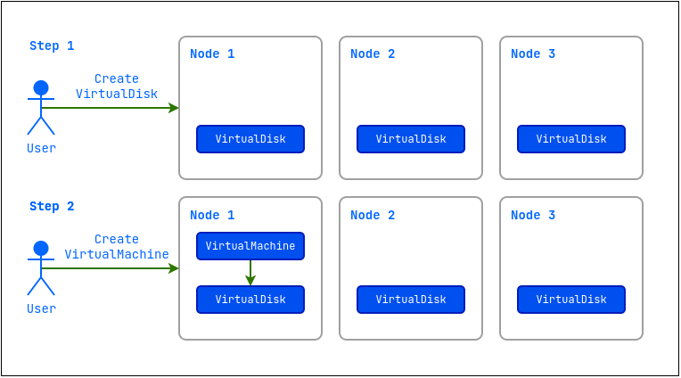
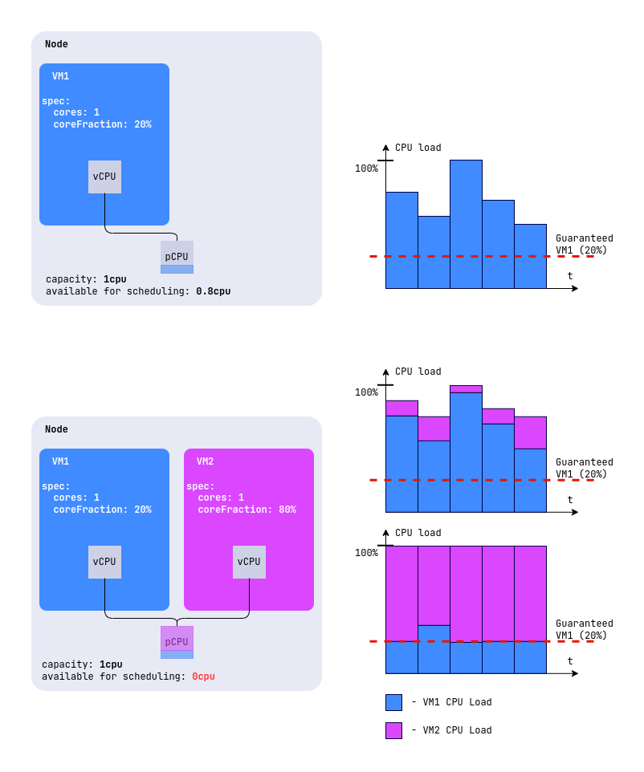
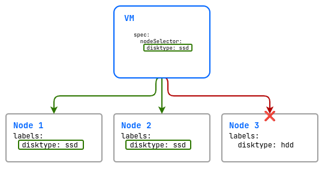
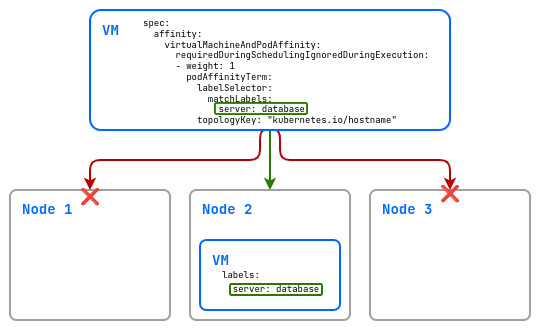
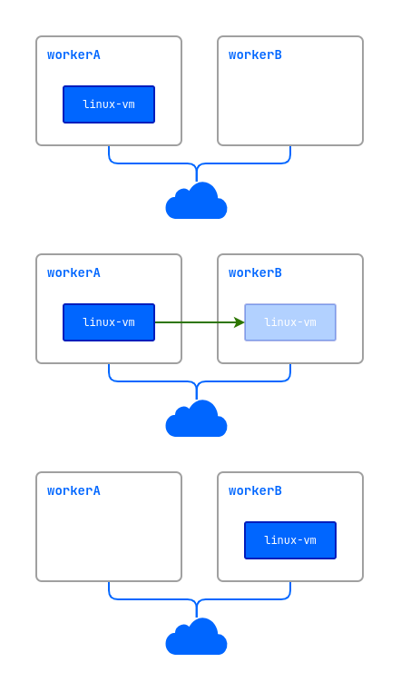
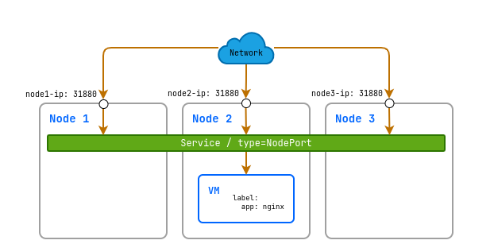
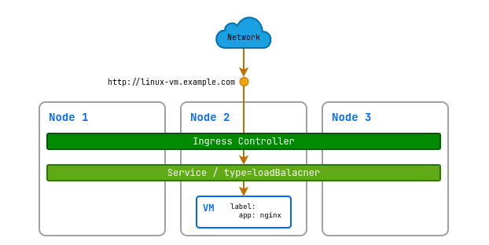

Руководство описывает, как создавать и изменять ресурсы модуля `virtualization` в проекте или неймспейсе кластера.

## Быстрый старт по созданию виртуальной машины

В разделе показан минимальный сценарий, в котором вы создаёте образ Ubuntu 24.04, диск из этого образа и виртуальную машину (ВМ), подключаетесь к ней по консоли, а затем удаляете созданные ресурсы.



{}

1. Создайте образ [VirtualImage](cr.html#virtualimage) из внешнего источника:

   ```bash
   d8 k apply -f - <<EOF
   apiVersion: virtualization.deckhouse.io/v1alpha2
   kind: VirtualImage
   metadata:
     name: ubuntu
   spec:
     storage: ContainerRegistry
     dataSource:
       type: HTTP
       http:
         url: https://cloud-images.ubuntu.com/noble/current/noble-server-cloudimg-amd64.img
   EOF
   ```

1. Создайте диск [VirtualDisk](cr.html#virtualdisk) из этого образа. Убедитесь, что в кластере задан StorageClass по умолчанию, и примените манифест:

   ```bash
   d8 k apply -f - <<EOF
   apiVersion: virtualization.deckhouse.io/v1alpha2
   kind: VirtualDisk
   metadata:
     name: linux-disk
   spec:
     dataSource:
       type: ObjectRef
       objectRef:
         kind: VirtualImage
         name: ubuntu
   EOF
   ```

1. Создайте виртуальную машину [VirtualMachine](cr.html#virtualmachine). В примере используется сценарий cloud-init, который создаёт пользователя `cloud`:

   ```bash
   d8 k apply -f - <<EOF
   apiVersion: virtualization.deckhouse.io/v1alpha2
   kind: VirtualMachine
   metadata:
     name: linux-vm
   spec:
     virtualMachineClassName: generic
     cpu:
       cores: 1
     memory:
       size: 1Gi
     provisioning:
       type: UserData
       userData: |
         #cloud-config
         ssh_pwauth: True
         users:
           - name: cloud
             passwd: <PASSWORD_HASH>
             shell: /bin/bash
             sudo: ALL=(ALL) NOPASSWD:ALL
             lock_passwd: False
     blockDeviceRefs:
       - kind: VirtualDisk
         name: linux-disk
   EOF
   ```

   Здесь `<PASSWORD_HASH>` — хеш пароля пользователя в кавычках. Получите его командой `mkpasswd --method=SHA-512 --rounds=4096`, она запросит пароль и выведет готовое значение. Формат сценария описан в [документации cloud-init](https://cloudinit.readthedocs.io/).

1. Проверьте, что образ и диск созданы, а ВМ запущена. Ресурсы переходят в готовое состояние не мгновенно, поэтому дождитесь нужных значений в колонке `PHASE`:

   ```bash
   d8 k get vi,vd,vm
   ```

   Пример вывода:

   ```console {.nowrap-default}
   NAME                                                 PHASE   CDROM   PROGRESS   AGE
   virtualimage.virtualization.deckhouse.io/ubuntu      Ready   false   100%       7h50m

   NAME                                                 PHASE   CAPACITY   VIRTUALMACHINE   AGE
   virtualdisk.virtualization.deckhouse.io/linux-disk   Ready   4Gi        linux-vm         7h40m

   NAME                                                 PHASE     UPTIME   NODE           IPADDRESS    AGE
   virtualmachine.virtualization.deckhouse.io/linux-vm  Running   7h30m    virtlab-pt-2   10.66.10.2   7h46m
   ```

1. Подключитесь к ВМ по консоли:

   ```bash
   d8 v console linux-vm
   ```

   Пример вывода:

   ```console {.nowrap-default}
   Successfully connected to linux-vm console. The escape sequence is ^]

   linux-vm login: cloud
   Password:
   ...
   cloud@linux-vm:~$
   ```

   Чтобы выйти из консоли, нажмите `Ctrl+]`.

1. Удалите созданные ресурсы:

   ```bash
   d8 k delete vm linux-vm
   d8 k delete vd linux-disk
   d8 k delete vi ubuntu
   ```

{}

{}

1. Создайте образ из внешнего источника:

   1. Перейдите на вкладку «Проекты» и выберите нужный проект.
   1. Перейдите в раздел «Виртуализация» → «Образы».
   1. Нажмите кнопку «Создать».
   1. В блоке «Источник» выберите «По ссылке».
   1. В открывшейся форме в поле «Имя образа» введите `ubuntu`.
   1. В блоке «Хранилище» в поле «Тип хранилища» выберите `ContainerRegistry`.
   1. В поле «URL» вставьте `https://cloud-images.ubuntu.com/noble/current/noble-server-cloudimg-amd64.img`.
   1. Нажмите кнопку «Создать».
   1. Проверьте статус образа на его странице.

1. Создайте диск из этого образа. Шаг можно пропустить и создать диск сразу при создании ВМ.

   1. Перейдите в раздел «Виртуализация» → «Диски».
   1. Нажмите кнопку «Создать».
   1. В открывшейся форме в поле «Имя диска» введите `linux-disk`.
   1. В поле «Источник» из выпадающего списка выберите образ `ubuntu`.
   1. При необходимости в поле «Размер» укажите больший размер, например `5Gi`.
   1. В поле «Класс хранения» выберите StorageClass или оставьте вариант по умолчанию.
   1. Нажмите кнопку «Создать».
   1. Проверьте статус диска на его странице.

   > Если у выбранного StorageClass задан режим `WaitForFirstConsumer`, диск ожидает создания ВМ, которая его использует.
   > До этого момента диск отображается со статусом «СОЗДАНИЕ 0%», но его уже можно выбрать при создании ВМ.

1. Создайте виртуальную машину:

   1. Перейдите в раздел «Виртуализация» → «Виртуальные машины».
   1. Нажмите кнопку «Создать».
   1. В открывшейся форме в поле «Имя» введите `linux-vm`.
   1. В разделах «Платформа» и «Ресурсы» оставьте настройки по умолчанию.
   1. В разделе «Диски» нажмите кнопку «Добавить».

      Если диск уже создан, в открывшемся окне «Диски / Образы» выберите «Существующий» и укажите в списке диск `linux-disk`.

      Если диск не создан, в том же окне выберите «Создать из» и задайте параметры:

      - в поле «Название» введите `linux-disk`;
      - в поле «Источник» из выпадающего списка выберите образ `ubuntu`, в списке указан тип ресурса;
      - при необходимости в поле «Размер» укажите больший размер, например `5Gi`;
      - в поле «Хранилище» выберите StorageClass или оставьте вариант по умолчанию.

      Нажмите кнопку «Добавить».

   1. Прокрутите страницу вниз до переключателя «Cloud-init» и включите его.
   1. В появившееся поле вставьте сценарий, подставив вместо `<PASSWORD_HASH>` хеш пароля в кавычках, полученный командой `mkpasswd --method=SHA-512 --rounds=4096`:

      ```yaml
      #cloud-config
      ssh_pwauth: True
      users:
        - name: cloud
          passwd: <PASSWORD_HASH>
          shell: /bin/bash
          sudo: ALL=(ALL) NOPASSWD:ALL
          lock_passwd: False
      ```

   1. Нажмите кнопку «Создать».
   1. Проверьте статус ВМ на её странице.

1. Подключитесь к ВМ по консоли:

   1. Перейдите в раздел «Виртуализация» → «Виртуальные машины».
   1. Из списка выберите нужную ВМ и нажмите на её имя.
   1. В открывшейся форме перейдите на вкладку «TTY» и войдите в систему в окне консоли.

1. Удалите созданные ресурсы:

   1. Перейдите в раздел «Виртуализация» и выберите нужный подраздел, например «Виртуальные машины», «Диски» или «Образы».
   1. В строке ресурса нажмите кнопку с многоточием и выберите «Удалить». В некоторых списках, например в списке снимков ВМ, удаление вынесено отдельной кнопкой.
   1. В окне подтверждения нажмите кнопку «Удалить» либо откажитесь от действия кнопкой «Не удалять».

   > **Важно:** Удаление ресурса необратимо. Диск, подключённый к запущенной виртуальной машине, удалить нельзя, для него пункт «Удалить» неактивен.

{}



## Образы

Образ хранит содержимое диска, из которого вы создаёте диски виртуальных машин. Образ [VirtualImage](cr.html#virtualimage) создаётся в проекте и доступен только в том проекте или неймспейсе, где он создан.


Чтобы один и тот же образ был доступен всем проектам кластера, нужен кластерный образ [ClusterVirtualImage](cr.html#clustervirtualimage). Создать его может администратор, порядок описан в [руководстве администратора](admin_guide.html#образы).


Виртуальная машина получает доступ к подключённому образу в режиме «только чтение».

Образ появляется в проекте в три шага:

1. Вы создаёте ресурс [VirtualImage](cr.html#virtualimage) и указываете в нём источник данных.
1. Модуль загружает образ из этого источника в хранилище, которым в зависимости от выбранного типа выступает DVCR или PVC.
1. Загруженный образ становится доступен для создания дисков.

### Источники и варианты хранения

Источником образа может быть HTTP-сервер с файлом образа, хранилище образов контейнеров или файл на вашем компьютере, который вы загружаете из командной строки. Кроме того, образ можно создать из другого образа, из диска виртуальной машины или из снимка диска.

Виды образов, поддерживаемые форматы файлов и алгоритмы сжатия описаны в разделе [«Типы и форматы образов»](admin_guide.html#типы-и-форматы-образов) руководства администратора.

Загруженный образ хранится одним из двух способов, который задаёт параметр [`.spec.storage`](cr.html#virtualimage-v1alpha2-spec-storage):

- `ContainerRegistry` — вариант по умолчанию, образ хранится в DVCR.
- `PersistentVolumeClaim` — образ хранится в PVC. Этот вариант предпочтителен, если хранилище умеет быстро клонировать PVC, потому что диски из такого образа создаются быстрее.


Образ, сохранённый с параметром `storage: PersistentVolumeClaim`, годится для создания дисков только в том же классе хранения (StorageClass).


Ход создания образа показывает колонка `PHASE` в выводе `d8 k get vi`, её значения описаны в поле [`.status.phase`](cr.html#virtualimage-v1alpha2-status-phase). Следить за созданием в реальном времени помогает ключ `-w`, а если образ надолго остаётся не готов, причину подскажет блок [`.status.conditions`](cr.html#virtualimage-v1alpha2-status-conditions) и команда `d8 k describe vi`.

Пока образ не перешёл в фазу `Ready`, блок `.spec` можно менять, и после изменения загрузка начнётся заново. У готового образа блок `.spec` изменить уже нельзя. Все параметры образа описаны в [VirtualImage](cr.html#virtualimage).

### Создание образа с HTTP-сервера

Проще всего создать образ, указав ссылку на файл, который лежит на HTTP-сервере.



{}

1. Создайте ресурс [VirtualImage](cr.html#virtualimage). В примере образ сохраняется в DVCR:

   ```bash
   d8 k apply -f - <<EOF
   apiVersion: virtualization.deckhouse.io/v1alpha2
   kind: VirtualImage
   metadata:
     name: ubuntu-24-04
   spec:
     # Сохраняем образ в DVCR.
     storage: ContainerRegistry
     # Источник для создания образа.
     dataSource:
       type: HTTP
       http:
         url: https://cloud-images.ubuntu.com/noble/current/noble-server-cloudimg-amd64.img
   EOF
   ```

1. Проверьте, что образ создан:

   ```bash
   d8 k get virtualimage ubuntu-24-04

   # Короткий вариант команды.
   d8 k get vi ubuntu-24-04
   ```

   Пример вывода:

   ```console
   NAME           PHASE   CDROM   PROGRESS   AGE
   ubuntu-24-04   Ready   false   100%       23h
   ```

{}

{}

1. Перейдите на вкладку «Проекты» и выберите нужный проект.
1. Перейдите в раздел «Виртуализация» → «Образы».
1. Нажмите кнопку «Создать».
1. В блоке «Источник» выберите «По ссылке».
1. В открывшейся форме в поле «Имя образа» введите имя образа.
1. В блоке «Хранилище» в поле «Тип хранилища» выберите `ContainerRegistry`.
1. В поле «URL» укажите ссылку на образ.
1. Нажмите кнопку «Создать».
1. Проверьте статус образа на его странице.

{}



#### Проверка целостности загруженного образа

Блок [`checksum`](cr.html#virtualimage-v1alpha2-spec-datasource-http-checksum) заставляет модуль проверить то, что он скачал с HTTP-сервера. Образ перейдёт в фазу `Ready`, только если загруженный файл совпал со всеми указанными контрольными суммами, иначе ресурс окажется в фазе `Failed`:

```bash
d8 k apply -f - <<EOF
apiVersion: virtualization.deckhouse.io/v1alpha2
kind: VirtualImage
metadata:
  name: ubuntu-24-04
spec:
  storage: ContainerRegistry
  dataSource:
    type: HTTP
    http:
      url: https://cloud-images.ubuntu.com/noble/current/noble-server-cloudimg-amd64.img
      checksum:
        sha256: 78be890d71dde316c412da2ce8332ba47b9ce7a29d573801d2777e01aa20b9b5
EOF
```

Возьмите контрольную сумму у зеркала, которое публикует образ, и укажите её в поле соответствующего алгоритма:

| Поле          | Алгоритм                               | Скорость проверки |
| ------------- | -------------------------------------- | ----------------- |
| `sha1`        | SHA-1                                  | ~1,6 ГБ/с         |
| `sha256`      | SHA-256                                | ~1,5 ГБ/с         |
| `md5`         | MD5                                    | ~700 МБ/с         |
| `sha512`      | SHA-512                                | ~570 МБ/с         |
| `streebog256` | ГОСТ Р 34.11-2012 («Стрибог»), 256 бит | ~17 МБ/с          |
| `streebog512` | ГОСТ Р 34.11-2012 («Стрибог»), 512 бит | ~17 МБ/с          |

Скорости даны как порядок величины, а не как обещание. Они измерены на процессоре x86-64 с набором инструкций SHA, а процессор без него считает SHA-1 и SHA-256 в несколько раз медленнее. На любом процессоре сохраняется другое, а именно расстояние между строками. SHA-1 и SHA-256 вычисляются отдельными инструкциями, MD5 и SHA-512 написанным вручную ассемблером, и все четыре хешируют данные быстрее, чем те приходят по сети, поэтому их стоимость остаётся незаметной на фоне самой загрузки.

Алгоритмы «Стрибог» аппаратной поддержки не имеют нигде и медленнее примерно на два порядка. Для образа в 10 ГиБ это около десяти минут одного только хеширования, и создание образа упирается уже в процессор, а не в сеть. Указывайте их только тогда, когда контрольная сумма по ГОСТ действительно требуется. Обе длины стоят одинаково, потому что ГОСТ Р 34.11-2012 использует одну и ту же функцию сжатия и для 256, и для 512 бит, а короткий вариант отличается только начальным значением.

Контрольные суммы считаются за один проход по загружаемым данным, поэтому указание нескольких сумм сразу стоит суммы их времён. Незаполненные поля не стоят ничего.

Тот же блок доступен для источника `Upload` в параметре [`dataSource.upload.checksum`](cr.html#virtualimage-v1alpha2-spec-datasource-upload-checksum) и работает так же. Загружаемые данные проверяются по всем указанным контрольным суммам, а при несовпадении ресурс остаётся в фазе `Failed`.

#### Хранение образа в PVC

Чтобы диски создавались из образа быстрее, храните его в PVC. Тогда модуль сможет клонировать том вместо повторной распаковки.



{}

1. Создайте ресурс [VirtualImage](cr.html#virtualimage) с типом хранения `PersistentVolumeClaim`:

   ```bash
   d8 k apply -f - <<EOF
   apiVersion: virtualization.deckhouse.io/v1alpha2
   kind: VirtualImage
   metadata:
     name: ubuntu-24-04-pvc
   spec:
     # Настройки хранения проектного образа.
     storage: PersistentVolumeClaim
     persistentVolumeClaim:
       # Подставьте название своего StorageClass.
       storageClassName: rv-thin-r2
     # Источник для создания образа.
     dataSource:
       type: HTTP
       http:
         url: https://cloud-images.ubuntu.com/noble/current/noble-server-cloudimg-amd64.img
   EOF
   ```

   Если параметр [`.spec.persistentVolumeClaim.storageClassName`](cr.html#virtualimage-v1alpha2-spec-persistentvolumeclaim-storageclassname) не указан, модуль возьмёт StorageClass по умолчанию на уровне кластера либо класс, заданный для образов в [настройках модуля](./admin_guide.html#классы-хранения-для-образов-и-дисков).

1. Проверьте, что образ создан:

   ```bash
   d8 k get vi ubuntu-24-04-pvc
   ```

   Пример вывода:

   ```console {.nowrap-default}
   NAME               PHASE   CDROM   PROGRESS   AGE
   ubuntu-24-04-pvc   Ready   false   100%       23h
   ```

{}

{}

1. Перейдите на вкладку «Проекты» и выберите нужный проект.
1. Перейдите в раздел «Виртуализация» → «Образы».
1. Нажмите кнопку «Создать».
1. В блоке «Источник» выберите «По ссылке».
1. В открывшейся форме в поле «Имя образа» введите имя образа.
1. В блоке «Хранилище» в поле «Тип хранилища» выберите `PersistentVolumeClaim`.
1. В поле «Класс хранилища» выберите StorageClass или оставьте вариант по умолчанию.
1. В поле «URL» укажите ссылку на образ.
1. Нажмите кнопку «Создать».
1. Проверьте статус образа на его странице.

{}



### Создание образа из хранилища образов контейнеров

Модуль умеет забирать образ из внешнего хранилища образов контейнеров, но файл диска должен лежать в образе контейнера по пути `/disk`. Ниже показано, как подготовить такой образ контейнера и создать из него образ проекта.



{}

1. Скачайте файл образа на локальную машину:

   ```bash
   curl -L https://cloud-images.ubuntu.com/minimal/releases/noble/release/ubuntu-24.04-minimal-cloudimg-amd64.img -o ubuntu2404.img
   ```

1. Создайте `Dockerfile` со следующим содержимым:

   ```Dockerfile
   FROM scratch
   COPY ubuntu2404.img /disk/ubuntu2404.img
   ```

1. Соберите образ контейнера. В примере используется хранилище [docker.com](https://www.docker.com/), для работы с которым нужны учётная запись и настроенное окружение:

   ```bash
   docker build -t docker.io/<USERNAME>/ubuntu2404:latest
   ```

   Здесь `<USERNAME>` — имя пользователя, указанное при регистрации в хранилище.

1. Загрузите собранный образ контейнера в хранилище:

   ```bash
   docker push docker.io/<USERNAME>/ubuntu2404:latest
   ```

1. Создайте ресурс [VirtualImage](cr.html#virtualimage), указав путь к образу контейнера:

   ```bash
   d8 k apply -f - <<EOF
   apiVersion: virtualization.deckhouse.io/v1alpha2
   kind: VirtualImage
   metadata:
     name: ubuntu-2404
   spec:
     storage: ContainerRegistry
     dataSource:
       type: ContainerImage
       containerImage:
         image: docker.io/<USERNAME>/ubuntu2404:latest
   EOF
   ```

Модуль работает только с теми хранилищами, где включён TLS. Если хранилище использует собственный центр сертификации, передайте цепочку сертификатов в параметре [`caBundle`](cr.html#virtualimage-v1alpha2-spec-datasource-containerimage-cabundle), а учётные данные для доступа к закрытому хранилищу возьмите из секрета, указанного в параметре `imagePullSecret`.

{}

{}

1. Перейдите на вкладку «Проекты» и выберите нужный проект.
1. Перейдите в раздел «Виртуализация» → «Образы».
1. Нажмите кнопку «Создать».
1. В блоке «Источник» выберите «Из реестра».
1. В открывшейся форме в поле «Имя образа» введите имя образа.
1. В блоке «Хранилище» в поле «Тип хранилища» выберите `ContainerRegistry`.
1. В поле «Образ в реестре контейнеров» укажите путь к образу контейнера.
1. Нажмите кнопку «Создать».
1. Проверьте статус образа на его странице.

{}



### Загрузка образа из командной строки

Если файл образа лежит на вашем компьютере, загрузите его напрямую. Модуль создаёт для этого временную точку приёма данных и ждёт загрузки.



{}

1. Создайте ресурс [VirtualImage](cr.html#virtualimage) с источником `Upload`:

   ```bash
   d8 k apply -f - <<EOF
   apiVersion: virtualization.deckhouse.io/v1alpha2
   kind: VirtualImage
   metadata:
     name: some-image
   spec:
     # Настройки хранения проектного образа.
     storage: ContainerRegistry
     # Настройки источника образа.
     dataSource:
       type: Upload
   EOF
   ```

   Ресурс перейдёт в фазу `WaitForUserUpload` и будет готов принять файл. Начните загрузку в течение 10 минут, иначе ресурс перейдёт в фазу `Failed` и его придётся создать заново.

1. Получите адреса, по которым принимается файл:

   ```bash
   d8 k get vi some-image -o jsonpath="{.status.imageUploadURLs}" | jq
   ```

   Пример вывода:

   ```console {.nowrap-default}
   {
     "external": "https://virtualization.example.com/upload/<SECRET_URL>",
     "inCluster": "http://10.222.165.239/upload"
   }
   ```

   Адрес `inCluster` используйте, если загружаете файл с одного из узлов кластера, а `external` — во всех остальных случаях.

1. Загрузите файл по выбранному адресу. В примере сначала скачивается образ Cirros, а затем отправляется в кластер:

   ```bash
   curl -L http://download.cirros-cloud.net/0.5.1/cirros-0.5.1-x86_64-disk.img -o cirros.img
   curl https://virtualization.example.com/upload/<SECRET_URL> --progress-bar -T cirros.img | cat
   ```

   Здесь `<SECRET_URL>` — последняя часть адреса из предыдущего шага.

1. Убедитесь, что образ перешёл в фазу `Ready`:

   ```bash
   d8 k get vi some-image
   ```

   Пример вывода:

   ```console
   NAME         PHASE   CDROM   PROGRESS   AGE
   some-image   Ready   false   100%       1m
   ```

Загруженный файл тоже можно сверить с контрольной суммой, для этого задайте блок [`checksum`](cr.html#virtualimage-v1alpha2-spec-datasource-upload-checksum) в источнике данных. Суммы считаются по байтам, которые передаёт клиент, а при несовпадении ресурс остаётся в фазе `Failed`, и загрузку придётся повторить на пересозданном ресурсе.

{}

{}

1. Перейдите на вкладку «Проекты» и выберите нужный проект.
1. Перейдите в раздел «Виртуализация» → «Образы».
1. Нажмите кнопку «Создать», затем в блоке «Источник» выберите «Загрузить».
1. В поле «Имя образа» введите имя образа.
1. В блоке «Загрузить файл» перетащите файл в выделенную область или нажмите «выберите на вашем компьютере».
1. Выберите файл в открывшемся файловом менеджере.
1. Нажмите кнопку «Создать».
1. Дождитесь, когда образ перейдёт в состояние «Готов».

{}



### Создание образа из диска

Образ можно создать из [диска](#диски), если диск не подключён ни к одной виртуальной машине либо машина, к которой он подключён, выключена.



{}

```bash
d8 k apply -f - <<EOF
apiVersion: virtualization.deckhouse.io/v1alpha2
kind: VirtualImage
metadata:
  name: linux-vm-root
spec:
  storage: ContainerRegistry
  dataSource:
    type: ObjectRef
    objectRef:
      kind: VirtualDisk
      name: linux-vm-root
EOF
```

{}

{}

1. Перейдите на вкладку «Проекты» и выберите нужный проект.
1. Перейдите в раздел «Виртуализация» → «Образы».
1. Нажмите кнопку «Создать».
1. В блоке «Источник» выберите «Создать из».
1. В открывшейся форме в поле «Имя образа» введите `linux-vm-root`.
1. В блоке «Хранилище» в поле «Тип хранилища» выберите `ContainerRegistry`.
1. В поле «Источник» выберите нужный диск из выпадающего списка.
1. Нажмите кнопку «Создать».
1. Проверьте статус образа на его странице.

{}



### Создание образа из снимка диска

Образ можно создать из [снимка диска](#создание-снимков-дисков), если снимок находится в фазе `Ready`.



{}

```bash
d8 k apply -f - <<EOF
apiVersion: virtualization.deckhouse.io/v1alpha2
kind: VirtualImage
metadata:
  name: linux-vm-root
spec:
  storage: ContainerRegistry
  dataSource:
    type: ObjectRef
    objectRef:
      kind: VirtualDiskSnapshot
      name: linux-vm-root-snapshot
EOF
```

{}

{}

1. Перейдите на вкладку «Проекты» и выберите нужный проект.
1. Перейдите в раздел «Виртуализация» → «Образы».
1. Нажмите кнопку «Создать».
1. В открывшейся форме в поле «Имя образа» введите имя образа.
1. В блоке «Хранилище» в поле «Тип хранилища» выберите тип хранения образа.
1. В блоке «Источник» выберите «Создать из».
1. В поле «Источник» раскройте список и в группе «Снимки дисков» выберите нужный снимок.
1. Нажмите кнопку «Создать».
1. Проверьте статус образа на его странице.

{}



Свойства образа удобно смотреть в веб-интерфейсе, в разделе «Виртуализация» → «Образы»:

- список показывает имя образа, статус, размер, формат в колонке «Тип» и область видимости в колонке «Доступность», а фильтры сужают его по статусу, образу и типу;
- на странице образа вкладка «Информация» собирает параметры создания в блоках «Хранилище» и «Источник», а в блоке «Состояние» показывает среднюю скорость загрузки, формат, распакованный размер, размер в хранилище, длительность создания, признак «CD-ROM» и путь к образу в DVCR;
- вкладки «Мета» и «YAML» показывают лейблы с аннотациями и полную спецификацию ресурса.

## Диски

Диск хранит данные виртуальной машины, включая операционную систему и файлы приложений. Описывает диск ресурс [VirtualDisk](cr.html#virtualdisk), а его спецификация состоит из двух блоков:

- [`persistentVolumeClaim`](cr.html#virtualdisk-v1alpha2-spec-persistentvolumeclaim) — параметры хранения, то есть StorageClass и размер;
- [`dataSource`](cr.html#virtualdisk-v1alpha2-spec-datasource) — источник данных, которым может быть образ, другой диск или снимок.

Без блока `dataSource` создаётся пустой диск, и тогда в `persistentVolumeClaim` нужно указать хотя бы размер. Если источник задан, блок `persistentVolumeClaim` можно опустить, тогда размер модуль возьмёт из источника, а класс хранения подберёт по нему же. Когда подобрать класс не удаётся, модуль использует StorageClass по умолчанию на уровне кластера либо класс, заданный для дисков в [настройках модуля](./admin_guide.html#классы-хранения-для-образов-и-дисков).

Ход создания диска показывает колонка `PHASE` в выводе `d8 k get vd`, её значения описаны в поле [`.status.phase`](cr.html#virtualdisk-v1alpha2-status-phase). Если диск надолго остаётся не готов, причину подскажет блок [`.status.conditions`](cr.html#virtualdisk-v1alpha2-status-conditions).

Пока диск не перешёл в фазу `Ready`, менять можно любые поля блока `.spec`, и после изменения создание начнётся заново. У готового диска остаются изменяемыми только размер и класс хранения в параметрах [`.spec.persistentVolumeClaim.size`](cr.html#virtualdisk-v1alpha2-spec-persistentvolumeclaim-size) и [`.spec.persistentVolumeClaim.storageClassName`](cr.html#virtualdisk-v1alpha2-spec-persistentvolumeclaim-storageclassname).


Создать диск из ISO-образа нельзя.


### Влияние хранилища на диск

Поведение диска зависит от того, какое хранилище стоит за выбранным StorageClass. Различия проявляются в двух свойствах.

Тип тома определяет формат, в котором модуль создаёт диск. На томах файловой системы (`FileSystem`, например NFS) диск создаётся в формате `qcow2`, на блочных устройствах (`Block`, например iSCSI или Ceph RBD) данные пишутся напрямую. Некоторые хранилища поддерживают оба типа.

Режим привязки тома определяет момент создания диска:

- `Immediate` — диск создаётся сразу, независимо от виртуальных машин, и подключить его можно к машине на любом узле кластера.

  

- `WaitForFirstConsumer` — диск создаётся только после того, как его подключат к виртуальной машине, и размещается на узле, где эта машина запускается.

  

Остальные параметры, включая формат диска, модуль определяет сам по возможностям выбранного StorageClass.

Чтобы посмотреть доступные хранилища, выполните команду:

```bash
d8 k get storageclass
```

Пример вывода:

```console {.nowrap-default}
NAME                   PROVISIONER                           RECLAIMPOLICY   VOLUMEBINDINGMODE      ALLOWVOLUMEEXPANSION   AGE
rv-thin-r1 (default)   replicated.csi.storage.deckhouse.io   Delete          Immediate              true                   48d
rv-thin-r2             replicated.csi.storage.deckhouse.io   Delete          Immediate              true                   48d
nfs-4-1-wffc           nfs.csi.k8s.io                        Delete          WaitForFirstConsumer   true                   30d
```

В веб-интерфейсе тот же список доступен на вкладке «Система» в разделе «Хранилище» → «Классы хранилищ».

### Создание пустого диска

Пустой диск нужен, чтобы установить на него операционную систему или хранить данные отдельно от системного диска.



{}

1. Создайте ресурс [VirtualDisk](cr.html#virtualdisk), указав размер и класс хранения:

   ```bash
   d8 k apply -f - <<EOF
   apiVersion: virtualization.deckhouse.io/v1alpha2
   kind: VirtualDisk
   metadata:
     name: blank-disk
   spec:
     # Настройки параметров хранения диска.
     persistentVolumeClaim:
       # Подставьте название своего StorageClass.
       storageClassName: rv-thin-r2
       size: 100Mi
   EOF
   ```

1. Проверьте, что диск создан:

   ```bash
   d8 k get vd blank-disk
   ```

   Пример вывода:

   ```console {.nowrap-default}
   NAME         PHASE   CAPACITY   VIRTUALMACHINE   AGE
   blank-disk   Ready   100Mi                       1m2s
   ```

{}

{}

Шаг можно пропустить и создать диск сразу при создании ВМ.

1. Перейдите на вкладку «Проекты» и выберите нужный проект.
1. Перейдите в раздел «Виртуализация» → «Диски».
1. Нажмите кнопку «Создать».
1. В открывшейся форме в поле «Имя диска» введите `blank-disk`.
1. В поле «Размер» задайте размер с единицами измерения, например `100Mi`.
1. В поле «Класс хранения» выберите StorageClass или оставьте вариант по умолчанию.
1. Нажмите кнопку «Создать».
1. Проверьте статус диска на его странице.

{}



### Создание диска из образа

Диск можно заполнить данными из образа, созданного ранее, будь то проектный [VirtualImage](cr.html#virtualimage) или кластерный [ClusterVirtualImage](cr.html#clustervirtualimage).

Размер диска указывать необязательно. Если вы его не задали, модуль создаст диск ровно по распакованному размеру образа, а если задали, размер должен быть не меньше распакованного.



{}

1. Посмотрите распакованный размер образа в колонке `UNPACKEDSIZE`:

   ```bash
   d8 k get vi ubuntu-24-04 -o wide
   ```

   Пример вывода:

   ```console {.nowrap-default}
   NAME           PHASE   CDROM   PROGRESS   STOREDSIZE   UNPACKEDSIZE   REGISTRY URL                                                                              TARGETPVC   AGE
   ubuntu-24-04   Ready   false   100%       285.9Mi      2.5Gi          dvcr.d8-virtualization.svc/vi/default/ubuntu-24-04:eac95605-7e0b-4a32-bb50-cc7284fd89d0               122m
   ```

1. Создайте диск, задав размер больше распакованного:

   ```bash
   d8 k apply -f - <<EOF
   apiVersion: virtualization.deckhouse.io/v1alpha2
   kind: VirtualDisk
   metadata:
     name: linux-vm-root
   spec:
     # Настройки параметров хранения диска.
     persistentVolumeClaim:
       # Размер больше, чем распакованный размер образа.
       size: 10Gi
       # Подставьте название своего StorageClass.
       storageClassName: rv-thin-r2
     # Источник, из которого создаётся диск.
     dataSource:
       type: ObjectRef
       objectRef:
         kind: VirtualImage
         name: ubuntu-24-04
   EOF
   ```

1. Создайте второй диск, не указывая размер:

   ```bash
   d8 k apply -f - <<EOF
   apiVersion: virtualization.deckhouse.io/v1alpha2
   kind: VirtualDisk
   metadata:
     name: linux-vm-root-2
   spec:
     # Настройки параметров хранения диска.
     persistentVolumeClaim:
       # Подставьте название своего StorageClass.
       storageClassName: rv-thin-r2
     # Источник, из которого создаётся диск.
     dataSource:
       type: ObjectRef
       objectRef:
         kind: VirtualImage
         name: ubuntu-24-04
   EOF
   ```

1. Сравните размеры созданных дисков:

   ```bash
   d8 k get vd
   ```

   Пример вывода:

   ```console {.nowrap-default}
   NAME              PHASE   CAPACITY   VIRTUALMACHINE   AGE
   linux-vm-root     Ready   10Gi                        7m52s
   linux-vm-root-2   Ready   2590Mi                      7m15s
   ```

   Первый диск получил заданные 10 ГиБ, второй — распакованный размер образа.

{}

{}

Шаг можно пропустить и создать диск сразу при создании ВМ.

1. Перейдите на вкладку «Проекты» и выберите нужный проект.
1. Перейдите в раздел «Виртуализация» → «Диски».
1. Нажмите кнопку «Создать».
1. В открывшейся форме в поле «Имя диска» введите `linux-vm-root`.
1. В поле «Источник» из выпадающего списка выберите нужный образ.
1. При необходимости в поле «Размер» укажите больший размер или оставьте значение по умолчанию.
1. В поле «Класс хранения» выберите StorageClass или оставьте вариант по умолчанию.
1. Нажмите кнопку «Создать».
1. Проверьте статус диска на его странице.

{}



### Загрузка диска из командной строки

Если файл образа лежит на вашем компьютере, загрузите его сразу в диск. Модуль создаёт для этого временную точку приёма данных и ждёт загрузки.



{}

1. Создайте ресурс [VirtualDisk](cr.html#virtualdisk) с источником `Upload`:

   ```bash
   d8 k apply -f - <<EOF
   apiVersion: virtualization.deckhouse.io/v1alpha2
   kind: VirtualDisk
   metadata:
     name: uploaded-disk
   spec:
     dataSource:
       type: Upload
   EOF
   ```

   Ресурс перейдёт в фазу `WaitForUserUpload` и будет готов принять файл. Начните загрузку в течение 10 минут, иначе ресурс перейдёт в фазу `Failed` и его придётся создать заново.

1. Получите адреса, по которым принимается файл:

   ```bash
   d8 k get vd uploaded-disk -o jsonpath="{.status.imageUploadURLs}" | jq
   ```

   Пример вывода:

   ```console {.nowrap-default}
   {
     "external": "https://virtualization.example.com/upload/<SECRET_URL>",
     "inCluster": "http://10.222.165.239/upload"
   }
   ```

   Адрес `inCluster` используйте, если загружаете файл с одного из узлов кластера, а `external` — во всех остальных случаях.

1. Загрузите файл по выбранному адресу:

   ```bash
   curl https://virtualization.example.com/upload/<SECRET_URL> --progress-bar -T <IMAGE_FILE> | cat
   ```

   Здесь `<SECRET_URL>` — адрес из предыдущего шага, а `<IMAGE_FILE>` — путь к файлу образа на вашем компьютере.

1. Убедитесь, что диск перешёл в фазу `Ready`:

   ```bash
   d8 k get vd uploaded-disk
   ```

   Пример вывода:

   ```console {.nowrap-default}
   NAME            PHASE   CAPACITY   VIRTUALMACHINE   AGE
   uploaded-disk   Ready   3Gi                         7d23h
   ```

{}

{}

1. Перейдите на вкладку «Проекты» и выберите нужный проект.
1. Перейдите в раздел «Виртуализация» → «Диски».
1. Нажмите кнопку «Создать».
1. В открывшейся форме в поле «Имя диска» введите имя диска.
1. В блоке «Диск» в поле «Источник данных» выберите «Загрузить».
1. Перетащите файл в выделенную область или нажмите на неё и выберите файл на компьютере.
1. В поле «Размер» укажите размер диска, а в поле «Класс хранения» — StorageClass.
1. Нажмите кнопку «Создать».

> Если у выбранного класса хранения режим привязки тома `WaitForFirstConsumer`, вариант «Загрузить» недоступен. Без потребителя диск не создаётся, и загружать файл некуда, поэтому выберите класс хранения с режимом `Immediate` либо загрузите данные как образ.
>
> По этой же причине пустой диск, созданный заранее с таким классом хранения, остаётся в статусе «ОЖИДАНИЕ ВМ» и не предлагается в окне «Диски / Образы» при подключении к виртуальной машине, ведь выбрать можно только готовый диск. Создавайте такие диски прямо из формы виртуальной машины вариантами «Пустой» или «Создать из».

{}



Свойства диска удобно смотреть в веб-интерфейсе, в разделе «Виртуализация» → «Диски»:

- список показывает имя диска, статус, размер, класс хранения в колонке «Класс», использующую диск виртуальную машину в колонке «Используется» и возраст ресурса;
- на странице диска вкладка «Конфигурация» показывает источник данных, размер, класс хранения и список ВМ в строке «Используется в»;
- вкладка «Диагностика» показывает имя PVC, его фазу, размер, класс хранения, имя PV и возраст, а также длительность этапов создания диска в блоке «Сводка диагностики».

### Изменение размера диска

Диск можно увеличить, даже если он подключён к работающей виртуальной машине. Уменьшить диск нельзя.



{}

1. Посмотрите текущий размер диска:

   ```bash
   d8 k get vd linux-vm-root
   ```

   Пример вывода:

   ```console {.nowrap-default}
   NAME            PHASE   CAPACITY   VIRTUALMACHINE   AGE
   linux-vm-root   Ready   10Gi       linux-vm         10m
   ```

1. Задайте новый размер в параметре [`.spec.persistentVolumeClaim.size`](cr.html#virtualdisk-v1alpha2-spec-persistentvolumeclaim-size):

   ```bash
   d8 k patch vd linux-vm-root --type merge -p '{"spec":{"persistentVolumeClaim":{"size":"11Gi"}}}'

   # Того же результата можно добиться, отредактировав ресурс.
   d8 k edit vd linux-vm-root
   ```

1. Убедитесь, что размер изменился:

   ```bash
   d8 k get vd linux-vm-root
   ```

   Пример вывода:

   ```console {.nowrap-default}
   NAME            PHASE   CAPACITY   VIRTUALMACHINE   AGE
   linux-vm-root   Ready   11Gi       linux-vm         12m
   ```

{}

{}

Размер можно изменить со страницы виртуальной машины:

1. Перейдите на вкладку «Проекты» и выберите нужный проект.
1. Перейдите в раздел «Виртуализация» → «Виртуальные машины».
1. Из списка выберите ВМ, к которой подключён диск, и нажмите на её имя.
1. На вкладке «Конфигурация» в разделе «Диски» нажмите на символ карандаша рядом с размером диска.
1. В открывшемся окне укажите больший размер.
1. Нажмите кнопку «Применить».

Либо со страницы самого диска:

1. Перейдите в раздел «Виртуализация» → «Диски».
1. Выберите нужный диск и нажмите на его имя.
1. На вкладке «Конфигурация» в поле «Размер» укажите больший размер.
1. Нажмите появившуюся кнопку «Сохранить».
1. Проверьте статус диска на его странице.

{}



### Миграция дисков на другие хранилища

В платных редакциях диск можно перенести в другое хранилище, изменив его класс хранения. Перенос работает и для дисков, заданных в спецификации ВМ, и для подключённых отдельным ресурсом.


Виртуальная машина должна находиться в фазе `Running`, а исходное и целевое хранилища должны быть одного типа. Перенести диск с тома файловой системы на блочное устройство или наоборот нельзя.


Чтобы перенести диск, укажите новый класс хранения в параметре [`.spec.persistentVolumeClaim.storageClassName`](cr.html#virtualdisk-v1alpha2-spec-persistentvolumeclaim-storageclassname):

```bash
d8 k patch vd disk --type=merge --patch '{"spec":{"persistentVolumeClaim":{"storageClassName":"new-storage-class-name"}}}'

# Того же результата можно добиться, отредактировав ресурс.
d8 k edit vd disk
```

После этого запускается живая миграция ВМ, в ходе которой диск переезжает в новое хранилище.

Если перенести нужно несколько дисков одной машины, меняйте класс хранения последовательно, по одному диску за раз:

```bash
d8 k patch vd disk1 --type=merge --patch '{"spec":{"persistentVolumeClaim":{"storageClassName":"new-storage-class-name"}}}'
d8 k patch vd disk2 --type=merge --patch '{"spec":{"persistentVolumeClaim":{"storageClassName":"new-storage-class-name"}}}'
```

Неудачную миграцию модуль повторяет с растущей задержкой. Первая попытка идёт сразу, следующие через 5 и 10 секунд, дальше задержка удваивается и с седьмой попытки остаётся равной 300 секундам. Чтобы отменить миграцию, верните в спецификации прежний класс хранения.

### Экспорт диска или снимка

Экспорт выгружает содержимое диска или его снимка в файл, чтобы перенести данные за пределы кластера.



{}

Экспортировать диски и снимки дисков виртуальных машин можно с помощью утилиты `d8` (версия 0.20.7 и выше). Для работы этой функции должен быть включён модуль [`storage-volume-data-manager`](/modules/storage-volume-data-manager/).

> **Важно:** Диск не должен использоваться в момент экспорта. Если диск подключён к виртуальной машине, ВМ необходимо предварительно остановить.

Пример экспорта диска, команда выполняется на узле кластера:

```bash
d8 data export download -n <NAMESPACE> vd/<VD_NAME> -o file.img
```

Пример экспорта снимка диска, команда выполняется на узле кластера:

```bash
d8 data export download -n <NAMESPACE> vds/<VD_SNAPSHOT_NAME> -o file.img
```

Если вы выполняете экспорт данных не с узла кластера (например, с вашей локальной машины), используйте флаг `--publish`.

> Чтобы импортировать скачанный диск обратно в кластер, загрузите его как [образ](#загрузка-образа-из-командной-строки) или как [диск](#загрузка-диска-из-командной-строки).

{}

{}

1. Перейдите на вкладку «Проекты» и выберите нужный проект.
1. Остановите виртуальную машину, к которой подключён диск. Пока диск используется, пункт «Скачать» недоступен.
1. Перейдите в раздел «Виртуализация» → «Диски».
1. В строке нужного диска нажмите кнопку с многоточием и выберите «Скачать».
1. Дождитесь, пока в окне «Скачать» шаг «Подготовка...» сменится на «Готов»: файл скачается автоматически, как только будет создан. Если этого не произошло, нажмите в нём кнопку «Скачать».

{}




Пока выгрузка активна, диск находится в фазе `Exporting`, и виртуальная машина с этим диском не запустится. Выгрузка завершается по истечении времени жизни или вместе с удалением ресурса DataExport, созданного для неё.

## Виртуальные машины

Для создания виртуальной машины используется ресурс [VirtualMachine](cr.html#virtualmachine). Его параметры позволяют сконфигурировать:

- [класс виртуальной машины](admin_guide.html#классы-виртуальных-машин);
- ресурсы, требуемые для работы виртуальной машины (процессор, память, диски и образы);
- правила размещения виртуальной машины на узлах кластера;
- настройки загрузчика и оптимальные параметры для гостевой ОС;
- политику запуска виртуальной машины и политику применения изменений;
- сценарии начальной конфигурации (cloud-init);
- перечень блочных устройств.

С полным описанием параметров конфигурации виртуальных машин можно ознакомиться по [в документации конфигурации](cr.html#virtualmachine).

### Создание виртуальной машины

Ниже показано, как запустить виртуальную машину с Ubuntu 24.04 на диске, [созданном ранее](#создание-диска-из-образа). Сценарий cloud-init устанавливает агента `qemu-guest-agent` и сервис `nginx`, а также создаёт пользователя `cloud` с паролем `cloud`.



{}

1. Создайте ресурс [VirtualMachine](cr.html#virtualmachine):

   ```bash
   d8 k apply -f - <<"EOF"
   apiVersion: virtualization.deckhouse.io/v1alpha2
   kind: VirtualMachine
   metadata:
     name: linux-vm
   spec:
     # Название класса ВМ.
     virtualMachineClassName: generic
     # Тип ОС, Generic для Linux и Windows для Windows. По умолчанию Generic.
     # osType: Generic
     # Тип загрузчика: BIOS, EFI или EFIWithSecureBoot. По умолчанию BIOS.
     # bootloader: BIOS
     # Сценарий первичной инициализации ВМ.
     provisioning:
       type: UserData
       userData: |
         #cloud-config
         package_update: true
         packages:
           - nginx
           - qemu-guest-agent
         runcmd:
           - systemctl daemon-reload
           - systemctl enable --now nginx.service
           - systemctl enable --now qemu-guest-agent.service
         ssh_pwauth: True
         users:
           - name: cloud
             passwd: <PASSWORD_HASH>
             shell: /bin/bash
             sudo: ALL=(ALL) NOPASSWD:ALL
             lock_passwd: False
         final_message: "The system is finally up, after $UPTIME seconds"
     # Настройки ресурсов ВМ.
     cpu:
       # Количество ядер процессора.
       cores: 1
       # Гарантированная доля процессорного времени одного ядра.
       coreFraction: 10%
     memory:
       # Объём оперативной памяти.
       size: 1Gi
     # Список дисков и образов, подключаемых к ВМ.
     blockDeviceRefs:
       # Порядок в этом блоке определяет приоритет загрузки.
       - kind: VirtualDisk
         name: linux-vm-root
   EOF
   ```

   Здесь `<PASSWORD_HASH>` — хеш пароля пользователя `cloud` в кавычках, полученный командой `mkpasswd --method=SHA-512 --rounds=4096`.

1. Проверьте, что машина запустилась:

   ```bash
   d8 k get vm linux-vm
   ```

   Пример вывода:

   ```console {.nowrap-default}
   NAME       PHASE     UPTIME   NODE           IPADDRESS     AGE
   linux-vm   Running   11m      virtlab-pt-2   10.66.10.12   11m
   ```

   IP-адрес машина получает автоматически из диапазона, заданного администратором в [настройках модуля](admin_guide.html#сетевые-настройки).

{}

{}

1. Перейдите на вкладку «Проекты» и выберите нужный проект.
1. Перейдите в раздел «Виртуализация» → «Виртуальные машины».
1. Нажмите кнопку «Создать».
1. В открывшейся форме в поле «Имя» введите `linux-vm`.
1. В разделе «Ресурсы» задайте `1` в поле «Ядра ЦП», `10%` в поле «Доля ядра» и `1Gi` в поле «Объём памяти».
1. В разделе «Диски» нажмите кнопку «Добавить».
1. В открывшемся окне «Диски / Образы» выберите «Существующий» и укажите в списке диск `linux-vm-root`.
1. Прокрутите страницу вниз до переключателя «Cloud-init» и включите его.
1. В появившееся поле вставьте сценарий, подставив вместо `<PASSWORD_HASH>` хеш пароля в кавычках:

   ```yaml
   #cloud-config
   package_update: true
   packages:
     - nginx
     - qemu-guest-agent
   runcmd:
     - systemctl daemon-reload
     - systemctl enable --now nginx.service
     - systemctl enable --now qemu-guest-agent.service
   ssh_pwauth: True
   users:
     - name: cloud
       passwd: <PASSWORD_HASH>
       shell: /bin/bash
       sudo: ALL=(ALL) NOPASSWD:ALL
       lock_passwd: False
   final_message: "The system is finally up, after $UPTIME seconds"
   ```

1. Нажмите кнопку «Создать».
1. Проверьте статус ВМ на её странице.

{}



### Жизненный цикл ВМ

От создания до удаления виртуальная машина проходит через несколько фаз. Текущую показывает поле [`.status.phase`](cr.html#virtualmachine-v1alpha2-status-phase), а подробности о том, что с машиной происходит, содержит блок [`.status.conditions`](cr.html#virtualmachine-v1alpha2-status-conditions).


Условия в блоке [`.status.conditions`](cr.html#virtualmachine-v1alpha2-status-conditions) отвечают на вопрос, почему машина находится в текущей фазе. Посмотреть те из них, где есть сообщение, можно так:

```bash
d8 k get vm <VM_NAME> -o json | jq '.status.conditions[] | select(.message != "")'
```

Здесь `<VM_NAME>` — имя виртуальной машины.

#### Диагностика по фазам

Пока ВМ находится в фазе `Pending`, она ждёт готовности зависимых ресурсов, то есть дисков, образов, класса ВМ, секрета со сценарием начальной конфигурации. Задержка на этой фазе означает, что какой-то из ресурсов не готов либо исчерпаны квоты неймспейса или проекта. Что именно блокирует запуск, показывают условия, оканчивающиеся на `Ready`:

```bash
d8 k get vm <VM_NAME> -o json | jq '.status.conditions[] | select(.type | test(".*Ready"))'
```

В фазе `Starting` зависимые ресурсы готовы, и модуль запускает ВМ на одном из узлов. Если запуск затягивается, подходящего узла нет либо на подходящих узлах не хватает процессора или памяти. Причину сообщает условие `Running`:

```bash
d8 k get vm <VM_NAME> -o json | jq '.status.conditions[] | select(.type=="Running")'
```

В фазе `Migrating` машина переезжает на другой узел живой миграцией. Миграция не начнётся или прервётся, если наборы процессорных инструкций на узлах несовместимы, версии ядра различаются, ни один узел не подходит под правила размещения или на подходящих узлах не хватает ресурсов. Ход миграции показывает условие `Migrating` вместе с блоком [`.status.migrationState`](cr.html#virtualmachine-v1alpha2-status-migrationstate):

```bash
d8 k get vm <VM_NAME> -o json | jq '.status | {condition: .conditions[] | select(.type=="Migrating"), migrationState}'
```

Фаза `Terminating` необратима, все связанные с ВМ ресурсы освобождаются, но сами ресурсы не удаляются.

#### Условия запущенной ВМ

У работающей машины стоит следить за несколькими условиями:

- `AgentReady` со статусом `True` означает, что в гостевой системе работает `qemu-guest-agent`, и тогда блок [`.status.guestOSInfo`](cr.html#virtualmachine-v1alpha2-status-guestosinfo) содержит сведения о гостевой ОС.
- `FirmwareUpToDate` со статусом `False` означает, что прошивку ВМ пора обновить.
- `ConfigurationApplied` со статусом `False` означает, что заданная конфигурация к запущенной машине ещё не применена.
- `AwaitingRestartToApplyConfiguration` со статусом `True` означает, что часть изменений применится только после перезагрузки, и выполнить её нужно вручную.
- `SizingPolicyMatched` со статусом `False` означает, что ресурсы машины не отвечают политике сайзинга её класса. Пока вы не приведёте параметры в соответствие политике, сохранить изменения конфигурации не получится.
- `Migratable` показывает, можно ли перенести машину живой миграцией. Условие вычисляется только для запущенной ВМ, у выключенной оно отсутствует. Статус `False` с причиной `VirtualMachineNoMigrationTarget` означает, что сама машина к миграции пригодна, но подходящего узла в кластере нет. Статус `True` с причиной `VirtualMachineWaitingForMigrationTarget` означает, что подходящие узлы есть, но сейчас ни один не может принять машину, и такое состояние проходит само.

#### Вытеснение с узла

Условие `EvictionRequired` появляется, когда узел с вашей ВМ переводят в режим обслуживания. Если узел только вывели из планирования командой `d8 k cordon`, но обслуживание не начали, условие не появляется.

Сообщение условия говорит, что произойдёт с машиной, а именно перенос живой миграцией без остановки гостевой ОС, перезапуск модулем с разрешения администратора кластера либо ожидание, пока машину не перезапустят. Машину, которую можно перенести живой миграцией, ради освобождения узла не перезапускают. Пока вытеснение не началось, условие носит предупреждающий характер, потому что обслуживание могут отменить.

После перезапуска машина запускается на другом подходящем узле. Если такого узла нет, она остаётся в фазе `Pending`, а причину от планировщика показывает условие `Running`. Узел в режиме обслуживания новые машины не принимает, поэтому ВМ, закреплённая за ним правилами размещения или использующая проброшенное с него устройство, запустится только после возвращения узла в работу.

#### Просмотр состояния в веб-интерфейсе

Веб-интерфейс показывает фазу машины, её ресурсы и текущие проблемы на странице самой машины.

1. Перейдите на вкладку «Проекты» и выберите нужный проект.
1. Перейдите в раздел «Виртуализация» → «Виртуальные машины».
1. Из списка выберите нужную ВМ и нажмите на её имя.

В шапке страницы показаны текущая фаза ВМ, её IP-адрес, класс, конфигурация ресурсов, количество подключённых дисков и образов, узел размещения, признак работы агента гостевой ОС и время с момента запуска. Сама страница разделена на вкладки «Конфигурация», «Мониторинг», «Операции», «События», «VNC», «TTY», «Сетевые политики», «Снимки», «Диагностика», «Мета» и «YAML».

На вкладке «Конфигурация» у запущенной ВМ рядом с полями «Ядра ЦП» и «Объём памяти» отображаются графики использования. В блоке «Диски» для каждого устройства показаны порядковый номер загрузки, имя, размер, статус, способ подключения, класс хранения и текущая нагрузка на диск. В блоке «Сети» показаны имя сети, её статус, IP- и MAC-адреса, а основная сеть кластера обозначена как «Main».

### Настройки CPU и coreFraction

Процессорные ресурсы машины задают два параметра. Параметр [`.spec.cpu.cores`](cr.html#virtualmachine-v1alpha2-spec-cpu-cores) определяет число виртуальных ядер, а [`.spec.cpu.coreFraction`](cr.html#virtualmachine-v1alpha2-spec-cpu-corefraction) — гарантированную долю мощности каждого из них.

```yaml
spec:
  cpu:
    cores: 2
    coreFraction: 20%
```

В этом примере машина получает два виртуальных ядра и гарантированные 20% мощности каждого, то есть 0,4 ядра в сумме, независимо от загрузки узла. Когда на узле есть свободные ресурсы, машина может занять оба ядра целиком. Такой запас позволяет держать на узле больше машин, чем на нём физических ядер, и при этом не терять стабильность под нагрузкой.

Если `coreFraction` не задан, каждое виртуальное ядро получает 100% физического.


Администратор может ограничить набор допустимых значений `coreFraction` в политике сайзинга класса ВМ, и тогда выбирать придётся из них.


Гарантированная доля учитывается при выборе узла, поэтому машина не запустится там, где узел не может обеспечить гарантии всем размещённым на нём машинам. На рисунке показаны две машины с одним ядром каждая, у первой `coreFraction: 20%`, у второй `coreFraction: 80%`.



#### Автоматический coreFraction (Auto)

Долю процессорного времени модуль может подбирать сам, следя за тем, сколько машина потребляет.


Возможность доступна только в редакции Enterprise Edition и находится в стадии Alpha. Она требует включённого модуля [`vertical-pod-autoscaler`](/modules/vertical-pod-autoscaler/), который подбирает долю ядра, и функции `HotplugCPUAndMemoryWithInPlaceResize` в настройках модуля.


Вместо фиксированного процента можно задать `coreFraction: Auto`. Тогда долю подбирает модуль, повышая её, когда машине не хватает процессора, и понижая, когда машина простаивает. Число ядер и объём памяти при этом не меняются, а новая доля применяется без перезагрузки.

```yaml
spec:
  cpu:
    cores: 4
    coreFraction: Auto
```

Подбор устроен так:

- Новая машина стартует с 10% или ближайшего значения, разрешённого политикой сайзинга, потому что машина без истории потребления считается простаивающей.
- Доля меняется шагами. Если в политике сайзинга класса задан список `coreFractions`, шагами становятся его значения, иначе используются 5%, 10%, 15%, 20%, 30%, 40%, 50%, 60%, 70%, 80%, 90% и 99%.
- Значение 100% автоматически не выбирается, потому что при нём запросы процессора сравниваются с лимитами, а такую машину нельзя изменить без перезагрузки. Если 100% указан в `coreFractions`, он просто не используется, и потолком становится следующее значение вниз, а без политики сайзинга потолок равен 99%.
- По той же причине политика сайзинга должна оставлять хотя бы два значения на выбор. Политика, разрешающая только 50% либо 50% и 100%, навсегда зафиксировала бы машину на 50%, поэтому такое сочетание отклоняется, и долю придётся задать явно.
- Рекомендованное значение публикуется в поле [`.status.recommendedResources.cpu.coreFraction`](cr.html#virtualmachine-v1alpha2-status-recommendedresources-cpu-corefraction), а применённое — в [`.status.resources.cpu.coreFraction`](cr.html#virtualmachine-v1alpha2-status-resources-cpu-corefraction). О каждом изменении сообщает событие `CoreFractionScaling`.
- Если на узле не хватает места под новые запросы, машина переезжает на другой узел и продолжает работать.

Идёт ли подбор, показывает условие `CoreFractionAutoscaling`. Пока подбор работает, условие имеет статус `True`, а первые минуты, пока не накопится статистика, причиной будет `WaitingForRecommendation`, затем `CoreFractionAutoscalingEnabled`.

Если подбор стал недоступен, условие переходит в `False`, и причина объясняет, почему это произошло:

- `CoreFractionAutoscalingDisabled` — выключено вертикальное автомасштабирование;
- `InPlaceResizeDisabled` — выключено изменение ресурсов на лету;
- `SizingPolicyHasNoSteps` — политику сайзинга сузили до одного значения.

Машина при этом продолжает работать с текущей долей, но перестаёт следовать за нагрузкой.

Чтобы отказаться от автоматического подбора, задайте явный процент. Переход между `100%` и `Auto` в любую сторону требует перезагрузки машины, потому что меняет её класс QoS, а остальные переходы применяются на лету.

### Политика сайзинга

Администратор может ограничить сочетания ресурсов, доступные машинам определённого класса, задав политику сайзинга в параметре [`.spec.sizingPolicies`](cr.html#virtualmachineclass-v1alpha3-spec-sizingpolicies) ресурса [VirtualMachineClass](cr.html#virtualmachineclass). Если политики нет, ресурсы задаются произвольно.

Политика делит число ядер на диапазоны и для каждого задаёт допустимый объём памяти и разрешённые значения `coreFraction`:

```yaml
spec:
  sizingPolicies:
    - cores:
        min: 1
        max: 4
      memory:
        min: 1Gi
        max: 8Gi
      coreFractions: [5, 10, 20, 50, 100]
    - cores:
        min: 5
        max: 8
      memory:
        min: 5Gi
        max: 16Gi
      coreFractions: [20, 50, 100]
```

С такой политикой машина с двумя ядрами попадает в первый диапазон, получает от 1 до 8 ГиБ памяти и одно из значений 5%, 10%, 20%, 50% или 100%. Машина с шестью ядрами попадает во второй диапазон, где памяти доступно от 5 до 16 ГиБ, а долей ядра — 20%, 50% или 100%.

Политика ограничивает и переподписку. Например, минимальное значение `coreFraction: 20%` гарантирует каждой машине пятую часть ядра, а значит переподписка не превысит 5 к 1.

Если конфигурация машины политике не отвечает, в статусе появляется условие `SizingPolicyMatched` со статусом `False`. Такая машина продолжает работать, но сохранить изменения её конфигурации не получится, пока ресурсы не приведут в соответствие политике. Это же происходит, когда администратор меняет политику у класса уже работающих машин.

Кроме границ диапазон может задавать шаг сетки в параметрах `cores.step` и `memory.step`, а также границы памяти в расчёте на одно ядро в блоке `memory.perCore`.

Запрос, нарушающий политику, отклоняется с сообщением, в котором указаны параметр и допустимые значения. Каждое сообщение заканчивается подсказкой `check the sizing policy of the VirtualMachineClass or contact the administrator for more information`, ниже она опущена.

Для класса `supercpu` с политикой выше сообщения выглядят так:

- число ядер вне всех диапазонов, `cores: 10` — `does not match any sizing policy of VirtualMachineClass "supercpu": its 10 CPU core(s) fall outside the allowed ranges (1-4, 5-8); set the number of cores (spec.cpu.cores) accordingly`;
- недопустимая доля ядра, `cores: 2` и `coreFraction: 30%` — `the CPU core fraction "30%" is not allowed; set the core fraction (spec.cpu.coreFraction) to one of: 5%, 10%, 20%, 50%, 100%`;
- память вне диапазона, `cores: 2` и `size: 16Gi` — `the memory size (16Gi) is out of the range allowed by the sizing policy; set the memory size (spec.memory.size) between 1Gi and 8Gi`.

Если в диапазоне заданы шаг или границы памяти на ядро, добавляются ещё четыре сообщения:

- ядра не на сетке шага — `the number of CPU cores (7) does not match the sizing policy step; set the number of cores (spec.cpu.cores) to 6 or 8`;
- память не на сетке шага — `the memory size (1536Mi) does not match the sizing policy step; set the memory size (spec.memory.size) to 1Gi or 2Gi`;
- память на ядро вне диапазона — `the memory size (18Gi) is not allowed for 6 CPU core(s); set the memory size (spec.memory.size) between 6Gi and 12Gi, or change the number of cores (spec.cpu.cores) (the sizing policy allows between 1Gi and 2Gi of memory per core)`;
- память на ядро не на сетке шага — `the memory size (2560Mi) does not match the per-core sizing policy step for 2 CPU core(s); set the memory size (spec.memory.size) to 2Gi or 4Gi, or change the number of cores (spec.cpu.cores)`.

Когда нарушений несколько, все причины перечисляются в одном сообщении под заголовком `does not match the sizing policy of VirtualMachineClass "supercpu" for several reasons:`.

### Топологии CPU

Топология определяет, как ядра процессора машины распределяются по сокетам, и от неё зависит совместимость с приложениями, чувствительными к конфигурации процессора. Вы задаёте только общее число ядер в параметре [`.spec.cpu.cores`](cr.html#virtualmachine-v1alpha2-spec-cpu-cores), а число сокетов модуль рассчитывает сам:

```yaml
spec:
  cpu:
    cores: 20
```

Чем больше ядер, тем на большее число сокетов они делятся, и тем крупнее шаг, с которым можно менять их количество. Общее число ядер должно быть кратно числу сокетов, иначе запрос отклоняется.

| Число ядер         | Сокетов | Кратность | Ядер в сокете |
| ------------------ | ------- | --------- | ------------- |
| `1 ≤ cores ≤ 16`   | 1       | 1         | от 1 до 16    |
| `16 < cores ≤ 32`  | 2       | 2         | от 9 до 16    |
| `32 < cores ≤ 64`  | 4       | 4         | от 9 до 16    |
| `64 < cores ≤ 248` | 8       | 8         | от 9 до 31    |

Например, 20 ядер дают два сокета по 10 ядер, а 80 ядер — восемь сокетов по 10. Максимум для одной машины составляет 248 ядер.

Рассчитанную топологию модуль публикует в статусе:

```yaml
status:
  resources:
    cpu:
      topology:
        coresPerSocket: 10
        sockets: 2
```

Накладные расходы памяти зависят от фактически активных ядер и составляют 8 МиБ на каждое логическое ядро, то есть на произведение числа сокетов, ядер в сокете и потоков на ядро.

### Настройка типа ОС и загрузчика

Параметр `osType` определяет тип операционной системы и применяет оптимальный набор виртуальных устройств и параметров для корректной работы ВМ.

Поддерживаемые значения:

- `Generic` (по умолчанию) — для Linux и других операционных систем. Используется стандартная конфигурация виртуальных устройств.
- `Windows` — для операционных систем семейства Microsoft Windows. Автоматически включает функции Hyper-V, TPM-устройство и другие настройки, оптимизированные для работы Windows.
- `Legacy` — для операционных систем без встроенных драйверов AHCI и virtio, то есть Windows XP, Windows 2000, Windows Server 2003, систем эпохи DOS и Linux с ядром старше 2.6.19. Такая ВМ получает чипсет i440fx, а с `enableParavirtualization: false` — ещё и шину IDE для дисков и CD-ROM и сетевой адаптер RTL8139, драйверы которых есть в этих операционных системах.


Виртуальная машина получает эмулированный TPM, состояние которого хранится в памяти и не сохраняется. При перезагрузке или миграции ВМ состояние TPM сбрасывается. Учитывайте это ограничение при использовании функций безопасности Windows, зависящих от TPM.


Набор виртуальных устройств, которые видит гостевая ОС:

| Устройство                     | `Generic`                                                   | `Windows`                                                   | `Legacy`                     |
| ------------------------------ | ----------------------------------------------------------- | ----------------------------------------------------------- | ---------------------------- |
| Чипсет                         | q35                                                         | q35                                                         | i440fx                       |
| Загрузчик                      | `BIOS`, `EFI`, `EFIWithSecureBoot`                          | `BIOS`, `EFI`, `EFIWithSecureBoot`                          | только `BIOS`                |
| Шина дисков                    | virtio-scsi, при `enableParavirtualization: false` — SATA   | virtio-scsi, при `enableParavirtualization: false` — SATA   | virtio-blk, при `enableParavirtualization: false` — IDE |
| Шина CD-ROM                    | virtio-scsi, при `enableParavirtualization: false` — SATA   | virtio-scsi, при `enableParavirtualization: false` — SATA   | IDE |
| Блочных устройств в [`.spec.blockDeviceRefs`](cr.html#virtualmachine-v1alpha2-spec-blockdevicerefs) | не более 16                                    | не более 16                                                 | не более 16, при `enableParavirtualization: false` — не более 4 |
| Сетевой адаптер                | virtio-net, при `enableParavirtualization: false` — e1000   | virtio-net, при `enableParavirtualization: false` — e1000   | virtio-net, при `enableParavirtualization: false` — RTL8139 |
| USB-контроллер                 | xHCI (USB 3.0)                                              | xHCI (USB 3.0)                                              | UHCI (USB 1.1)               |
| TPM                            | нет                                                         | TPM 2.0                                                     | нет                          |
| Генератор случайных чисел      | virtio-rng                                                  | нет                                                         | нет                          |
| Функции Hyper-V                | нет                                                         | да                                                          | нет                          |
| Подключение дисков на ходу     | да                                                          | да                                                          | только при `enableParavirtualization: true` и только если у гостевой ОС есть драйвер virtio-scsi |
| Изменение CPU и памяти на ходу | да                                                          | да                                                          | нет                          |

Проброс USB-устройств для `Legacy` работает, но контроллер UHCI ограничен скоростью USB 1.1 в 12 Мбит/с, поэтому быстрый накопитель в такой ВМ упрётся в шину.

Выбирайте `Legacy`, когда гостевая операционная система не умеет работать с контроллером AHCI, а не просто потому, что она старая. Для Linux с ядром 2.6.19 и новее подходит `osType: Generic` с `enableParavirtualization: false` — там нет ограничения в четыре устройства и диски можно подключать на ходу через [VirtualMachineBlockDeviceAttachment](cr.html#virtualmachineblockdeviceattachment).


Для `Legacy` недоступны:

- изменение числа ядер процессора и объёма памяти на работающей ВМ, потому что эти гостевые ОС не вводят их в работу. Изменение принимается, ВМ показывает его в [`.status.restartAwaitingChanges`](cr.html#virtualmachine-v1alpha2-status-restartawaitingchanges) вместе с условием `AwaitingRestartToApplyConfiguration`, а применяется оно после перезапуска;
- изменение состава [`.spec.blockDeviceRefs`](cr.html#virtualmachine-v1alpha2-spec-blockdevicerefs) у работающей ВМ, потому что в обоих режимах паравиртуализации эти диски остаются статическими, поэтому блочное устройство добавляйте до запуска ВМ;
- загрузчики `EFI` и `EFIWithSecureBoot`, а также начальная инициализация (`cloud-init` и Sysprep), потому что эти гостевые ОС их не поддерживают;
- сведения о гостевой ОС в статусе ВМ и информация о файловых системах.

Гостевой агент QEMU в такую ОС поставить можно, из архивного выпуска virtio-win, и ВМ действительно покажет `AgentReady`, но его версия слишком старая для модуля. У ВМ появляется условие `AgentVersionNotSupported`, сведения о гостевой ОС не собираются, а обновить агента не на что.

Снимок с `requiredConsistency: true` тоже не завершится успешно, но по другой причине. Модуль запрашивает заморозку файловой системы, а агент отвечает, что команда в его сборке отключена, сообщением `guest-fsfreeze-status has been disabled for this instance`. На Windows заморозка идёт через провайдер VSS, которого в этой сборке нет. Снимок около десяти минут ждёт в фазе `InProgress` и переходит в `Failed`, поэтому для таких ВМ задавайте `requiredConsistency: false`.

С `enableParavirtualization: false` добавляется ещё одно ограничение. Блочных устройств может быть не более четырёх суммарно, потому что шина IDE предоставляет два канала по два устройства.


Пример конфигурации для виртуальной машины с Windows XP:

```yaml
spec:
  osType: Legacy
  bootloader: BIOS
  enableParavirtualization: false
  # остальные параметры...
```

Параметр `bootloader` определяет тип загрузчика виртуальной машины:

- `BIOS` (по умолчанию) — использование устаревшего BIOS;
- `EFI` — использование Unified Extensible Firmware Interface (UEFI/EFI);
  - `EFIWithSecureBoot` — использование UEFI/EFI с поддержкой Secure Boot.

Пример конфигурации для виртуальной машины с Windows:

```yaml
spec:
  osType: Windows
  bootloader: EFI
  # остальные параметры...
```

Пример конфигурации для виртуальной машины с Linux (значения по умолчанию можно не указывать):

```yaml
spec:
  osType: Generic
  bootloader: BIOS
  # остальные параметры...
```


Для современных Linux-дистрибутивов выбирайте `bootloader: EFI`, а для Windows — `bootloader: EFI` или `bootloader: EFIWithSecureBoot`.



Для `EFIWithSecureBoot` нужен постоянный том под состояние Secure Boot, а для его создания — StorageClass по умолчанию в кластере. Если его нет, виртуальная машина не запускается и остаётся в состоянии `Pending`, а в её статусе указывается, что StorageClass по умолчанию не найден. Как только StorageClass по умолчанию появится, машина запустится автоматически.


Параметр `enableParavirtualization` управляет использованием шины `virtio` для подключения виртуальных устройств ВМ. Изменение значения параметра учитывается только после перезагрузки ВМ.

- `true` (по умолчанию) — используется шина `virtio` для дисков, сетевых интерфейсов и других устройств, что обеспечивает лучшую производительность. Состав [`.spec.blockDeviceRefs`](cr.html#virtualmachine-v1alpha2-spec-blockdevicerefs) у работающей ВМ можно менять без перезагрузки — добавляя и удаляя устройства, если диск доступен на узле, где выполняется ВМ.
- `false` — используется эмуляция стандартных устройств (SATA для дисков, e1000 для сетевых интерфейсов; IDE и RTL8139 для типа ОС `Legacy`), что может быть необходимо для совместимости со старыми ОС без драйверов `VirtIO`. Изменения в [`.spec.blockDeviceRefs`](cr.html#virtualmachine-v1alpha2-spec-blockdevicerefs) на работающей ВМ (добавление и удаление дисков и образов, в том числе ISO) вступают в силу после перезагрузки ВМ. Подключать и отключать диски без перезагрузки можно через ресурс [VirtualMachineBlockDeviceAttachment](cr.html#virtualmachineblockdeviceattachment) (`vmbda`), не меняя список в спецификации ВМ.


Для использования режима паравиртуализации (`virtio`) в некоторых операционных системах требуется установка соответствующих драйверов. Если драйверы не установлены, ВМ может не загрузиться или устройства могут работать некорректно.


Для типа ОС `Legacy` значение по умолчанию `true` не подходит, потому что встроенных драйверов virtio у этих операционных систем нет, поэтому для ВМ, которую предстоит установить с оригинального носителя, укажите `enableParavirtualization: false` — иначе установщик сообщит, что не нашёл жёстких дисков. При создании и изменении такой ВМ выдаётся предупреждение.

Оставляйте `enableParavirtualization: true` для ВМ с типом ОС `Legacy` только тогда, когда драйверы virtio уже установлены в гостевой ОС. Тогда ВМ сохраняет чипсет i440fx и загрузчик `BIOS`, но получает диски на virtio-blk, адаптер virtio-net и лишается ограничения в четыре устройства. CD-ROM остаётся на шине IDE, потому что у virtio-blk привода нет.

Переключить уже установленную систему можно так:

1. Установите драйверы virtio в гостевой ОС. Для Windows XP, 2000 и Server 2003 возьмите архивный выпуск virtio-win, потому что в текущих выпусках драйверов для этих систем уже нет, и установите `viostor`, драйвер virtio-blk. Драйвера virtio-scsi для этих ОС в пакете нет.
1. Выключите ВМ.
1. Задайте `enableParavirtualization: true`.
1. Запустите ВМ.

Порядок шагов важен. Драйвер дискового контроллера должен появиться в гостевой ОС до переключения, а не после, ведь именно с этого контроллера ВМ загружается. Если после переключения ВМ не загрузилась, верните `enableParavirtualization: false` и перезапустите её. Диски вернутся на шину IDE, и гостевая ОС загрузится как прежде.

Пример конфигурации с отключенной паравиртуализацией:

```yaml
spec:
  enableParavirtualization: false
  # остальные параметры...
```

### Сценарии начальной инициализации ВМ

Сценарии начальной инициализации предназначены для первичной конфигурации виртуальной машины при её запуске.

В качестве сценариев начальной инициализации поддерживаются:

- [Cloud-Init](https://cloudinit.readthedocs.io).
- [Sysprep](https://learn.microsoft.com/ru-ru/windows-hardware/manufacture/desktop/sysprep--system-preparation--overview).

#### Cloud-Init

Cloud-Init — это инструмент для автоматической настройки виртуальных машин при первом запуске. Он позволяет выполнять широкий спектр задач конфигурации без ручного вмешательства.


Конфигурация Cloud-Init записывается в формате YAML и должна начинаться с заголовка `#cloud-config` в начале блока конфигурации. О других возможных заголовках и их назначении вы можете узнать в [официальной документации по cloud-init](https://cloudinit.readthedocs.io/en/latest/explanation/format.html#headers-and-content-types).


Основные возможности Cloud-Init:

- создание пользователей, установка паролей, добавление SSH-ключей для доступа;
- автоматическая установка необходимого программного обеспечения при первом запуске;
- запуск произвольных команд и скриптов для настройки системы;
- автоматический запуск и включение системных сервисов (например, [`qemu-guest-agent`](#агент-гостевой-ос)).

Ниже приведены типичные сценарии.

1. Добавление SSH-ключа для [предустановленного пользователя](admin_guide.html#image-resources-table), который уже может присутствовать в cloud-образе (например, пользователь `ubuntu` в официальных образах Ubuntu). Имя такого пользователя зависит от образа. Уточните его в документации к вашему дистрибутиву.

   ```yaml
   #cloud-config
   ssh_authorized_keys:
     - ssh-rsa AAAAB3NzaC1yc2EAAAADAQABAAABAQD... your-public-key ...
   ```

1. Создание пользователя с паролем и SSH-ключом:

   ```yaml
   #cloud-config
   users:
     - name: cloud
       passwd: <PASSWORD_HASH>
       lock_passwd: false
       sudo: ALL=(ALL) NOPASSWD:ALL
       shell: /bin/bash
       ssh-authorized-keys:
         - ssh-rsa AAAAB3NzaC1yc2EAAAADAQABAAABAQD... your-public-key ...
   ssh_pwauth: True
   ```

   Здесь `<PASSWORD_HASH>` — хеш пароля в кавычках, полученный командой `mkpasswd --method=SHA-512 --rounds=4096`.

1. Установка пакетов и сервисов:

   ```yaml
   #cloud-config
   package_update: true
   packages:
     - nginx
     - qemu-guest-agent
   runcmd:
     - systemctl daemon-reload
     - systemctl enable --now nginx.service
     - systemctl enable --now qemu-guest-agent.service
   ```



{}

Сценарий Cloud-Init можно встраивать непосредственно в спецификацию виртуальной машины, но этот сценарий ограничен максимальной длиной в 2048 байт:

```yaml
spec:
  provisioning:
    type: UserData
    userData: |
      #cloud-config
      package_update: true
      ...
```

Если сценарий длинный или содержит приватные данные, создайте его в ресурсе Secret. Пример ресурса Secret со сценарием Cloud-Init приведён ниже:

```yaml
apiVersion: v1
kind: Secret
metadata:
  name: cloud-init-example
data:
  userData: <base64 data>
type: provisioning.virtualization.deckhouse.io/cloud-init
```

Фрагмент конфигурации виртуальной машины при использовании скрипта начальной инициализации Cloud-Init, хранящегося в ресурсе Secret:

```yaml
spec:
  provisioning:
    type: UserDataRef
    userDataRef:
      kind: Secret
      name: cloud-init-example
```

> Значение поля `.data.userData` должно быть закодировано в формате Base64. Для кодирования можно использовать команду `base64 -w 0` или `echo -n "content" | base64`.

{}

{}

1. Перейдите на вкладку «Проекты» и выберите нужный проект.
1. Перейдите в раздел «Виртуализация» → «Виртуальные машины».
1. Создайте виртуальную машину или выберите существующую и нажмите на её имя.
1. На вкладке «Конфигурация» прокрутите страницу вниз до переключателя «Cloud-init» и включите его.
1. Выберите режим заполнения:
   - «Базовая настройка» — заполните поля «Имя пользователя», «Пароль» и «Публичный SSH-ключ», при необходимости включите переключатель «Неограниченный sudo-доступ». Конфигурацию cloud-init платформа сформирует сама;
   - «Редактирование» — введите конфигурацию cloud-init вручную в поле «Параметры». Под полем отображается использованный объём (не более 2048 байт). В поле «Связанный секрет» можно выбрать существующий скрипт инициализации, и его содержимое загрузится в поле. Если секрет не привязан, конфигурация хранится в спецификации ВМ.
1. Нажмите появившуюся кнопку «Сохранить» (при создании ВМ — кнопку «Создать»).

Сценарий можно хранить отдельным ресурсом и переиспользовать для нескольких ВМ. Чтобы создать такой ресурс:

1. Перейдите на вкладку «Проекты» и выберите нужный проект.
1. Перейдите в раздел «Виртуализация» → «Скрипты инициализации».
1. Нажмите кнопку «Создать».
1. В поле «Имя» введите имя скрипта, в поле «Тип» выберите `cloud-init` или `sysprep`.
1. В блоке «Файлы» в поле «Имя файла» задайте ключ (по умолчанию — `userData`), а содержимое введите вручную, перетащите файл в поле или нажмите на него, чтобы загрузить файл.
1. Нажмите кнопку «Создать».

В разделе «Скрипты инициализации» отображаются секреты с типом `provisioning.virtualization.deckhouse.io/*`, для каждого показаны имя, тип (`cloud-init` или `sysprep`), список ключей и возраст ресурса. Чтобы виртуальная машина использовала такой скрипт, сошлитесь на него в параметре [`.spec.provisioning.userDataRef`](cr.html#virtualmachine-v1alpha2-spec-provisioning-userdataref).

{}



#### Sysprep

Для конфигурирования виртуальных машин под управлением ОС Windows с использованием Sysprep поддерживается только вариант с ресурсом Secret.

Пример ресурса Secret со сценарием Sysprep:

```yaml
apiVersion: v1
kind: Secret
metadata:
  name: sysprep-example
data:
  unattend.xml: <base64 data>
type: provisioning.virtualization.deckhouse.io/sysprep
```


Значение поля `.data.unattend.xml` должно быть закодировано в формате Base64. Для кодирования можно использовать команду `base64 -w 0` или `echo -n "content" | base64`.


Фрагмент конфигурации виртуальной машины с использованием скрипта начальной инициализации Sysprep в ресурсе Secret:

```yaml
spec:
  provisioning:
    type: SysprepRef
    sysprepRef:
      kind: Secret
      name: sysprep-example
```

### Агент гостевой ОС

Установите в гостевую систему QEMU Guest Agent, чтобы модуль мог взаимодействовать с операционной системой внутри ВМ. Агент нужен для трёх вещей:

- он позволяет создавать консистентные снимки дисков и ВМ;
- он сообщает сведения о работающей системе, и они попадают в блок [`.status.guestOSInfo`](cr.html#virtualmachine-v1alpha2-status-guestosinfo);
- по нему видно, что операционная система действительно загрузилась, а не просто запустилась виртуальная машина.

Модуль работает с `qemu-guest-agent` версии 5.2.0 и выше. Проверить установленную версию можно командой:

```bash
qemu-guest-agent --version
```

Сведения о гостевой системе выглядят так:

```yaml
status:
  guestOSInfo:
    id: fedora
    kernelRelease: 6.11.4-301.fc41.x86_64
    kernelVersion: "#1 SMP PREEMPT_DYNAMIC Sun Oct 20 15:02:33 UTC 2024"
    machine: x86_64
    name: Fedora Linux
    prettyName: Fedora Linux 41 (Cloud Edition)
    version: 41 (Cloud Edition)
    versionId: "41"
```

Работает ли агент, показывает колонка `AGENT`:

```bash
d8 k get vm -o wide
```

Пример вывода:

```console {.nowrap-default}
NAME     PHASE     UPTIME   CORES   COREFRACTION   MEMORY   NEED RESTART   AGENT   MIGRATABLE   NODE           IPADDRESS    AGE
fedora   Running   5d21h    6       5%             8000Mi   False          True    True         virtlab-pt-1   10.66.10.1   5d21h
```

Установите агента командой для вашего дистрибутива и запустите службу:

```bash
# Debian и производные.
sudo apt install qemu-guest-agent

# CentOS и производные.
sudo yum install qemu-guest-agent

sudo systemctl enable --now qemu-guest-agent
```

Для Linux установку удобно автоматизировать сценарием начальной инициализации:

```yaml
#cloud-config
package_update: true
packages:
  - qemu-guest-agent
runcmd:
  - systemctl enable --now qemu-guest-agent.service
```

Настраивать агента после установки не требуется. Если снимкам нужна согласованность данных приложения, положите скрипты подготовки в каталог `/etc/qemu-ga/hooks.d/` на Debian и Ubuntu либо `/etc/qemu/fsfreeze-hook.d/` на RHEL, CentOS и Fedora. Скрипты должны быть исполняемыми, агент запускает их до заморозки файловой системы и после её разморозки, поэтому сервисы приложения останавливать не приходится.

### Подключение к виртуальной машине

К виртуальной машине можно подключиться четырьмя способами. Первый — по протоколу удалённого управления вроде SSH, который вы настраиваете в гостевой ОС сами. Второй — через серийную консоль. Третий — по VNC. Четвёртый — по SPICE, если он включён у машины.



{}

Серийная консоль:

```bash
d8 v console linux-vm
```

Пример вывода:

```console {.nowrap-default}
Successfully connected to linux-vm console. The escape sequence is ^]
linux-vm login: cloud
Password: cloud
```

Чтобы выйти из консоли, нажмите `Ctrl+]`.

Подключение по VNC:

```bash
d8 v vnc linux-vm
```

Подключение по SPICE:

```bash
d8 v spice linux-vm
```

Подключение по SSH:

```bash
d8 v ssh cloud@linux-vm
```

{}

{}

1. Перейдите на вкладку «Проекты» и выберите нужный проект.
1. Перейдите в раздел «Виртуализация» → «Виртуальные машины».
1. Из списка выберите нужную ВМ и нажмите на её имя.
1. Перейдите на вкладку «TTY» для работы с серийной консолью или на вкладку «VNC» для подключения по VNC.

{}




Серийная консоль и VNC эксклюзивны, в них работает только один пользователь, и новое подключение отключает того, кто уже работает с машиной.

Перед подключением `d8 v console` и `d8 v vnc` сообщают, кто занял поток и с какого времени, и предлагают выбор:

```console {.nowrap-default}
The serial console of linux-vm is in use:
  user       serviceaccount default/alice
  connected  12 minutes ago (14:32), from the d8 v command line

Connect and disconnect them? [y] yes  [N] no  [w] wait until free:
```

Ответ `w` означает дождаться, пока другой пользователь отключится, и подключиться автоматически. Нажатие Enter отменяет подключение, потому что по умолчанию выбран безопасный вариант. Флаг `--force` подключает без вопроса, и он же нужен при неинтерактивном запуске в скрипте.



Серийная консоль не меняет размер терминала автоматически. Если вывод команд переносится неправильно, задайте размер вручную командой `stty rows <ROWS> cols <COLUMNS>`, например `stty rows 50 cols 200`. Когда в системе установлен пакет `xterm`, ту же задачу решает команда `resize`.


#### SPICE

SPICE — второй протокол удалённого дисплея, который в отличие от VNC передаёт из гостевой системы звук, пробрасывает в неё USB-устройства с вашего компьютера и разделяет с ней буфер обмена. Он работает рядом с VNC, поэтому уже открытые VNC-сессии и веб-интерфейс продолжают работать.

По умолчанию SPICE выключен. Чтобы включить его, задайте параметр [`.spec.spice.enabled`](cr.html#virtualmachine-v1alpha2-spec-spice-enabled) и перезапустите машину:

```yaml
spec:
  spice:
    enabled: true
```

Вместе со SPICE машина получает видеоадаптер virtio-gpu. Если драйвера для него в гостевой системе нет, как в Windows 7 и Windows XP, задайте другую модель адаптера аннотацией `virtualization.deckhouse.io/video` со значением `vga`, `bochs` или `ramfb`.

Общий буфер обмена, подстройку разрешения под окно клиента и локальный курсор добавляет гостевой агент SPICE. Установите его в гостевой системе, в Linux это пакет `spice-vdagent`, в Windows — `spice-guest-tools`.

Для подключения нужен клиент `remote-viewer` из пакета `virt-viewer`, и команда `d8 v spice` открывает его сама. Если такого клиента нет, запустите только прокси и подключитесь своим клиентом на порт, который выведет команда:

```bash
d8 v spice linux-vm --proxy-only
```


SPICE-дисплей эксклюзивен так же, как серийная консоль и VNC, и `d8 v spice` предупреждает, прежде чем отключить того, кто уже подключён.

SPICE резервирует память независимо от того, подключён клиент или нет. Эта память входит в накладные расходы машины, поэтому на узле машина занимает больше памяти, чем указано в её спецификации.


### Политика запуска и управление состоянием ВМ

Политика запуска определяет, как модуль поддерживает состояние машины. Её задаёт параметр [`.spec.runPolicy`](cr.html#virtualmachine-v1alpha2-spec-runpolicy):

- `AlwaysOnUnlessStoppedManually` — вариант по умолчанию. Машина всегда работает, а остановить её можно только вручную;
- `AlwaysOn` — машина всегда работает, и даже после выключения из гостевой ОС модуль запускает её снова;
- `Manual` — состоянием машины вы управляете сами;
- `AlwaysOff` — машина всегда выключена, и запустить её нельзя.

Управлять состоянием машины можно двумя способами, создавая ресурс [VirtualMachineOperation](cr.html#virtualmachineoperation) или пользуясь утилитой `d8`. Ресурс описывает действие декларативно, а утилита создаёт такой же ресурс за вас.

| Команда `d8`   | Тип операции | Действие                      |
| -------------- | ------------ | ----------------------------- |
| `d8 v stop`    | `Stop`       | Остановить ВМ                 |
| `d8 v start`   | `Start`      | Запустить ВМ                  |
| `d8 v restart` | `Restart`    | Перезапустить ВМ              |
| `d8 v evict`   | `Evict`      | Вытеснить ВМ на другой узел   |
| `d8 v migrate` | `Migrate`    | Мигрировать ВМ на другой узел |



{}

Перезапустить машину проще всего утилитой `d8`:

```bash
d8 v restart linux-vm
```

Та же операция ресурсом:

```bash
d8 k create -f - <<EOF
apiVersion: virtualization.deckhouse.io/v1alpha2
kind: VirtualMachineOperation
metadata:
  generateName: restart-linux-vm-
spec:
  virtualMachineName: linux-vm
  # Тип выполняемой операции.
  type: Restart
EOF
```

Результат покажет список операций:

```bash
d8 k get virtualmachineoperation

# Короткий вариант команды.
d8 k get vmop
```

{}

{}

Политика запуска задаётся на странице машины:

1. Перейдите на вкладку «Проекты» и выберите нужный проект.
1. Перейдите в раздел «Виртуализация» → «Виртуальные машины».
1. Из списка выберите нужную ВМ и нажмите на её имя.
1. На вкладке «Конфигурация» прокрутите страницу вниз до раздела «Жизненный цикл».
1. Выберите нужную политику из списка «Политика запуска».

Операции доступны из списка машин:

1. Перейдите в раздел «Виртуализация» → «Виртуальные машины».
1. Из списка выберите нужную виртуальную машину и нажмите кнопку с многоточием.
1. В открывшемся меню выберите операцию.

{}



Для одной машины одновременно выполняется только одна операция. Новая операция либо вытесняет активную, либо завершается неудачей, и какой из вариантов сработает, зависит от пары типов:

| Активная операция                    | Чем её можно вытеснить                        |
| ------------------------------------ | --------------------------------------------- |
| `Start`                              | `Stop`                                        |
| `Stop` или `Restart` без `force`     | `Stop` или `Restart` с `force: true`          |
| `Migrate`, `Evict`                   | `Stop`, `Restart`                             |
| `Stop` или `Restart` с `force: true` | ничем                                         |

Вытесненная операция переходит в фазу `Superseded`. Операция, которая вытеснить активную не может, переходит в фазу `Failed`, поэтому её нужно создать заново после того, как активная завершится. Восстановление и клонирование другие операции не вытесняют.

### Изменение конфигурации ВМ

Конфигурацию машины можно менять в любой момент после создания. У выключенной машины изменения применяются сразу, у работающей — по-разному, в зависимости от того, что именно вы изменили.

| Блок конфигурации                       | Как применяется у работающей ВМ                                                                                                          |
| --------------------------------------- | ---------------------------------------------------------------------------------------------------------------------------------------- |
| `.metadata.labels`                      | Сразу и распространяется на под ВМ                                                                                                         |
| `.metadata.annotations`                 | Сразу и распространяется на под ВМ                                                                                                         |
| [`.spec.liveMigrationPolicy`](cr.html#virtualmachine-v1alpha2-spec-livemigrationpolicy)             | Сразу                                                                                                                                      |
| [`.spec.runPolicy`](cr.html#virtualmachine-v1alpha2-spec-runpolicy)                       | Сразу                                                                                                                                      |
| [`.spec.disruptions.restartApprovalMode`](cr.html#virtualmachine-v1alpha2-spec-disruptions-restartapprovalmode) | Сразу                                                                                                                                      |
| [`.spec.affinity`](cr.html#virtualmachine-v1alpha2-spec-affinity)                        | Сразу в редакциях EE и SE+, в CE нужен перезапуск                                                                                          |
| [`.spec.nodeSelector`](cr.html#virtualmachine-v1alpha2-spec-nodeselector)                    | Сразу в редакциях EE и SE+, в CE нужен перезапуск                                                                                          |
| [`.spec.cpu.cores`](cr.html#virtualmachine-v1alpha2-spec-cpu-cores)                       | Без перезапуска, если включено [изменение числа ядер без перезапуска](#изменение-числа-ядер-без-перезапуска) в редакциях EE и SE+, иначе нужен перезапуск             |
| [`.spec.networks`](cr.html#virtualmachine-v1alpha2-spec-networks)                        | Добавление и удаление сетей применяется на работающей ВМ, если гостевая ОС поддерживает подключение интерфейсов на ходу                    |
| Остальные поля `.spec`                  | Нужен перезапуск                                                                                                                           |



{}

Ниже показан пример с изменением числа ядер.

1. Посмотрите, сколько ядер видит гостевая ОС сейчас:

   ```bash
   d8 v ssh cloud@linux-vm --command "nproc"
   ```

   Пример вывода:

   ```console
   1
   ```

1. Задайте новое число ядер:

   ```bash
   d8 k patch vm linux-vm --type merge -p '{"spec":{"cpu":{"cores":2}}}'

   # Того же результата можно добиться, отредактировав ресурс.
   d8 k edit vm linux-vm
   ```

1. Убедитесь, что изменение принято, но ещё не применено. Гостевая ОС по-прежнему видит одно ядро, а список ожидающих изменений не пуст:

   ```bash
   d8 k get vm linux-vm -o jsonpath="{.status.restartAwaitingChanges}" | jq .
   ```

   Пример вывода:

   ```json
   [
     {
       "currentValue": 1,
       "desiredValue": 2,
       "operation": "replace",
       "path": "cpu.cores"
     }
   ]
   ```

   То же самое показывает колонка `NEED RESTART`:

   ```bash
   d8 k get vm linux-vm -o wide
   ```

   Пример вывода:

   ```console {.nowrap-default}
   NAME       PHASE     UPTIME   CORES   COREFRACTION   MEMORY   NEED RESTART   AGENT   MIGRATABLE   NODE           IPADDRESS     AGE
   linux-vm   Running   5m16s    2       100%           1Gi      True           True    True         virtlab-pt-1   10.66.10.13   5m16s
   ```

1. Перезапустите машину:

   ```bash
   d8 v restart linux-vm
   ```

1. Проверьте результат. После перезапуска блок [`.status.restartAwaitingChanges`](cr.html#virtualmachine-v1alpha2-status-restartawaitingchanges) пуст, а гостевая ОС видит два ядра:

   ```bash
   d8 v ssh cloud@linux-vm --command "nproc"
   ```

   Пример вывода:

   ```console
   2
   ```

По умолчанию перезапуск подтверждаете вы. Чтобы модуль применял изменения сам, задайте в параметре [`.spec.disruptions.restartApprovalMode`](cr.html#virtualmachine-v1alpha2-spec-disruptions-restartapprovalmode) значение `Automatic`:

```yaml
spec:
  disruptions:
    restartApprovalMode: Automatic
```

{}

{}

1. Перейдите на вкладку «Проекты» и выберите нужный проект.
1. Перейдите в раздел «Виртуализация» → «Виртуальные машины».
1. Из списка выберите нужную ВМ и нажмите на её имя.
1. Внесите изменения на вкладке «Конфигурация». Если машину требуется перезапустить, модуль покажет предупреждение и список ожидающих изменений.
1. Чтобы изменения применялись без вашего подтверждения, прокрутите страницу до раздела «Жизненный цикл», включите переключатель «Автоприменение изменений» и нажмите кнопку «Сохранить».

{}



#### Изменение числа ядер без перезапуска

Число ядер работающей машины можно менять, не перезагружая её, если изменение применимо через живую миграцию. В пределах текущей топологии CPU ядра можно и добавлять, и убирать.

Возможность выключена по умолчанию. Чтобы её включить, администратор добавляет `HotplugCPUWithLiveMigration` в параметр [`.spec.settings.featureGates`](admin_guide.html#параметры-модуля) модуля:

```yaml
kind: ModuleConfig
metadata:
  name: virtualization
spec:
  settings:
    featureGates:
      - HotplugCPUWithLiveMigration
```

В веб-интерфейсе тот же переключатель называется «Изменение CPU без перезагрузки» и находится в блоке «Экспериментальные возможности» на вкладке «Система» → «Deckhouse» → «Модули» → `virtualization` → «Конфигурация». Права на это есть только у администратора платформы.

Когда возможность включена, а новое значение [`.spec.cpu.cores`](cr.html#virtualmachine-v1alpha2-spec-cpu-cores) остаётся в пределах текущей топологии, модуль применяет изменение живой миграцией. Если изменение требует смены топологии, машину придётся перезагрузить. Правила расчёта топологии описаны в разделе [«Топологии CPU»](#топологии-cpu).



{}

```bash
d8 k patch vm linux-vm --type merge -p '{"spec":{"cpu":{"cores":4}}}'
```

{}

{}

1. Перейдите на вкладку «Проекты» и выберите нужный проект.
1. Перейдите в раздел «Виртуализация» → «Виртуальные машины».
1. Из списка выберите нужную ВМ и нажмите на её имя.
1. На вкладке «Конфигурация» в разделе «Ресурсы» задайте новое значение в поле «Ядра ЦП».
1. Нажмите появившуюся кнопку «Сохранить».

{}



Гостевая ОС не всегда вводит новые ядра в работу сама, особенно после живой миграции. В Linux ядро включается через sysfs:

```bash
echo 1 > /sys/devices/system/cpu/cpu1/online
```

Чтобы это происходило автоматически, добавьте правило `udev`:

```bash {.nowrap-default}
cat <<'EOF' > /etc/udev/rules.d/99-hotplug-cpu.rules
SUBSYSTEM=="cpu",ACTION=="add",RUN+="/bin/sh -c '[ ! -e /sys$devpath/online ] || echo 1 > /sys$devpath/online'"
EOF
```

Введённые в работу ядра появляются в выводе `nproc`, `cat /proc/cpuinfo` и `top`.

При уменьшении числа ядер в пределах текущей топологии распределение ядер по сокетам сохраняется.

#### Изменение объёма памяти без перезапуска

Объём памяти работающей машины можно увеличивать, не перезагружая её. Уменьшение требует перезапуска.

Возможность выключена по умолчанию. Чтобы её включить, администратор добавляет `HotplugMemoryWithLiveMigration` в параметр [`.spec.settings.featureGates`](admin_guide.html#параметры-модуля) модуля:

```yaml
kind: ModuleConfig
metadata:
  name: virtualization
spec:
  settings:
    featureGates:
      - HotplugMemoryWithLiveMigration
```

В веб-интерфейсе переключатель называется «Изменение памяти без перезагрузки» и лежит там же, в блоке «Экспериментальные возможности» настроек модуля.

Когда возможность включена, новое значение [`.spec.memory.size`](cr.html#virtualmachine-v1alpha2-spec-memory-size) больше текущего и машина допускает миграцию, модуль применяет изменение живой миграцией. Перезапуск понадобится, если память уменьшают, если исходный размер меньше 1 ГиБ или если машину нельзя мигрировать. Без перезапуска память растёт до 256 ГиБ, это предел, заложенный в конфигурацию машины при первом запуске.



{}

```bash
d8 k patch vm linux-vm --type merge -p '{"spec":{"memory":{"size":"4Gi"}}}'
```

{}

{}

1. Перейдите на вкладку «Проекты» и выберите нужный проект.
1. Перейдите в раздел «Виртуализация» → «Виртуальные машины».
1. Из списка выберите нужную ВМ и нажмите на её имя.
1. На вкладке «Конфигурация» в разделе «Ресурсы» задайте новое значение в поле «Объём памяти».
1. Нажмите появившуюся кнопку «Сохранить».

{}



Как и с ядрами, гостевая ОС может не ввести новые блоки памяти в работу сама. В Linux блок включается через sysfs, а имя устройства видно в выводе `lsmem` или в каталоге `/sys/bus/memory/devices/`:

```bash
echo 1 > /sys/bus/memory/devices/memoryXXX/online
```

Чтобы это происходило автоматически, добавьте правило `udev`:

```bash {.nowrap-default}
cat <<'EOF' > /etc/udev/rules.d/99-hotplug-memory.rules
SUBSYSTEM=="memory",ACTION=="add",DEVPATH=="/devices/system/memory/memory[0-9]*", TEST=="state", ATTR{state}!="online", ATTR{state}="online"
EOF
```

### Размещение ВМ по узлам

Тем, где именно запускается виртуальная машина, управляют четыре механизма:

- [`.spec.nodeSelector`](cr.html#virtualmachine-v1alpha2-spec-nodeselector) — самый простой способ, выбирает узлы с нужными лейблами;
- [`.spec.affinity.nodeAffinity`](cr.html#virtualmachine-v1alpha2-spec-affinity-nodeaffinity) — задаёт приоритетные узлы для размещения;
- [`.spec.affinity.virtualMachineAndPodAffinity`](cr.html#virtualmachine-v1alpha2-spec-affinity-virtualmachineandpodaffinity) — размещает машину рядом с другими машинами и рабочими нагрузками;
- [`.spec.affinity.virtualMachineAndPodAntiAffinity`](cr.html#virtualmachine-v1alpha2-spec-affinity-virtualmachineandpodantiaffinity) — наоборот, разводит их по разным узлам.

Условия бывают жёсткими и мягкими. Жёсткое условие `requiredDuringSchedulingIgnoredDuringExecution` обязательно к исполнению, и машина не запустится, если подходящего узла нет. Мягкое условие `preferredDuringSchedulingIgnoredDuringExecution` планировщик учитывает по возможности.

Все правила, включая [`.spec.nodeSelector`](cr.html#virtualmachine-v1alpha2-spec-nodeselector) из класса ВМ, применяются вместе. Если хотя бы одно жёсткое условие выполнить нельзя, машина остаётся в фазе `Pending`. Поэтому задавайте непротиворечивые правила, предпочитайте комбинации лейблов одиночным жёстким ограничениям и держите в запасе узлы для критичных нагрузок. Учитывайте и порядок запуска. Если одна машина обязана оказаться рядом с другой, сначала должна запуститься вторая. Если на нужных узлах стоят ограничения `taints`, добавьте машине соответствующие `tolerations`.


Когда вы меняете правила размещения у работающей машины, а её текущий узел новым требованиям больше не отвечает, в платных редакциях модуль переносит машину живой миграцией, а в редакции CE изменения применяются только после перезагрузки. Машина, которая новым требованиям и так отвечает, остаётся на месте.


Как задать правила размещения в веб-интерфейсе:

1. Перейдите на вкладку «Проекты» и выберите нужный проект.
1. Перейдите в раздел «Виртуализация» → «Виртуальные машины».
1. Из списка выберите нужную ВМ и нажмите на её имя.
1. На вкладке «Конфигурация» прокрутите страницу до переключателя «Размещение ВМ».
1. Выберите режим заполнения. В режиме «Базовая настройка» правила задаются переключателями «Совместное размещение» и «Раздельное размещение», в режиме «Редактирование» блок размещения задаётся вручную в виде YAML.
1. Включите нужный переключатель и заполните поля. В поле «Выберите режим правила» доступны «Принудительное» (`requiredDuringSchedulingIgnoredDuringExecution`) и «Предпочтительное» (`preferredDuringSchedulingIgnoredDuringExecution`), а в поле «Правило размещения» — размещение относительно других ВМ или относительно лейблов узлов.
1. Нажмите появившуюся кнопку «Сохранить».

#### Толерантность к ограничениям узлов

`Tolerations` позволяют ВМ запускаться на узлах с ограничениями (`taints`), которые иначе блокируют планирование (scheduling). Это полезно, когда нужно запускать ВМ на специальных узлах (например, тестовых) или узлах с определёнными характеристиками.

Пример использования `tolerations` для разрешения запуска на узлах с taint `node.deckhouse.io/group=:NoSchedule`:

```yaml
spec:
  tolerations:
    - key: "node.deckhouse.io/group"
      operator: "Exists"
      effect: "NoSchedule"
```

Каждый элемент списка `tolerations` должен соответствовать `taint` на узле, чтобы ВМ могла быть размещена на этом узле.


Для просмотра информации об узлах кластера (включая `taints`) требуется роль пользователя с правами доступа к ресурсам уровня кластера.


Чтобы посмотреть `taints` на узлах кластера, выполните команду:

```bash
d8 k get nodes -o custom-columns=NAME:.metadata.name,TAINTS:.spec.taints
```

Для более подробной информации:

```bash
d8 k describe node <NODE_NAME>
```

#### Простое связывание по меткам (nodeSelector)

`nodeSelector` — это простейший способ контролировать размещение виртуальных машин, используя набор меток. Он позволяет задать, на каких узлах могут запускаться виртуальные машины, выбирая узлы с необходимыми метками.

```yaml
spec:
  nodeSelector:
    disktype: ssd
```



В этом примере в кластере три узла, два из них с быстрыми дисками (`disktype=ssd`) и один с медленными (`disktype=hdd`). Виртуальная машина будет размещена только на узлах, которые имеют метку `disktype` со значением `ssd`.

Как выполнить операцию в веб-интерфейсе в [разделе «Размещение»](#размещение-вм-по-узлам):

1. Включите переключатель «Совместное размещение».
1. В поле «Выберите режим правила» выберите «Принудительное».
1. В поле «Правило размещения» выберите «На выбранных узлах».
1. В поле «Как определить группу узлов» выберите «По лейблам» и укажите лейблы узлов (например, `disktype: ssd`); вариант «По имени» позволяет выбрать конкретные узлы.
1. Нажмите появившуюся кнопку «Сохранить».

#### Предпочтительное связывание (Affinity)

`Affinity` предоставляет более гибкие и мощные инструменты по сравнению с `nodeSelector`. Он позволяет задавать «предпочтения» и «обязательности» для размещения виртуальных машин. `Affinity` поддерживает два вида, `nodeAffinity` и `virtualMachineAndPodAffinity`.

`nodeAffinity` — определяет узлы для запуска ВМ с помощью выражений селекторов меток.

Пример использования `nodeAffinity` с жестким правилом:

```yaml
spec:
  affinity:
    nodeAffinity:
      requiredDuringSchedulingIgnoredDuringExecution:
        nodeSelectorTerms:
          - matchExpressions:
              - key: disktype
                operator: In
                values:
                  - ssd
```


В этом примере в кластере три узла, два из них с быстрыми дисками (`disktype=ssd`) и один с медленными (`disktype=hdd`). Виртуальная машина будет размещена только на узлах, которые имеют метку `disktype` со значением `ssd`.

Если использовать мягкое требование (`preferredDuringSchedulingIgnoredDuringExecution`), то при отсутствии ресурсов для запуска ВМ на узлах с дисками `disktype=ssd` она будет запланирована на узле с дисками `disktype=hdd`.

`virtualMachineAndPodAffinity` управляет размещением виртуальных машин относительно других виртуальных машин. Он позволяет задавать предпочтение размещения виртуальных машин на тех же узлах, где уже запущены определенные виртуальные машины.

Пример мягкого правила:

```yaml
spec:
  affinity:
    virtualMachineAndPodAffinity:
      preferredDuringSchedulingIgnoredDuringExecution:
        - weight: 1
          podAffinityTerm:
            labelSelector:
              matchLabels:
                server: database
            topologyKey: "kubernetes.io/hostname"
```



В этом примере виртуальная машина размещается только на узлах, где уже работает виртуальная машина с лейблом `server: database`. Правило мягкое (`preferred`), поэтому при отсутствии таких узлов машина запустится на любом подходящем.

Чтобы размещать ВМ по зонам доступности (а не привязывать к конкретным узлам), задайте `topologyKey: topology.kubernetes.io/zone` ([раздел «Размещение ВМ по зонам доступности»](#размещение-вм-по-зонам-доступности)).

Как задавать «предпочтения» и «обязательности» для размещения виртуальных машин в веб-интерфейсе в [разделе «Размещение»](#размещение-вм-по-узлам):

1. Включите переключатель «Совместное размещение» — он соответствует настройкам `spec.affinity.virtualMachineAndPodAffinity`.
1. В поле «Выберите режим правила» выберите «Принудительное» или «Предпочтительное».
1. В поле «Правило размещения» выберите «На узлах с выбранными ВМ».
1. В поле «Выберите лейблы» выберите лейблы нужных ВМ из списка или введите свой в формате `key: value`.
1. Нажмите появившуюся кнопку «Сохранить».

#### Избежание совместного размещения (AntiAffinity)

`AntiAffinity` используется для предотвращения совместного размещения ВМ на узлах. Полезно для обеспечения отказоустойчивости или балансировки нагрузки.


Будьте осторожны при использовании жестких требований в небольших кластерах, где мало узлов для запуска виртуальных машин (ВМ). Если используется параметр `virtualMachineAndPodAntiAffinity` с типом `requiredDuringSchedulingIgnoredDuringExecution` для виртуальных машин, это означает, что каждая копия ВМ должна размещаться на отдельном узле. В условиях ограниченного количества узлов в кластере это может привести к ситуации, когда некоторые ВМ не смогут быть запущены из-за недостатка доступных узлов.


Термины `Affinity` и `AntiAffinity` описывают отношения между виртуальными машинами. Для узлов такого антонима нет, но того же результата можно добиться через `nodeAffinity` с оператором `NotIn`, исключив нужные узлы.

Пример использования `virtualMachineAndPodAntiAffinity`:

```yaml
spec:
  affinity:
    virtualMachineAndPodAntiAffinity:
      requiredDuringSchedulingIgnoredDuringExecution:
        - labelSelector:
            matchLabels:
              server: database
          topologyKey: "kubernetes.io/hostname"
```


В данном примере создаваемая виртуальная машина не будет размещена на одном узле с виртуальной машиной с меткой `server: database`.

Чтобы размещать ВМ по зонам доступности (а не привязывать к конкретным узлам), задайте `topologyKey: topology.kubernetes.io/zone` ([раздел «Размещение ВМ по зонам доступности»](#размещение-вм-по-зонам-доступности)).

Как настроить предотвращение совместного размещения ВМ на узлах в веб-интерфейсе в [разделе «Размещение»](#размещение-вм-по-узлам):

1. Включите переключатель «Раздельное размещение» — он соответствует настройкам `spec.affinity.virtualMachineAndPodAntiAffinity`.
1. В поле «Выберите режим правила» выберите «Принудительное» или «Предпочтительное».
1. В поле «Правило размещения» выберите «На узлах с выбранными ВМ».
1. В поле «Выберите лейблы» выберите лейблы ВМ, рядом с которыми размещать машину не нужно, или введите свой лейбл в формате `key: value`.
1. Нажмите появившуюся кнопку «Сохранить».

#### Размещение ВМ по зонам доступности

Правила размещения работают не только на уровне узлов, но и на уровне зон доступности.


Зоны доступности должны быть предварительно настроены на узлах кластера. Для этого на узлах должна быть установлена метка `topology.kubernetes.io/zone` с указанием зоны доступности.


В примерах выше используется `topologyKey: "kubernetes.io/hostname"`, что размещает ВМ на одном узле. Для размещения ВМ по зонам доступности вместо узлов используйте `topologyKey: "topology.kubernetes.io/zone"`.

При использовании `Affinity` с `topologyKey: "topology.kubernetes.io/zone"` ВМ будут размещаться в той же зоне доступности, где присутствует виртуальная машина с указанными метками.

При использовании `AntiAffinity` с `topologyKey: "topology.kubernetes.io/zone"` ВМ не будут размещаться в той же зоне доступности, что и виртуальная машина с указанными метками. Это полезно для обеспечения отказоустойчивости при распределении ВМ по разным зонам доступности.

Чтобы посмотреть зоны доступности на узлах кластера (если эти зоны заданы), выполните команду:

```bash
d8 k get nodes -o custom-columns=NAME:.metadata.name,ZONE:.metadata.labels.topology\.kubernetes\.io/zone
```

### Подключение блочных устройств (диски и образы)

К виртуальной машине можно подключать диски и образы. Они описываются как блочные устройства (BlockDevices).

Типы блочных устройств и режимы доступа:

| Тип блочного устройства                                                    | Комментарий                                                       |
|----------------------------------------------------------------------------|-------------------------------------------------------------------|
| [VirtualImage](cr.html#virtualimage)               | Подключается в режиме для чтения, или как CD-ROM для ISO-образов. |
| [ClusterVirtualImage](cr.html#clustervirtualimage) | Подключается в режиме для чтения, или как CD-ROM для ISO-образов. |
| [VirtualDisk](cr.html#virtualdisk)                 | Подключается в режиме для чтения и записи.                        |

Подключение устройств возможно двумя способами:

- через спецификацию ВМ ([`.spec.blockDeviceRefs`](cr.html#virtualmachine-v1alpha2-spec-blockdevicerefs)) — диски указываются в конфигурации [VirtualMachine](cr.html#virtualmachine) и для них задаётся порядок загрузки (по позиции в списке или через поле `bootOrder`). Рекомендуется при настройке ВМ вручную, а также когда нужен контроль порядка загрузки (например, ISO для установки ОС).
- через [VirtualMachineBlockDeviceAttachment](cr.html#virtualmachineblockdeviceattachment) (`vmbda`) — диск подключается отдельным ресурсом и не участвует в порядке загрузки. Диски подключаются через шину `virtio-scsi`, независимо от значения `enableParavirtualization`. Рекомендуется для автоматизации и когда нет прав на редактирование ВМ.

При `enableParavirtualization: true` оба способа позволяют подключать и отключать диски у работающей ВМ без перезагрузки, если диск доступен на узле, где она выполняется. При `enableParavirtualization: false` состав [`.spec.blockDeviceRefs`](cr.html#virtualmachine-v1alpha2-spec-blockdevicerefs) у запущенной ВМ меняется только после перезагрузки; без перезагрузки диски можно подключать и отключать через [VirtualMachineBlockDeviceAttachment](cr.html#virtualmachineblockdeviceattachment) (`vmbda`).


Когда паравиртуализация выключена (`enableParavirtualization: false`), устройства из [`.spec.blockDeviceRefs`](cr.html#virtualmachine-v1alpha2-spec-blockdevicerefs) работают на шине SATA, а у типа ОС `Legacy` — на шине IDE. У работающей ВМ изменения этого списка, включая подключение и отключение ISO-образа, вступают в силу только после перезагрузки.

Диски, подключённые через [VirtualMachineBlockDeviceAttachment](cr.html#virtualmachineblockdeviceattachment), используют шину `virtio-scsi` и подключаются без перезагрузки, если в гостевой ОС есть драйвер этой шины. Для типа ОС `Legacy` с выключенной паравиртуализацией такая привязка отклоняется, потому что шина IDE подключение на ходу не поддерживает. Добавьте устройство в [`.spec.blockDeviceRefs`](cr.html#virtualmachine-v1alpha2-spec-blockdevicerefs) и перезапустите ВМ.


Подключить диск к работающей ВМ можно только тогда, когда хранилище доступно на том узле кластера, где выполняется виртуальная машина. При создании и обновлении ВМ, а также при создании [VirtualMachineBlockDeviceAttachment](cr.html#virtualmachineblockdeviceattachment), учитываются правила размещения (`nodeSelector`, `affinity`, `tolerations`) тома, виртуальной машины и класса ВМ, и хотя бы одно общее допустимое размещение у них должно найтись. Если ВМ уже запущена и работает на конкретном узле, новый диск должен быть доступен на этом узле.

Пока живая миграция машины готовит целевой узел, диск нельзя ни подключить, ни отключить. Новый ресурс [VirtualMachineBlockDeviceAttachment](cr.html#virtualmachineblockdeviceattachment) остаётся в фазе `Pending` с причиной `BlockedByMigration` в условии `Attached`, а удаляемый остаётся в фазе `Terminating`, и оба доводятся до конца после миграции. Пока миграция стоит в очереди и целевой узел ещё не готовится, подключение и отключение работают как обычно.

#### Подключение через спецификацию ВМ

Устройства, перечисленные в спецификации машины, подключаются при её запуске и остаются на месте всё время работы.



{}

Список блочных устройств задаётся в поле [`.spec.blockDeviceRefs`](cr.html#virtualmachine-v1alpha2-spec-blockdevicerefs) ресурса [VirtualMachine](cr.html#virtualmachine).

Порядок загрузки по умолчанию совпадает с порядком устройств в списке, а задать его явно позволяет необязательное поле `bootOrder` (меньшее значение — выше приоритет). Если `bootOrder` указан хотя бы у одного устройства, в цепочку загрузки попадают только устройства с заданным `bootOrder`. Допустимы целые числа от 1 и выше, уникальные в пределах списка. При удалении устройства из списка порядок загрузки пересчитывается для оставшихся устройств.

Изменение порядка устройств в списке или значений `bootOrder` вступает в силу после перезагрузки ВМ. Например, можно подключить ISO-образ для установки ОС с нужным приоритетом загрузки, а после установки удалить его из списка. Если у ВМ отключена паравиртуализация (`enableParavirtualization: false`), правки в [`.spec.blockDeviceRefs`](cr.html#virtualmachine-v1alpha2-spec-blockdevicerefs) у работающей ВМ, в том числе с ISO-образом, применяются после перезагрузки ВМ.

Фрагмент конфигурации виртуальной машины с блочными устройствами и явным порядком загрузки:

```yaml
spec:
  blockDeviceRefs:
    - kind: VirtualDisk
      name: <VD_NAME>
      bootOrder: 1
    - kind: VirtualImage
      name: <VI_NAME>
      bootOrder: 2
```

Для подключения диска к работающей виртуальной машине добавьте его в список [`.spec.blockDeviceRefs`](cr.html#virtualmachine-v1alpha2-spec-blockdevicerefs):

```yaml
spec:
  blockDeviceRefs:
    - kind: VirtualDisk
      name: <VD_NAME>
    - kind: VirtualImage
      name: <VI_NAME>
    - kind: VirtualDisk
      name: <ADDITIONAL_DISK_NAME>
```

Для отключения диска удалите его из списка. При `enableParavirtualization: false` изменение списка у запущенной ВМ вступит в силу после перезагрузки ВМ.

{}

{}

1. Перейдите на вкладку «Проекты» и выберите нужный проект.
1. Перейдите в раздел «Виртуализация» → «Виртуальные машины».
1. Из списка выберите нужную ВМ и нажмите на её имя.
1. На вкладке «Конфигурация» прокрутите страницу до раздела «Диски».
1. В списке дисков доступны следующие действия:
   - «Добавить» — подключить к ВМ новый диск или образ;
   - «Извлечь» — отключить устройство от ВМ (образ или диск остаётся в проекте, его можно снова подключить к этой или другой ВМ);
   - «Удалить» — удалить сам ресурс образа или диска из кластера (после удаления его нельзя использовать повторно);
   - изменить размер диска — по значку карандаша рядом с текущим размером;
   - изменить порядок загрузки — изменив позицию диска в списке.

{}



#### Подключение через VirtualMachineBlockDeviceAttachment

Отдельный ресурс подключает устройство к машине, не затрагивая её спецификацию.



{}

Ресурс [VirtualMachineBlockDeviceAttachment](cr.html#virtualmachineblockdeviceattachment) подключает и отключает блочное устройство у ВМ без изменения её спецификации. Подходит для автоматизации и сценариев, когда у пользователя нет прав на редактирование ВМ.

Создайте ресурс, который подключит пустой диск `blank-disk` к виртуальной машине `linux-vm`:

```shell
d8 k apply -f - <<EOF
apiVersion: virtualization.deckhouse.io/v1alpha2
kind: VirtualMachineBlockDeviceAttachment
metadata:
  name: attach-blank-disk
spec:
  blockDeviceRef:
    kind: VirtualDisk
    name: blank-disk
  virtualMachineName: linux-vm
EOF
```

Устройство подключено, когда ресурс переходит в фазу `Attached`. Остальные фазы описаны в поле [`.status.phase`](cr.html#virtualmachineblockdeviceattachment-v1alpha2-status-phase), а причину задержки показывает блок [`.status.conditions`](cr.html#virtualmachineblockdeviceattachment-v1alpha2-status-conditions).

Проверьте состояние вашего ресурса:

```bash
d8 k get vmbda attach-blank-disk
```

Пример вывода:

```console {.nowrap-default}
NAME                PHASE      VIRTUALMACHINE   AGE
attach-blank-disk   Attached   linux-vm         3m7s
```

Подключитесь к виртуальной машине и удостоверитесь, что диск подключён:

```bash
d8 v ssh cloud@linux-vm --command "lsblk"
```

Пример вывода:

```console {.nowrap-default}
NAME    MAJ:MIN RM  SIZE RO TYPE MOUNTPOINTS
sda       8:0    0   10G  0 disk <--- статично подключенный диск linux-vm-root
|-sda1    8:1    0  9.9G  0 part /
|-sda14   8:14   0    4M  0 part
`-sda15   8:15   0  106M  0 part /boot/efi
sdb       8:16   0    1M  0 disk <--- cloudinit
sdc       8:32   0 95.9M  0 disk <--- динамически подключенный диск blank-disk
```

Для отключения диска от виртуальной машины удалите ранее созданный ресурс:

```bash
d8 k delete vmbda attach-blank-disk
```

Образы подключаются так же, только в поле `kind` указывается значение [VirtualImage](cr.html#virtualimage) или [ClusterVirtualImage](cr.html#clustervirtualimage).

```bash
d8 k apply -f - <<EOF
apiVersion: virtualization.deckhouse.io/v1alpha2
kind: VirtualMachineBlockDeviceAttachment
metadata:
  name: attach-ubuntu-iso
spec:
  blockDeviceRef:
    kind: VirtualImage # или ClusterVirtualImage
    name: ubuntu-iso
  virtualMachineName: linux-vm
EOF
```

{}

{}

1. Перейдите на вкладку «Проекты» и выберите нужный проект.
1. Перейдите в раздел «Виртуализация» → «Виртуальные машины».
1. Из списка выберите нужную ВМ и нажмите на её имя.
1. На вкладке «Конфигурация» прокрутите страницу до раздела «Диски».
1. В списке дисков доступны следующие действия:
   - «Добавить» — подключить к ВМ новый диск или образ; чтобы устройство подключилось как дополнительное (через [VirtualMachineBlockDeviceAttachment](cr.html#virtualmachineblockdeviceattachment), без перезагрузки ВМ), в окне «Диски / Образы» установите флажок «Дополнительный»;
   - «Извлечь» — отключить устройство от ВМ (образ или диск остаётся в проекте, его можно снова подключить к этой или другой ВМ);
   - «Удалить» — удалить сам ресурс образа или диска из кластера (после удаления его нельзя использовать повторно);
   - изменить размер диска — по значку карандаша рядом с текущим размером.

{}



#### Именование дисков в гостевой ОС

Имена дисков в гостевой системе не постоянны, поэтому опираться на них в настройках опасно.


Имена блочных устройств (`/dev/sda`, `/dev/sdb`, `/dev/sdc` и так далее) присваиваются ядром Linux в порядке обнаружения устройств при загрузке. Этот порядок может меняться между перезагрузками, поэтому имена устройств могут измениться даже при неизменных SCSI-адресах.

Если использовать `/dev/sdX` в конфигурационных файлах (например, `/etc/fstab`) или скриптах, после перезагрузки ВМ можно смонтировать не тот диск или получить некорректную работу системы.


**Пример:**

После первой загрузки ВМ:

```console {.nowrap-default}
$ lsscsi
[0:0:0:1]  disk    QEMU     QEMU HARDDISK   /dev/sda
[0:0:0:2]  disk    QEMU     QEMU HARDDISK   /dev/sdb
```

После перезагрузки ВМ:

```console {.nowrap-default}
$ lsscsi
[0:0:0:1]  disk    QEMU     QEMU HARDDISK   /dev/sdb
[0:0:0:2]  disk    QEMU     QEMU HARDDISK   /dev/sda
```

SCSI-адреса (`0:0:0:1`, `0:0:0:2`) остаются неизменными, но имена устройств (`/dev/sda`, `/dev/sdb`) меняются местами.

Используйте стабильные идентификаторы вместо `/dev/sdX`:

- `/dev/disk/by-uuid/` — по UUID разделов (предпочтительно для `/etc/fstab`);
- `/dev/disk/by-path/` — по SCSI пути подключения;
- `/dev/disk/by-id/` — по SCSI ID устройства.

В конфигурационных файлах и скриптах используйте UUID разделов или символические ссылки из `/dev/disk/by-*` вместо имён `/dev/sdX`.

#### Именование сетевых интерфейсов в гостевой ОС

В системах без поддержки предсказуемого именования интерфейсов (predictable network interface naming) имена сетевых интерфейсов (`eth0`, `eth1`, `eth2` и так далее) присваиваются ядром Linux в порядке обнаружения устройств при загрузке. При добавлении новых сетевых интерфейсов или изменении порядка сетей в [`.spec.networks`](cr.html#virtualmachine-v1alpha2-spec-networks) порядок интерфейсов может измениться, из-за чего IP-адреса могут быть назначены не тем интерфейсам.

Использование `ethX` в конфигурационных файлах (например, `/etc/network/interfaces`, `netplan`, `systemd-networkd`) или в скриптах при добавлении новых интерфейсов или изменении порядка сетей может привести к сбоям в работе сети или подключению к неверной сети.

В современных дистрибутивах с systemd (Ubuntu 16.04+, Debian 9+, CentOS 7+, RHEL 7+) по умолчанию используются предсказуемые имена интерфейсов (`enpXsY`, `ensX`, `enoX`), которые основаны на физических характеристиках устройства (PCI координаты) и остаются стабильными между перезагрузками и при добавлении новых интерфейсов.

Но даже с предсказуемыми именами привязывайте конфигурацию сети к MAC-адресам интерфейсов, особенно если порядок сетей меняется в [`.spec.networks`](cr.html#virtualmachine-v1alpha2-spec-networks) или добавлении новых интерфейсов.

Пример для систем без предсказуемого именования:

Изначально ВМ имеет два интерфейса:

```console {.nowrap-default}
$ ip link show
1: lo: <LOOPBACK,UP,LOWER_UP> mtu 65536
2: eth0: <BROADCAST,MULTICAST,UP,LOWER_UP> mtu 1500
3: eth1: <BROADCAST,MULTICAST,UP,LOWER_UP> mtu 1500
```

После добавления нового интерфейса в начало списка [`.spec.networks`](cr.html#virtualmachine-v1alpha2-spec-networks) и перезагрузки ВМ:

```console {.nowrap-default}
$ ip link show
1: lo: <LOOPBACK,UP,LOWER_UP> mtu 65536
2: eth0: <BROADCAST,MULTICAST,UP,LOWER_UP> mtu 1500  # Новый интерфейс
3: eth1: <BROADCAST,MULTICAST,UP,LOWER_UP> mtu 1500  # Старый eth0
4: eth2: <BROADCAST,MULTICAST,UP,LOWER_UP> mtu 1500  # Старый eth1
```

MAC-адреса остаются неизменными, но имена интерфейсов (`eth0`, `eth1`) сдвигаются, что может привести к назначению IP-адресов не тем интерфейсам.

Используйте стабильные идентификаторы вместо `ethX`:

- `enpXsY` — предсказуемые имена на основе физического расположения (systemd networkd naming scheme, включены по умолчанию в современных системах);
- привязка по MAC-адресу — в конфигурации `netplan`, `systemd-networkd` или `/etc/network/interfaces` (предпочтительно для гарантированной стабильности).

В конфигурационных файлах и скриптах используйте стабильные имена интерфейсов (`enpXsY`) или привязку по MAC-адресу вместо имён `ethX`.


Предсказуемый порядок интерфейсов соблюдается только в гостевых ОС с systemd (например, Ubuntu, Debian). В Alpine и других дистрибутивах без systemd порядок может не совпадать.


Чтобы открыть приложение машины другим машинам или пользователям снаружи кластера, настройте сервис или Ingress, как описано в разделе [«Доступ к приложениям на виртуальной машине»](#доступ-к-приложениям-на-виртуальной-машине).

### Живая миграция ВМ

Живая миграция виртуальных машин — это процесс перемещения работающей ВМ с одного физического узла на другой без её отключения. Эта функция играет ключевую роль в управлении виртуализованной инфраструктурой, обеспечивая непрерывность работы приложений во время технического обслуживания, балансировки нагрузки или обновлений.

#### Принцип работы живой миграции

Процесс живой миграции состоит из нескольких этапов:

1. На целевом узле создаётся новая ВМ в приостановленном состоянии. Её конфигурация (процессор, диски, сеть) копируется с исходного узла.

1. Вся оперативная память ВМ копируется на целевой узел по сети. Это называется первичной передачей.

1. Пока память передаётся, ВМ продолжает работать на исходном узле и может изменять некоторые страницы памяти. Такие страницы называются «грязными» (dirty pages), и гипервизор их помечает.

1. После первичной передачи начинается повторная отправка только изменённых страниц. Этот процесс повторяется в несколько циклов:

   - Чем выше нагрузка на ВМ, тем больше «грязных» страниц появляется, и тем дольше длится миграция.
   - При хорошей пропускной способности сети объём несинхронизированных данных постепенно уменьшается.

1. Когда количество «грязных» страниц становится минимальным, ВМ на исходном узле приостанавливается (обычно на 100 миллисекунд):

   - Оставшиеся изменения памяти передаются на целевой узел.
   - Состояние процессора, устройств и открытых соединений синхронизируется.
   - ВМ запускается на новом узле, а исходная копия удаляется.

До момента переключения ВМ на новый узел (шаг 5) ВМ на исходном узле продолжает работать в обычном режиме и предоставлять сервис пользователям.



#### Требования и ограничения

Живая миграция удаётся не всегда. Ниже перечислено, что должно совпасть на исходном и целевом узлах.

**Доступность дисков.** Все подключённые к ВМ диски должны быть доступны на целевом узле. У сетевых хранилищ вроде NFS или Ceph это требование выполняется само, потому что диски видны со всех узлов кластера. Локальному хранилищу нужна возможность создать новый локальный том на целевом узле, а если такое хранилище есть только на исходном узле, миграция не выполнится.

**Подключение и отключение дисков.** Пока миграция готовит целевой узел, диски нельзя ни подключить к машине ресурсом [VirtualMachineBlockDeviceAttachment](cr.html#virtualmachineblockdeviceattachment), ни отключить, удалив такой ресурс. Подключаемый ресурс остаётся в фазе `Pending` с причиной `BlockedByMigration` в условии `Attached`, а удаляемый в фазе `Terminating`, пока миграция не завершится. Пока миграция стоит в очереди и целевой узел ещё не готовится, например когда она ждёт освобождения квоты проекта, подключение и отключение работают как обычно. Верно и обратное, уже отправленный запрос на подключение или отключение миграция дожидается, и всё это время ресурс [VirtualMachineOperation](cr.html#virtualmachineoperation) остаётся в фазе `Pending` с причиной `WaitingForBlockDeviceAttachment`. Если запрос не завершится за 5 минут, операция завершается ошибкой.

**Пропускная способность сети.** Чем медленнее сеть, тем больше итераций синхронизации памяти проходит миграция и тем дольше простой ВМ на финальном этапе, а в худшем случае миграция не укладывается в таймаут. Ходом миграции управляет политика [`.spec.liveMigrationPolicy`](#настройка-политики-миграции), а с медленной сетью помогает механизм [AutoConverge](#миграции-при-недостаточной-пропускной-способности-сети).

**Версии ядра.** На всех узлах кластера должна работать одна версия ядра Linux. Различия в версиях приводят к несовместимости интерфейсов, системных вызовов и работы с ресурсами, из-за чего миграция срывается.

**Совместимость процессоров.** Требования к процессорам задаёт тип CPU в классе виртуальной машины. Тип `Host` разрешает миграцию только между узлами с похожими процессорами, поэтому она не работает ни между Intel и AMD, ни между разными поколениями CPU, у которых различаются наборы инструкций. Тип `HostPassthrough` требует на целевом узле точно такой же процессор, как на исходном. Чтобы машина мигрировала между узлами с разными процессорами, задайте в классе тип `Discovery`, `Model` или `Features`.

**Время выполнения.** У миграции есть таймаут завершения, равный 800 секундам на каждый гибибайт памяти ВМ, а при переносе дисков вместе с ней ещё и на каждый гибибайт диска. Например, машине с 4 ГиБ памяти и диском на 20 ГиБ отводится `800 × (4 + 20) = 19200` секунд, то есть около 5,3 часа. Миграция, не уложившаяся в это время, считается неудачной и отменяется, а происходит это при медленной сети или высокой нагрузке на ВМ.

#### Проверка готовности ВМ к миграции

Условие `type: Migratable` в статусе ВМ показывает, можно ли перенести ВМ живой миграцией. Оно учитывает как саму ВМ (диски, проброшенные устройства, тип процессора), так и состояние кластера (есть ли узел, на который её можно перенести). Значение `True` отвечает на вопрос о возможности переноса, а не о том, поедет ли ВМ в это мгновение, поэтому вместе со значением смотрите причину.

Общая картина по всем ВМ:

```bash
d8 k get vm -o wide
```

Значение в колонке `MIGRATABLE` показывает результат, причина описывается в условии:

```bash
d8 k get vm <VM_NAME> -o json | jq '.status.conditions[] | select(.type=="Migratable")'
```

Причины, которые встречаются чаще всего:

| Причина | Что это значит | Что делать |
| --- | --- | --- |
| `VirtualMachineMigratable` | ВМ можно перенести живой миграцией | — |
| `VirtualMachineNoMigrationTarget` | ВМ способна мигрировать, но ни один другой узел кластера не может её разместить | Проверьте `spec.nodeSelector`, `spec.affinity` и `spec.tolerations` ВМ и такие же параметры её [VirtualMachineClass](cr.html#virtualmachineclass) |
| `VirtualMachineWaitingForMigrationTarget` | ВМ способна мигрировать, в кластере есть подходящие узлы, но принять её сейчас не может ни один, потому что узлы выведены из планирования, не готовы или на них не работает виртуализация | Если идёт обслуживание, миграция станет возможна, как только такой узел вернётся. В других случаях проверьте, почему узлы выведены из планирования и работает ли на них виртуализация |
| `VirtualMachineDisksNotMigratable` | Диски ВМ лежат в хранилище, доступном только с одного узла | Перенесите диски в хранилище с режимом доступа `ReadWriteMany` |
| `VirtualMachineHostDevicesNotMigratable` | К ВМ подключено устройство, которое нельзя перенести на другой узел | Отключите устройство и перезапустите ВМ |
| `VirtualMachineNonMigratable` | ВМ нельзя перенести живой миграцией, причина указана в поле `message` условия. | Прочитайте `message` условия. Если дело в процессоре, используйте в классе ВМ типы `Discovery`, `Model` или `Features` |
| `VirtualMachineDisksShouldBeMigrating` | ВМ можно перенести, её локальные диски будут перенесены вместе с ней | — |

Перенос дисков вместе с ВМ доступен только в редакции EE, поэтому причина `VirtualMachineDisksShouldBeMigrating` встречается только в ней. В редакции CE ВМ с дисками в хранилище, доступном с одного узла, получает причину `VirtualMachineDisksNotMigratable`.

#### Особенности условия Migratable

Несколько особенностей условия, которые важно учитывать при планировании обслуживания и при чтении статуса:

- Условие `Migratable` описывает не только ВМ, но и сам кластер. Если с единственного подходящего узла снять нужный лейбл, не изменяя параметры ВМ, условие всё равно станет `False`. При появлении подходящего узла условие вернётся в значение `True`.

- При выведении узла из планирования ВМ остаётся способной мигрировать. Кордон, перезагрузка и обслуживание узлов проходят сами, поэтому условие остаётся в значении `True`, а причина меняется на `VirtualMachineWaitingForMigrationTarget`. Иначе плановое обслуживание соседнего узла превращало бы изменение процессора и памяти в перезапуск ВМ. В редакции CE такие изменения требуют перезагрузки в любом случае.

- Значение `True` означает способность ВМ мигрировать, а не готовность мигрировать прямо сейчас. Перед миграцией смотрите причину. Значение `VirtualMachineMigratable` означает, что узел для миграции есть, а `VirtualMachineWaitingForMigrationTarget` — что подходящего узла на этот момент нет. Метрика `d8_virtualization_virtualmachine_migratable` несёт тот же ответ в лейбле `reason`, поэтому дашборд, фильтрующий ВМ только по значению, посчитает ожидающие ВМ вместе с готовыми к миграции.

- Миграция, запущенная с причиной `VirtualMachineWaitingForMigrationTarget`, не ожидает узел бесконечно. Если целевой под не удаётся запланировать в течение пяти минут, операция завершается ошибкой, а условие `Completed` ресурса [VirtualMachineOperation](cr.html#virtualmachineoperation) получает причину `TargetUnschedulable`. Если обслуживание затянулось, перезапустите миграцию.

- У остановленной ВМ нет условия, так как способность ВМ мигрировать вычисляется только для запущенной ВМ. За время простоя диски могли переехать в другое хранилище, а устройство могло быть отключено.

- В редакции CE изменения размещения учитываются после перезапуска ВМ. Пока ВМ работает, она использует параметры, с которыми была запущена, и условие описывает именно их. Новые `nodeSelector`, `affinity` или класс ВМ попадут в расчёт только после перезапуска. В редакции EE такие изменения применяются без перезапуска и сразу попадают в расчёт условия.

- Локальные диски не мешают миграции, но узел всё равно нужен. В редакции EE ВМ с локальными дисками переносится вместе с ними, поэтому условие остаётся `True` с причиной `VirtualMachineDisksShouldBeMigrating`. Если же ни один узел кластера не подходит под её правила размещения, условие будет `False`, так как переносить диски вместе с ВМ некуда.

#### Запуск живой миграции

Миграцию запускает операция `Evict`, которую можно создать вручную или командой утилиты `d8`.



{}

Перед запуском миграции посмотрите текущий статус виртуальной машины:

```bash
d8 k get vm
```

Пример вывода:

```console {.nowrap-default}
NAME       PHASE     UPTIME   NODE           IPADDRESS     AGE
linux-vm   Running   79m      virtlab-pt-1   10.66.10.14   79m
```

На этот момент она запущена на узле `virtlab-pt-1`.

Для миграции виртуальной машины с одного узла на другой с учётом требований к её размещению используйте команду:

```bash
d8 v migrate -n <NAMESPACE> <VM_NAME> [--force] [--target-node-name string]
```

Выполнение этой команды приводит к созданию ресурса VirtualMachineOperations.

Флаг `--force` при выполнении миграции виртуальной машины активирует механизм [AutoConverge](#миграции-при-недостаточной-пропускной-способности-сети). Этот механизм автоматически снижает нагрузку на процессор виртуальной машины (замедляет её CPU), если требуется ускорить завершение миграции и обеспечить её успешное выполнение, даже если передача памяти ВМ идёт слишком медленно. Используйте этот флаг, если стандартная миграция не может завершиться из-за высокой активности ВМ.

Чтобы разместить виртуальную машину на конкретном целевом узле, укажите имя этого узла в опции `--target-node-name`. Например, если виртуальная машина должна быть размещена на узле `production-1`:

```bash
d8 v migrate -n project-1 linux-vm --target-node-name production-1
```

Под капотом будет создана операция виртуальной машины с конкретным селектором узла `kubernetes.io/hostname: production-1`, где `production-1` — это имя узла.

Запустить миграцию можно также, вручную создав ресурс [VirtualMachineOperation](cr.html#virtualmachineoperation) (`vmop`) с типом `Migrate`:

```yaml
d8 k create -f - <<EOF
apiVersion: virtualization.deckhouse.io/v1alpha2
kind: VirtualMachineOperation
metadata:
  generateName: migrate-linux-vm-
  namespace: project-1
spec:
  # Имя виртуальной машины.
  virtualMachineName: linux-vm
  # Операция для миграции.
  type: Migrate
  # Определяет операцию миграции виртуальной машины.
  migrate:
    nodeSelector:
      # Кроме того, вы можете установить любой подходящий селектор узлов.
      kubernetes.io/hostname: production-1
  # Разрешить замедление процессора механизмом AutoConverge, для гарантии, что миграция выполнится.
  force: true
EOF
```

> Чтобы предотвратить невозможность планирования виртуальной машины, селектор узла не должен конфликтовать с другими правилами размещения, такими как affinity виртуальной машины, селекторы узлов и правила селектора узлов класса виртуальной машины.

> Целевая миграция на конкретный узел недоступна в версии Community Edition.
>
> Если вам не нужно указывать параметры целевого узла, вы можете опустить поле `migrate` или вытеснить виртуальную машину на другой подходящий узел, используя команду `d8 v evict` или создав ресурс [VirtualMachineOperation](cr.html#virtualmachineoperation) типа `Evict`.

Для отслеживания миграции виртуальной машины сразу после создания ресурса [VirtualMachineOperation](cr.html#virtualmachineoperation), выполните команду:

```bash
d8 k get vm -w
```

Пример вывода:

```console {.nowrap-default}
NAME       PHASE       UPTIME   NODE           IPADDRESS     AGE
linux-vm   Running     79m      virtlab-pt-1   10.66.10.14   79m
linux-vm   Migrating   79m      virtlab-pt-1   10.66.10.14   79m
linux-vm   Migrating   79m      virtlab-pt-1   10.66.10.14   79m
linux-vm   Running     79m      virtlab-pt-2   10.66.10.14   79m
```

Прервать любую живую миграцию, пока она находится в фазе `Pending` или `InProgress`, можно, удалив соответствующий ресурс VirtualMachineOperations.

{}

{}

1. Перейдите на вкладку «Проекты» и выберите нужный проект.
1. Перейдите в раздел «Виртуализация» → «Виртуальные машины».
1. Из списка выберите нужную виртуальную машину и нажмите кнопку с многоточием.
1. В открывшемся меню выберите «Мигрировать».
1. В открывшемся окне «Миграция виртуальной машины» выберите режим:
   - «Мигрировать на произвольный узел» — узел назначения выберет планировщик;
   - «Мигрировать на выбранный узел» — узел указывается вручную в поле «Доступные для миграции узлы» (в списке только узлы, подходящие под параметры размещения ВМ и её класс).
1. При необходимости включите дополнительные параметры:
   - «Мигрировать диски» — вместе с ВМ перенести её диски (используется при смене хранилища);
   - «Принудительно (замедлить CPU гостя)» — применить AutoConverge, чтобы миграция завершилась даже при нехватке пропускной способности сети.
1. В окне показана текущая политика миграции ВМ, например «Политика миграции ВМ: PreferSafe».
1. Нажмите кнопку «Мигрировать» или откажитесь от операции кнопкой «Отмена».

{}



#### Настройка политики миграции

Политика миграции определяет, когда использовать механизм AutoConverge (замедление процессора) для гарантированного завершения миграции.

Механизм AutoConverge помогает завершить миграцию даже при низкой пропускной способности сети, что позволяет с высокой вероятностью успешно завершить операцию. Однако он замедляет процессор виртуальной машины, что может повлиять на производительность приложений, работающих на виртуальной машине.

Механизм AutoConverge работает в два этапа:

1. **Замедление процессора виртуальной машины**

   Гипервизор постепенно снижает частоту процессора исходной виртуальной машины. Это уменьшает скорость появления новых «грязных» страниц. Чем выше нагрузка на виртуальную машину, тем сильнее замедление.

1. **Автоматическое завершение миграции**

   Как только скорость передачи данных превышает скорость изменения памяти, запускается финальная синхронизация, и виртуальная машина переключается на новый узел.

Для настройки политики миграции используйте [параметр `.spec.liveMigrationPolicy`](cr.html#virtualmachine-v1alpha2-spec-livemigrationpolicy) в конфигурации виртуальной машины. Допустимые значения параметра:

- `AlwaysSafe` — миграция всегда выполняется без замедления процессора (AutoConverge не используется). Подходит для случаев, когда важна максимальная производительность виртуальной машины, но требует высокой пропускной способности сети.
- `PreferSafe` (используется в качестве политики по умолчанию) — миграция выполняется без замедления процессора (AutoConverge не используется). Однако можно запустить миграцию с замедлением процессора, используя ресурс [VirtualMachineOperation](cr.html#virtualmachineoperation) с параметрами `type=Migrate` и `force=true`.
- `AlwaysForced` — миграция всегда использует AutoConverge, то есть процессор замедляется при необходимости. Это гарантирует завершение миграции даже при плохой сети, но может снизить производительность виртуальной машины.
- `PreferForced` — миграция использует AutoConverge, то есть процессор замедляется при необходимости. Однако можно запустить миграцию без замедления процессора, используя ресурс [VirtualMachineOperation](cr.html#virtualmachineoperation) с параметрами `type=Migrate` и `force=false`.

#### Миграции при недостаточной пропускной способности сети

При живой миграции виртуальной машины может возникнуть ситуация, когда пропускной способности сети недостаточно для передачи данных быстрее, чем они изменяются в памяти виртуальной машины. В этом случае количество «грязных» страниц продолжает расти, и миграция может не завершиться в течение таймаута.

Для решения этой проблемы используется механизм AutoConverge, который настраивается через [политику миграции](#настройка-политики-миграции).

Чтобы понять, что пропускной способности сети не хватает для живой миграции виртуальной машины, проверьте графики в разделе «Namespace / Virtual Machine» → «VM Status details» → «Live migration memory metrics»:

- **Processed memory rate** (скорость передачи памяти) меньше **Dirty memory rate** (скорость изменения памяти);
- **Remaining memory rate** (оставшаяся память) долго не уменьшается.

Это означает, что сеть стала узким местом для миграции.

Пример ситуации, когда миграция не может быть завершена из-за недостаточной пропускной способности сети. Внутри виртуальной машины непрерывно меняется память при помощи stress-ng.


Пример выполнения миграции той же виртуальной машины с использованием флага `--force` команды `d8 v migrate` (который включает механизм AutoConverge). Здесь хорошо видно, что частота процессора снижается поэтапно, чтобы уменьшить скорость изменения содержимого памяти.


Если сеть ограничивает скорость миграции, можно:

1. Дождаться, когда операция завершится с ошибкой из-за таймаута.

1. Отменить текущую операцию миграции, удалив ресурс [VirtualMachineOperation](cr.html#virtualmachineoperation), где `<VMOP_NAME>` — имя этого ресурса:

   ```bash
   d8 k delete vmop <VMOP_NAME>
   ```

1. Повторно запустить миграцию с использованием флага `--force`, чтобы включить механизм AutoConverge. Использование флага `--force` должно соответствовать текущей [политике миграции виртуальной машины](#настройка-политики-миграции).

#### Миграции, запускаемые системой

Часть миграций модуль запускает сам, создавая ресурс [VirtualMachineOperation](cr.html#virtualmachineoperation) с типом `Evict`. Что именно вызвало такую миграцию, видно по префиксу имени ресурса:

| Что вызвало миграцию                                                            | Префикс имени ресурса   |
|---------------------------------------------------------------------------------|-------------------------|
| Обновление «прошивки» виртуальной машины                                          | `firmware-update-`      |
| Перераспределение нагрузки в кластере                                             | `evacuation-`           |
| Перевод узла в режим технического обслуживания (drain узла)                       | `evacuation-`           |
| Изменение [параметров размещения ВМ](#размещение-вм-по-узлам), недоступно в CE    | `nodeplacement-update-` |
| Изменение числа ядер или объёма памяти без перезапуска                            | `hotplug-resources-`    |
| Перенос дисков в другое хранилище                                                 | `volume-migration-`     |



{}

Миграция завершилась успешно, когда ресурс переходит в фазу `Completed`. Остальные фазы описаны в поле [`.status.phase`](cr.html#virtualmachineoperation-v1alpha2-status-phase).

Посмотреть активные операции можно командой:

```bash
d8 k get vmop
```

Пример вывода:

```console {.nowrap-default}
NAME                    PHASE       PROGRESS   TYPE    VIRTUALMACHINE   AGE
firmware-update-fnbk2   Completed   100%       Evict   linux-vm         1m
```

Для отмены миграции удалите соответствующий ресурс.

{}

{}

1. Перейдите на вкладку «Проекты» и выберите нужный проект.
1. Перейдите в раздел «Виртуализация» → «Виртуальные машины».
1. Из списка выберите нужную ВМ и нажмите на её имя.
1. Перейдите на вкладку «Операции».

{}



#### Живая миграция ВМ при изменении параметров размещения

Когда правила размещения меняются у работающей машины, модуль переносит её на подходящий узел живой миграцией.


Возможность недоступна в редакции CE.


Ниже механизм миграции показан на примере кластера с двумя группами узлов, `green` и `blue`. Допустим, виртуальная машина (ВМ) изначально запущена на узле группы `green`, а её конфигурация не содержит ограничений на размещение.

Сначала добавьте в спецификацию ВМ требование размещаться в группе `green`:

```yaml
spec:
  nodeSelector:
    node.deckhouse.io/group: green
```

После сохранения изменений ВМ продолжит работать на текущем узле, так как условие `nodeSelector` уже выполняется.

Теперь измените требование на группу `blue`:

```yaml
spec:
  nodeSelector:
    node.deckhouse.io/group: blue
```

Текущий узел из группы `green` новым условиям больше не отвечает. Модуль создаст ресурс [VirtualMachineOperation](cr.html#virtualmachineoperation) с типом `Evict` и запустит живую миграцию ВМ на доступный узел группы `blue`.

Пример вывода:

```console {.nowrap-default}
NAME                         PHASE       PROGRESS   TYPE    VIRTUALMACHINE   AGE
nodeplacement-update-dabk4   Completed   100%       Evict   linux-vm         1m
```

### Сбор отладочной информации

Если машина ведёт себя не так, как ожидалось, соберите её состояние и состояние связанных ресурсов в один архив.


Для использования команды `collect-debug-info` требуется версия `d8` v0.27.0 или выше.




{}

Команда `collect-debug-info` собирает диагностические данные о ВМ и всех связанных ресурсах в единый сжатый архив.

Команда собирает следующую информацию:

- конфигурацию виртуальной машины;
- операции над виртуальной машиной;
- информацию о миграциях;
- блочные устройства;
- связанные PVC и PV;
- поды, связанные с ВМ, включая их логи (последние 10000 строк);
- события (Events) для всех связанных ресурсов;
- XML-конфигурацию домена ВМ.

Результат работы команды записывается в сжатый архив (tar.gz), который выводится в stdout. Для сохранения архива необходимо перенаправить вывод в файл.

Пример использования:

```bash
# Сбор отладочной информации для виртуальной машины 'linux-vm'
d8 v collect-debug-info linux-vm > debug-info.tar.gz

# Сбор отладочной информации для ВМ с указанием неймспейса
d8 v collect-debug-info linux-vm -n mynamespace > debug-info.tar.gz

# Сбор отладочной информации для ВМ с указанием полного имени (name.namespace)
d8 v collect-debug-info linux-vm.mynamespace > debug-info.tar.gz
```

> **Важно:** Команда не может выводить данные напрямую в терминал. Обязательно перенаправьте вывод в файл, иначе команда завершится с ошибкой.

После выполнения команды вы получите архив `debug-info.tar.gz`, который содержит все собранные данные в формате YAML (для ресурсов) и текстовые файлы (для логов). Этот архив можно передать в службу технической поддержки для анализа проблем.

{}

{}

1. Перейдите на вкладку «Проекты» и выберите нужный проект.
1. Перейдите в раздел «Виртуализация» → «Виртуальные машины».
1. Из списка выберите нужную ВМ и нажмите на её имя.
1. Перейдите на вкладку «Диагностика».
1. В блоке «Поды ВМ» отображаются поды виртуальной машины, их фаза и узел размещения.
1. В блоке «Логи подов ВМ» можно посмотреть логи пода, отфильтровать строки регулярным выражением и задать количество последних строк.
1. Чтобы выгрузить архив с диагностическими данными, нажмите кнопку «Скачать данные диагностики».

Текущие и завершённые операции над ВМ отображаются на вкладке «Операции»: для каждой операции показаны дата, имя ресурса [VirtualMachineOperation](cr.html#virtualmachineoperation), тип («Запустить», «Остановить» и другие), статус, прогресс и сообщение; список можно ограничить периодом «День», «Неделя» или «Месяц». События отображаются на вкладке «События», графики потребления ресурсов — на вкладке «Мониторинг».

{}



## Сеть виртуальных машин

Каждая виртуальная машина получает адрес в основной сети кластера, а при необходимости подключается к дополнительным сетям. В этом разделе описано, как управлять адресами машины, открывать доступ к её приложениям и подключать дополнительные интерфейсы.

### IP-адреса ВМ

Адрес машины в основной сети кластера описывают два ресурса, аренда адреса в кластере и закреплённый за проектом адрес.



{}

Блок [`.spec.settings.virtualMachineCIDRs`](admin_guide.html#сетевые-настройки) в настройках модуля задаёт подсети, из которых машины получают IP-адреса. Доступны все адреса подсети, кроме первого и последнего.

Ресурс [VirtualMachineIPAddressLease](cr.html#virtualmachineipaddresslease) (`vmipl`) — кластерный ресурс, который управляет арендой IP-адресов из общего пула, указанного в `virtualMachineCIDRs`.

Чтобы посмотреть список аренд IP-адресов (`vmipl`), используйте команду:

```bash
d8 k get vmipl
```

Пример вывода:

```console {.nowrap-default}
NAME             VIRTUALMACHINEIPADDRESS                             STATUS   AGE
ip-10-66-10-14   {"name":"linux-vm-7prpx","namespace":"default"}     Bound    12h
```

Ресурс [VirtualMachineIPAddress](cr.html#virtualmachineipaddress) (`vmip`) — проектный ресурс, который отвечает за резервирование арендованных IP-адресов и их привязку к виртуальным машинам. IP-адреса могут выделяться автоматически или по явному запросу.

Адрес закреплён за машиной, когда ресурс переходит в фазу `Attached`. Остальные фазы описаны в поле [`.status.phase`](cr.html#virtualmachineipaddress-v1alpha2-status-phase).

По умолчанию модуль назначает машине адрес сам и держит его закреплённым до удаления машины. Посмотреть назначенный адрес можно командой:

```bash
d8 k get vmip
```

Пример вывода:

```console {.nowrap-default}
NAME             ADDRESS       STATUS     VM         AGE
linux-vm-7prpx   10.66.10.14   Attached   linux-vm   12h
```

Алгоритм автоматического присвоения IP-адреса виртуальной машине выглядит следующим образом:

- Пользователь создаёт виртуальную машину с именем `<VM_NAME>`.
- Контроллер модуля автоматически создаёт ресурс [VirtualMachineIPAddress](cr.html#virtualmachineipaddress) с именем `<VM_NAME>-<HASH>`, чтобы запросить IP-адрес и связать его с виртуальной машиной.
- Для этого [VirtualMachineIPAddress](cr.html#virtualmachineipaddress) создаётся ресурс аренды [VirtualMachineIPAddressLease](cr.html#virtualmachineipaddresslease), который выбирает случайный IP-адрес из общего пула.
- Как только ресурс [VirtualMachineIPAddress](cr.html#virtualmachineipaddress) создан, виртуальная машина получает назначенный IP-адрес.

После удаления машины ресурс [VirtualMachineIPAddress](cr.html#virtualmachineipaddress) тоже удаляется, но сам адрес какое-то время остаётся закреплённым за проектом, и его можно запросить повторно.

Все параметры этих ресурсов описаны в [VirtualMachineIPAddress](cr.html#virtualmachineipaddress) и [VirtualMachineIPAddressLease](cr.html#virtualmachineipaddresslease).

{}

{}

1. Перейдите на вкладку «Проекты» и выберите нужный проект.
1. Перейдите в раздел «Виртуализация» → «IP адреса».
1. В списке отображаются имя ресурса, статус, адрес, тип (`Auto` или `Static`), виртуальная машина, которая использует адрес, и возраст ресурса.

{}



#### Назначение конкретного IP-адреса

Вместо случайного адреса из пула машине можно выдать адрес, выбранный заранее.



{}

1. Создайте ресурс [VirtualMachineIPAddress](cr.html#virtualmachineipaddress):

   ```yaml
   d8 k apply -f - <<EOF
   apiVersion: virtualization.deckhouse.io/v1alpha2
   kind: VirtualMachineIPAddress
   metadata:
     name: linux-vm-custom-ip
   spec:
     staticIP: 10.66.20.77
     type: Static
   EOF
   ```

1. Создайте новую или измените существующую виртуальную машину и в спецификации укажите требуемый ресурс [VirtualMachineIPAddress](cr.html#virtualmachineipaddress) явно:

   ```yaml
   spec:
     virtualMachineIPAddressName: linux-vm-custom-ip
   ```

{}

{}

1. Перейдите на вкладку «Проекты» и выберите нужный проект.
1. Перейдите в раздел «Виртуализация» → «IP адреса».
1. Нажмите кнопку «Создать».
1. В открывшемся окне «Создать ресурс» в поле «Имя» введите имя ресурса.
1. На вкладке «Конфигурация» в поле «Тип» выберите `Static`, а в поле «Статический IP-адрес» укажите нужный адрес.
1. Нажмите кнопку «Применить».
1. Укажите имя созданного ресурса в параметре [`.spec.virtualMachineIPAddressName`](cr.html#virtualmachine-v1alpha2-spec-virtualmachineipaddressname) виртуальной машины.

{}



#### Сохранение IP-адреса за проектом

Чтобы автоматически выданный ip-адрес виртуальной машины не удалился вместе с самой виртуальной машиной выполните следующие действия.

Получите название ресурса [VirtualMachineIPAddress](cr.html#virtualmachineipaddress) для заданной виртуальной машины:

```bash
d8 k get vm linux-vm -o jsonpath="{.status.virtualMachineIPAddressName}"
```

Пример вывода:

```console
linux-vm-7prpx
```

Удалите блок `.metadata.ownerReferences` из найденного ресурса:

```bash
d8 k patch vmip linux-vm-7prpx --type=merge --patch '{"metadata":{"ownerReferences":null}}'

# Или внесите аналогичные изменения, отредактировав ресурс.

d8 k edit vmip linux-vm-7prpx
```

После удаления виртуальной машины ресурс [VirtualMachineIPAddress](cr.html#virtualmachineipaddress) сохранится, и его можно будет переиспользовать снова во вновь созданной виртуальной машине:

```yaml
spec:
  virtualMachineIPAddressName: linux-vm-7prpx
```

Даже если ресурс [VirtualMachineIPAddress](cr.html#virtualmachineipaddress) удалить, IP-адрес остаётся арендованным за проектом ещё 10 минут, и его можно занять снова:

```yaml
d8 k apply -f - <<EOF
apiVersion: virtualization.deckhouse.io/v1alpha2
kind: VirtualMachineIPAddress
metadata:
  name: linux-vm-custom-ip
spec:
  staticIP: 10.66.20.77
  type: Static
EOF
```

### Доступ к приложениям на виртуальной машине

К виртуальной машине можно обращаться напрямую по её IP-адресу, но у такого подхода есть ограничения. Адрес приходится знать заранее, при пересоздании машины он может смениться, а обратиться сразу к группе машин не получится. Все эти задачи решают сервисы Kubernetes.

Сервис даёт машине или группе машин постоянное имя, за которым скрываются их адреса, и равномерно распределяет между ними запросы. Имя формируется как `<SERVICE_NAME>.<NAMESPACE>.svc.<CLUSTER_NAME>`, а внутри того же неймспейса достаточно короткой формы `<SERVICE_NAME>`.

Какой тип сервиса выбрать, зависит от задачи:

- `Headless` — прямой доступ к конкретным машинам внутри кластера без единой точки входа;
- `ClusterIP` — единый внутренний адрес с балансировкой между машинами;
- `NodePort` — доступ извне через порт на узлах кластера;
- `LoadBalancer` — доступ извне через внешний балансировщик.


Если подключение к ВМ с узла кластера не проходит, проверьте `NetworkPolicy` в проекте. Политика может запрещать трафик к машине.


Машина попадает в сервис по лейблам. Проставьте машине лейбл, который сервис будет искать:



{}

```bash
d8 k label vm linux-vm app=nginx
```

Пример вывода:

```console
virtualmachine.virtualization.deckhouse.io/linux-vm labeled
```

{}

{}

1. Перейдите на вкладку «Проекты» и выберите нужный проект.
1. Перейдите в раздел «Виртуализация» → «Виртуальные машины».
1. Из списка выберите нужную ВМ и нажмите на её имя.
1. Перейдите на вкладку «Мета».
1. Нажмите кнопку «Добавить» в секции «Лейблы» или «Аннотации».
1. В открывшемся окне задайте ключ и значение, затем нажмите клавишу «Enter».
1. Нажмите появившуюся кнопку «Сохранить».

{}



#### Headless сервис

Headless-сервис не выделяет собственный IP-адрес, а возвращает адреса самих машин. Так вы обращаетесь к конкретной машине по DNS-имени, не заводя для неё отдельную точку входа. Даже для одной машины это удобнее фиксированного адреса, потому что имя не меняется при пересоздании.



{}

```bash
d8 k apply -f - <<EOF
apiVersion: v1
kind: Service
metadata:
  name: http
  namespace: default
spec:
  clusterIP: None
  selector:
    # Лейбл, по которому сервис отбирает виртуальные машины.
    app: nginx
EOF
```

После создания к машине можно обратиться по имени `http.default.svc`.

{}

{}

1. Перейдите на вкладку «Проекты» и выберите нужный проект.
1. Перейдите в раздел «Сеть» → «Services».
1. Нажмите кнопку «Создать».
1. В открывшейся форме в поле «Имя» введите имя сервиса.
1. В поле «Тип» выберите `Headless`.
1. В блоке «Селектор нагрузок» отметьте нужные виртуальные машины, их лейблы попадут в селектор сервиса.
1. В блоке «Порты» задайте значения «Порт» и «Целевой порт».
1. Нажмите кнопку «Создать».

{}



#### Сервис с типом ClusterIP

Такой сервис даёт приложению машины постоянный адрес внутри кластера.



{}

`ClusterIP` — это стандартный тип сервиса, который предоставляет внутренний IP-адрес для доступа к сервису внутри кластера. Этот IP-адрес используется для маршрутизации трафика между различными компонентами системы. `ClusterIP` позволяет виртуальным машинам взаимодействовать друг с другом через предсказуемый и стабильный IP-адрес, что упрощает внутреннюю коммуникацию в кластере.

Пример конфигурации `ClusterIP`:

```yaml
d8 k apply -f - <<EOF
apiVersion: v1
kind: Service
metadata:
  name: http
spec:
  selector:
    # Лейбл по которому сервис определяет на какую виртуальную машину направлять трафик.
    app: nginx
EOF
```

{}

{}

1. Перейдите на вкладку «Проекты» и выберите нужный проект.
1. Перейдите в раздел «Сеть» → «Services».
1. В открывшемся окне выполните настройки сервиса.
1. Нажмите кнопку «Создать».

{}



#### Сервис с типом NodePort

Такой сервис открывает приложение машины на порту каждого узла кластера.



{}

`NodePort` — это расширение сервиса `ClusterIP`, которое обеспечивает доступ к сервису через заданный порт на всех узлах кластера. Это делает сервис доступным извне кластера через комбинацию IP адреса узла и порта.

`NodePort` подходит для сценариев, когда требуется непосредственный доступ к сервису извне кластера без использования внешнего балансировщика.

Создайте следующий сервис:

```yaml
d8 k apply -f - <<EOF
apiVersion: v1
kind: Service
metadata:
  name: linux-vm-nginx-nodeport
spec:
  type: NodePort
  selector:
    # Лейбл по которому сервис определяет на какую виртуальную машину направлять трафик.
    app: nginx
  ports:
    - protocol: TCP
      port: 80
      targetPort: 80
      nodePort: 31880
EOF
```



В данном примере будет создан сервис с типом `NodePort`, который открывает внешний порт 31880 на всех узлах вашего кластера. Этот порт будет направлять входящий трафик на внутренний порт 80 виртуальной машины, где запущено приложение Nginx.

Если не указывать значение `nodePort` явно, для сервиса будет назначен произвольный порт, который можно посмотреть в статусе сервиса, сразу после его создания.

{}

{}

1. Перейдите на вкладку «Проекты» и выберите нужный проект.
1. Перейдите в раздел «Сеть» → «Services».
1. Нажмите кнопку «Создать».
1. В открывшейся форме в поле «Имя» введите имя сервиса.
1. В поле «Тип» выберите `NodePort`.
1. В блоке «Селектор нагрузок» отметьте нужные виртуальные машины.
1. В блоке «Порты» задайте значения «Порт», «Целевой порт» и, при необходимости, «Порт узла».
1. Нажмите кнопку «Создать».

{}



#### Сервис с типом LoadBalancer

Такой сервис выдаёт приложению внешний адрес через балансировщик нагрузки.



{}

`LoadBalancer` — это тип сервиса, который автоматически создаёт внешний балансировщик нагрузки с постоянным IP-адресом. Этот балансировщик распределяет входящий трафик среди виртуальных машин, обеспечивая доступность сервиса из интернета.

```yaml
d8 k apply -f - <<EOF
apiVersion: v1
kind: Service
metadata:
  name: linux-vm-nginx-lb
spec:
  type: LoadBalancer
  selector:
    # Лейбл по которому сервис определяет на какую виртуальную машину направлять трафик
    app: nginx
  ports:
    - protocol: TCP
      port: 80
      targetPort: 80
EOF
```


{}

{}

1. Перейдите на вкладку «Проекты» и выберите нужный проект.
1. Перейдите в раздел «Сеть» → «Services».
1. Нажмите кнопку «Создать».
1. В открывшейся форме в поле «Имя» введите имя сервиса.
1. В поле «Тип» выберите `LoadBalancer`.
1. В блоке «Селектор нагрузок» отметьте нужные виртуальные машины.
1. В блоке «Порты» задайте значения «Порт» и «Целевой порт».
1. Нажмите кнопку «Создать».
1. Внешний адрес сервиса отображается в списке сервисов в колонке «Внешний IP».

{}



#### Публикация сервисов ВМ с использованием Ingress

Ingress открывает приложение машины по доменному имени и берёт на себя терминацию TLS.



{}

`Ingress` позволяет управлять входящими HTTP/HTTPS запросами и маршрутизировать их к различным серверам в рамках вашего кластера. Это наиболее подходящий метод, если вы хотите использовать доменные имена и SSL-терминацию для доступа к вашим виртуальным машинам.

Для публикации сервиса виртуальной машины через `Ingress` необходимо создать следующие ресурсы:

Внутренний сервис для связки с `Ingress`. Пример:

```yaml
d8 k apply -f - <<EOF
apiVersion: v1
kind: Service
metadata:
  name: linux-vm-nginx
spec:
  selector:
    # лейбл по которому сервис определяет на какую виртуальную машину направлять трафик
    app: nginx
  ports:
    - protocol: TCP
      port: 80
      targetPort: 80
EOF
```

И ресурс `Ingress` для публикации. Пример:

```yaml
d8 k apply -f - <<EOF
apiVersion: networking.k8s.io/v1
kind: Ingress
metadata:
  name: linux-vm
spec:
  rules:
    - host: linux-vm.example.com
      http:
        paths:
          - path: /
            pathType: Prefix
            backend:
              service:
                name: linux-vm-nginx
                port:
                  number: 80
EOF
```



{}

{}

1. Перейдите на вкладку «Проекты» и выберите нужный проект.
1. Перейдите в раздел «Сеть» → «Ingresses».
1. Нажмите кнопку «Создать».
1. В открывшейся форме «Создать Ingress» в поле «Наименование» введите имя ресурса, а в поле «Ingress Class» выберите класс контроллера (`spec.ingressClassName`).
1. В блоке «Правила» нажмите кнопку «Добавить правило (хост)» и опишите хост и пути маршрутизации на нужный сервис.
1. Если требуется HTTPS, в блоке «TLS-сертификаты» нажмите кнопку «Добавить сертификат» и укажите секрет с сертификатом; при необходимости задайте «Бэкенд по умолчанию».
1. Нажмите кнопку «Создать».

{}



### Дополнительные сетевые интерфейсы

Кроме основной сети кластера машину можно подключить к дополнительным сетям, проектным и кластерным.


Для работы с дополнительными сетями необходимо, чтобы модуль `sdn` был активирован.




{}

Виртуальные машины могут быть подключены к дополнительным сетям — проектным (Network) или кластерным (ClusterNetwork).

Для этого перечислите нужные сети в блоке [`.spec.networks`](cr.html#virtualmachine-v1alpha2-spec-networks). Если этот блок не задан (что является значением по умолчанию), ВМ будет использовать только основную сеть кластера.

> Основную сеть кластера (`type: Main`) в [`.spec.networks`](cr.html#virtualmachine-v1alpha2-spec-networks) указывать необязательно. Если вам не требуется подключение к основной сети кластера, можно использовать только дополнительные сети (`Network` или `ClusterNetwork`).
>
> Однако если основная сеть указана, она обязательно должна быть первой в списке [`.spec.networks`](cr.html#virtualmachine-v1alpha2-spec-networks).

Особенности и важные моменты работы с дополнительными сетевыми интерфейсами:

- порядок перечисления сетей в [`.spec.networks`](cr.html#virtualmachine-v1alpha2-spec-networks) определяет порядок подключения интерфейсов внутри виртуальной машины;
- добавление или удаление дополнительной сети (`Network` или `ClusterNetwork`) на работающей ВМ применяется без перезагрузки. ACPI-индексы существующих интерфейсов сохраняются при добавлении и удалении, поэтому имена интерфейсов в гостевой ОС остаются стабильными;
- добавление или удаление основной сети (`type: Main`) по-прежнему требует перезагрузки ВМ, так как она связана с основным сетевым интерфейсом пода и не может быть изменена на работающем поде;
- чтобы сохранить порядок сетевых интерфейсов внутри гостевой операционной системы, добавляйте новые сети в конец списка [`.spec.networks`](cr.html#virtualmachine-v1alpha2-spec-networks) и не меняйте порядок существующих;
- политики сетевой безопасности (NetworkPolicy) не применяются к дополнительным сетевым интерфейсам;
- параметры сети (IP-адреса, шлюзы, DNS и так далее) для дополнительных сетей настраиваются вручную изнутри гостевой ОС (например, с помощью Cloud-Init), если для сети не настроен IPAM (подробнее — в подразделе [«IPAM для дополнительных сетевых интерфейсов»](#ipam-для-дополнительных-сетевых-интерфейсов)).

> При настройке сетевых интерфейсов в гостевой ОС используйте стабильные идентификаторы (предсказуемые имена `enpXsY` или привязку по MAC-адресу) вместо имён `ethX`, как описано в разделе [«Именование сетевых интерфейсов в гостевой ОС»](#именование-сетевых-интерфейсов-в-гостевой-ос).

> На гостевой системе Linux с несколькими интерфейсами в одной подсети может возникать проблема ARP Flux, при которой ядро отвечает на ARP-запросы через произвольный интерфейс, а не через тот, на который пришёл запрос, что приводит к нестабильному соединению и потере пакетов из-за некорректного MAC-адреса в кеше маршрутизаторов.
>
> Чтобы это исправить, установите параметры, которые заставляют систему отвечать на запросы строго через интерфейс с целевым IP и использовать корректный исходный адрес:
>
> ```bash
> sysctl -w net.ipv4.conf.all.arp_ignore=1
> sysctl -w net.ipv4.conf.all.arp_announce=2
> ```
>
> Пример для cloud-init:
>
> ```yaml
> write_files:
> - path: /etc/sysctl.d/90-arp-strict.conf
> content: |
> net.ipv4.conf.all.arp_ignore=1
> net.ipv4.conf.all.arp_announce=2
> ```
>
> Значения параметров описаны в [документации IP sysctl](https://docs.kernel.org/networking/ip-sysctl.html).

Пример подключения ВМ к основной сети кластера и проектной сети `user-net`:

```yaml
spec:
  networks:
    - type: Main # Если указана, должна быть первой
    - type: Network # Тип сети (Network \ ClusterNetwork)
      name: user-net # Название сети
```

Пример подключения к нескольким сетям, включая кластерную сеть `corp-net`:

```yaml
spec:
  networks:
    - type: Main # Если указана, должна быть первой
    - type: Network
      name: user-net
    - type: ClusterNetwork
      name: corp-net # Название сети
```

Пример подключения ВМ только к дополнительным сетям (без основной сети кластера):

```yaml
spec:
  networks:
    - type: Network
      name: isolated-net
    - type: ClusterNetwork
      name: corp-net
```

Информацию о подключённых сетях и их MAC-адресах можно посмотреть в статусе ВМ:

```yaml
status:
  networks:
    - type: Main
    - type: Network
      name: user-net
      macAddress: aa:bb:cc:dd:ee:01
    - type: ClusterNetwork
      name: corp-net
      macAddress: aa:bb:cc:dd:ee:02
```

Для каждого дополнительного сетевого интерфейса автоматически создаётся и резервируется уникальный MAC-адрес, что обеспечивает отсутствие коллизий MAC-адресов. Для этого служат ресурсы [VirtualMachineMACAddress](cr.html#virtualmachinemacaddress) (`vmmac`) и [VirtualMachineMACAddressLease](cr.html#virtualmachinemacaddresslease) (`vmmacl`).

MAC-адрес генерируется случайным образом из пула разрешённых диапазонов.

- Диапазоны: `x2-xx-xx-xx-xx-xx`, `x6-xx-xx-xx-xx-xx`, `xA-xx-xx-xx-xx-xx`, `xE-xx-xx-xx-xx-xx`.
- Первые три октета (OUI) формируются на основе UUID кластера, последние три (NIC) — выбираются случайно из 16 миллионов возможных комбинаций.

Ресурс [VirtualMachineMACAddressLease](cr.html#virtualmachinemacaddresslease) (`vmmacl`) — кластерный ресурс, который управляет арендой MAC-адресов из общего пула MAC-адресов.

Чтобы посмотреть список аренд MAC-адресов (`vmmacl`), используйте команду:

```bash
d8 k get vmmacl
```

Пример вывода:

```console {.nowrap-default}
NAME                    VIRTUALMACHINEMACADDRESS                      STATUS   AGE
mac-5e-e6-19-22-0f-d8   {"name":"vm-01-fz9cr","namespace":"pr-sdn"}   Bound    45s
mac-5e-e6-19-29-89-cf   {"name":"vm-01-99qj6","namespace":"pr-sdn"}   Bound    45s
mac-5e-e6-19-54-f9-be   {"name":"vm-01-5jqxg","namespace":"pr-sdn"}   Bound    45s
```

Ресурс [VirtualMachineMACAddress](cr.html#virtualmachinemacaddress) (`vmmac`) — проектный ресурс, который отвечает за резервирование арендованных MAC-адресов и их привязку к виртуальным машинам.

MAC-адрес назначается автоматически на каждый дополнительный интерфейс из общего пула адресов и закрепляется за ней до её удаления.

Проверить назначенные MAC-адреса можно с помощью команды:

```bash
d8 k get vmmac
```

Пример вывода:

```console {.nowrap-default}
NAME          ADDRESS             STATUS     VM      AGE
vm-01-5jqxg   5e:e6:19:54:f9:be   Attached   vm-01   5m42s
vm-01-99qj6   5e:e6:19:29:89:cf   Attached   vm-01   5m42s
vm-01-fz9cr   5e:e6:19:22:0f:d8   Attached   vm-01   5m42s
```

При удалении сети из конфигурации ВМ:

- MAC-адрес интерфейса освобождается.
- Автоматически удаляются связанные ресурсы [VirtualMachineMACAddress](cr.html#virtualmachinemacaddress) и [VirtualMachineMACAddressLease](cr.html#virtualmachinemacaddresslease).
- Автоматически удаляется выделенный ресурс `IPAddress` (если использовался IPAM).

{}

{}

1. Перейдите на вкладку «Проекты» и выберите нужный проект.
1. Перейдите в раздел «Виртуализация» → «Виртуальные машины».
1. Из списка выберите нужную ВМ и нажмите на её имя.
1. На вкладке «Конфигурация» прокрутите страницу до раздела «Сети» и нажмите кнопку «Добавить».
1. В открывшемся окне «Добавить сеть» в поле «Выберите сеть» укажите нужную сеть.
1. Нажмите кнопку «Добавить», затем — появившуюся кнопку «Сохранить».

Чтобы создать сеть проекта:

1. Перейдите на вкладку «Проекты» и выберите нужный проект.
1. Перейдите в раздел «Сеть» → «SDN» → «Сети».
1. Нажмите кнопку «Создать».
1. В открывшемся окне «Создать ресурс» в поле «Имя» введите имя сети.
1. На вкладке «Конфигурация» в поле «Сетевой класс» выберите Network-класс, в поле «Type» — тип сети, в поле «VLAN» — идентификатор VLAN. При необходимости задайте «Mtu» и параметры блока «IPAM».
1. Нажмите кнопку «Применить».
1. Созданные сети отображаются в списке с колонками «Статус», «Тип», «VLAN» и «Network-класс».

{}



### IPAM для дополнительных сетевых интерфейсов

Адреса в дополнительной сети модуль может выдавать сам, если администратор настроил для этой сети пул адресов.



{}

Если [в модуле `sdn`](/modules/sdn/) для дополнительной сети настроен IPAM (пул IP-адресов, привязанный к сети через [`spec.ipam.ipAddressPoolRef`](/modules/sdn/cr.html#clusternetwork-v1alpha1-spec-ipam-ipaddresspoolref)), модуль `virtualization` может автоматически выделять IP-адреса для дополнительных интерфейсов ВМ и доставлять их в гостевую ОС через DHCP.

Поддерживаются два режима:

- **Автоматический (DHCP)** — если в [`.spec.networks[]`](cr.html#virtualmachine-v1alpha2-spec-networks) не указано [поле `ipAddressName`](cr.html#virtualmachine-v1alpha2-spec-networks-ipaddressname), контроллер автоматически создаёт ресурс IPAddress (тип `Auto`), привязанный к ВМ через `ownerReferences`, и передаёт его в модуль `sdn`. Модуль `sdn` выделяет адрес из пула и доставляет его в гостевую ОС через DHCP. Адрес сохраняется при перезагрузках и миграции ВМ, поскольку привязан к ВМ, а не к поду. Для работы этого режима в гостевой ОС на соответствующем интерфейсе должен быть включён DHCP-клиент.

- **Статический** — если в [`.spec.networks[]`](cr.html#virtualmachine-v1alpha2-spec-networks) указано [поле `ipAddressName`](cr.html#virtualmachine-v1alpha2-spec-networks-ipaddressname), контроллер использует предоставленный пользователем ресурс IPAddress (тип `Static`, `network.deckhouse.io/v1alpha1`). Адрес определяется пользователем и не изменяется автоматически.

Если у дополнительной сети не настроен пул IPAM, функция IPAM не включается — интерфейс работает в режиме L2-only, а IP-адресацию необходимо настроить вручную в гостевой ОС.

Пример конфигурации ВМ с автоматическим выделением IP-адреса для дополнительной сети:

```yaml
spec:
  networks:
    - type: Main
    - type: ClusterNetwork
      name: corp-net
      # ipAddressName не указан → используется автоматический режим (DHCP)
```

Пример конфигурации ВМ со статическим IP-адресом для дополнительной сети:

```yaml
spec:
  networks:
    - type: Main
    - type: ClusterNetwork
      name: corp-net
      ipAddressName: my-static-ip # Имя ресурса IPAddress (SDN)
```

Пример конфигурации статического ресурса IPAddress:

```yaml
apiVersion: network.deckhouse.io/v1alpha1
kind: IPAddress
metadata:
  name: my-static-ip
  namespace: my-namespace
spec:
  networkRef:
    kind: ClusterNetwork
    name: corp-net
  type: Static
  static:
    ip: 192.168.200.42
```

Выделенный IP-адрес отображается в статусе ВМ:

```yaml
status:
  ipAddress: 10.66.10.2                     # IP-адрес основной сети.
  virtualMachineIPAddressName: vm-01-main-ip # Имя IPAddress основной сети.
  networks:
    - type: Main
    - type: ClusterNetwork
      name: corp-net
      macAddress: 32:a6:a1:0a:92:48
      virtualMachineMACAddressName: vm-01-rxzd6
      ipAddress: 192.168.200.4               # IP-адрес дополнительной сети (из IPAM).
```

> **Важно:** Если для дополнительной сети настроен пул IPAM, не настраивайте статический IP-адрес на дополнительном интерфейсе в гостевой ОС вручную (через Cloud-Init). Используйте автоматический (DHCP) или статический (`ipAddressName`) режим, чтобы избежать конфликтов адресов.

> Если у дополнительной сети есть пул IPAM, но ресурс IPAddress ещё не выделен или находится в состоянии `Pending` (например, из-за исчерпания пула адресов), интерфейс временно пропускается — ВМ запускается без него, а в condition `NetworkReady` сообщается об ошибке. После появления доступного IP-адреса интерфейс подключается автоматически с помощью механизма hotplug.

{}

{}

1. Перейдите на вкладку «Проекты» и выберите нужный проект.
1. Перейдите в раздел «Сеть» → «SDN» → «IP-пулы».
1. Нажмите кнопку «Создать».
1. В открывшемся окне «Создать ресурс» в поле «Имя» введите имя пула.
1. На вкладке «Конфигурация» в поле «Lease TTL» задайте время жизни аренды, а в блоке «Pools» — сеть («Network»), диапазоны адресов («Ranges») и маршруты («Routes»).
1. Нажмите кнопку «Применить».

{}



#### Настройка гостевой ОС для интерфейсов, добавленных на ходу

Когда дополнительный сетевой интерфейс подключают к уже запущенной ВМ, гостевая ОС должна быть настроена на автоматический подъём новых сетевых интерфейсов и запрос DHCP-аренды. Linux по умолчанию не запускает DHCP-клиент на интерфейсах, добавленных на ходу.

Чтобы такие интерфейсы настраивались сами, используйте в гостевой ОС один из следующих подходов:

- **NetworkManager** (Ubuntu, RHEL, CentOS) — автоматически настраивает новые интерфейсы с DHCP, если запущен сервис `network-manager`;
- **udev-правило** (Alpine и другие системы без `network-manager`) — добавьте udev-правило для подъёма новых интерфейсов:

  ```yaml
  write_files:
    - path: /etc/udev/rules.d/90-hotplug-network.rules
      content: |
        SUBSYSTEM=="net", ACTION=="add", RUN+="/sbin/ifup %k"
  ```

Для интерфейсов, присутствующих при загрузке ВМ (включённых в начальную сетевую конфигурацию), дополнительная настройка не требуется — гостевая ОС настраивает их при запуске через Cloud-Init.

## Снимки, восстановление и клонирование

Снимки позволяют зафиксировать текущее состояние ресурса для последующего восстановления или клонирования. Снимок диска сохраняет только данные выбранного диска, а снимок виртуальной машины включает в себя параметры ВМ и состояние всех её дисков.

### Консистентные снимки

Снимки могут быть консистентными и неконсистентными. За это отвечает параметр `requiredConsistency`, по умолчанию его значение равно `true`, что означает требование консистентного снимка.

Консистентный снимок фиксирует согласованное и целостное состояние данных диска. Такой снимок можно создать при выполнении одного из следующих условий:

- диск не подключён ни к одной виртуальной машине — снимок всегда будет консистентным;
- виртуальная машина выключена;
- в гостевой ОС установлен и запущен [`qemu-guest-agent`](#агент-гостевой-ос). При создании снимка он временно приостанавливает («замораживает») работу файловой системы, чтобы обеспечить согласованность данных.

Неконсистентный снимок может не отражать согласованное состояние дисков виртуальной машины и её компонентов. Такой снимок создаётся, если ВМ запущена, и в гостевой ОС не установлен или не запущен `qemu-guest-agent`.
Если в манифесте снимка явно указан параметр `requiredConsistency: false`, но `qemu-guest-agent` при этом запущен, будет также предпринята попытка заморозки файловой системы, чтобы снимок получился консистентным.

QEMU Guest Agent поддерживает скрипты hooks, которые позволяют подготовить приложения к созданию снимка без остановки сервисов, обеспечивая согласованное состояние на уровне приложений. Настройка скриптов hooks описана в разделе [«Агент гостевой ОС»](#агент-гостевой-ос).


При восстановлении из такого снимка возможны проблемы с целостностью файловой системы, поскольку состояние данных может быть не согласовано.


### Создание снимков дисков

Снимок диска сохраняет его данные на момент создания и служит источником для новых дисков.



{}

Для создания снимков виртуальных дисков используется ресурс [VirtualDiskSnapshot](cr.html#virtualdisksnapshot) . Эти снимки могут служить источником данных при создании новых дисков, например, для клонирования или восстановления информации.

Чтобы гарантировать целостность данных, снимок диска можно создать в следующих случаях:

- Диск не подключён ни к одной виртуальной машине.
- ВМ выключена.
- ВМ запущена, но установлен qemu-guest-agent в гостевой ОС.
  Файловая система успешно «заморожена» (операция fsfreeze).

Если консистентность данных не требуется (например, для тестовых сценариев), снимок можно создать:

- На работающей ВМ без «заморозки» файловой системы.
- Даже если диск подключён к активной ВМ.

Для этого в манифесте [VirtualDiskSnapshot](cr.html#virtualdisksnapshot) укажите:

```yaml
spec:
  requiredConsistency: false
```

Пример манифеста для создания снимка диска:

```yaml
d8 k apply -f - <<EOF
apiVersion: virtualization.deckhouse.io/v1alpha2
kind: VirtualDiskSnapshot
metadata:
  name: linux-vm-root-snapshot
spec:
  requiredConsistency: true
  virtualDiskName: linux-vm-root
EOF
```

Для просмотра списка снимков дисков, выполните следующую команду:

```bash
d8 k get vdsnapshot
```

Пример вывода:

```console {.nowrap-default}
NAME                   PHASE     CONSISTENT   AGE
linux-vm-root-snapshot Ready     true         3m2s
```

Поле `CONSISTENT` со значением `true` означает, что снимок консистентен (`false`). Значение определяется автоматически на основе условий создания снимка и не может быть изменено.

После создания [VirtualDiskSnapshot](cr.html#virtualdisksnapshot) может находиться в следующих состояниях (фазах):

- `Pending` - ожидание готовности всех зависимых ресурсов, требующихся для создания снимка.
- `InProgress` — идёт процесс создания снимка виртуального диска.
- `Ready` — создание снимка успешно завершено, и снимок виртуального диска доступен для использования.
- `Failed` — произошла ошибка во время процесса создания снимка виртуального диска.
- `Terminating` — ресурс находится в процессе удаления.

Причину проблемы с ресурсом показывает блок [`.status.conditions`](cr.html#virtualdisksnapshot-v1alpha2-status-conditions).

С полным описанием параметров конфигурации ресурса [VirtualDiskSnapshot](cr.html#virtualdisksnapshot) машин можно ознакомиться [в документации ресурса](cr.html#virtualdisksnapshot).

{}

{}

1. Перейдите на вкладку «Проекты» и выберите нужный проект.
1. Перейдите в раздел «Виртуализация» → «Снимки дисков».
1. Нажмите кнопку «Создать».
1. В открывшемся окне «Создать ресурс» в поле «Имя» введите имя для снимка.
1. На вкладке «Конфигурация» в поле «Имя виртуального диска» выберите диск, с которого будет создан снимок.
1. Включите переключатель «Требуемая консистентность».
1. Нажмите кнопку «Применить».
1. Статус снимка отображается в колонке «Статус».

{}



### Восстановление дисков из снимков

Из снимка создаётся новый диск, а исходный остаётся нетронутым.



{}

Для того чтобы восстановить диск из ранее созданного снимка диска, необходимо в качестве `dataSource` указать соответствующий объект:

```yaml
d8 k apply -f - <<EOF
apiVersion: virtualization.deckhouse.io/v1alpha2
kind: VirtualDisk
metadata:
  name: linux-vm-root
spec:
  # Настройки параметров хранения диска.
  persistentVolumeClaim:
    # Укажем размер больше чем значение .
    size: 10Gi
    # Подставьте ваше название StorageClass.
    storageClassName: rv-thin-r2
  # Источник из которого создается диск.
  dataSource:
    type: ObjectRef
    objectRef:
      kind: VirtualDiskSnapshot
      name: linux-vm-root-snapshot
EOF
```

{}

{}

1. Перейдите на вкладку «Проекты» и выберите нужный проект.
1. Перейдите в раздел «Виртуализация» → «Диски».
1. Нажмите кнопку «Создать».
1. В открывшейся форме в поле «Имя диска» введите имя для диска.
1. В поле «Источник» из выпадающего списка выберите снимок диска, из которого хотите восстановиться.
1. В поле «Размер» установите размер такой же или больше, чем размер оригинального диска.
1. В поле «Класс хранения» выберите StorageClass оригинального диска.
1. Нажмите кнопку «Создать».
1. Статус диска отображается на его странице.

{}



### Создание снимков ВМ

Снимок виртуальной машины — это сохранённое состояние виртуальной машины в определённый момент времени. Для создания снимков виртуальных машин используется ресурс [VirtualMachineSnapshot](cr.html#virtualmachinesnapshot).


Рекомендуется отключить все образы ([VirtualImage](cr.html#virtualimage)/ClusterVirtualImage) от виртуальной машины перед созданием её снимка. Образы дисков не сохраняются вместе со снимком ВМ, и их отсутствие в кластере при восстановлении может привести к тому, что виртуальная машина не сможет запуститься и будет находиться в состоянии Pending, ожидая доступности образа.




{}

Создание снимка виртуальной машины будет неудачным, если выполнится хотя бы одно из следующих условий:

- не все зависимые устройства виртуальной машины готовы;
- среди зависимых устройств есть диск, находящийся в процессе изменения размера.

> **Важно:** Если на момент создания снимка в виртуальной машине есть изменения, ожидающие перезапуска, в снимок попадёт обновлённая конфигурация.

При создании снимка динамический IP-адрес ВМ автоматически преобразуется в статический и сохраняется для восстановления.

Если не требуется преобразование и использование старого IP-адреса виртуальной машины, можно установить соответствующую политику в значение `Never`. В этом случае будет использован тип адреса без преобразования (`Auto` или `Static`).

```yaml
spec:
  keepIPAddress: Never
```

Пример манифеста для создания снимка виртуальной машины:

```yaml
d8 k apply -f - <<EOF
apiVersion: virtualization.deckhouse.io/v1alpha2
kind: VirtualMachineSnapshot
metadata:
  name: linux-vm-snapshot
spec:
  virtualMachineName: linux-vm
  requiredConsistency: true
  keepIPAddress: Never
EOF
```

После успешного создания снимка, в его статусе будет отражен перечень ресурсов, которые были сохранены в снимке .

Пример вывода:

```yaml
status:
  ...
  resources:
  - apiVersion: virtualization.deckhouse.io/v1alpha2
    kind: VirtualMachine
    name: linux-vm
  - apiVersion: v1
    kind: Secret
    name: cloud-init
  - apiVersion: virtualization.deckhouse.io/v1alpha2
    kind: VirtualDisk
    name: linux-vm-root
```

{}

{}

1. Перейдите на вкладку «Проекты» и выберите нужный проект.
1. Перейдите в раздел «Виртуализация» → «Виртуальные машины».
1. Из списка выберите нужную ВМ и нажмите на её имя.
1. Перейдите на вкладку «Снимки».
1. Нажмите кнопку «Добавить».
1. В открывшейся форме в поле «Имя снимка» введите `linux-vm-snapshot`.
1. Включите переключатель «Гарантия целостности».
1. Нажмите кнопку «Создать».
1. Статус снимка отображается на его странице.
1. Созданные снимки перечислены на вкладке «Снимки» виртуальной машины с колонками «Имя», «Статус», «Дата создания» и «Консистентный».

{}



### Восстановление ВМ

Восстановление возвращает машину и её диски к состоянию, сохранённому в снимке.



{}

Восстановление запускает ресурс [VirtualMachineOperation](cr.html#virtualmachineoperation) с типом `restore`:

```yaml
apiVersion: virtualization.deckhouse.io/v1alpha2
kind: VirtualMachineOperation
metadata:
  name: <VMOP_NAME>
spec:
  type: Restore
  virtualMachineName: <VM_NAME>
  restore:
    mode: DryRun | Strict | BestEffort
    virtualMachineSnapshotName: <VM_SNAPSHOT_NAME>
```

Для этой операции возможно использовать один из трех режимов:

- `DryRun` — холостой запуск операции восстановления, необходим для проверки возможных конфликтов, которые будут отображены в статусе ресурса (`status.resources`).
- `Strict` — режим строгого восстановления, когда требуется восстановление ВМ "как в снимке", отсутствующие внешние зависимости могут привести к тому, что ВМ после восстановления будет в `Pending`.
- `BestEffort` — отсутствующие внешние зависимости ([ClusterVirtualImage](cr.html#clustervirtualimage), [VirtualImage](cr.html#virtualimage)) игнорируются и удаляются из конфигурации ВМ.

Восстановление виртуальной машины из снимка возможно только при выполнении всех следующих условий:

- Восстанавливаемая ВМ присутствует в кластере (ресурс [VirtualMachine](cr.html#virtualmachine) существует, а его `.metadata.uid` совпадает с идентификатором, использованным при создании снимка).
- Восстанавливаемые диски (определяются по имени) либо не подключены к другим ВМ, либо отсутствуют в кластере.
- Восстанавливаемый IP-адрес либо не занят другой ВМ, либо отсутствует в кластере.
- Восстанавливаемые MAC-адреса либо не используются другими ВМ, либо отсутствуют в кластере.

> **Важно:** Если некоторые ресурсы, от которых зависит ВМ (например, [VirtualMachineClass](cr.html#virtualmachineclass), [VirtualImage](cr.html#virtualimage), [ClusterVirtualImage](cr.html#clustervirtualimage)), отсутствуют в кластере, но существовали на момент создания снимка, ВМ после восстановления останется в состоянии `Pending`.
> В этом случае необходимо вручную отредактировать конфигурацию ВМ и обновить или удалить отсутствующие зависимости.

Информацию о конфликтах при восстановлении ВМ из снимка можно посмотреть в статусе ресурса:

```bash
d8 k get vmop <VMOP_NAME> -o json | jq '.status.resources'
```

> **Важно:** Не отменяйте операцию восстановления из снимка, то есть не удаляйте ресурс [VirtualMachineOperation](cr.html#virtualmachineoperation) в фазе `InProgress`, потому что это может привести к неконсистентному состоянию восстанавливаемой виртуальной машины.

> При восстановлении ВМ из снимка связанные с ней диски также восстанавливаются из соответствующих снимков, поэтому в спецификации диска будет указан параметр `dataSource` со ссылкой на нужный снимок диска.

{}

{}

1. Перейдите на вкладку «Проекты» и выберите нужный проект.
1. Перейдите в раздел «Виртуализация» → «Виртуальные машины».
1. Из списка выберите нужную виртуальную машину и нажмите кнопку с многоточием.
1. В открывшемся меню выберите «Восстановить».
1. В открывшемся окне «Восстановление машины» в поле «Имя снимка виртуальной машины» выберите снимок.
1. В поле «Режим восстановления» выберите `Strict` или `BestEffort`.
1. Нажмите кнопку «Восстановить».

{}



### Клонирование ВМ

Клон виртуальной машины создаётся либо из уже существующей ВМ, либо из ранее созданного снимка этой машины.


Клонируемой ВМ будет назначен новый IP-адрес для кластерной сети и MAC-адреса для дополнительных сетевых интерфейсов (если они есть), поэтому после клонирования потребуется перенастроить сетевые параметры гостевой ОС.



Лейблы не копируются с исходной ВМ на клон. Это предотвращает маршрутизацию трафика Service (Service выбирают ВМ по меткам) на клон. Если клон должен входить в Service, добавьте нужные лейблы после клонирования. Например:

```bash
d8 k label vm <VM_NAME> label-name=label-value
```


Клонирование создаёт копию ВМ, поэтому ресурсы новой ВМ должны иметь уникальные имена. Для этого используются параметры `nameReplacements` и/или `customization`:

- `nameReplacements` — позволяет заменить имена существующих ресурсов на новые, чтобы избежать конфликтов.
- `customization` — задаёт префикс или суффикс для имен всех клонируемых ресурсов ВМ (дисков, IP-адресов и так далее).

Пример переименования конкретных ресурсов:

```yaml
nameReplacements:
  - from:
      kind: VirtualMachine
      name: <OLD_VM_NAME>
    to:
      name: <NEW_VM_NAME>
  - from:
      kind: VirtualDisk
      name: <OLD_DISK_NAME>
    to:
      name: <NEW_DISK_NAME>
  ...
```

В результате будет создана ВМ с именем `<NEW_VM_NAME>`, а указанные ресурсы будут переименованы согласно правилам замены.

Пример добавления префикса или суффикса ко всем ресурсам:

```yaml
customization:
  namePrefix: <PREFIX>
  nameSuffix: <SUFFIX>
```

В результате будет создана ВМ с именем `<PREFIX><ORIGINAL_VM_NAME><SUFFIX>`, а все ресурсы (диски, IP-адреса и так далее) получат префикс и суффикс.

Для операции клонирования возможно использовать один из трех режимов:

- `DryRun` — тестовый запуск для проверки возможных конфликтов. Результаты отображаются в поле `status.resources` соответствующего ресурса операции.
- `Strict` — строгий режим, требующий наличия всех ресурсов с новыми именами и их зависимостей (например, образов) в клонируемой ВМ.
- `BestEffort` — режим, при котором отсутствующие внешние зависимости (например, [ClusterVirtualImage](cr.html#clustervirtualimage), [VirtualImage](cr.html#virtualimage)) автоматически удаляются из конфигурации клонируемой ВМ.

Информацию о конфликтах, возникших при клонировании, можно просмотреть в статусе ресурса операции:

```bash
# Для клонирования из существующей ВМ.
d8 k get vmop <VMOP_NAME> -o json | jq '.status.resources'

# Для клонирования из снимка ВМ.
d8 k get vmsop <VMSOP_NAME> -o json | jq '.status.resources'
```

#### Создание клона существующей ВМ

Клон собирается из временных снимков машины, поэтому останавливать её не нужно.



{}

Клонирование ВМ выполняется с использованием ресурса [VirtualMachineOperation](cr.html#virtualmachineoperation) с типом операции `Clone`.

Клонирование поддерживается как для выключенных, так и для работающих виртуальных машин. При клонировании работающей ВМ автоматически создаётся консистентный снимок, из которого затем формируется клон.

> Рекомендуется задавать параметр `.spec.runPolicy: AlwaysOff` в конфигурации клонируемой ВМ, чтобы предотвратить автоматический запуск клона ВМ. Это связано с тем, что клон наследует поведение родительской ВМ.

Перед клонированием необходимо подготовить гостевую ОС, чтобы избежать конфликтов уникальных идентификаторов и сетевых настроек.

Linux:

- очистить `machine-id` с помощью команды `sudo truncate -s 0 /etc/machine-id` (для systemd) или удалить файл `/var/lib/dbus/machine-id`;
- удалить SSH-ключи хоста: `sudo rm -f /etc/ssh/ssh_host_*`;
- очистить конфигурации сетевых интерфейсов (если используются статические настройки);
- очистить кеш Cloud-Init (если используется): `sudo cloud-init clean`.

Windows:

- выполнить генерализацию с помощью `sysprep` с параметром `/generalize` или использовать инструменты для очистки уникальных идентификаторов (SID, hostname и так далее).

Для создания клона ВМ используйте следующий ресурс:

```yaml
apiVersion: virtualization.deckhouse.io/v1alpha2
kind: VirtualMachineOperation
metadata:
  name: <VMOP_NAME>
spec:
  type: Clone
  virtualMachineName: <name of the VM to be cloned>
  clone:
    mode: DryRun | Strict | BestEffort
    nameReplacements: []
    customization: {}
```

Параметры `nameReplacements` и `customization` настраиваются в блоке [`.spec.clone`](cr.html#virtualmachineoperation-v1alpha2-spec-clone) ([общее описание](#клонирование-вм) выше).

> В процессе клонирования для виртуальной машины и всех её дисков автоматически создаются временные снимки. Именно из этих снимков затем собирается новая ВМ. После завершения процесса клонирования временные снимки автоматически удаляются — их не будет видно в списке ресурсов. Однако внутри спецификации клонируемых дисков будет оставаться ссылка (`dataSource`) на соответствующий снимок, даже если самого снимка уже не существует. Это ожидаемое поведение и не свидетельствует о проблемах, потому что такие ссылки корректны, потому что к моменту запуска клона все необходимые данные уже были перенесены на новые диски.

В следующем примере показано клонирование ВМ с именем `database` и подключенного к ней диска `database-root`:

Пример с переименованием конкретных ресурсов:

```yaml
apiVersion: virtualization.deckhouse.io/v1alpha2
kind: VirtualMachineOperation
metadata:
  name: clone-database
spec:
  type: Clone
  virtualMachineName: database
  clone:
    mode: Strict
    nameReplacements:
      - from:
          kind: VirtualMachine
          name: database
        to:
          name: database-clone
      - from:
          kind: VirtualDisk
          name: database-root
        to:
          name: database-clone-root
```

В результате будет создана ВМ с именем `database-clone` и диск с именем `database-clone-root`.

Пример с использованием префикса для всех ресурсов:

```yaml
apiVersion: virtualization.deckhouse.io/v1alpha2
kind: VirtualMachineOperation
metadata:
  name: clone-database
spec:
  type: Clone
  virtualMachineName: database
  clone:
    mode: Strict
    customization:
      namePrefix: clone-
      nameSuffix: -prod
```

В результате будет создана ВМ с именем `clone-database-prod` и диск с именем `clone-database-root-prod`.

{}

{}

1. Перейдите на вкладку «Проекты» и выберите нужный проект.
1. Перейдите в раздел «Виртуализация» → «Виртуальные машины».
1. Из списка выберите нужную виртуальную машину и нажмите кнопку с многоточием.
1. В открывшемся меню выберите «Клонировать».
1. В открывшемся окне «Клонирование машины» в поле «Имя снимка виртуальной машины» выберите снимок, из которого будет создан клон. Клон создаётся из снимка, поэтому снимок нужно подготовить заранее.
1. В поле «Режим клонирования» выберите `Strict` или `BestEffort`.
1. При необходимости в блоке «Кастомизация» → «Переименование ресурсов» задайте новые имена ресурсов клона, указав тип ресурса, исходное и новое имя.
1. Нажмите кнопку «Клонировать».

{}



#### Создание клона из снимка ВМ

Клонирование ВМ из снимка выполняется с использованием ресурса [VirtualMachineSnapshotOperation](cr.html#virtualmachinesnapshotoperation) с типом операции `CreateVirtualMachine`.

Для создания клона ВМ из снимка используйте следующий ресурс:

```yaml
apiVersion: virtualization.deckhouse.io/v1alpha2
kind: VirtualMachineSnapshotOperation
metadata:
  name: <VMSOP_NAME>
spec:
  type: CreateVirtualMachine
  virtualMachineSnapshotName: <name of the VM snapshot from which to clone>
  createVirtualMachine:
    mode: DryRun | Strict | BestEffort
    nameReplacements: []
    customization: {}
```

Параметры `nameReplacements` и `customization` настраиваются в блоке [`.spec.createVirtualMachine`](cr.html#virtualmachinesnapshotoperation-v1alpha2-spec-createvirtualmachine) ([общее описание](#клонирование-вм) выше).

Чтобы посмотреть список ресурсов, сохранённых в снимке, используйте команду:

```bash
d8 k get vmsnapshot <SNAPSHOT_NAME> -o jsonpath='{.status.resources}' | jq
```


При клонировании ВМ из снимка связанные с ней диски также создаются из соответствующих снимков, поэтому в спецификации диска будет указан параметр `dataSource` с ссылкой на нужный снимок диска.


В следующем примере показано клонирование из снимка ВМ с именем `database-snapshot`, который содержит ВМ `database` и диск `database-root`:

Пример с переименованием конкретных ресурсов:

```yaml
apiVersion: virtualization.deckhouse.io/v1alpha2
kind: VirtualMachineSnapshotOperation
metadata:
  name: clone-database-from-snapshot
spec:
  type: CreateVirtualMachine
  virtualMachineSnapshotName: database-snapshot
  createVirtualMachine:
    mode: Strict
    nameReplacements:
      - from:
          kind: VirtualMachine
          name: database
        to:
          name: database-clone
      - from:
          kind: VirtualDisk
          name: database-root
        to:
          name: database-clone-root
```

В результате будет создана ВМ с именем `database-clone` и диск с именем `database-clone-root`.

Пример с использованием префикса для всех ресурсов:

```yaml
apiVersion: virtualization.deckhouse.io/v1alpha2
kind: VirtualMachineSnapshotOperation
metadata:
  name: clone-database-from-snapshot
spec:
  type: CreateVirtualMachine
  virtualMachineSnapshotName: database-snapshot
  createVirtualMachine:
    mode: Strict
    customization:
      namePrefix: clone-
      nameSuffix: -prod
```

В результате будет создана ВМ с именем `clone-database-prod` и диск с именем `clone-database-root-prod`.

## Пулы виртуальных машин


Доступно в редакциях EE и SE+.


Ресурс [VirtualMachinePool](cr.html#virtualmachinepool) поддерживает заданное число одинаковых виртуальных машин и позволяет масштабировать их через субресурс `scale`, HorizontalPodAutoscaler (HPA) или KEDA. Поле `virtualMachineTemplate.spec` совпадает с обычным `VirtualMachineSpec`, поэтому реплика ничем не отличается от вручную созданной виртуальной машины.


Тип ОС `Legacy` в пуле не поддерживается, потому что реплики различают начальной инициализацией, которой у этих операционных систем нет, поэтому каждая реплика оказалась бы побайтовой копией одного диска — для гостевых ОС семейства Windows это ещё и одинаковый SID в сети. Шаблон пула с `osType: Legacy` отклоняется. Создавайте такие виртуальные машины по отдельности.




{}

Создайте пул с нужным числом реплик и шаблоном виртуальной машины. Диски пула описываются в двух блоках:

- `virtualDiskTemplates` описывает каждый диск реплики один раз, задавая политику `reclaim`, размер и источник данных;
- `blockDeviceRefs` шаблона ссылается на эти диски по имени с `kind: VirtualDisk` и задаёт порядок устройств, то есть порядок загрузки, ровно как в обычной [VirtualMachine](cr.html#virtualmachine).

Каждая запись `virtualDiskTemplates` должна встречаться в `blockDeviceRefs` ровно один раз, иначе модуль отклонит пул. Имена шаблонов дисков при этом уникальны.

Помимо дисков реплики в `blockDeviceRefs` можно перечислить общие образы [VirtualImage](cr.html#virtualimage) и [ClusterVirtualImage](cr.html#clustervirtualimage), например единый ISO или CD-ROM для всех реплик. Такие образы подключаются только на чтение, они одни на весь пул, и записи в `virtualDiskTemplates` им не нужны.

```bash
d8 k apply -f - <<EOF
apiVersion: virtualization.deckhouse.io/v1alpha2
kind: VirtualMachinePool
metadata:
  name: runners
  namespace: ci
spec:
  replicas: 3
  scaleDownPolicy: NewestFirst
  virtualMachineTemplate:
    spec:
      runPolicy: AlwaysOn
      virtualMachineClassName: generic
      cpu:
        cores: 2
      memory:
        size: 4Gi
      # Cloud-init: каждая реплика самонастраивается при первом запуске (одинаково для всех).
      provisioning:
        type: UserData
        userData: |
          #cloud-config
          users:
            - name: cloud
              sudo: ALL=(ALL) NOPASSWD:ALL
              ssh_authorized_keys:
                - <SSH_PUBLIC_KEY>
      # Устройства и порядок загрузки (первый = загрузочный). Записи VirtualDisk
      # ссылаются на virtualDiskTemplates по имени, у каждой реплики свой диск;
      # VirtualImage/ClusterVirtualImage — общий образ только для чтения для всех реплик.
      blockDeviceRefs:
        - kind: VirtualDisk
          name: root          # загрузочный диск
        - kind: VirtualDisk
          name: cache
        - kind: ClusterVirtualImage
          name: tools-iso      # общий CD-ROM, подключается ко всем репликам
  # Параметры дисков реплики (reclaim, размер, источник). Каждый должен быть указан выше.
  virtualDiskTemplates:
    # Записываемый корневой диск: свой на каждую реплику, клонируется из образа, удаляется вместе с репликой.
    - name: root
      reclaim:
        onScaleDown: Delete
      spec:
        persistentVolumeClaim:
          size: 30Gi
        dataSource:
          type: ObjectRef
          objectRef:
            kind: VirtualImage
            name: ubuntu
    # Переиспользуемый кеш, переживает уменьшение пула и переподключается при росте.
    - name: cache
      reclaim:
        onScaleDown: Retain
        keep: 5
        ttl: 30m
      spec:
        persistentVolumeClaim:
          size: 50Gi
EOF
```

Реплики именуются `<POOL>-<RANDOM>`. Диски следуют той же схеме, и диск на реплику (`Delete`) называется `<REPLICA>-<TEMPLATE>` (например, `runners-1b2e84-root`), переиспользуемый (`Retain`) получает имя `<POOL>-<TEMPLATE>-<RANDOM>`. Посмотреть реплики можно через `d8 k get vm -l vmpool.virtualization.deckhouse.io/pool=runners`.

{}

{}

1. Перейдите на вкладку «Проекты» и выберите нужный проект.
1. Перейдите в раздел «Виртуализация» → «Пулы ВМ».
1. Нажмите кнопку «Создать».
1. В открывшемся окне «Создать ресурс» в поле «Имя» введите имя пула.
1. На вкладке «Конфигурация» задайте число реплик в поле «Replicas» и политику удаления реплик в поле «Scale Down Policy».
1. В блоке «Virtual Disk Templates» опишите диски реплик, в блоке «Virtual Machine Template» — шаблон виртуальной машины.
1. Нажмите кнопку «Применить».

> Форма пула построена по спецификации ресурса [VirtualMachinePool](cr.html#virtualmachinepool), поэтому названия полей совпадают с параметрами ресурса. Готовую спецификацию можно вставить на вкладке «YAML».

{}



### Подключение общего CD-ROM (или любого общего образа) ко всем репликам

Помимо дисков реплики, в `blockDeviceRefs` можно сослаться на образы только для чтения, [ClusterVirtualImage](cr.html#clustervirtualimage) или [VirtualImage](cr.html#virtualimage). Такой образ общий, и все реплики подключают один и тот же файл, например ISO с инструментами или драйверами. В `virtualDiskTemplates` образы не перечисляются, потому что своей копии у реплики для них нет, и во взаимно однозначное соответствие с шаблонами они не входят.

Добавьте образ в `blockDeviceRefs` на нужную позицию в порядке загрузки. Установочный ISO поставьте перед диском, а CD-ROM с инструментами после него:

```yaml
spec:
  virtualMachineTemplate:
    spec:
      blockDeviceRefs:
        - kind: VirtualDisk           # Записываемый корневой диск на реплику, грузится первым.
          name: root
        - kind: ClusterVirtualImage   # Общий CD-ROM только для чтения, подключается ко всем репликам.
          name: tools-iso
  virtualDiskTemplates:
    - name: root
      spec:
        persistentVolumeClaim:
          size: 30Gi
        dataSource:
          type: ObjectRef
          objectRef:
            kind: ClusterVirtualImage
            name: ubuntu
```

Образ подключается к существующим репликам так же, как любое другое устройство. Изменение `blockDeviceRefs` применяется к работающей реплике при её следующем пересоздании, будь то обновление реплик или рост пула.

### Масштабирование пула

Число реплик в пуле меняется вручную или автоматически, средствами автомасштабирования.



{}

Пул поддерживает стандартный субресурс `scale`, совместимый с ручным изменением числа реплик и со средствами автомасштабирования.

Чтобы изменить число реплик вручную, выполните:

```bash
d8 k scale virtualmachinepool/runners -n ci --replicas=8
```

Пул публикует `status.selector`, поэтому HPA читает метрики CPU/памяти прямо с реплик без дополнительной обвязки:

```yaml
apiVersion: autoscaling/v2
kind: HorizontalPodAutoscaler
metadata:
  name: runners
  namespace: ci
spec:
  scaleTargetRef:
    apiVersion: virtualization.deckhouse.io/v1alpha2
    kind: VirtualMachinePool
    name: runners
  minReplicas: 3
  maxReplicas: 20
  metrics:
    - type: Resource
      resource:
        name: cpu
        target:
          type: Utilization
          averageUtilization: 70
```

Помимо процессора и памяти пул работает и с кастомными метриками (`Pods`/`External` через `custom.metrics.k8s.io`/`external.metrics.k8s.io`) и с KEDA, например для масштабирования по длине внешней очереди. При `scaleDownPolicy: Explicit` автомасштабирование может только увеличивать число реплик, а безадресное сжатие через субресурс `scale` отклоняется, а реплики убираются по имени.

Поле `spec.scaleDownPolicy` определяет, какая реплика удаляется при безадресном сжатии:

- `NewestFirst` — первыми удаляются самые молодые реплики;
- `OldestFirst` — первыми удаляются самые старые реплики;
- `Explicit` — безадресное сжатие запрещено; реплики можно убирать только по имени. Используйте, когда только вызывающая сторона знает, какую реплику можно безопасно убрать (например, простаивающую).

{}

{}

1. Перейдите на вкладку «Проекты» и выберите нужный проект.
1. Перейдите в раздел «Виртуализация» → «Пулы ВМ».
1. Из списка выберите нужный пул и нажмите на его имя.
1. На вкладке «Конфигурация» задайте новое значение в поле «Replicas».
1. Нажмите кнопку «Применить».
1. Ход масштабирования отображается в списке пулов в колонках «Статус» и «Готово».

{}



### Удаление конкретных реплик

По умолчанию при сжатии пула контроллер сам выбирает, какую реплику удалить.

Чтобы убрать именно заданные реплики (и сжать пул на это число), используйте субресурс `scaleDownWith`:

```bash
d8 k create --raw \
  /apis/subresources.virtualization.deckhouse.io/v1alpha2/namespaces/ci/virtualmachinepools/runners/scaledownwith \
  -f - <<'EOF'
{"targets": ["runners-1b2e84", "runners-9c0d11"]}
EOF
```

Обычный `d8 k delete vm` пул не сжимает, потому что контроллер воспринимает это как утрату реплики и создаёт замену.

### Переиспользуемые диски (reclaim)

Политика `reclaim` задаёт, что происходит с диском реплики при её удалении из пула.

Параметр `reclaim.onScaleDown` элемента `virtualDiskTemplates` определяет это поведение. `reclaim` необязателен; если не задан, диск считается `Delete`.

- `Delete` (по умолчанию) — диск принадлежит виртуальной машине и удаляется вместе с ней; после реплики ничего не остаётся.
- `Retain` — диск принадлежит пулу, переживает реплику и переподключается к следующей при масштабировании вверх. Подходит для состояния, которое дорого пересоздавать и которое должно пережить пересоздание ВМ, чтобы возврат вверх был «тёплым», а не «холодным».

`keep` и `ttl` настраивают пул свободных `Retain`-дисков (применимы только к `Retain`):

- `keep` — сколько недавно освободившихся дисков всегда держать тёплыми для мгновенного масштабирования вверх. На них не действует `ttl`.
- `ttl` — сколько свободный диск живёт сверх тёплого буфера до сборки мусором.

Примеры:

```yaml
# Эфемерный диск: удаляется вместе с репликой (Delete по умолчанию).
- name: root
  spec:
    persistentVolumeClaim: { size: 30Gi }
    dataSource: { type: ObjectRef, objectRef: { kind: VirtualImage, name: ubuntu } }

# Переиспользуемый диск. Три остаются наготове для быстрого роста пула, остальные освобождаются через 1h простоя.
- name: cache
  reclaim:
    onScaleDown: Retain
    keep: 3
    ttl: 1h
  spec:
    persistentVolumeClaim: { size: 100Gi }

# Переиспользуемый диск без ограничения: переиспользуется всегда, не удаляется автоматически (нет ttl).
- name: data
  reclaim:
    onScaleDown: Retain
  spec:
    persistentVolumeClaim: { size: 20Gi }
```

Неверные комбинации отклоняются при создании и изменении. Параметры `keep` и `ttl` допустимы только с `Retain`, а `keep > 0` требует `ttl`, потому что без `ttl` ничего не собирается и `keep` ни на что не влияет. `Retain`-диск без `ttl` хранит все освободившиеся диски бессрочно; ограничивайте `ttl`, если это не то, что нужно.

### Ограничения и особенности пула

Ниже перечислены ограничения и неочевидное поведение пула, о которых стоит помнить при эксплуатации.

- Удаление записи из `virtualDiskTemplates` удаляет её диски. Для `Retain`-дисков это уничтожает переиспользуемые данные, поэтому убирайте шаблон только когда он больше не нужен.
- Пул поддерживает число реплик, а не их работоспособность. Существующая, но неисправная машина не пересоздаётся, её восстанавливает перезапуск на уровне самой машины. Остановленная реплика сохраняется, а не заменяется, и пересоздаётся только полностью удалённая.
- Диски с политикой `Retain` общие между репликами. При росте пула новая реплика может получить освободившийся диск другой реплики вместе с его данными, жёсткой привязки между репликой и диском нет.
- Изменение `virtualDiskTemplates[].spec` влияет только на новые диски, кроме `size`, который увеличивает существующие (уменьшать нельзя). `dataSource`, `storageClassName` и прочее к уже созданным дискам не применяются.
- У каждой реплики своя копия каждого диска из `virtualDiskTemplates`. Общий образ только для чтения, [VirtualImage](cr.html#virtualimage) или [ClusterVirtualImage](cr.html#clustervirtualimage), например единый ISO, можно подключить ко всем репликам, перечислив его в `blockDeviceRefs` шаблона, а записываемый диск между репликами не разделяется.
- Правка `blockDeviceRefs` в шаблоне, будь то перестановка, добавление или удаление общего образа, применяется к новым репликам. Работающие реплики сохраняют текущие устройства до пересоздания, как и при других изменениях шаблона, требующих перезапуска.
- Изменения шаблона, требующие перезапуска, применяются только после перезапуска реплики согласно [`.spec.disruptions.restartApprovalMode`](cr.html#virtualmachine-v1alpha2-spec-disruptions-restartapprovalmode) в шаблоне.

## GPU-устройства


Проброс GPU-устройств — экспериментальная возможность, доступная только в редакции Enterprise Edition.


Модуль виртуализации подключает физические GPU-устройства к виртуальным машинам с помощью DRA (Dynamic Resource Allocation). Устройство запрашивается по ссылке на `GPUClass` в блоке [`.spec.gpus`](cr.html#virtualmachine-v1alpha2-spec-gpus) ресурса [VirtualMachine](cr.html#virtualmachine).

Ресурсы `GPUClass` готовит администратор, поэтому узнайте у него, какие классы доступны в кластере.

Чтобы запросить GPU-устройство, добавьте блок [`.spec.gpus`](cr.html#virtualmachine-v1alpha2-spec-gpus) в спецификацию машины:

```yaml
apiVersion: virtualization.deckhouse.io/v1alpha2
kind: VirtualMachine
metadata:
  name: linux-vm
spec:
  # ... другие настройки ВМ ...
  gpus:
    - gpuClassName: nvidia-h100
```

В параметре `gpuClassName` укажите имя существующего ресурса `GPUClass`. Чтобы подключить несколько устройств, добавьте в список ещё элементы, порядок в нём не важен. К одной машине подключается не более 16 устройств.

Изменение блока [`.spec.gpus`](cr.html#virtualmachine-v1alpha2-spec-gpus) применяется только после перезапуска виртуальной машины.

## USB-устройства


Проброс USB-устройств доступен только в Deckhouse Platform **Enterprise Edition (EE)**.


Модуль виртуализации поддерживает проброс USB-устройств в виртуальные машины с использованием DRA (Dynamic Resource Allocation). Физическое устройство подключено к узлу кластера, а виртуальная машина работает с ним так, как будто устройство подключено напрямую к ней.

Администратор подключает устройство к узлу и делает его доступным вашему неймспейсу. После этого в неймспейсе появляется ресурс [USBDevice](cr.html#usbdevice), который вы подключаете к виртуальной машине. Если нужного устройства в списке нет, обратитесь к администратору.

Требования к узлам и версиям кластера обеспечивает администратор, от вас они не зависят.

### Устройства проекта (USBDevice)

[USBDevice](cr.html#usbdevice) — namespaced-ресурс, представляющий USB-устройство, доступное для подключения к виртуальным машинам в заданном неймспейсе. Появляется автоматически после того, как администратор назначит устройство неймспейсу.

Пример просмотра USB-устройств в неймспейсе:

```bash
d8 k get usbdevice -n my-project
```

Пример вывода:

```console {.nowrap-default}
NAME              NODE     MANUFACTURER   PRODUCT       ATTACHED   AGE
logitech-webcam   node-2   Logitech       Webcam C920   False      10m
```

Идентификаторы производителя и продукта, шину, номер устройства, серийный номер, скорость и остальные сведения об устройстве ресурс хранит в блоке [`.status.attributes`](cr.html#usbdevice-v1alpha2-status-attributes).

#### Условия USBDevice

Состояние устройства описывают два условия в блоке [`.status.conditions`](cr.html#usbdevice-v1alpha2-status-conditions).

Условие `Ready` показывает, готово ли устройство к использованию, и принимает одну из причин:

- `Ready` — устройство готово к использованию;
- `NotReady` — устройство существует, но не готово;
- `NotFound` — устройство отсутствует на узле.

Условие `Attached` показывает, подключено ли устройство к виртуальной машине:

- `AttachedToVirtualMachine` — устройство подключено к ВМ;
- `Available` — устройство свободно и его можно подключить;
- `DetachedForMigration` — устройство отключено на время миграции ВМ и подключится снова на целевом узле;
- `NoFreeUSBIPPort` — устройство запрошено виртуальной машиной, но на целевом узле не осталось свободных USBIP-портов, поэтому условие имеет статус `False`.

### Подключение USB-устройства к ВМ

Устройство подключается к машине и отключается от неё без её остановки.



{}

После появления ресурса [USBDevice](cr.html#usbdevice) в неймспейсе его можно подключить к виртуальной машине. Для этого добавьте устройство в параметр [`.spec.usbDevices`](cr.html#virtualmachine-v1alpha2-spec-usbdevices) ресурса [VirtualMachine](cr.html#virtualmachine):

```bash
d8 k apply -f - <<EOF
apiVersion: virtualization.deckhouse.io/v1alpha2
kind: VirtualMachine
metadata:
  name: linux-vm
spec:
  # ... другие настройки ВМ ...
  usbDevices:
    - name: logitech-webcam
EOF
```

После создания или обновления ВМ USB-устройство будет подключено к указанной виртуальной машине.

> USB-устройство автоматически пробрасывается на узел, где запущена виртуальная машина, по сети (USBIP). Нет необходимости вручную размещать ВМ на том же узле, где находится устройство.

> **Важно:** Во время миграции ВМ USB-устройство ненадолго отключится и подключится на новом узле в момент переключения ВМ. При сбое миграции устройство останется на старом узле.

USB-устройство можно подключить к работающей ВМ и отключить от неё, не останавливая машину.

Инфраструктурные требования, лимиты USBIP-портов и обнаружение устройств на узлах описаны в [руководстве администратора](./admin_guide.html#usb-устройства).

{}

{}

1. Перейдите на вкладку «Проекты» и выберите нужный проект.
1. Перейдите в раздел «Виртуализация» → «Виртуальные машины».
1. Из списка выберите нужную ВМ и нажмите на её имя.
1. На вкладке «Конфигурация» прокрутите страницу до раздела «USB-устройства» и нажмите кнопку «Добавить».
1. В открывшемся окне «Подключить USB-устройство» в поле «Выберите USB-устройство» выберите устройство и нажмите кнопку «Добавить».
1. Нажмите появившуюся кнопку «Сохранить».

Доступные в проекте USB-устройства отображаются в разделе «Виртуализация» → «USB-устройства»: имя ресурса, статус, производитель, продукт, серийный номер, узел, шина и номер устройства.

{}


