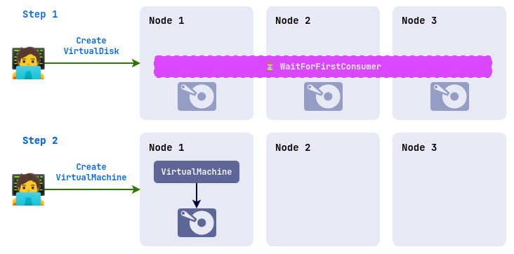
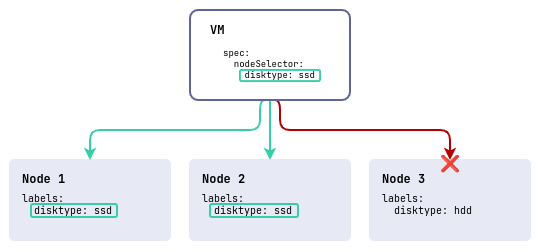
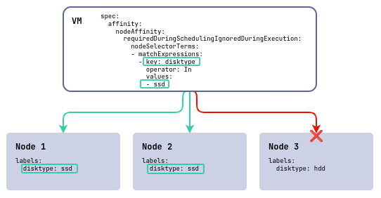
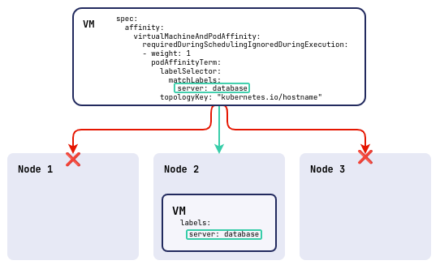
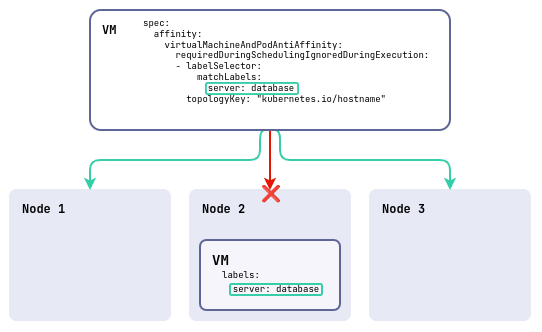
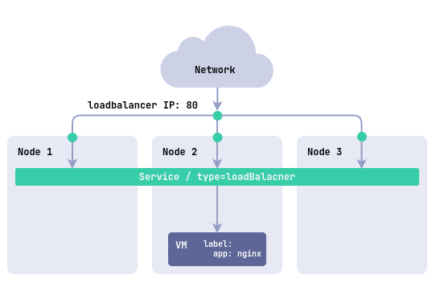

## Введение

Данное руководство предназначено для пользователей Deckhouse Virtualization Platform и описывает порядок создания и изменения ресурсов, которые доступны для создания в проектах и пространствах имен кластера.

## Быстрый старт по созданию ВМ

Пример создания виртуальной машины с Ubuntu 22.04.

1. Создайте образ виртуальной машины из внешнего источника:

   ```yaml
   d8 k apply -f - <<EOF
   apiVersion: virtualization.deckhouse.io/v1alpha2
   kind: VirtualImage
   metadata:
     name: ubuntu
   spec:
     storage: ContainerRegistry
     dataSource:
       type: HTTP
       http:
         url: "https://cloud-images.ubuntu.com/minimal/releases/jammy/release/ubuntu-22.04-minimal-cloudimg-amd64.img"
   EOF
   ```

1. Создайте диск виртуальной машины из образа, созданного на предыдущем шаге (Внимание: перед созданием убедитесь, что в системе присутствует StorageClass по умолчанию):

   ```yaml
   d8 k apply -f - <<EOF
   apiVersion: virtualization.deckhouse.io/v1alpha2
   kind: VirtualDisk
   metadata:
     name: linux-disk
   spec:
     dataSource:
       type: ObjectRef
       objectRef:
         kind: VirtualImage
         name: ubuntu
   EOF
   ```

1. Создайте виртуальную машину:

   В примере используется cloud-init-сценарий для создания пользователя cloud с паролем cloud, сгенерированный следующим образом:

   ```bash
   mkpasswd --method=SHA-512 --rounds=4096
   ```

   Изменить имя пользователя и пароль можно в этой секции:

   ```yaml
   users:
     - name: cloud
       passwd: $6$rounds=4096$G5VKZ1CVH5Ltj4wo$g.O5RgxYz64ScD5Ach5jeHS.Nm/SRys1JayngA269wjs/LrEJJAZXCIkc1010PZqhuOaQlANDVpIoeabvKK4j1
   ```

   Создайте виртуальную машину из следующей спецификации:

   ```yaml
   d8 k apply -f - <<"EOF"
   apiVersion: virtualization.deckhouse.io/v1alpha2
   kind: VirtualMachine
   metadata:
     name: linux-vm
   spec:
     virtualMachineClassName: host
     cpu:
       cores: 1
     memory:
       size: 1Gi
     provisioning:
       type: UserData
       userData: |
         #cloud-config
         ssh_pwauth: True
         users:
         - name: cloud
           passwd: '$6$rounds=4096$saltsalt$fPmUsbjAuA7mnQNTajQM6ClhesyG0.yyQhvahas02ejfMAq1ykBo1RquzS0R6GgdIDlvS.kbUwDablGZKZcTP/'
           shell: /bin/bash
           sudo: ALL=(ALL) NOPASSWD:ALL
           lock_passwd: False
     blockDeviceRefs:
       - kind: VirtualDisk
         name: linux-disk
   EOF
   ```

   Полезные ссылки:

   - [Документация по cloud-init](https://cloudinit.readthedocs.io/).
   - [Параметры ресурсов](cr.html).

1. Проверьте с помощью команды, что образ и диск созданы, а виртуальная машина - запущена. Ресурсы создаются не мгновенно, поэтому прежде чем они придут в готовое состояние потребуется подождать какое-то время.

   ```bash
   d8 k  get vi,vd,vm
   ```

   Пример вывода:

   ```txt
   # NAME                                                 PHASE   CDROM   PROGRESS   AGE
   # virtualimage.virtualization.deckhouse.io/ubuntu      Ready   false   100%
   #
   # NAME                                                 PHASE   CAPACITY   AGE
   # virtualdisk.virtualization.deckhouse.io/linux-disk   Ready   300Mi      7h40m
   #
   # NAME                                                 PHASE     NODE           IPADDRESS     AGE
   # virtualmachine.virtualization.deckhouse.io/linux-vm  Running   virtlab-pt-2   10.66.10.2    7h46m
   ```

1. Подключитесь с помощью консоли к виртуальной машине (для выхода из консоли необходимо нажать `Ctrl+]`):

   ```bash
   d8 v console linux-vm
   ```

   Пример вывода:

   ```txt
   # Successfully connected to linux-vm console. The escape sequence is ^]
   #
   # linux-vm login: cloud
   # Password: cloud
   # ...
   # cloud@linux-vm:~$
   ```

1. Для удаления созданных ранее ресурсов используйте следующие команды:

   ```bash
   d8 k delete vm linux-vm
   d8 k delete vd linux-disk
   d8 k delete vi ubuntu
   ```

## Образы

Ресурс `VirtualImage` предназначен для загрузки образов виртуальных машин и их последующего использования для создания дисков виртуальных машин. Данный ресурс доступен только в неймспейсе или проекте в котором он был создан.

При подключении к виртуальной машине доступ к образу предоставляется в режиме «только чтение».

Процесс создания образа включает следующие шаги:

- Пользователь создаёт ресурс `VirtualImage`.
- После создания образ автоматически загружается из указанного в спецификации источника в хранилище (DVCR).
- После завершения загрузки, ресурс становится доступным для создания дисков.

Существуют различные типы образов:

- ISO-образ — установочный образ, используемый для начальной установки операционной системы. Такие образы выпускаются производителями ОС и используются для установки на физические и виртуальные серверы.
- Образ диска с предустановленной системой — содержит уже установленную и настроенную операционную систему, готовую к использованию после создания виртуальной машины. Готовые образы можно получить на ресурсах разработчиков дистрибутива, либо создать самостоятельно.

Примеры ресурсов для получения образов виртуальной машины:

- [Ubuntu](https://cloud-images.ubuntu.com)
- [Alt Linux](https://ftp.altlinux.ru/pub/distributions/ALTLinux/platform/images/cloud/x86_64)
- [Astra Linux](https://download.astralinux.ru/ui/native/mg-generic/alse/cloudinit)

Поддерживаются следующие форматы образов с предустановленной системой:

- qcow2
- raw
- vmdk
- vdi

Также файлы образов могут быть сжаты одним из следующих алгоритмов сжатия: gz, xz.

После создания ресурса, тип и размер образа определяются автоматически и эта информация отражается в статусе ресурса.

Образы могут быть загружены из различных источников, таких как HTTP-серверы, где расположены файлы образов, или контейнерные реестры. Также доступна возможность загрузки образов напрямую из командной строки с использованием утилиты curl.

Образы могут быть созданы из других образов и дисков виртуальных машин.

Проектный образ поддерживает два варианта хранения:

- `ContainerRegistry` - тип по умолчанию, при котором образ хранится в `DVCR`.
- `PersistentVolumeClaim` - тип, при котором в качестве хранилища для образа используется `PVC`. Этот вариант предпочтителен, если используется хранилище с поддержкой быстрого клонирования `PVC`, что позволяет быстрее создавать диски из образов.

С полным описанием параметров конфигурации ресурса `VirtualImage` можно ознакомиться [в документации к ресурсу](cr.html#virtualimage).

### Создание образа с HTTP-сервера

Рассмотрим вариант создания образа с вариантом хранения в DVCR.

1. Выполните следующую команду для создания `VirtualImage`:

   ```yaml
   d8 k apply -f - <<EOF
   apiVersion: virtualization.deckhouse.io/v1alpha2
   kind: VirtualImage
   metadata:
     name: ubuntu-22-04
   spec:
     # Сохраним образ в DVCR.
     storage: ContainerRegistry
     # Источник для создания образа.
     dataSource:
       type: HTTP
       http:
         url: "https://cloud-images.ubuntu.com/minimal/releases/jammy/release/ubuntu-22.04-minimal-cloudimg-amd64.img"
   EOF
   ```

1. Проверьте результат создания `VirtualImage`:

   ```bash
   d8 k get virtualimage ubuntu-22-04
   # или более короткий вариант
   d8 k get vi ubuntu-22-04
   ```

   Пример вывода:

   ```txt
   # NAME           PHASE   CDROM   PROGRESS   AGE
   # ubuntu-22-04   Ready   false   100%       23h
   ```

После создания ресурс `VirtualImage` может находиться в следующих состояниях (фазах):

- `Pending` - ожидание готовности всех зависимых ресурсов, требующихся для создания образа.
- `WaitForUserUpload` - ожидание загрузки образа пользователем (фаза присутствует только для `type=Upload`).
- `Provisioning` - идет процесс создания образа.
- `Ready` - образ создан и готов для использования.
- `Failed` - произошла ошибка в процессе создания образа.
- `Terminating` - идет процесс удаления Образа. Образ может «зависнуть» в данном состоянии, если он еще подключен к виртуальной машине.

До тех пор пока образ не перешёл в фазу `Ready`, содержимое всего блока `.spec` допускается изменять. При изменении процесс создании диска запустится заново. После перехода в фазу `Ready` содержимое блока `.spec` менять нельзя!

Отследить процесс создания образа можно путем добавления ключа `-w` к предыдущей команде:

```bash
d8 k get vi ubuntu-22-04 -w
```

Пример вывода:

```txt
# NAME           PHASE          CDROM   PROGRESS   AGE
# ubuntu-22-04   Provisioning   false              4s
# ubuntu-22-04   Provisioning   false   0.0%       4s
# ubuntu-22-04   Provisioning   false   28.2%      6s
# ubuntu-22-04   Provisioning   false   66.5%      8s
# ubuntu-22-04   Provisioning   false   100.0%     10s
# ubuntu-22-04   Provisioning   false   100.0%     16s
# ubuntu-22-04   Ready          false   100%       18s
```

В описание ресурса `VirtualImage` можно получить дополнительную информацию о скачанном образе:

```bash
d8 k describe vi ubuntu-22-04
```

Теперь рассмотрим пример создания образа с хранением его в PVC:

```yaml
d8 k apply -f - <<EOF
apiVersion: virtualization.deckhouse.io/v1alpha2
kind: VirtualImage
metadata:
  name: ubuntu-22-04-pvc
spec:
  # Настройки хранения проектного образа.
  storage: PersistentVolumeClaim
  persistentVolumeClaim:
    # Подставьте ваше название StorageClass.
    storageClassName: i-linstor-thin-r2
  # Источник для создания образа.
  dataSource:
    type: HTTP
    http:
      url: "https://cloud-images.ubuntu.com/minimal/releases/jammy/release/ubuntu-22.04-minimal-cloudimg-amd64.img"
EOF
```

Проверьте результат создания `VirtualImage`:

```bash
d8 k get vi ubuntu-22-04-pvc
```

Пример вывода:

```txt
# NAME              PHASE   CDROM   PROGRESS   AGE
# ubuntu-22-04-pvc  Ready   false   100%       23h
```

Если параметр `.spec.persistentVolumeClaim.storageClassName` не указан, то будет использован `StorageClass` по умолчанию на уровне кластера, либо для образов, если он указан в [настройках модуля](./ADMIN_GUIDE_RU.md#настройки-классов-хранения-для-образов).

### Создание образа из Container Registry

Образ, хранящийся в Container Registry, имеет определенный формат. Рассмотрим на примере:

1. Загрузите образ локально:

   ```bash
   curl -L https://cloud-images.ubuntu.com/minimal/releases/jammy/release/ubuntu-22.04-minimal-cloudimg-amd64.img -o ubuntu2204.img
   ```

1. Создайте `Dockerfile` со следующим содержимым:

   ```Dockerfile
   FROM scratch
   COPY ubuntu2204.img /disk/ubuntu2204.img
   ```

1. Соберите образ и загрузите его в container registry. В качестве container registry в примере ниже использован docker.io. Для выполнения необходимо иметь учетную запись сервиса и настроенное окружение.

   ```bash
   docker build -t docker.io/<username>/ubuntu2204:latest
   ```

   где `username` — имя пользователя, указанное при регистрации в docker.io.

1. Загрузите созданный образ в container registry:

   ```bash
   docker push docker.io/<username>/ubuntu2204:latest
   ```

1. Чтобы использовать этот образ, создайте в качестве примера ресурс:

   ```yaml
   d8 k apply -f - <<EOF
   apiVersion: virtualization.deckhouse.io/v1alpha2
   kind: VirtualImage
   metadata:
     name: ubuntu-2204
   spec:
     storage: ContainerRegistry
     dataSource:
       type: ContainerImage
       containerImage:
         image: docker.io/<username>/ubuntu2204:latest
   EOF
   ```

### Загрузка образа из командной строки

Чтобы загрузить образ из командной строки, предварительно создайте ресурс, как представлено ниже на примере `VirtualImage`:

```yaml
d8 k apply -f - <<EOF
apiVersion: virtualization.deckhouse.io/v1alpha2
kind: VirtualImage
metadata:
  name: some-image
spec:
  # Настройки хранения проектного образа.
  storage: ContainerRegistry
  # Настройки источника образа.
  dataSource:
    type: Upload
EOF
```

После создания, ресурс перейдет в фазу `WaitForUserUpload`, а это значит, что он готов для загрузки образа.

Доступно два варианта загрузки с узла кластера и с произвольного узла за пределами кластера:

```bash
d8 k get vi some-image -o jsonpath="{.status.imageUploadURLs}"  | jq
```

Пример вывода:

```txt
# {
#   "external":"https://virtualization.example.com/upload/g2OuLgRhdAWqlJsCMyNvcdt4o5ERIwmm",
#   "inCluster":"http://10.222.165.239/upload"
# }
```

В качестве примера загрузите образ Cirros:

```bash
curl -L http://download.cirros-cloud.net/0.5.1/cirros-0.5.1-x86_64-disk.img -o cirros.img
```

Выполните загрузку образа с использование следующей команды

```bash
curl https://virtualization.example.com/upload/g2OuLgRhdAWqlJsCMyNvcdt4o5ERIwmm --progress-bar -T cirros.img | cat
```

После завершения загрузки образ должен быть создан и перейти в фазу `Ready`

```bash
d8 k get vi some-image
```

Пример вывода:

```txt
# NAME         PHASE   CDROM   PROGRESS   AGE
# some-image   Ready   false   100%       1m
```

### Создание образа из диска

Существует возможность создать образ из [диска](#диски). Для этого необходимо выполнить одно из следующих условий:

- Диск не подключен ни к одной из виртуальных машин.
- Виртуальная машина, к которой подключен диск, находится в выключенном состоянии.

Пример создания образа из диска:

```yaml
d8 k apply -f - <<EOF
apiVersion: virtualization.deckhouse.io/v1alpha2
kind: VirtualImage
metadata:
  name: linux-vm-root
spec:
  storage: ContainerRegistry
  dataSource:
    type: ObjectRef
    objectRef:
      kind: VirtualDisk
      name: linux-vm-root
EOF
```

### Создание образа из снимка диска

Можно создать образ из [снимка](#снимки). Для этого необходимо чтобы снимок диска находился в фазе готовности.

Пример создания образа из моментального снимка диска:

```yaml
d8 k apply -f - <<EOF
apiVersion: virtualization.deckhouse.io/v1alpha2
kind: VirtualImage
metadata:
  name: linux-vm-root
spec:
  storage: ContainerRegistry
  dataSource:
    type: ObjectRef
    objectRef:
      kind: VirtualDiskSnapshot
      name: linux-vm-root-snapshot
EOF
```

## Диски

Диски в виртуальных машинах необходимы для записи и хранения данных, они обеспечивают полноценное функционирование приложений и операционных систем. Хранилище для этих дисков предоставляет платформа.

В зависимости от свойств хранилища, поведение дисков при создании и виртуальных машин в процессе эксплуатации может отличаться:

Свойство VolumeBindingMode:

`Immediate` - Диск создается сразу после создания ресурса (предполагается, что диск будет доступен для подключения к виртуальной машине на любом узле кластера).


`WaitForFirstConsumer` - Диск создается только после того как будет подключен к виртуальной машине и будет создан на том узле, на котором будет запущена виртуальная машина.



Режим доступа AccessMode:

- `ReadWriteOnce (RWO)` - доступ к диску предоставляется только одному экземпляру виртуальной машины. Живая миграция виртуальных машин с такими дисками невозможна.
- `ReadWriteMany (RWX)` - множественный доступ к диску. Живая миграция виртуальных машин с такими дисками возможна.

При создании диска контроллер самостоятельно определит наиболее оптимальные параметры поддерживаемые хранилищем.

> Внимание: Создать диски из iso-образов - нельзя!

Чтобы узнать доступные варианты хранилищ на платформе, выполните следующую команду:

```bash
d8 k  get storageclass
```

Пример вывода:

```txt
# NAME                          PROVISIONER                           RECLAIMPOLICY   VOLUMEBINDINGMODE      ALLOWVOLUMEEXPANSION   AGE
# i-linstor-thin-r1 (default)   replicated.csi.storage.deckhouse.io   Delete          Immediate              true                   48d
# i-linstor-thin-r2             replicated.csi.storage.deckhouse.io   Delete          Immediate              true                   48d
# i-linstor-thin-r3             replicated.csi.storage.deckhouse.io   Delete          Immediate              true                   48d
# linstor-thin-r1               replicated.csi.storage.deckhouse.io   Delete          WaitForFirstConsumer   true                   48d
# linstor-thin-r2               replicated.csi.storage.deckhouse.io   Delete          WaitForFirstConsumer   true                   48d
# linstor-thin-r3               replicated.csi.storage.deckhouse.io   Delete          WaitForFirstConsumer   true                   48d
# nfs-4-1-wffc                  nfs.csi.k8s.io                        Delete          WaitForFirstConsumer   true                   30d
```

С полным описанием параметров конфигурации дисков можно ознакомиться [в документации ресурса](cr.html#virtualdisk).

### Создание пустого диска

Пустые диски обычно используются для установки на них ОС, либо для хранения каких-либо данных.

Создайте диск:

```yaml
d8 k apply -f - <<EOF
apiVersion: virtualization.deckhouse.io/v1alpha2
kind: VirtualDisk
metadata:
  name: blank-disk
spec:
  # Настройки параметров хранения диска.
  persistentVolumeClaim:
    # Подставьте ваше название StorageClass.
    storageClassName: i-linstor-thin-r2
    size: 100Mi
EOF
```

После создания ресурс `VirtualDisk` может находиться в следующих состояниях (фазах):

- `Pending` - ожидание готовности всех зависимых ресурсов, требующихся для создания диска.
- `Provisioning` - идет процесс создания диска.
- `Resizing` - идет процесс изменения размера диска.
- `WaitForFirstConsumer` - диск ожидает создания виртуальной машины, которая будет его использовать.
- `WaitForUserUpload` - диск ожидает от пользователя загрузки образа (type: Upload).
- `Ready` - диск создан и готов для использования.
- `Failed` - произошла ошибка в процессе создания.
- `PVCLost` - системная ошибка, PVC с данными утерян.
- `Terminating` - идет процесс удаления диска. Диск может «зависнуть» в данном состоянии, если он еще подключен к виртуальной машине.

До тех пор пока диск не перешёл в фазу `Ready` содержимое всего блока `.spec` допускается изменять. При изменении процесс создании диска запустится заново.

Если параметр `.spec.persistentVolumeClaim.storageClassName` не указан, то будет использован `StorageClass` по умолчанию на уровне кластера, либо для образов, если он указан в [настройках модуля](./ADMIN_GUIDE_RU.md#настройки-классов-хранения-для-дисков).

Проверьте состояние диска после создания командой:

```bash
d8 k get vd blank-disk
```

Пример вывода:

```txt
# NAME       PHASE   CAPACITY   AGE
# blank-disk   Ready   100Mi      1m2s
```

### Создание диска из образа

Диск также можно создавать и заполнять данными из ранее созданных образов `ClusterVirtualImage` и `VirtualImage`.

При создании диска можно указать его желаемый размер, который должен быть равен или больше размера распакованного образа. Если размер не указан, то будет создан диск с размером, соответствующим исходному образу диска.

На примере ранее созданного проектного образа `VirtualImage`, рассмотрим команду позволяющую определить размер распакованного образа:

```bash
d8 k get cvi ubuntu-22-04 -o wide
```

Пример вывода:

```txt
# NAME           PHASE   CDROM   PROGRESS   STOREDSIZE   UNPACKEDSIZE   REGISTRY URL                                                                       AGE
# ubuntu-22-04   Ready   false   100%       285.9Mi      2.5Gi          dvcr.d8-virtualization.svc/cvi/ubuntu-22-04:eac95605-7e0b-4a32-bb50-cc7284fd89d0   122m
```

Искомый размер указан в колонке **UNPACKEDSIZE** и равен 2.5Gi.

Создадим диск из этого образа:

```yaml
d8 k apply -f - <<EOF
apiVersion: virtualization.deckhouse.io/v1alpha2
kind: VirtualDisk
metadata:
  name: linux-vm-root
spec:
  # Настройки параметров хранения диска.
  persistentVolumeClaim:
    # Укажем размер больше чем значение распакованного образа.
    size: 10Gi
    # Подставьте ваше название StorageClass.
    storageClassName: i-linstor-thin-r2
  # Источник из которого создается диск.
  dataSource:
    type: ObjectRef
    objectRef:
      kind: VirtualImage
      name: ubuntu-22-04
EOF
```

А теперь создайте диск, без явного указания размера:

```yaml
d8 k apply -f - <<EOF
apiVersion: virtualization.deckhouse.io/v1alpha2
kind: VirtualDisk
metadata:
  name: linux-vm-root-2
spec:
  # Настройки параметров хранения диска.
  persistentVolumeClaim:
    # Подставьте ваше название StorageClass.
    storageClassName: i-linstor-thin-r2
  # Источник из которого создается диск.
  dataSource:
    type: ObjectRef
    objectRef:
      kind: VirtualImage
      name: ubuntu-22-04
EOF
```

Проверьте состояние дисков после создания:

```bash
d8 k get vd
```

Пример вывода:

```txt
# NAME           PHASE   CAPACITY   AGE
# linux-vm-root    Ready   10Gi       7m52s
# linux-vm-root-2  Ready   2590Mi     7m15s
```

### Изменение размера диска

Размер дисков можно увеличивать, даже если они уже подключены к работающей виртуальной машине. Для этого отредактируйте поле `spec.persistentVolumeClaim.size`:

Проверьте размер до изменения:

```bash
d8 k get vd linux-vm-root
```

Пример вывода:

```txt
# NAME          PHASE   CAPACITY   AGE
# linux-vm-root   Ready   10Gi       10m
```

Примените изменения:

```bash
d8 k patch vd linux-vm-root --type merge -p '{"spec":{"persistentVolumeClaim":{"size":"11Gi"}}}'
```

Проверьте размер после изменения:

```bash
d8 k get vd linux-vm-root
```

Пример вывода:

```txt
# NAME          PHASE   CAPACITY   AGE
# linux-vm-root   Ready   11Gi       12m
```

## Виртуальные машины

Для создания виртуальной машины используется ресурс `VirtualMachine`. Его параметры позволяют сконфигурировать:

- [класс виртуальной машины](ADMIN_GUIDE_RU.md#классы-виртуальных-машин)
- ресурсы, требуемые для работы виртуальной машины (процессор, память, диски и образы);
- правила размещения виртуальной машины на узлах кластера;
- настройки загрузчика и оптимальные параметры для гостевой ОС;
- политику запуска виртуальной машины и политику применения изменений;
- сценарии начальной конфигурации (cloud-init);
- перечень блочных устройств.

С полным описанием параметров конфигурации виртуальных машин можно ознакомиться по [в документации конфигурации](cr.html#virtualmachine).

### Создание виртуальной машины

Ниже представлен пример простой конфигурации виртуальной машины, запускающей ОС Ubuntu 22.04. В примере используется сценарий первичной инициализации виртуальной машины (cloud-init), который устанавливает гостевого агента `qemu-guest-agent` и сервис `nginx`, а также создает пользователя `cloud` с паролем `cloud`:

Пароль в примере был сгенерирован с использованием команды `mkpasswd --method=SHA-512 --rounds=4096 -S saltsalt` и при необходимости вы можете его поменять на свой:

Создайте виртуальную машину с диском созданным [ранее](#создание-диска-из-образа):

```yaml
d8 k apply -f - <<"EOF"
apiVersion: virtualization.deckhouse.io/v1alpha2
kind: VirtualMachine
metadata:
  name: linux-vm
spec:
  # Название класса ВМ.
  virtualMachineClassName: host
  # Блок скриптов первичной инициализации ВМ.
  provisioning:
    type: UserData
    # Пример cloud-init-сценария для создания пользователя cloud с паролем cloud и установки сервиса агента qemu-guest-agent и сервиса nginx.
    userData: |
      #cloud-config
      package_update: true
      packages:
        - nginx
        - qemu-guest-agent
      run_cmd:
        - systemctl daemon-reload
        - systemctl enable --now nginx.service
        - systemctl enable --now qemu-guest-agent.service
      ssh_pwauth: True
      users:
      - name: cloud
        passwd: '$6$rounds=4096$saltsalt$fPmUsbjAuA7mnQNTajQM6ClhesyG0.yyQhvahas02ejfMAq1ykBo1RquzS0R6GgdIDlvS.kbUwDablGZKZcTP/'
        shell: /bin/bash
        sudo: ALL=(ALL) NOPASSWD:ALL
        lock_passwd: False
      final_message: "The system is finally up, after $UPTIME seconds"
  # Настройки ресурсов ВМ.
  cpu:
    # Количество ядер ЦП.
    cores: 1
    # Запросить 10% процессорного времени одного физического ядра.
    coreFraction: 10%
  memory:
    # Объем оперативной памяти.
    size: 1Gi
  # Список дисков и образов, используемых в ВМ.
  blockDeviceRefs:
    # Порядок дисков и образов в данном блоке определяет приоритет загрузки.
    - kind: VirtualDisk
      name: linux-vm-root
EOF
```

После создания `VirtualMachine` может находиться в следующих состояниях (фазах):

- `Pending` - ожидание готовности всех зависимых ресурсов, требующихся для запуска виртуальной машины.
- `Starting` - идет процесс запуска виртуальной машины.
- `Running` - виртуальная машина запущена.
- `Stopping` - идет процесс остановки виртуальной машины.
- `Stopped` - виртуальная машина остановлена.
- `Terminating` - виртуальная машина удаляется.
- `Migrating` - виртуальная машина находится в состоянии живой миграции на другой узел.

Проверьте состояние виртуальной машины после создания:

```bash
d8 k get vm linux-vm
```

Пример вывода:

```txt
# NAME        PHASE     NODE           IPADDRESS     AGE
# linux-vm   Running   virtlab-pt-2   10.66.10.12   11m
```

После создания виртуальная машина автоматически получит IP-адрес из диапазона, указанного в настройках модуля (блок `virtualMachineCIDRs`).

### Автоматическая конфигурация топологии CPU

Количество сокетов рассчитывается автоматически и зависит от количества ядер.

Для .spec.cpu.cores <= 16:

- Создается один сокет с количеством ядер, равным указанному значению.
- Шаг инкремента ядер: 1
- Допустимые значения: любое число от 1 до 16 включительно.

Для 16 < .spec.cpu.cores <= 32:

- Создается два сокета с одинаковым количеством ядер в каждом.
- Шаг инкремента ядер: 2
- Допустимые значения: 18, 20, 22, ..., 32.
- Минимум ядер в сокете: 9
- Максимум ядер в сокете: 16

Для 32 < .spec.cpu.cores <= 64:

- Создается четыре сокета с одинаковым количеством ядер в каждом.
- Шаг инкремента ядер: 4
- Допустимые значения: 36, 40, 44, ..., 64.
- Минимум ядер в сокете: 9
- Максимум ядер в сокете: 16

Для .spec.cpu.cores > 64:

- Создается восемь сокетов с одинаковым количеством ядер в каждом.
- Шаг инкремента ядер: 8
- Допустимые значения: 72, 80, ...
- Минимум ядер в сокете: 8

Текущая топология ВМ (реальное количество сокетов и ядер) отображается в статусе ВМ в следующем формате:

```yaml
status:
  resources:
    cpu:
      coreFraction: 100%
      cores: 18
      requestedCores: "18"
      runtimeOverhead: "0"
      topology:
        sockets: 2
        coresPerSocket: 9
```

### Подключение к виртуальной машине

Для подключения к виртуальной машине доступны следующие способы:

- протокол удаленного управления (например SSH), который должен быть предварительно настроен на виртуальной машине.
- серийная консоль (serial console).
- протокол VNC.

Пример подключения к виртуальной машине с использованием серийной консоли:

```bash
d8 v console linux-vm
```

Пример вывода:

```txt
# Successfully connected to linux-vm console. The escape sequence is ^]
# linux-vm login: cloud
# Password: cloud
```

Нажмите `Ctrl+]` для завершения работы с серийной консолью.

Пример команды для подключения по VNC:

```bash
d8 v vnc linux-vm
```

Пример команды для подключения по SSH:

```bash
d8 v ssh cloud@linux-vm --local-ssh
```

### Политика запуска и управление состоянием виртуальной машины

Политика запуска виртуальной машины предназначена для автоматизированного управления состоянием виртуальной машины. Определяется она в виде параметра `.spec.runPolicy` в спецификации виртуальной машины. Поддерживаются следующие политики:

- `AlwaysOnUnlessStoppedManually` - (по умолчанию) после создания ВМ всегда находится в запущенном состоянии. В случае сбоев работа ВМ восстанавливается автоматически. Остановка ВМ возможно только путем вызова команды `d8 v stop` или создания соответствующей операции.
- `AlwaysOn` - после создания ВМ всегда находится в работающем состоянии, даже в случае ее выключения средствами ОС. В случае сбоев работа ВМ восстанавливается автоматически.
- `Manual` - после создания состоянием ВМ управляет пользователь вручную с использованием команд или операций.
- `AlwaysOff` - после создания ВМ всегда находится в выключенном состоянии. Возможность включения ВМ через команды\операции - отсутствует.

Состоянием виртуальной машины можно управлять с помощью следующих методов:

- Создание ресурса `VirtualMachineOperation` (`vmop`).
- Использование утилиты `d8` с соответствующей подкомандой.

Ресурс `VirtualMachineOperation` декларативно определяет императивное действие, которое должно быть выполнено на виртуальной машине. Это действие применяется к виртуальной машине сразу после создания соответствующего `vmop`. Действие применяется к виртуальной машине один раз.

Пример операции для выполнения перезагрузки виртуальной машины с именем `linux-vm`:

```yaml
d8 k create -f - <<EOF
apiVersion: virtualization.deckhouse.io/v1alpha2
kind: VirtualMachineOperation
metadata:
  generateName: restart-linux-vm-
spec:
  virtualMachineName: linux-vm
  # Тип применяемой операции = применяемая операция.
  type: Restart
EOF
```

Посмотреть результат действия можно с использованием команды:

```bash
d8 k get virtualmachineoperation
# или
d8 k get vmop
```

Аналогичное действие можно выполнить с использованием утилиты `d8`:

```bash
d8 v restart linux-vm
```

Перечень возможных операций приведен в таблице ниже:

| d8             | vmop type | Действие                      |
| -------------- | --------- | ----------------------------- |
| `d8 v stop`    | `Stop`    | Остановить ВМ                 |
| `d8 v start`   | `Start`   | Запустить ВМ                  |
| `d8 v restart` | `Restart` | Перезапустить ВМ              |
| `d8 v  evict`  | `Evict`   | Мигрировать ВМ на другой узел |

### Изменение конфигурации виртуальной машины

Конфигурацию виртуальной машины можно изменять в любое время после создания ресурса `VirtualMachine`. Однако то, как эти изменения будут применены, зависит от текущей фазы виртуальной машины и характера внесённых изменений.

Изменения в конфигурацию виртуальной машины можно внести с использованием следующей команды:

```bash
d8 k edit vm linux-vm
```

Если виртуальная машина находится в выключенном состоянии (`.status.phase: Stopped`), внесённые изменения вступят в силу сразу после её запуска.

Если виртуальная машина работает (`.status.phase: Running`), то способ применения изменений зависит от их типа:

| Блок конфигурации                       | Как применяется                        |
| --------------------------------------- | -------------------------------------- |
| `.metadata.labels`                      | Сразу                                  |
| `.metadata.annotations`                 | Сразу                                  |
| `.spec.runPolicy`                       | Сразу                                  |
| `.spec.disruptions.restartApprovalMode` | Сразу                                  |
| `.spec.affinity`                        | EE: Сразу, CE: Требуется перезапуск ВМ |
| `.spec.nodeSelector`                    | EE: Сразу, CE: Требуется перезапуск ВМ |
| `.spec.*`                               | Требуется перезапуск ВМ                |

Рассмотрим пример изменения конфигурации виртуальной машины:

Предположим, мы хотим изменить количество ядер процессора. В данный момент виртуальная машина запущена и использует одно ядро, что можно подтвердить, подключившись к ней через серийную консоль и выполнив команду `nproc`.

```bash
d8 v ssh cloud@linux-vm --local-ssh --command "nproc"
```

Пример вывода:

```txt
# 1
```

Примените следующий патч к виртуальной машине, чтобы изменить количество ядер с 1 на 2.

```bash
d8 k patch vm linux-vm --type merge -p '{"spec":{"cpu":{"cores":2}}}'
```

Пример вывода:

```txt
# virtualmachine.virtualization.deckhouse.io/linux-vm patched
```

Изменения в конфигурации внесены, но ещё не применены к виртуальной машине. Проверьте это, повторно выполнив:

```bash
d8 v ssh cloud@linux-vm --local-ssh --command "nproc"
```

Пример вывода:

```txt
# 1
```

Для применения этого изменения необходим перезапуск виртуальной машины. Выполните следующую команду, чтобы увидеть изменения, ожидающие применения (требующие перезапуска):

```bash
d8 k get vm linux-vm -o jsonpath="{.status.restartAwaitingChanges}" | jq .
```

Пример вывода:

```txt
# [
#   {
#     "currentValue": 1,
#     "desiredValue": 2,
#     "operation": "replace",
#     "path": "cpu.cores"
#   }
# ]
```

Выполните команду:

```bash
d8 k get vm linux-vm -o wide
```

Пример вывода:

```txt
# NAME        PHASE     CORES   COREFRACTION   MEMORY   NEED RESTART   AGENT   MIGRATABLE   NODE           IPADDRESS     AGE
# linux-vm   Running   2       100%           1Gi      True           True    True         virtlab-pt-1   10.66.10.13   5m16s
```

В колонке `NEED RESTART` мы видим значение `True`, а это значит что для применения изменений требуется перезагрузка.

Выполните перезагрузку виртуальной машины:

```bash
d8 v restart linux-vm
```

После перезагрузки изменения будут применены и блок `.status.restartAwaitingChanges` будет пустой.

Выполните команду для проверки:

```bash
d8 v ssh cloud@linux-vm --local-ssh --command "nproc"
```

Пример вывода:

```txt
# 2
```

Порядок применения изменений виртуальной машины через «ручной» рестарт является поведением по умолчанию. Если есть необходимость применять внесенные изменения сразу и автоматически, для этого нужно изменить политику применения изменений:

```yaml
spec:
  disruptions:
    restartApprovalMode: Automatic
```

### Сценарии начальной инициализации

Сценарии начальной инициализации предназначены для первичной конфигурации виртуальной машины при её запуске.

В качестве сценариев начальной инициализации поддерживаются:

- [CloudInit](https://cloudinit.readthedocs.io).
- [Sysprep](https://learn.microsoft.com/ru-ru/windows-hardware/manufacture/desktop/sysprep--system-preparation--overview).

Сценарий CloudInit можно встраивать непосредственно в спецификацию виртуальной машины, но этот сценарий ограничен максимальной длиной в 2048 байт:

```yaml
spec:
  provisioning:
    type: UserData
    userData: |
      #cloud-config
      package_update: true
      ...
```

При более длинных сценариях и/или наличия приватных данных, сценарий начальной инициализации виртуальной машины может быть создан в ресурсе Secret. Пример ресурса Secret со сценарием CloudInit приведен ниже:

```yaml
apiVersion: v1
kind: Secret
metadata:
  name: cloud-init-example
data:
  userData: <base64 data>
type: provisioning.virtualization.deckhouse.io/cloud-init
```

фрагмент конфигурации виртуальной машины с при использовании скрипта начальной инициализации CloudInit хранящегося в ресурсе Secret:

```yaml
spec:
  provisioning:
    type: UserDataRef
    userDataRef:
      kind: Secret
      name: cloud-init-example
```

Примечание: Значение поля `.data.userData` должно быть закодировано в формате Base64.

Для конфигурирования виртуальных машин под управлением ОС Windows с использованием Sysprep, поддерживается только вариант с ресурсом Secret.

Пример ресурса Secret с сценарием Sysprep приведен ниже:

```yaml
apiVersion: v1
kind: Secret
metadata:
  name: sysprep-example
data:
  unattend.xml: <base64 data>
type: provisioning.virtualization.deckhouse.io/sysprep
```

Примечание: Значение поля `.data.unattend.xml` должно быть закодировано в формате Base64.

фрагмент конфигурации виртуальной машины с использованием скрипта начальной инициализации Sysprep в ресурсе Secret:

```yaml
spec:
  provisioning:
    type: SysprepRef
    sysprepRef:
      kind: Secret
      name: sysprep-example
```

### Размещение ВМ по узлам

Для управления размещением виртуальных машин по узлам можно использовать следующие подходы:

- Простое связывание по меткам (`nodeSelector`).
- Предпочтительное связывание (`Affinity`).
- Избежание совместного размещения (`AntiAffinity`).


Параметры размещения виртуальных машин можно изменить в реальном времени (доступно только в Enterprise-редакции). Однако, если новые параметры размещения не совпадают с текущими, виртуальная машина будет перемещена на узлы, соответствующие новым требованиям.


#### Простое связывание по меткам (nodeSelector)

`nodeSelector` — это простейший способ контролировать размещение виртуальных машин, используя набор меток. Он позволяет задать, на каких узлах могут запускаться виртуальные машины, выбирая узлы с необходимыми метками.

```yaml
spec:
  nodeSelector:
    disktype: ssd
```



В этом примере виртуальная машина будет размещена только на узлах, которые имеют метку `disktype` со значением `ssd`.

#### Предпочтительное связывание (Affinity)

`Affinity` предоставляет более гибкие и мощные инструменты по сравнению с `nodeSelector`. Он позволяет задавать «предпочтения» и «обязательности» для размещения виртуальных машин. `Affinity` поддерживает два вида: `nodeAffinity` и `virtualMachineAndPodAffinity`.

`nodeAffinity` позволяет определять на каких узлах может быть запущена виртуальная машина с помощью выражений меток и может быть мягким (preferred) или жестким (required).

Пример использования nodeAffinity:

```yaml
spec:
  affinity:
    nodeAffinity:
      requiredDuringSchedulingIgnoredDuringExecution:
        nodeSelectorTerms:
          - matchExpressions:
              - key: disktype
                operator: In
                values:
                  - ssd
```



В этом примере виртуальная машина будет размещена только на узлах, которые имеют метку `disktype` со значением `ssd`.

`virtualMachineAndPodAffinity` управляет размещением виртуальных машин относительно других виртуальных машин. Он позволяет задавать предпочтение размещения виртуальных машин на тех же узлах, где уже запущены определенные виртуальные машины.

Пример:

```yaml
spec:
  affinity:
    virtualMachineAndPodAffinity:
      preferredDuringSchedulingIgnoredDuringExecution:
        - weight: 1
          podAffinityTerm:
            labelSelector:
              matchLabels:
                server: database
            topologyKey: "kubernetes.io/hostname"
```



В этом примере виртуальная машина будет размещена, если будет такая возможность (тк используется preferred) только на узлах на которых присутствует виртуальная машина с меткой server и значением database.

#### Избежание совместного размещения (AntiAffinity)

`AntiAffinity` — это противоположность `Affinity`, которая позволяет задавать требования для избегания размещения виртуальных машин на одних и тех же узлах. Это полезно для распределения нагрузки или обеспечения отказоустойчивости.

Термины `Affinity` и `AntiAffinity` применимы только к отношению между виртуальными машинами. Для узлов используемые привязки называются `nodeAffinity`. В `nodeAffinity` нет отдельного антитеза, как в случае с `virtualMachineAndPodAffinity`, но можно создать противоположные условия, задав отрицательные операторы в выражениях меток: чтобы акцентировать внимание на исключении определенных узлов, можно воспользоваться `nodeAffinity` с оператором, таким как `NotIn`.

Пример использования `virtualMachineAndPodAntiAffinity`:

```yaml
spec:
  affinity:
    virtualMachineAndPodAntiAffinity:
      requiredDuringSchedulingIgnoredDuringExecution:
        - labelSelector:
            matchLabels:
              server: database
          topologyKey: "kubernetes.io/hostname"
```



В данном примере создаваемая виртуальная машина не будет размещена на одном узле с виртуальной машиной с меткой server: database.

### Статические и динамические блочные устройства

Блочные устройства можно разделить на два типа по способу их подключения: статические и динамические (hotplug).

Блочные устройства и их особенности представлены в таблице:

| Тип блочного устройства | Комментарий                                                     |
| ----------------------- | --------------------------------------------------------------- |
| `VirtualImage`          | подключается в режиме для чтения, или как cdrom для iso-образов |
| `ClusterVirtualImage`   | подключается в режиме для чтения, или как cdrom для iso-образов |
| `VirtualDisk`           | подключается в режиме для чтения и записи                       |

#### Статические блочные устройства

Статические блочные устройства указываются в спецификации виртуальной машины в блоке `.spec.blockDeviceRefs` в виде списка. Порядок устройств в этом списке определяет последовательность их загрузки. Таким образом, если диск или образ указан первым, загрузчик сначала попробует загрузиться с него. Если это не удастся, система перейдет к следующему устройству в списке и попытается загрузиться с него. И так далее до момента обнаружения первого загрузчика.

Изменение состава и порядка устройств в блоке `.spec.blockDeviceRefs` возможно только с перезагрузкой виртуальной машины.

Фрагмент конфигурации VirtualMachine со статически подключенными диском и проектным образом:

```yaml
spec:
  blockDeviceRefs:
    - kind: VirtualDisk
      name: <virtual-disk-name>
    - kind: VirtualImage
      name: <virtual-image-name>
```

#### Динамические блочные устройства

Динамические блочные устройства можно подключать и отключать от виртуальной машины, находящейся в запущенном состоянии, без необходимости её перезагрузки.

Для подключения динамических блочных устройств используется ресурс `VirtualMachineBlockDeviceAttachment` (`vmbda`).

Создайте ресурс, который подключит пустой диск blank-disk к виртуальной машине linux-vm:

```yaml
d8 k apply -f - <<EOF
apiVersion: virtualization.deckhouse.io/v1alpha2
kind: VirtualMachineBlockDeviceAttachment
metadata:
  name: attach-blank-disk
spec:
  blockDeviceRef:
    kind: VirtualDisk
    name: blank-disk
  virtualMachineName: linux-vm
EOF
```

После создания `VirtualMachineBlockDeviceAttachment` может находиться в следующих состояниях (фазах):

- `Pending` - ожидание готовности всех зависимых ресурсов.
- `InProgress` - идет процесс подключения устройства.
- `Attached` - устройство подключено.

Проверьте состояние вашего ресурса:

```bash
d8 k get vmbda attach-blank-disk
```

Пример вывода:

```txt# NAME              PHASE      VIRTUAL MACHINE NAME   AGE
# attach-blank-disk   Attached   linux-vm              3m7s
```

Подключитесь к виртуальной машине и удостоверитесь, что диск подключен:

```bash
d8 v ssh cloud@linux-vm --local-ssh --command "lsblk"
```

Пример вывода:

```txt
# NAME    MAJ:MIN RM  SIZE RO TYPE MOUNTPOINTS
# sda       8:0    0   10G  0 disk <--- статично подключенный диск linux-vm-root
# |-sda1    8:1    0  9.9G  0 part /
# |-sda14   8:14   0    4M  0 part
# `-sda15   8:15   0  106M  0 part /boot/efi
# sdb       8:16   0    1M  0 disk <--- cloudinit
# sdc       8:32   0 95.9M  0 disk <--- динамически подключенный диск blank-disk
```

Для отключения диска от виртуальной машины удалите ранее созданный ресурс:

```bash
d8 k delete vmbda attach-blank-disk
```

Подключение образов, осуществляется по аналогии. Для этого в качестве `kind` указать VirtualImage или ClusterVirtualImage и имя образа:

```yaml
d8 k apply -f - <<EOF
apiVersion: virtualization.deckhouse.io/v1alpha2
kind: VirtualMachineBlockDeviceAttachment
metadata:
  name: attach-ubuntu-iso
spec:
  blockDeviceRef:
    kind: VirtualImage # или ClusterVirtualImage
    name: ubuntu-iso
  virtualMachineName: linux-vm
EOF
```

### Публикация виртуальных машин с использованием сервисов

Достаточно часто возникает необходимость сделать так, чтобы доступ к этим виртуальным машинам был возможен извне, например, для публикации каких-либо сервисов или удалённого администрирования. Для этих целей мы можем использовать сервисы, которые обеспечивают маршрутизацию трафика из внешней сети к внутренним ресурсам кластера. Рассмотрим несколько вариантов.

Предварительно, проставьте на ранее созданной вм следующие лейблы:

```bash
d8 k label vm linux-vm app=nginx
```

Пример вывода:

```txt
# virtualmachine.virtualization.deckhouse.io/linux-vm labeled
```

#### Публикация сервисов виртуальной машины с использованием сервиса с типом NodePort

Сервис `NodePort` открывает определённый порт на всех узлах кластера, перенаправляя трафик на заданный внутренний порт сервиса.

Создайте следующий сервис:

```yaml
d8 k apply -f - <<EOF
apiVersion: v1
kind: Service
metadata:
  name: linux-vm-nginx-nodeport
spec:
  type: NodePort
  selector:
    # Лейбл по которому сервис определяет на какую виртуальную машину направлять трафик.
    app: nginx
  ports:
    - protocol: TCP
      port: 80
      targetPort: 80
      nodePort: 31880
EOF
```


В данном примере будет создан сервис с типом `NodePort`, который открывает внешний порт 31880 на всех узлах вашего кластера. Этот порт будет направлять входящий трафик на внутренний порт 80 виртуальной машины, где запущено приложение Nginx.

#### Публикация сервисов виртуальной машины с использованием сервиса с типом LoadBalancer

При использовании типа сервиса `LoadBalancer` кластер создаёт внешний балансировщик нагрузки, который распределит входящий трафик по всем экземплярам вашей виртуальной машины.

```yaml
d8 k apply -f - <<EOF
apiVersion: v1
kind: Service
metadata:
  name: linux-vm-nginx-lb
spec:
  type: LoadBalancer
  selector:
    # Лейбл по которому сервис определяет на какую виртуальную машину направлять трафик
    app: nginx
  ports:
    - protocol: TCP
      port: 80
      targetPort: 80
EOF
```



#### Публикация сервисов виртуальной машины с использованием Ingress

`Ingress` позволяет управлять входящими HTTP/HTTPS запросами и маршрутизировать их к различным серверам в рамках вашего кластера. Это наиболее подходящий метод, если вы хотите использовать доменные имена и SSL-терминацию для доступа к вашим виртуальным машинам.

Для публикации сервиса виртуальной машины через `Ingress` необходимо создать следующие ресурсы:

Внутренний сервис для связки с `Ingress`. Пример:

```yaml
d8 k apply -f - <<EOF
apiVersion: v1
kind: Service
metadata:
  name: linux-vm-nginx
spec:
  selector:
    # лейбл по которому сервис определяет на какую виртуальную машину направлять трафик
    app: nginx
  ports:
    - protocol: TCP
      port: 80
      targetPort: 80
EOF
```

И ресурс `Ingress` для публикации. Пример:

```yaml
d8 k apply -f - <<EOF
apiVersion: networking.k8s.io/v1
kind: Ingress
metadata:
  name: linux-vm
spec:
  rules:
    - host: linux-vm.example.com
      http:
        paths:
          - path: /
            pathType: Prefix
            backend:
              service:
                name: linux-vm-nginx
                port:
                  number: 80
EOF
```


### Живая миграция виртуальной машины

Живая миграция виртуальных машин является важной функцией в управлении виртуализованной инфраструктурой. Она позволяет перемещать работающие виртуальные машины с одного физического узла на другой без их отключения.

Миграция может осуществляться пользователем вручную, либо автоматически при следующих системных событиях:

- Обновлении «прошивки» виртуальной машины.
- Перераспределение нагрузки в кластере.
- Перевод узла в режим технического обслуживания (Drain узла)
- При изменении [параметров размещения ВМ](#размещение-вм-по-узлам) (не доступно Community-редакции).

Триггером к живой миграции является появление ресурса `VirtualMachineOperations` с типом `Evict`.

В таблице приведены префиксы названия ресурса `VirtualMachineOperations` с типом `Evict`, создаваемые для живых миграций вызванных системными событиями:

| Вид системного события           | Префикс имени ресурса  |
|----------------------------------|------------------------|
| Обновлении «прошивки»            | firmware-update-*      |
| Перераспределение нагрузки       | evacuation-*           |
| Drain узла                       | evacuation-*           |
| Изменение параметров размещения  | nodeplacement-update-* |

Данный ресурс может находится в следующих состояниях:

- `Pending` - ожидается выполнение операции.
- `InProgress` - живая миграция выполняется.
- `Completed` - живая миграция виртуальной машины завершилась успешно.
- `Failed` - живая миграция виртуальной машины завершилась неуспешно.

Посмотреть активные операции можно с использованием команды:

```bash
d8 k get vmop
```

Пример вывода:

```txt
# NAME                    PHASE       TYPE    VIRTUALMACHINE      AGE
# firmware-update-fnbk2   Completed   Evict   linux-vm            1m
```

Прервать любую живую миграцию пока она находится в фазе `Pending`, `InProgress` можно удалив соответствующий ресурс `VirtualMachineOperations`.

#### Как выполнить живую миграцию виртуальной машины с использованием `VirtualMachineOperations`.

Рассмотрим пример. Перед запуском миграции посмотрите текущий статус виртуальной машины:

```bash
d8 k get vm
```

Пример вывода:

```txt
# NAME                                   PHASE     NODE           IPADDRESS     AGE
# linux-vm                              Running   virtlab-pt-1   10.66.10.14   79m
```

Мы видим что на данный момент она запущена на узле `virtlab-pt-1`.

Для осуществления миграции виртуальной машины с одного узла на другой, с учетом требований к размещению виртуальной машины используется команда:

```bash
d8 v evict -n <namespace> <vm-name>
```

выполнение данной команды приводит к созданию ресурса `VirtualMachineOperations`.

Запустить миграцию можно также создав ресурс `VirtualMachineOperations` (`vmop`) с типом `Evict` вручную:

```yaml
d8 k create -f - <<EOF
apiVersion: virtualization.deckhouse.io/v1alpha2
kind: VirtualMachineOperation
metadata:
  generateName: evict-linux-vm-
spec:
  # Имя виртуальной машины.
  virtualMachineName: linux-vm
  # Операция для миграции.
  type: Evict
EOF
```

Для отслеживания миграции виртуальной машины сразу после создания ресурса `vmop`, выполните команду:

```bash
d8 k get vm -w
```

Пример вывода:

```txt
# NAME                                  PHASE       NODE           IPADDRESS     AGE
# linux-vm                              Running     virtlab-pt-1   10.66.10.14   79m
# linux-vm                              Migrating   virtlab-pt-1   10.66.10.14   79m
# linux-vm                              Migrating   virtlab-pt-1   10.66.10.14   79m
# linux-vm                              Running     virtlab-pt-2   10.66.10.14   79m
```

#### Живая миграция виртуальной машиный при изменении параметров размещения (недоступно в CE редакции)

Рассмотрим механизм миграции на примере кластера с двумя группами узлов (`NodeGroups`): green и blue . Допустим, виртуальная машина (ВМ) изначально запущена на узле группы green , а её конфигурация не содержит ограничений на размещение.

Шаг 1. Добавление параметра размещения
Укажем в спецификации ВМ требование к размещению в группе green :

```yaml
spec:
  nodeSelector:
    node.deckhouse.io/group: green
```

После сохранения изменений ВМ продолжит работать на текущем узле, так как условие `nodeSelector` уже выполняется.

Шаг 2. Изменение группы размещения
Изменим требование на размещение в группе blue :

```yaml
spec:
  nodeSelector:
    node.deckhouse.io/group: blue
```

Теперь текущий узел (группы green) не соответствует новым условиям. Система автоматически создаст объект `VirtualMachineOperations` типа Evict, что инициирует живую миграцию ВМ на доступный узел группы blue.

Пример вывода ресурса

```txt
# NAME                         PHASE       TYPE    VIRTUALMACHINE      AGE
# nodeplacement-update-dabk4   Completed   Evict   linux-vm            1m
```

## IP-адреса виртуальных машин

Блок `.spec.settings.virtualMachineCIDRs` в конфигурации модуля virtualization задает список подсетей для назначения ip-адресов виртуальным машинам (общий пул ip-адресов). Все адреса в этих подсетях доступны для использования, за исключением первого (адрес сети) и последнего (широковещательный адрес).

Ресурс `VirtualMachineIPAddressLease` (`vmipl`): кластерный ресурс, который управляет арендой IP-адресов из общего пула, указанного в `virtualMachineCIDRs`.

Чтобы посмотреть список аренд IP-адресов (`vmipl`), используйте команду:

```bash
d8 k get vmipl
```

Пример вывода:

```txt
# NAME             VIRTUALMACHINEIPADDRESS                             STATUS   AGE
# ip-10-66-10-14   {"name":"linux-vm-7prpx","namespace":"default"}     Bound    12h
```

Ресурс `VirtualMachineIPAddress` (`vmip`): проектный/неймспейсный ресурс, который отвечает за резервирование арендованных IP-адресов и их привязку к виртуальным машинам. IP-адреса могут выделяться автоматически или по явному запросу.

Чтобы посмотреть список `vmip`, используйте команду:

```bash
d8 k get vmipl
```

Пример вывода:

```txt
# NAME             VIRTUALMACHINEIPADDRESS                             STATUS   AGE
# ip-10-66-10-14   {"name":"linux-vm-7prpx","namespace":"default"}     Bound    12h
```

По умолчанию IP-адрес виртуальной машине назначается автоматически из подсетей, определенных в модуле и закрепляется за ней до её удаления. Проверить назначенный IP-адрес можно с помощью команды:

```bash
k get vmip
```

Пример вывода:

```txt
# NAME             ADDRESS       STATUS     VM         AGE
# linux-vm-7prpx   10.66.10.14   Attached   linux-vm   12h
```

Алгоритм автоматического присвоения IP-адреса виртуальной машине выглядит следующим образом:

- Пользователь создает виртуальную машину с именем `<vmname>`.
- Контроллер модуля автоматически создает ресурс `vmip` с именем `<vmname>-<hash>`, чтобы запросить IP-адрес и связать его с виртуальной машиной.
- Для этого `vmip` создается ресурс аренды `vmipl`, который выбирает случайный IP-адрес из общего пула.
- Как только ресурс `vmip` создан, виртуальная машина получает назначенный IP-адрес.

IP-адрес виртуальной машине назначается автоматически из подсетей, определенных в модуле, и остается закрепленным за машиной до её удаления. После удаления виртуальной машины ресурс `vmip` также удаляется, но IP-адрес временно остается закрепленным за проектом/неймспейсом и может быть повторно запрошен явно.

С полным описанием параметров конфигурации ресурсов `vmip` и `vmipl` машин можно ознакомиться по ссылкам:

- [`VirtualMachineIPAddress`](cr.html#virtualmachineipaddress).
- [`VirtualMachineIPAddressLease`](cr.html#virtualmachineipaddresslease).

### Как запросить требуемый ip-адрес?

1. Создайте ресурс `vmip`:

   ```yaml
   d8 k apply -f - <<EOF
   apiVersion: virtualization.deckhouse.io/v1alpha2
   kind: VirtualMachineIPAddress
   metadata:
     name: linux-vm-custom-ip
   spec:
     staticIP: 10.66.20.77
     type: Static
   EOF
   ```

1. Создайте новую или измените существующую виртуальную машину и в спецификации укажите требуемый ресурс `vmip` явно:

   ```yaml
   spec:
     virtualMachineIPAddressName: linux-vm-custom-ip
   ```

### Как сохранить присвоенный виртуальной машине ip-адрес?

Чтобы автоматически выданный ip-адрес виртуальной машины не удалился вместе с самой виртуальной машиной выполните следующие действия.

Получите название ресурса `vmip` для заданной виртуальной машины:

```bash
d8 k get vm linux-vm -o jsonpath="{.status.virtualMachineIPAddressName}"
```

Пример вывода:

```txt
# linux-vm-7prpx
```

Удалите блоки `.metadata.ownerReferences` из найденного ресурса:

```bash
d8 k patch vmip linux-vm-7prpx --type=merge --patch '{"metadata":{"ownerReferences":null}}'
```

После удаления виртуальной машины, ресурс `vmip` сохранится и его можно будет переиспользовать снова во вновь созданной виртуальной машине:

```yaml
spec:
  virtualMachineIPAddressName: linux-vm-7prpx
```

Даже если ресурс `vmip` будет удален. Он остаётся арендованным для текущего проекта/неймспейса еще 10 минут. Поэтому существует возможность вновь его занять по запросу:

```yaml
d8 k apply -f - <<EOF
apiVersion: virtualization.deckhouse.io/v1alpha2
kind: VirtualMachineIPAddress
metadata:
  name: linux-vm-custom-ip
spec:
  staticIP: 10.66.20.77
  type: Static
EOF
```

## Снимки

Снимки предназначены для сохранения состояния ресурса в конкретный момент времени. На данный момент времени поддерживаются снимки дисков и снимки виртуальных машин.

### Создание снимков из дисков

Для создания снимков дисков используется ресурс `VirtualDiskSnapshot`. Он может быть использован в качестве источников данных для создания новых виртуальных дисков.

Для гарантии целостности и консистентности данных, снимок диска можно создать в следующих случаях:

- виртуальный диск не подключен ни к одной виртуальной машине;
- виртуальный диск подключен к виртуальной машине, которая выключена;
- виртуальный диск подключен к запущенной виртуальной машине, в ОС виртуальной машины установлен агент (`qemu-guest-agent`), операция по «заморозке» файловой системы прошла успешно.

Если целостность и консистентность неважна, снимок можно выполнить на работающей виртуальной машине и без «заморозки» файловой системы, для этого в спецификации ресурса `VirtualDiskSnapshot` добавить:

```yaml
spec:
  requiredConsistency: false
```

При создании снимка требуется указать названия класса снимка томов `VolumeSnapshotClasses`, который будет использоваться для создания снимка.

Для получения списка поддерживаемых ресурсов `VolumeSnapshotClasses` выполните команду:

```bash
d8 k get volumesnapshotclasses
```

Пример вывода:

```txt
# NAME                     DRIVER                                DELETIONPOLICY   AGE
# csi-nfs-snapshot-class   nfs.csi.k8s.io                        Delete           34d
# sds-replicated-volume    replicated.csi.storage.deckhouse.io   Delete           39d
```

Пример манифеста для создания снимка диска:

```yaml
d8 k apply -f - <<EOF
apiVersion: virtualization.deckhouse.io/v1alpha2
kind: VirtualDiskSnapshot
metadata:
  name: linux-vm-root-snapshot
spec:
  requiredConsistency: true
  virtualDiskName: linux-vm-root
  volumeSnapshotClassName: sds-replicated-volume
EOF
```

Для просмотра списка снимков дисков, выполните следующую команду:

```bash
d k get vdsnapshot
```

Пример вывода:

```txt
# NAME                   PHASE     CONSISTENT   AGE
# linux-vm-root-snapshot Ready     true         3m2s
```

После создания `VirtualDiskSnapshot` может находиться в следующих состояниях (фазах):

- `Pending` - ожидание готовности всех зависимых ресурсов, требующихся для создания снимка.
- `InProgress` — идет процесс создания снимка виртуального диска.
- `Ready` — создание снимка успешно завершено, и снимок виртуального диска доступен для использования.
- `Failed` — произошла ошибка во время процесса создания снимка виртуального диска.
- `Terminating` — ресурс находится в процессе удаления.

С полным описанием параметров конфигурации ресурса `VirtualDiskSnapshot` машин можно ознакомиться [в документации ресурса](cr.html#virtualdisksnapshot).

### Восстановление дисков из снимков

Для того чтобы восстановить диск из ранее созданного снимка диска, необходимо в качестве `dataSource` указать соответствующий объект:

```yaml
d8 k apply -f - <<EOF
apiVersion: virtualization.deckhouse.io/v1alpha2
kind: VirtualDisk
metadata:
  name: linux-vm-root
spec:
  # Настройки параметров хранения диска.
  persistentVolumeClaim:
    # Укажем размер больше чем значение .
    size: 10Gi
    # Подставьте ваше название StorageClass.
    storageClassName: i-linstor-thin-r2
  # Источник из которого создается диск.
  dataSource:
    type: ObjectRef
    objectRef:
      kind: VirtualDiskSnapshot
      name: linux-vm-root-snapshot
EOF
```

### Создание снимков виртуальных машин

Для создания снимков виртуальных машин используется ресурс `VirtualMachineSnapshot`.

Чтобы гарантировать целостность и консистентность данных, снимок виртуальной машины будет создан, если выполняется хотя бы одно из следующих условий:

- виртуальная машина выключена;
- в операционной системе виртуальной машины установлен агент (qemu-guest-agent), и операция по "заморозке" файловой системы прошла успешно.

Если целостность и консистентность неважны, снимок можно создать на работающей виртуальной машине и без «заморозки» файловой системы. Для этого в спецификации ресурса `VirtualMachineSnapshot` укажите:

```yaml
spec:
  requiredConsistency: false
```

При создании снимка необходимо указать названия классов снимков томов `VolumeSnapshotClass`, которые будут использованы для создания снимков дисков, подключенных к виртуальной машине.

Чтобы получить список поддерживаемых ресурсов `VolumeSnapshotClasses`, выполните команду:

```bash
d8 k get volumesnapshotclasses
```

Пример вывода:

```txt
# NAME                     DRIVER                                DELETIONPOLICY   AGE
# csi-nfs-snapshot-class   nfs.csi.k8s.io                        Delete           34d
# sds-replicated-volume    replicated.csi.storage.deckhouse.io   Delete           39d
```

Создание снимка виртуальной машины будет неудачным, если выполнится хотя бы одно из следующих условий:

- не все зависимые устройства виртуальной машины готовы;
- есть изменения, ожидающие перезапуска виртуальной машины;
- среди зависимых устройств есть диск, находящийся в процессе изменения размера.

При создании снимка виртуальной машины IP-адрес будет преобразован в статичный и будет использован позже при восстановлении виртуальной машины из снимка.

Если не требуется преобразование и использование старого IP-адреса виртуальной машины, можно установить соответствующую политику в значение `Never`. В этом случае будет использован тип адреса без преобразования (`Auto` или `Static`).

```yaml
spec:
  keepIPAddress: Never
```

Пример манифеста для создания снимка виртуальной машины:

```yaml
d8 k apply -f - <<EOF
apiVersion: virtualization.deckhouse.io/v1alpha2
kind: VirtualMachineSnapshot
metadata:
  name: linux-vm-snapshot
spec:
  virtualMachineName: linux-vm
  volumeSnapshotClasses:
    - storageClassName: i-linstor-thin-r2 # Подставьте ваше название StorageClass.
      volumeSnapshotClassName: sds-replicated-volume # Подставьте ваше название VolumeSnapshotClass.
  requiredConsistency: true
  keepIPAddress: Never
EOF
```

### Восстановление виртуальных машин из снимков

Для восстановления виртуальных машин из снимков используется ресурс `VirtualMachineRestore`.

В процессе восстановления будет создана новая виртуальная машина, а также все её зависимые ресурсы (диски, IP-адрес, ресурс со сценарием автоматизации (`Secret`) и ресурсы для динамического подключения дисков (`VirtualMachineBlockDeviceAttachment`)).

Если возникает конфликт имен между существующими и восстанавливаемыми ресурсами для `VirtualMachine`, `VirtualDisk` или `VirtualMachineBlockDeviceAttachment`, восстановление не будет успешно. Чтобы избежать этого, используйте параметр `nameReplacements`.

Если восстанавливаемый ресурс `VirtualMachineIPAddress` уже присутствует в кластере, он не должен быть присоединен к другой виртуальной машине, а если это ресурс типа Static, его IP-адрес должен совпадать. Восстанавливаемый секрет с автоматизацией также должен полностью соответствовать восстановленному. Несоблюдение этих условий приведет к неудаче восстановления.

Пример манифеста для восстановления виртуальной машины из снимка:

```yaml
d8 k apply -f - <<EOF
apiVersion: virtualization.deckhouse.io/v1alpha2
kind: VirtualMachineRestore
metadata:
  name: linux-vm-restore
spec:
  virtualMachineSnapshotName: linux-vm-snapshot
  nameReplacements:
    - from:
        kind: VirtualMachine
        name: linux-vm
      to: linux-vm-2 # воссоздать существующую виртуальную машину `linux-vm` с новым именем `linux-vm-2`.
    - from:
        kind: VirtualDisk
        name: linux-vm-root
      to: linux-vm-root-2 # воссоздать существующий виртуальный диск `linux-vm-root` с новым именем `linux-vm-root-2`.
    - from:
        kind: VirtualDisk
        name: blank-disk
      to: blank-disk-2 # воссоздать существующий виртуальный диск `blank-disk` с новым именем `blank-disk-2`.
    - from:
        kind: VirtualMachineBlockDeviceAttachment
        name: attach-blank-disk
      to: attach-blank-disk-2 # воссоздать существующий виртуальный диск `attach-blank-disk` с новым именем `attach-blank-disk-2`.
EOF
```
