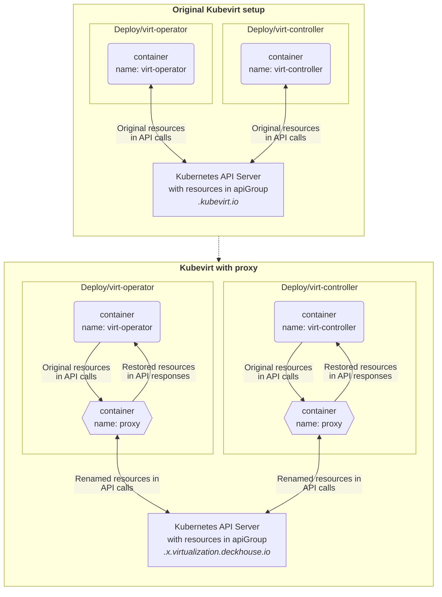
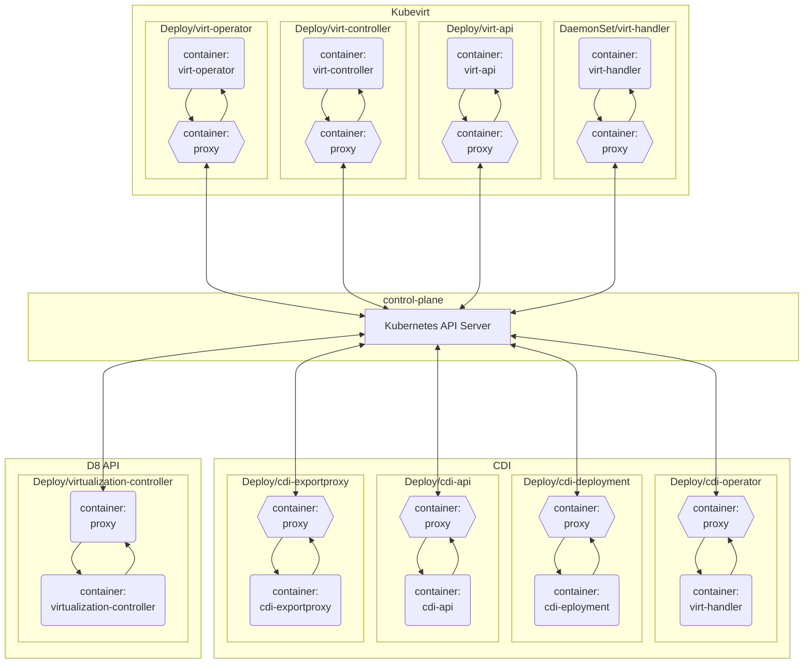
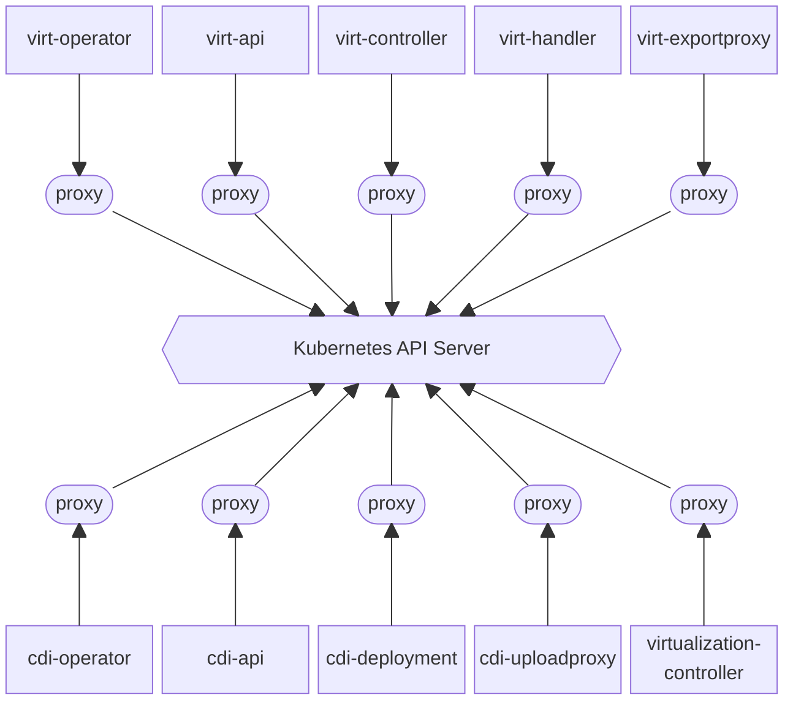
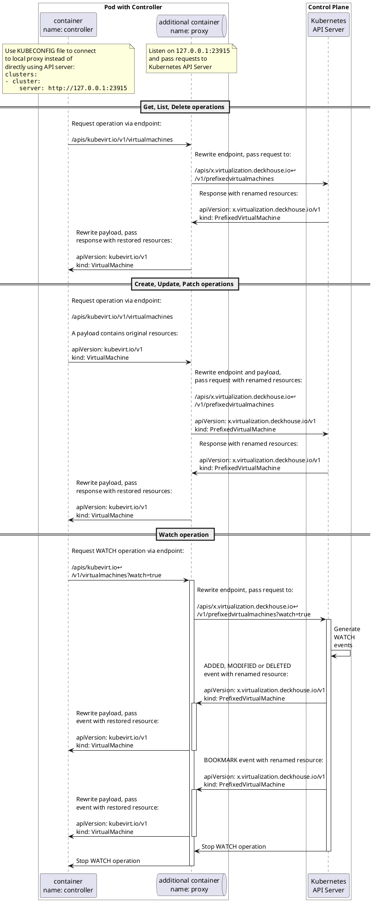
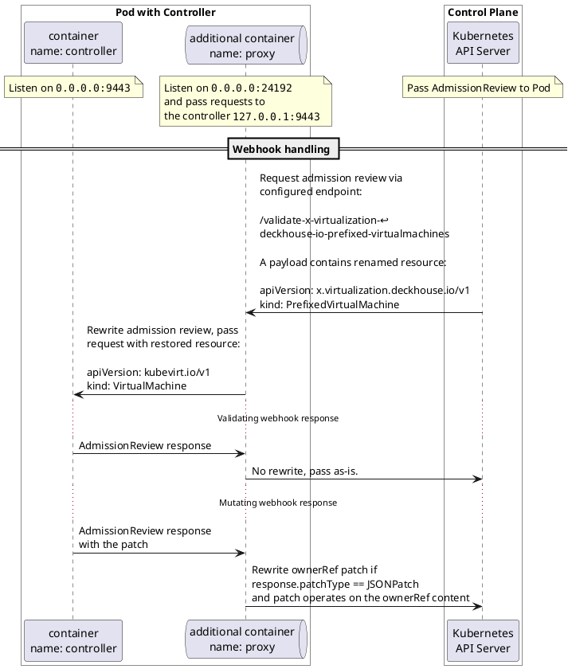
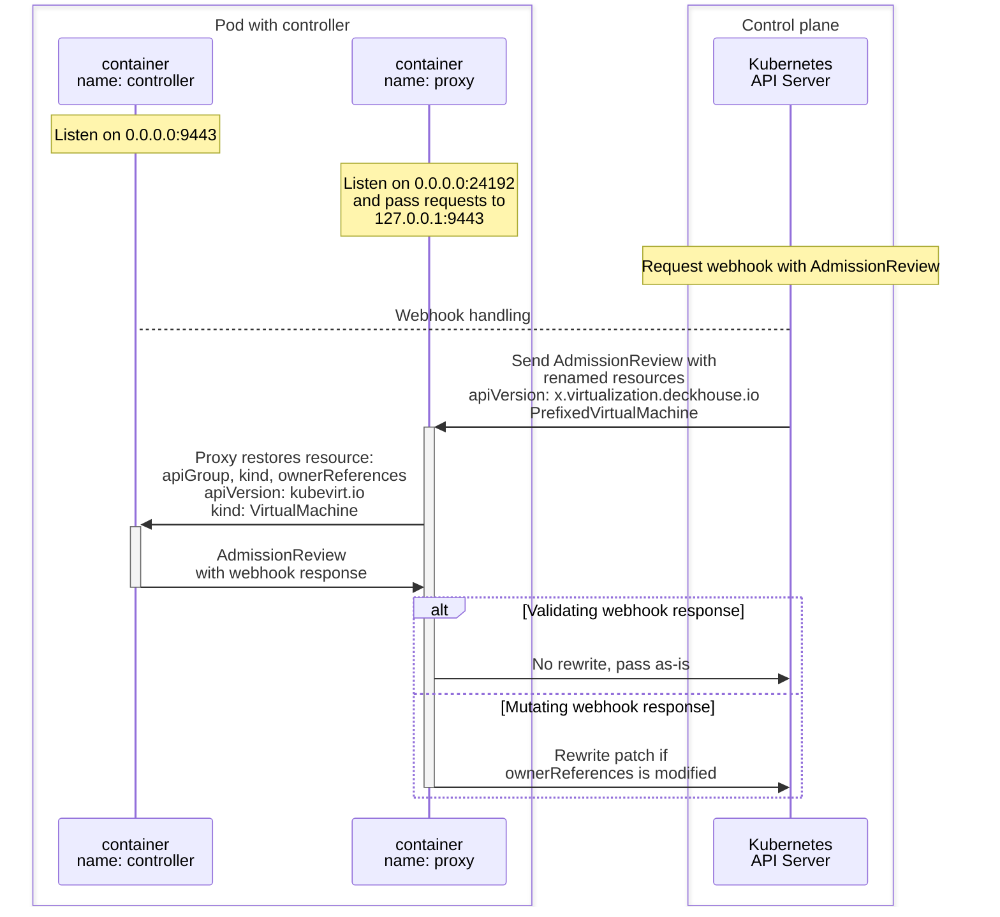

# kube-api-rewriter structure

The idea of the rewriter proxy is simple: make controller connect to the local 
proxy in the sidecar, so proxy will pass requests to real Kubernetes API Server.
Proxy may rewrite JSON payloads for different purposes, e.g. resources renaming.

Kube-api-rewriter contains 2 proxy instances:
- "api" proxy to handle usual API requests from the proxied controller to the Kubernetes API Server.
- "webhook" proxy to handle webhook requests from the Kubernetes API Server to the proxied controller.


Example setup: rename resources for Kubevirt.


All DVP components:


Variation (block diagram seems not so powerful as flowchart)


### Changes to add proxy to the Pod
- Add a ConfigMap with a simple kubeconfig points to the local proxy.
    ```
    ...
    clusters:
    - cluster:
        server: http://127.0.0.1:23915
    ...
    ```
- Add a volume and a volumeMount to pass new kubeconfig as file to the main container.
- Set KUBECONFIG variable in the main container. File should contain configuration to connect to proxy port.
  - Note: kubevirt containers use --kubeconfig flag, cdi containers use KUBECONFIG env variable.
- Add a new sidecar container with the proxy.
  - Set WEBHOOK_ADDRESS if webhook proxying is required.
  - Add volumeMount with a certificate and set WEBHOOK_CERT_FILE and WEBHOOK_KEY_FILE to use the certificate.
  - Add port 24192 to the webhook Service to use the certificate without issuing new one with changed ServerName.

## API client proxying

Implemented rewrites:
- apiGroup, kind, metadata.ownerReferences for Kubevirt and CDI Custom Resources.
- metadata.ownerReferences for Pod
- rules for Role, ClusterRole
- webhooks[].rules for ValidatingWebhookConfiguration, MutatingWebhookConfiguration
- metadata.name, spec.group, spec.names for CustomResourceDefinition.
- patch /spec for CustomResourceDefinition.
- fieldSelector=metadata.name=&watch=true for CRD.
- request.resource, request.object, request.kind, etc. for AdmissionReview.

TODO:
- labels and annotations for Kubevirt and CDI CRs and all kubevirt related resources, Nodes and Pods.
- patches in general.
- SubjectAccessReview https://dev-k8sref-io.web.app/docs/authorization/subjectaccessreview-v1/




## Webhook proxying

Kubernetes API Server connects to proxy, so proxy will pass AdmissionReview to real webhook.  Proxy may rewrite JSON payloads
for different purposes, e.g. resources renaming.

Additional changes:

- A targetPort in the webhook Service should point to proxy container.
- A proxy container should mount secret with certificates.




