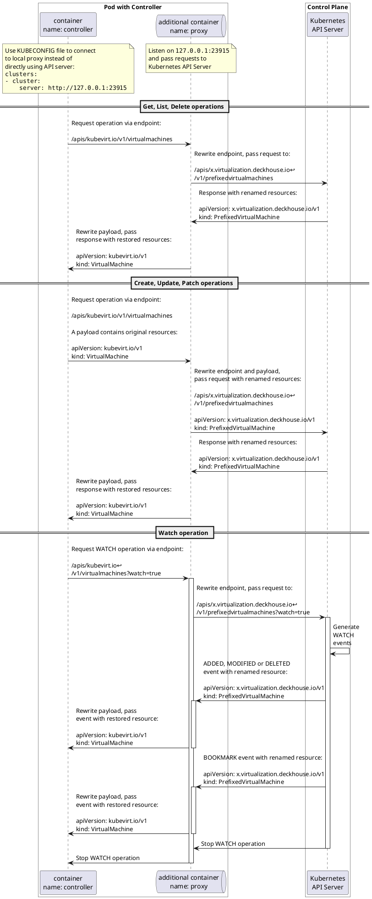
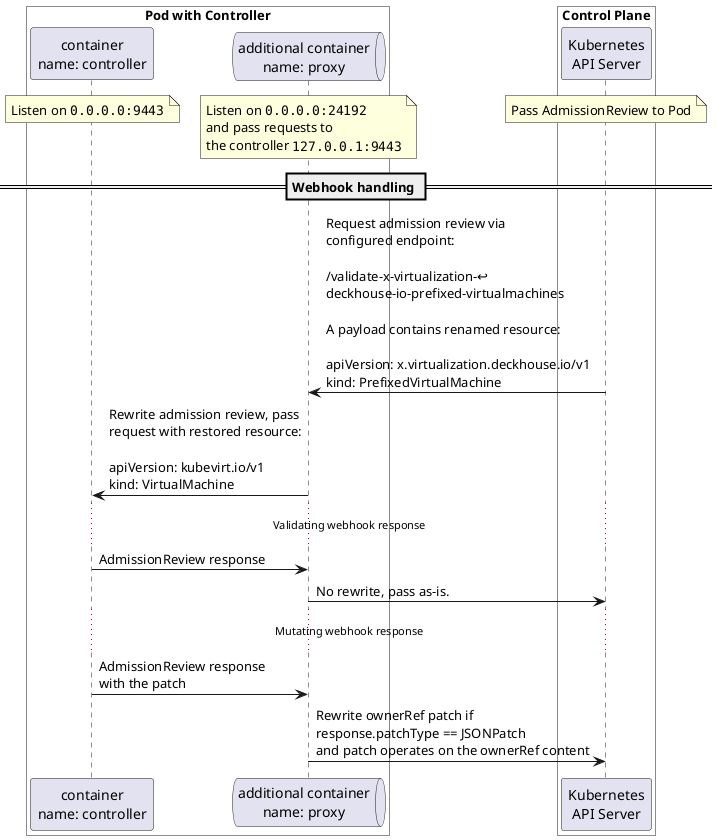

# kube-api-proxy structure

## API client proxying

The idea is simple: make controller connect to local proxy, so proxy will pass 
requests to real Kubernetes API Server. Proxy may rewrite JSON and protobuf payloads
for different purposes, e.g. resources renaming.

Pod changes:
- Add a new container with the proxy.
- Set KUBECONFIG variable in the controller container. File should contain configuration to connect to proxy port.

## Webhook proxying

Kubernetes API Server connects to proxy, so proxy will pass AdmissionReview to real webhook.  Proxy may rewrite JSON payloads
for different purposes, e.g. resources renaming.

Additional changes:

- A targetPort in the webhook Service should point to proxy container.
- A proxy container should mount secret with certificates.

